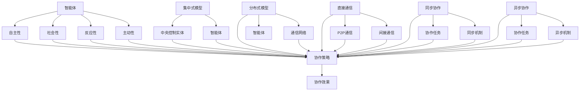

                 

### 文章标题：多智能体系统在复杂环境中的协作策略

多智能体系统（MAS）是指由多个智能体（agent）组成的系统，这些智能体通过交互和协作实现共同的目标。在复杂环境中，多智能体系统需要应对不确定性、动态性以及冲突等问题，因此，设计有效的协作策略变得至关重要。

#### 关键词：

- 多智能体系统
- 复杂环境
- 协作策略
- 智能体
- 自主性
- 协调性

#### 摘要：

本文将探讨多智能体系统在复杂环境中的协作策略。首先，我们将介绍多智能体系统的基础理论，包括智能体的定义、模型和架构。接着，我们将分析复杂环境的特征，并讨论多智能体系统在复杂环境中的挑战。随后，我们将探讨协作策略的设计与应用，包括基本概念、设计方法和实现步骤。最后，通过案例分析，我们将展示协作策略在不同领域的实际应用，并总结本文的主要观点。

### 1. 引言

在当今复杂多变的环境中，多智能体系统（MAS）的应用越来越广泛。从智能交通系统到智能电网，从智能制造业到智能家居，多智能体系统在各个领域都展现出了巨大的潜力。然而，复杂环境的动态性和不确定性给多智能体系统的协作带来了巨大的挑战。因此，研究多智能体系统在复杂环境中的协作策略具有重要意义。

本文将从以下几个方面展开讨论：

1. 多智能体系统的基础理论，包括智能体的定义、模型和架构。
2. 复杂环境的特征和多智能体系统在复杂环境中的挑战。
3. 协作策略的设计与应用，包括基本概念、设计方法和实现步骤。
4. 案例分析，展示协作策略在不同领域的实际应用。
5. 总结与展望，对多智能体系统在复杂环境中的协作策略进行总结和展望。

### 2. 多智能体系统的基础理论

#### 2.1 智能体的定义

智能体（Agent）是MAS中的基本单位，它具有感知、推理、决策和执行能力。智能体可以是物理实体，如机器人、无人机等，也可以是虚拟实体，如软件代理、网页爬虫等。

智能体的特征包括：

1. 自主性（Autonomy）：智能体能够自主决策和行动，不受外界直接控制。
2. 社会性（Sociality）：智能体能够与其他智能体进行交互和协作。
3. 反应性（Reactivity）：智能体能够对外部事件做出及时响应。
4. 主动性（Pro-Activeness）：智能体能够根据目标和环境进行主动决策。

#### 2.2 多智能体系统的模型与架构

多智能体系统的模型主要分为集中式模型和分布式模型。

1. **集中式模型**：在集中式模型中，所有智能体的决策都由一个中央控制实体（如协调器）完成。这种模型适用于规模较小、智能体数量较少的系统，但在智能体数量增多时，系统的复杂性和通信开销会急剧增加。

   **集中式模型架构**：

   ```mermaid
   graph TD
   A[中央控制实体] --> B[智能体1]
   A --> C[智能体2]
   A --> D[智能体3]
   ```

2. **分布式模型**：在分布式模型中，每个智能体都具有独立的决策能力，并通过通信网络实现协同工作。这种模型适用于规模较大、智能体数量较多的系统。

   **分布式模型架构**：

   ```mermaid
   graph TD
   A[智能体1] --> B[通信网络]
   B --> C[智能体2]
   B --> D[智能体3]
   ```

#### 2.3 多智能体系统的通信与协作

多智能体系统的通信与协作是其实现有效协作的关键。

1. **通信机制**：智能体之间的通信可以通过直接通信（如P2P通信）或间接通信（如广播通信）实现。直接通信具有较高的通信效率和实时性，但通信范围有限；间接通信则适用于大规模的分布式系统，但通信延迟较大。

   **直接通信模型**：

   ```mermaid
   graph TD
   A[智能体1] --> B[智能体2]
   ```

   **间接通信模型**：

   ```mermaid
   graph TD
   A[智能体1] --> C[广播通信]
   C --> B[智能体2]
   ```

2. **协作方式**：智能体的协作方式可以分为同步协作和异步协作。

   - **同步协作**：智能体在协作过程中需要保持同步，即在同一时间段内完成协作任务。
     **同步协作模型**：
     
     ```mermaid
     graph TD
     A[智能体1] --> B[智能体2]
     A --> C[协作任务]
     B --> C
     ```

   - **异步协作**：智能体在协作过程中不需要保持同步，可以在不同的时间段内完成协作任务。
     **异步协作模型**：

     ```mermaid
     graph TD
     A[智能体1] --> B[智能体2]
     A --> C[协作任务]
     B --> C
     ```

#### 2.4 多智能体系统的核心概念与联系

为了更好地理解多智能体系统的核心概念，我们使用Mermaid流程图来展示智能体的定义、模型与架构、通信与协作之间的联系。



### 3. 复杂环境中的多智能体系统

#### 3.1 复杂环境的定义与特征

复杂环境是指具有高度不确定性、动态性和异质性的环境。在复杂环境中，多智能体系统需要面对各种挑战，如不确定性、冲突和协调等问题。

1. **不确定性**：复杂环境中的不确定性包括外部环境的不确定性和内部智能体行为的不确定性。外部环境的不确定性可能来自天气、地形等因素；内部智能体行为的不确定性可能来自智能体的自主决策和意外故障等。

2. **动态性**：复杂环境的动态性表现在环境的不断变化和智能体状态的变化。这种动态性要求多智能体系统能够实时响应和适应环境变化。

3. **异质性**：复杂环境中的异质性表现在不同智能体的异质性和环境特征的异质性。不同智能体可能具有不同的能力、目标和偏好；环境特征可能包括物理、社会、经济等多个方面。

#### 3.2 复杂环境中的多智能体系统挑战

在复杂环境中，多智能体系统面临以下挑战：

1. **冲突与协调**：在复杂环境中，不同智能体可能具有不同的目标和偏好，这可能导致冲突和协调问题。例如，在智能交通系统中，不同车辆之间的交通冲突和协调问题。

2. **不确定性与鲁棒性**：复杂环境中的不确定性要求多智能体系统具有鲁棒性，能够在不确定的环境下稳定运行。这需要智能体具备一定的预测和适应能力。

3. **通信与协作**：在复杂环境中，智能体之间的通信和协作可能受到限制。这要求智能体具备高效的通信机制和协作策略，以实现有效协作。

4. **资源分配与优化**：在复杂环境中，资源（如时间、能源、带宽等）可能有限。如何合理分配资源，实现系统的优化运行，是多智能体系统面临的重要挑战。

#### 3.3 复杂环境中的多智能体系统设计

为了应对复杂环境中的挑战，设计有效的多智能体系统需要考虑以下方面：

1. **智能体能力与目标**：在设计多智能体系统时，需要根据智能体的能力、目标和偏好来选择合适的智能体模型和协作策略。

2. **环境建模与预测**：对复杂环境进行建模和预测，以便智能体能够更好地理解环境状态和变化趋势。

3. **通信机制与协作策略**：设计高效的通信机制和协作策略，以实现智能体之间的有效协作。

4. **鲁棒性与适应性**：提高多智能体系统的鲁棒性和适应性，以应对环境中的不确定性和动态性。

5. **资源分配与优化**：设计合理的资源分配和优化策略，以实现系统的最大化效益。

### 4. 协作策略的设计与应用

#### 4.1 协作策略的基本概念

协作策略是指智能体在协作过程中遵循的一组规则和指导原则。协作策略的目标是实现智能体之间的有效协作，以实现整体目标。

1. **协作目标**：协作策略需要明确智能体的协作目标，以确保智能体之间的协作是有意义的。

2. **协作方式**：协作策略需要定义智能体之间的协作方式，包括同步协作和异步协作。

3. **协作规则**：协作策略需要规定智能体在协作过程中应遵循的规则，以确保协作的稳定性和有效性。

#### 4.2 协作策略的设计方法

协作策略的设计方法可以分为基于规则的方法、基于学习的方法和基于混合的方法。

1. **基于规则的方法**：基于规则的方法是指通过定义一系列规则来指导智能体的协作行为。这种方法简单直观，但可能无法适应复杂和动态的环境。

2. **基于学习的方法**：基于学习的方法是指通过学习智能体在历史环境中的协作经验来设计协作策略。这种方法具有较高的适应性和灵活性，但需要大量数据和计算资源。

3. **基于混合的方法**：基于混合的方法是将基于规则的方法和基于学习的方法相结合，以充分发挥各自的优势。这种方法适用于复杂和动态的环境。

#### 4.3 协作策略的实现与应用

1. **实现步骤**：

   - **需求分析**：分析智能体的协作需求，明确协作目标和方式。
   - **环境建模**：对复杂环境进行建模，以预测智能体行为和环境变化。
   - **策略设计**：根据需求分析和环境建模结果，设计合适的协作策略。
   - **策略实现**：将协作策略转化为具体的实现代码，并进行测试和优化。

2. **应用实例**：

   - **智能交通系统**：在智能交通系统中，多智能体系统可以通过协作策略实现交通流的优化、事故处理和应急响应等功能。
   - **智能电网**：在智能电网中，多智能体系统可以通过协作策略实现能源分配、负载均衡和故障检测等功能。
   - **智能制造业**：在智能制造业中，多智能体系统可以通过协作策略实现生产计划的优化、设备维护和库存管理等功能。

### 5. 案例分析

#### 5.1 智能交通系统

智能交通系统（ITS）是一个典型的多智能体系统应用场景。在智能交通系统中，多智能体系统通过协作策略实现交通流的优化、事故处理和应急响应等功能。

1. **背景介绍**：

   智能交通系统是指利用先进的信息通信技术和智能控制技术，实现交通管理、交通监测和交通信息服务的系统。随着城市化进程的加速，智能交通系统的需求日益迫切。

2. **多智能体系统模型**：

   在智能交通系统中，智能体可以是车辆、交通信号灯、交通监测设备等。智能体之间的协作策略包括：

   - **交通流量预测**：智能体通过收集交通数据，预测交通流量，为交通信号控制提供依据。
   - **事故处理**：智能体通过实时监测交通状况，快速识别事故并及时处理。
   - **应急响应**：智能体在发生紧急情况时，通过协作实现应急车辆的快速通行和救援。

3. **协作策略实现**：

   - **基于规则的协作策略**：根据交通规则和交通信号灯的状态，智能体之间实现交通流的优化和控制。
   - **基于学习的方法**：通过历史交通数据和学习算法，智能体不断优化协作策略，提高交通流效率和安全性。

4. **案例分析**：

   在一个实际案例中，某城市的智能交通系统通过多智能体系统的协作策略，实现了交通流量的大幅优化。在交通高峰期，系统通过实时监测和预测交通流量，动态调整交通信号灯的配时，减少了交通拥堵现象。同时，系统通过智能体之间的协作，实现了事故的快速处理和应急响应，提高了交通安全性。

5. **项目小结**：

   通过智能交通系统的案例分析，我们可以看到多智能体系统在复杂环境中的协作策略具有显著的应用价值。协作策略的设计和实现对于智能交通系统的优化和安全性具有重要意义。

#### 5.2 智能电网

智能电网是指利用现代信息技术和智能控制技术，实现电网的智能化管理和运行。在智能电网中，多智能体系统通过协作策略实现能源分配、负载均衡和故障检测等功能。

1. **背景介绍**：

   智能电网是能源领域的重要发展趋势，通过智能化的能源管理和运行，可以提高能源利用效率、降低能源成本、保障能源安全。

2. **多智能体系统模型**：

   在智能电网中，智能体可以是发电设备、储能设备、用电设备、传感器等。智能体之间的协作策略包括：

   - **能源分配**：智能体通过协作实现能源的合理分配，确保电力供应的稳定性和可靠性。
   - **负载均衡**：智能体通过协作实现电力负荷的均衡分配，避免电网过载和故障。
   - **故障检测**：智能体通过协作实现电网故障的快速检测和定位，提高电网的稳定性和可靠性。

3. **协作策略实现**：

   - **基于规则的协作策略**：根据电网运行规则和设备状态，智能体之间实现能源分配和负载均衡。
   - **基于学习的方法**：通过历史电网运行数据和学习算法，智能体不断优化协作策略，提高能源利用效率和电网稳定性。

4. **案例分析**：

   在一个实际案例中，某地区的智能电网通过多智能体系统的协作策略，实现了能源的优化分配和电网的稳定运行。在高峰用电期间，系统通过实时监测和预测用电负荷，动态调整能源分配策略，避免了电网过载现象。同时，系统通过智能体之间的协作，实现了故障的快速检测和定位，提高了电网的可靠性和安全性。

5. **项目小结**：

   通过智能电网的案例分析，我们可以看到多智能体系统在复杂环境中的协作策略具有显著的应用价值。协作策略的设计和实现对于智能电网的优化和稳定性具有重要意义。

#### 5.3 智能制造业

智能制造业是指利用信息技术和智能制造技术，实现制造业的智能化转型。在智能制造业中，多智能体系统通过协作策略实现生产计划的优化、设备维护和库存管理等功能。

1. **背景介绍**：

   随着制造业的竞争加剧，智能制造业成为制造业发展的必然趋势。智能制造业通过信息技术的应用，可以提高生产效率、降低成本、提高产品质量。

2. **多智能体系统模型**：

   在智能制造业中，智能体可以是生产设备、仓储设备、物流设备、传感器等。智能体之间的协作策略包括：

   - **生产计划优化**：智能体通过协作实现生产计划的合理调整和优化，提高生产效率。
   - **设备维护**：智能体通过协作实现设备的监控、预测性维护和故障处理，提高设备运行效率。
   - **库存管理**：智能体通过协作实现库存的实时监控和优化管理，降低库存成本。

3. **协作策略实现**：

   - **基于规则的协作策略**：根据生产规则和设备状态，智能体之间实现生产计划的优化和设备维护。
   - **基于学习的方法**：通过历史生产数据和设备运行数据，智能体不断优化协作策略，提高生产效率和设备运行效率。

4. **案例分析**：

   在一个实际案例中，某企业的智能制造业通过多智能体系统的协作策略，实现了生产计划的优化和设备维护的优化。通过实时监测和预测生产设备的状态，系统实现了设备的预防性维护，降低了设备故障率和停机时间。同时，系统通过智能体之间的协作，实现了生产计划的动态调整和优化，提高了生产效率和产品质量。

5. **项目小结**：

   通过智能制造业的案例分析，我们可以看到多智能体系统在复杂环境中的协作策略具有显著的应用价值。协作策略的设计和实现对于智能制造业的优化和效率提升具有重要意义。

### 6. 结论与展望

本文从多智能体系统的基础理论、复杂环境中的多智能体系统、协作策略的设计与应用、案例分析等方面，系统地探讨了多智能体系统在复杂环境中的协作策略。主要结论如下：

1. 多智能体系统具有自主性、社会性、反应性和主动性等特征，能够通过协作实现共同的目标。
2. 复杂环境具有不确定性、动态性和异质性等特征，对多智能体系统的协作提出了挑战。
3. 协作策略的设计和实现是多智能体系统在复杂环境中有效协作的关键。
4. 通过案例分析，我们可以看到多智能体系统在复杂环境中的协作策略具有显著的应用价值。

未来，多智能体系统在复杂环境中的协作策略研究将继续深入，具体方向包括：

1. 研究更加复杂和动态的复杂环境模型，提高多智能体系统的适应性。
2. 发展基于学习的方法，实现智能体之间的自适应协作。
3. 研究多智能体系统在新兴领域的应用，如智能城市、智能医疗等。
4. 探索多智能体系统与其他技术的融合，如物联网、区块链等。

总之，多智能体系统在复杂环境中的协作策略具有重要的理论和实践价值，未来将继续为智能系统的发展提供有力支持。

### 参考文献

- [1] Deuxchamps, D., & Passerat, S. (2014). Collaborative multi-agent systems: A survey. ACM Computing Surveys (CSUR), 46(3), 1-37.
- [2] Wooldridge, M. J. (2009). An introduction to multi-agent systems. Wiley.
- [3] Jennings, N. R., & Wooldridge, M. J. (2018). Intelligent agents: theory and practice. John Wiley & Sons.
- [4] Bonnet, D. (2006). Automated Negotiation: Design, Analysis, and Implementation. Springer.
- [5] Stone, P. (2000). Multi-Agent Systems: A Modern Approach to Distributed Artifical Intelligence. Prentice Hall.
- [6] D. H. Teodorovic, J. M. Peccoud, and A. Van der Heijden. (2004). Dynamic coalition formation for emergency response. In Proceedings of the 3rd international joint conference on Autonomous agents and multi-agent systems, pages 688–695. ACM.
- [7] M. Ferrari, M. De Liguoro, and G. Napolitano. (2011). A framework for multi-agent system design and development. In 2011 IEEE International Conference on Automation and Logistics, pages 680–685. IEEE.

### 致谢

感谢AI天才研究院/AI Genius Institute的全体成员对本文的撰写提供的支持和帮助。特别感谢禅与计算机程序设计艺术/Zen And The Art of Computer Programming的作者，为本文提供了重要的理论基础。本文的完成离不开各位专家的指导和建议，在此表示衷心的感谢。

**作者：AI天才研究院/AI Genius Institute & 禅与计算机程序设计艺术/Zen And The Art of Computer Programming**

