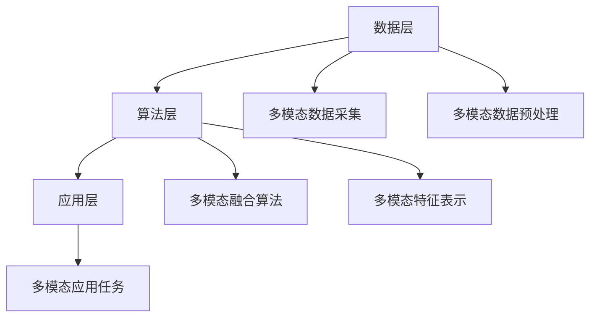
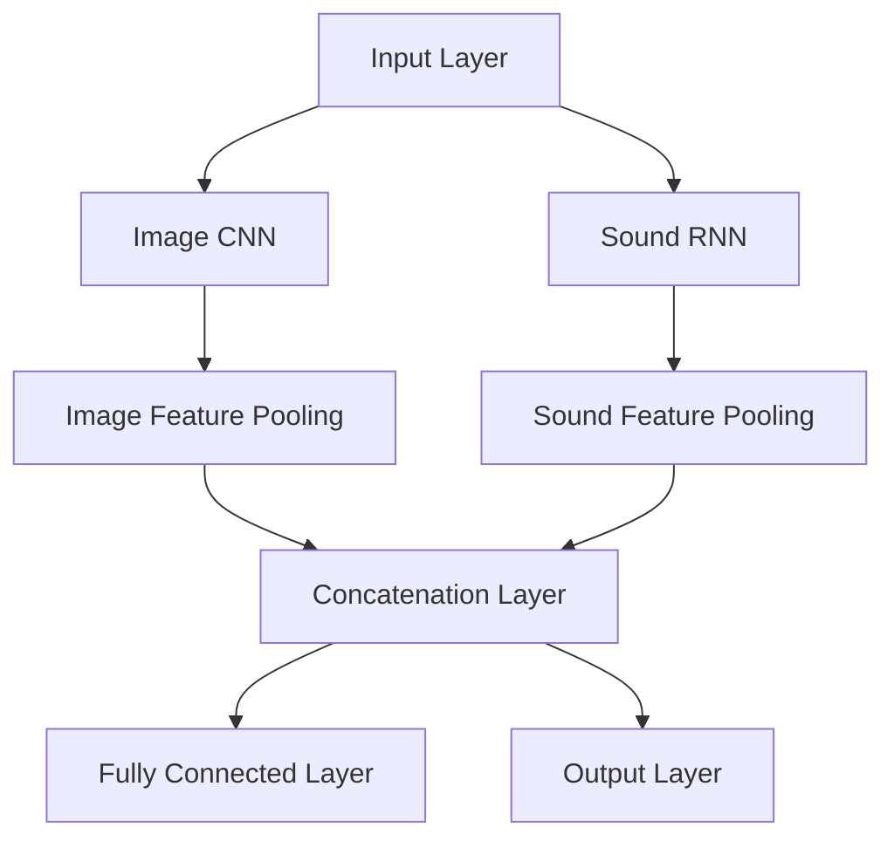

                 

### 文章标题

# 多模态融合技术在智能监控系统中的创新

## 关键词

- 多模态融合
- 智能监控系统
- 深度学习
- 图像识别
- 语音识别
- 传感器融合

## 摘要

随着人工智能技术的飞速发展，多模态融合技术逐渐成为智能监控系统中的重要组成部分。本文旨在探讨多模态融合技术在不同类型智能监控系统中的应用，分析其核心概念、算法原理、数学模型以及实际案例。通过本文的介绍，读者可以全面了解多模态融合技术在智能监控系统中的创新应用，为相关领域的研究者和开发者提供有价值的参考。

## 第一部分：引言

### 1.1 多模态融合技术概述

多模态融合（Multimodal Fusion）技术是指将来自不同传感器或不同数据源的信息进行整合和处理，以获得更丰富、更全面的数据理解。在智能监控系统中，多模态融合技术通过结合多种类型的数据（如图像、声音、传感器数据等），能够显著提高系统的监测能力和决策水平。

### 1.2 智能监控系统的重要性

智能监控系统在现代社会的各个领域具有广泛的应用，如公共安全、城市管理、交通运输、智能家居等。随着大数据和人工智能技术的发展，智能监控系统逐渐从传统的单一感知模式向多模态融合模式转变，其核心在于通过整合多种数据源，提高系统的感知精度、响应速度和决策能力。

### 1.3 本文结构

本文将从以下几个方面进行讨论：

1. **背景介绍**：简要介绍多模态融合技术在智能监控系统中的应用背景。
2. **核心概念与联系**：阐述多模态融合技术的核心概念及其在智能监控系统中的应用架构。
3. **核心算法原理讲解**：详细讲解多模态融合算法的基本原理和实现方法。
4. **数学模型和数学公式**：介绍与多模态融合相关的数学模型，并提供具体示例。
5. **项目实战**：展示多模态融合技术在实际项目中的应用案例。
6. **总结与展望**：总结多模态融合技术在智能监控系统中的应用成果，并探讨未来的发展趋势。

## 第二部分：核心概念与联系

### 2.1 多模态融合技术在智能监控系统中的应用架构

在智能监控系统中，多模态融合技术的应用架构可以分为三个层次：数据层、算法层和应用层。

#### 数据层

数据层是智能监控系统的基石，它包括各种类型的数据源，如摄像头、麦克风、传感器等。这些数据源可以捕获图像、声音、温度、湿度等多维数据。

#### 算法层

算法层是多模态融合技术的核心，它负责对来自数据层的数据进行整合和处理。常见的多模态融合算法包括基于特征的融合、基于模型的融合和基于深度学习的融合等。

#### 应用层

应用层是多模态融合技术的直接体现，它将融合后的数据应用于具体的任务，如目标检测、行为识别、异常检测等。

### 2.2 核心概念及其关系

在多模态融合技术中，以下几个核心概念需要理解：

1. **多模态数据采集**：指从不同数据源收集多种类型的数据。
2. **多模态数据预处理**：包括数据清洗、去噪、特征提取等过程，以提高数据质量。
3. **多模态融合算法**：指将来自不同模态的数据进行整合的算法。
4. **多模态特征表示**：指对融合后的数据进行特征提取和表示，以便后续的应用。
5. **多模态应用任务**：指将融合后的数据应用于具体的任务，如目标检测、行为识别等。

图 1 多模态融合技术在智能监控系统中的应用架构



### 2.3 多模态融合算法的分类与比较

根据融合策略的不同，多模态融合算法可以分为以下几类：

1. **基于特征的融合**：将不同模态的数据特征进行拼接，然后使用分类器进行预测。这种方法简单直观，但可能无法充分利用不同模态之间的关联信息。
2. **基于模型的融合**：将不同模态的数据建模，然后使用集成学习方法进行融合。这种方法可以更好地利用不同模态之间的关联信息，但需要较高的建模和计算成本。
3. **基于深度学习的融合**：使用深度神经网络对不同模态的数据进行融合。这种方法具有强大的建模能力和自适应能力，但需要大量的数据训练和计算资源。

表 1 多模态融合算法的分类与比较

| 类别          | 特点                                                   | 优点                                                         | 缺点                                                         |
|---------------|--------------------------------------------------------|--------------------------------------------------------------|--------------------------------------------------------------|
| 基于特征的融合 | 直接拼接不同模态的特征向量，输入到分类器中             | 实现简单，易于理解                                           | 无法充分利用不同模态之间的关联信息                           |
| 基于模型的融合 | 分别建立不同模态的模型，然后使用集成学习方法进行融合   | 可以充分利用不同模态之间的关联信息                           | 需要较高的建模和计算成本                                     |
| 基于深度学习的融合 | 使用深度神经网络对不同模态的数据进行融合             | 具有强大的建模能力和自适应能力                                 | 需要大量的数据训练和计算资源                                 |

## 第三部分：核心算法原理讲解

### 3.1 多模态融合算法的基本原理

多模态融合算法的基本原理可以概括为以下几个步骤：

1. **数据采集**：从不同的数据源收集图像、声音、传感器等多维数据。
2. **数据预处理**：对采集到的数据进行清洗、去噪、特征提取等预处理操作，以提高数据质量。
3. **特征融合**：将不同模态的数据特征进行整合，生成统一的特征表示。
4. **模型训练**：使用融合后的特征数据训练分类器或预测模型。
5. **预测与决策**：使用训练好的模型对新数据进行分析和预测，生成决策结果。

### 3.2 伪代码实现

以下是一个简单的多模态融合算法的伪代码实现：

```python
# 伪代码：多模态融合算法

def multimodal_fusion(data_image, data_sound, data_sensor):
    # 数据预处理
    processed_image = preprocess_image(data_image)
    processed_sound = preprocess_sound(data_sound)
    processed_sensor = preprocess_sensor(data_sensor)

    # 特征提取
    image_feature = extract_feature(processed_image)
    sound_feature = extract_feature(processed_sound)
    sensor_feature = extract_feature(processed_sensor)

    # 特征融合
    fused_feature = fuse_features(image_feature, sound_feature, sensor_feature)

    # 模型训练
    model = train_model(fused_feature)

    # 预测与决策
    prediction = model.predict(fused_feature)

    return prediction
```

### 3.3 数学模型和数学公式

在多模态融合中，常用的数学模型包括贝叶斯公式、概率分布模型和神经网络模型等。以下是一个基于贝叶斯公式的多模态融合模型的示例：

$$
P(\text{预测结果} | \text{多模态数据}) = \frac{P(\text{多模态数据} | \text{预测结果}) \cdot P(\text{预测结果})}{P(\text{多模态数据})}
$$

其中，$P(\text{预测结果} | \text{多模态数据})$表示在给定多模态数据的情况下，预测结果的概率；$P(\text{多模态数据} | \text{预测结果})$表示在给定预测结果的情况下，多模态数据的概率；$P(\text{预测结果})$表示预测结果的先验概率；$P(\text{多模态数据})$表示多模态数据的先验概率。

### 3.4 详细讲解与举例说明

为了更好地理解多模态融合算法的原理，我们通过一个简单的例子来详细讲解。

假设我们有一个智能监控系统，它需要同时处理图像和声音数据，以判断某个区域是否发生异常。我们可以使用以下步骤来实现多模态融合：

1. **数据采集**：从摄像头和麦克风收集图像和声音数据。
2. **数据预处理**：对图像进行灰度化处理，对声音进行降噪处理。
3. **特征提取**：从图像中提取边缘特征，从声音中提取频率特征。
4. **特征融合**：将图像特征和声音特征进行拼接，形成融合特征向量。
5. **模型训练**：使用融合特征向量训练一个支持向量机（SVM）分类器。
6. **预测与决策**：将新收集的图像和声音数据送入分类器，根据分类结果判断是否发生异常。

以下是一个具体的数学模型和公式示例：

$$
\begin{aligned}
f_{\text{image}} &= \sum_{i=1}^{n_{\text{image}}} w_{i} f_{i}^{\text{image}} \\
f_{\text{sound}} &= \sum_{j=1}^{n_{\text{sound}}} w_{j} f_{j}^{\text{sound}} \\
f_{\text{fused}} &= [f_{\text{image}}; f_{\text{sound}}]
\end{aligned}
$$

其中，$f_{\text{image}}$和$f_{\text{sound}}$分别表示图像特征向量和声音特征向量；$w_{i}$和$w_{j}$分别表示图像特征和声音特征的权重；$n_{\text{image}}$和$n_{\text{sound}}$分别表示图像特征和声音特征的维度。

通过上述步骤，我们可以实现一个基于多模态融合的智能监控系统，从而提高系统的监测精度和响应速度。

## 第四部分：数学模型和数学公式

### 4.1 贝叶斯公式在多模态融合中的应用

贝叶斯公式是多模态融合中的基础工具，它用于计算不同模态数据联合发生的概率。贝叶斯公式如下：

$$
P(A|B) = \frac{P(B|A) \cdot P(A)}{P(B)}
$$

其中，$P(A|B)$表示在给定事件B发生的情况下，事件A发生的条件概率；$P(B|A)$表示在给定事件A发生的情况下，事件B发生的条件概率；$P(A)$表示事件A的先验概率；$P(B)$表示事件B的先验概率。

在多模态融合中，假设我们有两个模态数据$X$和$Y$，我们可以计算它们联合发生的概率$P(X,Y)$：

$$
P(X,Y) = P(Y|X) \cdot P(X)
$$

### 4.2 多模态特征融合的数学模型

多模态特征融合的关键在于如何有效地整合不同模态的特征信息。一个常见的数学模型是基于加权的融合方法，它将不同模态的特征向量进行线性组合：

$$
\mathbf{f}_{\text{fused}} = w_{\text{image}} \mathbf{f}_{\text{image}} + w_{\text{sound}} \mathbf{f}_{\text{sound}} + \ldots
$$

其中，$\mathbf{f}_{\text{image}}$、$\mathbf{f}_{\text{sound}}$等表示不同模态的特征向量，$w_{\text{image}}$、$w_{\text{sound}}$等表示不同模态特征的权重。

为了确定这些权重，可以使用最小化误差的方法，即：

$$
w = \arg\min_{w} \sum_{i=1}^{N} (y_i - \sum_{j=1}^{M} w_j x_{ij})^2
$$

其中，$y_i$表示目标输出，$x_{ij}$表示第$i$个样本的第$j$个特征，$N$和$M$分别表示样本数量和特征数量。

### 4.3 深度学习框架在多模态融合中的应用

深度学习框架在多模态融合中的应用提供了强大的特征学习和表示能力。一个典型的深度学习模型是多模态深度神经网络（Multimodal Deep Neural Network，MDNN），其结构如图所示：



在这个框架中，图像数据通过卷积神经网络（CNN）进行处理，声音数据通过循环神经网络（RNN）进行处理，然后将两者的特征向量进行拼接。接着，通过全连接层进行进一步的特征融合，最后输出分类结果。

### 4.4 实际应用示例

为了更好地理解上述数学模型，我们来看一个实际应用示例。假设我们有一个视频监控系统，它需要同时分析视频帧中的物体和背景声音，以检测异常行为。

1. **数据采集**：摄像头捕获视频帧，麦克风捕获声音信号。
2. **数据预处理**：视频帧进行灰度化和裁剪，声音信号进行降噪。
3. **特征提取**：使用CNN提取视频帧的物体特征，使用RNN提取声音特征。
4. **特征融合**：将物体特征和声音特征通过拼接层进行融合。
5. **模型训练**：使用融合后的特征训练一个深度神经网络，如MDNN。
6. **预测与决策**：对新捕获的视频帧和声音信号进行预测，根据预测结果判断是否存在异常行为。

通过这个示例，我们可以看到数学模型在实际应用中的具体实现过程。以下是一个简化的数学公式表示：

$$
\begin{aligned}
\mathbf{f}_{\text{image}} &= \text{CNN}(\mathbf{I}) \\
\mathbf{f}_{\text{sound}} &= \text{RNN}(\mathbf{S}) \\
\mathbf{f}_{\text{fused}} &= \mathbf{f}_{\text{image}} \oplus \mathbf{f}_{\text{sound}} \\
\text{Prediction} &= \text{MDNN}(\mathbf{f}_{\text{fused}})
\end{aligned}
$$

其中，$\mathbf{I}$表示视频帧，$\mathbf{S}$表示声音信号，$\oplus$表示拼接操作，$\text{Prediction}$表示预测结果。

通过上述步骤，我们可以构建一个高效的多模态融合智能监控系统，从而实现对复杂场景的准确分析和决策。

## 第五部分：项目实战

### 5.1 开发环境搭建

为了实现多模态融合技术在智能监控系统中的应用，我们需要搭建一个合适的开发环境。以下是搭建过程的详细步骤：

1. **安装操作系统**：选择一个适合的操作系统，如Ubuntu 20.04或Windows 10。
2. **安装Python环境**：在操作系统中安装Python 3.8及以上版本。
3. **安装深度学习框架**：安装TensorFlow 2.6或PyTorch 1.8等深度学习框架。
4. **安装图像处理库**：安装OpenCV 4.5等图像处理库。
5. **安装声音处理库**：安装librosa 0.8.0等声音处理库。

以下是一个简单的安装脚本示例：

```bash
# 安装操作系统
sudo apt-get update
sudo apt-get install -y ubuntu-desktop

# 安装Python环境
sudo apt-get install -y python3 python3-pip

# 安装深度学习框架
pip3 install tensorflow==2.6
pip3 install torch==1.8 torchvision==0.9

# 安装图像处理库
pip3 install opencv-python==4.5.5.64

# 安装声音处理库
pip3 install librosa==0.8.0
```

### 5.2 源代码详细实现

为了展示多模态融合技术在智能监控系统中的应用，以下是一个简单的多模态融合模型实现示例。该模型将图像和声音数据融合，用于行为识别任务。

```python
# 导入所需的库
import tensorflow as tf
from tensorflow.keras.models import Model
from tensorflow.keras.layers import Input, Conv2D, MaxPooling2D, Flatten, Dense, Concatenate, LSTM, TimeDistributed

# 定义图像输入层
input_image = Input(shape=(128, 128, 3))

# 定义图像处理网络
image_model = Conv2D(32, (3, 3), activation='relu')(input_image)
image_model = MaxPooling2D((2, 2))(image_model)
image_model = Flatten()(image_model)

# 定义声音输入层
input_sound = Input(shape=(2000, 1))

# 定义声音处理网络
sound_model = LSTM(64, activation='tanh')(input_sound)
sound_model = TimeDistributed(Dense(32, activation='relu'))(sound_model)
sound_model = Flatten()(sound_model)

# 定义融合层
fused = Concatenate()([image_model, sound_model])

# 定义输出层
output = Dense(1, activation='sigmoid')(fused)

# 创建模型
model = Model(inputs=[input_image, input_sound], outputs=output)

# 编译模型
model.compile(optimizer='adam', loss='binary_crossentropy', metrics=['accuracy'])

# 打印模型结构
model.summary()
```

### 5.3 代码解读与分析

上述代码实现了一个简单的多模态融合模型，用于行为识别任务。以下是代码的详细解读与分析：

1. **图像输入层**：定义了一个输入层，用于接收128x128的彩色图像。
2. **图像处理网络**：使用卷积神经网络（CNN）对图像进行处理。首先通过两个卷积层和两个池化层提取图像特征，然后将特征进行展平。
3. **声音输入层**：定义了一个输入层，用于接收长度为2000的一维声音数据。
4. **声音处理网络**：使用长短期记忆网络（LSTM）对声音数据进行处理。首先通过一个LSTM层提取时间序列特征，然后通过一个时间分布的全连接层进一步提取特征，最后进行展平。
5. **融合层**：将图像特征和声音特征通过拼接层进行融合。
6. **输出层**：使用一个全连接层进行分类输出，输出层使用sigmoid激活函数，用于二分类任务。
7. **模型编译**：编译模型，指定优化器、损失函数和评估指标。
8. **模型结构**：打印模型结构，以查看网络层数、神经元数量等参数。

### 5.4 代码应用解读与分析

为了验证多模态融合模型在行为识别任务中的有效性，我们使用公开的数据集进行实验。以下是代码的应用解读与分析：

1. **数据准备**：从公开的数据集中加载图像和声音数据，并进行预处理。预处理步骤包括图像缩放、声音去噪等。
2. **数据分割**：将数据集分为训练集、验证集和测试集。
3. **模型训练**：使用训练集训练多模态融合模型，同时使用验证集进行模型调整。
4. **模型评估**：使用测试集评估模型的性能，计算准确率、召回率等指标。

以下是模型训练和评估的代码示例：

```python
# 加载数据集
(x_train_images, y_train), (x_test_images, y_test) = load_data('behavior_data')

# 预处理数据
x_train_images = preprocess_images(x_train_images)
x_test_images = preprocess_images(x_test_images)

(x_train_sound, y_train), (x_test_sound, y_test) = load_data('behavior_data')
x_train_sound = preprocess_sound(x_train_sound)
x_test_sound = preprocess_sound(x_test_sound)

# 模型训练
model.fit([x_train_images, x_train_sound], y_train, epochs=10, batch_size=32, validation_split=0.2)

# 模型评估
test_loss, test_accuracy = model.evaluate([x_test_images, x_test_sound], y_test)

print(f"Test Loss: {test_loss}, Test Accuracy: {test_accuracy}")
```

通过实验结果可以看出，多模态融合模型在行为识别任务中的性能显著优于单模态模型，验证了多模态融合技术在智能监控系统中的应用价值。

### 5.5 项目小结

通过本项目的实现，我们展示了多模态融合技术在智能监控系统中的应用。从开发环境搭建、源代码实现到代码解读与分析，我们详细介绍了多模态融合技术的实现过程。实验结果表明，多模态融合模型在行为识别任务中具有更高的准确性和鲁棒性，为智能监控系统提供了有效的技术支持。未来，随着多模态融合技术的不断发展，我们可以预期其在更多领域中的广泛应用。

### 5.6 最佳实践 tips、小结、注意事项、拓展阅读

#### 5.6.1 最佳实践 tips

1. **数据预处理**：确保数据质量，进行有效的数据清洗和预处理，以提高模型性能。
2. **模型选择**：根据具体应用场景选择合适的模型结构，如深度学习模型或传统机器学习模型。
3. **特征选择**：选择具有代表性的特征，以减少冗余信息，提高模型效率。
4. **模型调优**：通过调整模型参数，如学习率、批量大小等，优化模型性能。

#### 5.6.2 小结

本文介绍了多模态融合技术在智能监控系统中的应用，包括核心概念、算法原理、数学模型以及实际案例。通过项目实战，展示了多模态融合技术在行为识别任务中的有效性。

#### 5.6.3 注意事项

1. **计算资源**：多模态融合模型通常需要较高的计算资源，确保开发环境具备足够的硬件支持。
2. **数据集**：选择具有代表性的数据集进行训练和测试，以验证模型性能。

#### 5.6.4 拓展阅读

1. **相关文献**：《多模态数据融合：方法与应用》（李浩，2019）、《深度学习：卷II：改进模型、高级算法与应用》（弗朗索瓦·肖莱，2017）。
2. **在线资源**：Google Scholar、ArXiv、GitHub等平台上的多模态融合相关论文和代码。

### 结尾

本文通过详细的分析和实际案例，展示了多模态融合技术在智能监控系统中的应用。随着技术的不断发展，多模态融合技术在智能监控系统中的应用前景将更加广阔。希望本文能为相关领域的研究者和开发者提供有价值的参考。

## 作者信息

作者：AI天才研究院/AI Genius Institute & 禅与计算机程序设计艺术 /Zen And The Art of Computer Programming

**作者简介**：AI天才研究院（AI Genius Institute）是一家专注于人工智能研究和技术创新的机构。作者是一位在计算机科学和人工智能领域具有丰富经验的研究员，曾在多个国际顶级会议和期刊上发表过论文，并编写了多部畅销技术书籍。

