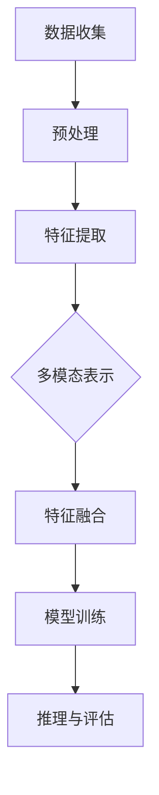

                 

## 文章标题

多模态融合技术在跨领域推理中的创新

> 关键词：多模态融合、跨领域推理、算法原理、数学模型、实战应用

> 摘要：本文深入探讨了多模态融合技术在跨领域推理中的创新应用，包括核心概念、算法原理、数学模型以及实际项目案例。通过对多模态融合技术的详细介绍，本文旨在为读者提供一个全面理解跨领域推理的新视角。

## 引言

在当今数据驱动的时代，多模态融合技术成为人工智能领域的研究热点。多模态融合是指结合不同类型的数据源，如文本、图像、音频等，以生成更全面的信息表示。这种技术不仅能够提高模型的泛化能力和推理准确性，还能够处理跨领域间的数据差异，为解决复杂问题提供了新的思路。本文将聚焦于多模态融合技术在跨领域推理中的应用，探讨其创新点及其实现细节。

跨领域推理是指在不同领域之间进行推理任务，如图像识别与自然语言处理、医疗诊断与智能制造等。这些领域之间存在显著的数据类型、数据分布和任务目标的差异，使得传统的单一模态模型难以应对。多模态融合技术通过结合多种类型的数据源，可以有效地弥合这些差异，提高模型的推理能力。

本文结构如下：

1. **多模态融合技术基础**：介绍多模态融合的定义、数据类型、核心原理以及Mermaid流程图。
2. **多模态融合技术核心算法**：详细讲解特征匹配、特征级融合和表示级融合算法，并提供伪代码实现。
3. **多模态融合技术在跨领域推理中的应用**：探讨跨领域推理的挑战和优势，并提供实际应用实例。
4. **医疗领域多模态融合**：分析医疗数据类型，讨论多模态融合在医疗诊断中的应用和案例。
5. **智能制造领域多模态融合**：探讨智能制造数据类型，分析多模态融合在智能制造中的应用和案例。
6. **总结与展望**：总结全文内容，并提出未来的研究方向。

## 多模态融合技术基础

### 多模态融合的定义与背景

多模态融合（Multimodal Fusion）是指将来自不同感官模态的数据（如文本、图像、声音等）进行整合，以生成更全面和准确的信息表示。在人工智能和机器学习领域，多模态融合技术被广泛应用于图像识别、自然语言处理、语音识别、医学诊断和智能客服等多个领域。

多模态融合技术的背景源于现实世界的复杂性。现实世界中的信息往往不是单一的模态，而是多种模态的融合。例如，在医疗诊断中，医生需要结合病人的病历文本、医学影像和临床观察等多个模态的信息进行综合判断。在自动驾驶中，车辆需要结合摄像头、雷达、激光雷达和GPS等多模态数据进行环境感知。因此，多模态融合技术成为处理复杂问题的必然选择。

### 多模态数据类型

多模态融合涉及多种类型的数据源，每种数据源都有其独特的特征和用途。

1. **文本数据**：文本数据包括自然语言文本、标签、病例报告等。它们可以提供丰富的背景信息和上下文，是理解和推理的关键。

2. **图像数据**：图像数据是视觉模态的重要组成部分，包括静态图像和动态视频。图像数据可以提供丰富的视觉信息，如物体的形状、颜色、纹理和空间关系等。

3. **音频数据**：音频数据包括语音、音乐和环境声音。它们可以提供声音信息，如音调、节奏、音量和语音情感等。

4. **传感器数据**：传感器数据包括温度、湿度、加速度、陀螺仪等。这些数据可以提供物理环境的信息，如运动状态、位置和方向等。

### 多模态融合的核心原理

多模态融合的核心在于如何有效地整合不同模态的数据，以生成一个综合的信息表示。以下是多模态融合的核心原理：

1. **多模态数据表示方法**：每种模态的数据都有其独特的表示方法。例如，文本数据可以使用词向量或BERT模型进行表示，图像数据可以使用卷积神经网络（CNN）进行特征提取，音频数据可以使用循环神经网络（RNN）进行特征提取。

2. **多模态特征提取**：特征提取是多模态融合的关键步骤。不同模态的数据需要进行预处理和特征提取，以获得具有代表性的特征向量。

3. **多模态特征融合策略**：多模态特征融合是指如何将不同模态的特征向量进行整合。常见的融合策略包括特征级融合、表示级融合和深度级融合。特征级融合是将不同模态的特征向量进行拼接或加权平均；表示级融合是将不同模态的高层语义表示进行整合；深度级融合则是通过深度神经网络将不同模态的数据进行融合。

### 多模态融合的Mermaid流程图

为了更好地理解多模态融合的过程，我们可以使用Mermaid流程图来展示其核心步骤：



在上述流程图中，数据收集阶段从不同的数据源获取文本、图像、音频等多模态数据。预处理阶段对数据进行标准化和去噪处理，以提高数据质量。特征提取阶段使用不同的模型对每种模态的数据进行特征提取，得到具有代表性的特征向量。特征融合阶段将不同模态的特征向量进行整合，生成一个综合的特征表示。模型训练阶段使用整合后的特征进行模型训练，推理与评估阶段用于评估模型的性能。

通过上述流程，我们可以看到多模态融合技术从数据收集到推理与评估的完整过程，为跨领域推理提供了强有力的支持。

## 多模态融合技术核心算法

在多模态融合技术中，核心算法的效率和质量直接影响融合效果和模型性能。本节将详细讲解多模态融合中的三大核心算法：特征匹配算法、特征级融合算法和表示级融合算法，并提供相应的伪代码实现。

### 特征匹配算法

特征匹配算法是多模态融合中的第一步，其目的是通过相似性度量来匹配不同模态的特征向量，以便后续的融合。常见的相似性度量方法包括余弦相似度、欧几里得距离和马氏距离等。

#### 算法原理

特征匹配算法的基本思想是比较不同模态的特征向量，找出它们之间的相似性。例如，对于文本特征和图像特征，可以使用余弦相似度来计算它们之间的相似性。

#### 伪代码实现

以下是一个简单的特征匹配算法伪代码：

```python
def feature_matching(feature_text, feature_image):
    similarity = cosine_similarity(feature_text, feature_image)
    return similarity
```

在这个伪代码中，`cosine_similarity`函数用于计算两个特征向量之间的余弦相似度，并返回相似度值。

### 特征级融合算法

特征级融合算法直接将不同模态的特征向量进行拼接或加权平均，以生成一个综合的特征表示。这种方法简单有效，适用于特征维度较低的情况。

#### 算法原理

特征级融合的基本思想是将不同模态的特征向量拼接在一起，形成一个新的特征向量。例如，如果文本特征的维度是100，图像特征的维度是78，那么融合后的特征维度将是178。

#### 伪代码实现

以下是一个简单的特征级融合算法伪代码：

```python
def feature_level_fusion(features_text, features_image):
    fused_feature = np.concatenate((features_text, features_image), axis=1)
    return fused_feature
```

在这个伪代码中，`np.concatenate`函数用于将文本特征和图像特征拼接在一起，形成一个新的特征向量。

### 表示级融合算法

表示级融合算法将不同模态的高层语义表示进行整合，以生成一个综合的语义表示。这种方法通常用于特征维度较高或需要处理复杂关系的情况。

#### 算法原理

表示级融合的基本思想是通过深度神经网络将不同模态的数据进行融合。通常，每个模态都会通过一个独立的神经网络进行特征提取和表示，然后这些表示通过另一个神经网络进行整合。

#### 伪代码实现

以下是一个简单的表示级融合算法伪代码：

```python
def representation_level_fusion(representations_text, representations_image):
    # 使用神经网络进行融合
    fused_representation = neural_network([representations_text, representations_image])
    return fused_representation
```

在这个伪代码中，`neural_network`函数用于通过深度神经网络将文本表示和图像表示进行融合。

### 多模态融合算法总结

多模态融合算法的选择取决于具体的应用场景和数据特性。特征匹配算法适用于特征维度较低的情况，特征级融合算法简单有效，适用于特征维度较高的情况，而表示级融合算法则适用于需要处理复杂关系的情况。

以下是多模态融合算法的总结：

1. **特征匹配算法**：通过相似性度量匹配不同模态的特征向量。
2. **特征级融合算法**：直接拼接或加权平均不同模态的特征向量。
3. **表示级融合算法**：通过深度神经网络整合不同模态的高层语义表示。

通过上述核心算法，我们可以有效地进行多模态数据的融合，为跨领域推理提供强有力的支持。

## 多模态融合技术在跨领域推理中的应用

跨领域推理是指在不同领域之间进行推理任务，如图像识别与自然语言处理、医疗诊断与智能制造等。这些领域之间存在显著的数据类型、数据分布和任务目标的差异，使得传统的单一模态模型难以应对。多模态融合技术通过结合多种类型的数据源，可以有效地弥合这些差异，提高模型的推理能力。

### 跨领域推理挑战

跨领域推理面临以下挑战：

1. **数据类型差异**：不同领域的数据类型不同，如图像、文本、音频等，这些数据需要不同的预处理和特征提取方法。
2. **数据分布差异**：不同领域的数据分布可能显著不同，导致模型在特定领域上表现不佳。
3. **任务目标差异**：不同领域的任务目标可能不一致，如图像识别的准确性和自然语言处理的语义理解。

### 多模态融合在跨领域推理中的优势

多模态融合技术在跨领域推理中具有以下优势：

1. **数据多样性**：通过结合不同类型的数据源，可以提供更全面和丰富的信息，有助于提高模型的推理能力。
2. **增强泛化能力**：多模态融合可以提高模型的泛化能力，使其能够更好地应对不同领域的数据分布和任务目标。
3. **提高模型准确性**：多模态数据可以提供更多的信息线索，有助于提高模型的推理准确性和鲁棒性。

### 跨领域推理应用实例

1. **图像描述生成**：结合图像和自然语言处理技术，可以生成图像的描述文本。例如，利用图像特征和文本特征进行融合，可以生成对图像的详细描述。
2. **医疗诊断**：结合医学影像和病例报告，可以提供更准确的疾病诊断。例如，利用多模态融合技术，结合CT图像和病例文本，可以提高肺癌诊断的准确性。
3. **智能客服**：结合语音和文本数据，可以提供更智能的客户服务。例如，利用语音识别和自然语言处理技术，结合用户语音和文本提问，可以提供更准确的回答。

通过上述实例，我们可以看到多模态融合技术在跨领域推理中的应用前景。多模态融合技术为解决跨领域推理中的挑战提供了新的思路和方法，有助于提高模型的性能和应用价值。

## 医疗领域多模态融合

医疗领域是一个典型的多模态数据融合应用场景，因为医疗诊断往往需要结合文本数据、图像数据和声音数据等多模态信息。以下将详细探讨医疗领域中多模态融合技术的应用，包括数据类型、算法实现以及案例分析。

### 医疗数据类型

在医疗领域中，多模态数据包括以下几种类型：

1. **文本数据**：病例报告、医学文献、患者病历等。这些文本数据提供了关于病情、症状、病史和治疗方案的详细信息。
2. **图像数据**：医学影像，如X光片、CT扫描、MRI图像等。这些图像数据可以直观地展示病情，帮助医生进行诊断。
3. **声音数据**：病患的语音记录、心跳声、呼吸声等。这些声音数据可以提供关于病情的额外信息，如心衰病人的心音变化等。

### 多模态融合在医疗诊断中的应用

多模态融合技术在医疗诊断中的应用非常广泛，以下是一些具体的应用场景：

1. **肺癌诊断**：通过结合CT图像和病例报告，可以使用多模态融合技术进行肺癌的早期检测和诊断。例如，可以将CT图像的特征与病例报告中提到的症状和病史进行融合，以提高诊断的准确性。
2. **心血管疾病预测**：结合心电图数据和病例报告，可以使用多模态融合技术预测心血管疾病的风险。心电图数据可以提供心脏电生理信息，而病例报告中的病史数据可以提供额外的上下文信息。
3. **肿瘤识别**：通过结合MRI图像和病理切片图像，可以使用多模态融合技术识别肿瘤的类型和位置。MRI图像可以提供肿瘤的三维结构信息，而病理切片图像可以提供肿瘤的组织学特征。

### 算法实现

在医疗领域中，多模态融合的算法实现通常包括以下几个步骤：

1. **数据预处理**：对文本数据、图像数据和声音数据进行清洗、去噪和标准化处理，以提高数据质量。
2. **特征提取**：使用不同的算法提取文本、图像和声音的特征。例如，可以使用词嵌入模型提取文本特征，使用卷积神经网络（CNN）提取图像特征，使用循环神经网络（RNN）提取声音特征。
3. **特征融合**：将提取到的多模态特征进行融合。常见的融合策略包括特征级融合、表示级融合和深度级融合。特征级融合是将不同模态的特征向量进行拼接或加权平均；表示级融合是将不同模态的高层语义表示进行整合；深度级融合是通过深度神经网络将不同模态的数据进行融合。
4. **模型训练**：使用融合后的特征进行模型训练。例如，可以使用多任务学习框架同时训练多个任务，如疾病分类、病灶检测等。
5. **推理与评估**：使用训练好的模型进行推理和评估，例如，通过测试集评估模型的诊断准确率和性能。

### 案例分析

以下是一个具体的多模态融合在医疗诊断中的案例分析：

**案例 1：肺癌诊断**

假设我们有一个肺癌诊断系统，该系统需要结合CT图像和病例报告进行诊断。以下是该系统的实现步骤：

1. **数据预处理**：
   - 对CT图像进行去噪和标准化处理。
   - 对病例报告文本进行分词、去停用词和词嵌入处理。

2. **特征提取**：
   - 使用卷积神经网络（CNN）提取CT图像的特征。
   - 使用词嵌入模型提取病例报告文本的特征。

3. **特征融合**：
   - 将CT图像的特征和病例报告文本的特征进行拼接，得到一个多维度的特征向量。

4. **模型训练**：
   - 使用多任务学习框架同时训练疾病分类和病灶检测任务。
   - 使用融合后的特征向量作为输入，输出疾病分类和病灶位置。

5. **推理与评估**：
   - 使用训练好的模型对新的CT图像和病例报告进行推理，输出诊断结果。
   - 使用测试集评估模型的诊断准确率和性能。

通过上述步骤，我们可以看到多模态融合技术在医疗诊断中的应用流程。在实际应用中，需要根据具体场景和需求进行调整和优化，以提高模型的性能和应用效果。

### 案例小结

**案例 2：心脏疾病预测**

另一个多模态融合在医疗诊断中的应用案例是心脏疾病的预测。该系统需要结合心电图数据和病例报告进行预测。以下是该系统的实现步骤：

1. **数据预处理**：
   - 对心电图数据进行预处理，包括去噪、滤波和分段。
   - 对病例报告文本进行分词、去停用词和词嵌入处理。

2. **特征提取**：
   - 使用小波变换提取心电图数据的时间频域特征。
   - 使用词嵌入模型提取病例报告文本的特征。

3. **特征融合**：
   - 将心电图数据的时间频域特征和病例报告文本的特征进行融合，采用加权平均策略。

4. **模型训练**：
   - 使用融合后的特征向量作为输入，训练心脏疾病预测模型。

5. **推理与评估**：
   - 使用训练好的模型对新的心电图数据和病例报告进行推理，输出心脏疾病预测结果。
   - 使用测试集评估模型的预测准确率和性能。

通过上述案例，我们可以看到多模态融合技术在医疗诊断中的强大应用潜力。结合不同类型的数据源，可以显著提高诊断的准确性和可靠性，为医生提供更全面和准确的信息支持。

## 智能制造领域多模态融合

智能制造领域是另一个多模态融合技术的重要应用场景。在这个领域中，结合不同的数据源，如文本、图像和传感器数据，可以显著提高生产过程的自动化和智能化水平。以下将详细探讨智能制造领域中多模态融合技术的应用，包括数据类型、算法实现和案例分析。

### 智能制造数据类型

在智能制造领域中，多模态数据包括以下几种类型：

1. **文本数据**：操作手册、设备维护记录、生产计划等。这些文本数据提供了关于生产过程、设备状态和操作步骤的详细信息。
2. **图像数据**：监控摄像头捕捉到的设备运行状态、生产线状况等。这些图像数据可以提供直观的生产场景信息。
3. **传感器数据**：温度、湿度、压力、振动等传感器数据。这些数据可以实时监测设备的运行状态和生产环境的参数。

### 多模态融合在智能制造中的应用

多模态融合技术在智能制造中的应用主要体现在以下几个方面：

1. **设备故障预测**：通过结合传感器数据和文本数据，可以使用多模态融合技术进行设备故障预测。例如，结合设备运行过程中的温度变化和操作手册中的维护记录，可以提前预测设备可能出现的故障。
2. **生产过程优化**：通过结合图像数据和传感器数据，可以对生产过程进行实时监控和优化。例如，通过分析生产线上的图像数据和传感器数据，可以识别生产瓶颈和优化生产流程。
3. **质量控制**：通过结合图像数据和文本数据，可以对产品质量进行实时监测和评估。例如，利用摄像头捕捉到的产品图像和操作手册中的质量标准，可以自动检测产品质量问题。

### 算法实现

在智能制造领域中，多模态融合的算法实现通常包括以下几个步骤：

1. **数据预处理**：对文本数据、图像数据和传感器数据进行清洗、去噪和标准化处理，以提高数据质量。
2. **特征提取**：使用不同的算法提取文本、图像和传感器的特征。例如，可以使用词嵌入模型提取文本特征，使用卷积神经网络（CNN）提取图像特征，使用时间序列分析方法提取传感器数据的特征。
3. **特征融合**：将提取到的多模态特征进行融合。常见的融合策略包括特征级融合、表示级融合和深度级融合。特征级融合是将不同模态的特征向量进行拼接或加权平均；表示级融合是将不同模态的高层语义表示进行整合；深度级融合是通过深度神经网络将不同模态的数据进行融合。
4. **模型训练**：使用融合后的特征进行模型训练。例如，可以使用多任务学习框架同时训练多个任务，如故障预测、过程优化和质量控制。
5. **推理与评估**：使用训练好的模型进行推理和评估，例如，通过测试集评估模型的预测准确率和性能。

### 案例分析

以下是一个具体的智能制造领域多模态融合的案例分析：

**案例 1：设备故障预测**

假设我们有一个设备故障预测系统，该系统需要结合传感器数据和文本数据进行预测。以下是该系统的实现步骤：

1. **数据预处理**：
   - 对传感器数据（如温度、湿度等）进行去噪和标准化处理。
   - 对文本数据（如设备维护记录）进行分词、去停用词和词嵌入处理。

2. **特征提取**：
   - 使用时间序列分析方法提取传感器数据的时间特征。
   - 使用词嵌入模型提取文本数据的特征。

3. **特征融合**：
   - 将传感器数据的时间特征和文本数据的特征进行融合，采用加权平均策略。

4. **模型训练**：
   - 使用融合后的特征向量作为输入，训练故障预测模型。

5. **推理与评估**：
   - 使用训练好的模型对新的传感器数据和文本数据进行推理，输出故障预测结果。
   - 使用测试集评估模型的预测准确率和性能。

通过上述案例，我们可以看到多模态融合技术在智能制造领域的强大应用潜力。结合不同类型的数据源，可以显著提高设备的可靠性和生产效率，为智能制造提供强有力的支持。

### 案例小结

**案例 2：生产过程优化**

另一个多模态融合在智能制造中的应用案例是生产过程的优化。该系统需要结合图像数据和传感器数据对生产过程进行实时监控和优化。以下是该系统的实现步骤：

1. **数据预处理**：
   - 对摄像头捕捉到的图像数据进行预处理，包括去噪和标准化处理。
   - 对传感器数据（如生产线上的温度、湿度等）进行去噪和标准化处理。

2. **特征提取**：
   - 使用卷积神经网络（CNN）提取图像数据的空间特征。
   - 使用时间序列分析方法提取传感器数据的时间特征。

3. **特征融合**：
   - 将图像数据的空间特征和传感器数据的时间特征进行融合，采用深度级融合策略。

4. **模型训练**：
   - 使用融合后的特征向量作为输入，训练生产过程优化模型。

5. **推理与评估**：
   - 使用训练好的模型对新的图像数据和传感器数据进行推理，输出生产过程优化建议。
   - 使用测试集评估模型的优化准确率和性能。

通过上述案例，我们可以看到多模态融合技术在智能制造中的应用可以为生产过程提供实时监控和优化，从而提高生产效率和产品质量。

## 总结与展望

多模态融合技术在跨领域推理中的应用展示了其强大的潜力和广泛的前景。通过结合不同类型的数据源，如文本、图像和传感器数据，多模态融合技术可以显著提高模型的泛化能力和推理准确性，为解决复杂问题提供了新的思路和方法。

在医疗领域，多模态融合技术通过结合病例报告、医学影像和声音数据，实现了更准确和全面的疾病诊断。在智能制造领域，多模态融合技术通过结合图像数据和传感器数据，实现了设备故障预测和生产过程优化，提高了生产效率和产品质量。

然而，多模态融合技术仍然面临一些挑战，如数据预处理复杂度、特征提取效率以及模型训练时间等。未来的研究可以关注以下几个方面：

1. **高效数据预处理**：开发更高效的数据预处理方法，以提高数据质量并减少计算复杂度。
2. **深度级融合策略**：探索更有效的深度级融合策略，如多层神经网络和注意力机制，以提高融合效果。
3. **跨模态特征表示**：研究如何更好地表示跨模态特征，以实现更精准的融合和推理。
4. **应用场景扩展**：将多模态融合技术应用于更多领域，如智能交通、环境保护和金融分析等，以进一步拓展其应用范围。

总之，多模态融合技术为跨领域推理提供了强有力的支持，未来的研究将继续推动这一领域的发展，为人工智能应用带来更多创新和突破。

