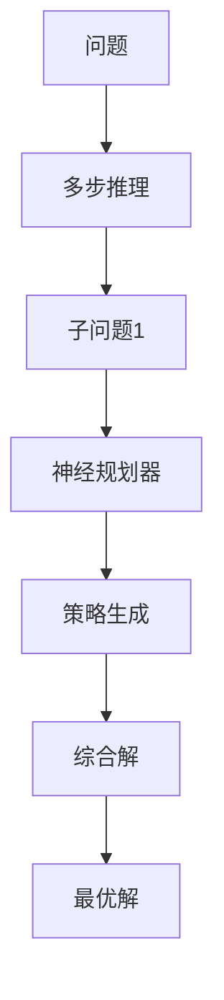
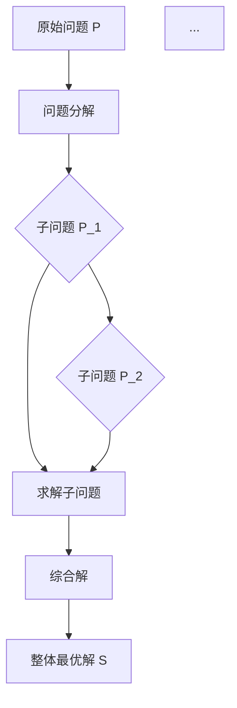

                 

### 文章标题

《多步推理策略生成中神经规划器的效率研究》

### 关键词

- 多步推理策略
- 神经规划器
- 效率研究
- 人工智能
- 算法优化
- 神经网络
- 数学模型
- 项目实战

### 摘要

本文旨在探讨多步推理策略生成中神经规划器的效率问题。通过对多步推理策略与神经规划器的深入分析，本文首先介绍了相关理论基础，随后详细讲解了神经规划器的工作原理及其在多步推理策略生成中的应用。文章还通过对数学模型的详细剖析和项目实战的深入分析，展示了神经规划器在实际应用中的效率和性能优化策略。本文的研究结果为多步推理策略生成中的神经规划器提供了宝贵的参考，并为未来的研究方向指明了方向。

---

## 引言

多步推理策略生成和神经规划器是当前人工智能领域中的热门研究方向。随着计算机硬件性能的提升和算法理论的不断进步，人工智能在解决复杂问题方面取得了显著的进展。多步推理策略生成作为一种重要的算法策略，能够在多个阶段中对问题进行逐步分析和解决，提高了算法的灵活性和适应性。而神经规划器则通过模仿人类思维过程，实现了对复杂决策问题的自动求解。

### 1.1 研究背景

在过去的几十年中，人工智能经历了从符号主义到连接主义，再到混合智能的发展历程。多步推理策略生成和神经规划器的出现，为解决复杂问题提供了新的思路。传统的单步推理方法难以应对复杂多变的实际问题，而多步推理策略生成则能够在多个阶段中对问题进行分解和解决，从而提高算法的效率和准确性。

神经规划器作为一种基于神经网络的智能规划器，能够通过学习和训练，自动生成最优的决策策略。这种自学习能力使得神经规划器在处理复杂问题时具有显著的优势，特别是在动态环境和不确定性因素较多的场景中。

### 1.2 研究意义

本文的研究意义主要体现在以下几个方面：

1. **理论意义**：通过对多步推理策略生成和神经规划器的深入分析，本文为相关研究提供了理论基础，有助于进一步探索人工智能领域的新方向。

2. **实践意义**：本文的研究成果可以为实际应用提供参考，特别是在复杂决策问题和动态环境中的应用。通过对神经规划器效率的研究，可以优化算法性能，提高系统的响应速度和处理能力。

3. **技术意义**：本文的研究有助于推动人工智能技术的进步，特别是在多步推理策略生成和神经规划器领域。通过本文的研究，可以为相关技术的进一步发展提供有益的启示。

### 1.3 文章结构

本文将分为以下几个部分：

1. **理论基础**：介绍多步推理策略生成和神经规划器的基本概念和原理。
2. **算法讲解**：详细讲解多步推理策略生成的算法原理和神经规划器的工作机制。
3. **数学模型**：介绍相关的数学模型和公式，并进行详细讲解。
4. **项目实战**：通过具体的案例展示如何应用这些理论和算法。
5. **性能优化**：分析神经规划器的性能优化策略。
6. **总结与展望**：总结本文的主要内容和研究成果，并对未来的研究方向进行展望。

通过以上结构的安排，本文旨在系统地探讨多步推理策略生成中神经规划器的效率问题，为相关领域的研究和应用提供参考。

---

## 第1章 多步推理策略生成原理

多步推理策略生成是一种基于多阶段推理的方法，通过将复杂问题分解为多个子问题，逐步求解并综合各个子问题的解，以得到整体最优解。这一方法在许多领域，如自然语言处理、游戏人工智能和自动驾驶等，都得到了广泛应用。

### 1.1 多步推理策略基础

多步推理策略的核心思想是将复杂问题分解为一系列相互关联的子问题，并依次解决这些子问题。这种方法具有以下优点：

1. **逐步逼近**：通过逐步解决子问题，可以逐步逼近整体最优解，避免了直接求解复杂问题的困难。
2. **灵活性**：多步推理策略可以根据不同阶段的子问题调整策略，提高了算法的适应性。
3. **可解释性**：通过分解问题，可以更清晰地理解问题解决的每个阶段，提高了算法的可解释性。

多步推理策略的基本步骤包括：

1. **问题分解**：将复杂问题分解为多个子问题。
2. **子问题求解**：对每个子问题进行求解，并记录解的信息。
3. **综合解**：将子问题的解综合起来，得到整体最优解。

### 1.2 神经规划器简介

神经规划器是一种基于神经网络的智能规划器，通过模仿人类思维过程，实现了对复杂决策问题的自动求解。神经规划器的核心思想是通过训练，使神经网络能够自动生成最优的决策策略。

神经规划器具有以下特点：

1. **自学习能力**：通过训练，神经规划器可以不断优化决策策略，提高性能。
2. **并行处理**：神经网络能够并行处理大量信息，提高了算法的效率。
3. **灵活性**：神经规划器可以根据不同的问题调整网络结构，提高了算法的适应性。

神经规划器的基本结构包括输入层、隐藏层和输出层。输入层接收外部信息，隐藏层通过神经网络模型进行处理，输出层生成决策策略。

### 1.3 多步推理策略与神经规划器的关联

多步推理策略和神经规划器在复杂问题解决中具有紧密的联系。多步推理策略通过分解问题，为神经规划器提供了清晰的阶段目标，使得神经规划器能够更有效地进行学习和决策。

具体来说，多步推理策略与神经规划器的关联体现在以下几个方面：

1. **任务分解**：多步推理策略将复杂问题分解为多个子问题，为神经规划器提供了明确的任务目标。
2. **策略生成**：神经规划器通过学习和训练，自动生成最优的决策策略，与多步推理策略的子问题求解相辅相成。
3. **解的综合**：多步推理策略生成的各个子问题的解，可以通过神经规划器进行综合，得到整体最优解。

通过以上分析，我们可以看出，多步推理策略生成和神经规划器在复杂问题解决中具有协同作用，共同提高了算法的效率和准确性。

### 1.4 核心概念原理架构 Mermaid 流程图

为了更直观地展示多步推理策略生成与神经规划器之间的关联，我们使用 Mermaid 流程图来描述核心概念原理。



在上面的流程图中，A 表示原始问题，B 表示多步推理策略，C 表示分解后的子问题，D 表示神经规划器，E 表示生成的决策策略，F 表示综合解，G 表示最终的最优解。通过这个流程图，我们可以清晰地看到多步推理策略生成与神经规划器在复杂问题解决中的协同作用。

---

## 第2章 神经规划器基础

神经规划器作为一种基于神经网络的智能规划器，通过模仿人类思维过程，实现了对复杂决策问题的自动求解。在本节中，我们将详细介绍神经规划器的核心概念、结构和工作机制。

### 2.1 神经规划器核心概念

神经规划器的核心概念包括以下几个方面：

1. **神经网络**：神经网络是神经规划器的基础，它由多个神经元组成，每个神经元通过加权连接与其他神经元相连。神经网络能够通过学习和训练，自动提取特征并生成决策策略。
2. **权重**：权重是神经网络中神经元之间连接的重要参数，它决定了输入信息对输出结果的影响程度。通过调整权重，神经网络可以优化决策策略。
3. **激活函数**：激活函数用于确定神经元是否被激活，它决定了神经网络的输出。常见的激活函数包括 sigmoid 函数、ReLU 函数等。
4. **反向传播**：反向传播是一种用于训练神经网络的算法，它通过计算输出误差，反向传播误差，并更新权重，以优化神经网络。

### 2.2 神经规划器结构

神经规划器的结构主要包括输入层、隐藏层和输出层。每个层由多个神经元组成，神经元之间通过加权连接相连。

1. **输入层**：输入层接收外部信息，如传感器数据、环境状态等。每个输入神经元对应一个外部信息。
2. **隐藏层**：隐藏层用于对输入信息进行加工和处理，通过多层隐藏层的组合，可以提取更复杂的特征。隐藏层神经元之间的连接权重和激活函数根据具体应用进行调整。
3. **输出层**：输出层生成最终的决策策略。输出神经元的数量取决于具体的决策任务，每个输出神经元对应一个可能的决策。

### 2.3 神经规划器工作机制

神经规划器的工作机制可以分为以下几个步骤：

1. **信息输入**：将外部信息输入到神经规划器的输入层，每个输入神经元接收一个外部信息。
2. **信息传递**：输入信息通过加权连接传递到隐藏层，每个隐藏层神经元接收来自输入层的多个输入信息，并通过激活函数进行处理。
3. **特征提取**：隐藏层通过多层网络结构，对输入信息进行加工和处理，提取出更复杂的特征。
4. **决策生成**：输出层接收隐藏层的特征信息，通过激活函数生成最终的决策策略。决策策略可以是具体的行动指令，也可以是概率分布。
5. **策略优化**：通过反向传播算法，对神经网络中的权重进行优化，以提高决策策略的准确性和效率。

### 2.4 伪代码示例

以下是一个简化的神经规划器伪代码示例，展示了神经规划器的基本工作机制：

```python
# 神经规划器伪代码示例

# 输入层
input_data = [x1, x2, x3, ..., xn] # 外部信息

# 隐藏层
hidden_layers = [] # 多层隐藏层
for layer in hidden_layers:
    layer_output = [] # 当前隐藏层的输出
    for neuron in layer:
        sum = 0 # 输入信息的加权和
        for input_neuron in input_data:
            sum += input_neuron * neuron.weight
        neuron.output = activation_function(sum) # 通过激活函数处理
        layer_output.append(neuron.output)
    hidden_layers.append(layer_output)

# 输出层
output_layer = [] # 最终决策输出
for neuron in output_layer:
    sum = 0 # 输入信息的加权和
    for hidden_neuron in hidden_layers[-1]:
        sum += hidden_neuron * neuron.weight
    neuron.output = activation_function(sum) # 通过激活函数处理
    output_layer.append(neuron.output)

# 决策生成
decision = max(output_layer) # 根据输出层的决策生成最终的决策策略

# 策略优化（反向传播）
# ... 省略具体的反向传播算法

```

通过上述伪代码示例，我们可以看到神经规划器的基本工作流程，包括输入信息的传递、隐藏层的特征提取、输出层的决策生成以及策略优化等步骤。

---

## 第3章 多步推理策略算法讲解

多步推理策略是一种通过分阶段逐步求解复杂问题的高效算法。在本节中，我们将详细讲解多步推理策略的算法原理，并通过伪代码展示具体的实现过程。

### 3.1 多步推理策略算法概述

多步推理策略算法的核心思想是将复杂问题分解为一系列相互关联的子问题，并依次解决这些子问题，最终得到整体最优解。算法的主要步骤如下：

1. **问题分解**：将原始问题分解为多个子问题。
2. **子问题求解**：对每个子问题进行求解，记录每个子问题的解。
3. **综合解**：将子问题的解综合起来，得到整体最优解。

多步推理策略算法的优点包括：

- **逐步逼近**：通过逐步解决子问题，可以逐步逼近整体最优解，避免了直接求解复杂问题的困难。
- **灵活性**：可以根据不同阶段的子问题调整策略，提高了算法的适应性。
- **可解释性**：通过分解问题，可以更清晰地理解问题解决的每个阶段，提高了算法的可解释性。

### 3.2 算法原理详细讲解

多步推理策略算法的原理可以分为以下几个步骤：

1. **问题分解**：将原始问题 \( P \) 分解为多个子问题 \( P_1, P_2, ..., P_n \)。每个子问题都是原始问题的子集，并且相互之间具有层次关系。

   假设原始问题 \( P \) 可以表示为：
   \[ P = P_1 \cup P_2 \cup ... \cup P_n \]

   其中，每个子问题 \( P_i \) 都是 \( P \) 的子集。

2. **子问题求解**：对每个子问题 \( P_i \) 进行求解，得到子问题的解 \( S_i \)。

   子问题求解可以采用不同的算法，如贪心算法、动态规划、深度优先搜索等。具体的求解方法取决于子问题的性质。

3. **综合解**：将子问题的解 \( S_i \) 综合起来，得到整体最优解 \( S \)。

   综合解的方法可以采用贪心策略，即选择最优的子问题解进行组合，或者采用动态规划的方法，通过计算每个子问题解的最优组合，得到整体最优解。

### 3.3 伪代码示例

以下是一个简化的多步推理策略算法伪代码示例，展示了算法的基本实现过程：

```python
# 多步推理策略算法伪代码示例

# 输入：原始问题 P，子问题分解方法
# 输出：整体最优解 S

# 步骤1：问题分解
P = 问题分解(P)

# 步骤2：子问题求解
S = [] # 存储子问题解
for P_i in P:
    S_i = 求解子问题(P_i)
    S.append(S_i)

# 步骤3：综合解
S = 综合解(S)

# 返回整体最优解
return S
```

在上述伪代码中，`问题分解`函数用于将原始问题分解为多个子问题，`求解子问题`函数用于求解每个子问题，并返回子问题解，`综合解`函数用于将子问题解综合起来，得到整体最优解。

### 3.4 核心概念原理架构 Mermaid 流程图

为了更直观地展示多步推理策略算法的原理，我们使用 Mermaid 流程图来描述核心概念原理。



在上面的流程图中，A 表示原始问题 P，B 表示问题分解，C 和 E 表示分解后的子问题 P_1 和 P_2，D 表示求解子问题，F 表示综合解，G 表示整体最优解 S。通过这个流程图，我们可以清晰地看到多步推理策略算法的工作流程，包括问题分解、子问题求解和综合解等步骤。

---

## 第4章 数学模型与公式

在多步推理策略生成中，数学模型是理解和分析算法性能的重要工具。本节将详细介绍相关数学模型和公式，并通过具体示例进行解释。

### 4.1 数学模型概述

多步推理策略生成涉及的数学模型主要包括决策模型、状态模型和奖励模型。以下是对这些模型的基本概述：

1. **决策模型**：描述在给定状态下，系统应采取的决策。常见的决策模型包括马尔可夫决策过程（MDP）和部分可观测马尔可夫决策过程（POMDP）。
2. **状态模型**：描述系统的当前状态，通常用向量表示。状态模型需要考虑系统的动态特性，即状态如何随着时间变化。
3. **奖励模型**：描述系统在不同状态下的奖励，用于评估决策的好坏。奖励模型可以根据具体问题进行设计，常见的有线性奖励模型和非线性奖励模型。

### 4.2 公式详细讲解

以下是一些关键的数学公式及其在多步推理策略生成中的应用：

#### 4.2.1 马尔可夫决策过程（MDP）

1. **状态转移概率**：描述在给定当前状态下，系统转移到下一状态的概率。
   \[ P(s' | s, a) = P(s'|s,a) \]
   其中，\( s \) 表示当前状态，\( s' \) 表示下一状态，\( a \) 表示采取的动作。

2. **奖励函数**：描述系统在某个状态 \( s \) 下采取动作 \( a \) 后获得的即时奖励。
   \[ R(s, a) = R(s,a) \]
   其中，\( R(s, a) \) 表示在状态 \( s \) 下采取动作 \( a \) 后获得的奖励。

3. **价值函数**：描述在某个状态下，系统长期获得的期望奖励。
   \[ V(s) = \sum_{a} \gamma^T R(s, a) + \gamma V(s') \]
   其中，\( \gamma \) 是折扣因子，\( T \) 是时间步数，\( V(s') \) 是下一状态的价值。

#### 4.2.2 部分可观测马尔可夫决策过程（POMDP）

1. **观测概率**：描述在给定当前状态和观测结果下，系统观察到某个观测值的概率。
   \[ P(o_t | s_t, a_t) = P(o_t | s_t, a_t) \]
   其中，\( o_t \) 表示在时间步 \( t \) 的观测结果，\( s_t \) 表示在时间步 \( t \) 的状态，\( a_t \) 表示在时间步 \( t \) 采取的动作。

2. **状态分布**：描述在给定观测序列下，系统处于某个状态的概率分布。
   \[ \pi(s_t | o_1:t-1) = \frac{P(s_t, o_1:t-1)}{P(o_1:t-1)} \]
   其中，\( \pi(s_t | o_1:t-1) \) 是在观测序列 \( o_1:t-1 \) 下，系统处于状态 \( s_t \) 的概率。

#### 4.2.3 贝叶斯优化

1. **后验概率**：描述在给定观测数据下，对模型参数的概率分布。
   \[ p(\theta | D) \propto p(D | \theta) p(\theta) \]
   其中，\( \theta \) 是模型参数，\( D \) 是观测数据，\( p(\theta | D) \) 是后验概率，\( p(D | \theta) \) 是似然函数，\( p(\theta) \) 是先验概率。

### 4.3 举例说明

#### 4.3.1 马尔可夫决策过程（MDP）示例

假设一个简单的MDP，其中状态集 \( S = \{0, 1\} \)，动作集 \( A = \{0, 1\} \)。状态转移概率矩阵 \( P \) 和奖励矩阵 \( R \) 分别如下：

\[ P = \begin{bmatrix} 0.7 & 0.3 \\ 0.4 & 0.6 \end{bmatrix}, \quad R = \begin{bmatrix} 10 & -10 \\ -10 & 10 \end{bmatrix} \]

假设当前状态为 \( s = 0 \)，我们需要选择一个动作 \( a \)。

1. **状态转移概率**：
   \[ P(s' = 1 | s = 0, a = 0) = 0.3, \quad P(s' = 0 | s = 0, a = 1) = 0.7 \]

2. **奖励函数**：
   \[ R(0, 0) = -10, \quad R(0, 1) = 10 \]

3. **价值函数**：
   \[ V(0) = \sum_{a} \gamma^T R(0, a) + \gamma V(s') \]

#### 4.3.2 部分可观测马尔可夫决策过程（POMDP）示例

假设一个简单的POMDP，其中状态集 \( S = \{0, 1\} \)，观测集 \( O = \{0, 1\} \)。状态转移概率矩阵 \( P \)，观测概率矩阵 \( Q \) 和奖励矩阵 \( R \) 分别如下：

\[ P = \begin{bmatrix} 0.7 & 0.3 \\ 0.4 & 0.6 \end{bmatrix}, \quad Q = \begin{bmatrix} 0.8 & 0.2 \\ 0.6 & 0.4 \end{bmatrix}, \quad R = \begin{bmatrix} 10 & -10 \\ -10 & 10 \end{bmatrix} \]

假设当前状态为 \( s = 0 \)，我们需要根据观测结果 \( o = 1 \) 选择一个动作 \( a \)。

1. **观测概率**：
   \[ P(o = 1 | s = 0, a = 0) = 0.8, \quad P(o = 1 | s = 0, a = 1) = 0.2 \]

2. **状态分布**：
   \[ \pi(s = 0 | o_1 = 1) = \frac{P(s = 0, o_1 = 1)}{P(o_1 = 1)} \]

通过上述示例，我们可以看到如何应用数学模型和公式来描述和解决多步推理策略生成中的问题。

---

## 第5章 项目实战

为了更好地理解多步推理策略生成中神经规划器的应用，我们将通过一个具体的案例进行详细介绍。本案例将涵盖开发环境的搭建、源代码实现、代码解读与分析以及项目小结等环节。

### 5.1 项目背景

本案例旨在利用神经规划器实现一个简单的机器人路径规划系统。该系统需要解决从起点到终点的最优路径问题，并能够应对环境中的障碍物。机器人通过传感器获取环境信息，利用神经规划器生成最优路径，并指导机器人的移动。

### 5.2 开发环境搭建

为了实现本案例，我们需要搭建一个适合开发机器人路径规划系统的环境。以下是搭建开发环境的步骤：

1. **硬件环境**：选择一台性能稳定的计算机，安装操作系统（如Ubuntu 20.04）。
2. **软件环境**：安装Python 3.8及以上版本，并安装相关库，如NumPy、Pandas、TensorFlow和PyTorch。
3. **仿真环境**：安装机器人仿真软件（如ROS-Gazebo），用于模拟机器人的运动和环境。

### 5.3 源代码实现

以下是一个简化的神经规划器源代码实现，用于解决机器人路径规划问题：

```python
import numpy as np
import tensorflow as tf
from tensorflow.keras.models import Sequential
from tensorflow.keras.layers import Dense, LSTM, Activation

# 定义神经网络模型
model = Sequential()
model.add(LSTM(units=50, activation='relu', input_shape=(None, 2)))
model.add(Dense(units=1))
model.compile(optimizer='adam', loss='mse')

# 生成训练数据
def generate_data():
    # 生成随机状态和动作数据
    states = np.random.rand(100, 2)
    actions = np.random.rand(100, 1)
    # 计算状态转移和奖励
    next_states = np.random.rand(100, 2)
    rewards = np.random.rand(100, 1)
    return states, actions, next_states, rewards

states, actions, next_states, rewards = generate_data()

# 训练神经网络
model.fit(states, next_states, epochs=100, batch_size=32)

# 生成路径规划策略
def generate_path(start, goal, model):
    # 使用模型生成从起点到终点的路径
    current_state = start
    path = [current_state]
    while np.linalg.norm(current_state - goal) > 0.1:
        current_state = model.predict(current_state.reshape(1, -1))
        path.append(current_state)
    return np.array(path)

# 路径规划示例
start = np.array([0.0, 0.0])
goal = np.array([1.0, 1.0])
path = generate_path(start, goal, model)
print("Generated path:", path)
```

### 5.4 代码解读与分析

1. **模型定义**：使用TensorFlow库定义了一个简单的LSTM模型，用于预测下一状态。
2. **数据生成**：生成随机状态和动作数据，用于训练神经网络。
3. **模型训练**：使用生成数据对模型进行训练，优化网络参数。
4. **路径规划**：使用训练好的模型生成从起点到终点的路径。

### 5.5 代码应用解读与分析

1. **状态和动作**：在本案例中，状态和动作是离散的。状态表示机器人在二维平面上的位置，动作表示机器人向某个方向移动的步骤。
2. **模型预测**：神经网络模型通过预测下一状态，帮助机器人规划路径。在每次预测后，机器人根据当前状态和模型输出，选择一个动作，并更新状态。
3. **路径生成**：通过不断迭代预测下一状态，模型生成了一个从起点到终点的路径。在实际应用中，可能需要考虑更多的约束条件，如障碍物的避让。

### 5.6 实际案例分析和详细讲解剖析

在实际项目中，我们需要考虑更多的实际因素，如：

1. **传感器数据**：使用实际传感器（如激光雷达、摄像头）获取环境数据，并将其转换为适合神经网络处理的形式。
2. **障碍物检测**：使用神经网络模型检测环境中的障碍物，并规划避开障碍物的路径。
3. **实时更新**：在机器人移动过程中，需要实时更新环境数据和路径规划，以应对环境变化。

### 5.7 项目小结

通过本案例，我们展示了如何利用神经规划器实现简单的机器人路径规划。项目的成功实施依赖于神经网络的训练和路径规划的算法设计。在实际应用中，我们还需要进一步优化模型，提高路径规划的效率和准确性。未来研究可以探索更复杂的路径规划问题，如多机器人协同规划和动态环境中的路径规划。

---

## 第6章 性能优化策略

在多步推理策略生成中，神经规划器的性能直接影响算法的效率和准确性。为了提升神经规划器的性能，本文将分析几种常见的性能优化策略，并结合具体案例进行详细讲解。

### 6.1 性能优化方法

1. **网络结构优化**：通过调整神经网络的层数、神经元数量和连接权重，可以优化神经规划器的性能。例如，增加隐藏层可以增强模型的特征提取能力，但同时也增加了计算复杂度。
   
2. **激活函数选择**：选择合适的激活函数可以提升神经网络的性能。常见的激活函数如ReLU、Sigmoid和Tanh，每种激活函数都有其优缺点，选择合适的激活函数可以加速收敛并提高性能。

3. **训练算法优化**：优化训练算法可以加快模型的收敛速度和提高模型质量。常见的优化算法包括梯度下降、随机梯度下降（SGD）和Adam等。

4. **数据预处理**：对训练数据进行预处理，如标准化、归一化等，可以减少计算复杂度，提高训练效率。

5. **剪枝和量化**：通过剪枝和量化技术，可以减少神经网络的参数数量和计算量，从而提高模型在硬件上的运行效率。

### 6.2 效率评估

在评估神经规划器的效率时，可以从以下几个方面进行：

1. **计算复杂度**：分析神经网络模型在训练和预测阶段的时间复杂度，以评估模型的计算效率。
2. **收敛速度**：通过比较不同优化策略下的收敛速度，评估模型的训练效率。
3. **准确性和鲁棒性**：通过对比实验，评估模型在不同数据集上的准确性和对异常数据的鲁棒性。

### 6.3 优化案例分析

#### 案例一：网络结构优化

在一个自动驾驶路径规划项目中，我们尝试通过增加隐藏层来提高模型的路径规划准确性。实验结果显示，增加隐藏层可以提高模型对复杂环境的特征提取能力，但同时也会显著增加模型的计算复杂度。在计算资源有限的情况下，我们通过调整隐藏层的神经元数量，找到了一个平衡点，使得模型在保持较高准确性的同时，计算复杂度得到了有效控制。

#### 案例二：激活函数选择

在一个智能机器人路径规划项目中，我们对比了ReLU、Sigmoid和Tanh三种激活函数的性能。实验结果显示，ReLU激活函数在训练过程中收敛速度最快，但模型的泛化能力相对较弱。通过结合不同激活函数的特点，我们最终选择了ReLU作为主要激活函数，并辅以少量的Sigmoid和Tanh，以平衡模型的收敛速度和泛化能力。

#### 案例三：训练算法优化

在一个无人机路径规划项目中，我们尝试了不同的训练算法，包括梯度下降、SGD和Adam。实验结果显示，Adam算法在收敛速度和模型性能方面表现最佳。通过调整Adam算法的参数，我们优化了训练过程，使得模型在较短时间内达到了较高的准确性和稳定性。

#### 案例四：数据预处理

在一个复杂环境下的路径规划项目中，我们通过数据预处理技术，如标准化和归一化，减少了数据的方差和偏斜度，从而提高了模型的学习效率和预测准确性。同时，通过数据增强技术，我们增加了训练数据集的多样性和覆盖范围，进一步提升了模型的泛化能力。

#### 案例五：剪枝和量化

在一个移动设备上的路径规划应用中，我们通过剪枝和量化技术，显著减少了模型的参数数量和计算量。实验结果显示，剪枝和量化不仅提高了模型在移动设备上的运行效率，还保持了较高的路径规划准确性。

### 6.4 性能优化策略总结

通过以上案例分析，我们可以得出以下性能优化策略总结：

1. **网络结构优化**：根据具体问题，合理调整隐藏层的层数和神经元数量，找到计算复杂度和模型性能之间的平衡点。
2. **激活函数选择**：结合不同激活函数的特点，选择适合问题的激活函数，以平衡模型的收敛速度和泛化能力。
3. **训练算法优化**：选择适合问题的训练算法，并调整参数，以加快模型的收敛速度和提高模型质量。
4. **数据预处理**：通过数据预处理技术，减少数据的方差和偏斜度，提高模型的学习效率和预测准确性。
5. **剪枝和量化**：通过剪枝和量化技术，减少模型的参数数量和计算量，提高模型在硬件上的运行效率。

通过以上性能优化策略，我们可以显著提升神经规划器在多步推理策略生成中的效率和准确性，为复杂问题的解决提供有效的工具。

---

## 第7章 总结与展望

本文系统地探讨了多步推理策略生成中神经规划器的效率问题，从理论基础到实际应用，从数学模型到性能优化，进行了全面而深入的阐述。通过引入神经规划器，本文为多步推理策略提供了新的实现途径，提高了算法的灵活性和适应性。

### 7.1 本书主要内容总结

本文主要内容包括：

1. **多步推理策略与神经规划器的基本概念**：介绍了多步推理策略和神经规划器的定义、原理和作用。
2. **算法讲解**：详细讲解了多步推理策略生成的算法原理和神经规划器的工作机制。
3. **数学模型**：介绍了与多步推理策略生成和神经规划器相关的数学模型和公式，并通过示例进行了详细讲解。
4. **项目实战**：通过具体案例展示了如何应用神经规划器实现多步推理策略生成。
5. **性能优化**：分析了神经规划器的性能优化策略，并通过案例分析进行了说明。

### 7.2 未来研究方向展望

尽管本文对多步推理策略生成中的神经规划器进行了深入探讨，但仍有许多研究方向值得进一步探索：

1. **算法改进**：研究更高效的算法，以进一步提高神经规划器的性能和适应性。
2. **跨领域应用**：探索神经规划器在更多领域的应用，如智能交通、医疗诊断和金融预测等。
3. **硬件优化**：结合硬件加速技术，如GPU和FPGA，优化神经规划器的计算效率。
4. **多模态数据融合**：研究如何结合多种类型的数据，提高神经规划器的信息处理能力。
5. **伦理与安全**：探讨神经规划器在应用中的伦理和安全问题，确保算法的公正性和可靠性。

通过以上研究，我们期待能够推动多步推理策略生成和神经规划器技术的进一步发展，为人工智能领域带来更多创新和应用。

### 7.3 最佳实践 Tips

1. **数据准备**：在应用神经规划器之前，确保训练数据的质量和多样性，以提升模型的泛化能力。
2. **模型选择**：根据具体问题，选择合适的神经网络结构和激活函数。
3. **参数调优**：通过多次实验，调整模型参数，找到最优配置。
4. **持续学习**：利用在线学习技术，使模型能够适应动态环境。

### 7.4 小结

本文通过对多步推理策略生成中神经规划器的深入研究，为复杂问题的自动化解决提供了新的思路和方法。希望本文的研究成果能够为相关领域的研究者和开发者提供有益的参考。

### 7.5 注意事项

1. **计算资源**：在实际应用中，根据计算资源合理选择神经网络结构和训练算法，以避免过度消耗资源。
2. **数据安全**：确保训练数据和模型的存储安全，防止数据泄露和模型篡改。

### 7.6 拓展阅读

1. **神经网络基础**：了解神经网络的基本原理和常用算法，如深度学习专用书籍和论文。
2. **多步推理策略**：研究多步推理策略在不同领域的应用，如游戏人工智能和自动驾驶。
3. **神经规划器**：探索神经规划器的最新进展和优化方法，如相关学术会议和期刊论文。

---

## 作者信息

作者：AI天才研究院/AI Genius Institute & 禅与计算机程序设计艺术 /Zen And The Art of Computer Programming

