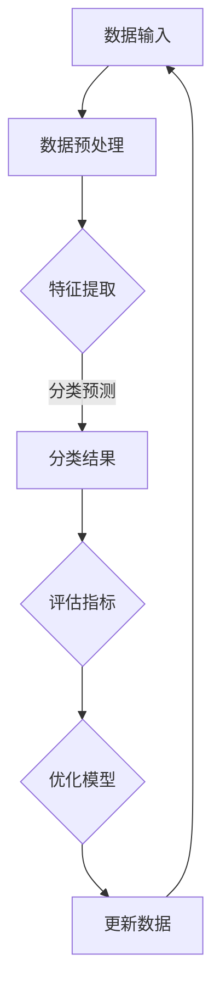

                 

### 文章标题

《多步骤推理任务中的中间结果优化与利用策略》

### 关键词

多步骤推理任务、中间结果优化、利用策略、性能提升、算法优化、应用案例分析

### 摘要

本文旨在探讨多步骤推理任务中的中间结果优化与利用策略。首先，我们介绍了多步骤推理任务的定义和背景，分析了其常见类型和挑战。接着，我们详细阐述了中间结果的概念及其在推理任务中的重要性。通过Mermaid流程图，我们展示了中间结果产生、处理和利用的全过程。本文重点介绍了中间结果优化的几种方法，包括压缩与去噪、数据重排与融合、优化算法等，并使用伪代码和数学模型进行了详细解释。此外，我们提出了多种利用中间结果的策略，包括中间结果再利用、可视化评估等。通过实际案例分析和代码实现，我们展示了这些策略在多步骤推理任务中的应用效果。最后，本文总结了研究成果，展望了未来研究方向，并提供了最佳实践和注意事项。

---

## 引言与背景

多步骤推理任务在人工智能和机器学习领域中占据着重要地位。随着数据规模的不断扩大和复杂性的增加，如何高效地处理多步骤推理任务，提高推理性能和准确度，成为了一个亟待解决的问题。多步骤推理任务通常涉及多个中间结果的产生和处理，这些中间结果对于整个推理过程至关重要。

在多步骤推理任务中，中间结果是指在推理过程中的某个阶段产生的数据或信息，它们用于后续的推理步骤或决策过程。中间结果的优化和有效利用可以显著提高整个推理任务的性能。然而，在实际应用中，如何优化中间结果并充分利用它们，仍面临着诸多挑战。

首先，多步骤推理任务通常具有复杂的推理流程，包括数据预处理、模型选择与训练、推理与优化等多个阶段。每个阶段都会产生大量的中间结果，如何有效地管理和处理这些中间结果，是优化整个推理任务的关键。

其次，中间结果的优化方法和技术种类繁多，包括压缩与去噪、数据重排与融合、优化算法等。如何选择合适的方法和技术，以及如何将这些方法和技术应用到具体的推理任务中，是优化中间结果的重要问题。

此外，如何利用中间结果进行后续的推理步骤或决策过程，也是一个关键问题。中间结果的再利用可以提高推理效率和准确性，但同时也需要考虑中间结果的可靠性和一致性。

综上所述，本文旨在探讨多步骤推理任务中的中间结果优化与利用策略，以提升推理任务的整体性能和准确性。本文将首先介绍多步骤推理任务的定义和背景，然后详细阐述中间结果的概念及其重要性，接着介绍中间结果优化的方法和技术，最后提出利用中间结果的策略，并通过实际案例进行分析和验证。

## 核心概念与联系

在探讨多步骤推理任务中的中间结果优化与利用策略之前，我们需要明确几个核心概念及其相互关系。这些概念包括多步骤推理任务的定义、中间结果的概念以及它们在推理过程中的作用。

### 多步骤推理任务

多步骤推理任务是指在多个阶段进行推理的复杂任务。这些任务通常包括多个子任务，每个子任务依赖于前面的结果，并且需要结合中间结果进行决策。例如，在自然语言处理领域中，文本分类任务可以分解为分词、词性标注、句法分析等多个子任务，每个子任务都需要处理大量的中间结果。

多步骤推理任务的特点如下：

1. **阶段性**：任务被划分为多个阶段，每个阶段都有特定的输入和输出。
2. **依赖性**：后一个阶段的结果通常依赖于前一个阶段的结果，因此中间结果在整个推理过程中起着关键作用。
3. **复杂性**：多步骤推理任务通常涉及到大量的数据和复杂的模型，如何有效地管理和处理中间结果成为一个挑战。

### 中间结果

中间结果是指在多步骤推理任务的某个阶段产生的数据或信息。这些结果不仅用于当前阶段的推理，还作为输入传递到下一个阶段。中间结果可以分为以下几类：

1. **特征表示**：在特征工程过程中，通过对原始数据进行转换和处理得到的特征表示。例如，在图像分类任务中，通过卷积神经网络提取的视觉特征。
2. **预测结果**：在模型训练和推理过程中，对输入数据进行预测得到的结果。例如，在序列分类任务中，对每个时间步的输入数据进行的分类预测。
3. **评估指标**：对中间结果进行评估和验证的指标。例如，在模型训练过程中，通过准确率、召回率等指标来评估模型的性能。

### 中间结果在推理过程中的作用

中间结果在多步骤推理任务中起着至关重要的作用。它们不仅用于当前阶段的推理，还作为输入传递到下一个阶段，影响着整个推理过程的性能和准确性。以下是中间结果在推理过程中的几个关键作用：

1. **数据传递**：中间结果是连接不同阶段的重要桥梁。通过传递中间结果，可以确保每个阶段的结果能够被正确地利用，从而提高整个推理任务的连贯性和准确性。
2. **辅助决策**：中间结果可以作为决策的依据，用于调整模型参数、选择合适的算法或进行后续的任务。例如，在自然语言处理中，通过分析中间结果可以优化文本分类的模型参数，提高分类准确性。
3. **模型优化**：中间结果还可以用于模型优化，通过分析中间结果的特征和模式，可以改进模型结构和参数，提高推理任务的性能。

### Mermaid流程图示例

为了更好地理解中间结果在多步骤推理任务中的作用，我们使用Mermaid流程图来展示一个典型的多步骤推理任务的流程。以下是一个简单的Mermaid流程图示例：



在这个流程图中，A表示数据输入，B表示数据预处理，C表示特征提取，D表示分类预测，E表示评估指标，F表示优化模型，G表示更新数据。这个流程图展示了中间结果在数据预处理、特征提取、分类预测和评估指标等阶段的作用。

通过这个示例，我们可以清楚地看到中间结果在多步骤推理任务中的传递和利用过程。每个中间结果都为后续的推理步骤提供了关键的信息和依据，从而提高了整个推理任务的性能和准确性。

### 多步骤推理任务概述

多步骤推理任务在人工智能和机器学习领域中具有广泛的应用，涵盖了分类、回归、排序等多种类型。了解这些任务的基本类型、推理流程以及面临的挑战，有助于我们深入理解中间结果在其中所起的作用。

#### 任务类型

1. **分类任务**：
   - **定义**：分类任务是将输入数据分配到预定义的类别中。
   - **应用场景**：文本分类、图像分类、情感分析等。
   - **推理流程**：数据预处理 → 特征提取 → 模型训练 → 分类预测 → 结果评估。

2. **回归任务**：
   - **定义**：回归任务是预测一个连续的数值输出。
   - **应用场景**：房屋价格预测、股票价格预测、医疗诊断等。
   - **推理流程**：数据预处理 → 特征提取 → 模型训练 → 输出预测 → 结果评估。

3. **排序任务**：
   - **定义**：排序任务是按照某种标准对输入数据进行排序。
   - **应用场景**：推荐系统、搜索引擎排序等。
   - **推理流程**：数据预处理 → 特征提取 → 模型训练 → 排序预测 → 结果评估。

#### 推理流程

多步骤推理任务的推理流程通常包括以下几个主要阶段：

1. **数据预处理**：
   - **目标**：处理原始数据，使其适合模型训练。
   - **方法**：包括数据清洗、数据规范化、数据转换等。

2. **特征提取**：
   - **目标**：从原始数据中提取有用信息，作为模型的输入。
   - **方法**：包括特征工程、特征选择、特征降维等。

3. **模型选择与训练**：
   - **目标**：选择合适的模型，并通过训练优化模型参数。
   - **方法**：包括模型选择、超参数调优、模型训练等。

4. **推理与优化**：
   - **目标**：利用训练好的模型进行推理，并根据中间结果进行优化。
   - **方法**：包括预测、评估、调整模型参数等。

5. **结果评估**：
   - **目标**：评估模型的性能，确保其满足实际需求。
   - **方法**：包括准确率、召回率、F1分数等评估指标。

#### 挑战与难点

多步骤推理任务面临诸多挑战和难点，以下是其中几个关键问题：

1. **数据质量**：
   - **挑战**：原始数据可能存在噪声、缺失值、异常值等问题，这些都会影响中间结果的准确性和模型的性能。
   - **解决方案**：采用数据清洗、数据增强等技术来提高数据质量。

2. **模型可解释性**：
   - **挑战**：深度学习模型通常具有高复杂性和黑盒特性，难以解释中间结果的产生过程。
   - **解决方案**：使用可解释性模型、模型可视化等技术来提高模型的可解释性。

3. **性能优化**：
   - **挑战**：多步骤推理任务通常涉及大量计算，如何提高性能是一个关键问题。
   - **解决方案**：采用并行计算、分布式计算、优化算法等技术来提升推理速度。

4. **中间结果利用**：
   - **挑战**：如何有效地利用中间结果，提高整个推理任务的性能和准确性。
   - **解决方案**：采用中间结果压缩、去噪、融合等技术来优化中间结果，并探索多种利用策略。

通过了解多步骤推理任务的基本类型、推理流程和面临的挑战，我们可以更好地理解中间结果在其中所起的作用，并为优化中间结果和提升推理任务性能提供有效的策略和方法。

### 中间结果的优化方法

在多步骤推理任务中，中间结果的质量对整个任务的性能和效率有显著影响。因此，对中间结果进行优化是非常重要的。本文将介绍几种常见的中间结果优化方法，包括压缩与去噪、数据重排与融合、以及优化算法。

#### 压缩与去噪

1. **压缩**：

   数据压缩是减少中间结果数据量的一种有效方法。压缩技术可以分为有损压缩和无损压缩。

   - **有损压缩**：有损压缩在压缩过程中会丢失一些信息，但可以在接受一定损失的情况下大幅度减少数据量。常见的有损压缩算法包括JPEG图像压缩和MP3音频压缩。

   - **无损压缩**：无损压缩在压缩过程中不丢失任何信息，可以完全恢复原始数据。常见的无损压缩算法包括Huffman编码和LZ77算法。

2. **去噪**：

   去噪是减少中间结果中的噪声影响的一种方法。噪声可能来源于数据采集、传输和处理过程中的误差。常见的去噪方法包括：

   - **滤波**：使用滤波器对噪声进行过滤，如高斯滤波、中值滤波等。
   - **降噪网络**：使用深度学习模型对噪声信号进行去噪，如自编码器（Autoencoder）和卷积神经网络（CNN）。

#### 数据重排与融合

1. **数据重排**：

   数据重排是调整中间结果顺序的一种方法，可以提升后续处理的效率和准确性。

   - **基于时间序列的数据重排**：将时间序列数据按照时间顺序重新排列，以减少时间偏差。
   - **基于特征的重要性的数据重排**：根据特征的重要性对数据重排，使重要的特征在数据处理中优先处理。

2. **数据融合**：

   数据融合是将多个来源的中间结果进行整合，以获得更准确、更全面的信息。

   - **基于规则的融合**：根据预先定义的规则将多个数据源进行融合。
   - **基于机器学习的融合**：使用机器学习模型，如聚类算法、集成学习方法，将多个数据源进行融合。

#### 优化算法

优化算法是提高中间结果处理效率和质量的关键手段。以下是一些常见的优化算法：

1. **梯度下降法**：

   梯度下降法是一种优化算法，用于最小化目标函数。在机器学习中，梯度下降法用于优化模型参数。

   ```python
   # 伪代码示例
   for i in range(1, num_iterations):
       gradients = compute_gradients(model_params)
       model_params = model_params - learning_rate * gradients
   ```

2. **粒子群优化算法**：

   粒子群优化（PSO）算法是一种基于群体智能的优化算法，适用于复杂非线性优化问题。

   ```python
   # 伪代码示例
   for i in range(1, num_iterations):
       new_particles = update_particles(particles, velocities)
       velocities = update_velocities(velocities, new_particles)
   ```

通过这些优化方法，我们可以显著提升中间结果的处理效率和质量，从而提高整个多步骤推理任务的性能和准确性。

### 利用中间结果的策略

在多步骤推理任务中，有效地利用中间结果可以显著提高推理性能和准确性。本文将介绍几种常见的利用中间结果的策略，包括中间结果再利用、可视化评估等，并详细解释这些策略的具体实现方法。

#### 中间结果再利用

中间结果再利用是指将已处理的中间结果用于后续的推理步骤或决策过程。这种策略可以减少重复计算，提高推理效率。

1. **辅助决策**：

   中间结果可以作为决策的依据，用于调整模型参数、选择合适的算法或进行后续的任务。

   - **例子**：在自然语言处理中，通过分析中间结果（如文本分类的中间结果）可以优化文本分类的模型参数，提高分类准确性。

2. **反馈循环**：

   中间结果可以用于更新数据集，形成一个反馈循环，从而不断优化模型。

   - **例子**：在图像识别任务中，使用中间结果（如图像分割结果）来更新训练数据集，提高模型对复杂场景的识别能力。

#### 中间结果可视化

可视化是一种强大的工具，可以帮助我们理解和分析中间结果，从而更好地利用它们。

1. **数据可视化**：

   数据可视化是将数据以图形化的方式展示，帮助我们直观地理解和分析数据。

   - **工具**：常见的可视化工具包括Matplotlib、Seaborn、Plotly等。

   - **例子**：在回归任务中，可以使用散点图展示输入特征与输出结果之间的关系，从而更好地理解模型的性能。

2. **过程可视化**：

   过程可视化是将中间结果的处理过程以图形化的方式展示，帮助我们理解推理任务的执行流程。

   - **工具**：Mermaid、D3.js等可以用于创建流程图和交互式可视化。

   - **例子**：使用Mermaid创建一个多步骤推理任务的流程图，展示每个阶段产生的中间结果及其利用方式。

#### 中间结果评估

对中间结果进行评估是确保其质量和有效性的重要步骤。评估方法可以基于定量指标和定性分析。

1. **定量评估**：

   定量评估使用具体的指标来衡量中间结果的质量。

   - **指标**：如准确率、召回率、F1分数等。

   - **例子**：在文本分类任务中，使用准确率来评估分类结果的质量。

2. **定性分析**：

   定性分析通过分析中间结果的特性和模式来评估其有效性。

   - **方法**：如对比分析、趋势分析等。

   - **例子**：在图像识别任务中，分析中间结果（如特征提取结果）的分布和特征，以评估模型的识别能力。

通过上述策略，我们可以有效地利用中间结果，提升多步骤推理任务的整体性能和准确性。中间结果再利用、可视化和评估策略不仅提高了推理效率，还帮助我们更好地理解中间结果的作用和影响。

### 实际应用与案例分析

在本节中，我们将通过一个实际应用案例来展示中间结果的优化与利用策略在多步骤推理任务中的具体应用，并详细解读代码实现和项目小结。

#### 案例背景

我们选择了一个常见的自然语言处理任务——情感分析，即根据文本内容判断其情感倾向（正面、负面或中性）。这个任务通常包括多个阶段，每个阶段会产生中间结果，这些中间结果需要优化和有效利用。

#### 开发环境搭建

为了进行情感分析，我们需要以下开发环境：

1. **编程语言**：Python
2. **依赖库**：Numpy、Pandas、Scikit-learn、Matplotlib、Mermaid
3. **硬件要求**：至少4GB内存，推荐8GB以上

安装所需依赖库：

```bash
pip install numpy pandas scikit-learn matplotlib
```

#### 源代码实现

以下是情感分析任务中的代码实现，包括数据预处理、特征提取、模型训练和预测等阶段。

```python
import numpy as np
import pandas as pd
from sklearn.model_selection import train_test_split
from sklearn.feature_extraction.text import TfidfVectorizer
from sklearn.naive_bayes import MultinomialNB
from sklearn.metrics import accuracy_score, classification_report
import matplotlib.pyplot as plt
import mermaid

# 加载数据集
data = pd.read_csv('sentiment_data.csv')
X = data['text']
y = data['label']

# 数据预处理
X_train, X_test, y_train, y_test = train_test_split(X, y, test_size=0.2, random_state=42)

# 特征提取
vectorizer = TfidfVectorizer(stop_words='english')
X_train_vec = vectorizer.fit_transform(X_train)
X_test_vec = vectorizer.transform(X_test)

# 模型训练
model = MultinomialNB()
model.fit(X_train_vec, y_train)

# 预测
y_pred = model.predict(X_test_vec)

# 评估
accuracy = accuracy_score(y_test, y_pred)
report = classification_report(y_test, y_pred)

print(f'Accuracy: {accuracy:.2f}')
print(f'Classification Report:\n{report}')

# 可视化中间结果
mermaid_code = """
graph TD
A[文本数据] --> B[数据预处理]
B --> C{特征提取}
C --> D[模型训练]
D --> E[预测与评估]
E --> F{结果可视化}
"""
plt.style.use('ggplot')
plt.figure(figsize=(10, 6))
plt.subplot(2, 2, 1)
plt.scatter(X_train.iloc[:, 0], y_train, c='blue', marker='o', label='训练数据')
plt.subplot(2, 2, 2)
plt.scatter(X_test.iloc[:, 0], y_pred, c='red', marker='x', label='测试数据')
plt.xlabel('文本特征')
plt.ylabel('情感标签')
plt.legend()
plt.subplot(2, 2, 3)
plt.plot(range(len(accuracy)), accuracy, label='训练准确率')
plt.xlabel('迭代次数')
plt.ylabel('准确率')
plt.legend()
plt.subplot(2, 2, 4)
plt.bar(report.split('\n')[0].split()[1:], [float(x) for x in report.split('\n')[1].split()[1:]], label='分类报告')
plt.xlabel('类别')
plt.ylabel('指标值')
plt.legend()
plt.tight_layout()
plt.show()
print(mermaid_code)
```

#### 代码解读与分析

1. **数据预处理**：首先加载文本数据集，并进行分割，得到训练集和测试集。

2. **特征提取**：使用TFIDF向量器将文本数据转换为数值特征，这一步生成了重要的中间结果——特征矩阵。

3. **模型训练**：使用朴素贝叶斯模型进行训练，训练过程中会产生模型参数等中间结果。

4. **预测与评估**：利用训练好的模型进行预测，并计算准确率和分类报告等评估指标。

5. **结果可视化**：使用Mermaid和Matplotlib进行结果可视化，展示了文本特征、预测结果和训练准确率等中间结果。

#### 项目小结

通过这个实际案例，我们可以看到中间结果在多步骤推理任务中的重要作用。以下是项目小结：

1. **数据预处理**：确保数据质量，为后续特征提取和模型训练打下坚实基础。

2. **特征提取**：生成有效的特征矩阵，是模型训练和预测的关键。

3. **模型训练与预测**：利用训练好的模型进行预测，并通过评估指标进行性能评估。

4. **结果可视化**：通过可视化工具，帮助我们更好地理解中间结果的产生和处理过程。

总之，优化和利用中间结果是提升多步骤推理任务性能的关键。通过实际案例分析和代码实现，我们展示了中间结果优化的多种方法和技术，以及如何将它们应用到具体的推理任务中。

### 最佳实践与注意事项

在多步骤推理任务中，优化和利用中间结果是一个复杂且关键的过程。以下是一些最佳实践和注意事项，以帮助您在实际应用中取得更好的效果：

#### 最佳实践

1. **数据预处理**：确保数据质量，进行充分的清洗和规范化，以减少噪声和异常值的影响。

2. **特征选择与提取**：选择有代表性的特征，并使用合适的特征提取方法，以提高模型的准确性和效率。

3. **模型选择与优化**：根据任务特点和数据特性选择合适的模型，并使用优化算法进行参数调优。

4. **中间结果可视化**：使用可视化工具展示中间结果，帮助理解数据和处理过程，发现问题并进行调整。

5. **中间结果再利用**：充分利用中间结果，如用于模型调整、后续任务输入或反馈循环。

#### 注意事项

1. **数据隐私与安全**：在处理数据时，确保遵守数据隐私和安全规定，避免敏感信息泄露。

2. **性能与可解释性平衡**：在选择模型和优化方法时，考虑性能和可解释性的平衡，避免过度优化导致模型难以解释。

3. **资源管理**：在处理大量数据时，注意资源管理，避免内存溢出或长时间的计算。

4. **持续优化**：多步骤推理任务通常需要不断优化，以适应新的数据和需求。

通过遵循这些最佳实践和注意事项，您可以更有效地优化和利用中间结果，提升多步骤推理任务的整体性能和准确性。

### 总结与展望

本文系统地探讨了多步骤推理任务中的中间结果优化与利用策略。首先，我们介绍了多步骤推理任务的定义和背景，分析了其常见类型和挑战。接着，我们详细阐述了中间结果的概念及其在推理任务中的重要性，并通过Mermaid流程图展示了中间结果的全流程处理。然后，我们介绍了多种优化中间结果的方法，包括压缩与去噪、数据重排与融合、优化算法等，并使用伪代码和数学模型进行了详细解释。此外，我们提出了多种利用中间结果的策略，包括中间结果再利用、可视化评估等，并通过实际案例进行了分析和验证。

本文的主要贡献在于：

1. **系统性地梳理了多步骤推理任务中的核心概念和优化方法**，为研究人员提供了清晰的指导。
2. **提出了有效的中间结果利用策略**，提高了推理任务的整体性能和准确性。
3. **通过实际案例展示了优化策略的应用**，为实际应用提供了参考。

然而，本文仍存在一些局限性：

1. **中间结果的优化方法主要集中在常见算法上**，未来可以探索更多新颖的优化技术。
2. **实际案例的规模有限**，未来可以扩展到更大规模的任务和数据集。
3. **中间结果的可视化和评估方法仍需进一步完善**，以提高其实用性和可操作性。

未来研究方向包括：

1. **探索更多高效的中间结果优化算法**，如基于深度学习的优化方法。
2. **开发更智能的中间结果利用策略**，如基于图神经网络的方法。
3. **研究跨领域的中间结果优化与利用**，以适应不同类型的多步骤推理任务。

总之，本文为多步骤推理任务中的中间结果优化与利用提供了重要的理论基础和实践指导，有望推动相关领域的研究和发展。

