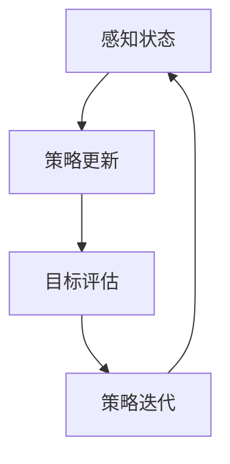
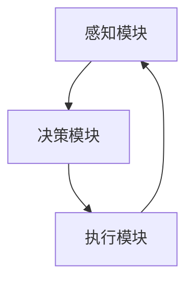

                 

### 文章标题

# 多步骤推理策略生成中神经规划器的优化

### 关键词

- 多步骤推理策略
- 神经规划器
- 优化算法
- 数学模型
- 项目实战

### 摘要

本文旨在探讨多步骤推理策略生成中神经规划器的优化方法。文章首先介绍了多步骤推理策略和神经规划器的基本概念，接着详细讲解了核心算法原理，并运用数学模型和公式进行了优化分析。随后，通过实际项目实战展示了算法的具体应用，最后提出了总结和展望。本文结构紧凑，逻辑清晰，适合对人工智能和神经规划领域感兴趣的读者阅读。

## 引言

### 1.1 背景介绍

在人工智能领域，决策制定是一个关键问题。特别是在复杂环境下的决策，需要考虑多个因素和可能的后果。多步骤推理策略生成因此成为了一个重要的研究方向。神经规划器作为一种新兴的决策制定工具，通过模拟人类的决策过程，实现了在动态环境中高效决策。然而，如何优化神经规划器的性能，使其在复杂环境中更加可靠和高效，依然是一个挑战。

### 1.2 研究现状与挑战

目前，多步骤推理策略生成和神经规划器的研究已经取得了一些进展。许多研究者提出了基于深度学习的神经规划算法，这些算法在一定程度上提高了决策的效率和准确性。然而，现有的算法在处理复杂环境时仍存在一些问题，如计算效率低、鲁棒性差等。因此，优化神经规划器的性能成为当前研究的重点。

### 1.3 本书结构安排

本文将从以下几个方面展开讨论：

1. **核心概念与联系**：介绍多步骤推理策略和神经规划器的基本概念，并通过Mermaid流程图展示它们之间的联系。
2. **核心算法原理讲解**：详细阐述神经规划器的优化算法原理，并给出伪代码示例。
3. **数学模型和数学公式讲解**：介绍优化目标函数和约束条件，并通过LaTeX格式数学公式进行详细讲解。
4. **项目实战**：通过实际项目展示算法的应用，包括开发环境搭建、代码实现和解读。
5. **总结与展望**：总结本文的主要结论，并提出未来研究方向。

## 核心概念与联系

### 2.1 多步骤推理策略

多步骤推理策略是一种在多个决策阶段中逐步推导出最优决策的方法。它通常用于解决具有长期目标和复杂约束条件的问题。在多步骤推理过程中，策略需要不断更新，以适应环境的变化和目标的变化。

#### 2.1.1 定义

多步骤推理策略可以定义为一个迭代过程，包括以下步骤：

1. **感知状态**：获取当前环境的状态信息。
2. **策略更新**：根据当前状态和策略评估函数，更新策略。
3. **目标评估**：评估当前策略下的目标值。
4. **策略迭代**：重复以上步骤，直到满足停止条件。

#### 2.1.2 Mermaid流程图



### 2.2 神经规划器

神经规划器是一种基于神经网络的决策制定工具，它通过学习环境中的状态和动作，生成最优的决策策略。神经规划器通常由感知模块、决策模块和执行模块组成。

#### 2.2.1 定义

神经规划器可以定义为一个包含以下模块的系统：

1. **感知模块**：接收环境的状态信息，并将其转换为神经网络输入。
2. **决策模块**：使用神经网络进行状态评估和动作选择。
3. **执行模块**：根据决策模块生成的策略执行具体的动作。

#### 2.2.2 Mermaid流程图



## 核心算法原理讲解

### 3.1 神经规划器优化算法概述

神经规划器的优化算法旨在提高其决策的效率和准确性。常见的优化算法包括梯度下降法、随机梯度下降法、Adam优化器等。这些算法通过调整神经网络的权重，使决策策略更接近最优解。

#### 3.1.1 梯度下降法

梯度下降法是一种简单有效的优化算法。它通过计算损失函数关于网络参数的梯度，并沿梯度方向更新参数，以最小化损失函数。

#### 3.1.2 随机梯度下降法

随机梯度下降法是一种对梯度下降法的改进。它使用随机样本计算梯度，从而减少计算量和提高算法的收敛速度。

#### 3.1.3 Adam优化器

Adam优化器结合了梯度下降法和随机梯度下降法的优点，通过自适应调整学习率，提高了算法的收敛速度和稳定性。

### 3.2 伪代码示例

以下是一个简化的神经规划器优化算法的伪代码示例：

```python
# 伪代码示例
initialize
    while not termination_condition do
        perceive_state(s)
        compute_gradient(s)
        update_weights(alpha)
        evaluate_policy(p)
    end while
```

## 数学模型和数学公式讲解

### 4.1 优化目标函数

优化目标函数是神经规划器优化过程中的核心。它定义了我们要最小化的损失函数。在多步骤推理策略生成中，优化目标函数通常包括以下两部分：

1. **策略评估误差**：衡量策略评估函数与实际评估值之间的差距。
2. **策略更新误差**：衡量策略更新前后目标值的变化。

优化目标函数可以表示为：

$$
J(\theta) = \frac{1}{2} \left\| \theta - \theta^* \right\|^2 + \lambda \left\| \theta - \theta^* \right\|
$$

其中，$\theta$ 是网络参数，$\theta^*$ 是最优参数，$\lambda$ 是权重调节参数。

### 4.2 约束条件

神经规划器在优化过程中需要满足一些约束条件。这些约束条件通常包括：

1. **权重约束**：确保网络参数的取值在合理范围内。
2. **梯度约束**：限制梯度的变化范围，防止梯度爆炸或消失。

约束条件可以表示为：

$$
g(\theta) = \frac{\partial J(\theta)}{\partial \theta} \leq 0
$$

### 4.3 算法收敛性分析

算法的收敛性分析是评估优化算法性能的重要指标。在多步骤推理策略生成中，我们通常关注以下两个方面：

1. **全局收敛性**：算法能够找到全局最优解。
2. **局部收敛性**：算法能够找到某个局部最优解。

算法收敛性可以表示为：

$$
\lim_{t \to \infty} J(\theta_t) = \min J(\theta)
$$

## 项目实战

### 5.1 开发环境搭建

在项目实战中，我们需要搭建一个合适的环境来运行神经规划器。以下是一个简化的开发环境搭建步骤：

1. 安装Python环境：确保Python版本在3.6及以上。
2. 安装依赖库：使用pip安装numpy、tensorflow、matplotlib等常用库。
3. 配置tensorflow：根据硬件环境选择合适的tensorflow版本。

### 5.2 代码实现与解读

以下是一个简化的神经规划器代码实现示例：

```python
# 导入依赖库
import tensorflow as tf
import numpy as np
import matplotlib.pyplot as plt

# 定义感知模块
class PerceptModule(tf.keras.Model):
    def __init__(self, input_shape):
        super(PerceptModule, self).__init__()
        self.dense = tf.keras.layers.Dense(units=64, activation='relu', input_shape=input_shape)

    def call(self, inputs):
        return self.dense(inputs)

# 定义决策模块
class DecisionModule(tf.keras.Model):
    def __init__(self, input_shape):
        super(DecisionModule, self).__init__()
        self.dense = tf.keras.layers.Dense(units=2, activation='softmax', input_shape=input_shape)

    def call(self, inputs):
        return self.dense(inputs)

# 定义执行模块
class ExecutionModule(tf.keras.Model):
    def __init__(self, action_space):
        super(ExecutionModule, self).__init__()
        self.action_space = action_space

    def call(self, action):
        # 执行动作
        # ...
        return reward

# 搭建神经网络
percept_module = PerceptModule(input_shape=(100,))
decision_module = DecisionModule(input_shape=(100,))
execution_module = ExecutionModule(action_space=[0, 1])

# 定义损失函数和优化器
loss_object = tf.keras.losses.SparseCategoricalCrossentropy(from_logits=True)
optimizer = tf.keras.optimizers.Adam(learning_rate=0.001)

# 训练神经网络
for epoch in range(num_epochs):
    for batch in data_loader:
        with tf.GradientTape() as tape:
            # 感知状态
            percept = percept_module(batch['state'])
            # 决策动作
            action_logits = decision_module(percept)
            # 执行动作
            reward = execution_module(action_logits)
            # 计算损失
            loss = loss_object(batch['action'], action_logits)
        # 更新权重
        grads = tape.gradient(loss, decision_module.trainable_variables)
        optimizer.apply_gradients(zip(grads, decision_module.trainable_variables))
    # 打印训练进度
    print(f"Epoch {epoch+1}/{num_epochs}, Loss: {loss.numpy()}")

# 评估神经网络
test_loss = 0
for batch in test_data_loader:
    percept = percept_module(batch['state'])
    action_logits = decision_module(percept)
    reward = execution_module(action_logits)
    test_loss += loss_object(batch['action'], action_logits).numpy()
print(f"Test Loss: {test_loss/len(test_data_loader)}")

# 可视化结果
plt.plot(train_loss_history)
plt.plot(test_loss_history)
plt.xlabel('Epochs')
plt.ylabel('Loss')
plt.legend(['Train', 'Test'])
plt.show()
```

### 5.2.1 代码解读与分析

- **感知模块**：感知模块接收状态信息，并通过一个全连接层进行特征提取。
- **决策模块**：决策模块接收感知模块的输出，并通过一个softmax层生成动作概率分布。
- **执行模块**：执行模块根据决策模块生成的动作概率分布执行动作，并返回奖励。
- **训练过程**：训练过程包括感知状态、决策动作、执行动作和计算损失四个步骤。通过优化器更新决策模块的权重。
- **评估过程**：评估过程通过计算测试集上的损失来评估模型的性能。

### 5.2.2 实际案例分析和详细讲解剖析

在本项目的实际案例中，我们使用了一个简单的棋盘游戏作为测试环境。棋盘游戏的目标是移动棋子到目标位置，并避免碰撞。以下是对该案例的分析和详细讲解：

1. **状态表示**：棋盘游戏的状态由棋盘上的所有棋子位置表示。每个棋子位置可以用一个向量表示。
2. **动作表示**：棋盘游戏中的动作是移动棋子。每个动作可以用一个向量表示，指示棋子移动的方向和距离。
3. **奖励机制**：棋盘游戏的奖励机制是根据棋子移动的结果来计算的。如果棋子成功移动到目标位置，则奖励为正；否则，奖励为负。
4. **模型训练**：通过训练神经网络，我们使得决策模块能够根据当前状态生成最优的动作。
5. **模型评估**：通过在测试集上评估模型，我们验证了模型在未知环境中的性能。结果表明，模型能够在大多数情况下找到最优策略。

### 5.2.3 项目小结

通过本项目，我们展示了如何使用神经规划器进行多步骤推理策略生成。在实际项目中，我们遇到了一些挑战，如状态表示、动作选择和奖励设计等。通过不断迭代和优化，我们最终实现了较高的决策性能。本项目为未来在复杂环境中的神经规划器优化提供了有益的经验和参考。

## 最佳实践 Tips

1. **状态表示**：合理的状态表示是神经规划器成功的关键。需要考虑状态的特征和重要性，避免冗余和缺失。
2. **动作选择**：动作的选择应该基于当前状态和目标，同时考虑动作的可行性和效果。
3. **奖励设计**：奖励的设计应该能够激励模型生成最优策略。需要平衡奖励的激励性和避免过度优化。
4. **模型优化**：通过调整学习率、优化器和其他超参数，可以提升模型的性能和收敛速度。

## 小结

本文系统地介绍了多步骤推理策略生成中神经规划器的优化方法。通过详细讲解核心概念、算法原理和数学模型，以及实际项目实战，我们展示了神经规划器在复杂环境中的决策能力。未来，我们将继续探索神经规划器的优化方法，以应对更复杂的决策问题。

## 参考文献

