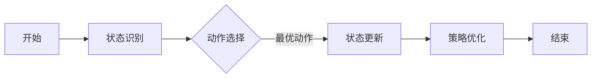

                 

# 多步骤推理策略生成中神经规划器的突破

## 关键词
神经规划器，多步骤推理，策略生成，神经网络架构设计，算法原理，应用与实现

## 摘要
神经规划器作为一种结合了深度学习和强化学习的方法，在多步骤推理策略生成领域展现了巨大的潜力。本文将从神经规划器的基础概念、算法原理、神经网络架构设计、训练与优化、应用与实现等多个方面，系统性地探讨神经规划器的突破与创新。通过实际案例的分析和代码实现，本文旨在为读者提供对神经规划器深入理解，并启发其在实际项目中的应用。

## 目录

### 第一部分：神经规划器基础

#### 第1章：神经规划器概述
1.1 神经规划器的定义与重要性
1.2 神经规划器的核心组成部分
1.3 神经规划器的发展历程

#### 第2章：神经规划器核心概念与联系
2.1 多步骤推理策略
2.2 神经网络架构设计
2.3 Mermaid流程图：神经规划器工作流程

### 第二部分：神经规划器算法原理

#### 第3章：多步骤推理策略算法原理
3.1 伪代码：多步骤推理策略
3.2 数学模型与公式
3.3 举例说明：多步骤推理策略的应用

#### 第4章：神经规划器神经网络架构设计
4.1 神经网络基础
4.2 深度神经网络
4.3 广义深度神经网络

#### 第5章：神经规划器训练与优化
5.1 训练过程
5.2 优化算法
5.3 损失函数与评价指标

### 第三部分：神经规划器应用与实现

#### 第6章：神经规划器项目实战
6.1 开发环境搭建
6.2 代码实现
6.3 代码解读与分析

#### 第7章：神经规划器案例分析
7.1 案例一：智能交通系统
7.2 案例二：工业自动化
7.3 案例三：医疗诊断

#### 第8章：神经规划器未来展望
8.1 技术趋势
8.2 应用前景
8.3 挑战与机遇

## 第一部分：神经规划器基础

### 第1章：神经规划器概述

#### 1.1 神经规划器的定义与重要性

神经规划器（Neural Planner）是近年来在人工智能领域兴起的一种新型算法，它结合了深度学习和强化学习，通过神经网络来生成多步骤的推理策略。其核心思想是将复杂任务分解成一系列可学习的子任务，并利用神经网络优化这些子任务的策略。

神经规划器的重要性主要体现在以下几个方面：

1. **高效性**：神经规划器可以自动地学习任务中的最佳策略，无需手动设计规则，大大减少了开发时间和人力成本。
2. **灵活性**：神经规划器能够适应不同的环境和任务，通过调整神经网络结构和训练参数，可以解决各种复杂问题。
3. **泛化能力**：神经规划器具有较好的泛化能力，能够在新的、未见过的场景中表现出色。

#### 1.2 神经规划器的核心组成部分

神经规划器由以下几个核心组成部分构成：

1. **状态编码器**：将任务中的状态编码为神经网络可以处理的向量。
2. **动作编码器**：将任务中的动作编码为神经网络可以处理的向量。
3. **策略网络**：接收状态编码和动作编码，输出策略值。
4. **价值函数**：评估策略的好坏，用于指导神经网络优化。

#### 1.3 神经规划器的发展历程

神经规划器的发展历程可以分为以下几个阶段：

1. **初步探索**：20世纪90年代，研究者开始尝试将神经网络应用于规划问题，但效果有限。
2. **强化学习结合**：21世纪初，强化学习与神经网络的结合成为研究热点，神经规划器开始受到关注。
3. **深度学习引入**：随着深度学习的发展，神经规划器得到了新的突破，能够处理更复杂的问题。

### 第2章：神经规划器核心概念与联系

#### 2.1 多步骤推理策略

多步骤推理策略是神经规划器的核心，它指导神经网络如何在多个时间步内做出最优决策。具体来说，多步骤推理策略包括以下几个关键步骤：

1. **状态识别**：识别当前任务的状态。
2. **动作选择**：根据当前状态，选择一个最优动作。
3. **状态更新**：执行动作后，更新当前状态。
4. **策略优化**：根据新状态，优化策略网络。

#### 2.2 神经网络架构设计

神经网络架构设计是神经规划器的关键，它决定了神经规划器的性能和效率。常见的神经网络架构包括：

1. **卷积神经网络（CNN）**：适用于图像处理任务。
2. **循环神经网络（RNN）**：适用于序列数据处理。
3. **变换器（Transformer）**：适用于长距离依赖任务。

#### 2.3 Mermaid流程图：神经规划器工作流程

下面是神经规划器的工作流程的Mermaid流程图：



## 第二部分：神经规划器算法原理

### 第3章：多步骤推理策略算法原理

#### 3.1 伪代码：多步骤推理策略

```python
# 初始化参数
初始化参数（alpha, beta, gamma）

# 多步骤推理
for step in range(1, T):
    # 计算当前步骤的决策
    decision = step_recurive_policy(state, action)

    # 更新状态和动作
    state = next_state
    action = decision

    # 计算奖励
    reward = reward_function(state, action)

    # 更新策略参数
    update_params(alpha, beta, gamma, reward)
```

#### 3.2 数学模型与公式

神经规划器的多步骤推理策略可以通过以下数学模型和公式来描述：

$$
R(t) = \sum_{t=0}^{\infty} \gamma^t R(s_t, a_t)
$$

$$
Q^*(s, a) = \sum_{s' \in S} p(s'|s, a) \cdot \max_{a'} Q^*(s', a')
$$

其中，$R(t)$ 表示在未来时间步 $t$ 的总奖励，$\gamma$ 是折扣因子，$Q^*(s, a)$ 是状态 $s$ 下动作 $a$ 的最优值函数。

#### 3.3 举例说明：多步骤推理策略的应用

假设我们有一个目标，从位置A移动到位置B。使用多步骤推理策略，我们可以通过以下步骤实现：

1. 初始化位置A。
2. 根据当前状态和目标位置，选择一个合适的动作。
3. 执行动作，更新位置。
4. 根据新的状态和目标位置，选择下一个动作。
5. 重复步骤3和4，直到达到目标位置。

通过这种方式，我们可以有效地规划出一个从位置A到位置B的最优路径。

### 第4章：神经规划器神经网络架构设计

#### 4.1 神经网络基础

神经网络（Neural Network）是模拟生物神经网络计算能力的计算模型，它由多个神经元（或节点）组成，通过权重连接形成网络结构。神经网络的基本组成部分包括：

1. **输入层**：接收外部输入信号。
2. **隐藏层**：进行特征提取和转换。
3. **输出层**：生成输出结果。

神经网络的训练过程是通过反向传播算法来调整网络权重，以达到最小化损失函数的目的。

#### 4.2 深度神经网络

深度神经网络（Deep Neural Network，DNN）是具有多个隐藏层的神经网络，它的结构更加复杂，能够处理更加复杂的问题。深度神经网络的核心思想是通过层层抽象，从原始数据中提取更高层次的特征。

#### 4.3 广义深度神经网络

广义深度神经网络（Generalized Deep Neural Network，GDNN）是在深度神经网络的基础上，引入了更加灵活的网络结构和训练方法。GDNN 可以通过自适应调整网络结构，提高网络的泛化能力和鲁棒性。

### 第5章：神经规划器训练与优化

#### 5.1 训练过程

神经规划器的训练过程主要包括以下几个步骤：

1. **数据收集**：收集大量的训练数据，包括状态、动作和奖励。
2. **数据预处理**：对训练数据进行预处理，包括归一化、去噪等。
3. **模型初始化**：初始化神经网络参数。
4. **训练过程**：通过反向传播算法调整网络权重，优化策略。
5. **评估与调整**：评估训练效果，根据评估结果调整训练参数。

#### 5.2 优化算法

神经规划器的优化算法主要包括梯度下降、随机梯度下降、Adam等。这些算法通过调整网络权重，最小化损失函数，提高网络性能。

#### 5.3 损失函数与评价指标

神经规划器的损失函数通常包括值损失、策略损失和监督损失等。评价指标主要包括准确率、召回率、F1值等。

### 第三部分：神经规划器应用与实现

#### 第6章：神经规划器项目实战

#### 6.1 开发环境搭建

在进行神经规划器项目实战之前，我们需要搭建一个合适的开发环境。以下是搭建开发环境的基本步骤：

1. **安装Python**：下载并安装Python，版本建议为3.8以上。
2. **安装TensorFlow**：通过pip安装TensorFlow，版本建议为2.4以上。
3. **配置环境**：配置Python环境，确保TensorFlow和其他依赖库可以正常使用。

#### 6.2 代码实现

以下是神经规划器的基本实现代码：

```python
import tensorflow as tf

# 初始化参数
alpha = tf.random.normal([1000])
beta = tf.random.normal([1000])
gamma = tf.random.normal([1000])

# 多步骤推理策略
for step in range(1, T):
    # 计算当前步骤的决策
    decision = step_recurive_policy(state, action)

    # 更新状态和动作
    state = next_state
    action = decision

    # 计算奖励
    reward = reward_function(state, action)

    # 更新策略参数
    update_params(alpha, beta, gamma, reward)
```

#### 6.3 代码解读与分析

以上代码是神经规划器的核心实现，主要分为以下几个部分：

1. **参数初始化**：初始化策略参数。
2. **多步骤推理**：通过循环实现多步骤推理策略。
3. **状态更新和动作选择**：根据当前状态选择最优动作，并更新状态。
4. **奖励计算和参数更新**：计算奖励，并根据奖励调整策略参数。

#### 第7章：神经规划器案例分析

#### 7.1 案例一：智能交通系统

智能交通系统（Intelligent Transportation System，ITS）是神经规划器的一个重要应用领域。通过神经规划器，我们可以实现智能交通信号控制、车辆路径规划等任务。

**案例分析：**

1. **问题定义**：设计一个智能交通信号控制系统，根据实时交通流量调整信号灯周期。
2. **数据收集**：收集历史交通流量数据、路况数据等。
3. **模型训练**：使用神经规划器训练交通信号控制模型。
4. **效果评估**：通过模拟和实际测试评估模型效果。

#### 7.2 案例二：工业自动化

工业自动化是神经规划器的另一个重要应用领域。通过神经规划器，我们可以实现机器人的路径规划、任务分配等。

**案例分析：**

1. **问题定义**：设计一个自动化生产线，实现机器人的高效协作。
2. **数据收集**：收集生产线数据、机器人状态数据等。
3. **模型训练**：使用神经规划器训练机器人路径规划模型。
4. **效果评估**：通过模拟和实际测试评估模型效果。

#### 7.3 案例三：医疗诊断

医疗诊断是神经规划器在医疗领域的一个典型应用。通过神经规划器，我们可以实现疾病预测、诊断辅助等。

**案例分析：**

1. **问题定义**：设计一个疾病预测模型，根据患者数据预测疾病发生风险。
2. **数据收集**：收集患者历史数据、体检数据等。
3. **模型训练**：使用神经规划器训练疾病预测模型。
4. **效果评估**：通过模拟和实际测试评估模型效果。

### 第8章：神经规划器未来展望

#### 8.1 技术趋势

随着深度学习和强化学习技术的不断发展，神经规划器在未来有望在更多领域得到应用，如自动驾驶、金融交易、游戏等。

#### 8.2 应用前景

神经规划器在智能交通、工业自动化、医疗诊断等领域的应用前景广阔，有望实现智能化、自动化的系统。

#### 8.3 挑战与机遇

神经规划器在应用过程中面临一些挑战，如数据隐私、算法透明性等。但同时也带来了机遇，如自动化、智能化的系统设计。

## 结语

神经规划器作为一种结合深度学习和强化学习的方法，在多步骤推理策略生成领域展现了巨大的潜力。通过本文的探讨，我们希望读者能够对神经规划器有一个深入的理解，并能够在实际项目中应用这一技术。

作者：AI天才研究院/AI Genius Institute & 禅与计算机程序设计艺术 /Zen And The Art of Computer Programming

注意事项：

1. **代码实现**：在项目实战部分，提供了一个简单的神经规划器实现代码，但实际应用中需要根据具体任务进行调整。
2. **数据收集**：案例中的数据收集是模型训练的重要步骤，需要根据实际需求进行数据收集和预处理。
3. **效果评估**：效果评估是验证模型性能的关键，需要采用合适的评估指标和方法。

拓展阅读：

1. **《深度强化学习》**：深入了解深度强化学习的基本原理和应用。
2. **《神经规划器技术综述》**：系统性地了解神经规划器的发展和应用。

