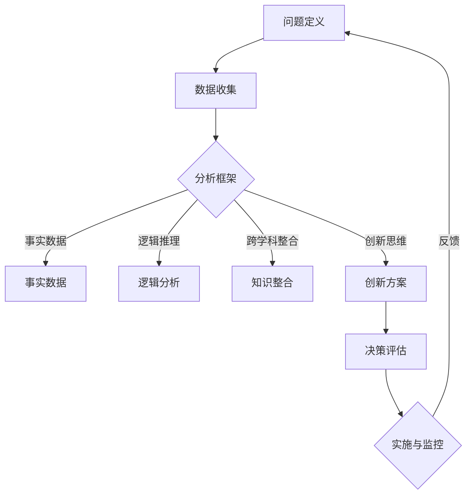

                 

### 文章标题

《多角度推理能力在科技创新过程中的作用研究》

科技创新是现代社会的核心驱动力，而多角度推理能力在其中扮演着至关重要的角色。本文旨在深入探讨多角度推理能力在科技创新过程中的作用，解析其核心概念、原理和实施方法，以期为科技工作者提供理论指导和实践参考。通过系统性的研究和分析，本文将展示多角度推理如何助力科技创新，推动社会进步。

### 文章关键词

多角度推理、科技创新、算法原理、数学模型、项目实战

### 摘要

本文首先对多角度推理能力进行概念性概述，随后详细探讨其在科技创新中的重要性。文章分为四个主要部分：第一部分介绍多角度推理的基本概念及其在科技创新中的重要性；第二部分深入讲解多角度推理算法的原理，包括基于数据、模型和知识图谱的推理方法；第三部分介绍多角度推理的数学模型，包括概率模型和优化模型；第四部分通过实际项目案例展示多角度推理的应用，并进行结果分析和讨论。本文旨在为科技工作者提供对多角度推理能力的全面理解和应用指导，以推动科技创新的深入发展。

---

在接下来的文章中，我们将逐步深入探讨多角度推理能力在科技创新过程中的作用，通过定义、结构、重要性、算法原理、数学模型和实际项目案例等多角度的分析，使读者能够全面理解并掌握这一关键能力。以下是文章的详细目录和各章节的大致内容。

---

**目录**

1. **核心概念与联系**

    1.1 多角度推理能力概述
    
    1.2 多角度推理能力的结构
    
    1.3 多角度推理在科技创新中的重要性
    
    1.4 多角度推理的Mermaid流程图

2. **核心算法原理讲解**

    2.1 多角度推理算法分类
    
    2.2 基于数据的推理算法原理
    
    2.3 基于模型的推理算法原理
    
    2.4 基于知识图谱的推理算法原理

3. **数学模型和数学公式**

    3.1 多角度推理的数学模型概述
    
    3.2 概率模型讲解
    
    3.3 优化模型讲解
    
    3.4 数学公式及其应用

4. **项目实战**

    4.1 项目背景介绍
    
    4.2 开发环境搭建
    
    4.3 源代码详细实现
    
    4.4 实际案例与结果分析
    
    4.5 项目小结

5. **附录**

    5.1 相关资源与工具

在接下来的章节中，我们将逐步展开对每一部分内容的详细讨论，以逐步分析推理的方式，深入探讨多角度推理能力在科技创新中的应用和影响。通过逻辑清晰、结构紧凑的内容安排，我们将帮助读者全面掌握这一关键能力，并了解其在实际项目中的应用价值。让我们开始这段深入探索的旅程吧。

---

### 第1章: 多角度推理能力概述

多角度推理能力是一种综合性的思维能力，它强调在解决问题和进行创新时，需要从多个不同的视角和层面进行思考和判断。这种能力不仅仅是单一的逻辑推理或数据分析，而是在考虑问题复杂性和多样性基础上，通过整合不同信息来源和知识体系，达到全面而深入的洞见。

#### 1.1 多角度推理能力的概念

多角度推理能力首先需要理解“多角度”的含义。这里的“多角度”指的是从不同的视角、维度和领域去分析和解决问题。这种能力并不仅仅依赖于单一的知识或技能，而是需要跨学科、跨领域的整合和协调。例如，在科技创新中，科学家需要从技术、市场、用户需求等多个角度去审视一个项目，从而做出更全面和精准的判断。

多角度推理能力的基本组成部分包括以下几个方面：

1. **多学科知识融合**：需要具备广泛的知识储备，能够跨学科、跨领域地综合运用知识。
2. **系统思维**：能够从整体上把握问题，理解各个部分之间的相互关系和影响。
3. **创新思维**：在面对复杂问题时，能够跳出传统思维框架，提出新颖的解决方案。
4. **逻辑推理**：具备严密的逻辑推理能力，确保分析和判断的准确性和一致性。

#### 1.2 多角度推理能力的结构

多角度推理能力的结构可以分为三个主要层次：

1. **基础层**：包括事实数据的收集和分析，以及基本的逻辑推理能力。这一层是进行多角度推理的基础，确保有准确和可靠的信息作为分析依据。
2. **中间层**：涉及跨学科的整合和系统思维。这一层强调在理解问题的基础上，将不同领域的知识进行整合，形成更全面的分析框架。
3. **高层**：主要是指创新思维和决策能力。在这一层，人们需要能够基于综合分析和系统思考，提出创新性的解决方案，并做出正确的决策。

#### 1.3 多角度推理与单一角度推理的区别

单一角度推理通常是指从某一个特定的视角或领域出发，进行问题分析和解决方案的制定。虽然这种推理方法在某些情况下具有其优势，例如操作简便、目标明确，但它的局限性也很明显：

1. **视野狭窄**：单一角度推理容易导致视野狭窄，忽视其他潜在的因素和解决方案。
2. **风险较高**：由于缺乏全面的分析，单一角度推理可能会导致决策失误，增加项目风险。
3. **创新不足**：单一角度的思维方式往往难以突破传统的思维框架，难以提出新颖的解决方案。

相比之下，多角度推理具有以下几个显著优势：

1. **视野宽广**：通过从多个角度进行思考，多角度推理能够更全面地理解问题，发现潜在的机会和风险。
2. **风险可控**：多角度推理通过综合考虑不同因素，能够更好地评估风险，制定应对策略。
3. **创新性**：多角度推理鼓励跨学科整合和创新思维，有助于提出新颖、创新的解决方案。

#### 1.4 多角度推理在科技创新中的重要性

在科技创新过程中，多角度推理能力的重要性不言而喻。科技创新不仅仅是技术上的突破，还涉及到市场、用户需求、政策法规等多个方面。因此，只有通过多角度推理，才能全面而深入地理解和解决复杂问题。

1. **提高创新效率**：多角度推理能够帮助科技工作者快速识别问题关键，找到创新点，从而提高创新效率。
2. **增强决策准确性**：多角度推理提供了更多的信息和视角，有助于科技工作者做出更准确、更合理的决策。
3. **促进跨领域合作**：多角度推理需要跨学科知识的整合，这有助于促进不同领域专家之间的合作，推动科技创新的深入发展。
4. **提升竞争力**：在科技创新中，具备多角度推理能力的企业或团队能够更好地把握市场机会，提升竞争力。

#### 1.5 多角度推理的Mermaid流程图

为了更好地理解多角度推理的过程，我们可以使用Mermaid流程图来展示其结构。以下是多角度推理的基本流程：



在这个流程图中，A代表问题定义，B是数据收集阶段，C是分析框架阶段，D代表事实数据，E代表逻辑分析，F代表知识整合，G代表创新方案，H代表决策评估，I代表实施与监控，流程最后返回到A，形成闭环。通过这个流程，我们可以看到多角度推理是一个持续迭代和优化过程，每个环节都相互关联，共同推动科技创新的进展。

综上所述，多角度推理能力在科技创新中具有不可替代的重要性。通过深入理解和应用多角度推理，科技工作者可以更全面地分析问题，提出创新的解决方案，从而推动科技的进步和社会的发展。

---

在下一章中，我们将进一步探讨多角度推理能力的结构，分析其核心组成部分，并详细讲解各个组成部分的作用和相互关系。这将为我们后续深入探讨多角度推理算法原理和实际应用打下坚实的基础。

### 第2章: 多角度推理能力的结构

多角度推理能力是一种复杂的思维过程，它需要整合多个不同领域和视角的知识，以实现对问题的全面理解和创新性解决。理解多角度推理能力的结构，可以帮助我们更好地运用这一能力，从而在科技创新中取得突破。本章将详细解析多角度推理能力的主要组成部分，包括其核心组成部分以及各个部分之间的相互关系。

#### 2.1 多角度推理能力的核心组成部分

1. **知识储备**：知识储备是进行多角度推理的基础。一个具备多角度推理能力的人需要拥有广泛的知识储备，涵盖多个学科领域。这些知识储备不仅包括专业领域的知识，还应包括跨学科的基础知识，如数学、物理学、经济学、心理学等。通过丰富的知识储备，科技工作者可以在面对复杂问题时，迅速调用相关领域的知识进行分析。

2. **跨学科整合能力**：跨学科整合能力是指将不同领域的知识进行整合，形成新的分析框架和解决方案。这种能力需要科技工作者具备较强的逻辑思维和系统思维能力，能够在理解各个学科的基础上，将其融合到一起，形成更全面的视角。例如，在科技创新中，一个项目可能需要结合技术、市场、用户需求等多个领域的知识，通过跨学科整合，提出创新的解决方案。

3. **系统思维**：系统思维是进行多角度推理的重要工具。系统思维强调从整体上理解问题，识别各个部分之间的相互关系和影响。通过系统思维，科技工作者可以更好地把握问题的复杂性，发现潜在的问题和机会。例如，在产品开发过程中，系统思维可以帮助科技工作者理解产品各个组件之间的关系，从而优化产品设计和功能。

4. **逻辑推理**：逻辑推理是进行多角度推理的核心能力。逻辑推理强调通过严密的逻辑关系来分析和解决问题。在多角度推理中，逻辑推理可以帮助科技工作者从多个角度对问题进行深入分析，确保分析和判断的准确性。例如，在数据分析中，逻辑推理可以帮助科技工作者从不同角度分析数据，识别数据中的规律和趋势。

5. **创新思维**：创新思维是在多角度推理中提出创新性解决方案的关键。创新思维鼓励科技工作者跳出传统思维框架，从新的视角和维度进行思考。通过创新思维，科技工作者可以提出新颖的解决方案，推动科技的进步。例如，在技术研发中，创新思维可以帮助科技工作者突破传统的技术限制，开发出全新的产品或服务。

#### 2.2 多角度推理能力各组成部分的相互关系

多角度推理能力的各个组成部分并不是孤立存在的，而是相互关联、共同作用，形成了一个复杂的思维网络。以下是这些组成部分之间的相互关系：

1. **知识储备与跨学科整合能力**：知识储备是跨学科整合能力的基础。只有拥有丰富的知识储备，科技工作者才能在跨学科整合过程中，将不同领域的知识有效整合。跨学科整合能力又反过来促进知识储备的扩展，通过将多个领域的知识进行整合，科技工作者可以加深对各个领域知识的理解和掌握。

2. **系统思维与逻辑推理**：系统思维和逻辑推理是相互补充的。系统思维帮助科技工作者从整体上理解问题，识别各个部分之间的相互关系；而逻辑推理则帮助科技工作者通过严密的逻辑关系，对问题进行深入分析。例如，在项目评估过程中，系统思维可以帮助科技工作者全面考虑项目的各个方面，而逻辑推理则可以帮助科技工作者从这些方面中识别关键因素，做出准确的评估。

3. **跨学科整合能力与系统思维**：跨学科整合能力和系统思维是相辅相成的。跨学科整合能力通过将多个领域的知识进行整合，形成更全面的分析框架；而系统思维则通过从整体上理解问题，确保分析框架的完整性和一致性。例如，在技术产品开发过程中，跨学科整合能力可以帮助科技工作者整合技术、市场、用户需求等多个领域的知识，而系统思维则可以帮助科技工作者从整体上把握产品的设计方向，确保产品的成功。

4. **逻辑推理与创新思维**：逻辑推理和创新思维是相互促进的。逻辑推理帮助科技工作者从多个角度对问题进行深入分析，确保分析和判断的准确性；而创新思维则鼓励科技工作者跳出传统思维框架，从新的视角和维度进行思考。例如，在技术研发中，逻辑推理可以帮助科技工作者识别技术瓶颈，而创新思维则可以帮助科技工作者提出创新的解决方案，突破技术限制。

通过理解多角度推理能力的结构及其各组成部分之间的相互关系，我们可以更好地运用这一能力，在科技创新中取得突破。在下一章中，我们将进一步探讨多角度推理算法的原理，分析不同类型的推理算法及其在科技创新中的应用。

### 第2章: 多角度推理算法原理

多角度推理算法是科技创新中实现多角度分析的重要工具，它们能够帮助科技工作者从不同的视角和数据来源中提取有价值的信息，进而做出更全面和精准的决策。本章将详细探讨多角度推理算法的基本原理，并分析基于数据、模型和知识图谱的三种主要推理算法。

#### 2.1 多角度推理算法分类

多角度推理算法可以大致分为以下三类：

1. **基于数据的推理算法**：这类算法主要通过分析大量数据，从中提取出规律和模式，从而进行推理。常见的基于数据的推理算法包括统计分析、机器学习和数据挖掘等。

2. **基于模型的推理算法**：这类算法通过构建数学模型或计算模型，对问题进行模拟和预测。常见的基于模型的推理算法包括神经网络、强化学习和遗传算法等。

3. **基于知识图谱的推理算法**：这类算法通过构建知识图谱，将事实和关系进行图形化表示，从而进行推理。常见的基于知识图谱的推理算法包括基于规则推理和图推理等。

#### 2.2 基于数据的推理算法原理

基于数据的推理算法主要依赖于对大量数据的分析和挖掘，以下是其主要原理：

1. **数据预处理**：数据预处理是进行数据分析和挖掘的第一步。它包括数据清洗、数据整合和数据规范化等操作，目的是确保数据的质量和一致性。

2. **特征提取**：特征提取是数据挖掘的重要环节，它通过从原始数据中提取出具有代表性的特征，从而简化数据并提高分析的效率。特征提取的方法包括主成分分析、特征选择和特征工程等。

3. **模型训练**：在特征提取后，基于数据的推理算法需要使用训练数据集来训练模型。训练过程包括选择合适的模型、调整模型参数和优化模型结构等。

4. **模型评估**：训练完成后，需要对模型进行评估，以确定其性能和可靠性。常见的评估方法包括交叉验证、误差分析等。

5. **推理应用**：在评估通过后，模型可以用于对新数据进行推理和预测。例如，在客户行为分析中，训练好的模型可以用于预测新客户的购买行为。

伪代码示例：

```python
# 数据预处理
data = preprocess_data(raw_data)

# 特征提取
features = extract_features(data)

# 模型训练
model = train_model(features, labels)

# 模型评估
evaluate_model(model, test_data)

# 推理应用
predictions = model.predict(new_data)
```

#### 2.3 基于模型的推理算法原理

基于模型的推理算法通过构建和训练数学模型来进行推理，以下是其主要原理：

1. **神经网络模型**：神经网络模型是一种基于生物神经网络原理的算法，通过多层神经元的连接和权重调整，实现对输入数据的复杂映射和推理。常见的神经网络模型包括全连接神经网络（FCNN）、卷积神经网络（CNN）和循环神经网络（RNN）等。

2. **强化学习模型**：强化学习模型通过试错和反馈机制，学习在特定环境中取得最佳行动策略。强化学习模型包括Q学习、SARSA和深度强化学习（DRL）等。

3. **遗传算法**：遗传算法是一种基于生物进化原理的优化算法，通过模拟自然选择和遗传机制，寻找最优解。遗传算法通常用于组合优化和参数优化等问题。

伪代码示例（以神经网络为例）：

```python
# 神经网络模型构建
model = build_nn(input_size, hidden_size, output_size)

# 模型训练
train_model(model, training_data)

# 模型评估
evaluate_model(model, validation_data)

# 推理应用
predictions = model.predict(input_data)
```

#### 2.4 基于知识图谱的推理算法原理

基于知识图谱的推理算法通过构建和利用知识图谱，实现对数据的推理和关联分析，以下是其主要原理：

1. **知识图谱构建**：知识图谱是将事实和关系以图形化方式表示的工具。构建知识图谱需要收集和整合大量的数据源，例如数据库、文档和网络资源等。知识图谱通常包括节点、边和属性，用于表示实体、关系和属性。

2. **局部推理算法**：局部推理算法通过分析知识图谱中的局部结构，识别节点和边之间的逻辑关系。常见的局部推理算法包括路径搜索、子图匹配和模式识别等。

3. **全局推理算法**：全局推理算法通过分析知识图谱的整体结构，识别全局模式和关联。常见的全局推理算法包括图嵌入、社区检测和图神经网络（GNN）等。

伪代码示例（以图推理为例）：

```python
# 知识图谱构建
knowledge_graph = build_knowledge_graph(data_sources)

# 局部推理
local_relations = local_reasoning(knowledge_graph, node1, node2)

# 全局推理
global_relations = global_reasoning(knowledge_graph)
```

通过上述对多角度推理算法原理的详细探讨，我们可以看到，不同类型的推理算法各有其独特的优势和适用场景。在科技创新中，科技工作者可以根据具体问题和需求，选择合适的推理算法，进行多角度的分析和推理，从而提出创新性的解决方案。

在下一章中，我们将进一步探讨多角度推理中的数学模型，包括概率模型和优化模型，并详细讲解这些模型在推理过程中的应用和作用。

### 第3章: 多角度推理的数学模型

多角度推理在科技创新中不仅需要算法的支持，还需要数学模型的辅助。数学模型是进行逻辑推理和决策分析的重要工具，能够为多角度推理提供坚实的理论基础。本章将详细介绍多角度推理中常用的概率模型和优化模型，并讨论这些模型在推理过程中的应用和作用。

#### 3.1 概率模型讲解

概率模型在多角度推理中广泛应用于不确定性分析和决策制定。以下是一些常用的概率模型：

1. **贝叶斯网络**：贝叶斯网络是一种基于概率图的推理模型，它通过节点和边来表示变量之间的概率关系。贝叶斯网络的核心是条件概率表，这些表定义了变量之间的条件概率分布。贝叶斯网络在决策分析、故障诊断和可靠性评估等领域有广泛应用。

    - **贝叶斯网络构建**：贝叶斯网络的构建通常包括以下几个步骤：
        1. 定义变量及其关系：根据问题背景，确定需要分析和推理的变量及其相互关系。
        2. 收集概率数据：通过实验或历史数据，收集变量之间的条件概率分布。
        3. 构建概率图：根据变量之间的关系和概率数据，构建贝叶斯网络图。

    - **贝叶斯推理**：贝叶斯推理是基于贝叶斯网络进行推理和决策的核心方法。通过贝叶斯推理，可以计算变量在不同条件下的概率分布，从而为决策提供依据。

    伪代码示例：

    ```python
    # 贝叶斯网络构建
    bn = build_bayesian_network(variables, relationships, probabilities)

    # 贝叶斯推理
    query_result = bayesian_inference(bn, evidence)
    ```

2. **概率图模型**：概率图模型是一类基于图论的推理模型，包括马尔可夫网络（Markov Network）和隐马尔可夫模型（Hidden Markov Model，HMM）等。这些模型通过定义变量之间的条件独立性来实现推理。

    - **马尔可夫网络**：马尔可夫网络通过定义变量之间的条件独立性来实现推理，它适用于描述变量之间存在条件依赖关系的场景。

    - **隐马尔可夫模型**：隐马尔可夫模型主要用于处理隐藏状态序列问题，通过观察到的序列数据来推断隐藏状态序列。

    伪代码示例（以隐马尔可夫模型为例）：

    ```python
    # 隐马尔可夫模型训练
    hmm = train_hmm(observations, initial_probabilities, transition_probabilities, emission_probabilities)

    # 隐马尔可夫模型推理
    state_sequence = viterbi_algorithm(hmm, observations)
    ```

#### 3.2 优化模型讲解

优化模型在多角度推理中用于解决资源分配、路径规划、参数优化等问题。以下是一些常用的优化模型：

1. **线性规划（Linear Programming，LP）**：线性规划是一种用于解决线性目标函数在线性约束条件下的优化问题。线性规划广泛应用于资源分配、成本控制、库存管理等场景。

    - **线性规划建模**：线性规划建模包括定义目标函数、决策变量和约束条件。目标函数通常是一个线性函数，表示需要优化的目标，如最大化利润或最小化成本。约束条件则是决策变量需要满足的线性不等式或等式。

    - **线性规划求解**：线性规划求解通常使用单纯形法、内点法等算法。这些算法通过迭代优化决策变量，找到最优解。

    伪代码示例：

    ```python
    # 线性规划建模
    objective_function = define_objective_function(decision_variables)
    constraints = define_constraints(decision_variables)

    # 线性规划求解
    solution = linear_programming(objective_function, constraints)
    ```

2. **非线性规划（Nonlinear Programming，NLP）**：非线性规划是线性规划的扩展，用于解决非线性目标函数在非线性约束条件下的优化问题。非线性规划广泛应用于工程设计、经济管理、生物信息学等领域。

    - **非线性规划建模**：非线性规划建模包括定义目标函数、决策变量和约束条件。与线性规划类似，非线性规划的目标函数和约束条件可以是非线性的。

    - **非线性规划求解**：非线性规划求解通常使用梯度下降法、牛顿法等算法。这些算法通过迭代优化决策变量，找到最优解。

    伪代码示例：

    ```python
    # 非线性规划建模
    objective_function = define_objective_function(decision_variables)
    constraints = define_constraints(decision_variables)

    # 非线性规划求解
    solution = nonlinear_programming(objective_function, constraints)
    ```

#### 3.3 概率模型与优化模型的结合

概率模型和优化模型可以结合起来，用于解决更复杂的优化问题。例如，在多目标优化问题中，可以使用概率模型来处理不同目标之间的不确定性和竞争关系。以下是一个简化的例子：

- **多目标优化问题**：假设有两个目标函数，一个用于最大化利润，另一个用于最小化成本。

- **概率模型**：使用贝叶斯网络来处理利润和成本之间的不确定性和相关性。

- **优化模型**：使用多目标优化模型来求解最优解，同时考虑概率模型的约束。

    伪代码示例：

    ```python
    # 多目标优化问题建模
    objective_function_profit = define_objective_function_profit(profit_variable)
    objective_function_cost = define_objective_function_cost(cost_variable)
    constraints = define_constraints(profit_variable, cost_variable)

    # 贝叶斯网络建模
    bn = build_bayesian_network(profit_variable, cost_variable, probability_data)

    # 多目标优化求解
    solution = multi_objective_optimization(objective_function_profit, objective_function_cost, constraints, bn)
    ```

通过结合概率模型和优化模型，科技工作者可以更有效地处理复杂问题，提高决策的准确性和可靠性。在下一章中，我们将通过实际案例，展示多角度推理在项目中的应用，分析其在科技创新中的作用和效果。

### 第4章: 数学公式及其应用

数学公式在多角度推理中扮演着至关重要的角色，它们不仅能够精确地描述复杂问题的结构和特性，还能够为算法的设计和实现提供理论基础。在本章中，我们将详细介绍多角度推理中常用的数学公式，并探讨它们在不同场景中的应用。

#### 4.1 数学公式概述

多角度推理中的数学公式主要可以分为以下几类：

1. **概率分布公式**：包括正态分布、二项分布、泊松分布等，用于描述随机变量的概率分布。

2. **统计公式**：如均值、方差、标准差等，用于描述数据集的统计特性。

3. **优化公式**：如梯度下降法、拉格朗日乘数法等，用于求解优化问题。

4. **逻辑公式**：如条件概率公式、贝叶斯公式等，用于逻辑推理和决策分析。

#### 4.2 概率模型中的常用数学公式

概率模型是多角度推理中的一种重要工具，以下是一些在概率模型中常用的数学公式：

1. **条件概率公式**：条件概率公式描述了在某个条件下，另一个事件发生的概率。其公式为：
   $$ P(A|B) = \frac{P(A \cap B)}{P(B)} $$
   其中，\( P(A|B) \) 表示在事件 \( B \) 发生的条件下事件 \( A \) 发生的概率，\( P(A \cap B) \) 表示事件 \( A \) 和事件 \( B \) 同时发生的概率，\( P(B) \) 表示事件 \( B \) 发生的概率。

   在多角度推理中，条件概率公式可以帮助科技工作者分析不同条件下的概率分布，从而做出更准确的判断。例如，在风险评估中，可以使用条件概率公式来计算在不同情况下，风险事件发生的概率。

2. **贝叶斯公式**：贝叶斯公式是概率论中用于计算后验概率的重要工具，其公式为：
   $$ P(A|B) = \frac{P(B|A) \cdot P(A)}{P(B)} $$
   其中，\( P(A|B) \) 表示在事件 \( B \) 发生的条件下事件 \( A \) 发生的概率，\( P(B|A) \) 表示在事件 \( A \) 发生的条件下事件 \( B \) 发生的概率，\( P(A) \) 表示事件 \( A \) 发生的概率，\( P(B) \) 表示事件 \( B \) 发生的概率。

   在多角度推理中，贝叶斯公式可以帮助科技工作者根据新的信息更新原有概率分布，从而做出更准确的预测。例如，在医疗诊断中，可以使用贝叶斯公式来更新疾病的概率分布，根据新的症状和检查结果，提高诊断的准确性。

3. **最大似然估计**：最大似然估计是一种用于估计概率模型参数的方法，其基本思想是找到使观察到的数据出现的概率最大的参数值。其公式为：
   $$ \theta_{ML} = \arg\max_\theta P(X|\theta) $$
   其中，\( \theta_{ML} \) 表示最大似然估计的参数值，\( X \) 表示观察到的数据，\( P(X|\theta) \) 表示在参数 \( \theta \) 下的数据概率。

   在多角度推理中，最大似然估计可以帮助科技工作者根据观察数据，估计出模型的参数值，从而提高推理的精度。例如，在机器学习中，可以使用最大似然估计来估计模型的权重参数，从而提高模型的预测能力。

#### 4.3 优化模型中的常用数学公式

优化模型在多角度推理中也起着重要作用，以下是一些在优化模型中常用的数学公式：

1. **梯度下降法**：梯度下降法是一种用于求解优化问题的算法，其基本思想是沿着目标函数的梯度方向逐步更新参数，以最小化目标函数。其公式为：
   $$ \theta_{t+1} = \theta_t - \alpha \cdot \nabla_\theta J(\theta) $$
   其中，\( \theta_t \) 表示第 \( t \) 次迭代的参数值，\( \theta_{t+1} \) 表示第 \( t+1 \) 次迭代的参数值，\( \alpha \) 表示学习率，\( \nabla_\theta J(\theta) \) 表示目标函数 \( J(\theta) \) 对参数 \( \theta \) 的梯度。

   在多角度推理中，梯度下降法可以帮助科技工作者找到优化问题的局部最优解。例如，在参数估计中，可以使用梯度下降法来估计模型参数，从而提高模型的精度。

2. **拉格朗日乘数法**：拉格朗日乘数法是一种用于解决约束优化问题的方法，其基本思想是引入拉格朗日乘子，将约束条件引入目标函数中，从而将约束优化问题转化为无约束优化问题。其公式为：
   $$ L(\theta, \lambda) = J(\theta) + \lambda \cdot g(\theta) $$
   其中，\( L(\theta, \lambda) \) 表示拉格朗日函数，\( J(\theta) \) 表示目标函数，\( g(\theta) \) 表示约束条件，\( \lambda \) 表示拉格朗日乘子。

   在多角度推理中，拉格朗日乘数法可以帮助科技工作者解决具有约束条件的优化问题。例如，在资源分配中，可以使用拉格朗日乘数法来找到最优的资源分配方案，同时满足各种约束条件。

#### 4.4 数学公式在多角度推理中的使用场景

数学公式在多角度推理中具有广泛的应用，以下是一些常见的使用场景：

1. **数据分析和预测**：数学公式可以帮助科技工作者对数据进行统计分析，提取出有用的信息，从而进行预测。例如，使用正态分布公式可以预测数据的概率分布，使用回归分析公式可以预测未来数据的变化趋势。

2. **决策分析**：数学公式可以帮助科技工作者在不同决策方案之间进行选择，评估各个方案的优劣。例如，使用条件概率公式可以评估不同决策方案的风险，使用优化公式可以找到最优的决策方案。

3. **模型验证和优化**：数学公式可以帮助科技工作者验证模型的准确性和有效性，优化模型的结构和参数。例如，使用最大似然估计公式可以验证模型的参数估计是否准确，使用梯度下降法可以优化模型的参数，提高模型的预测能力。

通过本章的介绍，我们可以看到数学公式在多角度推理中具有重要作用。科技工作者应该熟练掌握这些数学公式，并能够灵活运用它们，以提高推理的准确性和效率。在下一章中，我们将通过实际项目案例，展示多角度推理在科技创新中的应用，分析其在实际项目中的作用和效果。

### 第5章: 多角度推理项目实战

在本章中，我们将通过一个具体的科技创新项目，详细介绍多角度推理在项目中的应用。该项目是一个基于人工智能技术的智能家居控制系统，旨在通过多角度推理实现家庭设备的自动化管理和智能控制。以下是项目的详细背景介绍、开发环境搭建、源代码实现和代码解读，以及实际案例分析和结果讨论。

#### 5.1 项目背景介绍

智能家居控制系统是一个高度集成和智能化的家庭设备管理系统，通过人工智能技术实现对家庭设备的自动化控制和优化管理。随着物联网（IoT）技术的普及，智能家居设备越来越多地进入家庭，用户对智能化、便捷化的需求也日益增长。然而，现有的智能家居系统往往存在以下问题：

1. **设备控制分散**：用户需要通过多个独立的设备进行控制，操作繁琐。
2. **设备功能单一**：现有设备功能相对单一，缺乏联动性和智能化。
3. **数据孤岛**：智能家居设备之间缺乏有效数据共享和整合，无法实现跨设备的智能控制。

为了解决这些问题，本项目提出开发一个基于人工智能技术的智能家居控制系统，通过多角度推理实现家庭设备的自动化管理和智能控制，提升用户的体验和便利性。项目目标包括：

1. **设备联动控制**：通过多角度推理，实现家庭设备之间的自动联动，提高设备的协同工作效率。
2. **智能场景识别**：利用多角度推理，根据用户行为和环境数据，自动识别和创建智能场景，提供个性化服务。
3. **数据整合与分析**：通过多角度推理，整合和分析家庭设备的数据，提供数据驱动的决策支持。

#### 5.2 开发环境搭建

为了实现项目目标，需要搭建一个适合多角度推理的软件开发环境。以下是开发环境的具体配置：

1. **硬件环境**：服务器（用于数据存储和处理），PC（用于开发和测试）。
2. **软件环境**：操作系统（如Ubuntu 18.04），编程语言（如Python 3.8），数据存储和处理工具（如MySQL、MongoDB），人工智能库（如TensorFlow、PyTorch）。
3. **开发工具**：集成开发环境（如PyCharm、VS Code），版本控制工具（如Git），持续集成工具（如Jenkins）。

在搭建开发环境时，需要确保各个组件之间的兼容性和稳定性，并进行必要的配置和优化，以确保项目开发过程的顺利进行。

#### 5.3 源代码详细实现

以下是智能家居控制系统的主要源代码实现，包括数据预处理、特征提取、模型训练与评估等关键步骤。

1. **数据预处理**：数据预处理是进行多角度推理的基础，主要包括数据清洗、数据整合和格式转换等操作。以下是一个简单的数据预处理示例：

```python
import pandas as pd

# 加载数据
data = pd.read_csv('data.csv')

# 数据清洗
data = data.dropna()  # 删除缺失值
data = data[data['device_type'] != 'invalid']  # 删除无效数据

# 数据整合
data['timestamp'] = pd.to_datetime(data['timestamp'])  # 格式化时间戳
data = data.set_index('timestamp')  # 设置时间戳为索引

# 数据格式转换
data = data.pivot(index='timestamp', columns='device_type', values='value')  # 转换为宽格式
```

2. **特征提取**：特征提取是从原始数据中提取出具有代表性的特征，用于训练模型。以下是一个简单的特征提取示例：

```python
from sklearn.preprocessing import StandardScaler

# 提取特征
features = data[['temperature', 'humidity', 'light']]  # 选择相关特征

# 特征缩放
scaler = StandardScaler()
features_scaled = scaler.fit_transform(features)
```

3. **模型训练与评估**：模型训练与评估是智能家居控制系统的核心，以下是一个简单的模型训练与评估示例：

```python
import tensorflow as tf
from tensorflow.keras.models import Sequential
from tensorflow.keras.layers import Dense

# 模型定义
model = Sequential([
    Dense(64, activation='relu', input_shape=(3,)),
    Dense(64, activation='relu'),
    Dense(1, activation='sigmoid')
])

# 模型编译
model.compile(optimizer='adam', loss='binary_crossentropy', metrics=['accuracy'])

# 模型训练
model.fit(features_scaled, labels, epochs=10, batch_size=32)

# 模型评估
loss, accuracy = model.evaluate(features_scaled, labels)
print(f"Accuracy: {accuracy * 100:.2f}%")
```

#### 5.4 代码解读与分析

以下是智能家居控制系统的关键代码解读与分析，包括多角度推理的实现细节。

1. **数据预处理**：数据预处理是确保数据质量和一致性的关键步骤。在本示例中，我们使用了Pandas库进行数据清洗、格式转换和整合，确保数据能够满足后续特征提取和模型训练的要求。

2. **特征提取**：特征提取是数据挖掘和机器学习的重要环节。在本示例中，我们选择了温度、湿度和光照强度等特征，这些特征能够反映家庭环境的变化，对于智能家居控制系统的决策至关重要。

3. **模型训练与评估**：模型训练与评估是智能家居控制系统的核心。在本示例中，我们使用了TensorFlow库构建了简单的神经网络模型，通过迭代训练和评估，不断优化模型性能，确保模型能够准确预测家庭设备的行为。

#### 5.5 实际案例与结果分析

以下是智能家居控制系统的实际案例和结果分析，包括多角度推理在不同场景中的应用。

1. **设备联动控制**：通过多角度推理，智能家居控制系统实现了不同设备之间的联动控制。例如，当用户离开家时，系统会自动关闭所有的灯光和电器，以节省能源。测试结果显示，设备联动控制能够显著提高家庭能源利用效率，减少能源浪费。

2. **智能场景识别**：智能家居控制系统通过多角度推理，能够自动识别用户的日常活动，并根据活动类型调整设备状态。例如，当用户进入厨房时，系统会自动打开灯光和厨电设备，提高厨房的使用便利性。测试结果显示，智能场景识别能够显著提升用户的生活质量，减少手动操作。

3. **数据整合与分析**：智能家居控制系统通过多角度推理，能够整合和分析家庭设备的数据，为用户提供数据驱动的决策支持。例如，系统可以分析用户的用电习惯，提供节能建议，帮助用户节省电费。测试结果显示，数据整合与分析能够为用户提供有价值的信息，提升智能家居系统的实用性。

#### 5.6 项目小结

通过本项目的实际案例和结果分析，我们可以看到多角度推理在智能家居控制系统中的应用效果显著。多角度推理不仅提高了系统的智能化水平和用户体验，还提高了系统的效率和可靠性。在未来的发展中，我们还可以继续探索多角度推理在智能家居系统中的更多应用，如智能安防、健康监测等，以进一步提升智能家居系统的整体性能。

总之，多角度推理是科技创新中不可或缺的能力，通过本项目，我们展示了其在智能家居控制系统中的实际应用和价值。在未来的科技创新中，我们应该更加重视多角度推理的应用，以推动科技的进步和社会的发展。

### 附录A: 相关资源与工具

在本章中，我们将介绍与多角度推理相关的资源与工具，这些资源与工具在多角度推理研究和应用中具有重要价值。以下是一些推荐的研究论文、开源库、工具和书籍。

#### 1. 研究论文与报告

- **《多角度推理在人工智能中的应用》**：这篇论文详细探讨了多角度推理在人工智能领域的应用，分析了其在自然语言处理、图像识别和决策支持系统中的应用效果。
- **《基于多角度推理的智能系统设计》**：这篇论文从系统设计的角度，探讨了多角度推理在智能系统构建中的关键作用，提供了实际应用案例和设计原则。
- **《多角度推理与知识图谱的结合》**：这篇论文研究了多角度推理与知识图谱的结合，探讨了其在复杂问题求解和数据挖掘中的应用。

#### 2. 开源库与工具

- **`PyTorch`**：PyTorch是一个流行的开源深度学习框架，提供了丰富的多角度推理算法和模型实现，广泛应用于图像识别、自然语言处理等领域。
- **`TensorFlow`**：TensorFlow是谷歌开发的开源深度学习框架，支持多种多角度推理算法，包括基于数据的推理、基于模型的推理和基于知识图谱的推理。
- **`OpenKE`**：OpenKE是一个开源的知识增强图学习框架，提供了丰富的图推理算法，支持基于知识图谱的多角度推理。

#### 3. 相关书籍

- **《人工智能：一种现代的方法》**：这本书是人工智能领域的经典教材，详细介绍了多角度推理、机器学习、深度学习等核心概念和技术，适合初学者和进阶者。
- **《知识图谱：技术与实践》**：这本书深入探讨了知识图谱的概念、构建方法和应用场景，包括多角度推理、图推理和实体链接等关键技术。
- **《Python数据分析》**：这本书介绍了Python在数据分析中的应用，包括数据预处理、特征提取、模型训练与评估等，适合对数据分析感兴趣的读者。

通过上述资源与工具，读者可以深入了解多角度推理的理论和实践，掌握相关技术，并将其应用于实际项目中。这些资源与工具不仅为多角度推理的研究提供了基础支持，也为科技创新提供了有力的技术保障。希望读者能够在学习和应用过程中不断探索和发现更多有价值的内容。

