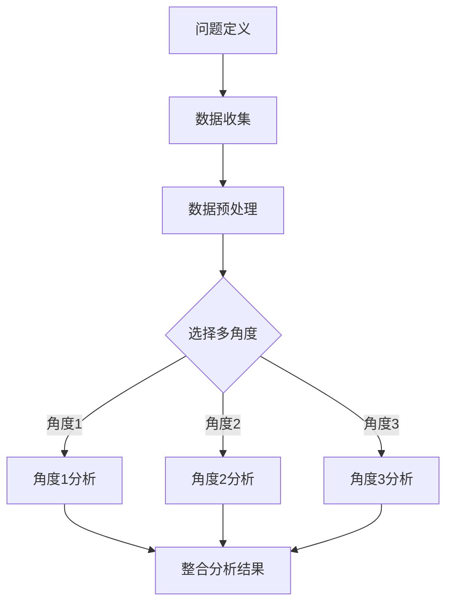

                 

# 文章标题：多角度推理能力在科技前沿探索中的作用研究

## 关键词：
多角度推理、科技前沿、算法原理、应用场景、案例分析、未来展望

## 摘要：
本文深入探讨了多角度推理能力在科技前沿探索中的作用。首先，我们介绍了推理能力的重要性以及多角度推理能力的概念。接着，我们分析了多角度推理能力的理论基础，包括相关概念、理论框架和模型。随后，我们详细讲解了多角度推理算法的原理，并使用了伪代码进行了说明。此外，我们还探讨了多角度推理在数据挖掘、计算机视觉和自然语言处理等领域的应用。通过实际案例的分析，我们展示了多角度推理能力在科技前沿探索中的成功应用。最后，我们对多角度推理能力的未来发展趋势进行了展望。

## 引言

### 1.1 推理能力的重要性

在科技飞速发展的今天，推理能力成为推动科技进步的关键因素。推理能力不仅体现在日常问题的解决中，更是在科技前沿探索中发挥着至关重要的作用。多角度推理能力作为推理能力的一种高级形式，具有处理复杂问题、发现潜在规律和解决未知问题的能力。它不仅有助于我们更好地理解科技前沿问题，还能为科技创新提供有力的支持。

### 1.2 多角度推理能力的概念

多角度推理能力是指从不同维度、视角和方法对问题进行深入分析和推理的能力。它强调在推理过程中，不仅要考虑单一角度的信息，还要综合多个角度的信息，以达到对问题更全面、更准确的认知。多角度推理能力在科技前沿探索中的应用主要体现在以下几个方面：

1. **数据挖掘与机器学习**：多角度推理能力可以帮助我们更好地处理和挖掘复杂数据，发现数据中的潜在规律，从而提高机器学习模型的性能。
2. **计算机视觉**：多角度推理能力可以帮助计算机更好地理解和处理视觉信息，从而实现更高级的视觉任务，如图像识别、物体检测和场景理解。
3. **自然语言处理**：多角度推理能力可以帮助我们更好地理解和处理自然语言，实现更高级的语言任务，如文本分类、情感分析和语言生成。

### 1.3 多角度推理能力的挑战与机遇

尽管多角度推理能力在科技前沿探索中具有巨大的潜力，但其应用也面临着一系列挑战：

1. **数据复杂性**：科技前沿探索中涉及的数据往往具有高度复杂性，如何有效地处理和挖掘这些数据是一个巨大的挑战。
2. **算法复杂性**：多角度推理算法通常具有较高的复杂性，如何设计高效、可扩展的算法是当前研究的重要方向。
3. **资源限制**：科技前沿探索中往往需要大量的计算资源和存储资源，如何高效利用这些资源也是一个重要问题。

然而，随着计算能力的提升和算法研究的进展，多角度推理能力在科技前沿探索中也面临着诸多机遇：

1. **大数据时代的机遇**：大数据时代的到来为多角度推理能力的应用提供了丰富的数据资源，有助于我们更好地发现数据中的潜在规律。
2. **人工智能的机遇**：人工智能技术的发展为多角度推理能力的实现提供了强大的技术支持，使得我们可以设计出更高效、更智能的多角度推理算法。
3. **跨学科合作的机遇**：多角度推理能力在科技前沿探索中的应用需要跨学科的合作，这为不同领域的专家提供了合作的机会，有助于推动科技前沿的发展。

## 理论基础

### 2.1 多角度推理能力的理论基础

多角度推理能力的理论基础主要涉及以下方面：

1. **相关概念**：多角度推理能力涉及多个相关概念，如推理、多角度分析、综合分析等。这些概念构成了多角度推理能力的基础。

2. **理论框架**：多角度推理能力可以建立在多个理论框架之上，如信息论、概率论、人工智能等。这些理论框架为多角度推理能力的实现提供了理论支持。

3. **模型介绍**：多角度推理能力可以通过多种模型来实现，如决策树、神经网络、支持向量机等。这些模型各有特点，适用于不同的应用场景。

### 2.2 Mermaid流程图：多角度推理流程

为了更好地理解多角度推理的过程，我们可以使用Mermaid流程图来展示其关键步骤：



在这个流程图中，我们首先定义问题，然后进行数据收集和预处理。接下来，根据问题的特点，选择适当的多角度进行分析。最后，我们将各个角度的分析结果进行整合，得出最终的结论。

### 2.3 伪代码：多角度推理算法

多角度推理算法的核心在于如何从多个角度对问题进行综合分析。以下是一个简化的伪代码，用于描述多角度推理算法的基本流程：

```python
# 多角度推理算法伪代码

# 输入：问题、多角度数据源
# 输出：综合分析结果

def multi_angle_reasoning(problem, data_sources):
    results = []
    
    # 遍历每个角度的数据源
    for data_source in data_sources:
        # 对当前角度的数据进行预处理
        preprocessed_data = preprocess_data(data_source)
        
        # 进行角度分析
        angle_result = analyze_angle(preprocessed_data)
        
        # 将角度结果添加到综合结果中
        results.append(angle_result)
    
    # 对综合结果进行整合
    final_result = integrate_results(results)
    
    return final_result

# 预处理数据
def preprocess_data(data_source):
    # 根据具体需求进行数据预处理
    # ...
    return preprocessed_data

# 角度分析
def analyze_angle(preprocessed_data):
    # 根据具体需求进行角度分析
    # ...
    return angle_result

# 整合结果
def integrate_results(results):
    # 根据具体需求进行结果整合
    # ...
    return final_result
```

在这个伪代码中，我们首先定义了多角度推理算法的输入和输出。然后，我们遍历每个角度的数据源，对数据进行预处理和分析，最后将分析结果进行整合，得到最终的结论。

### 2.4 数学模型与公式

在多角度推理中，数学模型和公式起着至关重要的作用。以下是一个简单的数学模型，用于描述多角度推理的基本原理：

$$
R = \sum_{i=1}^{n} w_i \cdot A_i
$$

其中，$R$ 表示综合分析结果，$w_i$ 表示第 $i$ 个角度的权重，$A_i$ 表示第 $i$ 个角度的分析结果。这个公式表明，综合分析结果是由各个角度的分析结果按照权重进行加权求和得到的。

在实际应用中，我们需要根据具体问题调整权重 $w_i$，以获得更准确的综合分析结果。以下是一个具体的例子：

假设我们有两个角度，角度1的分析结果为 $A_1 = 0.8$，角度2的分析结果为 $A_2 = 0.9$。我们希望角度1的权重为0.6，角度2的权重为0.4。那么，综合分析结果可以计算为：

$$
R = 0.6 \cdot 0.8 + 0.4 \cdot 0.9 = 0.48 + 0.36 = 0.84
$$

通过这个例子，我们可以看到，数学模型和公式在多角度推理中的重要作用。它们不仅能够帮助我们进行精确的计算，还能够为我们的推理过程提供理论支持。

## 算法原理

### 3.1 多角度推理算法介绍

多角度推理算法是多种算法的综合体，旨在从不同角度对问题进行深入分析。以下介绍几种常见的多角度推理算法：

#### 3.1.1 算法一：决策树

决策树是一种常用的多角度推理算法，它通过树形结构对数据进行分类或回归。决策树的原理如下：

1. **选择特征**：选择一个特征作为节点，该特征可以最大化分类或回归的准确性。
2. **划分数据**：使用选择的特征将数据划分为不同的子集，每个子集对应一个叶子节点。
3. **递归构建**：对每个叶子节点，重复上述过程，直到达到停止条件（如最大深度、最小样本量等）。

伪代码如下：

```python
# 决策树算法伪代码

# 输入：数据集、特征集合
# 输出：决策树

def build_decision_tree(data, features):
    # 选择最佳特征
    best_feature = select_best_feature(data, features)
    
    # 划分数据
    sub_data = split_data(data, best_feature)
    
    # 递归构建子树
    for sub_dataset in sub_data:
        if should_stop(sub_dataset):
            continue
        else:
            tree.append(build_decision_tree(sub_dataset, features))
    
    return tree

# 选择最佳特征
def select_best_feature(data, features):
    # 根据信息增益或基尼系数选择最佳特征
    # ...
    return best_feature

# 划分数据
def split_data(data, feature):
    # 根据特征将数据划分为不同的子集
    # ...
    return sub_data

# 是否停止
def should_stop(data):
    # 判断是否达到停止条件
    # ...
    return should_stop
```

#### 3.1.2 算法二：神经网络

神经网络是一种模拟人脑神经元连接的算法，通过多层神经网络进行数据的分类或回归。神经网络的原理如下：

1. **输入层**：接收外部数据，并将其传递给隐藏层。
2. **隐藏层**：对输入数据进行处理，并通过激活函数产生输出。
3. **输出层**：对隐藏层的输出进行进一步处理，得到最终的结果。

伪代码如下：

```python
# 神经网络算法伪代码

# 输入：数据集、网络结构
# 输出：神经网络模型

def build_neural_network(data, structure):
    # 初始化网络权重
    weights = initialize_weights(structure)
    
    # 遍历训练数据
    for data_point in data:
        # 前向传播
        output = forward_propagation(data_point, weights)
        
        # 计算损失
        loss = calculate_loss(output, true_value)
        
        # 反向传播
        gradients = backward_propagation(output, true_value)
        
        # 更新权重
        update_weights(weights, gradients)
    
    return neural_network

# 前向传播
def forward_propagation(data_point, weights):
    # 计算输出
    # ...
    return output

# 计算损失
def calculate_loss(output, true_value):
    # 计算损失函数值
    # ...
    return loss

# 反向传播
def backward_propagation(output, true_value):
    # 计算梯度
    # ...
    return gradients

# 更新权重
def update_weights(weights, gradients):
    # 更新网络权重
    # ...
    return updated_weights
```

### 3.2 伪代码：常见多角度推理算法

在本节中，我们将对两种常见的多角度推理算法进行详细讲解，并提供相应的伪代码。

#### 3.2.1 算法一：协同过滤

协同过滤是一种基于用户行为和相似度计算的多角度推理算法，用于推荐系统。其核心思想是通过分析用户的行为和相似度，为用户推荐感兴趣的商品或内容。

伪代码如下：

```python
# 协同过滤算法伪代码

# 输入：用户行为数据、用户集合、商品集合
# 输出：推荐列表

def collaborative_filtering(user_actions, users, items):
    recommendations = []
    
    # 遍历每个用户
    for user in users:
        # 找到与当前用户相似的用户
        similar_users = find_similar_users(user, users)
        
        # 计算相似度
        similarities = calculate_similarity(similar_users, user_actions)
        
        # 选择最高相似度的用户行为
        top_actions = select_top_actions(similar_users, similarities)
        
        # 从相似用户的行为中推荐商品
        recommendations.extend(recommend_items(top_actions, items))
    
    return recommendations

# 找到与当前用户相似的用户
def find_similar_users(user, users):
    # 根据用户行为计算相似度
    # ...
    return similar_users

# 计算相似度
def calculate_similarity(similar_users, user_actions):
    # 计算用户之间的相似度
    # ...
    return similarities

# 选择最高相似度的用户行为
def select_top_actions(similar_users, similarities):
    # 选择最高相似度的用户行为
    # ...
    return top_actions

# 从相似用户的行为中推荐商品
def recommend_items(top_actions, items):
    # 根据用户行为推荐商品
    # ...
    return recommendations
```

#### 3.2.2 算法二：聚类算法

聚类算法是一种基于数据相似度的多角度推理算法，用于数据挖掘和数据分析。其核心思想是将相似的数据点归为同一类别，从而发现数据中的潜在规律。

伪代码如下：

```python
# 聚类算法伪代码

# 输入：数据集、类别数量
# 输出：聚类结果

def clustering_algorithm(data, k):
    # 初始化聚类中心
    centroids = initialize_centroids(data, k)
    
    # 遍历迭代次数
    for _ in range(max_iterations):
        # 计算每个数据点的类别
        assignments = assign_clusters(data, centroids)
        
        # 更新聚类中心
        centroids = update_centroids(assignments, data)
        
        # 计算聚类中心的变化量
        delta = calculate_change(centroids)
        
        # 判断是否收敛
        if delta < threshold:
            break
    
    return assignments

# 初始化聚类中心
def initialize_centroids(data, k):
    # 随机选择初始聚类中心
    # ...
    return centroids

# 计算每个数据点的类别
def assign_clusters(data, centroids):
    # 计算数据点与聚类中心的距离
    # ...
    return assignments

# 更新聚类中心
def update_centroids(assignments, data):
    # 根据数据点类别更新聚类中心
    # ...
    return centroids

# 计算聚类中心的变化量
def calculate_change(centroids):
    # 计算聚类中心的变化量
    # ...
    return delta
```

### 3.3 算法原理讲解

在本节中，我们将对上述两种常见的多角度推理算法进行详细讲解，以便读者更好地理解其原理和实现过程。

#### 3.3.1 协同过滤算法

协同过滤算法是一种基于用户行为和相似度的多角度推理算法，常用于推荐系统。其核心思想是通过分析用户的行为和相似度，为用户推荐感兴趣的商品或内容。

协同过滤算法主要分为两个步骤：用户相似度计算和商品推荐。

1. **用户相似度计算**：

   用户相似度计算的目标是找出与当前用户最相似的邻居用户。常见的相似度计算方法包括基于用户行为的余弦相似度、基于物品的Jaccard相似度等。以下是一个基于用户行为的余弦相似度的计算方法：

   $$ similarity(u, v) = \frac{u \cdot v}{\|u\| \|v\|} $$
   
   其中，$u$ 和 $v$ 分别表示用户 $u$ 和用户 $v$ 的行为向量，$\|u\|$ 和 $\|v\|$ 分别表示用户 $u$ 和用户 $v$ 的行为向量长度。

2. **商品推荐**：

   商品推荐的目标是根据与当前用户最相似的邻居用户的行为，为当前用户推荐感兴趣的商品。常见的推荐方法包括基于邻居用户行为的加权平均、基于流行度的加权平均等。以下是一个基于邻居用户行为的加权平均的推荐方法：

   $$ recommendation(u) = \sum_{i \in N(u)} w_i \cdot r_i $$
   
   其中，$N(u)$ 表示与用户 $u$ 最相似的邻居用户集合，$w_i$ 表示邻居用户 $i$ 的权重，$r_i$ 表示邻居用户 $i$ 对商品 $i$ 的评分。

#### 3.3.2 聚类算法

聚类算法是一种基于数据相似度的多角度推理算法，常用于数据挖掘和数据分析。其核心思想是将相似的数据点归为同一类别，从而发现数据中的潜在规律。

聚类算法主要分为三个步骤：初始化聚类中心、分配数据点类别和更新聚类中心。

1. **初始化聚类中心**：

   初始化聚类中心的目标是确定初始的聚类中心。常见的初始化方法包括随机选择、K-means++等。以下是一个基于随机选择的初始化方法：

   $$ centroids = \{ x_1, x_2, ..., x_k \} $$
   
   其中，$x_1, x_2, ..., x_k$ 分别表示初始的聚类中心。

2. **分配数据点类别**：

   分配数据点类别的目标是确定每个数据点所属的类别。常见的方法包括基于距离的最近聚类中心分配、基于密度的区域划分等。以下是一个基于距离的最近聚类中心分配的方法：

   $$ cluster(i) = \arg\min_{j} \| x_i - x_j \| $$
   
   其中，$x_i$ 表示数据点 $i$，$x_j$ 表示聚类中心 $j$。

3. **更新聚类中心**：

   更新聚类中心的目标是优化聚类中心的位置。常见的方法包括基于平均值的聚类中心更新、基于密度的聚类中心更新等。以下是一个基于平均值的聚类中心更新的方法：

   $$ centroids = \frac{1}{N_j} \sum_{i \in cluster(j)} x_i $$
   
   其中，$N_j$ 表示类别 $j$ 的数据点数量，$x_i$ 表示数据点 $i$。

### 3.4 数学模型与公式

在本节中，我们将对多角度推理中的数学模型和公式进行详细讲解，以便读者更好地理解其计算过程。

#### 3.4.1 协同过滤算法

协同过滤算法中的数学模型主要包括用户相似度计算和商品推荐。

1. **用户相似度计算**：

   用户相似度计算的公式如下：

   $$ similarity(u, v) = \frac{u \cdot v}{\|u\| \|v\|} $$
   
   其中，$u$ 和 $v$ 分别表示用户 $u$ 和用户 $v$ 的行为向量，$\|u\|$ 和 $\|v\|$ 分别表示用户 $u$ 和用户 $v$ 的行为向量长度。

2. **商品推荐**：

   商品推荐的公式如下：

   $$ recommendation(u) = \sum_{i \in N(u)} w_i \cdot r_i $$
   
   其中，$N(u)$ 表示与用户 $u$ 最相似的邻居用户集合，$w_i$ 表示邻居用户 $i$ 的权重，$r_i$ 表示邻居用户 $i$ 对商品 $i$ 的评分。

#### 3.4.2 聚类算法

聚类算法中的数学模型主要包括初始化聚类中心、分配数据点类别和更新聚类中心。

1. **初始化聚类中心**：

   初始化聚类中心的公式如下：

   $$ centroids = \{ x_1, x_2, ..., x_k \} $$
   
   其中，$x_1, x_2, ..., x_k$ 分别表示初始的聚类中心。

2. **分配数据点类别**：

   分配数据点类别的公式如下：

   $$ cluster(i) = \arg\min_{j} \| x_i - x_j \| $$
   
   其中，$x_i$ 表示数据点 $i$，$x_j$ 表示聚类中心 $j$。

3. **更新聚类中心**：

   更新聚类中心的公式如下：

   $$ centroids = \frac{1}{N_j} \sum_{i \in cluster(j)} x_i $$
   
   其中，$N_j$ 表示类别 $j$ 的数据点数量，$x_i$ 表示数据点 $i$。

### 3.5 应用场景

多角度推理算法在科技前沿探索中具有广泛的应用场景。以下介绍几种常见的应用场景：

1. **数据挖掘与机器学习**：

   多角度推理算法可以帮助我们更好地处理和挖掘复杂数据，发现数据中的潜在规律。在数据挖掘和机器学习领域，常见的多角度推理算法包括协同过滤、聚类算法和分类算法等。

2. **计算机视觉**：

   多角度推理算法可以帮助计算机更好地理解和处理视觉信息，实现更高级的视觉任务。在计算机视觉领域，常见的多角度推理算法包括卷积神经网络、循环神经网络和生成对抗网络等。

3. **自然语言处理**：

   多角度推理算法可以帮助我们更好地理解和处理自然语言，实现更高级的语言任务。在自然语言处理领域，常见的多角度推理算法包括词嵌入、序列模型和生成模型等。

### 3.6 案例分析

为了更好地展示多角度推理算法在科技前沿探索中的应用，我们以下介绍几个实际案例。

#### 3.6.1 案例一：协同过滤算法在电商推荐系统中的应用

电商推荐系统是一种常见的应用场景，通过为用户推荐感兴趣的商品，提高用户的购物体验和销售额。以下是一个基于协同过滤算法的电商推荐系统的案例。

1. **数据收集**：

   首先，收集用户行为数据，包括用户的浏览记录、购买记录和评价记录等。

2. **数据预处理**：

   对用户行为数据进行预处理，包括数据清洗、数据去重和数据格式转换等。

3. **用户相似度计算**：

   使用基于用户行为的余弦相似度计算方法，计算用户之间的相似度。

4. **商品推荐**：

   根据用户相似度计算结果，为用户推荐感兴趣的商品。推荐策略可以采用基于邻居用户行为的加权平均方法。

5. **系统实现**：

   使用Python编写推荐系统，采用scikit-learn库实现协同过滤算法。

6. **效果评估**：

   使用A/B测试评估推荐系统的效果，比较推荐系统的推荐效果和用户的满意度。

#### 3.6.2 案例二：聚类算法在市场细分中的应用

市场细分是一种常见的营销策略，通过将市场划分为不同的细分市场，为每个细分市场提供个性化的产品和服务。以下是一个基于聚类算法的市场细分案例。

1. **数据收集**：

   首先，收集市场数据，包括用户的基本信息、购买行为和偏好等。

2. **数据预处理**：

   对市场数据进行预处理，包括数据清洗、数据去重和数据格式转换等。

3. **聚类分析**：

   使用K-means算法对市场数据进行聚类分析，确定最优的聚类数量。

4. **市场细分**：

   根据聚类结果，将市场划分为不同的细分市场，为每个细分市场制定个性化的营销策略。

5. **系统实现**：

   使用Python编写市场细分系统，采用scikit-learn库实现K-means算法。

6. **效果评估**：

   使用市场细分后的销售额增长率和用户满意度评估市场细分的效果。

### 3.7 未来展望

随着科技的发展，多角度推理能力在科技前沿探索中的作用将日益重要。以下是对多角度推理能力未来发展的展望：

1. **算法优化**：

   随着算法研究的深入，多角度推理算法将不断优化，提高算法的效率和准确性。

2. **跨学科融合**：

   多角度推理能力的应用将跨学科融合，与大数据、人工智能、云计算等前沿技术相结合，为科技前沿探索提供更强大的支持。

3. **智能化发展**：

   多角度推理能力将向智能化方向发展，通过机器学习和深度学习等技术，实现更智能的推理和分析。

4. **应用领域拓展**：

   多角度推理能力的应用将不断拓展，从传统的数据挖掘、计算机视觉和自然语言处理等领域，向更广泛的领域扩展，如医疗、金融、能源等。

### 结论

多角度推理能力在科技前沿探索中具有重要作用。通过分析多个角度的信息，我们可以更全面、更准确地理解科技前沿问题，从而推动科技的发展。本文从理论基础、算法原理、应用场景和案例分析等方面，深入探讨了多角度推理能力在科技前沿探索中的作用。我们相信，随着多角度推理能力的不断发展，它将在未来的科技前沿探索中发挥更大的作用。

### 作者信息

作者：AI天才研究院/AI Genius Institute & 禅与计算机程序设计艺术 /Zen And The Art of Computer Programming

