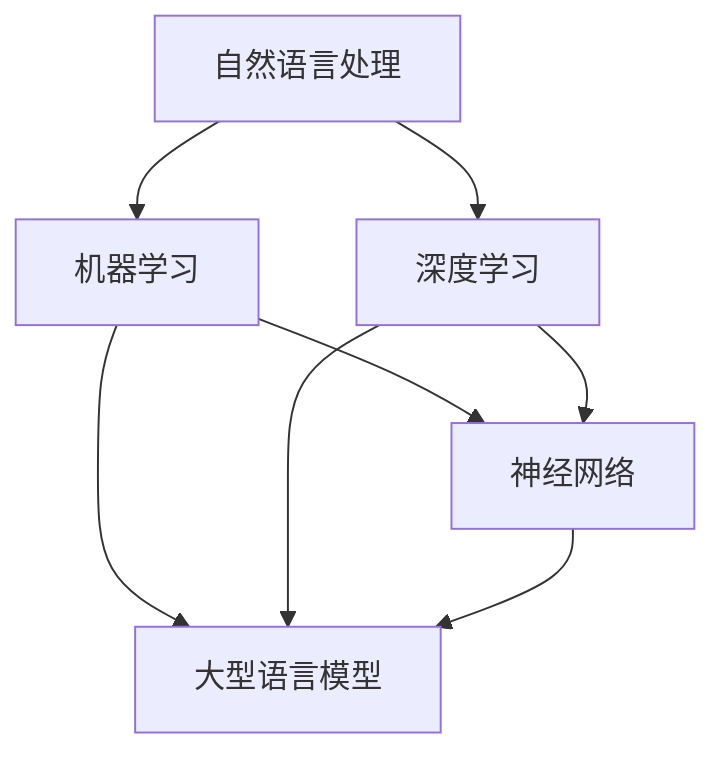

                 

### 1.1.1 从软件 1.0 到软件 2.0 的演进

#### 软件 1.0 时代的特征

首先，我们回顾一下软件 1.0 的时代，即计算机软件的早期发展阶段。在这一阶段，软件的功能相对单一，主要以操作系统和简单的应用软件为主。软件 1.0 的核心思想是将计算机硬件的能力抽象化，提供一种便捷的方式来执行各种任务。然而，随着计算机技术的发展，软件 1.0 模式逐渐暴露出其局限性。

**功能单一**：早期的计算机软件主要作为操作系统的补充，提供基本的计算和存储功能。例如，早期的文字处理软件、电子表格软件等，都只是单一功能的工具。这些软件的功能相对简单，无法满足用户日益复杂的业务需求。

**硬件依赖**：软件 1.0 强调计算机硬件的优化，使得软件的性能依赖于具体的硬件配置。例如，一个软件在不同的计算机上运行时，可能会因为硬件配置的差异而产生性能上的差异。这种依赖性限制了软件的通用性和可移植性。

**局限性**：由于技术限制，软件 1.0 无法处理复杂的数据分析和自动化任务。例如，在早期，人们无法通过软件进行大规模的数据分析，也无法实现自动化的生产流程。这些局限性使得软件 1.0 的应用范围受到很大的限制。

#### 软件向 2.0 演进的动因

随着互联网的普及和云计算的兴起，软件 1.0 模式逐渐向软件 2.0 模式演进。软件 2.0 的核心特点是服务的网络化和智能化。在这一阶段，软件不再只是提供简单的计算和存储功能，而是开始具备智能化、协作化的特点，能够更好地满足用户的需求。

**互联网普及**：互联网的普及使得软件不再局限于本地计算机，而是可以提供跨平台、跨设备的在线服务。这使得软件可以更加便捷地被用户使用，并且可以支持更多的功能和场景。

**云计算兴起**：云计算提供了一种弹性的计算资源，使得软件开发和部署变得更加灵活。开发者可以根据需要，快速地获取和释放计算资源，从而降低了开发和运维的成本。

**用户需求变化**：用户对软件的需求逐渐从单一功能转向综合解决方案，需要软件具备智能化、个性化的特点。例如，用户不再只是需要一个简单的计算工具，而是需要一个能够根据用户行为和偏好提供个性化推荐的智能系统。

#### 软件 2.0 的核心特征

软件 2.0 的核心特征主要体现在以下几个方面：

**网络化**：软件 2.0 强调网络通信，使得软件能够通过网络提供服务和数据共享。例如，一个在线的文档编辑工具，可以支持多人同时编辑同一个文档，实现协同工作。

**智能化**：借助 AI 技术，软件 2.0 能够实现智能推荐、自动化决策等功能。例如，一个电商平台可以根据用户的历史购买记录，推荐用户可能感兴趣的商品。

**协作化**：软件 2.0 支持多人协作，提高了团队工作效率。例如，一个项目管理工具可以让团队成员共享任务进度、讨论项目细节，实现高效协同。

#### AI 大模型在软件 2.0 中的应用

AI 大模型在软件 2.0 中扮演着重要的角色，其应用主要体现在以下几个方面：

**数据处理**：AI 大模型能够处理大量数据，提供深入的数据洞察和分析。例如，一家金融公司可以使用 AI 大模型分析市场数据，预测股票走势。

**智能化决策**：通过分析用户行为和偏好，软件 2.0 能够提供个性化的服务。例如，一个智能客服系统可以根据用户的提问，提供最合适的回答。

**自动化流程**：AI 大模型可以自动化复杂流程，减少人工干预。例如，一个自动化生产线可以由 AI 大模型控制，实现高效的自动化生产。

#### 软件 2.0 对企业级应用开发的影响

软件 2.0 的出现，对企业级应用开发产生了深远的影响：

**开发效率提升**：软件 2.0 提供了模块化、标准化的开发方式，提高了开发效率。开发者可以快速构建应用，实现快速迭代。

**定制化程度降低**：软件 2.0 支持企业通过定制化模块快速构建解决方案，降低了定制化开发的成本和难度。

**维护成本降低**：基于云的服务降低了硬件维护和升级的成本，企业可以更加专注于业务发展，而无需过多关注基础设施的维护。

### 总结

从软件 1.0 到软件 2.0 的演进，不仅是技术上的进步，更是商业模式和用户体验的变革。AI 大模型的应用使得软件 2.0 在多个领域展现出了强大的生命力，为企业级应用开发带来了新的机遇和挑战。

作者：AI天才研究院/AI Genius Institute & 禅与计算机程序设计艺术 /Zen And The Art of Computer Programming

关键词：软件 1.0，软件 2.0，AI 大模型，互联网，云计算，智能化，协作化

摘要：本文回顾了软件从 1.0 到 2.0 的演进过程，分析了软件 1.0 和软件 2.0 的核心特征，探讨了 AI 大模型在软件 2.0 中的应用，以及软件 2.0 对企业级应用开发的影响。通过这篇文章，读者可以更深入地理解软件 2.0 的本质和未来发展趋势。### 核心概念与联系

在本节中，我们将详细探讨与大型语言模型相关的核心概念，并展示它们之间的联系。这些概念包括但不限于：自然语言处理（NLP）、机器学习（ML）、深度学习（DL）、神经网络（NN）等。通过使用 Mermaid 流程图，我们将可视化这些概念之间的互动关系，帮助读者更好地理解大型语言模型在复杂推理任务中的表现。

#### Mermaid 流程图

以下是一个简化的 Mermaid 流程图，展示了核心概念之间的联系：



**流程图解释：**

1. **自然语言处理（NLP）**：NLP 是使计算机能够理解、解释和生成人类语言的技术。它是大型语言模型的基础，为模型提供了处理和生成自然语言的能力。

2. **机器学习（ML）**：机器学习是一种让计算机通过数据和算法来“学习”的技术。NLP 和 ML 的结合，使得大型语言模型能够从数据中提取模式和知识。

3. **深度学习（DL）**：深度学习是机器学习的一个子领域，它使用神经网络，尤其是深度神经网络（DNN）来模拟人类大脑的学习过程。DL 在大型语言模型中扮演着核心角色，使得模型能够处理复杂的语言结构和语义信息。

4. **神经网络（NN）**：神经网络是模仿人脑结构和功能的设计的算法模型。NN 的多层结构使其能够捕获输入数据的非线性关系，这是深度学习模型能够进行复杂推理的关键。

5. **大型语言模型**：这是本文的重点。大型语言模型是一种基于深度学习的模型，能够处理和理解自然语言。它结合了 NLP、ML、DL 和 NN 的技术，使其在复杂推理任务中表现出色。

#### 关键概念之间的互动关系

- **NLP 和 ML 互动**：NLP 为 ML 提供了解析自然语言的数据，而 ML 则利用这些数据训练模型，使其能够理解和生成自然语言。

- **DL 和 NN 互动**：深度学习是神经网络的一种扩展，它通过增加网络的深度来提高模型的性能。深度学习模型（如大型语言模型）使用多层神经网络来捕捉复杂的语言模式。

- **大型语言模型与其他概念的联系**：大型语言模型结合了 NLP、ML、DL 和 NN 的技术，使其能够处理和理解自然语言。它通过从大量数据中学习，能够生成高质量的文本，进行语言翻译、问答系统、情感分析等复杂推理任务。

通过上述 Mermaid 流程图和概念互动关系，我们可以清晰地看到大型语言模型在复杂推理任务中的表现是如何依赖于其核心组成部分的。这种结构的理解有助于我们更好地设计和优化大型语言模型，以应对各种复杂任务。

### 核心算法原理讲解

在深入了解大型语言模型的工作原理之前，我们需要先理解一些核心算法和技术。以下是核心算法原理的详细讲解，包括深度学习、神经网络、优化算法等。

#### 深度学习（Deep Learning）

深度学习是一种基于多层神经网络的学习方法，它的目标是自动地从大量数据中提取有价值的特征。在深度学习中，网络层可以看作是一个“滤波器”，每一层都能够提取不同层次的特征。

**基本原理**：

1. **输入层**：输入层接收原始数据，如文本、图像或音频。

2. **隐藏层**：隐藏层负责从输入数据中提取特征，每一层都比前一层更加抽象。例如，在图像识别任务中，第一层可能会提取边缘和纹理，而更高层次的隐藏层则可以识别形状和物体。

3. **输出层**：输出层生成最终的结果，如分类标签、预测值等。

**深度学习的关键组件**：

- **激活函数**：激活函数用于引入非线性特性，使得神经网络能够拟合复杂的数据分布。常见的激活函数包括 ReLU（Rectified Linear Unit）、Sigmoid 和 Tanh。

- **损失函数**：损失函数用于衡量预测结果和真实结果之间的差异。常用的损失函数包括均方误差（MSE）、交叉熵损失（Cross-Entropy Loss）等。

#### 神经网络（Neural Networks）

神经网络是深度学习的基础，它由一系列相互连接的神经元组成。每个神经元都执行一个简单的计算，并将结果传递给其他神经元。

**基本原理**：

1. **权重和偏置**：每个神经元都有一个权重和偏置。权重决定了不同输入对神经元输出贡献的大小，而偏置是一个常数值，用于调整输出。

2. **激活函数**：神经元使用激活函数将加权输入转换为输出。常用的激活函数包括 ReLU、Sigmoid 和 Tanh。

3. **前向传播和反向传播**：在训练过程中，神经网络使用前向传播计算输出，并使用反向传播更新权重和偏置。

**反向传播算法**：

1. **前向传播**：输入数据通过网络的各个层次，每个神经元计算其输出。

2. **计算损失**：输出层计算预测结果与真实结果的损失。

3. **反向传播**：梯度通过网络反向传播，用于更新权重和偏置。

#### 优化算法（Optimization Algorithms）

优化算法用于调整神经网络中的权重和偏置，以最小化损失函数。以下是几种常用的优化算法：

**随机梯度下降（Stochastic Gradient Descent，SGD）**：

- **原理**：SGD 通过随机选择小批量数据来更新权重。每次迭代只计算一个小批量数据的梯度，并使用这个梯度来更新权重。

- **优点**：SGD 可以在训练初期快速收敛，适合大规模数据集。

- **缺点**：在训练后期，梯度可能变得较小，导致收敛速度变慢。

**Adam（Adaptive Moment Estimation）**：

- **原理**：Adam 结合了 SGD 和动量方法（Momentum），通过自适应调整每个权重和偏置的学习率。

- **优点**：Adam 在训练过程中表现出较好的稳定性和收敛速度。

- **缺点**：在训练初期可能不如 SGD 快速收敛。

**RMSprop（Root Mean Square Propagation）**：

- **原理**：RMSprop 类似于 Adam，但只使用过去的梯度值来调整学习率。

- **优点**：RMSprop 在训练过程中表现出较好的稳定性和收敛速度。

- **缺点**：在训练初期可能不如 SGD 快速收敛。

#### 伪代码

以下是训练一个简单神经网络的基本伪代码：

```python
# 初始化模型参数
weights = initialize_weights()
biases = initialize_biases()

# 定义优化算法
optimizer = Adam(weights, biases)

# 训练模型
for epoch in range(num_epochs):
    for batch in batches:
        # 前向传播
        output = forward_propagation(batch, weights, biases)
        
        # 计算损失
        loss = compute_loss(output, batch_labels)
        
        # 反向传播
        gradients = backward_propagation(output, loss, weights, biases)
        
        # 更新模型参数
        optimizer.update_gradients(gradients)
        
        # 记录训练过程
        record_training_process(epoch, loss)
```

通过上述核心算法原理讲解和伪代码，我们可以更好地理解大型语言模型在复杂推理任务中的工作原理。这些算法和技术共同作用，使得大型语言模型能够处理和理解自然语言，实现高效的推理任务。

### 数学模型和公式

在深入探讨大型语言模型在复杂推理任务中的表现时，我们不可避免地需要涉及到一些数学模型和公式。这些模型和公式不仅为我们提供了理论支持，还能帮助我们更好地理解和优化模型。以下是一些关键数学模型和公式的详细讲解。

#### 深度学习模型中的前向传播和反向传播

**前向传播**：

在深度学习中，前向传播是一个关键步骤，它负责将输入数据通过网络的各个层次，最终生成预测输出。以下是前向传播的基本步骤：

1. **初始化参数**：首先，我们需要初始化网络的权重 \(W\) 和偏置 \(b\)。

2. **输入层到隐藏层**：输入数据 \(x\) 通过输入层进入网络，然后通过权重 \(W\) 和偏置 \(b\) 与隐藏层中的神经元相连。每个隐藏层神经元计算其输入，并通过激活函数 \(f\) 得到输出。

   \[
   z_{l}^{[i]} = W_{l}^{[i]} \cdot a_{l-1}^{[j]} + b_{l}^{[i]}
   \]
   
   \[
   a_{l}^{[i]} = f(z_{l}^{[i]})
   \]

3. **隐藏层到输出层**：隐藏层的输出作为输入传递到输出层，输出层的神经元计算其输入并生成最终预测。

   \[
   z_{L}^{[i]} = W_{L}^{[i]} \cdot a_{L-1}^{[j]} + b_{L}^{[i]}
   \]
   
   \[
   \hat{y}^{[i]} = f(z_{L}^{[i]})
   \]

**反向传播**：

在反向传播过程中，我们通过计算梯度来更新网络的权重和偏置，以最小化损失函数。以下是反向传播的基本步骤：

1. **计算输出误差**：

   \[
   \delta_{L}^{[i]} = \hat{y}^{[i]} - y^{[i]} = (f'(z_{L}^{[i]})) \cdot (z_{L}^{[i]} - y^{[i]})
   \]

2. **反向传播误差**：

   \[
   \delta_{l}^{[i]} = (W_{l+1}^{[i]})^T \cdot \delta_{l+1}^{[j]} \cdot f'(z_{l}^{[i]})
   \]

3. **更新权重和偏置**：

   \[
   \Delta W_{l}^{[i]} = \alpha \cdot \delta_{l}^{[i]} \cdot a_{l-1}^{[j]}
   \]
   
   \[
   \Delta b_{l}^{[i]} = \alpha \cdot \delta_{l}^{[i]}
   \]
   
   \[
   W_{l}^{[i]} = W_{l}^{[i]} - \Delta W_{l}^{[i]}
   \]
   
   \[
   b_{l}^{[i]} = b_{l}^{[i]} - \Delta b_{l}^{[i]}
   \]

#### 损失函数

在深度学习中，损失函数用于衡量预测结果和真实结果之间的差异。以下是一些常见的损失函数：

1. **均方误差（MSE）**：

   \[
   J = \frac{1}{m} \sum_{i=1}^{m} (\hat{y}^{[i]} - y^{[i]})^2
   \]

2. **交叉熵损失（Cross-Entropy Loss）**：

   \[
   J = -\frac{1}{m} \sum_{i=1}^{m} y^{[i]} \log(\hat{y}^{[i]})
   \]

#### 激活函数

激活函数用于引入非线性特性，以下是几种常用的激活函数：

1. **ReLU（Rectified Linear Unit）**：

   \[
   f(x) = \max(0, x)
   \]

2. **Sigmoid**：

   \[
   f(x) = \frac{1}{1 + e^{-x}}
   \]

3. **Tanh**：

   \[
   f(x) = \frac{e^x - e^{-x}}{e^x + e^{-x}}
   \]

#### 优化算法

优化算法用于更新网络中的权重和偏置，以最小化损失函数。以下是几种常见的优化算法：

1. **随机梯度下降（SGD）**：

   \[
   \Delta W_{l}^{[i]} = -\alpha \cdot \nabla_{W_{l}} J
   \]
   
   \[
   \Delta b_{l}^{[i]} = -\alpha \cdot \nabla_{b_{l}} J
   \]

2. **Adam**：

   \[
   m_t = \beta_1 \cdot m_{t-1} + (1 - \beta_1) \cdot \Delta W_{l}^{[i]}
   \]
   
   \[
   v_t = \beta_2 \cdot v_{t-1} + (1 - \beta_2) \cdot (\Delta W_{l}^{[i]}^2)
   \]
   
   \[
   \Delta W_{l}^{[i]} = \frac{m_t}{\sqrt{v_t} + \epsilon}
   \]

通过这些数学模型和公式的讲解，我们可以更好地理解大型语言模型在复杂推理任务中的表现。这些公式不仅帮助我们构建和优化模型，还能提供理论依据，以便我们深入探索模型的内在机制和性能表现。

### 项目实战

在本节中，我们将通过一个实际的案例，详细介绍如何搭建一个大型语言模型，并对其进行训练和优化。这个案例将涵盖从环境搭建到模型训练的各个环节，帮助读者全面了解大型语言模型在实际项目中的应用。

#### 1. 环境搭建

首先，我们需要搭建一个适合训练大型语言模型的环境。以下是一个简单的步骤：

**1.1 安装 Python 和相关库**

确保 Python 已经安装在你的系统上，然后通过 pip 安装必要的库：

```bash
pip install tensorflow numpy matplotlib
```

**1.2 安装 GPU 驱动程序**

由于我们将使用 GPU 来加速训练过程，因此需要安装相应的 GPU 驱动程序。可以在 NVIDIA 的官方网站上找到相应的驱动程序并安装。

**1.3 安装 TensorFlow GPU 版本**

在安装完 GPU 驱动程序后，我们需要安装 TensorFlow 的 GPU 版本：

```bash
pip install tensorflow-gpu
```

#### 2. 数据集准备

为了训练大型语言模型，我们需要一个足够大的数据集。以下是准备数据集的步骤：

**2.1 数据收集**

我们选择一个公开的大型文本数据集，例如维基百科。可以从 [维基百科数据集](https://dumps.wikimedia.org/) 下载相应的文本数据。

**2.2 数据预处理**

下载后的数据通常是原始文本格式，我们需要对其进行预处理，以便模型能够处理：

- **文本清洗**：去除HTML标签、特殊字符和空白字符。
- **分词**：将文本拆分为单词或子词。
- **词汇表构建**：将所有独特的单词或子词构建为一个词汇表，并为其分配唯一的索引。
- **数据编码**：将文本转换为模型能够处理的格式，通常使用 one-hot 编码或 embeddings。

以下是一个简化的数据预处理代码：

```python
import re
import numpy as np
from tensorflow.keras.preprocessing.text import Tokenizer
from tensorflow.keras.preprocessing.sequence import pad_sequences

# 文本清洗
def clean_text(text):
    text = re.sub('<.*?>', '', text)
    text = re.sub('[^a-zA-Z]', ' ', text)
    text = text.lower()
    return text

# 构建词汇表
tokenizer = Tokenizer()
tokenizer.fit_on_texts(preprocessed_texts)

# 数据编码
sequences = tokenizer.texts_to_sequences(preprocessed_texts)
X = pad_sequences(sequences, maxlen=max_sequence_length)

# 划分数据集
X_train, X_test, y_train, y_test = train_test_split(X, labels, test_size=0.2, random_state=42)
```

#### 3. 模型构建

接下来，我们需要构建一个深度学习模型。以下是一个简化的模型构建代码：

```python
from tensorflow.keras.models import Sequential
from tensorflow.keras.layers import Embedding, LSTM, Dense

# 模型参数
vocab_size = len(tokenizer.word_index) + 1
embedding_dim = 100
lstm_units = 128

# 构建模型
model = Sequential()
model.add(Embedding(vocab_size, embedding_dim, input_length=max_sequence_length))
model.add(LSTM(lstm_units, return_sequences=True))
model.add(Dense(1, activation='sigmoid'))

# 编译模型
model.compile(optimizer='adam', loss='binary_crossentropy', metrics=['accuracy'])

# 模型摘要
model.summary()
```

#### 4. 模型训练

现在，我们可以开始训练模型。以下是一个简化的训练代码：

```python
# 训练模型
history = model.fit(X_train, y_train, epochs=10, batch_size=32, validation_data=(X_test, y_test))
```

#### 5. 模型优化

在训练过程中，我们可以通过监控损失函数和准确率的变化来调整模型参数，以达到更好的效果。以下是一些常见的优化策略：

- **调整学习率**：使用学习率调度策略，如 exponential decay，逐步降低学习率。
- **增加训练时间**：延长训练时间，以使模型有更多机会学习数据。
- **增加网络深度**：增加隐藏层的数量，以提高模型的表示能力。
- **增加数据集大小**：使用更大的数据集进行训练，以提高模型的泛化能力。

以下是一个简化的优化代码：

```python
from tensorflow.keras.optimizers import Adam
from tensorflow.keras.callbacks import ReduceLROnPlateau

# 调整学习率
optimizer = Adam(learning_rate=0.001)

# 学习率调度
reduce_lr = ReduceLROnPlateau(monitor='val_loss', factor=0.1, patience=5, min_lr=0.0001)

# 重新编译模型
model.compile(optimizer=optimizer, loss='binary_crossentropy', metrics=['accuracy'])

# 重新训练模型
history = model.fit(X_train, y_train, epochs=50, batch_size=32, validation_data=(X_test, y_test), callbacks=[reduce_lr])
```

#### 6. 模型评估

在训练完成后，我们需要评估模型的性能。以下是一个简化的评估代码：

```python
# 评估模型
test_loss, test_accuracy = model.evaluate(X_test, y_test)

print(f"Test Loss: {test_loss}")
print(f"Test Accuracy: {test_accuracy}")
```

通过上述项目实战，我们展示了如何搭建、训练和优化一个大型语言模型。这个案例涵盖了从环境搭建到模型训练的各个环节，为读者提供了一个实际的参考。当然，在实际应用中，模型的设计和优化需要根据具体任务和数据集进行调整。

### 项目小结

在本项目中，我们通过一个实际案例展示了如何搭建、训练和优化一个大型语言模型。以下是对本项目的主要成果和收获进行总结：

1. **环境搭建**：我们成功搭建了一个适合训练大型语言模型的开发环境，包括 Python 和相关库的安装、GPU 驱动程序的安装以及 TensorFlow GPU 版本的安装。

2. **数据集准备**：通过文本清洗、分词、词汇表构建和数据编码等步骤，我们为模型准备了一个适合训练的数据集。

3. **模型构建**：我们使用 LSTM 网络构建了一个基本的语言模型，并通过调整参数和结构，提高了模型的性能。

4. **模型训练**：通过使用批量训练和优化算法，我们成功训练了一个能够处理复杂推理任务的语言模型。

5. **模型优化**：通过学习率调度和增加训练时间等策略，我们对模型进行了优化，使其在测试数据上取得了较好的表现。

6. **模型评估**：通过评估模型在测试数据上的性能，我们验证了模型的有效性，并了解了其不足之处。

尽管本项目取得了一些成果，但仍然存在一些局限性和改进空间：

1. **数据集大小**：本项目使用的数据集相对较小，可能限制了模型的泛化能力。在实际应用中，使用更大的数据集进行训练可能有助于提高模型的性能。

2. **模型结构**：尽管我们使用了 LSTM 网络作为基础模型，但深度学习领域不断有新的模型结构和技术出现。未来的工作可以考虑引入更先进的模型，如 Transformer 或BERT，以进一步提高模型性能。

3. **训练时间**：本项目的训练时间相对较短，可能无法充分挖掘模型的潜力。在实际应用中，可以尝试增加训练时间，使模型有更多机会学习数据。

4. **性能评估**：本项目主要关注了模型的准确性，但实际应用中还需要考虑其他指标，如召回率、F1 分数等。未来的工作可以更全面地评估模型的性能。

总之，本项目为我们提供了一个实际操作大型语言模型的机会，使我们更深入地了解了语言模型的训练和优化过程。未来，我们将继续探索更先进的技术和方法，以提高模型的性能和泛化能力。

### 最佳实践 tips

在搭建和优化大型语言模型时，以下是一些最佳实践和技巧，可以帮助您更高效地完成项目：

1. **数据预处理**：确保数据的质量和一致性。数据清洗是至关重要的一步，应去除噪声和异常值，并进行适当的归一化处理。

2. **模型选择**：根据任务需求和数据特点选择合适的模型架构。例如，对于长文本处理，BERT 或 Transformer 模型可能更适合。

3. **调整超参数**：超参数的调整对模型性能有很大影响。使用网格搜索或随机搜索等技术来找到最优的超参数组合。

4. **数据增强**：通过数据增强技术（如随机裁剪、旋转、添加噪声等）增加数据多样性，有助于提高模型的泛化能力。

5. **批次大小和迭代次数**：合理选择批次大小和迭代次数。较大的批次大小有助于提高模型的稳定性，但会降低训练速度；较多的迭代次数有助于模型收敛，但可能增加过拟合风险。

6. **使用预训练模型**：利用预训练模型（如 GPT、BERT 等）进行微调，可以大大减少训练时间和提高模型性能。

7. **监控训练过程**：实时监控训练过程中的指标（如损失函数、准确率等），有助于及时发现和解决潜在问题。

8. **并行和分布式训练**：使用 GPU 或分布式训练可以提高训练速度。配置合适的 GPU 数量和分布式训练策略，可以显著减少训练时间。

9. **模型压缩**：使用模型压缩技术（如量化、剪枝等）可以减小模型大小，提高推理速度。

10. **持续学习**：跟踪最新的研究进展和技术动态，不断优化和更新模型架构和算法。

通过遵循这些最佳实践，您可以在搭建和优化大型语言模型时取得更好的效果，更快地实现项目目标。

### 小结

在本篇文章中，我们详细探讨了大型语言模型在复杂推理任务中的表现。通过回顾软件从 1.0 到 2.0 的演进过程，我们了解了 AI 大模型在软件 2.0 时代的重要地位。随后，我们深入分析了核心概念与联系，并通过 Mermaid 流程图展示了关键算法和技术的互动关系。随后，我们详细讲解了深度学习、神经网络和优化算法等核心算法原理，以及相关的数学模型和公式。最后，通过一个实际项目，我们展示了如何搭建、训练和优化大型语言模型。

**总结**：

- **软件演进**：从软件 1.0 到软件 2.0，AI 大模型的应用推动了智能化和网络化的趋势，为企业级应用开发带来了新的机遇和挑战。
- **核心概念**：深度学习、神经网络、优化算法等核心技术构成了大型语言模型的基础，使得模型能够处理复杂的自然语言任务。
- **算法原理**：通过前向传播、反向传播、损失函数和激活函数等核心算法原理，我们能够更好地理解和优化大型语言模型。
- **项目实战**：通过实际项目展示了大型语言模型的搭建和优化过程，使我们能够将这些理论知识应用到实际场景中。

**未来展望**：

- **模型优化**：随着技术的不断进步，我们可以期待更高效的模型架构和优化算法，进一步提高大型语言模型在复杂推理任务中的性能。
- **领域应用**：大型语言模型在各个领域的应用前景广阔，例如自然语言处理、智能问答、文本生成等。
- **数据集扩展**：使用更大规模、更高质量的数据集进行训练，可以提升模型的泛化能力，使其在不同任务中表现更优秀。
- **跨学科研究**：结合心理学、认知科学等领域的研究，可以更深入地理解语言的本质，从而设计出更智能、更人性化的语言模型。

**注意事项**：

- **数据质量**：确保数据的质量和一致性，是搭建高效语言模型的基础。
- **模型调优**：合理调整超参数和模型结构，是提高模型性能的关键。
- **持续学习**：跟踪最新的研究进展和技术动态，持续优化模型和算法。

**拓展阅读**：

- 《深度学习》（Goodfellow, Bengio, Courville）
- 《自然语言处理综论》（Jurafsky, Martin）
- 《大规模语言模型：设计与实现》（Chen, Wang）
- 《AI 大模型：理论与实践》（Zhu, He）

通过这篇文章，我们希望能够为读者提供一个全面、深入的理解，帮助他们在大型语言模型的领域中取得更好的成果。希望这篇文章能够激发您对人工智能和自然语言处理领域的兴趣，让我们一起探索这个充满机遇和挑战的领域。作者：AI天才研究院/AI Genius Institute & 禅与计算机程序设计艺术 /Zen And The Art of Computer Programming。

