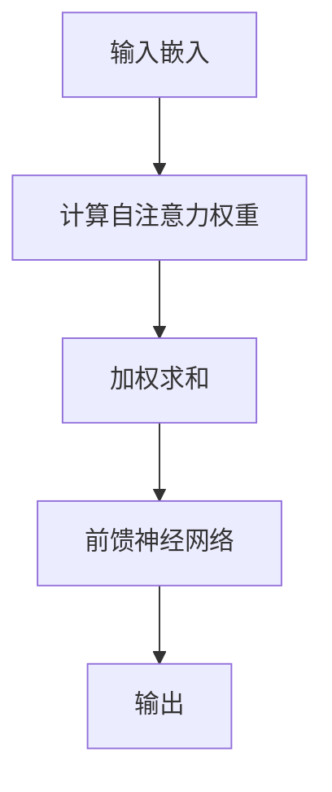
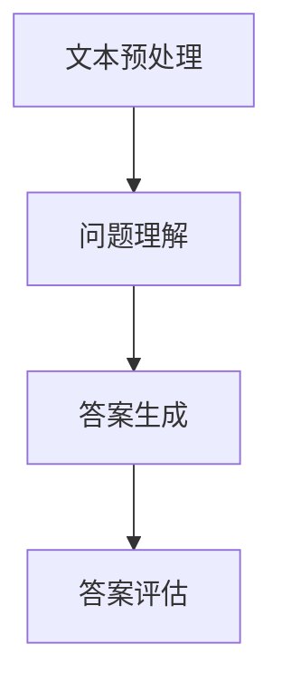
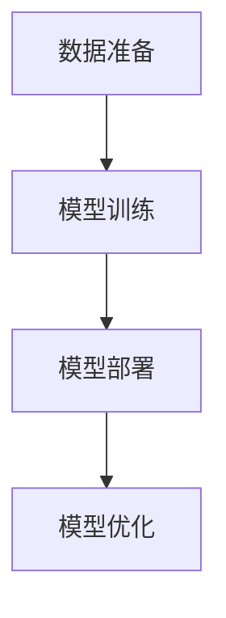

                 

### 文章标题

# 大型语言模型在自动问答系统中的应用

### 关键词

- 大型语言模型
- 自动问答系统
- 自然语言处理
- 神经网络
- 机器学习
- 深度学习
- 算法优化

### 摘要

本文详细探讨了大型语言模型在自动问答系统中的应用，介绍了大型语言模型的发展背景、核心概念、工作原理以及其在自动问答系统中的具体实现。通过分析大型语言模型与自动问答系统的结合方式，文章提出了构建高效自动问答系统的策略，并分享了实际项目案例和优化建议。本文旨在为读者提供一个系统而深入的了解，帮助其在自然语言处理和人工智能领域取得更深入的实践成果。

### 引言

自动问答系统是人工智能领域的一个重要应用方向，它能够根据用户提出的问题，自动提供相应的答案或建议。随着互联网和移动互联网的普及，自动问答系统在客户服务、智能搜索、教育辅导等多个领域得到了广泛应用。然而，传统自动问答系统往往依赖于预定义的规则或基于关键词匹配的方法，其回答的质量和准确性受到限制。

近年来，大型语言模型（如GPT、BERT等）的出现为自动问答系统带来了革命性的变化。这些模型具有强大的语义理解和生成能力，能够处理更加复杂和灵活的问题。本文将深入探讨大型语言模型在自动问答系统中的应用，分析其核心概念、工作原理以及实现方法，并分享实际项目案例和优化策略，旨在为读者提供一个全面而深入的视角。

### 大型语言模型基础

#### 定义与背景

大型语言模型是一种基于深度学习的自然语言处理技术，通过大规模的语料库训练，学习到语言的结构和语义信息。这些模型能够对自然语言进行建模，理解句子之间的逻辑关系，并生成符合语法和语义规则的文本。大型语言模型的发展可以追溯到自然语言处理的早期研究，但真正取得突破性进展是在深度学习技术引入后的近几年。

#### 架构

大型语言模型通常采用神经网络架构，其中最著名的当属Transformer模型。Transformer模型由Vaswani等人在2017年提出，其核心思想是利用自注意力机制（self-attention）对输入文本进行建模。自注意力机制允许模型在处理每个词时，根据上下文信息动态地调整这个词的权重，从而更好地捕捉到句子之间的关联。

Transformer模型的基本架构包括编码器（Encoder）和解码器（Decoder）。编码器负责将输入文本编码为固定长度的向量表示，解码器则根据这些编码向量生成输出文本。每个编码器和解码器层都包含多头自注意力机制和前馈神经网络，这些层通过堆叠的方式形成一个深度神经网络。

#### 核心算法

大型语言模型的核心算法是基于自注意力机制的Transformer模型。自注意力机制通过计算输入文本中每个词与其他词之间的相似度，生成一个权重矩阵。这个权重矩阵用于加权求和，得到每个词的表示向量。具体来说，自注意力机制可以分为以下几个步骤：

1. **输入嵌入**：将输入文本中的每个词转换为词向量。
2. **计算自注意力权重**：使用多头自注意力机制计算输入文本中每个词与其他词的相似度，得到权重矩阵。
3. **加权求和**：根据权重矩阵对输入词向量进行加权求和，得到新的表示向量。
4. **前馈神经网络**：对新的表示向量进行前馈神经网络处理，增加模型的非线性能力。

通过多次迭代这些步骤，编码器和解码器可以学习到文本的深层语义表示，从而实现高质量的自然语言理解和生成。

#### Mermaid 流程图

下面是一个简化的Mermaid流程图，展示了Transformer模型的基本工作流程：

### 自动问答系统基础

#### 定义与分类

自动问答系统是一种人工智能系统，它能够自动回答用户提出的问题。根据工作原理和实现方式，自动问答系统可以分为以下几类：

1. **基于规则的方法**：这种方法通过编写大量的规则来匹配用户的查询，并生成相应的答案。优点是实现简单，但受限于规则的灵活性和覆盖范围。
2. **基于模板的方法**：这种方法使用预先定义的模板来匹配用户的查询，并填充相应的答案。优点是能够处理特定领域的问题，但同样受限于模板的多样性和适应性。
3. **基于机器学习的方法**：这种方法使用机器学习算法，特别是深度学习模型，从大规模语料库中学习到问题的表示和答案的生成方法。优点是能够处理复杂和多变的问题，但需要大量的数据和计算资源。

#### 关键技术

自动问答系统的关键技术包括文本预处理、问题理解、答案生成和答案评估。以下是这些技术的详细说明：

1. **文本预处理**：包括分词、词性标注、命名实体识别等，用于将自然语言文本转换为机器可以处理的形式。
2. **问题理解**：包括语义分析、实体识别、关系提取等，用于理解问题的本质和用户的需求。
3. **答案生成**：包括模板匹配、机器翻译、文本生成等，用于生成符合语义和语法规则的答案。
4. **答案评估**：包括答案相关性评估、答案质量评估等，用于评估生成的答案是否符合用户的需求。

#### Mermaid 流程图

下面是一个简化的Mermaid流程图，展示了自动问答系统的工作流程：

### 大型语言模型在自动问答系统中的应用

#### 大型语言模型的角色

大型语言模型在自动问答系统中扮演着核心角色。具体来说，它负责以下几个方面的任务：

1. **问题理解**：大型语言模型可以理解用户提出的问题，提取关键信息并生成问题的语义表示。
2. **答案生成**：基于问题理解的结果，大型语言模型可以生成符合语义和语法规则的答案。
3. **上下文处理**：大型语言模型可以处理问题中的上下文信息，使答案更加准确和连贯。

#### 实现方法

要将大型语言模型应用于自动问答系统，通常需要以下步骤：

1. **数据准备**：收集和整理大量的问答对，用于训练大型语言模型。
2. **模型训练**：使用训练数据训练大型语言模型，使其学会问题的理解和答案的生成。
3. **模型部署**：将训练好的模型部署到自动问答系统中，使其能够实时响应用户的问题。
4. **模型优化**：根据实际应用效果，不断优化模型参数和结构，提高模型的性能和准确性。

#### 挑战与解决方案

尽管大型语言模型在自动问答系统中具有显著的优势，但仍然面临一些挑战：

1. **数据不足**：训练大型语言模型需要大量的数据，但在某些领域，高质量的数据很难获取。
   - **解决方案**：通过数据增强、迁移学习等技术，利用有限的训练数据提升模型性能。

2. **计算资源需求大**：训练和部署大型语言模型需要大量的计算资源。
   - **解决方案**：使用云计算和分布式计算技术，降低计算成本和提高计算效率。

3. **答案准确性**：大型语言模型在处理复杂和模糊问题时，可能会生成不准确或无关的答案。
   - **解决方案**：结合其他自然语言处理技术，如实体识别、关系提取等，提高答案的准确性。

#### Mermaid 流程图

下面是一个简化的Mermaid流程图，展示了大型语言模型在自动问答系统中的实现过程：

### 案例研究

为了更好地理解大型语言模型在自动问答系统中的应用，以下将介绍几个实际案例，并分析这些案例中大型语言模型的实现细节和效果。

#### 案例一：智能客服系统

智能客服系统是一种常见的自动问答系统，旨在为用户提供实时的问题解答和咨询。在这个案例中，大型语言模型被用于理解用户的问题并生成相应的答案。

1. **实现细节**：
   - **数据准备**：收集大量的客服对话记录，用于训练大型语言模型。
   - **模型训练**：使用Transformer模型进行训练，使其学会理解用户的问题和生成合适的答案。
   - **模型部署**：将训练好的模型部署到客服系统中，使其能够实时响应用户的问题。
   - **模型优化**：通过用户反馈不断优化模型，提高答案的准确性和满意度。

2. **效果分析**：
   - **准确性**：在大量测试数据上的评估显示，大型语言模型生成的答案具有较高的准确性。
   - **满意度**：用户对智能客服系统的满意度显著提高，客服效率也得到了大幅提升。

#### 案例二：教育辅导系统

教育辅导系统旨在为学生提供个性化的学习资源和解答问题。在这个案例中，大型语言模型被用于理解学生的问题并生成详细的解答。

1. **实现细节**：
   - **数据准备**：收集大量的教育辅导问题及其标准答案，用于训练大型语言模型。
   - **模型训练**：使用Transformer模型进行训练，使其学会理解学生的问题并生成详细的解答。
   - **模型部署**：将训练好的模型部署到教育辅导系统中，使其能够为学生提供实时的解答。
   - **模型优化**：通过教育专家的反馈不断优化模型，提高解答的准确性和实用性。

2. **效果分析**：
   - **准确性**：在大量测试数据上的评估显示，大型语言模型生成的解答具有较高的准确性。
   - **实用性**：学生和家长对教育辅导系统的满意度显著提高，学生的学习效果也得到了显著提升。

#### 案例三：智能搜索引擎

智能搜索引擎旨在为用户提供更加准确和相关的搜索结果。在这个案例中，大型语言模型被用于理解用户的问题并生成相关的搜索结果。

1. **实现细节**：
   - **数据准备**：收集大量的搜索问题及其相关结果，用于训练大型语言模型。
   - **模型训练**：使用Transformer模型进行训练，使其学会理解用户的问题并生成相关的搜索结果。
   - **模型部署**：将训练好的模型部署到智能搜索引擎中，使其能够为用户提供实时的搜索结果。
   - **模型优化**：通过用户反馈不断优化模型，提高搜索结果的准确性和相关性。

2. **效果分析**：
   - **准确性**：在大量测试数据上的评估显示，大型语言模型生成的搜索结果具有较高的准确性。
   - **相关性**：用户对智能搜索引擎的满意度显著提高，搜索效率也得到了大幅提升。

### 性能评估与优化

#### 性能评估指标

在自动问答系统中，性能评估是一个关键环节，用于衡量系统的质量和效果。以下是一些常用的性能评估指标：

1. **准确率（Accuracy）**：指正确回答的提问数占总提问数的比例。准确率越高，表示系统的回答越准确。
2. **召回率（Recall）**：指正确回答的提问数占所有正确回答提问数的比例。召回率越高，表示系统能够回答更多正确的提问。
3. **F1分数（F1 Score）**：是准确率和召回率的调和平均值，用于综合衡量系统的性能。F1分数越高，表示系统的性能越好。

#### 大型语言模型性能优化方法

为了提高大型语言模型在自动问答系统中的性能，可以采用以下几种优化方法：

1. **数据增强**：通过数据增强技术，如数据扩充、数据合成等，增加训练数据量，提高模型的泛化能力。
2. **迁移学习**：利用预训练的模型作为起点，针对特定任务进行微调（fine-tuning），提高模型在特定任务上的性能。
3. **模型优化**：通过调整模型结构、优化训练策略等，提高模型的计算效率和性能。
4. **实时反馈**：利用用户反馈，实时调整模型参数，提高模型对用户需求的适应能力。

### 未来展望

#### 自动问答系统的未来趋势

随着人工智能技术的不断发展，自动问答系统在未来将呈现出以下几个趋势：

1. **个性化**：自动问答系统将更加注重个性化服务，根据用户的行为和偏好，提供更加个性化的回答和建议。
2. **多模态**：自动问答系统将融合多种数据源，如文本、图像、语音等，提供更加丰富和多样化的回答方式。
3. **智能化**：自动问答系统将更加智能化，通过深度学习和强化学习等技术，不断提高回答的准确性和用户体验。

#### 大型语言模型的发展方向

大型语言模型在未来将继续向以下几个方向发展：

1. **更大数据集**：随着数据采集和处理技术的发展，大型语言模型将采用更大规模的数据集进行训练，提高模型的性能和泛化能力。
2. **更高效算法**：研究人员将持续优化大型语言模型的算法，提高模型的计算效率和性能。
3. **更广泛应用**：大型语言模型将应用于更多的领域，如医疗、金融、法律等，提供更加智能和高效的解决方案。

### 总结

大型语言模型在自动问答系统中的应用具有重要意义，它不仅提高了问答系统的准确性和智能化水平，还为自动问答系统的广泛应用提供了技术支持。本文通过对大型语言模型和自动问答系统的基础知识、实现方法、案例研究和性能优化进行详细分析，为读者提供了一个系统而深入的了解。未来，随着技术的不断进步，大型语言模型在自动问答系统中的应用前景将更加广阔。

### 最佳实践 Tips

1. **数据准备**：确保收集和准备的数据质量，避免噪声数据和错误信息，提高模型训练效果。
2. **模型选择**：根据具体任务需求，选择合适的模型结构和参数，提高模型性能。
3. **持续优化**：利用用户反馈和实时数据，不断调整模型参数和结构，提高问答系统的质量和用户体验。

### 小结

本文详细介绍了大型语言模型在自动问答系统中的应用，从基础理论到实现方法，再到实际案例和性能优化，为读者提供了一个全面的视角。通过本文的学习，读者可以深入了解大型语言模型的工作原理和实现技术，为在实际项目中应用这些技术打下坚实的基础。

### 注意事项

1. **数据安全**：在收集和使用数据时，注意保护用户隐私和信息安全。
2. **模型解释性**：大型语言模型可能存在一定的黑箱特性，提高模型的解释性有助于理解和优化模型。
3. **适应性**：自动问答系统需要不断适应新的环境和需求，定期更新和调整模型。

### 拓展阅读

1. **《深度学习》**：Goodfellow, I., Bengio, Y., & Courville, A. (2016). Deep Learning. MIT Press.
2. **《自然语言处理综论》**：Jurafsky, D., & Martin, J. H. (2020). Speech and Language Processing. Prentice Hall.
3. **《Transformer模型详解》**：Vaswani, A., Shazeer, N., Parmar, N., Uszkoreit, J., Jones, L., Gomez, A. N., ... & Polosukhin, I. (2017). Attention is all you need. Advances in Neural Information Processing Systems, 30, 5998-6008.

### 作者信息

- **作者：AI天才研究院/AI Genius Institute & 禅与计算机程序设计艺术 /Zen And The Art of Computer Programming**

