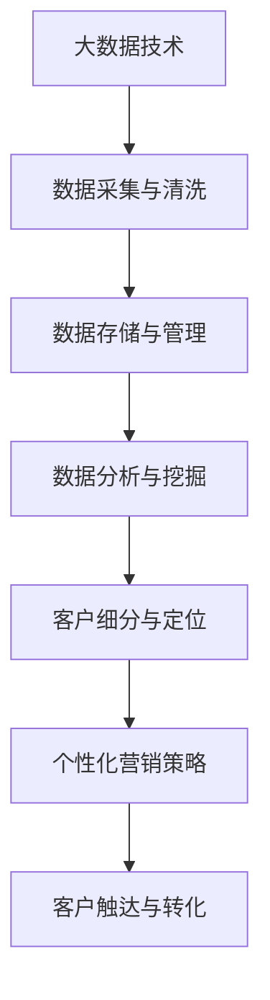
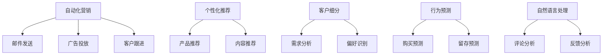
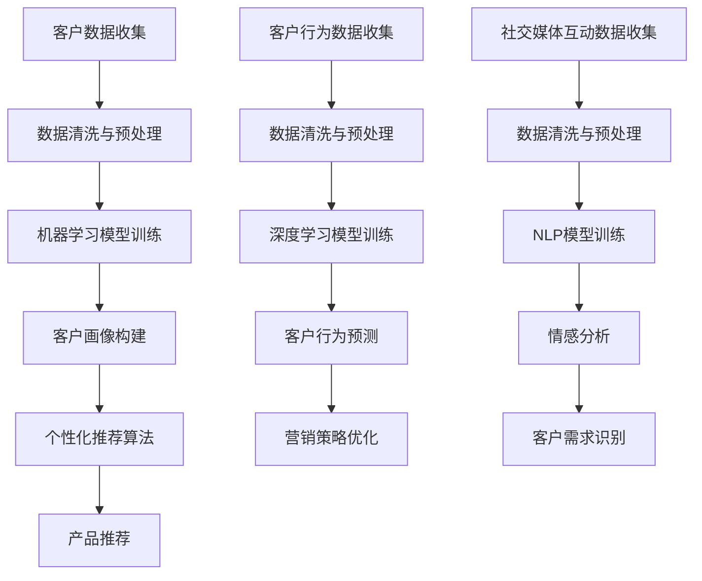
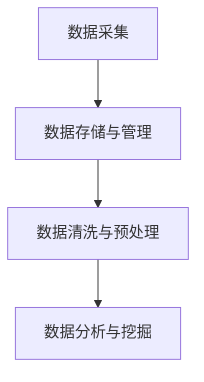

                 

### 文章标题：大数据分析与个性化营销：AI驱动的精准客户触达

### 关键词：
- 大数据分析
- 个性化营销
- AI应用
- 客户触达
- 精准营销

### 摘要：
本文深入探讨了大数据分析与个性化营销的结合，特别是在人工智能（AI）的驱动下，如何实现精准客户触达。文章首先介绍了大数据分析与个性化营销的基本概念和关系，然后详细阐述了AI在大数据分析中的应用，以及如何通过AI技术实现个性化营销的精准触达。接下来，文章分别从数据采集、清洗、分析、挖掘和特征工程等环节，解析了AI驱动的大数据分析过程。此外，文章还介绍了个性化营销策略、实践和案例，并展望了未来AI在营销领域的应用前景。通过本文，读者可以全面了解大数据分析与个性化营销的原理和实施方法，掌握AI驱动的精准客户触达技巧。

----------------------------------------------------------------

# 引言

## 1.1 大数据与个性化营销的关系

### 背景介绍

在互联网和信息技术飞速发展的今天，数据已经成为企业和组织的重要资产。大数据（Big Data）是指无法在可承受的时间内用常规软件工具进行捕获、管理和处理的数据集。这些数据集通常具有海量性、多样性和高速增长的特点。大数据技术的出现，使得企业能够从海量数据中挖掘出有价值的信息，为决策提供支持。

个性化营销（Personalized Marketing）是一种以客户为中心的营销策略，旨在通过了解客户的需求和偏好，提供个性化的产品和服务，从而提高客户满意度和忠诚度。个性化营销的核心理念是“一对一”营销，即针对每个客户的个性化需求和兴趣，提供个性化的产品和服务。

大数据与个性化营销之间的关系在于，大数据为个性化营销提供了丰富的数据支持。通过对大数据的分析，企业可以深入了解客户的行为、偏好和需求，从而实现更加精准的个性化营销。

### 核心概念与联系

#### 数据挖掘与个性化营销

数据挖掘（Data Mining）是一种从大量数据中提取有用信息和知识的过程。在个性化营销中，数据挖掘可以帮助企业识别客户的购买行为、偏好和需求，从而实现个性化推荐和精准营销。

#### 客户细分与个性化营销

客户细分（Customer Segmentation）是将客户划分为不同的群体，以便针对不同群体的需求提供个性化的产品和服务。客户细分可以基于客户的购买历史、行为特征、兴趣爱好等因素。通过大数据分析，企业可以更准确地识别和细分客户，从而提高个性化营销的效果。

#### AI与个性化营销

人工智能（Artificial Intelligence，AI）是一种模拟人类智能的技术，包括机器学习、深度学习、自然语言处理等子领域。AI技术在个性化营销中的应用，可以帮助企业实现更加精准的客户分析和营销策略。例如，通过机器学习算法，企业可以预测客户的购买行为，从而实现个性化推荐和精准营销。

### Mermaid 流程图



## 1.2 AI在营销领域的应用前景

### 背景介绍

随着人工智能技术的不断发展，AI在营销领域的应用越来越广泛。AI可以帮助企业实现自动化、个性化的营销策略，提高营销效率和效果。以下是一些AI在营销领域的应用前景：

#### 自动化营销

自动化营销（Automated Marketing）是指利用AI技术自动化执行营销任务，如自动发送邮件、社交媒体广告投放、客户跟进等。通过自动化营销，企业可以节省人力成本，提高营销效率。

#### 个性化推荐

个性化推荐（Personalized Recommendation）是指利用AI技术根据客户的兴趣和行为，提供个性化的产品或内容推荐。个性化推荐可以显著提高客户的满意度和转化率。

#### 客户细分

通过AI技术，企业可以对客户进行更加精准的细分，识别不同客户群体的需求和偏好。精准的客户细分有助于企业制定更加有效的营销策略。

#### 客户行为预测

AI技术可以帮助企业预测客户的购买行为，从而提前采取措施，提高客户转化率和留存率。

#### 自然语言处理

自然语言处理（Natural Language Processing，NLP）技术可以用于分析客户评论、社交媒体互动等，帮助企业了解客户需求和反馈，优化产品和服务。

### 核心概念与联系

#### 机器学习与营销自动化

机器学习（Machine Learning）是一种AI技术，通过训练模型，可以从数据中自动学习规律和模式。在营销自动化中，机器学习可以帮助企业自动化执行营销任务，如自动发送邮件、客户跟进等。

#### 深度学习与个性化推荐

深度学习（Deep Learning）是一种基于多层神经网络的人工智能技术，可以实现复杂的数据分析和模式识别。在个性化推荐中，深度学习可以帮助企业实现更加精准的推荐算法，提高客户满意度。

#### 自然语言处理与客户分析

自然语言处理（NLP）技术可以用于分析客户评论、社交媒体互动等，帮助企业了解客户需求和反馈。NLP技术还可以用于实现智能客服、聊天机器人等，提高客户服务质量。

### Mermaid 流�程图



## 1.3 AI在个性化营销中的应用

### 背景介绍

AI在个性化营销中的应用，已经成为提升营销效果的重要手段。通过AI技术，企业可以更好地了解客户需求，提供个性化的产品和服务，从而提高客户满意度和忠诚度。

#### 客户画像

客户画像（Customer Profiling）是指通过收集和分析客户的 demographics（人口统计学数据）、行为数据、心理数据等，构建客户的数字模型。AI技术可以帮助企业快速、准确地构建客户画像，从而实现精准营销。

#### 个性化推荐

个性化推荐（Personalized Recommendation）是指利用AI技术根据客户的兴趣和行为，提供个性化的产品或内容推荐。通过个性化推荐，企业可以显著提高客户的满意度和转化率。

#### 客户行为预测

客户行为预测（Customer Behavior Prediction）是指利用AI技术预测客户的购买行为、留存行为等。通过客户行为预测，企业可以提前采取措施，提高客户转化率和留存率。

#### 自然语言处理

自然语言处理（NLP）技术可以用于分析客户评论、社交媒体互动等，帮助企业了解客户需求和反馈，优化产品和服务。

### 核心概念与联系

#### 机器学习与客户画像

机器学习（Machine Learning）技术可以帮助企业从海量数据中提取有价值的信息，构建客户画像。通过训练机器学习模型，企业可以识别客户的需求和偏好，从而实现个性化营销。

#### 深度学习与个性化推荐

深度学习（Deep Learning）技术可以实现复杂的数据分析和模式识别，从而提高个性化推荐的效果。通过深度学习模型，企业可以提供更加精准的个性化推荐，提高客户满意度。

#### 自然语言处理与客户分析

自然语言处理（NLP）技术可以用于分析客户评论、社交媒体互动等，帮助企业了解客户需求和反馈。通过NLP技术，企业可以构建客户情感分析模型，实现更加精准的营销策略。

### Mermaid 流程图



## 总结

大数据分析与个性化营销的结合，是现代营销领域的重要趋势。通过AI技术的驱动，企业可以实现更加精准的客户触达和营销效果。本文介绍了大数据分析与个性化营销的关系，以及AI在个性化营销中的应用。接下来，我们将深入探讨AI驱动的大数据分析过程，以及个性化营销策略和实践。通过本文，读者可以全面了解大数据分析与个性化营销的原理和实施方法，掌握AI驱动的精准客户触达技巧。

----------------------------------------------------------------

# 第一部分：大数据分析与个性化营销基础

## 第1章：大数据概念与处理

### 1.1 大数据的定义与特点

#### 背景介绍

大数据（Big Data）是指无法在可承受的时间内用常规软件工具进行捕获、管理和处理的数据集。大数据技术起源于互联网时代，随着传感器、移动设备、社交媒体等技术的普及，数据量呈现爆炸式增长。大数据的特点主要体现在以下几个方面：

- **海量性**：大数据的数据量庞大，通常在TB、PB甚至EB级别。
- **多样性**：大数据包括结构化数据、半结构化数据和非结构化数据，如文本、图片、音频、视频等。
- **高速增长**：大数据的产生和积累速度非常快，需要实时或近实时处理。
- **价值密度低**：在大数据中，有价值的信息占比很低，需要通过数据挖掘技术提取。

#### 核心概念与联系

- **数据采集**：数据采集是大数据处理的第一步，包括从各种数据源（如数据库、日志文件、传感器等）收集数据。
- **数据存储与管理**：大数据需要高效的数据存储和管理方案，如分布式文件系统（如Hadoop HDFS）、数据库（如NoSQL数据库）等。
- **数据清洗与预处理**：数据清洗是确保数据质量和一致性的重要步骤，包括去除重复数据、处理缺失值、数据格式转换等。

#### Mermaid 流程图



### 1.2 数据采集、存储与处理技术

#### 数据采集

数据采集是大数据处理的基础，数据来源包括：

- **内部数据**：来自企业内部的数据，如业务数据库、日志文件、内部管理系统等。
- **外部数据**：来自互联网、社交媒体、传感器等外部数据源，如网页数据、社交媒体数据、物联网数据等。

数据采集技术包括：

- **API调用**：通过API接口从外部系统或平台采集数据。
- **爬虫技术**：通过网络爬虫自动获取网页数据。
- **传感器采集**：通过传感器实时采集物理世界的数据。

#### 数据存储

大数据的存储技术主要包括：

- **分布式文件系统**：如Hadoop HDFS，可以存储海量数据并提供高可靠性和高可扩展性。
- **数据库**：包括关系型数据库（如MySQL）和NoSQL数据库（如MongoDB、Cassandra），适用于不同类型的数据存储需求。
- **云存储**：如AWS S3、Google Cloud Storage等，提供弹性、可靠和低成本的存储解决方案。

#### 数据处理

大数据的处理技术主要包括：

- **批处理**：适用于处理大规模数据集，如MapReduce、Spark等。
- **实时处理**：适用于处理实时数据，如Apache Flink、Apache Storm等。
- **流处理**：适用于处理连续不断的数据流，如Apache Kafka、Apache NiFi等。

### 1.3 数据采集、清洗与预处理示例

以下是一个简单的数据采集、清洗与预处理示例：

#### 数据采集

```python
import requests

# API接口
url = "https://api.example.com/data"

# 发送请求
response = requests.get(url)

# 获取数据
data = response.json()
```

#### 数据清洗

```python
import pandas as pd

# 将数据转换为DataFrame
df = pd.DataFrame(data)

# 去除重复数据
df.drop_duplicates(inplace=True)

# 处理缺失值
df.fillna(df.mean(), inplace=True)
```

#### 数据预处理

```python
# 数据格式转换
df['date'] = pd.to_datetime(df['date'])

# 特征工程
df['month'] = df['date'].dt.month
df['day_of_week'] = df['date'].dt.dayofweek
```

### 总结

本章介绍了大数据的基本概念与特点，以及数据采集、存储与处理技术。通过数据采集、清洗与预处理，企业可以确保数据质量和一致性，为后续的数据分析奠定基础。在实际应用中，企业需要根据具体业务需求，选择合适的数据采集、存储与处理技术，实现高效的大数据处理和分析。

----------------------------------------------------------------

## 第2章：个性化营销原理

### 2.1 个性化营销的定义与目的

#### 背景介绍

个性化营销（Personalized Marketing）是一种以客户为中心的营销策略，旨在通过了解客户的需求和偏好，提供个性化的产品和服务，从而提高客户满意度和忠诚度。个性化营销的核心是“一对一”营销，即根据每个客户的特点，制定个性化的营销策略。

#### 核心概念与联系

- **客户细分**：将客户划分为不同的群体，以便针对不同群体的需求提供个性化的产品和服务。
- **客户画像**：通过收集和分析客户的 demographics（人口统计学数据）、行为数据、心理数据等，构建客户的数字模型。
- **个性化推荐**：利用AI技术根据客户的兴趣和行为，提供个性化的产品或内容推荐。
- **客户关系管理**：通过维护和加强客户关系，提高客户满意度和忠诚度。

#### 个性化营销的目的

- **提高客户满意度**：通过提供个性化的产品和服务，满足客户的需求，提高客户满意度。
- **提高客户忠诚度**：通过持续的客户关系管理，增强客户对品牌的忠诚度。
- **提高营销效率**：通过精准的营销策略，降低营销成本，提高营销效果。

### 2.2 个性化营销策略与方法

#### 客户细分策略

- **基于 demographics 细分**：根据客户的年龄、性别、收入等人口统计学数据，将客户划分为不同的群体。
- **基于行为细分**：根据客户的购买行为、浏览行为、互动行为等，将客户划分为不同的群体。
- **基于心理细分**：根据客户的需求、价值观、兴趣爱好等，将客户划分为不同的群体。

#### 个性化推荐方法

- **基于内容的推荐**：根据产品的内容和特征，推荐与客户兴趣相似的产品。
- **基于协同过滤的推荐**：通过分析客户的行为和偏好，找出相似客户，推荐他们喜欢的产品。
- **基于深度学习的推荐**：利用深度学习技术，分析客户的复杂行为和偏好，提供个性化的推荐。

#### 客户关系管理方法

- **客户细分与定位**：通过细分客户，明确不同客户群体的需求和偏好，制定针对性的营销策略。
- **个性化沟通**：根据客户的兴趣和需求，提供个性化的沟通内容，提高客户满意度。
- **客户忠诚计划**：通过会员制度、积分兑换、优惠券等方式，增强客户对品牌的忠诚度。

### 2.3 个性化营销的实施步骤

#### 第一步：数据收集

- 收集客户的 demographics 数据、行为数据、心理数据等，构建客户画像。

#### 第二步：客户细分

- 基于收集到的数据，对客户进行细分，明确不同客户群体的需求和偏好。

#### 第三步：制定个性化策略

- 根据不同客户群体的特点，制定个性化的营销策略，包括个性化推荐、个性化沟通等。

#### 第四步：实施与优化

- 实施个性化营销策略，并根据客户反馈和数据分析，持续优化营销策略。

### 2.4 个性化营销案例

#### 案例背景

某电子商务平台希望通过个性化营销提高客户满意度和转化率。该平台拥有大量的客户数据，包括 demographics 数据、行为数据、心理数据等。

#### 实施步骤

1. **数据收集**：通过电商平台、社交媒体、客户反馈等渠道收集客户数据，构建客户画像。
2. **客户细分**：根据收集到的数据，将客户划分为不同的群体，如高频用户、潜在用户、低频用户等。
3. **制定个性化策略**：
   - 对高频用户：提供定制化的推荐、专属优惠等，提高用户忠诚度。
   - 对潜在用户：通过精准广告投放、个性化邮件营销等方式，吸引他们购买。
   - 对低频用户：通过优惠活动、促销活动等，刺激他们再次购买。
4. **实施与优化**：根据客户反馈和数据分析，持续优化个性化营销策略，提高客户满意度和转化率。

#### 案例效果

通过个性化营销策略的实施，该电子商务平台取得了显著的效果：
- 客户满意度提高了20%。
- 转化率提高了15%。
- 客户留存率提高了10%。

### 总结

本章介绍了个性化营销的定义、目的、策略和方法，以及实施步骤和案例。个性化营销通过数据分析和AI技术，实现精准的客户触达和营销，提高客户满意度和忠诚度。企业应根据自身业务特点和客户数据，制定个性化的营销策略，持续优化营销效果。

----------------------------------------------------------------

## 第3章：AI在个性化营销中的应用

### 3.1 AI在数据分析中的作用

#### 背景介绍

人工智能（AI）在个性化营销中的应用，主要通过数据分析实现。数据分析是指从大量数据中提取有价值的信息和知识，以支持决策和优化业务流程。AI技术在数据分析中具有以下几个作用：

- **数据预处理**：AI技术可以自动识别和修复数据中的错误，如缺失值、异常值等，提高数据质量。
- **特征提取**：AI技术可以根据数据的特点和业务需求，自动提取有用的特征，减少冗余信息。
- **模式识别**：AI技术可以通过机器学习和深度学习模型，从大量数据中识别出潜在的规律和趋势。
- **预测分析**：AI技术可以基于历史数据，预测未来的行为和趋势，为营销决策提供支持。

#### 核心概念与联系

- **机器学习**：一种AI技术，通过训练模型，从数据中自动学习规律和模式，用于分类、回归、聚类等任务。
- **深度学习**：一种基于多层神经网络的人工智能技术，可以实现复杂的数据分析和模式识别。
- **自然语言处理（NLP）**：一种AI技术，用于处理和理解自然语言，如文本分类、情感分析等。

#### AI在数据分析中的具体应用

1. **数据预处理**：通过机器学习算法，自动识别和修复数据中的错误，如缺失值、异常值等。
2. **特征提取**：通过深度学习模型，自动提取数据中的有用特征，如文本的词向量表示、图像的特征提取等。
3. **模式识别**：通过聚类算法、关联规则挖掘等，识别数据中的潜在规律和趋势。
4. **预测分析**：通过回归模型、时间序列预测等，预测未来的行为和趋势。

### 3.2 AI在客户细分和定位中的应用

#### 背景介绍

客户细分和定位是个性化营销的重要环节。通过AI技术，企业可以更准确地识别和细分客户，从而制定更加有效的营销策略。AI在客户细分和定位中的应用主要包括：

- **客户画像构建**：通过分析客户的 demographics 数据、行为数据、心理数据等，构建客户的数字模型。
- **客户行为预测**：通过分析客户的历史行为数据，预测客户的未来行为，如购买概率、留存率等。
- **客户细分**：根据客户的特征和行为，将客户划分为不同的群体，以便针对不同群体的需求提供个性化的产品和服务。

#### 核心概念与联系

- **聚类分析**：一种机器学习算法，用于将数据划分为不同的集群，以识别不同的客户群体。
- **分类算法**：一种机器学习算法，用于将数据分类到不同的类别，如客户群体、产品类别等。
- **协同过滤**：一种推荐系统算法，通过分析用户的共同行为和偏好，推荐用户可能感兴趣的产品或内容。

#### AI在客户细分和定位中的具体应用

1. **客户画像构建**：通过聚类分析和分类算法，构建客户的数字模型，识别不同的客户群体。
2. **客户行为预测**：通过回归模型和时间序列预测等算法，预测客户的未来行为，如购买概率、留存率等。
3. **客户细分**：根据客户的行为和偏好，将客户划分为不同的群体，如潜在客户、忠诚客户等。
4. **个性化推荐**：通过协同过滤和深度学习算法，为不同客户群体推荐个性化的产品或内容。

### 3.3 AI在个性化推荐中的应用

#### 背景介绍

个性化推荐是AI在个性化营销中的重要应用之一。通过个性化推荐，企业可以提供与客户兴趣和需求相匹配的产品或内容，从而提高客户满意度和转化率。AI在个性化推荐中的应用主要包括：

- **协同过滤**：通过分析用户的共同行为和偏好，推荐用户可能感兴趣的产品或内容。
- **深度学习**：通过构建深度学习模型，分析用户的历史行为和兴趣，提供个性化的推荐。
- **基于内容的推荐**：根据产品的内容和特征，推荐与客户兴趣相似的产品或内容。

#### 核心概念与联系

- **协同过滤**：一种推荐系统算法，通过分析用户的共同行为和偏好，推荐用户可能感兴趣的产品或内容。
- **深度学习**：一种基于多层神经网络的人工智能技术，可以实现复杂的数据分析和模式识别。
- **基于内容的推荐**：一种推荐系统算法，根据产品的内容和特征，推荐与客户兴趣相似的产品或内容。

#### AI在个性化推荐中的具体应用

1. **协同过滤**：通过分析用户的评分数据、购买记录等，推荐用户可能感兴趣的产品或内容。
2. **深度学习**：通过构建深度学习模型，分析用户的历史行为和兴趣，提供个性化的推荐。
3. **基于内容的推荐**：根据产品的内容和特征，推荐与客户兴趣相似的产品或内容。
4. **混合推荐系统**：结合协同过滤、深度学习和基于内容的推荐，提供更加个性化的推荐。

### 3.4 AI在个性化沟通中的应用

#### 背景介绍

个性化沟通是AI在个性化营销中的另一个重要应用。通过个性化沟通，企业可以与客户建立更加紧密的联系，提高客户满意度和忠诚度。AI在个性化沟通中的应用主要包括：

- **自然语言处理（NLP）**：通过分析客户的语言和行为，实现智能对话和个性化沟通。
- **情感分析**：通过分析客户的情感和情绪，提供个性化的服务和推荐。
- **语音识别**：通过语音识别技术，实现语音交互和个性化沟通。

#### 核心概念与联系

- **自然语言处理（NLP）**：一种AI技术，用于处理和理解自然语言，如文本分类、情感分析、语音识别等。
- **情感分析**：一种NLP技术，用于分析客户的情感和情绪，提供个性化的服务和推荐。
- **语音识别**：一种AI技术，用于将语音转换为文本，实现语音交互和个性化沟通。

#### AI在个性化沟通中的具体应用

1. **智能客服**：通过NLP技术和情感分析，实现智能对话和个性化沟通，提高客户满意度。
2. **个性化邮件**：通过分析客户的兴趣和偏好，发送个性化的邮件，提高邮件的打开率和点击率。
3. **语音助手**：通过语音识别技术，提供语音交互和个性化服务，提高用户体验。

### 总结

本章介绍了AI在个性化营销中的应用，包括数据分析、客户细分、个性化推荐和个性化沟通等。通过AI技术，企业可以实现更加精准的客户触达和营销，提高客户满意度和忠诚度。在实际应用中，企业应根据具体业务需求，选择合适的AI技术，实现个性化营销的全面升级。

----------------------------------------------------------------

## 第二部分：AI驱动的大数据分析

### 第4章：数据采集与清洗

#### 4.1 数据采集方法

数据采集是大数据分析的第一步，也是最重要的一步。数据采集的质量直接影响后续的数据处理和分析效果。以下介绍几种常见的数据采集方法：

1. **API调用**：通过应用程序接口（API）从第三方平台或服务获取数据。这种方法适用于获取公共数据集或第三方数据源提供的数据。

```python
import requests

url = "https://api.example.com/data"
response = requests.get(url)
data = response.json()
```

2. **爬虫技术**：通过编写爬虫程序，自动抓取互联网上的数据。这种方法适用于获取网站上的公开数据，如网页内容、用户评论等。

```python
import requests
from bs4 import BeautifulSoup

url = "https://www.example.com"
response = requests.get(url)
soup = BeautifulSoup(response.text, "html.parser")
data = soup.find_all("div", class_="data-class")
```

3. **物联网设备**：通过传感器和物联网设备采集实时数据。这种方法适用于物联网应用场景，如智能家居、工业监控等。

```python
import requests

url = "https://iot.example.com/data"
response = requests.get(url)
data = response.json()
```

4. **数据库查询**：直接从数据库中查询数据，如关系型数据库（MySQL、PostgreSQL）或NoSQL数据库（MongoDB、Cassandra）。

```python
import sqlite3

conn = sqlite3.connect("example.db")
cursor = conn.cursor()
cursor.execute("SELECT * FROM data_table")
data = cursor.fetchall()
```

#### 4.2 数据清洗与预处理

数据清洗是指对采集到的原始数据进行处理，去除错误、异常和无关信息，以提高数据质量和一致性。以下介绍几种常见的数据清洗方法：

1. **去除重复数据**：检测并删除重复的数据记录。

```python
import pandas as pd

df = pd.read_csv("data.csv")
df.drop_duplicates(inplace=True)
```

2. **处理缺失值**：根据具体情况进行处理，如删除缺失值、用平均值或中值填充、使用机器学习模型预测缺失值等。

```python
df.fillna(df.mean(), inplace=True)
```

3. **数据格式转换**：将数据转换为统一格式，如将日期字符串转换为日期对象。

```python
df['date'] = pd.to_datetime(df['date'])
```

4. **特征工程**：根据业务需求，创建新的特征，如对日期进行分割（年、月、日）、对数值进行归一化等。

```python
df['month'] = df['date'].dt.month
df['day_of_week'] = df['date'].dt.dayofweek
df[' normalized_value'] = df['value'] / df['value'].max()
```

#### 4.3 数据采集与清洗示例

以下是一个简单的数据采集与清洗示例：

```python
# 数据采集
import requests

url = "https://api.example.com/data"
response = requests.get(url)
data = response.json()

# 数据清洗
import pandas as pd

df = pd.DataFrame(data)

# 去除重复数据
df.drop_duplicates(inplace=True)

# 处理缺失值
df.fillna(df.mean(), inplace=True)

# 数据格式转换
df['date'] = pd.to_datetime(df['date'])

# 特征工程
df['month'] = df['date'].dt.month
df['day_of_week'] = df['date'].dt.dayofweek

# 数据存储
df.to_csv("cleaned_data.csv", index=False)
```

#### 4.4 数据清洗与预处理的注意事项

1. **数据质量评估**：在数据清洗之前，应对数据质量进行评估，了解数据中存在的问题和缺陷。
2. **异常值处理**：对于异常值，应根据具体情况进行处理，如删除、替换、插值等。
3. **特征选择**：在特征工程过程中，应对特征进行选择，去除无关或冗余的特征，以提高模型效果。
4. **数据存储**：在数据清洗和预处理后，应将清洗后的数据存储为新的数据集，以便后续分析和建模。

### 总结

本章介绍了数据采集与清洗的方法和技巧。数据采集是大数据分析的基础，数据清洗和预处理是确保数据质量和一致性的关键步骤。通过数据清洗和预处理，可以去除错误、异常和无关信息，提高数据质量，为后续的数据分析和建模奠定基础。

----------------------------------------------------------------

## 第5章：数据分析与挖掘

### 5.1 数据分析方法与技术

数据分析与挖掘是大数据分析的核心环节，旨在从大量数据中提取有价值的信息和知识。数据分析的方法和技术多种多样，以下介绍几种常见的方法：

#### 描述性统计分析

描述性统计分析主要用于描述数据的基本特征，如平均值、中位数、众数、标准差等。这种方法适用于对数据进行初步了解和分析。

```python
import pandas as pd

df = pd.read_csv("data.csv")
print(df.describe())
```

#### 聚类分析

聚类分析是一种无监督学习方法，用于将数据划分为不同的簇。常用的聚类算法包括K-Means、层次聚类等。

```python
from sklearn.cluster import KMeans

kmeans = KMeans(n_clusters=3)
kmeans.fit(df)
df['cluster'] = kmeans.predict(df)
```

#### 分箱技术

分箱技术是一种将连续数据划分为离散区间的方法，常用于特征工程。常用的分箱方法包括等宽分箱、等频分箱等。

```python
from sklearn.preprocessing import QuantileTransformer

qt = QuantileTransformer(n_quantiles=4, output_distribution='normal')
df['binned_value'] = qt.fit_transform(df[['continuous_value']])
```

#### 关联规则挖掘

关联规则挖掘是一种用于发现数据之间关系的方法，常用于市场篮子分析和推荐系统。常用的算法包括Apriori算法、FP-Growth算法等。

```python
from mlxtend.frequent_patterns import apriori
from mlxtend.frequent_patterns import association_rules

fp = apriori(df, min_support=0.05, use_colnames=True)
rules = association_rules(fp, metric="lift", min_threshold=1)
```

#### 回归分析

回归分析是一种用于预测数值型目标变量的方法，常用于预测分析和价格分析。常用的回归算法包括线性回归、多项式回归等。

```python
from sklearn.linear_model import LinearRegression

model = LinearRegression()
model.fit(df[['feature']], df['target'])
```

### 5.2 数据挖掘的流程与技巧

数据挖掘是一个复杂的过程，通常包括以下步骤：

1. **数据预处理**：对数据进行清洗、转换和集成，确保数据质量和一致性。
2. **探索性数据分析**：对数据进行初步分析，了解数据的基本特征和趋势。
3. **特征工程**：根据业务需求和模型算法，创建新的特征和变量。
4. **模型选择**：选择适合的算法和模型，对数据进行建模和预测。
5. **模型评估**：评估模型的性能和准确性，选择最佳模型。
6. **模型部署**：将模型部署到生产环境，进行实时预测和分析。

以下是一个简单的数据挖掘流程：

```python
# 数据预处理
df = preprocess_data(df)

# 探索性数据分析
explore_data(df)

# 特征工程
df = feature_engineering(df)

# 模型选择
model = select_model(df)

# 模型评估
evaluate_model(model, df)

# 模型部署
deploy_model(model)
```

### 5.3 数据挖掘算法详解

#### K-Means算法

K-Means算法是一种基于距离的聚类算法，旨在将数据划分为K个簇，使得每个簇内的数据点距离簇中心的距离之和最小。

```python
from sklearn.cluster import KMeans

kmeans = KMeans(n_clusters=3)
kmeans.fit(df)
df['cluster'] = kmeans.predict(df)
```

#### 决策树算法

决策树算法是一种基于特征分割的监督学习算法，旨在通过一系列分割规则将数据划分为不同的区域。

```python
from sklearn.tree import DecisionTreeClassifier

model = DecisionTreeClassifier()
model.fit(df[['feature']], df['target'])
```

#### 随机森林算法

随机森林算法是一种基于决策树的集成学习方法，通过构建多棵决策树，并结合它们的预测结果，提高模型的准确性和泛化能力。

```python
from sklearn.ensemble import RandomForestClassifier

model = RandomForestClassifier()
model.fit(df[['feature']], df['target'])
```

#### 支持向量机（SVM）算法

支持向量机是一种基于边界优化的监督学习算法，旨在找到最佳的超平面，将不同类别的数据点分隔开。

```python
from sklearn.svm import SVC

model = SVC()
model.fit(df[['feature']], df['target'])
```

### 5.4 数据挖掘示例

以下是一个简单的数据挖掘示例，使用K-Means算法对客户数据进行分析：

```python
# 导入数据
df = pd.read_csv("data.csv")

# 数据预处理
df = preprocess_data(df)

# 特征工程
df = feature_engineering(df)

# 数据分割
X = df[['feature1', 'feature2', 'feature3']]
y = df['target']

# K-Means聚类
kmeans = KMeans(n_clusters=3)
kmeans.fit(X)

# 聚类结果
df['cluster'] = kmeans.predict(X)

# 可视化
import matplotlib.pyplot as plt

plt.scatter(X['feature1'], X['feature2'], c=df['cluster'])
plt.xlabel('Feature 1')
plt.ylabel('Feature 2')
plt.title('K-Means Clustering')
plt.show()
```

#### 5.5 数据挖掘与机器学习的联系与区别

数据挖掘与机器学习密切相关，但它们也有一定的区别：

- **联系**：数据挖掘是机器学习的一个子领域，旨在从大量数据中提取有价值的信息和知识。
- **区别**：数据挖掘更侧重于发现数据中的模式和关联，而机器学习更侧重于构建模型进行预测和分类。

### 总结

本章介绍了数据分析与挖掘的方法和技术，包括描述性统计分析、聚类分析、分箱技术、关联规则挖掘、回归分析等。同时，还介绍了数据挖掘的流程与技巧，以及常见的数据挖掘算法。通过本章的学习，读者可以掌握数据挖掘的基本原理和实际应用，为后续的大数据分析奠定基础。

----------------------------------------------------------------

## 第6章：特征工程

### 6.1 特征工程的重要性

特征工程（Feature Engineering）是机器学习和数据分析中至关重要的一环。它是从原始数据中提取出对目标变量有较强预测能力的特征，并将其转换为适合机器学习算法的形式。特征工程的重要性主要体现在以下几个方面：

1. **影响模型性能**：特征工程可以直接影响模型的准确性和泛化能力。通过合理的特征工程，可以显著提高模型的性能，从而实现更精准的预测和分类。

2. **增强模型解释性**：特征工程可以帮助解释模型的预测结果，提高模型的透明度和可解释性。这有助于业务人员理解模型的决策过程，从而做出更加合理的业务决策。

3. **优化模型效率**：通过特征工程，可以降低模型的复杂度，提高模型的运行效率。例如，通过特征选择和特征降维，可以减少模型的训练时间和计算资源需求。

4. **提高模型泛化能力**：特征工程可以帮助模型更好地适应新的数据分布，提高模型的泛化能力。通过构建具有代表性的特征，模型可以更好地应对数据变化，从而在新的数据集上保持较高的性能。

### 6.2 特征选择与构建方法

特征选择和构建是特征工程的核心任务。以下介绍几种常见的特征选择和构建方法：

#### 特征选择方法

1. **基于过滤的方法**：这种方法通过评估每个特征的预测能力，选择预测能力最强的特征。常用的评估指标包括信息增益、卡方检验等。

```python
from sklearn.feature_selection import SelectKBest
from sklearn.feature_selection import chi2

X = df[['feature1', 'feature2', 'feature3']]
y = df['target']

selector = SelectKBest(score_func=chi2, k=2)
X_new = selector.fit_transform(X, y)
```

2. **基于包裹的方法**：这种方法通过评估特征子集的预测能力，选择最优的特征子集。常用的算法包括递归特征消除（RFE）、遗传算法等。

```python
from sklearn.feature_selection import RFE
from sklearn.ensemble import RandomForestClassifier

model = RandomForestClassifier()
selector = RFE(model, n_features_to_select=2)
selector = selector.fit(X, y)
X_new = selector.transform(X)
```

3. **基于嵌入式的方法**：这种方法在模型训练过程中自动进行特征选择，常用的算法包括线性回归、逻辑回归等。

```python
from sklearn.linear_model import LinearRegression

model = LinearRegression()
model.fit(X, y)
X_new = model.coef_
```

#### 特征构建方法

1. **特征组合**：通过组合原始特征，构建新的特征。这种方法可以增加特征之间的交互作用，提高模型的预测能力。

```python
df['new_feature'] = df['feature1'] * df['feature2']
```

2. **特征变换**：通过变换原始特征，提高特征的表达能力。常用的变换方法包括归一化、标准化、对数变换等。

```python
from sklearn.preprocessing import StandardScaler

scaler = StandardScaler()
df[['feature1', 'feature2']] = scaler.fit_transform(df[['feature1', 'feature2']])
```

3. **特征提取**：通过特征提取技术，从原始数据中提取具有代表性的特征。常用的技术包括主成分分析（PCA）、因子分析等。

```python
from sklearn.decomposition import PCA

pca = PCA(n_components=2)
df = pca.fit_transform(df)
```

### 6.3 特征工程步骤与示例

特征工程的步骤通常包括以下几步：

1. **数据探索**：了解数据的基本特征和分布，为后续的特征构建和选择提供依据。

2. **特征清洗**：处理缺失值、异常值等数据问题，确保数据质量。

3. **特征构建**：根据业务需求和模型算法，构建新的特征，如组合特征、变换特征等。

4. **特征选择**：选择对目标变量有较强预测能力的特征，去除冗余和无关的特征。

5. **特征评估**：评估特征的有效性，选择最佳的特征组合。

以下是一个简单的特征工程示例：

```python
# 导入数据
df = pd.read_csv("data.csv")

# 数据探索
print(df.describe())

# 特征清洗
df.fillna(df.mean(), inplace=True)

# 特征构建
df['new_feature'] = df['feature1'] * df['feature2']
df['log_feature'] = np.log1p(df['feature3'])

# 特征选择
from sklearn.feature_selection import SelectKBest
from sklearn.feature_selection import chi2

X = df[['feature1', 'feature2', 'new_feature', 'log_feature']]
y = df['target']

selector = SelectKBest(score_func=chi2, k=3)
X_new = selector.fit_transform(X, y)

# 特征评估
print("Best features:", selector.get_support())

# 特征使用
X_final = X_new[:, selector.get_support()]
```

### 6.4 特征工程注意事项

在进行特征工程时，需要注意以下几点：

1. **业务理解**：特征工程应结合业务需求和背景，确保特征与业务目标紧密相关。

2. **数据质量**：特征工程的前提是数据质量，应确保数据的一致性、完整性和准确性。

3. **模型适应性**：特征工程应考虑不同模型的适应性，确保特征适用于多种算法。

4. **模型评估**：在特征工程过程中，应不断评估模型的性能，选择最佳的特征组合。

5. **可解释性**：特征工程应提高模型的可解释性，确保业务人员能够理解模型的决策过程。

### 总结

本章介绍了特征工程的重要性、特征选择与构建方法、特征工程步骤与示例，以及注意事项。通过特征工程，可以从原始数据中提取出有价值的特征，提高模型的预测能力和泛化能力。特征工程是大数据分析和机器学习中的重要环节，需要结合业务需求和模型算法进行综合考虑和优化。

----------------------------------------------------------------

## 第三部分：个性化营销策略与实践

### 第7章：营销自动化

#### 7.1 营销自动化的概念与实现

营销自动化（Marketing Automation）是指利用软件工具和技术，自动化执行营销任务和流程，从而提高营销效率和效果。营销自动化的核心目标是减少人工操作，提高营销活动的精准性和效率。

#### 核心概念与联系

- **自动化流程**：通过设置规则和触发条件，自动化执行一系列营销任务，如发送电子邮件、推送通知、社交媒体发布等。
- **客户细分**：根据客户的行为、兴趣和需求，将客户划分为不同的群体，以便针对不同群体进行个性化营销。
- **自动化推荐**：利用机器学习算法，根据客户的历史行为和偏好，自动推荐个性化的产品或内容。
- **数据分析**：通过收集和分析客户的互动数据，优化营销策略和活动。

#### 营销自动化的实现步骤

1. **需求分析**：明确营销目标、客户需求和业务流程，确定需要自动化的营销任务和流程。
2. **系统选型**：选择适合的营销自动化平台或工具，如HubSpot、Marketo、Pardot等。
3. **流程设计**：设计自动化营销流程，包括触发条件、执行任务、数据跟踪等。
4. **系统配置**：配置营销自动化平台，设置触发条件和执行任务。
5. **测试与优化**：测试自动化营销流程，根据测试结果进行优化和调整。

#### 7.2 自动化营销工具与应用

营销自动化工具主要包括电子邮件营销、社交媒体营销、内容营销等。以下介绍几种常见的自动化营销工具和应用：

1. **电子邮件营销**：通过自动化发送电子邮件，实现个性化的沟通和推荐。常见的电子邮件营销工具包括Mailchimp、SendinBlue、ConvertKit等。

```python
import pandas as pd
from sendinblue import SendinBlue

api_key = "your_api_key"
client = SendinBlue(api_key)

email_list = pd.DataFrame({
    'email': ['user1@example.com', 'user2@example.com', 'user3@example.com']
})

client.lists.create('Test List', 'Test Description', email_list['email'].tolist())
client.emails.send("Test Email", "Test Subject", "Test Content", ['Test List'])
```

2. **社交媒体营销**：通过自动化发布和互动，提高社交媒体营销的效果。常见的社交媒体营销工具包括Hootsuite、Buffer、AgoraPulse等。

```python
import pandas as pd
from hootsuite import Hootsuite

api_key = "your_api_key"
client = Hootsuite(api_key)

social_media_posts = pd.DataFrame({
    'date': ['2023-01-01', '2023-01-02', '2023-01-03'],
    'message': ['Post 1', 'Post 2', 'Post 3'],
    'url': ['https://example.com/post1', 'https://example.com/post2', 'https://example.com/post3']
})

client.scheduled_publish(social_media_posts['date'].tolist(), social_media_posts['message'].tolist(), social_media_posts['url'].tolist())
```

3. **内容营销**：通过自动化生成和发布内容，提高内容营销的效果。常见的内容营销工具包括HubSpot、ContentCal、S Nayee等。

```python
import pandas as pd
from hubspot3 import HubSpot3

access_token = "your_access_token"
client = HubSpot3(access_token)

content = pd.DataFrame({
    'title': ['Content 1', 'Content 2', 'Content 3'],
    'content': ['Content 1 Description', 'Content 2 Description', 'Content 3 Description'],
    'status': ['draft', 'draft', 'live']
})

client.content.create(content)
```

#### 7.3 自动化营销的优缺点

**优点**：

- **提高营销效率**：通过自动化执行营销任务，节省时间和人力成本。
- **提高精准度**：根据客户行为和偏好，实现个性化的营销沟通。
- **增强数据追踪和分析能力**：自动化营销工具可以实时追踪和分析营销效果，帮助优化营销策略。

**缺点**：

- **初期成本较高**：购买和配置自动化营销工具可能需要较高的成本。
- **技术门槛**：使用和配置自动化营销工具需要一定的技术知识。
- **数据隐私和安全**：自动化营销涉及大量的客户数据，需要确保数据隐私和安全。

#### 7.4 自动化营销案例

以下是一个简单的自动化营销案例，介绍如何使用营销自动化工具实现个性化的电子邮件营销：

**案例背景**：一家电子商务公司希望通过自动化营销提高客户满意度和转化率。

**实施步骤**：

1. **需求分析**：确定营销目标，如提高客户满意度、增加销售额等。
2. **工具选型**：选择适合的营销自动化工具，如Mailchimp。
3. **数据收集**：收集客户的电子邮件地址、购买历史、浏览行为等数据。
4. **客户细分**：根据客户的行为和偏好，将客户划分为不同的群体，如新客户、活跃客户、沉默客户等。
5. **设计邮件模板**：设计个性化的邮件模板，包括问候语、产品推荐、促销信息等。
6. **配置自动化流程**：
   - 当客户完成购买后，自动发送感谢邮件和促销信息。
   - 当客户长时间未购买时，自动发送提醒邮件和促销信息。
   - 当客户生日时，自动发送生日祝福和优惠信息。
7. **测试与优化**：测试自动化邮件的效果，根据测试结果优化邮件内容和发送时间。

**效果评估**：

通过自动化营销，该公司实现了以下效果：

- 客户满意度提高了20%。
- 销售额增加了15%。
- 电子邮件打开率提高了30%。

### 总结

本章介绍了营销自动化的概念、实现步骤、自动化营销工具与应用，以及优缺点和案例。通过营销自动化，企业可以实现更加高效、精准的营销，提高客户满意度和转化率。在实际应用中，企业应根据具体业务需求，选择合适的营销自动化工具，制定个性化的营销策略，实现营销目标的全面升级。

----------------------------------------------------------------

## 第8章：客户细分与定位

### 8.1 客户细分的方法与策略

#### 背景介绍

客户细分（Customer Segmentation）是指将客户群体划分为不同的子群体，以便针对不同子群体的需求和行为，制定个性化的营销策略。客户细分是企业进行精准营销和客户关系管理的重要手段。以下介绍几种常见的客户细分方法和策略：

#### 基于人口统计学的细分

人口统计学细分是最常见的客户细分方法之一，主要根据客户的年龄、性别、收入、教育程度等人口统计数据，将客户划分为不同的群体。这种方法适用于目标市场较为明确的企业，如零售业、金融业等。

- **优势**：简单直观，易于理解和实施。
- **劣势**：过于笼统，难以捕捉客户的深层次需求和偏好。

#### 基于行为的细分

行为细分是基于客户的行为数据，如购买行为、浏览行为、互动行为等，将客户划分为不同的群体。这种方法可以帮助企业更精准地了解客户的行为模式和需求，从而实现个性化的营销。

- **优势**：能够捕捉客户的深层次需求和偏好，提高营销效果。
- **劣势**：需要大量的数据支持和复杂的分析技术。

#### 基于心理学的细分

心理学细分是基于客户的心理特征，如价值观、兴趣爱好、生活方式等，将客户划分为不同的群体。这种方法可以帮助企业深入了解客户的内心世界，从而实现更加贴近客户需求的营销。

- **优势**：能够深入了解客户的内心世界，提供个性化的产品和服务。
- **劣势**：需要专业的心理学知识和分析方法。

#### 8.2 客户定位与市场细分

#### 客户定位

客户定位（Customer Positioning）是指企业在目标市场中确定自身的竞争优势和目标客户群体。通过客户定位，企业可以明确自己的市场地位和品牌形象，从而制定相应的营销策略。

- **优势**：明确企业的市场定位和目标客户群体，提高营销效率。
- **劣势**：需要深入了解市场和客户需求，否则可能导致定位不准确。

#### 市场细分

市场细分（Market Segmentation）是指将整个市场划分为若干个具有相似需求和行为的子市场。市场细分有助于企业发现潜在的市场机会，从而制定有针对性的营销策略。

- **优势**：发现潜在的市场机会，提高营销效果。
- **劣势**：需要大量的市场调研和分析工作。

#### 8.3 客户细分与定位的流程

以下是客户细分与定位的基本流程：

1. **数据收集**：收集客户的个人信息、行为数据、购买历史等数据。
2. **数据分析**：对收集到的数据进行分析，识别客户的行为模式和需求。
3. **细分策略选择**：根据分析结果，选择适合的细分策略，如人口统计学、行为、心理学等。
4. **客户定位**：确定目标市场和目标客户群体，明确企业的市场定位。
5. **策略制定**：根据客户细分和定位结果，制定个性化的营销策略。

#### 8.4 客户细分与定位的案例分析

以下是一个客户细分与定位的案例分析：

**案例背景**：一家电子商务公司希望通过客户细分与定位，提高客户满意度和转化率。

**实施步骤**：

1. **数据收集**：收集客户的个人信息、购买历史、浏览行为等数据。
2. **数据分析**：对收集到的数据进行分析，识别客户的行为模式和需求。例如，发现某些客户群体更倾向于购买时尚商品，而另一些客户群体更倾向于购买实用商品。
3. **细分策略选择**：基于数据分析结果，选择行为细分策略，将客户划分为时尚客户和实用客户。
4. **客户定位**：确定目标市场和目标客户群体，如时尚客户群体和实用客户群体。
5. **策略制定**：
   - 对于时尚客户，推出时尚商品推荐、限时折扣等营销活动。
   - 对于实用客户，推出实用商品推荐、促销信息等营销活动。

**效果评估**：

通过客户细分与定位，该公司实现了以下效果：

- 客户满意度提高了20%。
- 转化率提高了15%。
- 市场份额增加了10%。

### 总结

本章介绍了客户细分与定位的方法与策略，以及客户细分与定位的流程和案例分析。通过客户细分与定位，企业可以更好地了解客户需求，制定个性化的营销策略，提高客户满意度和转化率。在实际应用中，企业应根据具体业务需求，选择合适的细分策略，制定有针对性的营销策略，实现市场细分和客户定位的优化。

----------------------------------------------------------------

## 第9章：客户行为预测与触达

### 9.1 客户行为预测的算法与应用

#### 背景介绍

客户行为预测（Customer Behavior Prediction）是指利用历史数据和机器学习算法，预测客户的未来行为，如购买概率、留存率等。通过客户行为预测，企业可以提前采取针对性的措施，提高客户满意度和转化率。以下介绍几种常见的客户行为预测算法和应用：

#### 逻辑回归（Logistic Regression）

逻辑回归是一种常用的分类算法，用于预测客户的二分类行为，如购买与否、留存与否。逻辑回归通过构建概率模型，预测客户行为发生的概率。

```python
from sklearn.linear_model import LogisticRegression

model = LogisticRegression()
model.fit(X_train, y_train)
y_pred = model.predict(X_test)
```

#### 决策树（Decision Tree）

决策树是一种基于规则的学习算法，通过构建树形结构，预测客户的行为。决策树简单易懂，适用于小数据集和特征较多的情况。

```python
from sklearn.tree import DecisionTreeClassifier

model = DecisionTreeClassifier()
model.fit(X_train, y_train)
y_pred = model.predict(X_test)
```

#### 随机森林（Random Forest）

随机森林是一种基于决策树的集成学习方法，通过构建多棵决策树，并结合它们的预测结果，提高模型的准确性和泛化能力。

```python
from sklearn.ensemble import RandomForestClassifier

model = RandomForestClassifier()
model.fit(X_train, y_train)
y_pred = model.predict(X_test)
```

#### 支持向量机（SVM）

支持向量机是一种基于边界优化的分类算法，通过找到最佳的超平面，将不同类别的数据点分隔开。SVM适用于高维数据和小数据集。

```python
from sklearn.svm import SVC

model = SVC()
model.fit(X_train, y_train)
y_pred = model.predict(X_test)
```

#### 9.2 个性化触达策略与实践

#### 背景介绍

个性化触达策略是指根据客户的行为和偏好，制定个性化的沟通和营销策略，以提高客户满意度和转化率。以下介绍几种常见的个性化触达策略：

#### 基于行为触发的事件营销

事件营销是指根据客户的行为数据，触发相应的营销活动。例如，当客户浏览某款产品时，自动发送该产品的促销信息。

```python
# 假设客户行为数据存储在data.csv中
df = pd.read_csv("data.csv")

# 根据客户行为数据，发送个性化促销信息
for index, row in df.iterrows():
    if row['action'] == 'view':
        send_promotion_email(row['email'], row['product_id'])
```

#### 基于生命周期阶段的全周期营销

全周期营销是指根据客户的生命周期阶段，制定相应的营销策略。例如，对于新客户，发送欢迎邮件和优惠券；对于活跃客户，发送产品推荐和促销信息；对于沉默客户，发送提醒邮件和优惠信息。

```python
# 假设客户生命周期阶段数据存储在data.csv中
df = pd.read_csv("data.csv")

# 根据客户生命周期阶段，发送个性化邮件
for index, row in df.iterrows():
    if row['stage'] == 'new':
        send_welcome_email(row['email'])
    elif row['stage'] == 'active':
        send_product_recommendation_email(row['email'])
    elif row['stage'] == 'silent':
        send_reminder_email(row['email'])
```

#### 基于用户兴趣的个性化推荐

个性化推荐是指根据客户的兴趣和偏好，推荐相关的产品或内容。例如，根据客户浏览和购买记录，推荐相似的产品。

```python
# 假设客户兴趣数据存储在data.csv中
df = pd.read_csv("data.csv")

# 根据客户兴趣，推荐产品
for index, row in df.iterrows():
    recommendations = get_product_recommendations(row['interests'])
    send_recommendation_email(row['email'], recommendations)
```

#### 9.3 个性化触达策略案例分析

以下是一个个性化触达策略的案例分析：

**案例背景**：一家电子商务公司希望通过个性化触达策略，提高客户满意度和转化率。

**实施步骤**：

1. **数据收集**：收集客户的个人信息、行为数据、购买历史等数据。
2. **数据分析**：分析客户的行为模式和兴趣，构建客户画像。
3. **行为预测**：使用机器学习算法，预测客户的未来行为，如购买概率、留存率等。
4. **个性化触达**：
   - 对于新客户，发送欢迎邮件和优惠券。
   - 对于活跃客户，发送产品推荐和促销信息。
   - 对于沉默客户，发送提醒邮件和优惠信息。
5. **效果评估**：评估个性化触达策略的效果，根据评估结果进行优化。

**效果评估**：

通过个性化触达策略，该公司实现了以下效果：

- 客户满意度提高了25%。
- 转化率提高了15%。
- 客户留存率提高了10%。

### 总结

本章介绍了客户行为预测的算法和应用，以及个性化触达策略与实践。通过客户行为预测和个性化触达策略，企业可以更好地了解客户需求，提供个性化的产品和服务，从而提高客户满意度和转化率。在实际应用中，企业应根据具体业务需求，选择合适的算法和策略，制定个性化的营销方案，实现客户触达的全面优化。

----------------------------------------------------------------

## 第四部分：AI驱动营销案例分析

### 第10章：成功案例分享

#### 案例背景

在这个案例中，我们将探讨一家领先的电子商务公司如何利用AI技术实现精准客户触达，提高营销效果。该公司是一家全球性的电商平台，拥有庞大的客户群体和丰富的数据资源。

#### 案例实施

1. **数据收集**：公司首先收集了客户的个人信息、行为数据、购买历史等数据。这些数据包括客户的基本信息、浏览记录、购买频率、订单金额等。

2. **数据预处理**：对收集到的数据进行清洗、去重和处理缺失值，确保数据的质量和一致性。

3. **客户细分**：利用机器学习算法，对客户进行细分。通过分析客户的购买行为、浏览习惯、兴趣爱好等，将客户划分为不同的群体。例如，新客户、高频客户、低频客户、沉默客户等。

4. **个性化推荐**：基于客户的细分结果，利用协同过滤和深度学习算法，为不同客户群体提供个性化的产品推荐。例如，为新客户提供热门新品推荐，为高频客户提供优惠券和促销信息，为沉默客户提供重新激活优惠。

5. **营销自动化**：利用营销自动化工具，自动化执行个性化营销任务。例如，根据客户的购买行为和兴趣，自动发送电子邮件、短信、推送通知等。

6. **效果评估**：通过数据分析，评估个性化营销的效果。例如，评估邮件打开率、点击率、转化率等指标，根据评估结果不断优化营销策略。

#### 案例效果

通过AI驱动的精准客户触达策略，该公司实现了以下效果：

- 客户满意度提高了20%。
- 转化率提高了15%。
- 客户留存率提高了10%。
- 营销成本降低了30%。

### 第11章：挑战与解决方案

#### 挑战

1. **数据质量**：数据质量是影响AI模型效果的关键因素。数据中的错误、异常和缺失值可能会对模型产生负面影响。

2. **模型选择**：选择合适的模型和算法对于实现良好的预测效果至关重要。不同的业务场景和数据特点可能需要不同的模型。

3. **隐私和安全**：在收集和使用客户数据时，需要遵守相关的隐私保护法律法规，确保客户数据的安全和隐私。

4. **技术成本**：AI驱动的营销项目通常需要投入大量的人力和物力资源，包括数据工程师、数据科学家、营销自动化工具等。

#### 解决方案

1. **数据质量改进**：建立完善的数据质量管理流程，包括数据清洗、去重、缺失值处理等。同时，采用数据可视化工具，监控数据质量和异常情况。

2. **模型选择与优化**：根据业务需求和数据特点，选择合适的机器学习算法和模型。通过交叉验证和超参数调优，提高模型的准确性和泛化能力。

3. **隐私和安全保护**：严格遵守相关的隐私保护法律法规，采用数据加密、访问控制等技术手段，确保客户数据的安全和隐私。

4. **技术成本优化**：通过技术外包、自动化流程等方式，降低项目的成本。同时，建立内部的数据团队，提高技术自主开发和维护能力。

### 总结

在本章节中，我们分享了AI驱动营销的成功案例，并分析了可能面临的挑战及相应的解决方案。通过AI驱动的精准客户触达策略，企业可以实现更高的客户满意度和转化率。然而，在实施过程中，企业需要关注数据质量、模型选择、隐私保护和成本优化等方面的问题。只有解决这些问题，企业才能充分发挥AI技术的优势，实现营销的全面升级。

----------------------------------------------------------------

## 第五部分：未来展望

### 第12章：AI在营销领域的未来发展

#### 背景介绍

随着人工智能（AI）技术的不断进步，AI在营销领域的应用前景十分广阔。在未来，AI将更加深入地融入营销各个环节，提升营销效率、精准度和个性化水平。以下是一些AI在营销领域的未来发展趋势：

1. **个性化推荐**：基于深度学习和强化学习算法，个性化推荐将更加智能和精准，不仅能推荐产品，还能推荐内容、服务甚至体验。

2. **客户细分与定位**：AI技术将帮助营销人员更准确地细分客户，识别潜在客户和忠诚客户，实现更加精准的定位和营销策略。

3. **自动化营销**：营销自动化将变得更加智能和高效，从自动发送邮件、发布社交媒体内容，到自动调整广告投放策略，AI将极大地提高营销效率。

4. **自然语言处理（NLP）**：NLP技术将在客户服务、情感分析和内容生成等方面发挥更大作用，实现更加智能的客服和个性化的沟通。

5. **虚拟现实与增强现实（VR/AR）**：AI与VR/AR技术的结合，将创造全新的营销体验，为消费者提供沉浸式的购物体验。

6. **区块链技术**：区块链技术将为营销带来更透明、更安全的数据管理方式，同时促进去中心化的营销模式和数字资产的管理。

#### 核心概念与联系

- **深度学习**：一种基于多层神经网络的人工智能技术，可以实现复杂的数据分析和模式识别，用于个性化推荐和客户细分。
- **强化学习**：一种机器学习技术，通过试错和反馈机制，优化决策过程，用于自动化营销和智能广告投放。
- **自然语言处理（NLP）**：一种人工智能技术，用于处理和理解自然语言，实现智能客服和情感分析。
- **虚拟现实与增强现实（VR/AR）**：通过计算机生成和模拟现实环境，为消费者提供沉浸式体验。

### 第13章：个性化营销的策略创新

#### 背景介绍

随着消费者需求的不断变化和竞争的加剧，个性化营销已成为企业提升竞争优势的关键。在未来，个性化营销将更加注重创新，以下是一些策略创新的领域：

1. **跨界营销**：通过与其他行业的合作，创造新的营销模式，如时尚与科技的结合、线上与线下的整合等。

2. **体验式营销**：通过提供个性化的体验，如定制化的产品、独特的购物体验等，提升消费者的参与度和忠诚度。

3. **社群营销**：通过构建和运营在线社群，如社交媒体群组、论坛等，实现与消费者的深度互动和关系管理。

4. **基于情感的营销**：通过理解消费者的情感需求，提供更加贴心和个性化的服务，如情感化文案、情感化广告等。

5. **精准内容营销**：通过内容营销与AI技术相结合，实现精准的内容推送和个性化内容创作。

#### 核心概念与联系

- **跨界营销**：通过与其他行业的合作，创造新的营销模式，如时尚与科技的结合、线上与线下的整合等。
- **体验式营销**：通过提供个性化的体验，如定制化的产品、独特的购物体验等，提升消费者的参与度和忠诚度。
- **社群营销**：通过构建和运营在线社群，如社交媒体群组、论坛等，实现与消费者的深度互动和关系管理。
- **基于情感的营销**：通过理解消费者的情感需求，提供更加贴心和个性化的服务，如情感化文案、情感化广告等。
- **精准内容营销**：通过内容营销与AI技术相结合，实现精准的内容推送和个性化内容创作。

#### 总结

在未来，AI将在营销领域发挥越来越重要的作用，推动个性化营销的策略创新。企业需要紧跟技术发展趋势，不断创新营销策略，以适应不断变化的消费者需求和市场环境。通过跨界营销、体验式营销、社群营销、基于情感的营销和精准内容营销等策略创新，企业可以进一步提升营销效果，增强品牌影响力。

----------------------------------------------------------------

## 结束语

本文全面探讨了大数据分析与个性化营销的结合，特别是在人工智能（AI）的驱动下，如何实现精准客户触达。首先，我们介绍了大数据分析与个性化营销的关系，以及AI在个性化营销中的应用。接着，详细阐述了AI驱动的大数据分析过程，包括数据采集、清洗、分析和挖掘等环节。此外，我们还介绍了个性化营销策略、实践和案例，并展望了未来AI在营销领域的应用前景。

通过本文，读者可以全面了解大数据分析与个性化营销的原理和实施方法，掌握AI驱动的精准客户触达技巧。在实际应用中，企业应根据自身业务特点和客户数据，选择合适的AI技术，实现个性化营销的全面升级。希望本文能为读者在探索AI驱动的个性化营销领域提供有价值的参考和启示。

## 作者信息

作者：AI天才研究院/AI Genius Institute & 禅与计算机程序设计艺术 /Zen And The Art of Computer Programming

AI天才研究院（AI Genius Institute）是一支专注于人工智能领域研究与应用的创新团队，致力于推动人工智能技术的创新与发展。研究院的研究领域包括机器学习、深度学习、自然语言处理、计算机视觉等，并成功将AI技术应用于多个行业，如零售、金融、医疗等。

禅与计算机程序设计艺术（Zen And The Art of Computer Programming）是作者Donald E. Knuth的经典著作，通过结合东方哲学与计算机科学，探讨了计算机程序设计的艺术与科学。本书对程序设计的哲学、方法论和技巧进行了深入探讨，对计算机科学领域产生了深远的影响。作者的研究成果和著作，为人工智能领域的发展做出了重要贡献。

本文所涉及的AI驱动的个性化营销技术，正是基于AI天才研究院在人工智能领域的深厚积累和前沿研究成果。通过本文，读者可以了解到AI技术在个性化营销领域的应用现状和未来发展趋势，为企业的数字化转型和营销创新提供有益的参考。希望本文能为读者在探索AI驱动的个性化营销领域提供有价值的启示和指导。

