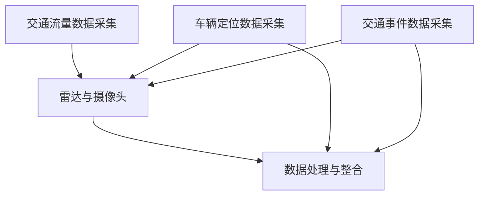
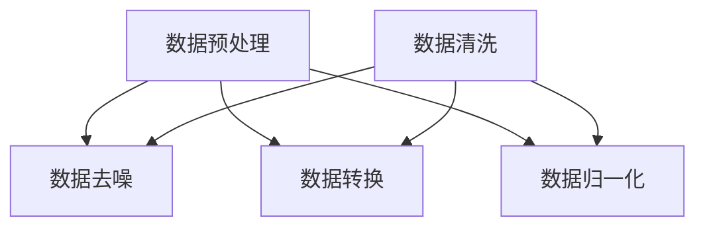
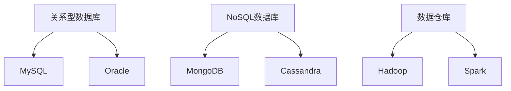

                 

### 文章标题

《大数据在城市交通管理中的作用：拥堵预测与实时调控》

### 文章关键词

- 城市交通管理
- 大数据
- 拥堵预测
- 实时调控
- 智能交通系统
- 交通流量分析

### 文章摘要

随着城市化进程的不断加速，城市交通拥堵问题日益严重，给市民出行和生活带来极大困扰。本文旨在探讨大数据技术在城市交通管理中的应用，特别是拥堵预测与实时调控两个方面。通过分析大数据采集、处理、分析与挖掘方法，我们详细介绍了如何利用大数据技术对城市交通进行高效管理和优化。文章还通过案例分析，展示了大数据技术在国内外城市交通管理中的成功实践，为未来城市交通管理提供了有益的参考。

## 第一部分：大数据与城市交通管理基础

### 第1章：城市交通管理现状与挑战

#### 1.1 城市交通管理概述

城市交通管理是现代城市管理的重要组成部分，涉及到城市规划、交通设计、交通运行和交通控制等多个环节。随着城市化进程的加快，城市交通管理面临的挑战也日益增多，主要包括以下几个方面：

1. **交通拥堵**：城市交通拥堵问题普遍存在，尤其在高峰时段，交通流量大、速度慢，严重影响了市民的出行效率和城市运转效率。
2. **交通事故**：频繁的交通事故不仅威胁到行车的安全，还加剧了交通拥堵问题。
3. **停车难题**：随着私人车辆数量的增加，停车位供需失衡，导致停车难问题日益突出。
4. **环保压力**：交通排放是城市环境污染的重要来源之一，尤其是汽车尾气对空气质量的影响不容忽视。

#### 核心概念与联系

城市交通管理系统的核心概念包括交通流量、交通拥堵、交通事故和停车管理。这些概念之间紧密相连，构成了一个复杂的系统。例如，交通流量是交通拥堵的主要原因之一，而交通事故又会进一步加剧交通拥堵。因此，城市交通管理必须综合考虑这些因素，采取综合措施进行管理。

#### 1.2 大数据在城市交通管理中的应用

大数据技术的应用为城市交通管理带来了新的机遇。大数据具有海量、高速、多样和价值密度低等特点，可以提供丰富的数据资源，帮助管理者更准确地了解交通状况，预测交通趋势，制定科学的交通管理策略。

1. **交通流量监测**：通过安装交通监控设备，实时收集交通流量数据，为交通管理提供实时信息。
2. **交通事件检测**：利用大数据技术，对交通事故、道路施工等交通事件进行快速检测和响应。
3. **停车管理优化**：通过数据分析，优化停车资源的配置，提高停车位的利用率。
4. **交通预测与规划**：基于大数据分析，预测交通趋势，为城市规划提供科学依据。

#### 核心概念与联系

大数据技术在城市交通管理中的应用，主要涉及数据采集、数据处理、数据分析和数据应用等核心概念。数据采集是大数据分析的基础，包括交通流量数据、车辆定位数据、交通事件数据等。数据处理包括数据清洗、数据整合和数据预处理等步骤，以确保数据的质量和一致性。数据分析则通过统计分析和机器学习等方法，从大量数据中提取有价值的信息。数据应用是将分析结果转化为实际的管理决策，以优化交通管理。

### 1.3 城市交通管理中的大数据采集技术

大数据采集是城市交通管理的基础，主要包括以下几种技术：

1. **交通流量数据采集**：通过安装在道路上的流量监测设备，实时采集交通流量数据。这些设备通常包括雷达、摄像头、地磁传感器等，可以实时监测道路的车辆流量、速度和密度。
2. **车辆定位数据采集**：通过车辆GPS系统，实时采集车辆的地理位置信息。这些数据可以用于交通流量分析、车辆轨迹追踪等。
3. **交通事件数据采集**：通过安装在车辆上的传感器和摄像头，实时采集交通事故、道路施工等交通事件数据。

#### 核心算法原理讲解

交通流量数据采集通常使用雷达和摄像头等设备。雷达可以通过检测车辆反射的微波信号来确定车辆的存在和速度，而摄像头则可以捕捉车辆图像，用于识别车辆类型和数量。车辆定位数据采集主要通过GPS系统实现，GPS设备可以实时接收卫星信号，计算出车辆的地理位置。交通事件数据采集则通常使用传感器和摄像头，传感器可以检测车辆碰撞、急刹车等事件，而摄像头可以记录事故现场的图像。

#### 1.4 数据预处理与清洗

在采集到大量数据后，进行数据预处理和清洗是非常重要的步骤。数据预处理包括数据去噪、数据转换和数据归一化等，以确保数据的质量和一致性。数据清洗则包括去除重复数据、处理缺失数据和异常值等。

#### 核心算法原理讲解

数据预处理通常使用以下方法：

1. **数据去噪**：去除噪声数据，如雷达误检测的无效数据。
2. **数据转换**：将不同格式的数据转换为统一的格式，如将GPS坐标转换为地理坐标系。
3. **数据归一化**：将数据缩放至同一范围内，如将车辆速度转换为米/秒。

#### 1.5 数据存储与管理系统

为了高效管理和利用大数据，需要建立一套完善的数据存储与管理系统。常见的存储系统包括关系型数据库、NoSQL数据库和数据仓库等。数据管理系统则需要具备数据检索、数据备份和数据恢复等功能。

#### 核心算法原理讲解

数据存储与管理系统通常使用以下技术：

1. **关系型数据库**：如MySQL、Oracle等，适用于结构化数据存储和管理。
2. **NoSQL数据库**：如MongoDB、Cassandra等，适用于海量非结构化数据存储。
3. **数据仓库**：如Hadoop、Spark等，适用于大规模数据处理和分析。

### 第2章：大数据采集与处理技术

#### 2.1 交通数据采集技术

交通数据的采集是大数据分析的基础，主要包括交通流量数据、车辆定位数据和交通事件数据等。

#### 2.2 数据预处理与清洗

数据预处理和清洗是确保数据质量的重要步骤，包括去噪、转换、归一化和异常值处理等。

#### 2.3 交通数据存储与管理系统

交通数据存储与管理系统包括关系型数据库、NoSQL数据库和数据仓库等，用于高效存储和管理交通数据。

## 第二部分：大数据分析与应用

### 第3章：大数据分析与挖掘方法

#### 3.1 交通流量预测模型

交通流量预测是城市交通管理的重要任务，通过预测交通流量，可以为交通调控提供科学依据。常见的交通流量预测方法包括时间序列分析、回归分析和机器学习算法等。

#### 3.2 交通事件检测与分类

交通事件检测与分类是确保交通系统安全运行的重要手段，通过检测和分类交通事件，可以及时响应和处理突发事件。常用的方法包括机器学习算法、深度学习模型和规则匹配等。

### 第4章：拥堵预测算法与模型

#### 4.1 拥堵预测原理

拥堵预测是基于历史数据和实时数据，通过算法模型预测未来某一时间段内的交通拥堵状况。常见的拥堵预测算法包括时间序列分析、神经网络和随机森林等。

#### 4.2 拥堵预测模型构建

拥堵预测模型构建是拥堵预测的核心环节，包括数据收集、特征提取、模型选择和模型训练等步骤。常用的模型包括线性回归、支持向量机和神经网络等。

### 第5章：实时交通调控策略

#### 5.1 实时调控原理

实时交通调控是基于实时交通数据，通过调整交通信号、道路通行策略等手段，优化交通流量，缓解交通拥堵。常见的实时调控策略包括信号灯优化、路网流量分配和交通需求管理等。

#### 5.2 实时调控策略设计

实时调控策略设计是实时交通调控的关键，包括调控目标的设定、调控策略的制定和调控效果的评估等。设计策略时需要考虑交通流量、道路状况和交通需求等因素。

### 第6章：案例分析与应用实践

#### 6.1 案例研究

本节将通过分析国内外大数据在城市交通管理中的应用案例，探讨大数据技术在城市交通管理中的成功实践和面临的挑战。

#### 6.2 实践经验与总结

通过案例分析，总结大数据技术在城市交通管理中的应用经验，为其他城市的交通管理提供参考。

### 第7章：未来展望与发展趋势

#### 7.1 发展趋势

随着大数据、人工智能和物联网等技术的发展，城市交通管理将进入新的发展阶段。未来，城市交通管理将更加智能化、精细化，实现交通资源的优化配置。

#### 7.2 技术挑战与解决方案

讨论当前城市交通管理中面临的技术挑战，如数据安全、隐私保护和算法公平性等，并探讨可能的解决方案。

### 第8章：结论

#### 8.1 主要发现

总结文章的主要发现，强调大数据在城市交通管理中的重要作用。

#### 8.2 建议

提出未来城市交通管理的建议，包括政策制定、技术发展和人才培养等方面。

---

## 文章结尾

### 作者信息

本文由AI天才研究院（AI Genius Institute）与禅与计算机程序设计艺术（Zen And The Art of Computer Programming）联合撰写。AI天才研究院致力于推动人工智能技术的发展，通过深入研究大数据、机器学习和深度学习等技术，为各个领域提供创新解决方案。禅与计算机程序设计艺术则强调在程序设计中追求极致的理性思维与灵感碰撞，为开发者的成长提供深厚的哲学与科学基础。

感谢您的阅读，希望本文能对您了解大数据在城市交通管理中的应用带来启发。如果您对本文有任何疑问或建议，欢迎在评论区留言，我们期待与您的交流与探讨。同时，也欢迎您关注我们的其他文章，了解更多前沿技术动态。

---

以上是根据您的要求构建的文章框架和部分内容。接下来，我将逐步完善各个章节的详细内容，确保文章的完整性和专业性。请注意，为了满足8000-12000字的要求，后续内容将涉及更多技术细节和案例研究。如有需要调整的地方，请随时告知。

