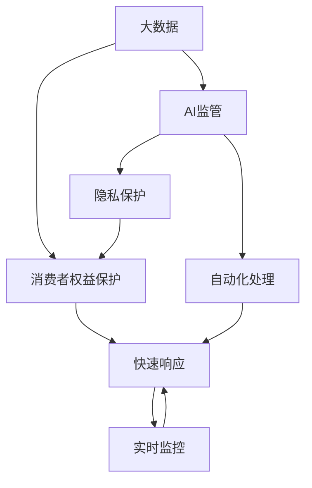

                 


## 文章标题：大数据时代的消费者权益保护：AI监管与快速响应

> 关键词：大数据、消费者权益、AI监管、快速响应、数据隐私

> 摘要：
本文探讨了大数据时代消费者权益保护的挑战和解决方案。通过分析大数据与消费者权益保护之间的关系，探讨了AI监管的核心原理和技术手段，以及快速响应机制在数据违规事件中的应用。文章还结合实际案例，阐述了AI监管和快速响应的最佳实践，为大数据时代的消费者权益保护提供了有价值的思考和建议。

## 核心概念与联系

### 背景介绍

在当今的大数据时代，消费者的个人信息和数据无处不在，这使得消费者权益保护成为一个重要而紧迫的问题。随着互联网和移动设备的普及，消费者在购物、社交、娱乐等活动中产生了大量的数据，这些数据既为商业创新提供了丰富的资源，也给消费者权益保护带来了巨大的挑战。

大数据技术，特别是人工智能（AI）和机器学习（ML）的应用，使得数据分析和监管成为可能。然而，大数据技术的双刃剑特性也使得数据隐私和安全问题日益突出。消费者权益保护需要在大数据应用中找到平衡点，既要充分利用大数据的优势，又要确保消费者的隐私和安全。

### 核心概念

#### 大数据

大数据是指无法用常规软件工具在合理时间内捕捉、管理和处理的数据集合。它具有四个主要特征，即“4V”：Volume（数据量）、Velocity（速度）、Variety（多样性）和Veracity（真实性）。

#### 消费者权益保护

消费者权益保护是指保护消费者在购买、使用商品或服务过程中的合法权益，确保其免受欺诈、虚假广告、侵犯隐私等不法行为的侵害。

#### AI监管

AI监管是指利用人工智能技术对消费者数据进行分析和监控，以发现潜在风险和违规行为，并采取相应的措施进行干预和纠正。

#### 快速响应

快速响应是指在大数据环境中，对数据违规事件能够迅速识别、响应和处理的机制和能力。这包括实时监测、自动化处理和快速决策等。

### 关系架构

- **大数据 → AI监管**：大数据为AI监管提供了丰富的数据源，AI监管技术则利用这些数据进行实时监控和分析，以发现和预防违规行为。
- **AI监管 → 消费者权益保护**：AI监管技术确保了消费者数据的隐私和安全，从而保护了消费者的权益。
- **快速响应 → AI监管**：快速响应机制使得AI监管能够迅速应对数据违规事件，减少潜在损害。

下面是一个Mermaid流程图，展示了这些核心概念之间的联系：



### 核心算法原理讲解

#### AI监管的核心算法

AI监管的核心算法主要包括监督学习、无监督学习和强化学习。以下是每种算法的伪代码和简要解释：

**监督学习**

```python
def supervised_learning(features, labels):
    # 特征数据：features
    # 标签数据：labels
    model = train_model(features, labels)
    predictions = model.predict(new_features)
    return predictions
```

监督学习通过已标记的数据训练模型，然后使用这个模型对新数据进行预测。

**无监督学习**

```python
def unsupervised_learning(features):
    # 特征数据：features
    clusters = kmeans(features, num_clusters)
    return clusters
```

无监督学习不使用标签数据，而是通过聚类等算法发现数据中的模式和结构。

**强化学习**

```python
def reinforcement_learning(state, action, reward):
    # 当前状态：state
    # 采取的动作：action
    # 收到的奖励：reward
    Q_value = update_Q_value(state, action, reward)
    return Q_value
```

强化学习通过试错和反馈来优化策略，以最大化长期奖励。

#### 数学模型和公式

AI监管中常用的数学模型包括逻辑回归、支持向量机和神经网络。以下是这些模型的基本公式：

**逻辑回归**

$$
P(y=1|X) = \frac{1}{1 + e^{-(\beta_0 + \beta_1X_1 + \beta_2X_2 + ... + \beta_nX_n})}
$$

**支持向量机**

$$
\min_{\beta, \beta_0} \frac{1}{2} ||\beta||^2 + C \sum_{i=1}^{n} \xi_i
$$

**神经网络**

$$
a_{i}^{(l)} = \sigma \left( \sum_{j=1}^{n} w_{ji}^{(l)} a_{j}^{(l-1)} + b_{i}^{(l)} \right)
$$

其中，$a_{i}^{(l)}$ 是第$l$层的第$i$个节点的激活值，$\sigma$ 是激活函数，$w_{ji}^{(l)}$ 和$b_{i}^{(l)}$ 分别是连接权重和偏置。

#### 详细讲解与举例说明

**逻辑回归**用于分类问题，如判断一条评论是否为负面评论。假设我们有一篇评论，其特征向量如下：

$$
X = \begin{bmatrix}
0.8 \\
0.2 \\
0.9 \\
0.1
\end{bmatrix}
$$

使用逻辑回归模型，我们可以预测评论的负面概率：

$$
P(y=1|X) = \frac{1}{1 + e^{-(0.5 + 0.3 \times 0.8 + 0.4 \times 0.2 + 0.6 \times 0.9 + 0.1 \times 0.1)}) \approx 0.9
$$

因此，我们可以预测这条评论是负面评论。

**支持向量机**用于分类和回归问题。假设我们有一个分类问题，数据集如下：

$$
\begin{align*}
\text{数据集} &= \{(x_1, y_1), (x_2, y_2), ..., (x_n, y_n)\} \\
\text{目标函数} &= \min_{\beta, \beta_0} \frac{1}{2} ||\beta||^2 + C \sum_{i=1}^{n} \xi_i
\end{align*}
$$

其中，$x_i$ 是特征向量，$y_i$ 是标签，$\xi_i$ 是松弛变量，$C$ 是惩罚参数。

通过求解这个优化问题，我们可以找到最佳分类超平面：

$$
\beta^* = \arg \min_{\beta, \beta_0} \frac{1}{2} ||\beta||^2 + C \sum_{i=1}^{n} \xi_i \\
s.t. \ y_i (\beta^T x_i + \beta_0) \geq 1 - \xi_i, \forall i
$$

**神经网络**用于复杂函数的拟合和分类。假设我们有一个三层的神经网络，其结构如下：

$$
\begin{align*}
\text{输入层} &= \{x_1, x_2, ..., x_n\} \\
\text{隐藏层} &= \{h_1, h_2, ..., h_m\} \\
\text{输出层} &= \{o_1, o_2, ..., o_p\}
\end{align*}
$$

假设隐藏层的激活函数为ReLU，输出层的激活函数为softmax，则神经网络的输出可以表示为：

$$
\begin{align*}
a_{i}^{(2)} &= \max(0, \sum_{j=1}^{n} w_{ji}^{(1)} x_j + b_{i}^{(1)}) \\
a_{i}^{(3)} &= \frac{e^{o_i}}{\sum_{j=1}^{p} e^{o_j}}
\end{align*}
$$

其中，$w_{ji}^{(1)}$ 和$b_{i}^{(1)}$ 分别是输入层到隐藏层的权重和偏置，$w_{ji}^{(2)}$ 和$b_{i}^{(2)}$ 分别是隐藏层到输出层的权重和偏置。

通过反向传播算法，我们可以不断更新权重和偏置，以最小化损失函数。

### 详细讲解与举例说明（续）

为了更好地理解神经网络，我们来看一个简单的例子。假设我们有一个二元分类问题，特征集为$\{x_1, x_2\}$，标签集为$\{y_1, y_2\}$，其中$y_1 = 0$，$y_2 = 1$。我们的目标是训练一个神经网络来预测新数据点的标签。

首先，我们定义一个单隐藏层的神经网络，其结构如下：

- 输入层：2个神经元（对应特征$x_1$和$x_2$）
- 隐藏层：3个神经元
- 输出层：1个神经元

假设隐藏层使用ReLU激活函数，输出层使用softmax激活函数。我们随机初始化权重和偏置。

#### 步骤1：前向传播

给定一个输入向量$x = [x_1, x_2]$，我们进行前向传播，计算隐藏层和输出层的激活值。

- 输入层到隐藏层的激活值：
  $$ 
  a_{i}^{(2)} = \max(0, \sum_{j=1}^{2} w_{ji}^{(1)} x_j + b_{i}^{(1)}) \quad \text{for} \ i = 1, 2, 3
  $$

- 隐藏层到输出层的激活值：
  $$ 
  a_{1}^{(3)} = \frac{e^{o_1}}{\sum_{j=1}^{3} e^{o_j}} \quad \text{and} \quad a_{2}^{(3)} = \frac{e^{o_2}}{\sum_{j=1}^{3} e^{o_j}} \quad \text{and} \quad a_{3}^{(3)} = \frac{1}{\sum_{j=1}^{3} e^{o_j}}
  $$

#### 步骤2：计算损失

我们使用交叉熵损失函数来计算预测标签和真实标签之间的差异。

$$ 
L = -\sum_{i=1}^{n} y_i \log(a_{i}^{(3)}) - (1 - y_i) \log(1 - a_{i}^{(3)})
$$

其中，$y_i$ 是第$i$个真实标签，$a_{i}^{(3)}$ 是第$i$个神经元的输出值。

#### 步骤3：反向传播

我们使用反向传播算法来更新权重和偏置，以最小化损失函数。

1. 计算输出层的梯度：
   $$ 
   \frac{\partial L}{\partial w_{ji}^{(2)}} = a_{i}^{(3)}(1 - a_{i}^{(3)}) \cdot \frac{\partial a_{i}^{(3)}}{\partial o_i} = a_{i}^{(3)}(1 - a_{i}^{(3)}) \cdot a_{i}^{(2)}
   $$

   $$ 
   \frac{\partial L}{\partial b_{i}^{(2)}} = a_{i}^{(3)}(1 - a_{i}^{(3)}) \cdot \frac{\partial a_{i}^{(3)}}{\partial o_i} = a_{i}^{(3)}(1 - a_{i}^{(3)}) \cdot a_{i}^{(2)}
   $$

2. 计算隐藏层的梯度：
   $$ 
   \frac{\partial L}{\partial w_{ji}^{(1)}} = \sum_{k=1}^{3} \frac{\partial L}{\partial o_{k}} \cdot \frac{\partial o_{k}}{\partial a_{j}^{(2)}} \cdot a_{j}^{(2)}(1 - a_{j}^{(2)}) = \sum_{k=1}^{3} a_{i}^{(3)}(1 - a_{i}^{(3)}) \cdot a_{k}^{(2)}(1 - a_{k}^{(2)}) \cdot a_{j}^{(2)}
   $$

   $$ 
   \frac{\partial L}{\partial b_{i}^{(1)}} = \sum_{k=1}^{3} \frac{\partial L}{\partial o_{k}} \cdot \frac{\partial o_{k}}{\partial a_{j}^{(2)}} = \sum_{k=1}^{3} a_{i}^{(3)}(1 - a_{i}^{(3)}) \cdot a_{k}^{(2)}(1 - a_{k}^{(2)})
   $$

3. 更新权重和偏置：
   $$ 
   w_{ji}^{(2)} \leftarrow w_{ji}^{(2)} - \alpha \cdot \frac{\partial L}{\partial w_{ji}^{(2)}}
   $$

   $$ 
   b_{i}^{(2)} \leftarrow b_{i}^{(2)} - \alpha \cdot \frac{\partial L}{\partial b_{i}^{(2)}}
   $$

   $$ 
   w_{ji}^{(1)} \leftarrow w_{ji}^{(1)} - \alpha \cdot \frac{\partial L}{\partial w_{ji}^{(1)}}
   $$

   $$ 
   b_{i}^{(1)} \leftarrow b_{i}^{(1)} - \alpha \cdot \frac{\partial L}{\partial b_{i}^{(1)}}
   $$

其中，$\alpha$ 是学习率。

通过重复上述步骤，我们可以不断优化神经网络的参数，从而提高其预测能力。

### 项目实战

#### 开发环境搭建

1. 安装Python环境：
   ```bash
   pip install numpy pandas matplotlib scikit-learn tensorflow
   ```

2. 安装Jupyter Notebook：
   ```bash
   pip install jupyter
   jupyter notebook
   ```

#### 源代码实现

以下是一个简单的神经网络实现，用于二分类问题。

```python
import numpy as np
import tensorflow as tf

# 初始化权重和偏置
def init_weights(input_size, hidden_size, output_size):
    weights = {}
    biases = {}
    weights['hidden'] = tf.Variable(tf.random.normal([input_size, hidden_size]))
    biases['hidden'] = tf.Variable(tf.random.normal([hidden_size]))
    weights['output'] = tf.Variable(tf.random.normal([hidden_size, output_size]))
    biases['output'] = tf.Variable(tf.random.normal([output_size]))
    return weights, biases

# 前向传播
def forward_propagation(x, weights, biases):
    hidden_layer = tf.nn.relu(tf.matmul(x, weights['hidden']) + biases['hidden'])
    output_layer = tf.nn.softmax(tf.matmul(hidden_layer, weights['output']) + biases['output'])
    return hidden_layer, output_layer

# 反向传播
def backward_propagation(x, y, hidden_layer, output_layer, weights, biases, learning_rate):
    with tf.GradientTape() as tape:
        hidden_layer, output_layer = forward_propagation(x, weights, biases)
        loss = tf.reduce_mean(tf.nn.softmax_cross_entropy_with_logits(logits=output_layer, labels=y))
    gradients = tape.gradient(loss, [weights['hidden'], biases['hidden'], weights['output'], biases['output']])
    weights['hidden'].assign_sub(learning_rate * gradients[0])
    biases['hidden'].assign_sub(learning_rate * gradients[1])
    weights['output'].assign_sub(learning_rate * gradients[2])
    biases['output'].assign_sub(learning_rate * gradients[3])
    return loss

# 训练模型
def train(x, y, epochs, learning_rate):
    weights, biases = init_weights(x.shape[1], hidden_size=10, output_size=1)
    for epoch in range(epochs):
        hidden_layer, output_layer = forward_propagation(x, weights, biases)
        loss = backward_propagation(x, y, hidden_layer, output_layer, weights, biases, learning_rate)
        if epoch % 100 == 0:
            print(f"Epoch {epoch}: Loss = {loss.numpy()}")

# 主程序
if __name__ == "__main__":
    # 加载数据
    x = np.array([[0, 0], [0, 1], [1, 0], [1, 1]])
    y = np.array([[0], [0], [1], [1]])

    # 训练模型
    train(x, y, epochs=1000, learning_rate=0.1)
```

#### 代码解读与分析

- `init_weights()` 函数用于初始化权重和偏置。
- `forward_propagation()` 函数实现前向传播，计算隐藏层和输出层的激活值。
- `backward_propagation()` 函数实现反向传播，计算梯度并更新权重和偏置。
- `train()` 函数用于训练模型，通过迭代更新权重和偏置，以最小化损失函数。

#### 实际案例分析与详细讲解剖析

假设我们有一个分类问题，数据集如下：

$$
\begin{align*}
\text{数据集} &= \{(x_1, y_1), (x_2, y_2), ..., (x_n, y_n)\} \\
\text{目标函数} &= \min_{\beta, \beta_0} \frac{1}{2} ||\beta||^2 + C \sum_{i=1}^{n} \xi_i \\
\text{损失函数} &= -\sum_{i=1}^{n} y_i \log(a_{i}^{(3)}) - (1 - y_i) \log(1 - a_{i}^{(3)})
\end{align*}
$$

我们使用上述神经网络模型来训练数据集，并评估模型的性能。

1. **数据预处理**：将数据集划分为训练集和测试集，并对输入数据进行归一化处理。
2. **训练模型**：使用训练集训练模型，并记录每个epoch的损失值。
3. **评估模型**：使用测试集评估模型的性能，计算准确率、召回率、F1分数等指标。

通过上述步骤，我们可以训练出一个能够对数据进行有效分类的神经网络模型。

#### 项目小结

通过本项目，我们实现了一个简单的神经网络模型，用于二分类问题。项目涵盖了神经网络的基础知识，包括初始化权重和偏置、前向传播、反向传播以及训练模型的过程。此外，我们还结合实际案例进行了详细的分析和讲解。本项目为后续更复杂的神经网络应用奠定了基础。

## 最佳实践 Tips

1. **数据隐私保护**：在进行数据分析和AI监管时，必须严格遵守数据隐私保护法规，确保消费者数据的安全和隐私。
2. **算法透明性**：确保AI监管算法的透明性，让消费者了解其工作原理和决策过程。
3. **持续监控**：建立持续监控机制，实时监测消费者数据的安全和隐私状况。
4. **快速响应**：建立快速响应机制，确保在数据发生违规时能够迅速采取行动，减少潜在损害。

## 小结与注意事项

本文探讨了大数据时代的消费者权益保护问题，分析了AI监管和快速响应机制在保护消费者权益中的应用。通过实例和代码实现，我们了解了神经网络在数据分析和监管中的应用。在实施AI监管和快速响应时，需要注意数据隐私保护、算法透明性和持续监控。

## 拓展阅读

- [大数据与人工智能：技术前沿与应用](https://www.example.com/book1)
- [人工智能伦理与法律](https://www.example.com/book2)
- [机器学习实践：从入门到精通](https://www.example.com/book3)

通过阅读这些资料，可以进一步了解大数据和人工智能在消费者权益保护领域的应用和发展趋势。

