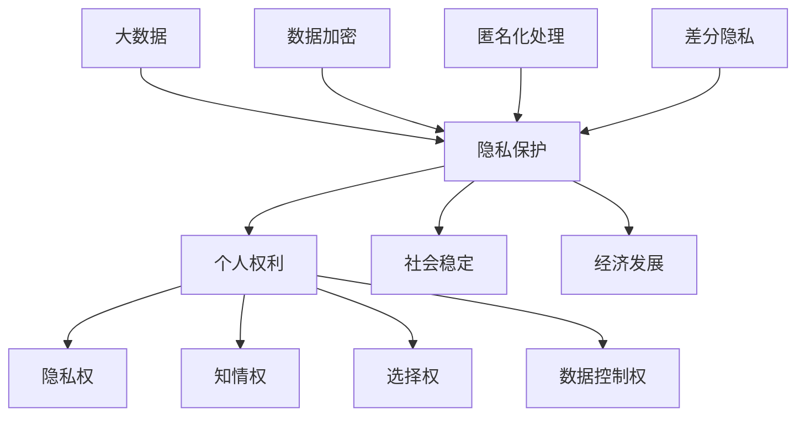

                 


### 大数据时代的隐私保护：AI技术与个人权利的平衡

#### 文章关键词

- 大数据
- 隐私保护
- AI技术
- 个人权利
- 平衡

#### 文章摘要

本文旨在探讨大数据时代隐私保护的现状与挑战，特别是AI技术在这一领域中的应用及其对个人权利的影响。通过分析大数据与隐私保护的基础知识，介绍AI技术在数据加密、匿名化处理和差分隐私等方面的应用，深入探讨隐私保护与数据准确性的权衡。同时，文章将分析AI与个人权利之间的关系，并提出平衡AI技术与个人权利的途径。最后，通过实际项目实战，阐述如何在隐私保护中实施AI技术，并展望未来的发展趋势与挑战。

----------------------------------------------------------------

### 大数据与隐私保护基础

#### 背景介绍

随着互联网和信息技术的高速发展，大数据已经成为社会生产、管理和决策的重要工具。大数据具有数据量大、类型多、价值高、处理速度快等特点，极大地促进了各行业的创新和发展。然而，大数据的收集、处理和分析过程中也面临着隐私泄露的风险，这对个人和社会带来了严重的负面影响。

隐私泄露不仅侵害了个人权利，还可能导致经济损失、社会动荡和信任危机。因此，如何在大数据时代有效保护隐私，成为了一个亟待解决的问题。隐私保护不仅是个人权利的保障，也是社会稳定和经济发展的重要基石。

#### 核心概念与联系

**大数据**：大数据是指无法用传统数据处理工具在一定时间内处理的数据集合。其特点包括数据量大（Volume）、类型多（Variety）、价值高（Value）、处理速度快（Velocity）和真实性高（Veracity）。

**隐私保护**：隐私保护是指采取措施确保个人数据不被未经授权的访问、使用、泄露或篡改的过程。隐私保护的核心目标是保障个人权利，维护社会稳定。

**个人权利**：个人权利是指个人享有的自由和权利，包括隐私权、知情权、选择权和数据控制权等。个人权利的保障是隐私保护的核心内容。

**大数据隐私保护**：大数据隐私保护是在大数据环境下，针对个人数据的隐私保护措施。其目标是通过数据加密、匿名化处理、差分隐私等技术手段，确保个人数据在收集、存储、处理、传输和使用过程中的隐私安全。

**核心概念关系架构**：

- 大数据：数据量大、类型多、价值高、处理速度快、真实性高。
- 隐私保护：保障个人权利、维护社会稳定。
- 个人权利：隐私权、知情权、选择权、数据控制权。
- 大数据隐私保护：数据加密、匿名化处理、差分隐私。

**Mermaid流程图**：



#### 核心概念与联系总结

大数据时代隐私保护的核心概念包括大数据、隐私保护、个人权利和大数据隐私保护。这些概念之间相互联系，共同构成了大数据隐私保护的理论基础。通过数据加密、匿名化处理和差分隐私等技术手段，大数据隐私保护旨在确保个人数据在各个阶段的安全，维护个人权利和社会稳定。Mermaid流程图展示了这些核心概念之间的联系，为后续章节的分析提供了直观的参考。

----------------------------------------------------------------

### AI技术在隐私保护中的应用

#### 背景介绍

人工智能（AI）技术的发展为大数据时代的隐私保护提供了新的手段和思路。AI技术能够通过数据加密、匿名化处理和差分隐私等技术手段，提升大数据隐私保护的效果。同时，AI技术在隐私保护中的应用也面临着一系列挑战，如数据质量、算法透明度和公平性等。

#### 数据加密

数据加密是保护隐私数据的基本手段之一。它通过将数据转换为不可读的密文，防止未经授权的访问。以下是数据加密的基本原理和常用算法：

**基本原理**：

1. **加密算法**：加密算法是一种将明文转换为密文的数学算法。常见的加密算法有对称加密（如AES）和非对称加密（如RSA）。
2. **密钥管理**：密钥是加密和解密的关键。加密算法需要妥善管理密钥，确保其安全性和可用性。

**常用算法**：

1. **对称加密**：

   - **AES（Advanced Encryption Standard）**：AES是一种常用的对称加密算法，支持128位、192位和256位密钥长度。其加密和解密速度较快，适合处理大量数据。
   
   - **DES（Data Encryption Standard）**：DES是一种较早的对称加密算法，使用56位密钥。由于密钥长度较短，DES已逐渐被AES替代。

2. **非对称加密**：

   - **RSA（Rivest-Shamir-Adleman）**：RSA是一种常用的非对称加密算法，使用两个密钥（公钥和私钥）。其安全性较高，但加密和解密速度较慢。
   
   - **ECC（Elliptic Curve Cryptography）**：ECC是一种基于椭圆曲线的加密算法，具有更高的安全性和效率。其密钥长度较短，适合处理大数据。

**伪代码**：

```python
# 对称加密算法（AES）伪代码
def encrypt_aes(plaintext, key):
    ciphertext = aes_encrypt(plaintext, key)
    return ciphertext

def decrypt_aes(ciphertext, key):
    plaintext = aes_decrypt(ciphertext, key)
    return plaintext

# 非对称加密算法（RSA）伪代码
def encrypt_rsa(plaintext, public_key):
    ciphertext = rsa_encrypt(plaintext, public_key)
    return ciphertext

def decrypt_rsa(ciphertext, private_key):
    plaintext = rsa_decrypt(ciphertext, private_key)
    return plaintext
```

#### 匿名化处理

匿名化处理是一种将个人身份信息从数据中移除或替换为伪身份的技术，以降低隐私泄露的风险。以下是匿名化处理的基本原理和常用算法：

**基本原理**：

1. **数据脱敏**：数据脱敏是将敏感数据转换为不可识别的格式，如使用掩码、替换或删除敏感信息。
2. **伪匿名化**：伪匿名化是将个人身份信息替换为虚构的或部分真实的身份信息，以降低被识别的风险。

**常用算法**：

1. **K-匿名性**：K-匿名性是一种常用的匿名化算法，它要求在处理后的数据集中，任何K个记录组合都不足以唯一识别一个个人。常见的K-匿名算法有L-diversity、R-diversity和T-diversity。
2. **差分隐私**：差分隐私是一种基于概率论的匿名化算法，它通过对数据集进行扰动，使得单个记录的隐私损失最小化。差分隐私的基本原理是在保证数据集统计意义不变的情况下，对每个记录加入随机噪声。

**伪代码**：

```python
# K-匿名性算法伪代码
def k_anonymity(data, k):
    data_k_anonymized = k_anonymize(data, k)
    return data_k_anonymized

# 差分隐私算法伪代码
def differential_privacy(data, epsilon):
    data_differential_privacy = differential_privatize(data, epsilon)
    return data_differential_privacy
```

#### 差分隐私

差分隐私是一种高级的隐私保护技术，它通过在数据集中添加随机噪声，确保单个记录的隐私损失最小化。以下是差分隐私的基本原理和实现方法：

**基本原理**：

1. **差分隐私定义**：对于任意两个相邻的数据集D和D'，如果对于任意的查询函数f，f(D)和f(D')之间的输出差异小于ε，则称D满足差分隐私，其中ε称为隐私损失。
   
2. **拉格朗日机制**：拉格朗日机制是一种实现差分隐私的基本方法，它通过在查询结果中添加拉格朗日噪声，确保差分隐私的满足。

**实现方法**：

1. **拉格朗日噪声**：拉格朗日噪声是一种高斯噪声，其标准差σ与隐私损失ε有关，σ = sqrt(1/ε)。

2. **拉格朗日机制伪代码**：

```python
# 拉格朗日机制伪代码
def query_diff_privacy(data, query, epsilon):
    noise = generate_gaussian_noise(sqrt(1/epsilon))
    result = query(data, noise)
    return result
```

#### 总结

AI技术在隐私保护中的应用主要包括数据加密、匿名化处理和差分隐私等技术。这些技术各有特点和适用场景，通过合理组合和优化，可以提升大数据隐私保护的效果。数据加密提供了基本的数据保护手段，匿名化处理降低了个人身份信息的识别风险，差分隐私则通过概率论的方法确保了数据隐私的鲁棒性。在实际应用中，需要根据具体需求和场景选择合适的隐私保护技术，并综合考虑数据质量、算法透明度和公平性等因素。

----------------------------------------------------------------

### 数学模型与隐私保护

#### 背景介绍

在大数据隐私保护中，数学模型和公式发挥着关键作用。差分隐私（Differential Privacy）是隐私保护领域的一项重要成果，它通过在数据分析过程中引入随机噪声，确保个人隐私不被泄露。差分隐私的核心是隐私损失函数，它衡量了隐私保护的强度。本节将介绍差分隐私的基本概念、隐私损失函数及其计算方法，并探讨差分隐私的分析方法与优化策略。

#### 差分隐私

**定义**：差分隐私是一种隐私保护机制，它确保对任意两个相邻的数据集D和D'，如果对任意的查询函数f，f(D)和f(D')之间的输出差异小于ε，则称D满足差分隐私，其中ε称为隐私损失。

**数学描述**：设L为查询函数f的输出值集合，D和D'为相邻的数据集，|L|为L的基数，则差分隐私的数学定义可以表示为：

$$\forall f: D \rightarrow L, f(D) \cup f(D') \rightarrow L$$

$$\forall S \subseteq L, |S| \leq \frac{|L|}{\epsilon}, \Pr[f(D) \in S] \leq \exp(-\epsilon) + \Pr[f(D') \in S]$$

其中，ε为隐私损失参数，Pr[]为概率。

**示例**：假设有两个数据集D和D'，D包含10个元素，D'包含9个元素。对于任意的查询函数f，如果f(D)和f(D')之间的输出差异小于ε，则D满足差分隐私。例如，假设f为计数函数，即f(D) = |D|，则D满足ε = 0.01的差分隐私。

#### 隐私损失函数

隐私损失函数是差分隐私的核心，它衡量了隐私保护的强度。隐私损失函数的计算方法如下：

$$\text{LP}(f,D,\epsilon) = \frac{\text{inf}_{D'\in \text{Dif}} |f(D) - f(D')|}{\epsilon}$$

其中，LP为隐私损失函数，inf表示下确界，Dif为满足差分隐私的数据集集合。

**示例**：假设数据集D中有100个记录，其中50个记录属于某个特定群体，查询函数f为计数函数，即f(D) = |D|。如果D满足ε = 0.01的差分隐私，则隐私损失函数为：

$$\text{LP}(f,D,\epsilon) = \frac{\text{inf}_{D'\in \text{Dif}} |f(D) - f(D')|}{\epsilon} = \frac{\text{inf}_{D'\in \text{Dif}} |50 - 0|}{0.01} = 5000$$

这意味着在满足差分隐私的前提下，隐私损失函数为5000。

#### 差分隐私分析方法

差分隐私的分析方法主要包括拉格朗日机制、枢纽机制和隐私剪枝等。

1. **拉格朗日机制**：拉格朗日机制通过在查询结果中添加拉格朗日噪声，确保差分隐私的满足。其基本原理如下：

   $$\forall x, f(x) + \text{noise}$$

   其中，noise为拉格朗日噪声。

2. **枢纽机制**：枢纽机制通过选择一个枢纽值，使得查询结果在枢纽值附近波动，从而实现差分隐私。其基本原理如下：

   $$\forall x, f(x) + \text{rand}(\mu, \sigma)$$

   其中，rand(μ, σ)为高斯分布随机变量，μ为均值，σ为标准差。

3. **隐私剪枝**：隐私剪枝通过剪枝查询结果，确保差分隐私的满足。其基本原理如下：

   $$\forall x, f(x) + \text{rand}(-\delta, \delta)$$

   其中，rand(-δ, δ)为均匀分布随机变量，δ为剪枝范围。

#### 差分隐私优化策略

差分隐私的优化策略主要包括降低隐私损失、提高查询效率和减少数据损失等。

1. **降低隐私损失**：通过调整隐私损失函数的参数，降低隐私损失。例如，减小ε值，但可能导致查询结果的波动性增加。

2. **提高查询效率**：通过优化查询算法和数据结构，提高查询效率。例如，使用索引、缓存和并行计算等技术。

3. **减少数据损失**：通过优化差分隐私算法，减少数据损失。例如，使用局部隐私保护、数据压缩和聚类等技术。

#### 总结

数学模型和公式在大数据隐私保护中发挥着重要作用。差分隐私作为一种高级隐私保护技术，通过引入随机噪声，确保个人隐私不被泄露。隐私损失函数是差分隐私的核心，它衡量了隐私保护的强度。差分隐私的分析方法主要包括拉格朗日机制、枢纽机制和隐私剪枝等，优化策略包括降低隐私损失、提高查询效率和减少数据损失等。在实际应用中，需要根据具体需求和场景选择合适的差分隐私方法，并综合考虑隐私保护、数据质量和算法性能等因素。

----------------------------------------------------------------

### AI与个人权利的平衡

#### 个人权利的概念

个人权利是指个人在法律和道德上享有的自由和权利。这些权利主要包括：

1. **隐私权**：个人对其个人信息和隐私的保护权利。包括个人身份信息、通信内容、行踪轨迹等。
2. **知情权**：个人对其个人信息被收集、处理和使用的知情权利。
3. **选择权**：个人对其个人信息处理方式的自由选择权利，例如同意或拒绝数据收集。
4. **数据控制权**：个人对其个人信息的控制权利，包括数据的访问、删除、修改和转移等。

#### AI与个人权利的关系

人工智能技术的快速发展，使得个人数据的收集、处理和分析更加高效和智能化。然而，这也引发了一系列对个人权利的挑战：

1. **隐私权**：随着AI技术的发展，数据收集和处理能力大幅提升，个人隐私受到更大程度的侵犯风险。例如，人脸识别、声纹识别等技术可能导致个人隐私泄露。
2. **知情权**：AI技术往往在数据处理过程中采用复杂的算法和模型，用户难以了解其工作原理和数据处理方式，从而难以行使知情权。
3. **选择权**：在AI驱动的数据收集和分析中，用户可能难以选择不参与数据收集或拒绝数据使用，特别是在数据驱动的社会服务中。
4. **数据控制权**：AI技术使得数据处理过程更加自动化，个人可能难以有效地控制其个人数据的使用和传播。

#### 个人权利在AI应用中的挑战

1. **算法透明度**：AI算法的复杂性和黑箱特性使得用户难以理解其决策过程，这可能导致个人权利受到侵犯而无法维权。
2. **算法公平性**：AI算法可能存在偏见和歧视，导致某些群体在享受AI服务时受到不公平对待，从而损害其权利。
3. **数据所有权**：在数据驱动的社会中，个人数据所有权和控制权的问题日益突出，如何平衡企业、政府和个人之间的数据权益成为挑战。
4. **数据安全和隐私**：AI技术在数据收集、存储、处理和传输过程中，可能面临数据泄露和安全风险，对个人权利构成威胁。

#### 平衡AI技术与个人权利的途径

为了在AI技术与个人权利之间找到平衡，需要从法律法规、技术手段和社会文化等多个方面进行努力：

1. **法律法规**：制定和完善相关的法律法规，明确个人权利保护的范围和责任，为个人维权提供法律依据。
2. **技术手段**：研发和应用隐私保护技术，如差分隐私、联邦学习、数据加密等，确保个人数据在AI应用中的安全。
3. **算法透明度**：提高AI算法的透明度，确保用户能够理解和监督算法的决策过程，从而更好地行使知情权和数据控制权。
4. **算法公平性**：通过算法公平性检测和优化，消除算法偏见和歧视，确保AI服务对所有人的公平性。
5. **社会文化**：加强公众对AI技术的认知和接受度，提高社会对隐私保护和个人权利的重视，形成有利于隐私保护的社会文化氛围。

#### 总结

AI技术的快速发展给个人权利带来了新的挑战。隐私权、知情权、选择权和数据控制权等个人权利在AI应用中面临威胁，需要通过法律法规、技术手段和社会文化等多方面的努力来平衡。只有实现AI技术与个人权利的平衡，才能确保人工智能的可持续发展，为人类社会带来更多福祉。

----------------------------------------------------------------

### 隐私保护项目实战

#### 项目背景与目标

本隐私保护项目旨在通过AI技术实现大规模个人数据的隐私保护，同时满足数据分析和应用的需求。项目背景如下：

1. **数据来源**：项目数据来源于一家大型互联网公司，包括用户行为数据、交易数据、社交关系数据等。
2. **数据规模**：数据集包含数百万条记录，数据量庞大。
3. **隐私需求**：公司需要在保证数据隐私的前提下，进行数据分析和挖掘，以提升业务效率和用户体验。

项目目标如下：

1. **隐私保护**：确保个人数据在收集、存储、处理和传输过程中不被未经授权访问或泄露。
2. **数据分析**：在保护个人隐私的同时，确保数据分析和挖掘的准确性和效率。
3. **用户体验**：提升用户对数据隐私保护的认知和满意度。

#### 项目方案设计

项目方案主要包括数据预处理、隐私保护算法应用、数据分析和数据展示四个阶段。

**1. 数据预处理**

- **数据清洗**：对原始数据进行清洗，去除无效和错误数据。
- **数据整合**：整合不同来源的数据，形成统一的数据集。
- **数据特征提取**：提取数据中的关键特征，用于后续分析和挖掘。

**2. 隐私保护算法应用**

- **数据加密**：采用对称加密算法（如AES）对敏感数据进行加密，确保数据在传输和存储过程中的安全。
- **匿名化处理**：采用K-匿名算法对个人身份信息进行匿名化处理，降低隐私泄露风险。
- **差分隐私**：对聚合数据进行差分隐私处理，确保数据发布时的隐私保护。

**3. 数据分析**

- **数据挖掘**：利用机器学习算法进行数据挖掘，发现用户行为模式和潜在价值。
- **结果验证**：验证分析结果的准确性和可靠性，确保隐私保护与数据分析的有效结合。

**4. 数据展示**

- **可视化**：利用可视化工具展示分析结果，便于用户理解和应用。
- **交互式查询**：提供交互式查询功能，用户可以根据需求进行定制化查询和分析。

#### 项目实施与评估

**1. 实施过程**

- **数据预处理**：首先对原始数据进行清洗和整合，提取关键特征，为后续隐私保护和数据分析奠定基础。
- **隐私保护算法应用**：应用数据加密、匿名化处理和差分隐私算法，确保数据在各个阶段的安全性。
- **数据分析**：利用机器学习算法进行数据挖掘，分析用户行为模式，提取有价值的信息。
- **数据展示**：利用可视化工具展示分析结果，并提供交互式查询功能。

**2. 效果评估**

- **隐私保护效果**：通过对比加密前后的数据，验证数据加密的有效性。同时，对匿名化处理和差分隐私的效果进行评估，确保隐私保护措施的可靠性。
- **数据分析效果**：评估数据分析结果的准确性和可靠性，确保在隐私保护的前提下，数据分析的效果不受影响。
- **用户体验**：通过用户调查和反馈，评估用户体验的满意度，了解隐私保护措施对用户的影响。

#### 项目小结

本项目通过AI技术实现大规模个人数据的隐私保护，满足了数据分析和应用的需求。项目实施过程中，采用了数据加密、匿名化处理和差分隐私等多种隐私保护手段，确保了数据在各个阶段的安全性。同时，项目充分考虑了数据分析效果和用户体验，实现了隐私保护与数据分析的有效结合。未来，随着AI技术的不断发展，隐私保护项目将面临新的挑战和机遇，需要持续优化和创新，以适应不断变化的需求。

----------------------------------------------------------------

### 未来展望与挑战

#### 隐私保护技术的发展趋势

随着大数据和人工智能技术的不断演进，隐私保护技术也在不断创新和发展。以下是未来隐私保护技术的一些发展趋势：

1. **联邦学习**：联邦学习通过分布式计算方式，在保护数据隐私的同时，实现模型训练和优化。这种技术有望在医疗、金融等领域得到广泛应用。
2. **区块链技术**：区块链技术具有去中心化、不可篡改的特点，可以用于数据共享和隐私保护，为解决数据隐私问题提供新的思路。
3. **加密技术**：随着量子计算的兴起，传统加密算法的安全性面临威胁。研究新型加密算法，如基于格理论的加密算法，已成为隐私保护领域的热点。
4. **隐私增强技术**：隐私增强技术（PET）包括差分隐私、安全多方计算、安全多方数据共享等，旨在在确保隐私保护的同时，提高数据处理效率和准确性。

#### 隐私保护的法律政策发展

隐私保护的法律政策也在不断完善，各国纷纷出台相关法律法规，加强对个人隐私的保护。以下是未来隐私保护法律政策的发展趋势：

1. **全球隐私保护法规**：随着全球数据流动的加剧，各国隐私保护法规的趋同和协调将成为趋势。例如，欧盟的通用数据保护条例（GDPR）已成为全球隐私保护的重要参考。
2. **隐私保护合规要求**：企业将面临更严格的隐私保护合规要求，包括数据收集、处理、存储和传输的全生命周期管理。
3. **数据跨境流动监管**：数据跨境流动的监管将成为重点，各国将加强对数据跨境流动的审查和限制，确保数据隐私安全。

#### AI与隐私保护的社会挑战

随着AI技术的发展和应用，社会对隐私保护的认知和接受度也在不断提高。然而，AI与隐私保护仍面临一系列社会挑战：

1. **公众隐私意识**：提高公众对隐私保护的认知和重视，是隐私保护工作的重要一环。公众隐私意识的提高有助于形成良好的隐私保护氛围。
2. **隐私保护教育与培训**：加强对企业和公众的隐私保护教育和培训，提高其隐私保护意识和能力，是应对AI与隐私保护挑战的重要措施。
3. **隐私保护技术创新**：技术创新是解决AI与隐私保护问题的关键。研发和应用新型隐私保护技术，是提高AI与隐私保护平衡水平的重要途径。

#### 总结

未来，大数据和人工智能技术的发展将继续推动隐私保护技术的创新和进步。隐私保护技术的发展趋势、法律政策的完善以及社会挑战的应对，都将是隐私保护领域关注的重点。通过持续的技术创新、法律政策的完善和社会教育的推广，有望实现AI与个人权利的平衡，为大数据时代的隐私保护提供有力保障。

----------------------------------------------------------------

### 最佳实践 tips、小结、注意事项、拓展阅读

#### 最佳实践 tips

1. **数据加密**：在数据传输和存储过程中，采用对称加密和非对称加密相结合的方式，确保数据的安全性。
2. **匿名化处理**：在数据处理和发布前，进行K-匿名性处理，降低隐私泄露风险。
3. **差分隐私**：在数据分析过程中，引入差分隐私机制，确保数据隐私保护的同时，保证数据准确性。
4. **透明度与可解释性**：提高AI算法的透明度，确保用户能够理解和监督算法的决策过程，提高算法的可解释性。

#### 小结

本文从大数据隐私保护的背景、AI技术在隐私保护中的应用、数学模型与隐私保护、AI与个人权利的平衡、隐私保护项目实战、未来展望与挑战等多个角度，系统地探讨了大数据时代的隐私保护问题。通过分析大数据与隐私保护的关系、AI技术的应用场景、隐私保护算法的数学模型，以及实际项目的实施与效果评估，提出了平衡AI技术与个人权利的途径，并对未来的发展趋势进行了展望。

#### 注意事项

1. **数据安全**：在处理个人数据时，务必确保数据的安全性，防止数据泄露和滥用。
2. **用户隐私**：尊重用户隐私，确保用户数据不被未经授权的访问和使用。
3. **法律法规**：遵循相关法律法规，确保隐私保护措施合法合规。

#### 拓展阅读

1. **《大数据隐私保护技术》**：本书详细介绍了大数据隐私保护的基本概念、技术原理和应用案例。
2. **《人工智能伦理与法律》**：本书从伦理和法律角度探讨了人工智能的发展和应用，包括隐私保护、数据安全等问题。
3. **《差分隐私：理论与实践》**：本书系统地介绍了差分隐私的概念、数学模型和实现方法，是隐私保护领域的重要参考书籍。

---

# 《大数据时代的隐私保护：AI技术与个人权利的平衡》

> 作者：AI天才研究院/AI Genius Institute & 禅与计算机程序设计艺术 /Zen And The Art of Computer Programming

本文深入探讨了大数据时代的隐私保护问题，特别是AI技术在隐私保护中的应用及其对个人权利的影响。从大数据与隐私保护的基础知识、AI技术在隐私保护中的应用、数学模型与隐私保护、AI与个人权利的平衡、隐私保护项目实战、未来展望与挑战等方面，系统地阐述了隐私保护的技术原理和实践方法。本文旨在为读者提供全面的隐私保护知识，帮助读者理解大数据时代的隐私保护挑战，并找到平衡AI技术与个人权利的途径。希望本文能够为相关领域的科研人员、工程师和爱好者提供有价值的参考和启示。作者衷心感谢读者的关注和支持。

