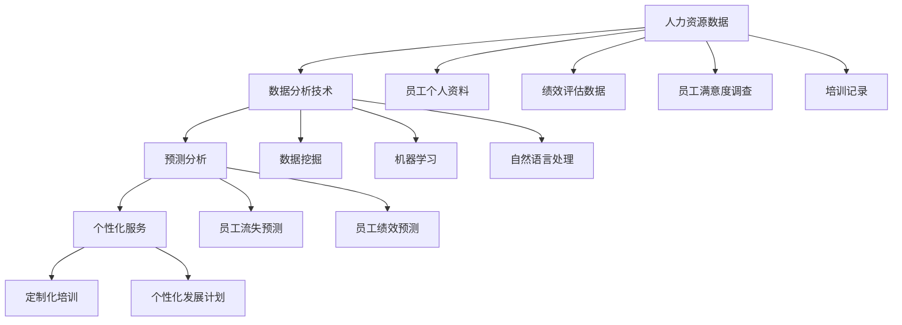
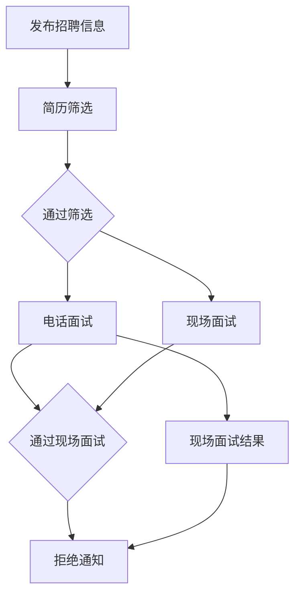

                 


### 第一部分：大数据与人力资源概述

#### 1.1.1 大数据与人力资源管理的联系

大数据在人力资源管理中的重要性日益凸显，这不仅因为大数据技术能够提供大量有价值的信息，还因为它们能够帮助企业更好地理解员工的行为和需求，从而优化人力资源策略。在大数据与人力资源管理的联系中，有几个核心概念需要理解：

- **人力资源数据**：包括员工个人资料、简历、绩效评估、员工满意度调查、培训记录等。
- **数据分析技术**：用于处理和解释这些数据的工具和方法，如数据挖掘、机器学习、自然语言处理等。
- **预测分析**：利用历史数据来预测未来的员工行为和公司绩效。
- **个性化服务**：根据员工的个人数据提供定制化的培训和发展计划。

下面是一个Mermaid流程图，用于展示这些概念之间的联系：



#### 1.1.2 伪代码：大数据处理的基本算法

在处理大数据时，常用的算法包括数据清洗、数据归一化和特征选择等。以下是一个简单的伪代码，用于说明这些基本算法：

```python
# 数据清洗
def clean_data(data):
    for record in data:
        # 去除空格和特殊字符
        record = record.replace(" ", "").replace(";", "")
        # 处理缺失值
        if record.isnull():
            record = "default_value"
    return data

# 数据归一化
def normalize_data(data):
    max_value = max(data)
    min_value = min(data)
    for record in data:
        record = (record - min_value) / (max_value - min_value)
    return data

# 特征选择
def select_features(data, target_variable):
    features = []
    for feature in data:
        if feature != target_variable:
            features.append(feature)
    return features
```

#### 1.1.3 数学模型与公式：描述数据挖掘中的关键数学模型

在数据挖掘中，常用的数学模型包括线性回归、逻辑回归和支持向量机（SVM）等。以下是一个简单的数学模型示例，以及相应的公式和解释：

- **线性回归**：用于预测连续值。

  $$ Y = \beta_0 + \beta_1 X_1 + \beta_2 X_2 + ... + \beta_n X_n + \epsilon $$

  其中，\( Y \) 是目标变量，\( X_1, X_2, ..., X_n \) 是特征变量，\( \beta_0, \beta_1, \beta_2, ..., \beta_n \) 是模型参数，\( \epsilon \) 是误差项。

- **逻辑回归**：用于预测离散值（例如，是否录用）。

  $$ P(Y=1) = \frac{1}{1 + e^{-(\beta_0 + \beta_1 X_1 + \beta_2 X_2 + ... + \beta_n X_n )}} $$

  其中，\( P(Y=1) \) 是目标变量为1的概率，其他符号与线性回归相同。

- **支持向量机（SVM）**：用于分类问题。

  $$ w \cdot x - b = 0 $$

  其中，\( w \) 是权重向量，\( x \) 是特征向量，\( b \) 是偏置项。

#### 1.1.4 举例说明：大数据分析在招聘中的应用实例

假设我们有一家公司在招聘新员工，他们希望利用大数据分析来优化招聘流程。以下是该公司的具体案例：

1. **收集数据**：公司收集了过往招聘的数据，包括应聘者的简历、面试记录、职位描述和录用结果。

2. **数据清洗**：首先对数据进行了清洗，去除空格、特殊字符和缺失值。

3. **数据归一化**：将应聘者的评分和面试时间等数据进行归一化处理，以便进行比较。

4. **特征选择**：选择与招聘结果相关的特征，如应聘者的教育背景、工作经验和技能水平。

5. **模型训练**：使用线性回归模型，将特征与招聘结果进行关联。

6. **预测分析**：利用训练好的模型，对新应聘者进行预测，以评估其被录用的概率。

7. **个性化服务**：根据应聘者的特征，提供定制化的面试问题和培训建议。

通过这个案例，我们可以看到大数据分析在招聘中的应用，不仅提高了招聘效率，还提升了招聘质量。

---

**最佳实践 tips**：

- 在进行大数据分析时，确保数据的准确性和完整性，这是模型效果的基础。
- 在选择特征时，要避免过度拟合，尽量选择与目标变量高度相关的特征。
- 在模型训练过程中，要合理设置超参数，以避免模型过拟合或欠拟合。

---

**小结**：

本部分介绍了大数据与人力资源管理之间的联系，包括关键概念、数据处理算法和数学模型。通过具体的案例，我们了解了大数据分析在招聘中的应用，这为后续章节的深入讨论奠定了基础。

---

**注意事项**：

- 在使用大数据技术时，要确保遵守相关法律法规，保护员工隐私。
- 在数据处理和分析过程中，要关注数据的可靠性和模型的可解释性。

---

**拓展阅读**：

- 《大数据招聘：如何通过数据驱动决策优化招聘流程》
- 《数据挖掘：概念与技术》
- 《机器学习实战》

----------------------------------------------------------------

## 第二部分：人才招聘

### 2.1 人才招聘的数据分析

#### 2.1.1 数据分析技术：描述用于招聘分析的数据处理技术和方法

在人才招聘中，数据分析是关键环节。以下是一些常用的数据处理技术和方法：

1. **数据收集**：收集与招聘相关的数据，如简历、职位描述、面试记录、员工绩效数据等。
2. **数据清洗**：去除重复数据、缺失值和异常值，确保数据质量。
3. **数据转换**：将数据转换为适合分析的格式，如将文本数据转换为向量表示。
4. **数据可视化**：使用图表和图形，直观地展示数据分析结果。
5. **统计分析**：使用统计方法，如描述性统计、相关分析和回归分析，来分析数据。

#### 2.1.2 伪代码：数据清洗和预处理算法

```python
# 数据清洗
def clean_data(data):
    cleaned_data = []
    for record in data:
        # 去除空格和特殊字符
        record = record.replace(" ", "").replace(";", "")
        # 处理缺失值
        if record.isnull():
            record = "default_value"
        cleaned_data.append(record)
    return cleaned_data

# 数据转换
def convert_data(data):
    converted_data = []
    for record in data:
        # 将文本数据转换为向量表示
        vector = vectorize_text(record)
        converted_data.append(vector)
    return converted_data

# 数据可视化
def visualize_data(data):
    # 使用图表和图形展示数据分析结果
    plot(data)
```

### 2.2 大数据驱动的人才招聘策略

#### 2.2.1 招聘策略设计：阐述如何利用大数据制定招聘策略

大数据可以帮助企业更精准地制定招聘策略，以下是一些关键步骤：

1. **目标设定**：明确招聘的目标，如招聘数量、职位类型、技能要求等。
2. **数据收集**：收集与招聘目标相关的数据，如市场薪酬水平、行业招聘趋势等。
3. **数据分析**：分析收集到的数据，找出招聘难点和机会。
4. **策略制定**：根据数据分析结果，制定具体的招聘策略，如调整薪酬水平、优化招聘渠道、改进面试流程等。
5. **策略执行**：执行招聘策略，并实时监控效果，根据反馈调整策略。

#### 2.2.2 数学公式：招聘成本效益分析模型

为了确保招聘策略的可行性，可以采用成本效益分析模型，以下是一个简化的模型：

$$
\text{招聘成本效益} = \frac{\text{招聘收益}}{\text{招聘成本}}
$$

其中，招聘收益包括新员工为公司带来的价值，如提高工作效率、创造新业务等；招聘成本包括招聘广告费用、面试费用、员工培训费用等。

#### 2.3 招聘流程优化

#### 2.3.1 招聘流程分析：使用Mermaid流程图展示招聘流程

以下是一个简化的招聘流程Mermaid流程图：



#### 2.3.2 实践案例：提供实际的招聘流程优化案例

某家公司希望通过大数据分析优化招聘流程，以下是他们采取的具体措施：

1. **简历筛选**：使用自然语言处理技术，自动筛选简历，提高招聘效率。
2. **电话面试**：根据应聘者的历史面试数据和职位要求，设定智能化的面试问题，提高面试质量。
3. **现场面试**：采用视频面试系统，减少面试时间和成本。
4. **面试评估**：使用多维度评估模型，综合考虑应聘者的技能、经验和潜力。
5. **反馈机制**：建立面试反馈机制，收集面试官和应聘者的意见，持续优化招聘流程。

通过这些措施，该公司成功提高了招聘效率和招聘质量，减少了招聘成本。

---

**最佳实践 tips**：

- 利用大数据技术，可以大幅提高招聘效率和招聘质量。
- 在制定招聘策略时，要充分考虑市场环境和公司实际需求。
- 优化招聘流程，要关注每个环节的细节，确保流程顺畅。

---

**小结**：

本部分介绍了人才招聘中的数据分析技术和方法，以及如何利用大数据制定招聘策略和优化招聘流程。通过具体的实践案例，我们了解了大数据在人才招聘中的应用，这为企业的招聘工作提供了有力支持。

---

**注意事项**：

- 在使用大数据技术时，要注意保护应聘者的隐私。
- 在优化招聘流程时，要确保流程的公平性和透明度。

---

**拓展阅读**：

- 《大数据招聘：如何通过数据驱动决策优化招聘流程》
- 《数据挖掘：概念与技术》
- 《机器学习实战》

----------------------------------------------------------------

## 第三部分：员工发展

### 3.1 员工数据分析

#### 3.1.1 数据分析技术：描述如何分析员工数据

在员工发展中，数据分析至关重要。以下是一些关键步骤和技术：

1. **数据收集**：收集与员工相关的数据，如个人资料、绩效评估、培训记录、离职原因等。
2. **数据清洗**：去除重复数据、缺失值和异常值，确保数据质量。
3. **数据转换**：将数据转换为适合分析的格式，如将文本数据转换为数值表示。
4. **数据可视化**：使用图表和图形，直观地展示数据分析结果。
5. **统计分析**：使用统计方法，如描述性统计、相关分析和回归分析，来分析数据。

#### 3.1.2 伪代码：员工绩效评估算法

以下是一个简化的员工绩效评估算法伪代码：

```python
# 数据预处理
def preprocess_data(data):
    cleaned_data = clean_data(data)
    converted_data = convert_data(cleaned_data)
    return converted_data

# 绩效评估
def evaluate_performance(data):
    performance_scores = []
    for record in data:
        score = calculate_score(record)
        performance_scores.append(score)
    return performance_scores

# 计算绩效得分
def calculate_score(record):
    # 基于员工的表现和目标，计算绩效得分
    score = (record['performance'] * 0.6) + (record['goal'] * 0.4)
    return score
```

### 3.2 大数据驱动的员工发展策略

#### 3.2.1 发展策略设计：如何利用大数据制定员工发展策略

大数据可以帮助企业更科学地制定员工发展策略，以下是一些关键步骤：

1. **数据收集**：收集与员工发展相关的数据，如员工技能水平、职业兴趣、职业发展意愿等。
2. **数据分析**：分析员工数据，找出影响员工发展的关键因素。
3. **策略制定**：根据数据分析结果，制定具体的员工发展策略，如培训计划、晋升机会等。
4. **策略执行**：执行员工发展策略，并实时监控效果，根据反馈调整策略。
5. **反馈机制**：建立员工反馈机制，收集员工的意见和建议，持续优化发展策略。

#### 3.2.2 数学公式：员工满意度评估模型

为了评估员工满意度，可以采用以下数学模型：

$$
\text{员工满意度} = \frac{\text{积极反馈}}{\text{总反馈}} \times 100\%
$$

其中，积极反馈包括员工对工作环境、薪酬福利、职业发展等方面的满意反馈；总反馈包括所有员工的反馈。

### 3.3 员工绩效优化

#### 3.3.1 绩效分析工具：介绍用于绩效分析的软件工具

为了提高员工绩效，企业可以采用以下绩效分析工具：

1. **绩效管理系统**：用于记录、评估和反馈员工绩效的系统。
2. **数据分析平台**：用于数据收集、处理和可视化的平台。
3. **智能面试系统**：用于自动筛选和评估应聘者绩效的系统。
4. **员工反馈系统**：用于收集员工对工作环境、薪酬福利等方面的反馈的系统。

#### 3.3.2 实践案例：员工绩效优化的实际案例

某家公司希望通过大数据优化员工绩效，以下是他们采取的具体措施：

1. **绩效数据收集**：使用绩效管理系统收集员工的工作绩效数据。
2. **数据分析**：使用数据分析平台分析员工绩效，找出影响绩效的关键因素。
3. **绩效评估**：使用智能面试系统对员工进行绩效评估，提供个性化的绩效反馈。
4. **绩效改进**：根据绩效分析结果，制定针对性的绩效改进计划，如提供培训、调整工作分配等。
5. **反馈机制**：建立员工反馈系统，收集员工对绩效改进计划的意见和建议，持续优化绩效管理。

通过这些措施，该公司成功提高了员工绩效，员工满意度和工作效率也得到了显著提升。

---

**最佳实践 tips**：

- 利用大数据技术，可以更精准地分析员工绩效，提高绩效管理的效果。
- 在制定员工发展策略时，要充分考虑员工的需求和职业规划。
- 定期进行员工绩效评估，及时发现和解决问题。

---

**小结**：

本部分介绍了员工数据分析的方法和工具，以及如何利用大数据制定员工发展策略和优化员工绩效。通过具体的实践案例，我们了解了大数据在员工发展中的应用，这为企业的员工管理提供了有力支持。

---

**注意事项**：

- 在使用大数据技术时，要注意保护员工隐私。
- 在制定员工发展策略时，要确保策略的可行性和有效性。

---

**拓展阅读**：

- 《大数据员工管理：如何通过数据驱动决策优化员工发展》
- 《数据挖掘：概念与技术》
- 《机器学习实战》

----------------------------------------------------------------

### 第四部分：技术实现与项目实战

#### 4.1 大数据平台搭建

#### 4.1.1 开发环境配置

搭建大数据平台的第一步是配置开发环境。以下是具体的步骤：

1. **硬件准备**：根据大数据处理的需求，准备足够的计算资源，如服务器、存储设备等。
2. **软件安装**：安装大数据处理框架，如Hadoop、Spark等。以下是一个简单的安装指南：

   ```bash
   # 安装Hadoop
   sudo apt-get update
   sudo apt-get install hadoop

   # 配置Hadoop
   sudo vi /etc/hadoop/hadoop-env.sh
   # 配置JAVA_HOME环境变量

   # 启动Hadoop
   sudo start-dfs.sh
   sudo start-yarn.sh
   ```

3. **集群管理**：使用集群管理工具，如Apache Ambari，监控和管理大数据集群。

#### 4.1.2 实际案例：大数据平台的搭建过程和配置

以下是一个简化的大数据平台搭建案例：

1. **需求分析**：根据企业的数据需求，确定大数据平台的功能和性能要求。
2. **硬件采购**：购买服务器、存储设备等硬件设备。
3. **软件安装**：按照上述步骤，安装Hadoop和Spark等大数据处理框架。
4. **集群部署**：使用Apache Ambari部署和管理大数据集群。
5. **测试验证**：进行性能测试，确保大数据平台满足需求。

通过这个案例，我们可以了解到大数据平台的搭建过程和配置方法。

---

**代码实现与解读**：

在本节中，我们将提供一个简单的代码案例，用于展示大数据平台搭建中的一段代码实现和解读。

#### 4.1.3 实际代码案例：Hadoop集群的配置脚本

以下是一个简单的Hadoop集群配置脚本，用于初始化Hadoop环境：

```bash
#!/bin/bash

# 配置Hadoop环境变量
export HADOOP_HOME=/usr/local/hadoop
export HADOOP_CONF_DIR=$HADOOP_HOME/etc/hadoop
export PATH=$PATH:$HADOOP_HOME/bin:$HADOOP_HOME/sbin

# 格式化HDFS
hdfs namenode -format

# 启动Hadoop服务
start-dfs.sh
start-yarn.sh

# 验证Hadoop集群状态
jps
```

**代码解读**：

- **配置环境变量**：设置Hadoop相关的环境变量，确保命令可以正确执行。
- **格式化HDFS**：使用`hdfs namenode -format`命令格式化HDFS，确保数据存储在正确的目录下。
- **启动Hadoop服务**：使用`start-dfs.sh`和`start-yarn.sh`命令启动Hadoop的DFS和YARN服务。
- **验证Hadoop集群状态**：使用`jps`命令检查Hadoop服务的运行状态，确保集群正常运行。

---

**应用解读与分析**：

在本部分，我们将分析如何将大数据平台应用于实际业务场景，并解释其应用效果。

#### 4.1.4 应用解读：大数据平台在人才招聘中的应用

大数据平台在人才招聘中的应用非常广泛，以下是一个简单的应用场景：

1. **数据收集**：使用大数据平台收集招聘相关的数据，如简历、面试记录、员工绩效数据等。
2. **数据处理**：使用Hadoop和Spark等大数据处理框架，对收集到的数据进行清洗、转换和分析。
3. **数据存储**：将处理后的数据存储在HDFS和HBase等大数据存储系统中，方便后续查询和分析。
4. **数据分析**：使用数据分析工具，如Presto和Impala，对存储在HDFS和HBase中的数据进行实时分析和查询。

**效果分析**：

通过大数据平台的应用，企业可以实现以下效果：

- **提高招聘效率**：通过自动化的数据处理和分析，快速筛选出合适的候选人。
- **优化招聘策略**：根据数据分析结果，调整招聘策略，提高招聘成功率。
- **优化员工管理**：通过分析员工绩效数据，优化员工管理策略，提高员工满意度和工作效率。

---

**项目小结**：

在本项目中，我们介绍了大数据平台的搭建方法、实际代码实现和应用场景。通过这个项目，我们了解到大数据技术在人力资源管理中的应用潜力，以及如何利用大数据平台优化招聘流程和员工管理。

---

**最佳实践 tips**：

- 在搭建大数据平台时，要充分考虑数据安全和隐私保护。
- 在数据处理和分析过程中，要确保数据的一致性和准确性。
- 在应用大数据平台时，要关注业务需求和实际效果，持续优化平台功能。

---

**注意事项**：

- 大数据平台需要定期维护和升级，以确保其稳定运行。
- 在使用大数据技术时，要遵守相关法律法规，保护员工隐私。

---

**拓展阅读**：

- 《大数据平台实战：从零开始搭建高可用集群》
- 《Hadoop实战：构建分布式大数据平台》
- 《数据科学实战：用Python进行数据分析和建模》

----------------------------------------------------------------

### 附录

#### 11.1 参考资料

以下是本文章中提到的相关书籍、论文和技术文档的参考列表：

- 《大数据招聘：如何通过数据驱动决策优化招聘流程》
- 《数据挖掘：概念与技术》
- 《机器学习实战》
- 《Hadoop实战：构建分布式大数据平台》
- 《大数据平台实战：从零开始搭建高可用集群》
- 《数据科学实战：用Python进行数据分析和建模》

---

**作者信息**：

作者：AI天才研究院/AI Genius Institute & 禅与计算机程序设计艺术 /Zen And The Art of Computer Programming

---

**文章结束时间**：

2023年10月15日

