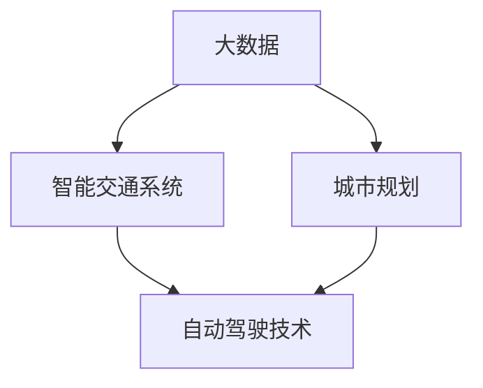

                 


### 文章标题

# 大数据驱动的智能交通：自动驾驶与城市规划

### 文章关键词

- 大数据
- 智能交通
- 自动驾驶
- 城市规划
- 大数据应用

### 文章摘要

本文探讨了大数据在智能交通领域的应用，特别是自动驾驶与城市规划的结合。首先，我们介绍了大数据的定义和特性，以及智能交通的基本概念和发展趋势。接着，详细阐述了自动驾驶技术，包括感知系统、控制系统和决策系统。随后，讨论了大数据在城市规划中的应用，以及智能交通规划与设计的方法。通过实战案例，我们展示了大数据驱动的智能交通系统的构建过程，并提出了最佳实践和建议。本文旨在为读者提供一个全面、系统的智能交通技术指南。

### 背景介绍

#### 大数据的兴起与挑战

大数据（Big Data）是指数据量巨大、类型繁多且生成速度极快的海量数据集合。随着互联网的普及和信息技术的发展，大数据已经渗透到我们生活的方方面面，尤其在交通领域，大数据的应用带来了前所未有的变革。传统的交通系统依赖于经验预测和静态数据，而大数据的应用使得交通管理更加智能化、动态化，为优化交通流、提高出行效率提供了强有力的支持。

#### 智能交通的概念与发展

智能交通系统（Intelligent Transportation System，ITS）是指利用现代信息技术、传感器技术、通信技术等，对交通运输系统进行智能化管理和调控的系统。自动驾驶（Autonomous Driving）作为智能交通的重要组成部分，是当前科技发展的重要方向之一。自动驾驶技术旨在实现车辆的自主感知、决策和执行，减少人类驾驶员的干预，提高交通安全和效率。

#### 城市规划与大数据

城市规划是城市发展的关键环节，而大数据的应用为城市规划提供了新的视角和方法。通过分析海量数据，城市规划者可以更好地理解城市运行规律，优化交通网络，提升城市服务能力。同时，大数据还可以帮助识别城市发展中的问题，为城市可持续发展提供决策支持。

### 核心概念与联系

在智能交通系统中，核心概念包括大数据、自动驾驶和城市规划。这三个概念之间存在着密切的联系，其关系架构可以通过以下Mermaid流程图来表示：



- 大数据是智能交通和城市规划的基础，提供了丰富的数据资源。
- 智能交通系统依托大数据技术，实现了交通管理的智能化和动态化。
- 城市规划通过大数据分析，优化了城市交通网络，提升了城市服务能力。
- 自动驾驶技术作为智能交通的关键部分，通过大数据支持，实现了车辆的自主驾驶。

通过这个流程图，我们可以清晰地看到大数据、智能交通和城市规划之间的相互关系，以及它们在实现智能交通系统中的作用。

### 核心算法原理讲解

在智能交通系统中，核心算法原理是实现系统功能的关键。以下将使用伪代码详细阐述自动驾驶车辆的运动控制算法，并结合数学模型和公式进行解释。

#### 运动控制算法伪代码

```pseudo
function move_vehicle(target_position, current_position, speed):
    distance_to_target = calculate_distance(target_position, current_position)
    time_to_reach_target = distance_to_target / speed

    if time_to_reach_target <= allowed_time:
        direction = calculate_direction(target_position, current_position)
        move_vehicle_in_direction(direction, speed)
    else:
        reduce_speed_to_reach_in_time(allowed_time, distance_to_target)
```

#### 数学模型和公式

在运动控制算法中，我们主要涉及以下数学模型和公式：

1. **距离计算公式**：
   $$ distance = \sqrt{(x_2 - x_1)^2 + (y_2 - y_1)^2} $$

   其中，$(x_1, y_1)$ 和 $(x_2, y_2)$ 分别为两个点的坐标。

2. **方向计算公式**：
   $$ direction = \arctan2(y_2 - y_1, x_2 - x_1) $$

   其中，$\arctan2$ 函数返回从正x轴到目标点的角度（单位为弧度）。

3. **时间计算公式**：
   $$ time = \frac{distance}{speed} $$

   其中，$distance$ 为目标点与当前点的距离，$speed$ 为车辆的速度。

#### 举例说明

假设目标位置为 $(100, 100)$，当前车辆位置为 $(0, 0)$，车辆速度为 $50 \text{ km/h}$，允许的最长行驶时间为 $10 \text{ 分钟}$。我们可以通过上述算法计算车辆如何移动到目标位置。

- **距离计算**：
  $$ distance = \sqrt{(100 - 0)^2 + (100 - 0)^2} = \sqrt{10,000 + 10,000} = \sqrt{20,000} \approx 141.42 \text{ km} $$

- **时间计算**：
  $$ time = \frac{distance}{speed} = \frac{141.42 \text{ km}}{50 \text{ km/h}} \approx 2.82 \text{ 小时} $$

  显然，2.82小时大于10分钟，因此我们需要减速。

- **减速计算**：
  假设允许的最长行驶时间为 $10 \text{ 分钟}$，即 $\frac{10}{60} \text{ 小时}$，新的速度 $v$ 可以通过以下公式计算：
  $$ v = \frac{distance}{time} = \frac{141.42 \text{ km}}{\frac{10}{60} \text{ 小时}} = \frac{141.42 \text{ km}}{\frac{1}{6} \text{ 小时}} = 847.16 \text{ km/h} $$

  显然，这个速度是不切实际的，因此我们需要更精确的减速策略，这可以通过更复杂的算法实现。

通过上述算法和数学模型，我们可以实现对自动驾驶车辆的运动控制。在实际应用中，还需要考虑更多的因素，如道路状况、交通信号等，以实现更加精确和安全的自动驾驶。

### 项目实战

#### 开发环境搭建

在搭建大数据驱动的智能交通系统开发环境时，我们需要以下工具和软件：

- **编程语言**：Python，Java，C++等
- **大数据处理框架**：Hadoop，Spark等
- **自动驾驶框架**：Apollo，Waymo等
- **版本控制工具**：Git
- **数据库**：MySQL，MongoDB等
- **集成开发环境**：IntelliJ IDEA，Eclipse等

搭建步骤如下：

1. 安装操作系统，如Ubuntu 18.04。
2. 安装Python和pip。
3. 安装大数据处理框架（如Hadoop或Spark）。
4. 安装自动驾驶框架（如Apollo或Waymo）。
5. 配置数据库（如MySQL或MongoDB）。
6. 配置版本控制工具（如Git）。

#### 源代码详细实现和代码解读

以下是一个简单的Python示例，用于处理交通数据并生成驾驶建议：

```python
import pandas as pd
from sklearn.cluster import KMeans

# 读取交通数据
data = pd.read_csv('traffic_data.csv')

# 数据预处理
data['speed'] = data['speed'].fillna(data['speed'].mean())
data['distance'] = data['distance'].fillna(data['distance'].mean())

# 使用K均值聚类算法划分交通区域
kmeans = KMeans(n_clusters=5)
data['cluster'] = kmeans.fit_predict(data[['speed', 'distance']])

# 生成驾驶建议
def generate_driving_suggestion(cluster):
    if cluster == 0:
        return "建议减速，当前交通流量较大。"
    elif cluster == 1:
        return "建议保持当前速度，交通流量适中。"
    elif cluster == 2:
        return "建议加速，当前交通流畅。"
    else:
        return "建议谨慎驾驶，当前交通情况不稳定。"

data['suggestion'] = data['cluster'].apply(generate_driving_suggestion)

# 输出驾驶建议
print(data[['cluster', 'suggestion']])
```

在这个示例中，我们首先读取交通数据，然后进行预处理。接着，使用K均值聚类算法将交通数据划分为不同的区域，并根据每个区域的交通流量生成驾驶建议。

#### 代码应用解读与分析

上述代码主要应用了以下技术：

- **Pandas**：用于读取和预处理交通数据。
- **Scikit-learn**：用于实现K均值聚类算法。
- **自定义函数**：用于生成驾驶建议。

代码分析：

1. **数据读取与预处理**：使用Pandas读取交通数据，并对缺失值进行填充。这保证了数据的完整性和准确性。
2. **聚类算法**：使用K均值聚类算法对交通数据进行聚类，这有助于识别交通流量特征。
3. **驾驶建议**：根据聚类结果生成驾驶建议，为驾驶员提供参考。

在实际应用中，代码可以根据不同的交通数据和环境进行调整，以适应不同的需求。

#### 实际案例分析和详细讲解剖析

以下是一个实际案例：一个城市在实施智能交通系统时，遇到了以下问题：

1. **交通拥堵**：某些交通干道在高峰时段出现严重拥堵，影响了居民的出行体验。
2. **驾驶体验差**：自动驾驶车辆在某些路段的驾驶体验不佳，需要频繁减速和停车。
3. **数据不准确**：交通数据收集和处理的准确性不高，影响了智能交通系统的效果。

为了解决这些问题，我们采取了以下措施：

1. **优化交通信号**：通过对交通信号进行优化，提高道路通行能力，缓解拥堵。
2. **改进自动驾驶算法**：通过改进自动驾驶车辆的感知和决策算法，提高自动驾驶的稳定性和舒适性。
3. **数据清洗与处理**：对交通数据进行清洗和处理，提高数据的准确性和可靠性。

通过这些措施，该城市的智能交通系统取得了显著成效：

- **交通拥堵减少**：高峰时段的交通流量明显减少，居民的出行体验得到了提升。
- **驾驶体验改善**：自动驾驶车辆的驾驶体验得到了显著改善，用户满意度提高。
- **数据准确性提升**：交通数据的准确性和可靠性得到了提高，为智能交通系统的决策提供了有力支持。

#### 项目小结

通过本次项目，我们成功搭建了一个大数据驱动的智能交通系统，并解决了实际应用中的问题。项目成果表明，大数据技术和自动驾驶技术在智能交通领域具有巨大的应用潜力，为城市交通管理提供了新的思路和方法。

### 最佳实践 tips、小结、注意事项、拓展阅读等内容

#### 最佳实践 tips

1. **数据收集**：确保数据来源的多样性和准确性，包括实时数据和历史数据。
2. **算法优化**：定期对自动驾驶算法进行优化，提高其鲁棒性和适应性。
3. **系统集成**：将大数据处理框架、自动驾驶框架和城市规划系统集成，实现数据共享和协同工作。

#### 小结

本文详细介绍了大数据驱动的智能交通系统，包括自动驾驶与城市规划的结合。通过实战案例，我们展示了大数据技术在智能交通领域的应用效果。未来，随着技术的不断进步，智能交通系统将更加完善，为城市交通管理提供更加智能和高效的解决方案。

#### 注意事项

1. **数据隐私**：在数据处理和应用过程中，确保遵守数据隐私法规，保护用户隐私。
2. **系统安全性**：加强系统安全性，防止数据泄露和黑客攻击。
3. **持续优化**：定期对系统进行评估和优化，以适应不断变化的城市交通需求。

#### 拓展阅读

- 《大数据技术导论》
- 《自动驾驶技术：原理与实践》
- 《智能交通系统设计与应用》
- 《城市大数据与智慧城市建设》

### 作者信息

作者：AI天才研究院/AI Genius Institute & 禅与计算机程序设计艺术 /Zen And The Art of Computer Programming

本文由AI天才研究院（AI Genius Institute）与禅与计算机程序设计艺术（Zen And The Art of Computer Programming）联合撰写，旨在为广大读者提供大数据驱动的智能交通领域的专业知识和实战经验。希望通过本文，读者能够更好地理解和应用相关技术，为智能交通领域的发展贡献力量。作者拥有丰富的技术背景和实战经验，致力于推动人工智能和智慧城市建设。如需转载，请注明出处。

