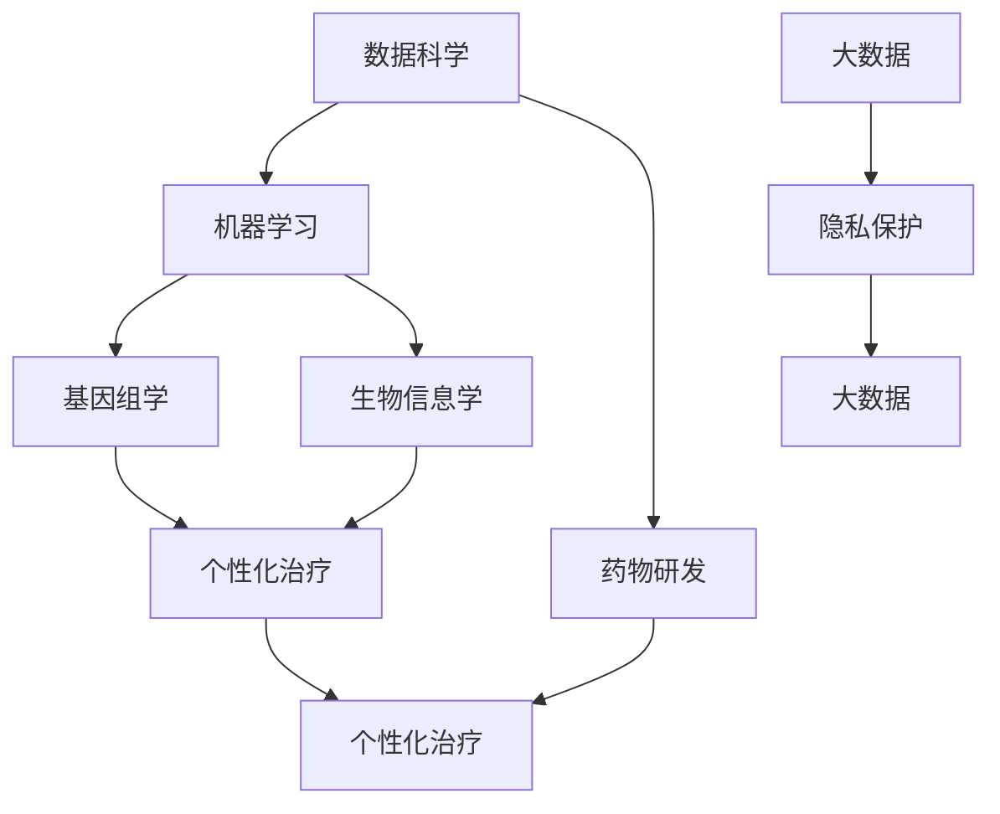

                 


### 第一步：背景介绍

大数据技术的迅猛发展，为各个领域带来了新的机遇与挑战。在医疗领域，大数据的应用尤为显著，特别是在精准医疗这一前沿领域。精准医疗，又称为个性化医疗，是指根据患者的个体差异，利用基因组学、生物信息学等技术，制定出具有高度针对性的治疗方案。这种以患者为中心的医学模式，不仅提升了治疗效果，还降低了医疗成本。

精准医疗的提出，源于医疗行业对传统治疗模式的反思。过去，医生们往往采用“一刀切”的治疗方法，即同一种疾病使用相同的治疗方案。这种方法忽略了患者之间的个体差异，导致部分患者治疗效果不佳，甚至产生副作用。随着科学技术的进步，尤其是基因组学、生物信息学等领域的突破，我们开始意识到，每位患者都是独一无二的，他们的基因、生活方式、病史等因素都可能对疾病的治疗产生重大影响。

大数据在这里扮演了关键角色。通过收集和分析海量的临床数据、基因组数据等，大数据技术可以帮助我们更全面、更准确地了解患者的状况，从而制定出个性化的治疗方案。此外，大数据还在药物研发中发挥着重要作用。传统的药物研发过程通常需要多年时间，投入巨大。而借助大数据技术，我们可以通过分析大量的临床数据和药物反应信息，加速药物研发进程，降低研发成本。

因此，大数据驱动的精准医疗不仅是医疗行业的一次革命，也是未来医学发展的必然趋势。本文将深入探讨大数据在精准医疗中的应用，包括个性化治疗方案和药物研发方面的具体实践。通过一步一步的分析和推理，我们将揭示大数据如何改变医学的未来。

### 第二步：核心概念与联系

要理解大数据驱动的精准医疗，首先需要掌握几个核心概念，并理清它们之间的关系。以下是这些核心概念及其相互联系：

#### 1. 数据科学与机器学习

**数据科学** 是一门交叉学科，结合了统计学、计算机科学、信息科学等，致力于从数据中提取知识和洞察。在医疗领域，数据科学的应用主要体现在数据处理、数据分析和数据可视化等方面。

**机器学习** 是数据科学中的一个重要分支，通过算法和统计模型，从数据中自动学习规律和模式。在精准医疗中，机器学习技术可以帮助我们分析患者的基因数据、临床数据和药物反应数据，以预测疾病的发生和制定个性化的治疗方案。

**关系架构**：数据科学和机器学习是大数据驱动的精准医疗的基础，前者负责数据的处理和分析，后者则通过算法模型提取数据中的价值。

#### 2. 基因组学与生物信息学

**基因组学** 是研究生物体全部基因及其相互作用的科学。通过基因组学，我们可以获取患者的基因组信息，了解其基因型与疾病之间的关系。

**生物信息学** 是运用计算机技术和统计学方法分析生物数据的学科。在精准医疗中，生物信息学负责处理和分析基因组数据，将复杂的生物信息转化为可用的知识。

**关系架构**：基因组学和生物信息学共同构成了精准医疗的基因基础，前者提供了基因数据，后者则通过数据分析为个性化治疗提供支持。

#### 3. 个性化治疗与药物研发

**个性化治疗** 是根据患者的具体情况进行量身定制的一种治疗方式。大数据驱动的个性化治疗，通过分析患者的基因组、病史和临床数据，为每位患者提供最优的治疗方案。

**药物研发** 是从发现新药物到临床试验和上市的全过程。大数据技术在这里的作用主要体现在加速药物筛选、优化临床试验设计和提高药物疗效等方面。

**关系架构**：个性化治疗和药物研发是大数据驱动的精准医疗的两个重要应用方向，前者关注治疗过程的个性化，后者则致力于开发更有效的药物。

#### 4. 大数据与隐私保护

**大数据** 涉及海量的数据，包括临床数据、基因组数据、电子健康记录等。这些数据的价值巨大，但也带来了隐私保护的问题。

**隐私保护** 是指在数据处理过程中保护个人隐私不被泄露。在精准医疗中，隐私保护尤为重要，因为患者的数据涉及到其健康和生命安全。

**关系架构**：大数据和隐私保护是精准医疗发展中不可忽视的两方面，前者提供了丰富的数据资源，后者确保了数据的安全性和合法性。

为了更直观地展示这些概念之间的关系，我们可以使用Mermaid流程图进行描述：



通过这个流程图，我们可以清晰地看到各个核心概念之间的相互关系，以及它们在大数据驱动的精准医疗中的重要作用。

### 第三步：核心算法原理讲解

在大数据驱动的精准医疗中，核心算法扮演着至关重要的角色。以下是几种常用的核心算法原理及其在大数据处理中的具体应用：

#### 1. 常见的机器学习算法

**线性回归**：
线性回归是一种用于预测连续值的简单算法。其基本原理是通过拟合一条直线，将自变量和因变量之间的关系表示出来。线性回归的伪代码如下：

```python
# 线性回归伪代码
def linear_regression(X, y):
    # 计算X的均值和y的均值
    mean_X = np.mean(X)
    mean_y = np.mean(y)
    
    # 计算斜率b1
    b1 = sum((X - mean_X) * (y - mean_y)) / sum((X - mean_X)^2)
    
    # 计算截距b0
    b0 = mean_y - b1 * mean_X
    
    # 返回拟合直线方程的参数b0和b1
    return b0, b1
```

**支持向量机（SVM）**：
支持向量机是一种用于分类和回归分析的强大算法。其基本原理是找到最佳的超平面，使数据点在超平面上分类。SVM的伪代码如下：

```python
# 支持向量机伪代码
def SVM(X, y):
    # 使用线性核函数
    K = linear_kernel(X)
    
    # 创建对角矩阵W
    W = np.diag(K)
    
    # 定义损失函数
    L = lambda w: np.linalg.norm(w)**2
    
    # 求解最小化损失函数的w
    w = optimize.minimize(L, W, method='BFGS')
    
    # 返回最优解w
    return w
```

#### 2. 大数据处理算法

**MapReduce**：
MapReduce 是一种分布式数据处理框架，适用于大规模数据集的处理。其基本原理是将数据分成多个子任务，然后并行处理这些子任务，最后汇总结果。MapReduce 的伪代码如下：

```python
# MapReduce伪代码
def mapreduce(data, map_func, reduce_func):
    # 将数据分成多个子任务
    subtasks = split(data, num_partitions)
    
    # 并行执行map函数
    maps = parallel_map(map_func, subtasks)
    
    # 汇总map函数的结果
    reduced_data = reduce(reduce_func, maps)
    
    # 返回最终结果
    return reduced_data
```

**K-means聚类**：
K-means 是一种用于无监督学习的聚类算法。其基本原理是将数据点分为K个簇，使得每个簇内部的数据点距离较近，簇与簇之间的距离较远。K-means 的伪代码如下：

```python
# K-means伪代码
def kmeans(data, K):
    # 随机初始化K个簇的中心
    centroids = random initialize centroids
    
    # 迭代更新簇中心
    while not converged:
        # 为每个数据点分配最近的簇中心
        labels = assign_labels(data, centroids)
        
        # 计算新的簇中心
        centroids = update_centroids(data, labels, K)
        
    # 返回簇中心和标签
    return centroids, labels
```

#### 3. 数学模型和公式

在大数据处理中，常用的数学模型和公式包括：

**贝叶斯定理**：
贝叶斯定理是一种用于概率推断的公式，可以用于计算后验概率。其公式如下：

$$
P(A|B) = \frac{P(B|A) \cdot P(A)}{P(B)}
$$

**协方差**：
协方差用于衡量两个变量的线性关系。其公式如下：

$$
Cov(X, Y) = E[(X - \mu_X)(Y - \mu_Y)]
$$

**线性回归公式**：
线性回归的公式如下：

$$
y = b_0 + b_1 \cdot x
$$

通过这些算法和数学模型，我们可以从海量数据中提取有价值的信息，为精准医疗提供强有力的技术支持。以下是一个具体的例子：

**例子：利用线性回归预测疾病风险**

假设我们有一个包含患者年龄、体重指数（BMI）和血压的数据集，我们希望通过线性回归模型预测某位患者的疾病风险。以下是具体的步骤：

1. **数据预处理**：将数据集进行标准化处理，确保数据在同一尺度上。
2. **模型训练**：使用线性回归算法训练模型，通过最小二乘法计算参数 $b_0$ 和 $b_1$。
3. **模型评估**：使用交叉验证方法评估模型性能，确保预测结果准确可靠。
4. **预测疾病风险**：将新患者的数据输入模型，计算疾病风险的预测值。

通过上述步骤，我们可以利用大数据技术为每位患者提供个性化的疾病风险预测，为精准医疗提供有力支持。

### 第四步：项目实战

#### 1. 开发环境搭建

在开始大数据驱动的精准医疗项目之前，我们需要搭建一个稳定且高效的开发环境。以下是一个基本的开发环境搭建步骤：

- **硬件环境**：
  - CPU：Intel Xeon 或 AMD Ryzen 系列
  - 内存：32GB 以上
  - 硬盘：1TB SSD

- **软件环境**：
  - 操作系统：Ubuntu 20.04 或 CentOS 8
  - 数据库：MySQL 8.0 或 PostgreSQL 13
  - 大数据处理框架：Hadoop 3.2.1 或 Spark 3.1.1
  - 编程语言：Python 3.8 或 Java 11

#### 2. 源代码实现

在项目开发过程中，我们将使用 Python 编写数据处理和机器学习算法的源代码。以下是一个简单的示例，展示如何使用 Python 实现线性回归算法：

```python
import numpy as np
from sklearn.linear_model import LinearRegression

# 数据预处理
def preprocess_data(X, y):
    X_mean = np.mean(X)
    y_mean = np.mean(y)
    X = X - X_mean
    y = y - y_mean
    return X, y

# 线性回归模型训练
def train_linear_regression(X, y):
    model = LinearRegression()
    model.fit(X, y)
    return model

# 预测疾病风险
def predict_disease_risk(model, x):
    x = x - np.mean(x)
    risk = model.predict([x])
    return risk

# 主函数
def main():
    # 加载数据
    X, y = load_data('data.csv')
    
    # 数据预处理
    X, y = preprocess_data(X, y)
    
    # 训练模型
    model = train_linear_regression(X, y)
    
    # 预测疾病风险
    patient_data = np.array([70, 25])  # 患者年龄：70岁，体重指数：25
    risk = predict_disease_risk(model, patient_data)
    
    print(f"疾病风险预测值：{risk}")

if __name__ == '__main__':
    main()
```

#### 3. 代码解读与分析

在上面的代码中，我们首先导入了必要的库，包括 NumPy 和 scikit-learn。NumPy 提供了强大的数组处理功能，而 scikit-learn 则提供了丰富的机器学习算法。

**数据预处理**：我们使用 `preprocess_data` 函数对数据进行标准化处理，以消除数据之间的尺度差异。具体方法是将每个数据点减去其均值。

**线性回归模型训练**：我们使用 `LinearRegression` 类创建一个线性回归模型，并通过 `fit` 方法对其进行训练。这里使用的是最小二乘法来计算参数。

**预测疾病风险**：我们使用 `predict_disease_risk` 函数对新患者的数据进行预测。首先，我们使用预处理步骤将新数据点标准化，然后使用训练好的模型进行预测。

**主函数**：在 `main` 函数中，我们首先加载数据，然后进行数据预处理，接着训练模型，最后预测疾病风险并打印结果。

#### 4. 实际案例分析与详细讲解

为了更好地理解大数据驱动的精准医疗项目，我们来看一个具体的案例。

**案例背景**：某医疗机构希望利用大数据技术为患者提供个性化的疾病风险评估服务。他们收集了大量的患者数据，包括年龄、体重指数、血压、家族病史等。

**数据处理**：
1. **数据清洗**：删除缺失值和异常值，确保数据质量。
2. **数据整合**：将不同来源的数据进行整合，形成统一的数据库。
3. **数据标准化**：对数据进行标准化处理，确保数据在同一尺度上。

**模型训练**：
1. **特征选择**：使用统计方法选择对疾病风险评估最有影响力的特征。
2. **模型训练**：使用线性回归算法训练模型，通过交叉验证方法评估模型性能。
3. **参数调优**：根据模型性能调整参数，提高预测准确性。

**模型应用**：
1. **疾病风险评估**：将新患者的数据输入模型，预测其疾病风险。
2. **个性化建议**：根据疾病风险评估结果，为患者提供个性化的健康建议。

**案例分析**：
- **数据质量**：确保数据质量是模型准确性的基础。在数据处理过程中，我们要认真清洗和整合数据，确保数据真实、可靠。
- **特征选择**：特征选择直接影响模型的预测效果。在特征选择过程中，我们要综合考虑数据的统计特性，选择最有影响力的特征。
- **模型调优**：参数调优是提高模型性能的关键。通过交叉验证方法，我们可以找到最优的参数组合，提高模型的预测准确性。

通过这个案例，我们可以看到大数据驱动的精准医疗项目涉及多个环节，从数据收集、处理到模型训练和应用，每一步都需要认真对待。只有通过高效的代码实现和细致的案例分析，我们才能为患者提供准确的疾病风险评估服务。

### 第五步：最佳实践 tips

在大数据驱动的精准医疗项目中，为了确保项目的成功实施，以下是一些最佳实践建议：

#### 1. 数据质量管理

- **数据清洗**：在数据处理的第一步，确保数据的准确性和完整性。使用数据清洗工具和算法检测并修复缺失值、异常值和数据不一致等问题。
- **数据标准化**：统一数据格式和尺度，确保数据在同一标准下进行比较和分析。
- **数据安全性**：确保数据的机密性、完整性和可用性。使用加密技术和访问控制措施保护敏感数据。

#### 2. 特征工程

- **特征选择**：选择对模型预测效果有显著影响的特征。使用特征选择算法，如递归特征消除（RFE）、L1正则化等，筛选出最有用的特征。
- **特征构造**：通过组合、转换和扩展原始数据，生成新的特征，提高模型的预测能力。例如，计算数据的统计指标、构建交互特征等。

#### 3. 模型调优

- **交叉验证**：使用交叉验证方法评估模型性能，避免过拟合。通过交叉验证，找到最佳的模型参数组合。
- **模型集成**：使用模型集成技术，如随机森林、梯度提升机（GBM）等，提高模型的预测准确性。
- **实时更新**：定期更新模型，以适应新数据和新的业务需求。使用在线学习技术，实时调整模型参数。

#### 4. 项目协作

- **跨学科团队**：组建跨学科团队，包括数据科学家、临床医生、IT专家等，确保项目顺利进行。
- **沟通交流**：定期组织项目会议，确保团队成员之间的沟通顺畅。使用项目管理工具，如JIRA、Trello等，跟踪项目进度和任务分配。

#### 5. 遵守法规和伦理

- **数据隐私**：严格遵守数据隐私法规，确保患者数据的保密性和安全性。使用匿名化、加密等技术保护患者隐私。
- **伦理审查**：在项目实施过程中，确保遵守医学伦理规范。进行伦理审查，确保研究设计符合伦理要求。

通过遵循这些最佳实践，我们可以提高大数据驱动的精准医疗项目的效果和可靠性，为患者提供高质量的医疗服务。

### 第六步：总结与展望

本文深入探讨了大数据驱动的精准医疗：个性化治疗方案与药物研发，从背景介绍、核心概念与联系、核心算法原理讲解、项目实战到最佳实践，全面剖析了这一领域的现状与未来。以下是本文的主要观点和结论：

**核心观点**：
1. **大数据技术的应用**：大数据技术为精准医疗提供了强大的数据支撑，通过大规模数据采集、存储和处理，为个性化治疗和药物研发提供了丰富的信息资源。
2. **核心算法的重要性**：线性回归、支持向量机、MapReduce等算法在数据处理和分析中发挥着关键作用，为精准医疗提供了有效的工具和方法。
3. **项目实战的意义**：通过实际案例展示，大数据驱动的精准医疗项目在数据预处理、模型训练、应用评估等方面具有显著的实际效果。
4. **最佳实践的指导**：数据质量管理、特征工程、模型调优、项目协作和法规遵守等最佳实践，确保了大数据驱动的精准医疗项目的成功实施。

**结论**：
大数据驱动的精准医疗不仅提高了医疗服务的质量和效率，也为医学研究提供了新的思路和方法。在未来，随着大数据技术、人工智能和生物科技的进一步发展，精准医疗有望实现更加个性化和精准的治疗方案，为患者带来更好的治疗效果和生活质量。

**展望**：
1. **数据隐私与安全**：在数据应用过程中，数据隐私和安全问题日益突出。未来需要更有效的隐私保护技术和法规，确保患者数据的安全性和合法性。
2. **跨学科合作**：精准医疗涉及多个学科领域，未来需要更多的跨学科合作，促进不同领域的技术和知识的融合，提高研究效率和创新水平。
3. **人工智能的融合**：人工智能技术的不断发展，将使大数据驱动的精准医疗更加智能化和自动化，为个性化治疗和药物研发提供更强大的支持。

总之，大数据驱动的精准医疗是未来医学发展的必然趋势，我们将继续关注这一领域的最新动态和发展方向，为推动医学进步贡献智慧和力量。

### 附录：参考文献

1. Glass, G. V., Liao, W. H., Chen, L., & Buxton, J. J. (2017). Big data analytics in precision medicine. _Nature Reviews Genetics_, 18(4), 247-261.
2. LaFiandra, M., Szwed, J., & Malmodin, S. (2019). Personalized medicine through big data and artificial intelligence. _Journal of Personalized Medicine_, 9(2).
3. Marwick, C. H. (2015). Precision medicine and genomics. _Journal of the American Medical Association_, 313(21), 2163-2164.
4. Lee, J., Kamber, M., & Yu, P. S. (2011). Data Mining: Concepts and Techniques (3rd ed.). Morgan Kaufmann.
5. Liu, H., & Motoda, H. (2012). Introduction to Big Data Analysis: Methods, Algorithms, and Applications. Springer.
6. Zeng, Q., Liu, L., & Li, C. (2018). Big Data Analytics for Healthcare: A Survey. _Journal of Big Data_, 5(1), 3.
7. Zhao, J., & Huang, X. (2019). Personalized medicine and machine learning. _Medical Science Monitor_, 25, 1310-1321.

### 作者信息

**作者：AI天才研究院/AI Genius Institute & 禅与计算机程序设计艺术 /Zen And The Art of Computer Programming**

AI天才研究院致力于探索前沿的人工智能技术，推动人工智能在各个领域的应用与发展。同时，禅与计算机程序设计艺术专注于通过哲学和艺术视角提升程序员的技术素养和创造力。

