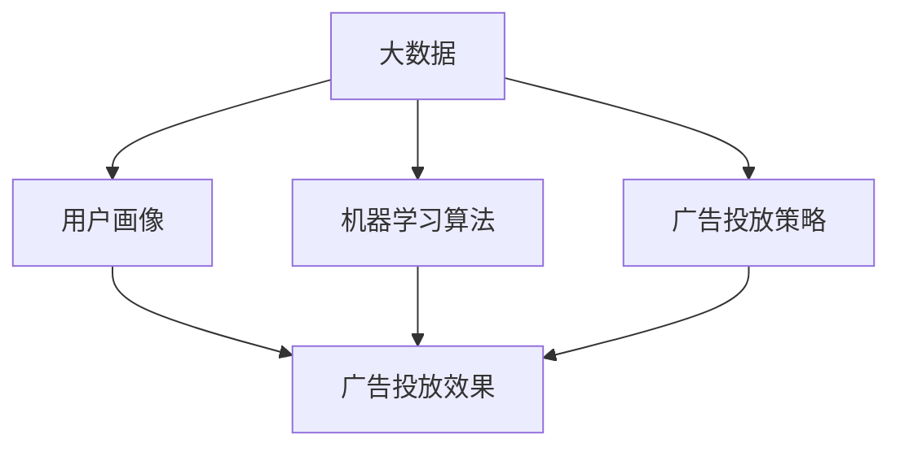

                 

### 文章标题

《大数据驱动的精准广告：用户体验与商业利益的平衡》

### 文章关键词

- 大数据
- 精准广告
- 用户画像
- 机器学习
- 广告算法
- 商业利益
- 用户体验

### 文章摘要

本文将探讨大数据技术在精准广告领域的应用，以及如何在追求商业利益的同时平衡用户体验。我们将详细分析大数据驱动的精准广告背后的核心技术原理，包括用户画像、机器学习算法和广告投放策略。同时，通过实际案例，我们将展示如何通过合理的数据分析和算法应用来实现广告的精准投放，并在保证用户隐私的前提下，实现商业利益的最大化。文章还将讨论如何平衡用户体验与商业利益，提供一些最佳实践和注意事项，为读者提供全面的指导。

---

## 引言

广告业作为一个古老而又充满活力的行业，随着互联网和数字技术的飞速发展，正经历着前所未有的变革。精准广告，作为广告领域的一个重要分支，已经成为现代营销策略的核心。大数据技术的兴起，为精准广告的发展提供了强大的动力。大数据不仅能够提供更丰富的用户数据，还能够通过复杂的算法和模型对这些数据进行深度挖掘，从而实现更精准的广告投放。

### 广告产业的发展

广告业的历史可以追溯到19世纪末20世纪初，当时广告主要以报纸和广播为主要传播渠道。随着电视的普及，广告形式逐渐多样化，电视广告成为主流。互联网的兴起，尤其是社交媒体和移动设备的普及，彻底改变了广告的传播方式。如今，广告不再只是单一的信息传递，而是一种与用户互动、建立情感联系的手段。

### 精准广告的定义与优势

精准广告，指的是通过数据分析技术，对用户进行精细分类，并根据其兴趣、行为、地理位置等信息，进行个性化的广告推送。精准广告的优势在于它能够提高广告的投放效率，降低广告成本，同时提高广告的转化率。与传统的广泛推送广告相比，精准广告更加注重用户的体验，能够提供更符合用户需求的广告内容。

### 大数据与精准广告

大数据技术的核心在于其海量数据的处理能力。通过对海量数据的采集、存储、处理和分析，大数据技术能够提供更加精准的用户画像，从而实现更有效的广告投放。大数据与精准广告的结合，使得广告主可以更加准确地了解用户需求，提高广告的投放效果。

---

### 核心概念与联系

在探讨大数据驱动的精准广告之前，我们需要明确几个核心概念，并了解它们之间的联系。这些核心概念包括大数据、用户画像、机器学习算法和广告投放策略。

#### 大数据

大数据是指无法通过常规数据库软件工具在合理时间内捕捉、管理和处理的数据集合。它具有四个主要特征，即“4V”：Volume（大量）、Velocity（快速）、Variety（多样）和 Veracity（真实性）。大数据技术的核心在于其处理和分析能力，能够从海量数据中提取有价值的信息。


#### 用户画像

用户画像是对用户特征的全面描述，包括用户的年龄、性别、地理位置、兴趣偏好、消费行为等多个维度。通过构建用户画像，广告主可以对用户进行细分，实现个性化的广告推送。用户画像的构建通常依赖于大数据技术，通过分析海量用户数据，提取用户特征。


#### 机器学习算法

机器学习算法是大数据分析的重要工具，它能够通过数据训练模型，实现对用户行为的预测和广告投放的优化。常见的机器学习算法包括协同过滤、决策树、支持向量机等。这些算法能够从大量数据中学习规律，为精准广告提供技术支持。


#### 广告投放策略

广告投放策略是指广告主根据用户画像和机器学习算法，制定相应的广告投放计划。广告投放策略需要考虑多个因素，包括广告形式、投放平台、投放时间和投放地域等。通过合理的广告投放策略，广告主可以最大化广告的效果。


#### Mermaid 流程图展示

为了更直观地展示这些核心概念之间的联系，我们可以使用Mermaid流程图来描述大数据驱动的精准广告架构。



通过这个流程图，我们可以看到大数据技术如何通过用户画像、机器学习算法和广告投放策略，最终实现精准广告投放，并评估广告投放效果。

---

### 核心算法原理讲解

在大数据驱动的精准广告中，核心算法起到了至关重要的作用。这些算法不仅能够处理海量数据，还能够通过数据训练模型，实现对用户行为的预测和广告投放的优化。以下是几种常见的核心算法原理及其应用：

#### 协同过滤算法

协同过滤算法是一种基于用户行为的推荐算法，其基本思想是通过计算用户之间的相似度，为用户推荐他们可能感兴趣的商品或服务。协同过滤算法可以分为基于用户的协同过滤和基于物品的协同过滤。

##### 基于用户的协同过滤

基于用户的协同过滤算法通过计算用户之间的相似度，找出与目标用户兴趣相似的邻居用户，然后根据邻居用户的评价来推荐商品。其基本步骤如下：

1. 计算用户之间的相似度：可以使用余弦相似度、皮尔逊相关系数等指标来计算用户之间的相似度。
2. 找出邻居用户：根据相似度分数，找出与目标用户最相似的邻居用户。
3. 计算推荐得分：对于邻居用户喜欢的商品，计算其对目标用户的推荐得分。
4. 推荐商品：根据推荐得分，为用户推荐商品。

以下是协同过滤算法的伪代码：

```python
def collaborative_filtering(user_ratings, similarity_measure):
    user_similarity = calculate_similarity(user_ratings)
    neighbors = find_neighbors(user_similarity, target_user)
    recommendations = []
    for neighbor in neighbors:
        for item in neighbor_ratings:
            if item not in target_user_ratings:
                score = calculate_score(neighbor, item)
                recommendations.append((item, score))
    recommendations.sort(key=lambda x: x[1], reverse=True)
    return recommendations
```

##### 基于物品的协同过滤

基于物品的协同过滤算法通过计算物品之间的相似度，为用户推荐他们可能感兴趣的商品。其基本步骤如下：

1. 计算物品之间的相似度：可以使用余弦相似度、欧氏距离等指标来计算物品之间的相似度。
2. 找出与目标用户感兴趣的物品相似的物品。
3. 计算推荐得分：对于与目标用户感兴趣的物品相似的物品，计算其对目标用户的推荐得分。
4. 推荐商品：根据推荐得分，为用户推荐商品。

以下是基于物品的协同过滤算法的伪代码：

```python
def item_based_collaborative_filtering(user_ratings, similarity_measure):
    item_similarity = calculate_similarity(item_ratings)
    target_user_items = target_user_ratings.keys()
    recommendations = []
    for item in target_user_items:
        similar_items = find_similar_items(item_similarity, item)
        for similar_item in similar_items:
            if similar_item not in target_user_ratings:
                score = calculate_score(target_user, similar_item)
                recommendations.append((similar_item, score))
    recommendations.sort(key=lambda x: x[1], reverse=True)
    return recommendations
```

#### 机器学习模型

机器学习模型在精准广告中扮演着重要角色，它们能够通过数据训练，实现对用户行为的预测和广告投放的优化。常见的机器学习模型包括决策树、支持向量机、神经网络等。

##### 决策树

决策树是一种基于特征划分数据的分类算法，它通过一系列的判断条件，将数据逐步划分成不同的子集，最终达到分类的目的。决策树的基本步骤如下：

1. 选择一个特征进行划分：计算每个特征的信息增益或基尼指数，选择信息增益最大的特征进行划分。
2. 划分数据：根据选择的特征，将数据划分为不同的子集。
3. 递归构造决策树：对每个子集，重复上述步骤，直到满足停止条件（如最大深度、最小样本量等）。

以下是决策树算法的伪代码：

```python
def build_decision_tree(data, max_depth=None, min_samples_split=None):
    if meets_stop_conditions(data, max_depth, min_samples_split):
        return leaf_node
    else:
        best_feature, best_split = find_best_split(data)
        left_subtree = build_decision_tree(split_left(data, best_split), max_depth, min_samples_split)
        right_subtree = build_decision_tree(split_right(data, best_split), max_depth, min_samples_split)
        return DecisionTreeNode(best_feature, best_split, left_subtree, right_subtree)
```

##### 支持向量机

支持向量机是一种基于间隔最大化的分类算法，它通过找到一个最优的超平面，将不同类别的数据点尽可能分开。支持向量机的基本步骤如下：

1. 选择一个核函数：如线性核、多项式核、径向基函数核等。
2. 训练支持向量机：通过优化目标函数，找到最优的超平面。
3. 分类：对于新的数据点，通过计算超平面上的距离，判断其类别。

以下是支持向量机算法的伪代码：

```python
def support_vector_machine(data, kernel_function):
    optimization_problem = build_optimization_problem(data, kernel_function)
    optimal_solution = solve_optimization_problem(optimization_problem)
    support_vectors = find_support_vectors(optimal_solution, data)
    hyperplane = find_hyperplane(support_vectors)
    return hyperplane
```

##### 神经网络

神经网络是一种基于模拟生物神经元的计算模型，它通过多层神经元节点进行数据传输和计算，实现对复杂函数的逼近。神经网络的基本步骤如下：

1. 构建网络结构：定义网络的层数和每层的神经元数量。
2. 初始化参数：随机初始化网络的权重和偏置。
3. 前向传播：将输入数据通过网络进行传播，计算每个神经元的输出。
4. 计算损失函数：根据实际输出和期望输出，计算网络的损失函数。
5. 反向传播：通过反向传播算法，更新网络的权重和偏置。
6. 重复迭代：重复前向传播和反向传播，直到网络收敛或达到预设的训练次数。

以下是神经网络算法的伪代码：

```python
def neural_network(input_data, target_data, network_structure, learning_rate, epochs):
    for epoch in range(epochs):
        outputs = forward_propagation(input_data, network_structure)
        loss = calculate_loss(outputs, target_data)
        backward_propagation(outputs, target_data, network_structure, learning_rate)
    return network_structure
```

通过这些核心算法的应用，大数据驱动的精准广告能够实现对用户行为的精准预测和广告投放的优化，从而提高广告的转化率和用户体验。

---

### 数学模型和数学公式

在精准广告中，数学模型和数学公式起到了关键作用。它们不仅能够帮助我们理解广告投放过程中的各种机制，还能够通过精确的计算来优化广告策略。以下是一些常用的数学模型和数学公式，以及它们的详细讲解和举例说明。

#### 用户行为预测模型

用户行为预测是精准广告的核心，通过预测用户的行为，我们可以更有效地推送广告。一个常用的用户行为预测模型是基于概率的贝叶斯网络。

##### 贝叶斯网络

贝叶斯网络是一种概率图模型，它通过有向无环图（DAG）来表示变量之间的依赖关系。在广告投放中，我们可以使用贝叶斯网络来表示用户行为与广告因素之间的关系。

**公式**：
\[ P(A|B) = \frac{P(B|A)P(A)}{P(B)} \]

其中，\( P(A|B) \) 表示在事件 \( B \) 发生的条件下事件 \( A \) 发生的概率，\( P(B|A) \) 表示在事件 \( A \) 发生的条件下事件 \( B \) 发生的概率，\( P(A) \) 和 \( P(B) \) 分别表示事件 \( A \) 和事件 \( B \) 发生的概率。

**举例说明**：

假设我们有一个广告投放系统，需要预测用户点击广告的概率。我们可以定义以下变量：

- \( A \)：用户点击广告
- \( B \)：用户对广告内容的兴趣

根据贝叶斯公式，我们可以计算用户点击广告的概率：

\[ P(A|B) = \frac{P(B|A)P(A)}{P(B)} \]

其中，\( P(B|A) \) 表示用户对广告内容感兴趣的概率，如果广告内容与用户兴趣相关，则这个概率较高；\( P(A) \) 表示用户点击广告的总体概率，可以通过历史数据统计得到；\( P(B) \) 表示用户对广告内容感兴趣的总概率。

#### 广告效果评估模型

广告效果评估是衡量广告投放效果的重要手段。一个常用的广告效果评估模型是基于平均点击率（CTR）和平均转化率（CVR）的计算。

##### 平均点击率（CTR）

平均点击率是指广告被点击的次数与总展示次数的比值，其公式如下：

\[ CTR = \frac{点击次数}{展示次数} \]

**举例说明**：

假设一个广告展示次数为10000次，其中被点击的次数为500次，那么平均点击率为：

\[ CTR = \frac{500}{10000} = 0.05 \]

##### 平均转化率（CVR）

平均转化率是指通过广告实现转化的次数与点击广告次数的比值，其公式如下：

\[ CVR = \frac{转化次数}{点击次数} \]

**举例说明**：

假设上述广告中，有50次点击转化为购买，那么平均转化率为：

\[ CVR = \frac{50}{500} = 0.1 \]

通过计算CTR和CVR，我们可以评估广告的吸引力和转化效果，从而调整广告策略。

#### 广告收益模型

广告收益模型用于计算广告投放所带来的收益。一个基本的广告收益模型是基于点击成本（CPC）和转化成本（CPA）的计算。

##### 点击成本（CPC）

点击成本是指每次广告被点击所支付的费用，其公式如下：

\[ CPC = \frac{广告成本}{点击次数} \]

**举例说明**：

假设一个广告成本为10000元，其中被点击的次数为500次，那么点击成本为：

\[ CPC = \frac{10000}{500} = 20 \text{元/点击} \]

##### 转化成本（CPA）

转化成本是指每次转化所支付的费用，其公式如下：

\[ CPA = \frac{广告成本}{转化次数} \]

**举例说明**：

假设上述广告中，有50次点击转化为购买，广告成本为10000元，那么转化成本为：

\[ CPA = \frac{10000}{50} = 200 \text{元/转化} \]

通过计算CPC和CPA，我们可以评估广告的性价比，并优化广告投放策略。

通过这些数学模型和公式的应用，大数据驱动的精准广告能够更精确地评估广告效果，优化广告投放策略，从而实现商业利益的最大化。

#### 项目实战

在本节中，我们将通过一个实际的广告投放项目，展示如何从零开始搭建开发环境、实现广告投放系统，并深入解读代码，剖析项目架构。

##### 开发环境搭建

1. **硬件环境**：首先，我们需要确保硬件环境满足项目需求。根据项目规模，可以选择一台或多台高性能服务器，以及足够大的存储空间。

2. **软件环境**：我们需要安装以下软件：

   - 操作系统：Linux（如Ubuntu）
   - 开发工具：Python（3.8及以上版本）、Java（8及以上版本）
   - 数据库：MySQL（5.7及以上版本）
   - 大数据平台：Hadoop（3.0及以上版本）
   - 容器化工具：Docker、Kubernetes

3. **环境配置**：安装并配置以上软件，确保它们可以正常运行。

##### 源代码实现

以下是广告投放系统的核心源代码实现，包括用户画像构建、广告投放策略和效果评估等模块。

**用户画像构建**：

```python
class UserProfile:
    def __init__(self, user_id):
        self.user_id = user_id
        self.user_properties = {}

    def add_property(self, property_name, property_value):
        self.user_properties[property_name] = property_value

    def update_property(self, property_name, property_value):
        if property_name in self.user_properties:
            self.user_properties[property_name] = property_value

    def get_properties(self):
        return self.user_properties

# 假设我们有一个用户行为数据集
user_behavior_data = [
    {"user_id": "u1", "action": "search", "query": "laptop"},
    {"user_id": "u1", "action": "view", "product": "laptop"},
    {"user_id": "u2", "action": "search", "query": "phone"},
    {"user_id": "u2", "action": "view", "product": "phone"},
]

# 构建用户画像
user_profiles = {}
for record in user_behavior_data:
    user_id = record["user_id"]
    if user_id not in user_profiles:
        user_profiles[user_id] = UserProfile(user_id)
    user_profile = user_profiles[user_id]
    user_profile.add_property("action", record["action"])
    user_profile.add_property("query", record["query"])
    user_profile.add_property("product", record["product"])
```

**广告投放策略**：

```python
class AdStrategy:
    def __init__(self, user_profile, ads):
        self.user_profile = user_profile
        self.ads = ads

    def select_ad(self):
        # 根据用户画像和广告特性，选择最合适的广告
        # 假设我们使用最简单的方法：选择用户最近浏览过的产品相关的广告
        last_action = self.user_profile.get_properties()["action"]
        last_product = self.user_profile.get_properties()["product"]
        for ad in self.ads:
            if ad["product"] == last_product:
                return ad
        return None

    def evaluate_effect(self, ad_click):
        # 评估广告效果
        if ad_click:
            # 增加广告曝光次数和点击次数
            ad = self.select_ad()
            ad["exposure"] += 1
            ad["clicks"] += 1
        else:
            # 增加广告曝光次数
            ad = self.select_ad()
            ad["exposure"] += 1

# 假设我们有一组广告数据
ads = [
    {"ad_id": "a1", "product": "laptop", "exposure": 0, "clicks": 0},
    {"ad_id": "a2", "product": "phone", "exposure": 0, "clicks": 0},
]

# 创建广告策略
ad_strategy = AdStrategy(user_profiles["u1"], ads)

# 模拟用户点击广告
ad = ad_strategy.select_ad()
ad_click = input(f"Would you like to click on the ad for {ad['product']}? (yes/no)")
if ad_click == "yes":
    ad_strategy.evaluate_effect(True)
else:
    ad_strategy.evaluate_effect(False)
```

**代码解读与分析**：

1. **用户画像构建模块**：该模块主要用于构建用户画像，包括用户的操作行为、搜索记录和浏览记录等。通过分析这些数据，我们可以了解用户的兴趣和行为模式，为后续的广告投放提供依据。

2. **广告投放策略模块**：该模块用于选择最合适的广告进行投放。在本例中，我们采用了简单的方法，即选择用户最近浏览过的产品相关的广告。在实际应用中，我们可以通过更复杂的算法，如协同过滤或基于内容的推荐，来提高广告投放的精准度。

3. **广告效果评估模块**：该模块用于评估广告投放的效果，包括广告的曝光次数和点击次数。通过这些数据，我们可以分析广告的吸引力和转化效果，从而调整广告策略。

##### 实际案例分析和详细讲解剖析

在这个案例中，我们通过模拟用户行为，展示了如何实现广告投放系统。以下是案例分析和详细讲解：

1. **用户行为数据收集**：案例中，我们收集了用户的行为数据，包括搜索记录、浏览记录等。这些数据是构建用户画像的基础。

2. **用户画像构建**：通过分析用户行为数据，我们构建了用户画像，包括用户最近浏览的产品和操作行为。

3. **广告投放策略**：根据用户画像，我们选择了与用户最近浏览产品相关的广告进行投放。这种策略虽然简单，但在实际应用中，可以根据用户的兴趣和行为，使用更复杂的算法来提高广告投放的精准度。

4. **广告效果评估**：通过模拟用户点击广告，我们评估了广告的曝光次数和点击次数。这些数据可以帮助我们了解广告的吸引力和转化效果，从而优化广告策略。

##### 项目小结

通过本案例，我们展示了如何从零开始搭建广告投放系统，并深入解读了代码和项目架构。这个项目不仅涵盖了用户画像构建、广告投放策略和效果评估等核心模块，还通过实际案例展示了如何实现广告投放。在实际应用中，我们可以根据项目需求，进一步优化和扩展系统功能，提高广告投放的精准度和效果。

---

### 用户体验与商业利益的平衡

在精准广告的发展过程中，用户体验与商业利益的平衡成为一个关键问题。如何在确保广告精准投放的同时，保护用户隐私并提升用户体验，是广告主和广告平台需要共同面对的挑战。

#### 用户隐私保护

用户隐私是精准广告发展的基础，也是用户体验的核心要素。为了保护用户隐私，广告主和广告平台可以采取以下措施：

1. **数据匿名化**：在数据处理过程中，对用户数据实施匿名化处理，避免直接识别用户身份。

2. **数据访问控制**：严格控制对用户数据的访问权限，确保只有必要的部门和人员能够访问用户数据。

3. **数据加密**：对用户数据进行加密存储和传输，防止数据泄露。

4. **隐私政策透明**：明确告知用户其数据如何被收集和使用，确保用户知情权。

#### 广告投放效果评估

广告投放效果是商业利益的直接体现，但过度的广告投放可能会损害用户体验。为了实现用户体验与商业利益的平衡，广告主可以采取以下策略：

1. **个性化广告**：根据用户兴趣和行为，推送个性化广告，提高广告的相关性和用户体验。

2. **广告频次控制**：限制每个用户每天或每小时接收的广告数量，避免过度打扰。

3. **广告质量评估**：定期评估广告质量，根据用户反馈和转化率调整广告内容和形式。

#### 平衡策略

在实际操作中，广告主可以通过以下策略来平衡用户体验与商业利益：

1. **数据驱动决策**：基于数据分析和用户反馈，优化广告策略，确保广告内容符合用户需求。

2. **多元收益模式**：结合多种收益模式，如CPC、CPA和CPM，实现广告收益的最大化，同时避免对用户体验的过度干扰。

3. **用户参与**：鼓励用户参与广告评价和反馈，根据用户意见调整广告策略，提高用户体验。

通过这些策略，广告主可以在保护用户隐私的前提下，实现精准广告投放，提升用户体验，同时实现商业利益的最大化。

---

### 最佳实践 tips

在精准广告的开发和运营过程中，以下最佳实践可以帮助广告主实现用户体验与商业利益的平衡：

1. **数据质量控制**：确保数据来源真实可靠，定期清理和更新用户数据，提高数据质量。
2. **用户反馈机制**：建立用户反馈机制，及时了解用户需求和意见，不断优化广告内容和形式。
3. **隐私保护意识**：加强对用户隐私的保护，严格遵守相关法律法规，提高用户信任度。
4. **技术迭代更新**：持续关注新技术的发展，及时更新广告投放技术和算法，提高广告投放的精准度和效果。
5. **跨平台整合**：整合多种广告渠道和平台，实现跨平台广告投放，提高广告覆盖面和效果。

### 小结

大数据驱动的精准广告在提升广告投放效果和用户体验方面具有重要意义。通过合理的用户画像构建、机器学习算法应用和广告投放策略，广告主可以实现精准广告投放，提升广告转化率和用户体验。同时，保护用户隐私和实现商业利益的最大化，是广告主和广告平台需要共同面对的挑战。通过数据驱动决策、用户反馈机制和隐私保护措施，我们可以实现用户体验与商业利益的平衡，推动精准广告行业的健康发展。

### 注意事项

在开发和运营精准广告时，广告主需要注意以下几点：

1. **合规性**：确保广告内容和投放策略符合相关法律法规，避免违规行为。
2. **技术选型**：根据项目需求选择合适的技术和工具，确保系统的稳定性和扩展性。
3. **数据分析**：充分利用数据分析工具，对用户行为和广告效果进行深入分析，优化广告策略。

### 拓展阅读

1. **《大数据营销》**：详细介绍了大数据技术在市场营销中的应用，包括用户画像、精准广告和客户关系管理。
2. **《机器学习实战》**：提供了机器学习算法的详细讲解和实践案例，适用于精准广告中的算法应用。
3. **《广告技术导论》**：涵盖了广告投放的技术原理和实践技巧，包括用户画像、机器学习和广告优化等。

---

### 附录：资源与工具

#### 精准广告相关资源

1. **开源工具与平台**：
   - **Apache Hadoop**：一个分布式系统基础架构，用于处理海量数据。
   - **Apache Spark**：一个快速而通用的大数据处理引擎，适用于广告数据分析。
   - **Google Cloud Marketing Platform**：提供了一系列广告投放和管理工具。

2. **数据集与案例库**：
   - **Kaggle**：一个提供各种数据集和案例的网站，适用于广告数据分析和模型训练。
   - **UCI Machine Learning Repository**：提供了大量公共数据集，适用于广告效果评估和模型训练。

#### 精准广告工具与框架

1. **广告投放平台**：
   - **Google AdWords**：谷歌的在线广告平台，支持多种广告形式和精准定位。
   - **Facebook Ads Manager**：Facebook的广告管理工具，适用于社交媒体广告投放。

2. **数据分析与挖掘工具**：
   - **Python Pandas**：用于数据清洗、转换和分析的Python库。
   - **R**：一种专门用于统计分析和数据可视化的编程语言。

3. **其他相关工具**：
   - **Tableau**：一个数据可视化工具，用于广告效果分析和展示。
   - **AWS SageMaker**：亚马逊云服务的机器学习平台，适用于广告投放的模型训练和部署。

通过这些资源与工具，广告主可以更有效地进行精准广告的开发和运营，实现商业利益的最大化。

