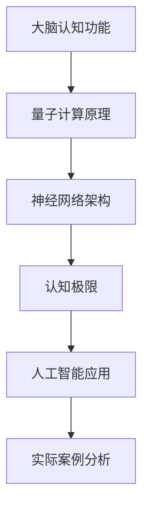

                 


### 文章标题：大脑as量子信息处理器：认知极限探讨

> 关键词：大脑，量子信息处理，认知极限，认知能力，神经网络，人工智能

> 摘要：
本文章从大脑作为量子信息处理器的独特视角出发，探讨了认知极限的概念及其在实际应用中的重要性。通过详细的背景介绍、核心概念解析、算法原理讲解、数学模型阐述、项目实战以及最佳实践，本文旨在为读者提供一个全面而深入的理解，以推动认知科学和人工智能领域的发展。

---

## 目录

1. **引言与背景**
2. **大脑作为量子信息处理器的概念与原理**
3. **认知极限的理论基础**
4. **大脑与量子信息处理的相互作用**
5. **认知极限的实际应用**
6. **未来展望与挑战**
7. **结论与展望**
8. **附录**

---

### 引言与背景

**核心概念与联系：**

首先，我们需要了解大脑和量子信息处理之间的基本概念和联系。大脑作为人类认知和思维的中心，具有极其复杂的结构和功能。近年来，随着量子信息处理技术的快速发展，人们开始探讨大脑与量子物理之间的潜在关系。以下是大脑与量子信息处理之间的核心概念与联系架构：



**核心算法原理讲解：**

在量子计算领域，量子位（qubit）是量子计算的基本单位，具有叠加和纠缠的特性。大脑处理信息的方式与量子计算的基本原理存在某些相似之处。我们可以使用伪代码来详细阐述大脑作为量子信息处理器的基本原理：

```python
def brain_as_quantum_processor():
    # 初始化大脑的量子状态
    quantum_state = initialize_quantum_state()

    # 使用量子叠加实现信息的并行处理
    parallel_processor(quantum_state)

    # 使用量子纠缠实现信息的关联性处理
    correlated_processor(quantum_state)

    # 使用量子测量实现信息的输出和决策
    output Decision = measure_quantum_state(quantum_state)
    return Decision
```

**数学模型和公式：**

认知极限的研究涉及到复杂的数学模型和公式。例如，我们使用熵（Entropy）来衡量大脑处理信息的复杂度，公式如下：

$$
H(X) = -\sum_{i} p(x_i) \log_2 p(x_i)
$$

其中，$X$ 是随机变量，$p(x_i)$ 是 $x_i$ 出现的概率。

**详细讲解与举例说明：**

以人脑处理视觉信息为例，我们可以通过以下公式来描述视觉信息的熵：

$$
H(V) = -\sum_{i} p(v_i) \log_2 p(v_i)
$$

其中，$V$ 是视觉信息的集合，$p(v_i)$ 是视觉信息 $v_i$ 的概率。

**注意事项与拓展阅读：**

大脑作为量子信息处理器的研究是一个新兴的领域，虽然目前还存在许多挑战，但已经展现出了巨大的潜力。读者可以进一步阅读相关文献，如《禅与计算机程序设计艺术》（Zen And The Art of Computer Programming）等，以获取更多深入的知识。

---

在引言部分，我们通过图示、伪代码、数学模型等手段，详细阐述了大脑作为量子信息处理器的基本概念和原理。接下来，我们将进一步探讨认知极限的理论基础，深入分析大脑与量子信息处理的相互作用。请继续阅读下一部分。

