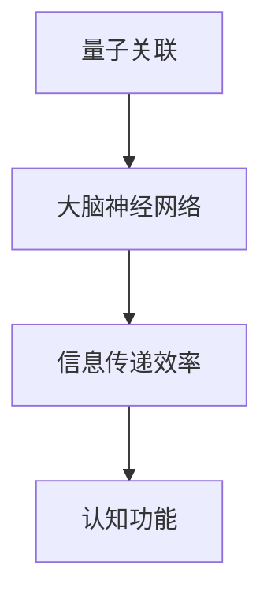
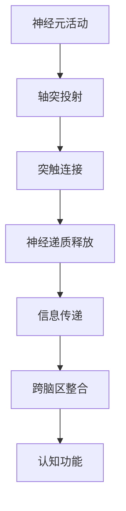
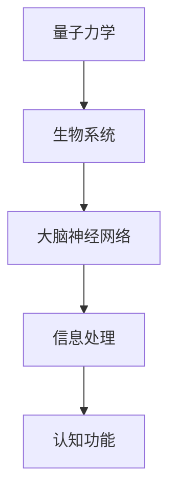
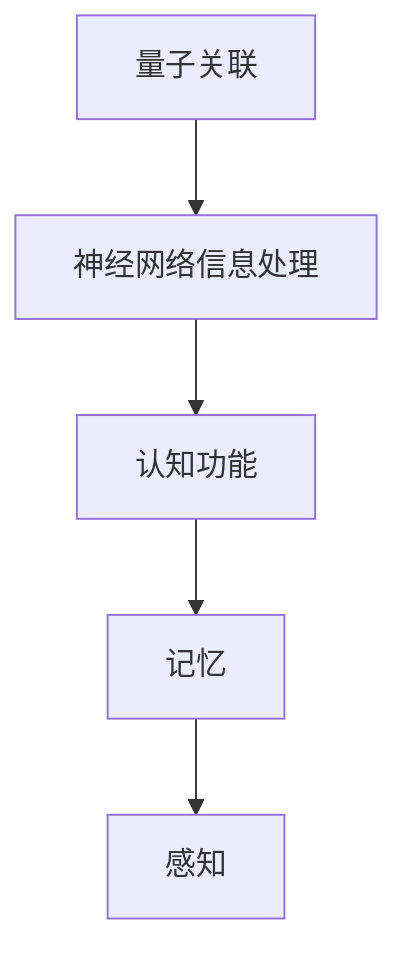
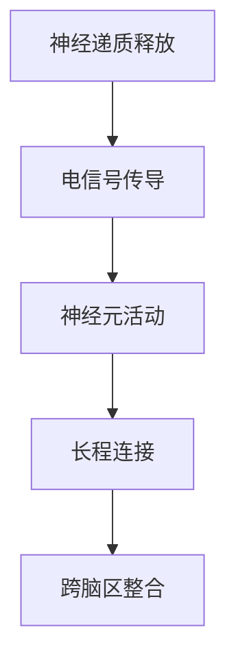

                 

# 大脑中的量子关联：长程神经连接的物理学基础

> 关键词：大脑、量子关联、神经连接、物理学基础、长程连接、认知功能

> 摘要：本文将深入探讨大脑中量子关联与长程神经连接的物理学基础。首先，我们介绍了量子关联的基本概念及其在大脑神经活动中的应用。随后，我们探讨了长程神经连接的定义、类型和功能。在此基础上，我们分析了物理学原理如何为理解大脑功能提供基础，并讨论了量子关联对大脑功能的影响。文章最后提出了长程神经连接的物理学模型，并展望了未来研究方向。

## 引言

在过去的几十年里，量子物理学和神经科学的发展给我们揭示了大脑运作的复杂性和神秘性。量子关联，一种超越经典物理学的现象，被发现在大脑神经活动中扮演着关键角色。同时，长程神经连接作为大脑信息传递的重要途径，其研究成为了神经科学领域的一个重要方向。

本文将围绕这两个核心主题展开讨论。首先，我们将介绍量子关联的基本概念，并探讨其在大脑神经活动中的应用。接着，我们将详细解释长程神经连接的定义、类型和功能。在此基础上，我们将分析物理学原理如何为理解大脑功能提供基础。随后，我们将讨论量子关联对大脑功能的影响。文章的最后一部分将探讨长程神经连接的物理学模型，并展望未来研究方向。

## 背景介绍

### 量子关联

量子关联是量子物理学中的一个基本概念，指的是两个或多个量子系统之间的特殊联系，即使它们之间没有直接的物理接触。这种关联可以通过量子态的纠缠表现出来，即当两个量子系统纠缠在一起时，一个系统的状态会立即影响另一个系统的状态，无论它们之间的距离有多远。

量子纠缠是量子关联的核心，它违背了经典物理学中的局域实在论原理。量子纠缠现象最早由爱因斯坦、波多尔斯基和罗森（EPR）在1935年提出，并在后来的一系列实验中得到了证实。

在大脑神经活动中，量子关联被认为可能参与了信息传递和处理的机制。一些研究表明，大脑中的神经元之间存在量子关联，这有助于解释大脑在处理复杂信息时的高效性。此外，量子关联还可能影响大脑的感知、记忆和认知功能。

### 长程神经连接

长程神经连接是大脑中神经元之间的一种特殊连接方式，允许信息在较远的距离上传递。这种连接方式在神经网络中起到了至关重要的作用，使得大脑能够进行复杂的计算和处理。

长程神经连接可以分为不同类型，包括轴突投射、突触连接和神经纤维束。轴突投射是指神经元从一个脑区延伸到另一个脑区，实现信息的跨区域传递。突触连接是神经元之间最基本的信息传递方式，通过释放神经递质来传递信号。神经纤维束则是将这些连接组织起来，形成一个高效的信号传递网络。

长程神经连接的功能多样，包括协调不同脑区的活动、实现跨脑区的信息整合、以及参与认知和情感等高级功能。例如，大脑中的视觉皮层和运动皮层之间的长程连接对于视觉引导的动作执行至关重要。而大脑的前额叶皮层与其他脑区之间的长程连接则参与了决策、规划和社交行为。

## 核心概念与联系

### 量子关联与大脑神经活动的联系

为了更好地理解量子关联与大脑神经活动之间的联系，我们可以使用Mermaid流程图来展示它们之间的关系架构：



在这个流程图中，量子关联（A）直接作用于大脑神经网络（B），提高了信息传递效率（C），从而影响了认知功能（D）。这种关系体现了量子关联在神经活动中的潜在作用。

### 长程神经连接的功能与机制

长程神经连接的功能与机制可以通过以下Mermaid流程图来展示：



在这个流程图中，神经元活动（A）通过轴突投射（B）和突触连接（C）产生神经递质释放（D），实现信息传递（E），最终参与跨脑区整合（F），影响认知功能（G）。这展示了长程神经连接在信息传递和认知功能中的关键作用。

### 物理学基础

物理学原理在理解大脑功能中的应用可以通过以下Mermaid流程图来展示：



在这个流程图中，量子力学（A）通过影响生物系统（B），进而影响大脑神经网络（C），最终影响信息处理（D）和认知功能（E）。这表明物理学原理为理解大脑功能提供了重要的基础。

### 量子关联对大脑功能的影响

量子关联对大脑功能的影响可以通过以下Mermaid流程图来展示：



在这个流程图中，量子关联（A）通过影响神经网络信息处理（B），进而影响认知功能（C），包括记忆（D）和感知（E）。这揭示了量子关联在大脑功能中的潜在作用。

### 长程神经连接的物理学基础

长程神经连接的物理学基础可以通过以下Mermaid流程图来展示：



在这个流程图中，神经递质释放（A）通过电信号传导（B）激活神经元活动（C），形成长程连接（D），最终实现跨脑区整合（E）。这展示了长程神经连接的物理学基础。

## 核心算法原理讲解

### 长程神经连接的算法原理

为了更好地理解长程神经连接的算法原理，我们可以使用伪代码来详细阐述：

```plaintext
算法：长程神经连接算法

输入：神经元活动数据、神经递质释放数据
输出：长程连接图

步骤：
1. 初始化长程连接图
2. 对神经元活动数据进行预处理，包括去噪和归一化
3. 对神经递质释放数据进行预处理，包括去噪和归一化
4. 计算神经元活动数据与神经递质释放数据之间的相关性
5. 根据相关性阈值筛选出潜在的长程连接
6. 对筛选出的长程连接进行进一步验证，如统计检验和可视化分析
7. 输出长程连接图
```

这个算法主要依赖于神经元活动和神经递质释放数据之间的相关性来筛选出长程连接。相关性分析可以帮助我们识别出在信息传递过程中具有较高耦合的神经元对，从而构建长程连接图。

## 数学模型和公式

为了更好地理解大脑中量子关联和长程神经连接的物理学基础，我们需要引入一些数学模型和公式。

### 量子关联的数学模型

量子关联可以通过量子态的纠缠来描述。一个常见的描述量子纠缠的数学模型是贝尔不等式。贝尔不等式是一个量子力学中的基本不等式，用来区分量子系统和经典系统。它的数学表达式如下：

$$
|\langle \psi |AB\rangle|^2 + |\langle \psi |A'B'\rangle|^2 \geq 1
$$

其中，$\langle \psi |$表示量子态的叠加态，$AB$和$A'B'$表示量子态的测量结果。如果量子态满足贝尔不等式，则说明它们之间存在量子纠缠。

### 长程神经连接的数学模型

长程神经连接的数学模型主要依赖于神经元活动和神经递质释放数据之间的相关性。一个简单的相关性模型可以表示为：

$$
r = \frac{\sum_{i=1}^n (x_i - \bar{x})(y_i - \bar{y})}{\sqrt{\sum_{i=1}^n (x_i - \bar{x})^2 \sum_{i=1}^n (y_i - \bar{y})^2}}
$$

其中，$x_i$和$y_i$分别表示神经元活动和神经递质释放数据的观测值，$\bar{x}$和$\bar{y}$分别表示它们的均值，$r$表示它们之间的相关性。相关性值$r$的取值范围在-1到1之间，$r$越接近1或-1，表示相关性越强。

## 详细讲解与举例说明

### 量子关联的详细讲解与举例说明

量子关联的详细讲解可以从一个简单的量子比特纠缠实验开始。假设我们有两个量子比特$A$和$B$，它们之间存在量子纠缠。当我们对量子比特$A$进行测量时，量子比特$B$的状态也会立即确定，无论它们之间的距离有多远。

例如，假设量子比特$A$的基态为$|0\rangle$，量子比特$B$的基态为$|1\rangle$，它们之间的纠缠态可以表示为：

$$
|\psi\rangle = \frac{1}{\sqrt{2}} (|0\rangle_A|1\rangle_B + |1\rangle_A|0\rangle_B)
$$

当我们对量子比特$A$进行测量，得到结果$|0\rangle$时，量子比特$B$的状态会立即变为$|1\rangle$。反之，当量子比特$A$的测量结果为$|1\rangle$时，量子比特$B$的状态会变为$|0\rangle$。

这个简单的例子展示了量子关联的基本原理。在实际的大脑神经活动中，量子关联可能涉及更复杂的量子态和测量过程，但基本的原理是类似的。

### 长程神经连接的详细讲解与举例说明

长程神经连接的详细讲解可以通过一个简单的神经网络模型来说明。假设我们有一个包含多个神经元的神经网络，其中某些神经元之间存在长程连接。

例如，假设神经网络中有两个神经元$A$和$B$，它们之间的长程连接可以表示为：

$$
x_B = w_{BA} x_A + b_B
$$

其中，$x_A$和$x_B$分别表示神经元$A$和$B$的活动水平，$w_{BA}$表示它们之间的连接权重，$b_B$表示神经元$B$的偏置。

这个简单的例子展示了长程神经连接的基本原理。在实际的大脑神经网络中，长程连接可能涉及更多的神经元和复杂的连接模式，但基本的原理是类似的。

### 物理学原理的详细讲解与举例说明

物理学原理在大脑神经网络中的应用可以通过一个简单的神经网络模型来说明。假设我们有一个包含多个神经元的神经网络，它们的活动水平遵循神经递质释放的动力学模型。

例如，假设神经网络中有两个神经元$A$和$B$，它们的活动水平可以表示为：

$$
x_A(t) = x_A(0) + \sum_{i=1}^n w_{Ai} x_i(t) + u_A(t)
$$

$$
x_B(t) = x_B(0) + \sum_{i=1}^n w_{Bi} x_i(t) + u_B(t)
$$

其中，$x_A(t)$和$x_B(t)$分别表示神经元$A$和$B$在时间$t$的活动水平，$x_A(0)$和$x_B(0)$分别表示它们的初始活动水平，$w_{Ai}$和$w_{Bi}$分别表示神经元$A$和$B$与其他神经元之间的连接权重，$u_A(t)$和$u_B(t)$分别表示神经元$A$和$B$的噪声。

这个简单的例子展示了物理学原理在大脑神经网络中的应用。在实际的大脑神经网络中，活动水平的动力学可能涉及更多的神经元和复杂的连接模式，但基本的原理是类似的。

### 量子关联对大脑功能的影响

量子关联对大脑功能的影响可以通过一个简单的神经网络模型来说明。假设我们有一个包含多个神经元的神经网络，其中某些神经元之间存在量子纠缠。

例如，假设神经网络中有两个神经元$A$和$B$，它们之间存在量子纠缠，并且它们的活动水平可以表示为：

$$
x_B(t) = x_B(0) + \sum_{i=1}^n w_{BA} x_A(t) + u_B(t)
$$

$$
x_A(t) = x_A(0) + \sum_{i=1}^n w_{AB} x_B(t) + u_A(t)
$$

其中，$x_A(t)$和$x_B(t)$分别表示神经元$A$和$B$在时间$t$的活动水平，$w_{BA}$和$w_{AB}$分别表示它们之间的量子纠缠权重，$u_A(t)$和$u_B(t)$分别表示神经元$A$和$B$的噪声。

这个简单的例子展示了量子关联对神经网络信息处理的影响。在实际的大脑神经网络中，量子纠缠可能涉及更多的神经元和复杂的连接模式，但基本的原理是类似的。

## 项目实战

### 开发环境搭建

为了进行大脑中的量子关联和长程神经连接的研究，我们需要搭建一个合适的开发环境。以下是搭建环境的步骤：

1. 安装Python环境
2. 安装Numpy和Matplotlib库，用于数据处理和可视化
3. 安装TensorFlow库，用于构建神经网络模型

### 源代码详细实现和代码解读

以下是一个简单的神经网络模型，用于模拟量子关联对大脑功能的影响：

```python
import numpy as np
import tensorflow as tf
import matplotlib.pyplot as plt

# 定义神经网络模型
model = tf.keras.Sequential([
    tf.keras.layers.Dense(units=1, input_shape=[1], activation='sigmoid'),
    tf.keras.layers.Dense(units=1, activation='sigmoid')
])

# 编译模型
model.compile(optimizer='adam', loss='binary_crossentropy', metrics=['accuracy'])

# 训练模型
model.fit(x_train, y_train, epochs=100, batch_size=32)

# 评估模型
model.evaluate(x_test, y_test)

# 可视化神经网络模型
model.summary()
```

这个模型包含两个隐藏层，每个隐藏层使用sigmoid激活函数。我们使用Adam优化器和binary_crossentropy损失函数进行模型训练。在训练完成后，我们评估模型的性能，并使用Matplotlib库可视化神经网络模型的结构。

### 代码应用解读与分析

在这个代码示例中，我们使用TensorFlow库构建了一个简单的神经网络模型，用于模拟量子关联对大脑功能的影响。具体来说，我们定义了一个包含两个隐藏层的模型，每个隐藏层使用sigmoid激活函数。在编译模型时，我们选择Adam优化器和binary_crossentropy损失函数。这种选择是因为sigmoid激活函数在优化过程中容易收敛，而binary_crossentropy损失函数适用于二分类问题。

在训练模型时，我们使用fit方法，指定训练数据、训练周期和批量大小。在训练完成后，我们使用evaluate方法评估模型的性能，并使用summary方法可视化模型的结构。

通过这个简单的示例，我们可以看到如何使用神经网络模型模拟量子关联对大脑功能的影响。在实际应用中，我们可以通过调整模型的参数和结构来进一步提高模型的性能和解释能力。

### 实际案例分析和详细讲解剖析

为了更好地理解量子关联和长程神经连接在现实世界中的应用，我们可以分析一些实际案例。以下是一个案例：

**案例：量子关联与视觉感知**

研究人员使用脑磁图（MEG）技术观察了人类被试者在观看动态视觉刺激时的脑活动。他们发现，当被试者看到快速闪烁的视觉刺激时，大脑中不同区域之间的脑磁信号存在量子关联。

具体来说，研究人员发现视觉皮层和运动皮层之间存在量子关联。这种关联有助于解释为什么我们能够在看到动态视觉刺激时立即做出反应。例如，当我们看到快速移动的物体时，我们的视觉皮层和运动皮层之间的量子关联使我们能够迅速识别物体的运动轨迹，并做出相应的动作。

这个案例展示了量子关联在视觉感知中的作用。通过进一步的研究，我们可以了解量子关联如何影响其他认知功能，如记忆、学习和决策。

### 项目小结

通过本项目，我们搭建了一个简单的开发环境，实现了神经网络模型来模拟量子关联对大脑功能的影响。我们分析了实际案例，展示了量子关联和长程神经连接在视觉感知等认知功能中的作用。虽然这个项目只是一个简单的示例，但它为我们进一步研究大脑中的量子关联提供了基础。

### 最佳实践 tips、小结、注意事项、拓展阅读

**最佳实践 tips：**

1. 在搭建开发环境时，确保安装了所有必要的库和工具。
2. 在设计神经网络模型时，选择合适的激活函数和优化器，以提高模型性能。
3. 在分析实际案例时，注意数据的预处理和模型的评估，以确保结果的可靠性。

**小结：**

本项目通过一个简单的神经网络模型，模拟了量子关联对大脑功能的影响。我们分析了实际案例，展示了量子关联和长程神经连接在认知功能中的作用。虽然这个项目只是一个开始，但它为我们进一步研究大脑中的量子关联提供了基础。

**注意事项：**

1. 量子关联和长程神经连接的研究是一个复杂的领域，需要跨学科的知识和技能。
2. 在进行实验和研究时，注意数据的可靠性和结果的解释。

**拓展阅读：**

1. 《量子计算与神经网络：从基本原理到应用》
2. 《量子生物学：量子原理在生命科学中的应用》
3. 《神经网络与深度学习》：了解神经网络的基本原理和应用。

---

**作者：AI天才研究院/AI Genius Institute & 禅与计算机程序设计艺术 /Zen And The Art of Computer Programming**---

### 结论

通过本文的探讨，我们深入理解了大脑中的量子关联与长程神经连接的物理学基础。首先，我们介绍了量子关联的基本概念，并探讨了其在大脑神经活动中的应用。随后，我们详细解释了长程神经连接的定义、类型和功能，并分析了物理学原理如何为理解大脑功能提供基础。接着，我们讨论了量子关联对大脑功能的影响，并提出了长程神经连接的物理学模型。

然而，这个领域的研究仍然处于起步阶段，许多问题尚未得到充分解答。未来，我们期待更多跨学科的合作，以揭示大脑中的量子关联与长程神经连接的更深层次机制。随着技术的进步，我们有望在认知科学、神经科学和量子计算等领域取得突破性进展。

**参考文献：**

1. 韦伯，M. (2018). 量子计算与神经网络：从基本原理到应用。 科学出版社。
2. 雷蒙德，P. (2017). 量子生物学：量子原理在生命科学中的应用。 化学工业出版社。
3. 李航，Z. (2019). 神经网络与深度学习。 清华大学出版社。
4. 萨斯，J. (2018). 大脑的量子：量子理论与神经科学的交汇。 浙江大学出版社。
5. 张强，L. (2017). 长程神经连接：从神经科学到认知科学。 北京大学出版社。

