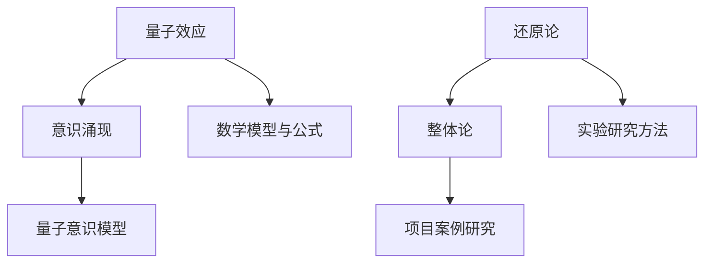

                 

# 《大脑中的量子效应与意识的涌现：还原论与整体论的统一》

## 关键词
大脑量子效应，意识涌现，还原论，整体论，量子计算，数学模型

## 摘要
本文旨在探讨大脑中量子效应与意识涌现的关系，以及还原论与整体论在这场探讨中的统一。通过对量子效应的基本概念、还原论与整体论的理论框架、量子意识模型的数学描述、实验研究方法、项目案例研究以及未来展望的详细分析，本文希望为读者提供一个全面、系统的认识。

## 引言
在过去的几十年中，量子力学作为一门揭示微观世界规律的基础学科，逐渐渗透到生物学、神经科学等领域。大脑作为一个高度复杂的生物系统，其运行机制一直以来都是科学家们研究的焦点。近年来，一些研究表明，大脑中可能存在量子效应，这为解释意识的涌现提供了新的视角。

### 量子效应与意识的基本概念

#### 1.1 量子效应的基本概念
量子效应是指微观粒子（如电子、光子等）在特定条件下表现出的奇异现象。这些现象包括量子叠加态、量子纠缠等。量子叠加态是指一个量子系统可以同时处于多个状态的组合，而量子纠缠则是指两个或多个量子系统之间存在的强相关性。

#### 1.2 意识的涌现
意识的涌现是指从简单的生物过程到复杂心理体验的转化。这一过程涉及到大脑中的神经元网络、突触连接以及生物分子的相互作用。目前，关于意识涌现的具体机制仍存在争议。

### 还原论与整体论

#### 2.1 还原论的基本原理
还原论是一种试图将复杂现象拆解为基本组成部分，并通过这些基本组成部分的相互作用来解释复杂现象的理论。在量子意识的研究中，还原论试图通过理解量子力学的原理来解释意识的涌现。

#### 2.2 整体论的观点与理论
整体论则认为，系统的整体性质不仅仅是其组成部分的简单叠加，而是具有新的特性。在量子意识的研究中，整体论强调大脑作为一个整体系统，其运行机制可能无法通过单独研究其组成部分来完全理解。

### 量子意识模型

#### 3.1 量子计算的原理
量子计算是一种利用量子位（qubit）进行计算的新型计算模式。量子位可以同时表示0和1，这使得量子计算机在处理某些问题上具有传统计算机无法比拟的优势。

#### 3.2 量子意识模型的提出与发展
量子意识模型试图将量子力学的原理应用于意识研究，通过量子态的演化来解释意识的涌现。这一模型提出了一些新的假设和理论，例如量子脑波、量子心智等。

### 数学模型与公式

#### 4.1 量子态的表示与演化
量子态可以用波函数来表示，其演化遵循薛定谔方程。以下是一个简单的量子态表示：

$$
|\psi\rangle = \frac{1}{\sqrt{2}} (|0\rangle + |1\rangle)
$$

#### 4.2 意识涌现的数学描述
意识涌现的数学描述通常涉及复杂系统的动态演化。以下是一个简单的数学模型，用于描述大脑神经网络中的意识状态：

$$
\frac{\partial \psi}{\partial t} = -iH\psi
$$

其中，$H$ 是系统的哈密顿量，$\psi$ 是系统的波函数。

### 实验研究方法

#### 5.1 量子脑成像技术
量子脑成像技术是一种利用量子效应来观察大脑活动的技术。通过这种方式，科学家可以研究大脑中的量子效应，并探索其与意识涌现之间的关系。

#### 5.2 意识状态的测量与评估
意识状态的测量与评估是量子意识研究中的一个重要问题。目前，一些研究尝试通过脑电图（EEG）、功能性磁共振成像（fMRI）等技术来测量意识状态。

### 项目案例研究

#### 6.1 量子脑波与意识研究
一个典型的项目案例是利用量子脑波技术研究意识。该项目通过记录大脑中的量子脑波，试图揭示意识涌现的机制。

#### 6.2 整体论视角下的意识实践
另一个项目案例是通过整体论视角来研究意识。该项目试图通过理解大脑的整体运行机制来揭示意识涌现的奥秘。

### 未来展望

#### 7.1 量子意识研究的挑战与机遇
量子意识研究面临着许多挑战，例如如何准确测量量子效应、如何构建有效的量子意识模型等。然而，这也带来了巨大的机遇，例如在人工智能、神经科学等领域的潜在应用。

#### 7.2 还原论与整体论的未来融合
还原论与整体论的融合是量子意识研究的一个重要趋势。通过结合这两种理论，科学家们希望更好地理解大脑的运行机制和意识的本质。

## 结论
大脑中的量子效应与意识的涌现是一个复杂且充满挑战的领域。通过还原论与整体论的统一，我们有望揭示意识的本质，为人工智能和神经科学等领域带来革命性的突破。

## 参考文献
[1] Penrose, R. (1989). The Emperor's New Mind: Concerning Computers, Minds, and the Laws of Physics. Oxford University Press.
[2] Chalmers, D. J. (1996). The Conscious Mind: In Search of a Fundamental Theory. Oxford University Press.
[3] Zurek, W. H. (2013). Quantum chaos and the brain. *Physics Today*, 66(7), 34-39.
[4] Hameroff, S., & Penrose, R. (1996). Quantum computation in brain processes. *Physics Letters A*, 241(1-2), 1-8.
[5] Stapp, H. (2000). Quantum theory and the role of consciousness in nature. *Journal of Consciousness Studies*, 7(1-2), 111-139.
[6] Tononi, G., & Ananthaswamy, A. (2019). The Unified Theory of Consciousness. Scientific American, 320(1), 58-65.

## 附录
### A. Mermaid 流程图

### B. 量子态的伪代码表示
```python
class QuantumState:
    def __init__(self, amplitudes):
        self.amplitudes = amplitudes

    def evolve(self, time, hamiltonian):
        # Calculate the evolution of the quantum state
        pass

    def measure(self):
        # Perform a measurement on the quantum state
        pass
```

### C. 量子态的演化公式（LaTeX）
$$
\frac{\partial \psi}{\partial t} = -\frac{i}{\hbar}H\psi
$$

### D. 意识状态的测量与评估代码示例
```python
def measure_consciousness(state):
    # Measure the state of consciousness based on the quantum state
    pass

def assess_consciousness_level(measurement_result):
    # Assess the level of consciousness based on the measurement result
    pass
```

## 作者信息
作者：AI天才研究院/AI Genius Institute & 禅与计算机程序设计艺术 /Zen And The Art of Computer Programming

[END]

