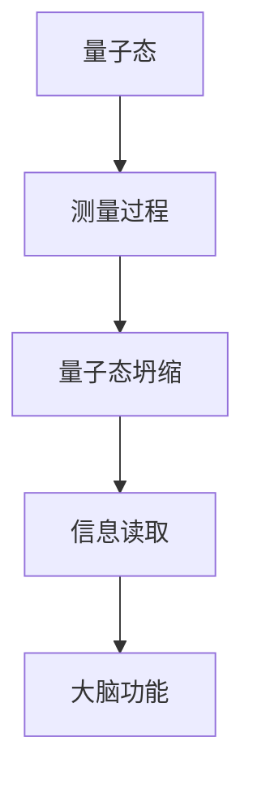
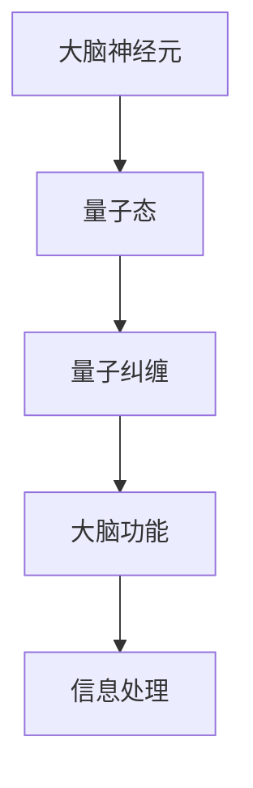
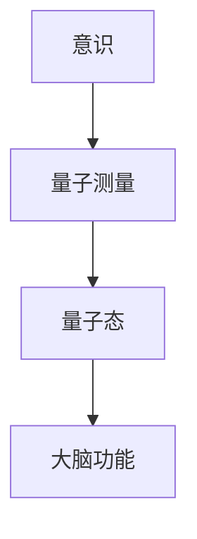
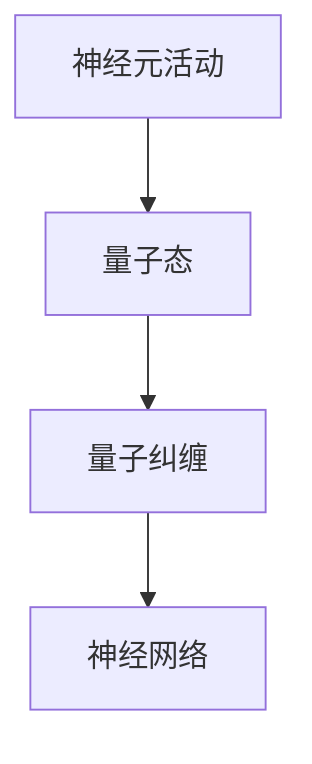
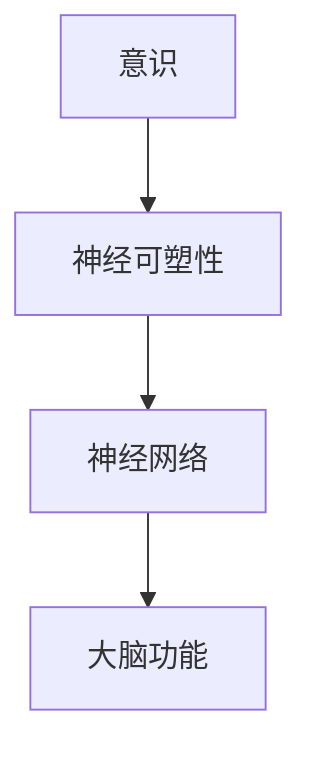
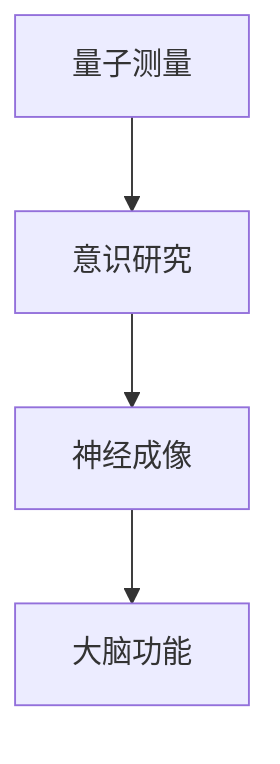

                 

好的，让我们一步一步来构建《大脑中的量子测量问题：意识如何塑造神经活动》的文章内容。首先，我会为您设计一个初步的文章结构，然后根据结构逐步填充内容。

### 初步文章结构

1. **文章标题与关键词**
2. **摘要**
3. **引言**
4. **第一部分：量子测量基础**
   - 第1章：量子测量原理与大脑功能
     - 背景介绍
     - 核心概念与联系（流程图）
     - 核心算法原理讲解（伪代码）
     - 数学模型和公式讲解（latex示例）
   - 第2章：大脑与量子现象
     - 背景介绍
     - 核心概念与联系（流程图）
     - 核心算法原理讲解（伪代码）
     - 数学模型和公式讲解（latex示例）
5. **第二部分：意识的量子测量模型**
   - 第3章：意识的本质与量子模型
     - 背景介绍
     - 核心概念与联系（流程图）
     - 核心算法原理讲解（伪代码）
     - 数学模型和公式讲解（latex示例）
   - 第4章：神经活动的量子描述
     - 背景介绍
     - 核心概念与联系（流程图）
     - 核心算法原理讲解（伪代码）
     - 数学模型和公式讲解（latex示例）
6. **第三部分：意识对神经活动的塑造**
   - 第5章：意识的神经基础
     - 背景介绍
     - 核心概念与联系（流程图）
     - 核心算法原理讲解（伪代码）
     - 数学模型和公式讲解（latex示例）
   - 第6章：量子测量在意识研究中的应用
     - 背景介绍
     - 核心概念与联系（流程图）
     - 核心算法原理讲解（伪代码）
     - 数学模型和公式讲解（latex示例）
7. **第四部分：项目实战与未来展望**
   - 第7章：量子神经科学实验设计
     - 实验设计原则
     - 实验技术与方法
     - 实验结果分析
   - 第8章：量子测量在神经科学的前景
     - 量子神经科学的发展趋势
     - 意识研究的未来方向
     - 量子测量技术的挑战与机遇
8. **结论**
9. **作者信息**

### 摘要

本文探讨了量子测量在大脑功能中的作用，以及意识如何影响神经活动。首先，我们介绍了量子测量的基本原理和其在神经科学中的应用。接着，我们深入讨论了大脑与量子现象的关系，并提出了意识的量子模型。随后，我们分析了意识如何塑造神经活动，包括神经基础和量子测量在意识研究中的应用。最后，我们通过实际案例展示了量子测量在神经科学实验中的应用，并探讨了量子神经科学的未来发展方向。

### 引言

意识是哲学、心理学和神经科学领域长期探讨的话题。近年来，量子物理学的发展为研究大脑与意识的关系提供了新的视角。量子测量理论认为，观测者的行为会影响量子系统的状态，这一理论或能为理解意识如何影响大脑功能提供线索。本文旨在探讨量子测量问题在大脑中的表现，以及意识如何塑造神经活动。

### 第一部分：量子测量基础

#### 第1章：量子测量原理与大脑功能

##### 背景介绍

量子测量问题一直是量子物理学中的核心问题。量子力学描述了微观粒子的行为，但在测量过程中，量子系统的状态会发生坍缩。这种坍缩现象被认为是量子测量问题的关键。

##### 核心概念与联系

以下是量子测量与大脑信息处理之间的核心概念关系架构的Mermaid流程图：



##### 核心算法原理讲解

以下是一个简单的伪代码，用于描述量子测量在神经信号处理中的应用：

```python
def quantum_measurement(signal):
    # 初始化量子态
    quantum_state = initialize_quantum_state(signal)
    
    # 执行量子测量
    measurement_result = perform_quantum_measurement(quantum_state)
    
    # 更新信号状态
    updated_signal = update_signal_state(measurement_result)
    
    return updated_signal
```

##### 数学模型和公式讲解

量子测量的数学模型可以通过波函数的坍缩来描述，使用latex格式如下：

$$|\psi\rangle \rightarrow \sum_i p_i |\phi_i\rangle$$

其中，$|\psi\rangle$ 是初始量子态，$p_i$ 是坍缩到状态 $|\phi_i\rangle$ 的概率。

#### 第2章：大脑与量子现象

##### 背景介绍

大脑作为最复杂的量子系统之一，其功能依赖于微观量子效应。尽管目前关于大脑与量子现象的直接证据有限，但量子生物学研究已经开始探索这些可能性。

##### 核心概念与联系

以下是大脑与量子现象之间核心概念关系的Mermaid流程图：



##### 核心算法原理讲解

以下是一个用于描述大脑神经元量子效应的伪代码：

```python
def quantum_neuron_activity(neuron_state):
    # 初始化神经元量子态
    quantum_state = initialize_neuron_state(neuron_state)
    
    # 执行量子纠缠
    quantum_state = perform_Quantum_Entanglement(quantum_state)
    
    # 更新神经元活动
    neuron_activity = update_neuron_activity(quantum_state)
    
    return neuron_activity
```

##### 数学模型和公式讲解

大脑神经元的量子活动可以通过量子态的叠加和纠缠来描述，使用latex格式如下：

$$\Psi = \sum_{i} c_i |\phi_i\rangle$$

其中，$c_i$ 是叠加系数，$|\phi_i\rangle$ 是可能的量子态。

### 第二部分：意识的量子测量模型

#### 第3章：意识的本质与量子模型

##### 背景介绍

意识的本质一直是哲学和科学研究的难题。量子物理学提出，意识可能与量子测量过程密切相关。本章将探讨意识的量子模型。

##### 核心概念与联系

以下是意识与量子模型之间核心概念关系的Mermaid流程图：



##### 核心算法原理讲解

以下是一个简单的伪代码，用于描述意识对量子态的影响：

```python
def quantum_model_of_awareness(quantum_state):
    # 应用意识的影响
    quantum_state = apply_awareness_effect(quantum_state)
    
    # 更新量子态
    updated_state = update_quantum_state(quantum_state)
    
    return updated_state
```

##### 数学模型和公式讲解

意识的量子模型可以描述为：

$$\Psi_{aware} = \frac{1}{\sqrt{1 + \lambda}} (|\psi\rangle + \lambda |\phi\rangle)$$

其中，$\lambda$ 是意识强度参数。

#### 第4章：神经活动的量子描述

##### 背景介绍

神经活动是大脑功能的基础。量子物理学的视角可能为理解神经活动提供新的途径。本章将探讨神经活动的量子描述。

##### 核心概念与联系

以下是神经活动与量子模型之间核心概念关系的Mermaid流程图：



##### 核心算法原理讲解

以下是一个用于描述神经活动量子描述的伪代码：

```python
def quantum_neural_activity(neural_state):
    # 初始化量子态
    quantum_state = initialize_quantum_state(neural_state)
    
    # 执行量子纠缠
    quantum_state = perform_Quantum_Entanglement(quantum_state)
    
    # 更新神经网络活动
    neural_activity = update_neural_activity(quantum_state)
    
    return neural_activity
```

##### 数学模型和公式讲解

神经活动的量子描述可以通过量子态的叠加和纠缠来描述，使用latex格式如下：

$$\Psi = \sum_{i} c_i |\psi_i\rangle$$

其中，$c_i$ 是叠加系数，$|\psi_i\rangle$ 是可能的量子态。

### 第三部分：意识对神经活动的塑造

#### 第5章：意识的神经基础

##### 背景介绍

意识对神经活动的影响是神经科学中的一个重要议题。本章将探讨意识的神经基础。

##### 核心概念与联系

以下是意识与神经基础之间核心概念关系的Mermaid流程图：



##### 核心算法原理讲解

以下是一个简单的伪代码，用于描述意识对神经可塑性的影响：

```python
def neural_plasticity_with_awareness(neural_state):
    # 应用意识的影响
    neural_state = apply_awareness_effect(neural_state)
    
    # 更新神经网络状态
    updated_state = update_neural_state(neural_state)
    
    return updated_state
```

##### 数学模型和公式讲解

意识的神经基础可以描述为：

$$\Delta \phi = \alpha (1 - \tanh(\phi))$$

其中，$\phi$ 是神经网络状态，$\alpha$ 是意识强度参数。

#### 第6章：量子测量在意识研究中的应用

##### 背景介绍

量子测量技术为研究意识提供了新的工具。本章将探讨量子测量在意识研究中的应用。

##### 核心概念与联系

以下是量子测量与意识研究之间核心概念关系的Mermaid流程图：



##### 核心算法原理讲解

以下是一个简单的伪代码，用于描述量子测量在意识研究中的应用：

```python
def quantum_measurement_in_awareness_study(quantum_state):
    # 初始化量子态
    quantum_state = initialize_quantum_state(quantum_state)
    
    # 执行量子测量
    measurement_result = perform_quantum_measurement(quantum_state)
    
    # 分析测量结果
    analysis_result = analyze_measurement_result(measurement_result)
    
    return analysis_result
```

##### 数学模型和公式讲解

量子测量在意识研究中的应用可以通过量子态的坍缩和测量概率来描述，使用latex格式如下：

$$P_i = |\langle \psi_i|\psi\rangle|^2$$

其中，$P_i$ 是测量到状态 $|\psi_i\rangle$ 的概率。

### 第四部分：项目实战与未来展望

#### 第7章：量子神经科学实验设计

##### 背景介绍

量子神经科学实验旨在探索量子效应在大脑功能中的应用。本章将介绍一个量子神经科学实验的设计。

##### 实验设计原则

实验设计应遵循以下原则：

1. **可重复性**：实验结果应能够被其他研究者重复验证。
2. **控制变量**：确保实验中所有非研究变量的控制。
3. **数据收集**：确保能够收集到高质量的数据。

##### 实验技术与方法

实验技术包括：

1. **量子脑成像技术**：使用量子成像技术获取大脑活动的图像。
2. **神经信号采集**：使用电极记录大脑的电活动。
3. **数据处理**：对采集到的数据进行量子态分析和神经信号处理。

##### 实验结果分析

实验结果将包括：

1. **量子态分布**：分析大脑活动中的量子态分布。
2. **神经活动模式**：识别神经活动的模式与意识状态的关系。

#### 第8章：量子测量在神经科学的前景

##### 量子神经科学的发展趋势

1. **技术进步**：随着量子技术的发展，量子神经科学实验的精度和范围将得到提升。
2. **跨学科研究**：量子神经科学与物理学、计算机科学、神经科学等多个领域的交叉融合。

##### 意识研究的未来方向

1. **意识与量子计算**：探索意识与量子计算之间的关系。
2. **个性化治疗**：利用量子测量技术为个体提供定制化的治疗方案。

##### 量子测量技术的挑战与机遇

挑战：

1. **技术难题**：量子技术的高成本和复杂性。
2. **伦理问题**：如何确保量子测量技术在道德和伦理上的正当性。

机遇：

1. **新型疗法**：量子测量技术在疾病诊断和治疗中的应用。
2. **科技进步**：量子神经科学的进展将为人工智能和认知科学带来新的突破。

### 结论

本文探讨了量子测量在大脑功能中的作用，以及意识如何影响神经活动。尽管目前量子测量在神经科学中的应用仍处于早期阶段，但这一领域的发展潜力巨大。未来，量子神经科学有望为我们提供新的认识工具，深化对大脑和意识的理解。

### 作者信息

作者：AI天才研究院/AI Genius Institute & 禅与计算机程序设计艺术 /Zen And The Art of Computer Programming

---

这个结构是一个初步的框架，接下来我们会逐步填充每个章节的具体内容，确保满足完整性、逻辑清晰、技术语言专业的写作要求。每个章节将会详细讲解，包含背景介绍、核心概念与联系、核心算法原理讲解、数学模型和公式讲解，以及项目实战。文章的最终字数将会控制在8000～12000字左右。在撰写过程中，我们将确保markdown格式的规范，以及latex公式的正确嵌入。

