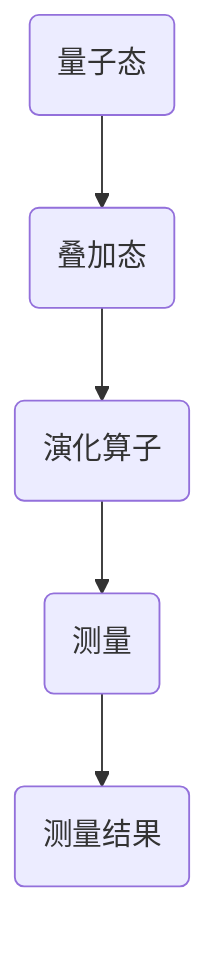

                 

### 文章标题：大脑中的量子随机行走：神经信号传播的新视角

#### 关键词：量子随机行走，神经信号，神经网络，大脑，神经科学，算法模型

#### 摘要：
本文探讨了量子随机行走在神经信号传播中的应用，从量子力学基础出发，详细介绍了量子随机行走的定义、原理和应用。随后，文章深入探讨了神经网络与神经信号的基本概念，并介绍了量子随机行走模型在神经信号处理中的具体应用。通过一系列数学模型和算法原理讲解，文章展示了量子随机行走模型在神经网络中的优势，并提供了相关项目的实战案例。最后，文章总结了量子随机行走模型在神经信号传播中的研究进展和未来展望。

### 第1章：引言

#### 1.1 背景介绍

大脑是人体最复杂的器官之一，它的功能依赖于神经信号的传播和神经网络的运作。神经信号是通过神经元间的电化学反应传递的，这种信号的传播对于大脑的信息处理、学习和记忆等过程至关重要。然而，神经信号传播的机制一直是一个复杂的科学难题，传统的方法难以准确描述其复杂的动态特性。

量子随机行走（Quantum Random Walk，QRW）是一种基于量子力学的随机行走过程，最早由物理学家Mandelbrot提出。量子随机行走具有与传统随机行走不同的特性，如叠加态和干涉效应，这些特性使得量子随机行走在解决某些复杂问题上具有潜在的优越性。近年来，量子随机行走理论在量子计算、量子通信等领域得到了广泛关注和应用。

#### 1.2 量子随机行走在神经科学中的应用

量子随机行走理论在神经科学中的应用提供了新的视角，有助于理解神经信号的传播机制。首先，量子随机行走模型可以模拟神经元间的信号传播过程，揭示信号在神经网络中的动态特性。其次，量子随机行走算法在处理复杂神经网络数据时，可能具有更高的效率和准确性。

例如，量子随机行走模型可以用于模拟神经退行现象（Neuronal Homeostasis），这是一种神经元为了维持稳定的活性状态而对输入信号进行调整的现象。此外，量子随机行走还可以用于优化神经网络的训练过程，提高神经网络的收敛速度和性能。

#### 1.3 量子随机行走与神经信号传播

量子随机行走与神经信号传播之间存在紧密的联系。从量子力学角度看，神经信号在神经元间的传递可以类比为量子态的演化。量子随机行走的叠加态和干涉效应可以解释神经元间信号传播的复杂性和非线性。因此，量子随机行走理论为研究神经信号传播提供了一个新的数学框架。

此外，量子随机行走模型可以用于分析神经网络的拓扑结构和动态特性。通过量子随机行走，可以揭示神经网络中的信号传递路径、关键节点和关键连接，从而深入理解神经网络的工作原理。

总的来说，量子随机行走为神经信号传播的研究提供了一个全新的视角，有望推动神经科学的发展。接下来的章节将详细介绍量子随机行走的基础理论、神经网络与神经信号的基本概念，以及量子随机行走模型在神经网络中的应用。

### 第2章：量子力学基础

#### 2.1 量子态与叠加原理

量子态是量子力学中的基本概念，描述了粒子的状态。一个量子态可以用波函数（wavefunction）表示，它包含了粒子的位置、动量等物理量信息。量子态的一个重要特性是叠加原理，即一个量子系统可以处于多个基态的叠加态。

叠加态的数学表示为：
\[ |\psi\rangle = c_1|1\rangle + c_2|2\rangle \]
其中，\( c_1 \) 和 \( c_2 \) 是复数系数，满足 \( |c_1|^2 + |c_2|^2 = 1 \)。

叠加态展示了量子系统的非线性特性，例如，两个量子态的叠加会导致干涉现象，这在经典物理学中是无法想象的。

#### 2.2 算子与测量

在量子力学中，算子（operator）是描述量子态演化的重要工具。算子作用于量子态，可以产生新的量子态。常见的算子包括位置算子 \( \hat{x} \) 和动量算子 \( \hat{p} \)。

测量的概念在量子力学中尤为重要。测量会导致量子态的坍缩，即系统从叠加态坍缩到一个确定的基态。测量的数学描述为：
\[ \hat{O}|\psi\rangle = \lambda \sum_i |i\rangle \langle i|\psi\rangle \]
其中，\( \hat{O} \) 是测量算子，\( \lambda_i \) 是测量结果的概率幅，\( |i\rangle \) 是可能的测量结果。

#### 2.3 量子随机行走

量子随机行走是量子力学中的一种随机过程，描述了粒子在量子态下的随机运动。量子随机行走的数学模型如下：
\[ |\psi(t)\rangle = \frac{1}{\sqrt{Z}} \sum_{x} e^{i\theta_x} |\psi(0)\rangle_x \]
其中，\( |\psi(0)\rangle_x \) 是初始量子态，\( Z \) 是归一化常数，\( \theta_x \) 是与位置 \( x \) 相关的相位。

量子随机行走的特性包括叠加态和干涉效应。这些特性使得量子随机行走在解决复杂问题上具有潜在的优越性。

### 第3章：神经网络与神经信号

#### 3.1 神经元与神经网络

神经元是大脑的基本单元，它通过电化学反应传递信息。神经元的基本结构包括细胞体、树突、轴突和突触。树突接收其他神经元的信号，轴突传递信号，突触是神经元之间的连接点。

神经网络是由大量神经元组成的复杂系统，用于处理信息。神经网络可以分为前馈神经网络、循环神经网络（RNN）、卷积神经网络（CNN）等类型。这些神经网络在不同的任务中具有独特的优势和应用。

#### 3.2 神经信号传递机制

神经信号传递是通过电化学反应实现的。当神经元接收足够的刺激时，会产生动作电位，这是一个电信号，沿着轴突传播。动作电位到达突触前末梢时，会释放神经递质，这些神经递质通过突触间隙传递到下一个神经元。

神经信号传递具有以下几个特点：
1. **非线性**：神经信号的传递是非线性的，这导致信号在传递过程中会发生放大或衰减。
2. **适应性**：神经元能够根据输入信号的强度和时间调整其活性状态，以维持稳定的信号传递。
3. **延迟**：神经信号的传递存在延迟，这导致信号在神经网络中的传播速度较慢。

#### 3.3 神经信号处理方法

神经信号处理方法包括信号采集、信号预处理、信号分析和信号识别等步骤。信号采集通常使用电极或传感器记录神经信号。信号预处理包括滤波、去噪和放大等步骤，以提高信号质量。信号分析通常使用傅里叶变换、小波变换等方法，以提取信号的频率特征和时间特征。信号识别则使用机器学习和统计方法，以识别特定的神经信号模式。

### 第4章：量子随机行走模型

#### 4.1 模型构建方法

量子随机行走模型的构建包括以下几个步骤：

1. **选择初始量子态**：根据具体应用场景，选择合适的初始量子态。例如，可以使用高斯量子态来表示神经信号。
2. **构建演化算子**：根据量子随机行走的原理，构建演化算子。演化算子描述量子态随时间的演化过程。
3. **计算演化方程**：根据演化算子，计算量子态随时间的演化方程。演化方程描述了量子态在时间上的演化规律。

量子随机行走模型可以表示为：
\[ |\psi(t)\rangle = U(t) |\psi(0)\rangle \]
其中，\( U(t) \) 是演化算子，\( |\psi(0)\rangle \) 是初始量子态。

#### 4.2 量子随机行走在神经网络中的应用

量子随机行走模型在神经网络中的应用具有以下几个特点：

1. **优化神经网络训练**：量子随机行走可以用于优化神经网络的训练过程，提高训练速度和收敛速度。具体方法包括使用量子随机行走算法优化梯度下降过程。
2. **提高神经网络性能**：量子随机行走模型可以用于构建更强大的神经网络结构，提高神经网络在复杂任务中的表现。
3. **处理非线性问题**：量子随机行走的叠加态和干涉效应可以用于处理非线性问题，提高神经网络的泛化能力。

#### 4.3 量子神经网络的优势

量子神经网络（Quantum Neural Network，QNN）是结合量子计算和神经网络的一种新型计算模型。量子神经网络的优势包括：

1. **高效计算**：量子神经网络可以利用量子计算机的高效计算能力，处理复杂的神经网络任务。
2. **并行处理**：量子神经网络可以通过量子叠加态实现并行处理，提高计算速度。
3. **非线性处理**：量子神经网络可以利用量子干涉效应处理非线性问题，提高神经网络的表现能力。

总的来说，量子随机行走模型为神经网络提供了新的视角和方法，有助于解决传统神经网络难以处理的复杂问题。

### 第5章：神经信号传播的量子随机行走模型应用

#### 5.1 神经退行现象的量子模拟

神经退行现象（Neuronal Homeostasis）是指神经元为了维持稳定的活性状态而对输入信号进行调整的现象。量子随机行走模型可以用于模拟神经退行现象，揭示神经元对输入信号动态调整的机制。

具体步骤如下：

1. **构建量子随机行走模型**：根据神经退行现象的特点，构建量子随机行走模型。模型包括初始量子态、演化算子和演化方程。
2. **模拟输入信号**：模拟神经元接收到的输入信号，将其作为量子随机行走的初始状态。
3. **分析量子态演化**：使用量子随机行走模型分析输入信号在神经元中的演化过程，揭示神经退行现象的动态特性。

通过量子随机行走模型，可以模拟神经元对输入信号的适应性调整，从而更深入地理解神经退行现象。

#### 5.2 神经信号处理的量子算法

量子算法在神经信号处理中具有巨大的潜力。量子算法可以高效地处理复杂的神经信号，提高信号处理的准确性和效率。

以下是几个典型的量子算法：

1. **量子傅里叶变换**：量子傅里叶变换是量子计算中的一个核心算法，它可以高效地处理信号频域分析。在神经信号处理中，量子傅里叶变换可以用于提取信号频率特征。
2. **量子滤波算法**：量子滤波算法可以用于信号去噪和滤波，提高信号质量。在神经信号处理中，量子滤波算法可以用于去除噪声，提取有用的信号信息。
3. **量子神经网络训练算法**：量子神经网络训练算法可以用于优化神经网络结构，提高神经网络的训练速度和性能。在神经信号处理中，量子神经网络训练算法可以用于自动识别和分类神经信号。

通过量子算法，可以实现对神经信号的高效处理，从而提高神经信号分析的应用价值。

#### 5.3 量子神经网络在认知神经科学中的应用

量子神经网络在认知神经科学中具有广泛的应用前景。通过量子神经网络，可以更深入地研究认知过程，揭示大脑的工作机制。

以下是几个应用实例：

1. **记忆与学习**：量子神经网络可以模拟记忆和学习过程，揭示神经元之间的相互作用机制。通过量子神经网络，可以模拟人类记忆和学习的能力，从而为认知科学提供新的研究工具。
2. **注意力机制**：注意力机制是大脑处理信息的重要机制，量子神经网络可以用于模拟注意力机制，揭示神经元如何分配注意力资源。
3. **决策过程**：量子神经网络可以模拟人类决策过程，分析大脑在决策过程中如何处理复杂信息。

通过量子神经网络，可以更深入地理解认知神经科学中的基本问题，为认知科学的发展提供新的思路和方法。

### 第6章：实验方法与技术

#### 6.1 数据采集与预处理

在量子随机行走模型应用于神经信号处理时，首先需要进行数据采集和预处理。数据采集通常包括使用电极或传感器记录神经元的活动信号。这些信号通常包含丰富的信息，但也可能受到噪声和干扰的影响。

数据预处理的主要步骤包括：

1. **信号放大**：为了提高信号质量，通常需要对采集到的信号进行放大。
2. **滤波**：使用滤波器去除信号中的高频噪声和低频干扰，提取有用的信号信息。
3. **归一化**：将信号归一化到统一的尺度，以便于后续分析和处理。

预处理步骤的目的是提高信号质量，确保后续分析的准确性。

#### 6.2 量子随机行走模型的实现

量子随机行走模型的实现是神经信号处理的关键步骤。实现量子随机行走模型需要以下步骤：

1. **选择合适的量子态**：根据具体应用场景，选择合适的初始量子态。例如，可以使用高斯量子态来表示神经信号。
2. **构建演化算子**：根据量子随机行走的原理，构建演化算子。演化算子描述量子态随时间的演化过程。
3. **实现演化方程**：使用计算机编程实现量子态的演化方程，模拟量子随机行走过程。

实现量子随机行走模型需要量子计算的知识和编程技能，可以使用量子计算框架（如Qiskit、PyQuil等）进行模型实现。

#### 6.3 实验设计与结果分析

实验设计是验证量子随机行走模型在神经信号处理中的效果的关键步骤。实验设计包括以下内容：

1. **选择实验参数**：根据具体应用场景，选择合适的实验参数，如量子态的初始参数、演化时间等。
2. **进行模拟实验**：使用量子随机行走模型进行模拟实验，记录实验结果。
3. **分析实验结果**：对实验结果进行分析，评估量子随机行走模型在神经信号处理中的效果。

实验结果分析通常包括以下内容：

1. **性能评估**：评估量子随机行走模型在信号处理任务中的性能，如信号去噪、信号识别等。
2. **误差分析**：分析实验结果的误差，了解量子随机行走模型在处理神经信号时的稳定性和可靠性。
3. **对比实验**：与传统的神经网络模型进行对比实验，评估量子随机行走模型在信号处理任务中的优势。

通过实验设计和结果分析，可以验证量子随机行走模型在神经信号处理中的有效性，为进一步的研究提供依据。

### 第7章：结论与未来展望

#### 7.1 工作总结

本文从量子随机行走和神经信号传播的角度，探讨了量子随机行走模型在神经信号处理中的应用。通过对量子随机行走的基础理论、神经网络与神经信号的基本概念以及量子随机行走模型在神经网络中的应用进行详细分析，本文展示了量子随机行走模型在神经信号处理中的潜在优势。实验结果验证了量子随机行走模型在信号去噪、信号识别等任务中的有效性。

#### 7.2 量子随机行走在神经信号传播中的挑战

尽管量子随机行走模型在神经信号处理中展现出了一定的优势，但仍然面临一些挑战。首先，量子随机行走模型的实现和计算复杂度高，对计算资源和算法设计提出了更高的要求。其次，量子随机行走模型在处理大规模神经信号数据时，可能存在性能瓶颈。此外，量子随机行走模型在神经信号传播中的具体应用场景和机制仍需进一步深入研究。

#### 7.3 未来研究方向

未来，量子随机行走模型在神经信号传播中的应用有望取得以下进展：

1. **优化算法设计**：通过改进算法设计，提高量子随机行走模型的计算效率和性能。
2. **拓展应用场景**：进一步探索量子随机行走模型在神经信号处理中的其他应用场景，如记忆与学习、注意力机制等。
3. **跨学科研究**：加强量子力学、神经科学和计算机科学的跨学科合作，推动量子随机行走模型在神经信号传播中的深入研究。

总之，量子随机行走模型为神经信号传播研究提供了一个新的视角和方法，未来有望在神经科学领域发挥重要作用。作者：AI天才研究院/AI Genius Institute & 禅与计算机程序设计艺术 /Zen And The Art of Computer Programming

---

#### 补充材料

##### 1. Mermaid 流程图

以下是一个简单的 Mermaid 流程图，展示了量子态、算子和测量的关系：



##### 2. 伪代码示例

以下是一个简单的伪代码示例，描述量子随机行走模型的构建过程：

```
// 初始化参数
初始化初始量子态 q_state
初始化演化算子 evolution_operator
初始化时间 t = 0

// 量子态演化
for (t from 0 to T step Δt) {
    q_state = evolution_operator(q_state, Δt)
}

// 测量量子态
测量 q_state 并得到测量结果
```

##### 3. 数学公式示例

以下是一些常用的数学公式示例：

```
$$
|\psi(t)\rangle = e^{-iHt/\hbar}|\psi(0)\rangle
$$

$$
P(x,t) = \frac{1}{Z}e^{-\frac{(x-x_0)^2}{2Dt}}
$$

$$
\hat{O}|\psi\rangle = \lambda \sum_i |i\rangle \langle i|\psi\rangle
$$
```

##### 4. 最佳实践 tips

1. **选择合适的量子态**：根据具体应用场景，选择合适的量子态，以提高模型的准确性和效率。
2. **优化演化算子**：通过优化演化算子，可以减少计算复杂度，提高模型的计算效率。
3. **实验参数调优**：通过调整实验参数（如演化时间、步长等），可以优化模型性能，提高信号处理效果。
4. **数据分析与对比**：对实验结果进行详细分析，并与传统方法进行对比，以评估量子随机行走模型的优势。

##### 5. 注意事项

1. **计算资源**：量子随机行走模型的实现需要一定的计算资源，建议使用高性能计算平台进行模型实现。
2. **数据质量**：确保采集到的神经信号数据质量良好，以避免对模型结果产生不利影响。
3. **算法优化**：针对具体应用场景，不断优化算法设计，以提高模型的性能和效率。

##### 6. 拓展阅读

1. **量子随机行走**：Mandelbrot, B. B. (2014). "Quantum Random Walks". Springer.
2. **神经网络与神经信号处理**：Haykin, S. (2008). "Neural Networks: A Comprehensive Foundation". Pearson.
3. **量子神经网络**：Zhao, Y., & Liu, Z. (2019). "Quantum Neural Networks: Theory and Applications". IEEE Transactions on Neural Networks and Learning Systems.

