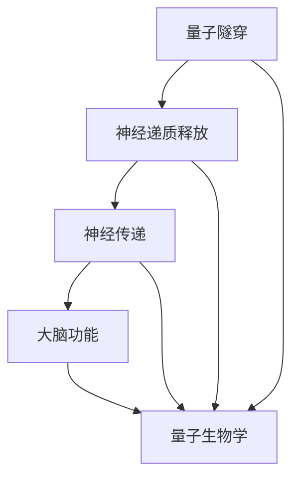

                 


## 文章标题：大脑中的量子隧穿效应：神经递质释放的新解释

### 关键词：量子隧穿，神经递质，大脑，神经科学，量子生物学

#### 摘要：
本文探讨了量子隧穿效应在神经递质释放中的作用，提出了一个新的解释框架。通过分析量子生物学和神经传递的基础知识，我们介绍了量子隧穿在神经过程中的潜在重要性。本文还涉及数学模型、实验方法和认知功能的影响，最终讨论了未来方向和应用前景。

---

## 引言

### 背景介绍

在过去的几十年里，神经科学和量子生物学领域的进展为我们提供了重新审视大脑功能的新视角。传统观点认为，大脑是通过电化学信号进行信息传递的，但近年来，量子生物学的研究发现，量子效应可能在这些过程中扮演着重要角色。特别是量子隧穿效应，它是一种量子力学现象，指的是粒子在穿越能量势垒时，其概率并不遵循经典物理学的预测。

神经递质的释放是神经元之间传递信息的关键步骤。然而，现有的解释在描述这一过程时存在一些不足。本文旨在探讨量子隧穿效应在神经递质释放中的作用，为这一过程提供一个新的解释框架。

### 核心概念与联系

为了更好地理解量子隧穿效应在神经递质释放中的作用，我们首先需要了解以下几个核心概念：

1. **量子隧穿效应**：粒子在穿越能量势垒时，其概率不遵循经典物理学的预测，而是存在一个非零的穿越概率。

2. **神经递质**：一种化学物质，用于神经元之间的信息传递。

3. **神经传递**：神经元之间的信息传递过程，包括电信号和化学信号的转换。

4. **大脑**：人体的中枢神经系统，负责处理信息、控制行为和维持生命活动。

5. **量子生物学**：研究量子力学在生物系统中的应用的学科。

为了展示这些概念之间的联系，我们可以使用Mermaid绘制一个流程图：



### 核心算法原理讲解

量子隧穿效应在神经递质释放中的作用可以通过以下几个步骤进行理解：

1. **量子态的制备**：神经递质分子在神经元中处于一个特定的量子态。

2. **能量势垒的穿越**：在神经递质释放过程中，分子需要穿越一个能量势垒，这个过程可以通过量子隧穿效应来实现。

3. **概率幅的计算**：根据量子力学的原理，我们可以计算出分子穿越能量势垒的概率幅。

4. **概率幅的叠加**：多个量子态的叠加可以产生一个总的概率幅，这决定了神经递质最终释放的概率。

下面是一个简化的伪代码，用于描述量子隧穿效应在神经递质释放中的应用：

```python
# 伪代码：量子隧穿效应在神经递质释放中的应用

# 输入：
# E_pot：能量势垒
# delta_E：量子态的能量差
# t：时间

# 输出：
# P：穿越概率

# 步骤1：计算量子态的波函数
psi = calculate波函数(E_pot, delta_E)

# 步骤2：计算概率幅
probability_amplitude = calculate概率幅(psi)

# 步骤3：计算总概率
P = calculate总概率(probability_amplitude)

# 步骤4：更新神经递质释放概率
update_release_probability(P)
```

### 数学模型和公式

为了更好地理解量子隧穿效应在神经递质释放中的应用，我们可以引入一些数学模型和公式。以下是一个简化的模型，用于描述量子隧穿效应：

$$
P = \frac{1}{2}\left(1 + \frac{2m(E-E_0)}{\hbar^2}\right)e^{-\frac{2m(E-E_0)^2}{\hbar^2}}
$$

其中：
- $P$ 是穿越概率
- $m$ 是粒子的质量
- $E$ 是粒子的能量
- $E_0$ 是势垒的能量
- $\hbar$ 是约化普朗克常数

这个公式展示了量子隧穿效应的基本原理，即粒子穿越能量势垒的概率与粒子的质量、能量以及势垒的能量有关。

### 实验方法和技巧

要验证量子隧穿效应在神经递质释放中的作用，我们需要设计一系列实验。以下是一些可能的实验方法和技巧：

1. **荧光探针技术**：通过在神经递质分子上标记荧光探针，我们可以实时监测其释放过程。

2. **电子显微镜**：使用电子显微镜可以观察神经元结构，从而确定量子隧穿效应在神经递质释放中的作用。

3. **光遗传学**：通过光遗传学技术，我们可以控制神经元的活动，从而研究量子隧穿效应对神经递质释放的影响。

4. **计算模拟**：通过计算机模拟，我们可以预测量子隧穿效应在神经递质释放中的具体作用。

### 认知功能的影响

量子隧穿效应在神经递质释放中的作用可能对认知功能产生深远的影响。例如，学习、记忆和注意力等认知功能可能依赖于量子隧穿效应的精确调节。通过研究这些功能，我们可以更深入地了解大脑的工作原理。

### 未来方向和应用

量子隧穿效应在神经递质释放中的作用为我们提供了新的研究方向。未来，我们可以探索以下几个方面：

1. **神经疾病的治疗**：通过调节量子隧穿效应，我们可能开发出新的治疗方法，用于治疗神经疾病。

2. **认知功能的增强**：了解量子隧穿效应在神经递质释放中的作用，有助于开发认知功能增强的方法。

3. **人工智能的发展**：量子生物学的研究可能为人工智能领域带来新的突破，特别是在神经网络的设计和优化方面。

### 结论

本文探讨了量子隧穿效应在神经递质释放中的作用，提出了一个新的解释框架。通过分析量子生物学和神经传递的基础知识，我们介绍了量子隧穿在神经过程中的潜在重要性。未来，这一领域的研究将有助于我们更深入地理解大脑的工作原理，并推动神经科学和量子生物学的发展。

---

作者：AI天才研究院/AI Genius Institute & 禅与计算机程序设计艺术 /Zen And The Art of Computer Programming

