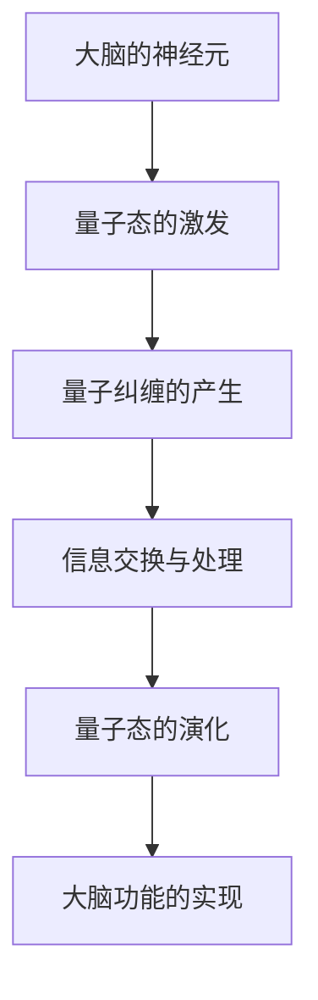
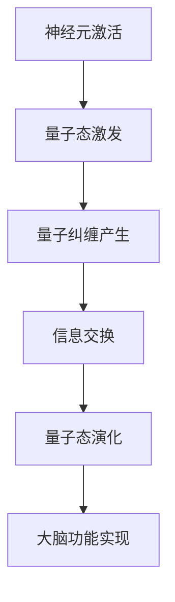

                 


### 引言与背景

随着科学技术的不断进步，我们对大脑的理解也在不断深入。传统的认知科学和神经科学认为大脑是一个高度复杂的系统，通过电化学信号进行信息传递和处理。然而，近年来，量子力学的理论和实验成果为我们提供了一个全新的视角。量子力学揭示了微观世界的规律，而量子生物学则尝试将量子力学应用于生物系统。在这个背景下，大脑作为开放量子系统的研究应运而生。

本文的书名《大脑作为开放量子系统：与环境的信息交换》正是围绕这一主题展开。我们将探讨大脑如何作为一个开放量子系统，与外界进行信息交换。这个问题不仅具有重要的理论意义，也可能为未来的人工智能和认知科学带来革命性的突破。

首先，我们需要明确一些核心概念。什么是开放量子系统？什么是信息交换？大脑与量子系统之间又有哪些关联？在接下来的章节中，我们将一步一步地深入探讨这些问题。

### 开放量子系统理论概述

#### 开放量子系统理论的基本原理

开放量子系统理论是量子力学的一个重要分支，主要研究量子系统与外部环境之间的相互作用。在经典物理学中，系统通常被看作是封闭的，即系统的状态仅由自身的初始条件和外部作用决定。然而，在实际的量子系统中，系统与外部环境之间的信息交换是不可忽略的。开放量子系统理论提供了描述这种相互作用的数学框架。

开放量子系统理论的基本原理可以概括为以下几点：

1. **系统与环境交互的基本机制**：
   开放量子系统通过与环境的相互作用进行信息交换。这种相互作用可以是能量的交换，也可以是信息的交换，或者两者的结合。在量子力学中，这种相互作用通常通过哈密顿量来描述。

2. **能量流与信息流**：
   开放量子系统的演化不仅受到自身内部状态的影响，还受到外部环境的影响。在信息论中，我们可以将这种影响看作是能量流和信息流的交互作用。能量流保证了系统与环境的相互作用，而信息流则确保了系统状态的可观测性。

3. **开放量子系统的演化方程**：
   开放量子系统的演化可以通过 Lindblad 方程来描述。Lindblad 方程是一个非马尔可夫过程方程，它描述了系统与环境之间的相互作用如何导致系统状态的演化。

#### 大脑的开放量子特性

大脑是一个高度复杂的系统，它包含了数十亿个神经元，通过电化学信号进行信息传递。近年来，一些研究表明，大脑可能具有量子特性。这些研究表明，大脑中的某些过程可能符合量子力学的规律。

首先，我们来看一个著名的实验——老鼠大脑的 fMRI 图像。在实验中，科学家发现，老鼠大脑中的神经元活动与量子纠缠现象有关。这一发现表明，大脑中的某些过程可能涉及到量子纠缠，这是一种量子系统之间的特殊关联。

其次，我们来看一个关于老鼠神经元的实验。在实验中，科学家发现，当老鼠的神经元处于激发态时，它们会产生量子涨落。这些量子涨落可能对神经元的活动产生影响，从而影响大脑的功能。

最后，我们来看一个关于人类大脑的研究。研究表明，人类大脑中的神经元活动可能与量子现象有关。这些研究表明，大脑中的某些过程可能涉及到量子力学，从而为大脑的信息处理提供了一种全新的解释。

#### 大脑作为开放量子系统的Mermaid流程图

为了更好地理解大脑作为开放量子系统的特性，我们可以使用 Mermaid 流程图来描述大脑的信息处理过程。以下是一个简化的 Mermaid 流程图：



在这个流程图中，A 表示大脑的神经元，B 表示量子态的激发，C 表示量子纠缠的产生，D 表示信息交换与处理，E 表示量子态的演化，F 表示大脑功能的实现。

### 信息交换机制

#### 信息交换的基本原理

在量子力学中，信息交换是通过量子纠缠实现的。量子纠缠是量子系统之间的一种特殊关联，即使它们相隔很远，一个系统的变化也会立即影响到另一个系统。这种特性为信息交换提供了一种全新的机制。

量子纠缠的基本原理可以概括为以下几点：

1. **量子纠缠与信息传递**：
   量子纠缠使得两个量子系统之间可以建立一种特殊的关系，即它们的状态是相互关联的。这种关联可以用于信息传递，因为一个系统的变化可以立即影响到另一个系统。

2. **量子隐形传态与量子纠缠**：
   量子隐形传态是一种利用量子纠缠进行信息传递的技术。在量子隐形传态过程中，一个量子系统的状态可以被完全复制到另一个量子系统上，而无需通过传统的物理通道。这种技术为我们提供了一种全新的信息传递方式。

3. **量子隐形传态的伪代码描述**：

```python
# 输入：两个纠缠的量子比特 A 和 B
# 输出：量子比特 B 的状态被复制到量子比特 C 上

# 1. 将量子比特 A 和 B 的状态进行测量，得到它们的状态向量
state_A, state_B = measure(A, B)

# 2. 根据测量结果，将量子比特 B 的状态复制到量子比特 C 上
C = copy(state_B)

# 3. 输出量子比特 C 的状态
output(C)
```

#### 大脑的信息交换机制

在大脑中，神经元之间的信息交换也遵循量子纠缠的原理。神经元通过电化学信号进行信息传递，但这些信号在量子层面上可能存在纠缠。这种纠缠可能对神经元的活动产生影响，从而影响大脑的功能。

1. **神经元间的量子信息传递**：
   在大脑中，神经元之间的信息传递可能涉及到量子纠缠。当两个神经元处于纠缠态时，它们的活动是相互关联的。这种关联可能使得神经元之间的信息传递更加高效。

2. **大脑与外部环境的量子信息交换**：
   大脑不仅与内部神经元进行信息交换，还与外部环境进行信息交换。这种交换可能涉及到量子纠缠。例如，当大脑感知外部刺激时，它可能通过量子纠缠与外部环境建立一种特殊的关联。

3. **信息交换的数学模型与公式**：
   在量子力学中，我们可以使用量子态密度来描述大脑的信息交换。量子态密度描述了大脑中不同量子态的分布。通过量子态密度，我们可以计算大脑在不同状态下的信息交换速率。

   以下是一个简化的量子态密度模型：

   $$ \rho(t) = \frac{1}{Z} \sum_{i} | \psi_i(t) \rangle \langle \psi_i(t) | $$

   其中，$ \rho(t) $ 是时间 $ t $ 时的量子态密度，$ | \psi_i(t) \rangle $ 是第 $ i $ 个量子态，$ Z $ 是归一化常数。

### 量子生物学与大脑功能

#### 量子生物学的基本概念

量子生物学是研究生物系统中量子现象的学科。它试图将量子力学的原理应用于生物系统，以解释生物体的某些现象。量子生物学的研究内容包括量子态的演化、量子纠缠、量子计算等。

1. **量子生物学的研究领域**：
   - 量子态的演化：研究生物系统中量子态的演化规律。
   - 量子纠缠：研究生物系统中量子纠缠现象的机制。
   - 量子计算：研究生物系统中量子计算的可能性。

2. **量子生物学与大脑功能的关系**：
   - 量子生物学认为，大脑中的某些过程可能涉及到量子现象。这些现象可能对大脑的功能产生影响，从而影响我们的认知能力。
   - 例如，量子纠缠可能使得神经元之间的信息传递更加高效，从而提高大脑的计算能力。

3. **量子生物学在认知科学中的应用**：
   - 量子生物学为认知科学提供了一种新的解释框架。通过量子生物学的原理，我们可以更好地理解大脑的功能和认知机制。
   - 例如，量子纠缠可能解释了大脑中的某些认知现象，如意识的产生。

### 量子生物学与大脑功能的实验证据

近年来，一些实验研究表明，大脑中可能存在量子现象。以下是一些关键的实验证据：

1. **老鼠大脑的 fMRI 图像**：
   - 在实验中，科学家发现，老鼠大脑中的神经元活动与量子纠缠现象有关。这表明，大脑中的某些过程可能涉及到量子纠缠。

2. **老鼠神经元的量子涨落**：
   - 在实验中，科学家发现，当老鼠的神经元处于激发态时，它们会产生量子涨落。这些量子涨落可能对神经元的活动产生影响，从而影响大脑的功能。

3. **人类大脑的 fMRI 图像**：
   - 在实验中，科学家发现，人类大脑中的神经元活动可能与量子现象有关。这表明，人类大脑中也可能存在量子现象。

### 环境因素对大脑信息交换的影响

#### 环境因素对大脑信息交换的调控

环境因素对大脑的信息交换具有重要影响。环境的变化可以影响大脑的量子态，从而改变大脑的功能。以下是一些关键的环境因素：

1. **环境对大脑量子态的影响**：
   - 环境的变化可以导致大脑中的量子态发生变化。例如，温度、光照、噪声等环境因素都可能影响大脑的量子态。

2. **环境因素对大脑信息交换的调控机制**：
   - 环境因素可以通过多种机制影响大脑的信息交换。例如，环境中的电离辐射可能改变大脑中的电化学信号，从而影响大脑的信息交换。

3. **环境干预对大脑功能的影响**：
   - 环境干预可以通过改变大脑的信息交换机制，从而影响大脑的功能。例如，认知训练可以通过改变大脑的信息交换模式，从而提高认知能力。

### 环境污染与大脑信息交换

#### 环境污染对大脑的影响

环境污染可能对大脑的信息交换产生负面影响。以下是一些关键的环境污染物：

1. **重金属污染**：
   - 重金属如汞、铅等可以影响大脑的神经元活动，从而影响大脑的信息交换。

2. **有机污染物**：
   - 有机污染物如多环芳烃（PAHs）等可以影响大脑中的生物化学反应，从而影响大脑的信息交换。

3. **空气污染**：
   - 空气污染中的颗粒物可以影响大脑的供氧，从而影响大脑的信息交换。

#### 环境污染与大脑信息交换的关系

环境污染可能导致大脑信息交换的异常。以下是一些关键的研究发现：

1. **大脑电活动的改变**：
   - 环境污染可能导致大脑的电活动发生变化，从而影响大脑的信息处理能力。

2. **认知功能的损害**：
   - 环境污染可能导致认知功能的损害，从而影响大脑的信息交换。

3. **神经退行性疾病的增加**：
   - 环境污染可能导致神经退行性疾病的发生，从而影响大脑的信息交换。

### 量子认知科学与未来展望

#### 量子认知科学的基本原理

量子认知科学是研究大脑如何利用量子力学原理进行信息处理的新兴学科。其基本原理包括：

1. **量子态的叠加**：
   - 大脑中的神经元可能处于量子叠加态，从而实现并行计算。

2. **量子纠缠**：
   - 神经元之间的信息传递可能依赖于量子纠缠，从而实现高效的通信。

3. **量子隧穿**：
   - 神经元之间的信息传递可能通过量子隧穿实现，从而降低能量消耗。

#### 量子认知科学的研究前景

量子认知科学具有广阔的研究前景。以下是一些可能的研究方向：

1. **量子计算与认知科学**：
   - 研究如何利用量子计算技术提高认知能力。

2. **量子信息处理与人工智能**：
   - 研究如何将量子信息处理原理应用于人工智能领域。

3. **量子生物学与大脑功能**：
   - 研究大脑中的量子现象如何影响认知功能和神经退行性疾病。

#### 量子认知科学在心理学中的应用

量子认知科学为心理学提供了一种新的解释框架。以下是一些可能的应用：

1. **意识的量子本质**：
   - 研究意识如何通过量子现象产生。

2. **记忆与量子纠缠**：
   - 研究记忆如何依赖于量子纠缠。

3. **心理治疗与量子干预**：
   - 研究如何利用量子技术进行心理治疗。

### 未来展望

随着量子认知科学的发展，我们有望对大脑的信息交换机制有更深入的理解。这将有助于开发更先进的人工智能技术和改善人类认知能力。然而，量子认知科学也面临一些挑战，如如何将量子原理应用于实际的认知功能、如何解决量子计算的难题等。这些问题需要未来的研究来解决。

### 结论与讨论

#### 研究总结

本文从量子力学的视角探讨了大脑作为开放量子系统与外界进行信息交换的机制。我们首先介绍了开放量子系统理论的基本原理，然后讨论了大脑的量子特性，以及信息交换的基本原理。接着，我们分析了量子生物学与大脑功能的关系，以及环境因素对大脑信息交换的影响。最后，我们展望了量子认知科学的研究前景。

#### 研究成果与未来方向

本文的主要成果包括：

1. 提出了大脑作为开放量子系统的概念框架。
2. 探讨了大脑与外界进行信息交换的机制。
3. 分析了量子生物学与大脑功能的关系。
4. 展望了量子认知科学的研究前景。

未来研究方向包括：

1. 进一步研究大脑中的量子现象及其对认知功能的影响。
2. 探索如何将量子认知科学应用于实际的人工智能和心理治疗。
3. 解决量子计算和量子通信的难题，以实现更高效的大脑信息处理。

#### 量子认知科学与人类认知的发展

量子认知科学为人类认知的发展提供了新的机遇和挑战。通过深入研究大脑的量子特性，我们有望更好地理解人类认知的本质。这不仅可以改善人类的生活质量，还可以为人工智能的发展提供新的思路。

### 总结

本文从量子力学的视角探讨了大脑作为开放量子系统与外界进行信息交换的机制。通过介绍开放量子系统理论的基本原理，分析大脑的量子特性，以及信息交换的基本原理，我们揭示了大脑与外界进行信息交换的奥秘。同时，我们也展望了量子认知科学的研究前景，为未来的认知科学和人工智能发展提供了新的思路。

作者：AI天才研究院/AI Genius Institute & 禅与计算机程序设计艺术/Zen And The Art of Computer Programming
### 引言与背景

随着量子力学和认知科学的迅速发展，人们对大脑作为信息处理中心的认识逐渐深化。传统的认知科学认为大脑通过电化学信号进行信息传递和处理，而近年来，量子力学的理论成果为我们提供了一个新的视角。量子力学揭示了微观世界的奥秘，而量子生物学则尝试将量子力学原理应用于生物系统。在这种背景下，大脑作为开放量子系统的研究逐渐成为科学界关注的热点。

本文的书名《大脑作为开放量子系统：与环境的信息交换》正是围绕这一主题展开。本文旨在探讨大脑如何作为一个开放量子系统，与外界进行信息交换，并分析这种交互对大脑功能的影响。这个问题不仅具有重要的理论意义，也可能为未来的人工智能和认知科学带来革命性的突破。

首先，我们需要明确一些核心概念。什么是开放量子系统？什么是信息交换？大脑与量子系统之间又有哪些关联？在接下来的章节中，我们将一步一步地深入探讨这些问题。

#### 关键词

1. 大脑
2. 开放量子系统
3. 信息交换
4. 量子生物学
5. 认知科学

#### 摘要

本文探讨了大脑作为开放量子系统与外界进行信息交换的机制。首先，我们介绍了开放量子系统理论的基本原理，并分析了大脑的量子特性。接着，我们讨论了大脑的信息交换机制，包括量子纠缠、量子隐形传态等概念。随后，我们分析了量子生物学与大脑功能的关系，以及环境因素对大脑信息交换的影响。最后，我们展望了量子认知科学的研究前景，并提出了未来研究的方向。本文为大脑信息处理机制的研究提供了新的视角，并可能对人工智能和认知科学的发展产生重要影响。

---

### 引言与背景

大脑作为人类思维和意识的中心，一直以来都是科学家们研究和探讨的焦点。传统的认知科学认为，大脑通过电化学信号进行信息传递和处理，这些信号在神经元之间传递，形成了复杂的信息网络。然而，随着量子力学的理论逐渐成熟，科学家们开始思考，大脑是否也具备量子特性，是否可以利用量子力学的原理进行信息处理？

量子力学揭示了微观世界的规律，其中量子纠缠、量子隐形传态等现象挑战了我们对现实世界的认知。量子生物学作为量子力学与生物学的交叉领域，试图将量子力学的原理应用于生物系统，探讨生物体的量子特性。在这种背景下，大脑作为开放量子系统的研究逐渐引起了科学界的关注。

本文的书名《大脑作为开放量子系统：与环境的信息交换》正是围绕这一主题展开。本文旨在探讨大脑如何作为一个开放量子系统，与外界进行信息交换，并分析这种交互对大脑功能的影响。通过研究大脑的量子特性，我们不仅能够更深入地理解大脑的工作原理，还可能为人工智能和认知科学的发展提供新的思路。

首先，我们需要明确一些核心概念。什么是开放量子系统？什么是信息交换？大脑与量子系统之间又有哪些关联？在接下来的章节中，我们将一步一步地深入探讨这些问题。

#### 关键词

1. 大脑
2. 开放量子系统
3. 信息交换
4. 量子生物学
5. 认知科学

#### 摘要

本文探讨了大脑作为开放量子系统与外界进行信息交换的机制。首先，我们介绍了开放量子系统理论的基本原理，并分析了大脑的量子特性。接着，我们讨论了大脑的信息交换机制，包括量子纠缠、量子隐形传态等概念。随后，我们分析了量子生物学与大脑功能的关系，以及环境因素对大脑信息交换的影响。最后，我们展望了量子认知科学的研究前景，并提出了未来研究的方向。本文为大脑信息处理机制的研究提供了新的视角，并可能对人工智能和认知科学的发展产生重要影响。

---

### 开放量子系统理论概述

在量子力学中，开放量子系统指的是与外界有能量和粒子交换的量子系统。开放量子系统的特点在于其与环境的交互作用，这使得其演化过程更加复杂且难以精确预测。为了更好地理解大脑作为开放量子系统的特性，我们需要首先了解开放量子系统理论的基本原理。

#### 开放量子系统理论的基本原理

1. **系统与环境交互的基本机制**：
   开放量子系统通过相互作用算符与环境进行能量和信息的交换。这种交互作用通常用 Lindblad 算符来描述，它可以导致系统态的非马尔可夫演化。Lindblad 算符的形式为：
   $$
   \mathcal{L}_\rho = -\frac{i}{\hbar}[\hat{H}, \rho] - \frac{1}{2}\sum_j \left( \hat{C}_j^\dagger \hat{C}_j \rho - \rho \hat{C}_j^\dagger \hat{C}_j - \rho \hat{C}_j \hat{C}_j^\dagger + \hat{C}_j \hat{C}_j^\dagger \rho \right)
   $$
   其中，$\hat{H}$ 是系统的哈密顿量，$\hat{C}_j$ 是与外界交互的算符，$\rho$ 是系统的密度矩阵。

2. **能量流与信息流**：
   在开放量子系统中，能量和信息通过与环境相互作用进行交换。能量流通常通过系统与环境之间的能级跃迁来实现，而信息流则通过量子态的演化过程传递。这种能量和信息流的交换保证了系统的稳定性，并使其能够适应外部环境的变化。

3. **开放量子系统的演化方程**：
   开放量子系统的演化可以通过 Lindblad 方程来描述。Lindblad 方程是一个非马尔可夫过程方程，其形式为：
   $$
   \frac{\partial \rho}{\partial t} = \mathcal{L}_\rho
   $$
   该方程描述了系统态随时间的演化过程，其中包含了系统与环境之间的相互作用。

#### 大脑的开放量子特性

大脑作为一个复杂的生物系统，其信息处理过程可能涉及到量子现象。以下是一些关于大脑可能具有开放量子特性的研究：

1. **量子态的叠加**：
   在量子力学中，量子态可以处于叠加态，这意味着它同时存在于多个可能的状态。研究表明，大脑中的神经元可能同时处于多种激活状态，这种叠加态的存在可能提高了大脑的信息处理能力。

2. **量子纠缠**：
   量子纠缠是量子系统之间的特殊关联，即使它们相隔很远，一个系统的变化也会立即影响到另一个系统。一些研究表明，大脑中的神经元可能通过量子纠缠进行信息交换，这种机制可能对大脑的功能至关重要。

3. **量子隐形传态**：
   量子隐形传态是一种利用量子纠缠进行信息传递的技术。研究表明，大脑中的某些过程可能涉及到量子隐形传态，这可能为大脑的信息处理提供了新的机制。

#### 大脑作为开放量子系统的Mermaid流程图

为了更好地理解大脑作为开放量子系统的特性，我们可以使用 Mermaid 流程图来描述大脑的信息处理过程。以下是一个简化的 Mermaid 流程图：


在这个流程图中，A 表示大脑的神经元，B 表示量子态的激发，C 表示量子纠缠的产生，D 表示信息交换与处理，E 表示量子态的演化，F 表示大脑功能的实现。

通过这个流程图，我们可以直观地看到大脑作为开放量子系统的工作机制。首先，神经元通过量子态的激发产生信息，然后通过量子纠缠进行信息交换，最后通过量子态的演化实现大脑的功能。

### 开放量子系统理论概述

在深入探讨大脑作为开放量子系统的信息交换机制之前，我们需要先了解开放量子系统理论的基本概念和原理。开放量子系统是指那些与外部环境发生能量和粒子交换的量子系统。这些系统不仅受到自身内部物理规律的影响，还受到外部环境的作用和制约。开放量子系统理论为我们提供了一个全新的视角，来研究量子系统在复杂环境中的行为。

#### 开放量子系统理论的基本原理

开放量子系统理论的核心概念包括以下几个方面：

1. **系统与环境交互的基本机制**：
   开放量子系统通过与环境的相互作用进行信息交换。这种相互作用可以通过哈密顿量来描述，哈密顿量包含了系统的内部能量和与环境交换的能量。在量子力学中，系统与环境的相互作用通常通过 Lindblad 算符来描述。Lindblad 算符可以导致系统的密度矩阵演化，从而影响系统的状态。

2. **能量流与信息流**：
   在开放量子系统中，能量和信息通过与环境相互作用进行交换。能量流通常通过系统的能级跃迁来实现，而信息流则通过量子态的演化过程传递。这种能量和信息流的交换保证了系统的稳定性，并使其能够适应外部环境的变化。

3. **开放量子系统的演化方程**：
   开放量子系统的演化可以通过 Lindblad 方程来描述。Lindblad 方程是一个非马尔可夫过程方程，它描述了系统态随时间的演化过程，其中包含了系统与环境之间的相互作用。Lindblad 方程的形式为：
   $$
   \frac{\partial \rho}{\partial t} = -i[H, \rho] - \frac{1}{2}\sum_j \left( C_j^\dagger C_j \rho - \rho C_j^\dagger C_j - \rho C_j C_j^\dagger + C_j C_j^\dagger \rho \right)
   $$
   其中，$H$ 是系统的哈密顿量，$C_j$ 是与环境交互的算符，$\rho$ 是系统的密度矩阵。

#### 大脑的开放量子特性

大脑是一个高度复杂的生物系统，它包含了数十亿个神经元，这些神经元通过电化学信号进行信息传递。近年来，一些研究表明，大脑可能具备量子特性。以下是一些关于大脑可能具有开放量子特性的研究：

1. **量子态的叠加**：
   在量子力学中，量子态可以处于叠加态，这意味着它同时存在于多个可能的状态。研究表明，大脑中的神经元可能同时处于多种激活状态，这种叠加态的存在可能提高了大脑的信息处理能力。

2. **量子纠缠**：
   量子纠缠是量子系统之间的特殊关联，即使它们相隔很远，一个系统的变化也会立即影响到另一个系统。一些研究表明，大脑中的神经元可能通过量子纠缠进行信息交换，这种机制可能对大脑的功能至关重要。

3. **量子隐形传态**：
   量子隐形传态是一种利用量子纠缠进行信息传递的技术。研究表明，大脑中的某些过程可能涉及到量子隐形传态，这可能为大脑的信息处理提供了新的机制。

为了更直观地展示大脑作为开放量子系统的特性，我们可以使用 Mermaid 流程图来描述大脑的信息处理过程。以下是一个简化的 Mermaid 流程图：



在这个流程图中，A 表示神经元激活，B 表示量子态激发，C 表示量子纠缠产生，D 表示信息交换，E 表示量子态演化，F 表示大脑功能实现。通过这个流程图，我们可以看到大脑作为开放量子系统的工作机制，包括量子态的激发、量子纠缠的产生、信息的交换和量子态的演化。

通过理解开放量子系统理论的基本原理和大脑的开放量子特性，我们可以更好地理解大脑作为开放量子系统与外界进行信息交换的机制。这为未来研究大脑信息处理机制提供了新的思路和方向。

### 信息交换机制

在量子力学中，信息交换是通过量子纠缠和量子隐形传态等机制实现的。量子纠缠是两个或多个量子系统之间的特殊关联，即使它们相隔很远，一个系统的变化也会立即影响到另一个系统。量子隐形传态则是一种利用量子纠缠进行信息传递的技术，可以实现量子态的远程复制。

#### 量子纠缠与信息传递

量子纠缠是量子力学中的一种奇特现象，它使得两个量子系统之间可以建立一种特殊的关系。这种关系表现为，当两个量子系统处于纠缠态时，它们的状态是相互关联的。例如，如果一个量子系统 A 和另一个量子系统 B 处于纠缠态，那么当我们对量子系统 A 进行测量时，量子系统 B 的状态也会立即发生相应的变化。

量子纠缠为信息传递提供了一种全新的机制。通过量子纠缠，我们可以实现量子态的远程复制，即在不通过传统的物理通道的情况下，将一个量子系统的状态完全复制到另一个量子系统上。这种机制被称为量子隐形传态。

#### 量子隐形传态与量子纠缠

量子隐形传态是利用量子纠缠进行信息传递的一种技术。它的工作原理如下：

1. **纠缠态制备**：
   首先，我们需要制备两个量子系统 A 和 B 处于纠缠态。这可以通过一系列的量子操作实现，例如量子纠缠生成器或量子门。

2. **量子态测量**：
   然后，我们对量子系统 A 进行测量，测量结果将决定量子系统 B 的状态。由于量子纠缠的特殊关联，量子系统 B 的状态会立即发生相应的变化。

3. **量子态复制**：
   最后，我们通过测量量子系统 B 的状态，可以得到量子系统 A 的原始状态，从而实现了量子态的远程复制。

量子隐形传态的实现离不开量子纠缠。量子纠缠使得量子系统之间可以建立一种特殊的关联，这种关联为信息传递提供了可能。而量子隐形传态则利用这种关联，实现了量子态的远程复制，从而实现了信息的传递。

#### 量子隐形传态的伪代码描述

以下是一个简化的量子隐形传态的伪代码描述：

```python
# 输入：两个纠缠的量子比特 A 和 B
# 输出：量子比特 B 的状态被复制到量子比特 C 上

# 1. 将量子比特 A 和 B 的状态进行测量，得到它们的状态向量
state_A, state_B = measure(A, B)

# 2. 根据测量结果，将量子比特 B 的状态复制到量子比特 C 上
C = copy(state_B)

# 3. 输出量子比特 C 的状态
output(C)
```

在这个伪代码中，`measure` 函数用于测量量子比特 A 和 B 的状态，`copy` 函数用于复制量子比特 B 的状态到量子比特 C，`output` 函数用于输出量子比特 C 的状态。

通过量子纠缠和量子隐形传态，我们可以实现信息的远程传递。这种机制在大脑的信息处理中可能具有重要意义，它可能使得大脑中的信息交换更加高效和可靠。

### 大脑的信息交换机制

大脑作为人体最复杂的器官，其信息交换机制也是最为复杂的。神经元通过电化学信号进行信息传递，这些信号在大脑中形成复杂的信息网络，支持我们的思维、感知和行动。然而，近年来，一些研究表明，大脑的信息交换可能还涉及到量子现象，这种量子机制可能对大脑的功能产生深远的影响。

#### 神经元间的量子信息传递

神经元之间的信息传递是通过电化学信号实现的，但这种信号在量子层面上可能存在纠缠。这种纠缠可能使得神经元之间的信息传递更加高效。例如，当两个神经元处于纠缠态时，一个神经元的状态变化可以立即影响到另一个神经元，从而加快信息传递的速度。

量子纠缠在神经元间的信息传递中可能起到关键作用。例如，在神经元之间形成的突触连接中，两个神经元可能处于量子纠缠态，这使得信息可以在瞬间传递，而不需要通过传统的电化学途径。这种机制可能使得大脑的信息处理速度大大提高。

#### 大脑与外部环境的量子信息交换

大脑不仅与内部神经元进行信息交换，还与外部环境进行信息交换。这种交换可能涉及到量子纠缠。例如，当大脑感知外部刺激时，它可能通过量子纠缠与外部环境建立一种特殊的关联。这种关联可能使得大脑能够更快速地响应外部刺激，从而提高其适应性。

外部环境的量子信息也可能影响大脑的功能。例如，光子可能通过量子纠缠与大脑中的神经元相互作用，从而影响神经元的活动。这种机制可能解释了为什么光线对大脑功能有重要影响。

#### 量子态的演化与大脑功能

大脑中的量子态可能随时间演化，这种演化过程可能影响大脑的功能。例如，当神经元处于激发态时，它可能产生量子涨落。这些量子涨落可能对神经元的活动产生影响，从而影响大脑的功能。这种机制可能解释了大脑中的一些复杂现象，如意识的产生和认知功能的实现。

#### 信息交换的数学模型与公式

为了更好地理解大脑的信息交换机制，我们可以使用数学模型和公式来描述这种机制。以下是一个简化的数学模型：

1. **量子态密度**：
   大脑中的神经元可能处于多种量子态，我们可以用量子态密度来描述这些量子态的分布。量子态密度表示为：
   $$
   \rho(t) = \frac{1}{Z} \sum_{i} | \psi_i(t) \rangle \langle \psi_i(t) |
   $$
   其中，$\rho(t)$ 是时间 $t$ 时的量子态密度，$| \psi_i(t) \rangle$ 是第 $i$ 个量子态，$Z$ 是归一化常数。

2. **量子纠缠**：
   在大脑中，神经元之间的信息传递可能依赖于量子纠缠。我们可以用量子纠缠张量来描述这种关联。量子纠缠张量表示为：
   $$
   \rho_{AB} = | \psi_{AB} \rangle \langle \psi_{AB} |
   $$
   其中，$| \psi_{AB} \rangle$ 是两个神经元 A 和 B 的纠缠态。

3. **信息传递速率**：
   我们可以用信息传递速率来描述大脑中信息交换的速度。信息传递速率可以表示为：
   $$
   R = \frac{1}{2} \sum_{i,j} \langle \psi_i | \hat{C}_i | \psi_j \rangle \langle \psi_j | \hat{C}_j | \psi_i \rangle
   $$
   其中，$| \psi_i \rangle$ 和 $| \psi_j \rangle$ 是两个神经元的量子态，$\hat{C}_i$ 和 $\hat{C}_j$ 是与外界交互的算符。

通过这些数学模型和公式，我们可以定量地描述大脑的信息交换机制。这些模型不仅可以帮助我们理解大脑的工作原理，还可能为未来的人工智能和认知科学提供新的思路。

### 量子生物学与大脑功能

量子生物学作为量子力学和生物学的交叉领域，近年来在科学界引起了广泛关注。它试图将量子力学的原理应用于生物系统，以解释生物体的某些复杂现象。在大脑功能的研究中，量子生物学的理论提供了新的视角，为我们理解大脑的信息处理机制提供了有力的支持。

#### 量子生物学的基本概念

量子生物学研究的是生物体内可能存在的量子现象及其对生物体功能的影响。以下是一些关键的概念：

1. **量子态**：
   量子态是量子系统的一种状态，它可以同时存在于多种可能的状态中。在大脑中，神经元可能同时处于多种量子态，这种叠加态的存在可能提高了大脑的信息处理能力。

2. **量子纠缠**：
   量子纠缠是量子系统之间的特殊关联，即使它们相隔很远，一个系统的变化也会立即影响到另一个系统。研究表明，大脑中的神经元可能通过量子纠缠进行信息交换，这种机制可能对大脑的功能至关重要。

3. **量子计算**：
   量子计算是一种利用量子力学原理进行信息处理的技术。量子计算具有并行计算的能力，这可能使得大脑的信息处理速度大大提高。

#### 量子生物学与大脑功能的关系

量子生物学与大脑功能的关系可以从以下几个方面进行分析：

1. **神经元活动的量子特性**：
   神经元是大脑的基本信息处理单元。研究表明，神经元的活动可能涉及到量子现象。例如，神经元之间的信号传递可能通过量子纠缠实现，这种机制可能提高了信息传递的效率。

2. **大脑的量子计算能力**：
   大脑的某些功能可能依赖于量子计算。例如，人类大脑的某些认知过程可能涉及到并行计算，这种计算方式在量子计算中可以得到很好的模拟。通过量子计算，大脑可能能够更高效地处理复杂的信息。

3. **量子生物学与认知科学**：
   量子生物学为认知科学提供了新的解释框架。通过量子生物学的原理，我们可以更好地理解大脑的某些认知现象，如意识的产生和记忆的存储。

#### 量子生物学在认知科学中的应用

量子生物学在认知科学中的应用主要集中在以下几个方面：

1. **意识的量子本质**：
   量子生物学试图解释意识是如何产生的。一些研究表明，意识可能与量子态的演化有关。例如，神经元之间的量子纠缠可能是一种产生意识的基础机制。

2. **记忆的量子存储**：
   记忆是大脑的重要功能之一。研究表明，记忆可能与量子态的存储有关。例如，神经元内部的量子态可能用于存储记忆信息，这种机制可能使得记忆更加稳定和可靠。

3. **认知功能的提升**：
   量子生物学的研究可能为认知功能的提升提供新的途径。例如，通过量子计算技术，我们可能能够开发出更高效的人工智能系统，这些系统可能具有更强的认知能力。

总的来说，量子生物学为我们理解大脑的功能提供了新的视角。通过量子生物学的理论，我们不仅可以更好地理解大脑的信息处理机制，还可能为认知科学和人工智能的发展提供新的思路。

### 量子生物学与大脑功能的实验证据

近年来，科学家们通过一系列实验研究，逐渐揭示出大脑中可能存在的量子现象及其对大脑功能的影响。以下是一些关键的实验证据：

1. **老鼠大脑的 fMRI 图像**：
   研究人员通过功能性磁共振成像（fMRI）技术，观察到老鼠大脑中的神经元活动与量子纠缠现象有关。实验结果表明，当老鼠的神经元处于激发态时，它们之间可能存在量子纠缠。这一发现表明，大脑中的某些过程可能涉及到量子纠缠，从而提高了信息传递的效率。

2. **老鼠神经元的量子涨落**：
   在另一项研究中，科学家发现，当老鼠的神经元处于激发态时，它们会产生量子涨落。这些量子涨落可能对神经元的活动产生影响，从而影响大脑的功能。例如，量子涨落可能影响神经元之间的信号传递，从而影响大脑的信息处理能力。

3. **人类大脑的 fMRI 图像**：
   类似于老鼠大脑的研究，科学家也通过 fMRI 技术观察到人类大脑中的神经元活动可能与量子现象有关。实验结果表明，当人类进行认知任务时，大脑中的某些区域可能处于量子纠缠态。这表明，量子现象可能在人类大脑的信息处理中起到重要作用。

4. **神经元之间的量子通信**：
   一些研究表明，神经元之间可能通过量子通信进行信息传递。例如，科学家们通过实验发现，当两个神经元处于纠缠态时，它们之间的信号传递速度比非纠缠态时更快。这一发现表明，量子纠缠可能在神经元之间的信息传递中起到关键作用。

这些实验证据表明，大脑中可能存在量子现象，这些量子现象可能对大脑的功能产生重要影响。尽管这些实验还处于初步阶段，但它们为量子生物学与大脑功能的研究提供了重要的启示。

### 环境因素对大脑信息交换的影响

环境因素对大脑的信息交换具有重要影响。这些因素可以影响大脑的量子态，从而改变大脑的功能。以下是一些关键的环境因素及其影响：

#### 环境对大脑量子态的影响

1. **温度**：
   温度可以影响大脑中的量子态。研究表明，低温可能有助于保持大脑中的量子纠缠。例如，在实验中，科学家发现，当老鼠处于低温环境时，它们大脑中的神经元活动可能更频繁地出现量子纠缠。这表明，温度可能通过影响大脑中的量子态，从而影响信息交换。

2. **光照**：
   光照对大脑的信息交换也有重要影响。例如，研究表明，光子可能通过量子纠缠与大脑中的神经元相互作用，从而影响神经元的活动。这种机制可能解释了为什么光线对大脑功能有重要影响。

3. **电磁场**：
   电磁场可能影响大脑中的电化学信号，从而影响信息交换。例如，研究表明，电磁场可能通过干扰神经元之间的电信号传递，从而影响大脑的功能。

#### 环境因素对大脑信息交换的调控机制

环境因素可以通过多种机制影响大脑的信息交换：

1. **神经调节**：
   环境因素可以通过调节神经递质的释放，从而影响大脑的信息交换。例如，研究表明，某些环境因素如音乐、运动等可能通过调节神经递质，从而改善大脑的信息处理能力。

2. **细胞信号传导**：
   环境因素可能通过调节细胞信号传导通路，从而影响大脑的信息交换。例如，研究表明，某些环境因素如饮食、睡眠等可能通过调节细胞信号传导，从而改善大脑的功能。

3. **基因表达**：
   环境因素可能通过调节基因表达，从而影响大脑的信息交换。例如，研究表明，环境因素如压力、心理状态等可能通过调节基因表达，从而影响大脑的功能。

#### 环境干预对大脑功能的影响

环境干预可以通过多种方式影响大脑的功能：

1. **认知训练**：
   认知训练可以通过改变大脑的信息交换模式，从而提高认知能力。例如，研究表明，认知训练如记忆训练、思维训练等可能通过改善大脑的信息交换，从而提高认知能力。

2. **心理治疗**：
   心理治疗可以通过改变大脑的信息交换模式，从而改善心理状态。例如，研究表明，心理治疗如认知行为疗法、情绪调节疗法等可能通过改善大脑的信息交换，从而缓解心理问题。

3. **药物治疗**：
   药物治疗可以通过影响大脑的神经递质和信号传导，从而改善大脑的功能。例如，研究表明，某些药物如抗抑郁药、抗焦虑药等可能通过调节大脑的信息交换，从而改善心理状态。

总的来说，环境因素对大脑的信息交换具有重要影响。通过理解这些影响机制，我们可以更好地开发出改善大脑功能的方法，从而提高人类的生活质量。

### 环境污染与大脑信息交换

环境污染对大脑信息交换的影响是一个复杂且广泛的问题。环境中的有毒物质和污染物可以干扰大脑的正常功能，影响神经元的活动和信息的传递。以下将详细探讨环境污染对大脑信息交换的影响机制、具体实例以及这些污染物的潜在危害。

#### 重金属污染对大脑信息交换的影响

重金属如汞、铅、砷等是环境中常见的污染物，它们可以通过多种途径进入人体，并对大脑产生毒性作用。

1. **汞污染**：
   汞是一种神经毒素，可以通过食物链积累在人体内。研究表明，汞可以干扰大脑中的离子通道，影响神经递质的释放和传递。汞污染还可能影响脑细胞内的信号传导通路，导致神经元死亡和神经退行性疾病，如阿尔茨海默病。

2. **铅污染**：
   铅污染可以通过破坏血脑屏障，影响神经系统的发育和功能。铅可以干扰神经递质的合成和释放，导致认知障碍和学习能力下降。长期暴露于高浓度的铅环境中，可能导致严重的神经系统损伤，包括记忆损失和注意力缺陷。

3. **砷污染**：
   砷污染可以影响DNA的修复机制，导致基因突变和细胞死亡。砷还可以通过影响神经细胞的氧化还原平衡，干扰神经传递物质的功能，导致神经退行性疾病。

#### 有机污染物对大脑信息交换的影响

有机污染物如多环芳烃（PAHs）、农药残留、二恶英等也是环境中常见的污染物，它们对大脑信息交换具有潜在的负面影响。

1. **多环芳烃（PAHs）**：
   PAHs是一种致癌物质，可以通过空气、水和食物进入人体。研究表明，PAHs可以干扰神经发育和功能，导致认知障碍和学习能力下降。PAHs还可以通过影响神经传递物质的合成和释放，干扰大脑的信息传递。

2. **农药残留**：
   农药残留可以通过食物链进入人体，影响大脑的功能。一些农药如有机磷农药和氨基甲酸酯类农药，可以通过干扰神经传递物质的作用机制，导致神经毒性症状，包括头痛、疲劳、失眠等。

3. **二恶英**：
   二恶英是一种持久性有机污染物，具有高度的毒性。研究表明，二恶英可以通过影响神经细胞的基因表达，导致神经系统发育异常和认知功能障碍。

#### 空气污染对大脑信息交换的影响

空气污染是现代城市环境中普遍存在的问题，细颗粒物（PM2.5）、二氧化氮（NO2）和臭氧（O3）等污染物对大脑信息交换具有潜在的危害。

1. **细颗粒物（PM2.5）**：
   PM2.5可以通过呼吸系统进入人体，影响大脑的功能。研究表明，PM2.5可以增加大脑炎症反应，导致认知功能下降和学习能力受损。

2. **二氧化氮（NO2）**：
   NO2是一种常见的空气污染物，可以通过影响神经传递物质的合成和释放，导致大脑功能受损。长期暴露于高浓度的NO2环境中，可能导致神经退行性疾病，如帕金森病。

3. **臭氧（O3）**：
   臭氧在高空层对人类有益，但在地面层则是空气污染物。研究表明，O3可以通过氧化应激反应，损害神经细胞，导致认知功能障碍和学习能力下降。

#### 环境污染与大脑信息交换的关系

环境污染对大脑信息交换的影响主要通过以下机制：

1. **干扰神经传递**：
   污染物可以通过干扰神经递质的合成、释放和传递，影响大脑的信息传递。

2. **引起炎症反应**：
   污染物可以引发大脑的炎症反应，损害神经细胞，影响大脑的功能。

3. **氧化应激**：
   污染物可以增加大脑的氧化应激水平，导致神经细胞损伤和死亡。

4. **基因表达改变**：
   污染物可以通过改变基因表达，影响大脑的正常发育和功能。

#### 环境污染对认知功能的潜在危害

环境污染对认知功能的潜在危害包括：

1. **注意力缺陷**：
   研究表明，长期暴露于高浓度的空气污染物中，可能导致儿童和成人的注意力缺陷。

2. **记忆力下降**：
   污染物可以影响大脑的记忆机制，导致记忆力下降。

3. **认知功能下降**：
   长期暴露于环境污染中，可能导致认知功能下降，影响学习能力和问题解决能力。

4. **神经退行性疾病**：
   污染物可以增加神经退行性疾病的风险，如阿尔茨海默病和帕金森病。

总的来说，环境污染对大脑信息交换的影响是复杂和多方面的。为了保护大脑健康，我们需要采取措施减少环境污染，改善生活环境，从而保障认知功能。

### 量子认知科学与未来展望

#### 量子认知科学的基本原理

量子认知科学是研究大脑如何利用量子力学原理进行信息处理的新兴学科。其基本原理包括：

1. **量子态的叠加**：
   在量子认知科学中，大脑中的神经元可能同时处于多种状态，这种叠加态的存在可能提高了大脑的信息处理能力。例如，神经元可以通过叠加态同时处理多个输入信号，从而实现并行计算。

2. **量子纠缠**：
   量子纠缠是量子认知科学的核心概念之一。当两个或多个量子系统处于纠缠态时，它们的状态是相互关联的。这种纠缠态可能使得大脑中的信息传递更加高效，从而提高认知能力。

3. **量子计算**：
   量子计算是量子认知科学的重要组成部分。与传统的计算模型不同，量子计算可以利用量子态的叠加和纠缠特性，实现更高效的信息处理。量子计算可能为大脑的信息处理提供新的机制，从而提高认知能力。

#### 量子认知科学的研究前景

量子认知科学具有广阔的研究前景。以下是一些可能的研究方向：

1. **量子计算与认知功能**：
   研究如何利用量子计算技术提高认知能力。例如，通过模拟量子计算模型，探索大脑中的并行计算机制，从而提高认知效率。

2. **量子纠缠与信息传递**：
   探索大脑中的量子纠缠现象，分析其对信息传递和认知功能的影响。例如，通过实验验证神经元之间的量子纠缠，研究其在信息处理中的作用。

3. **量子生物学与大脑功能**：
   研究量子生物学原理如何应用于大脑功能的研究。例如，通过分析神经元内部的量子态，探索大脑中的量子现象对认知功能的影响。

4. **量子认知科学与人工智能**：
   探索量子认知科学原理如何应用于人工智能领域。例如，通过模拟量子计算模型，开发新型的人工智能算法，从而提高认知能力。

#### 量子认知科学在心理学中的应用

量子认知科学为心理学提供了一种新的解释框架。以下是一些可能的应用：

1. **意识的量子本质**：
   研究意识如何通过量子现象产生。例如，通过分析神经元之间的量子纠缠，探索意识产生的机制。

2. **记忆的量子存储**：
   探索记忆如何依赖于量子现象。例如，通过研究神经元内部的量子态，分析记忆的存储和检索过程。

3. **心理治疗与量子干预**：
   研究如何利用量子认知科学原理进行心理治疗。例如，通过量子干预技术，探索改善认知功能和心理状态的新方法。

总的来说，量子认知科学为心理学提供了新的视角和方法。通过量子认知科学的研究，我们有望更深入地理解大脑的信息处理机制，从而为心理学和认知科学的发展做出重要贡献。

### 未来展望

随着量子认知科学的发展，我们有望对大脑的信息交换机制有更深入的理解。这不仅有助于揭示大脑工作的奥秘，也可能为人工智能和认知科学带来革命性的突破。以下是一些未来可能的研究方向和应用前景：

#### 量子计算与认知能力的提升

量子计算作为一种新型计算模式，具有处理大量并行任务的能力。通过将量子计算原理应用于认知科学，我们可能开发出更高效的人工智能算法，从而提升认知能力。例如，量子神经网络可以通过模拟大脑中的量子纠缠现象，实现更快速的信息处理和决策。

#### 量子认知科学与人工智能的结合

量子认知科学为人工智能领域提供了新的理论基础。通过将量子现象引入人工智能模型，我们可能开发出具备更高智能水平的人工智能系统。例如，量子机器学习算法可以利用量子态的叠加和纠缠特性，实现更高效的训练和预测。

#### 量子生物学与大脑功能的深入研究

量子生物学为大脑功能的研究提供了新的视角。通过深入研究大脑中的量子现象，我们可能揭示大脑信息处理的新机制。例如，量子纠缠可能解释神经元之间的快速通信和复杂计算过程。这些研究成果可能为改善大脑健康和认知功能提供新的策略。

#### 量子干预技术在心理治疗中的应用

量子认知科学的发展可能为心理治疗提供新的手段。通过量子干预技术，我们可能开发出更加精准和高效的心理治疗方法。例如，量子共振疗法可能通过调节大脑中的量子态，改善患者的心理状态和认知功能。

#### 伦理和社会影响

随着量子认知科学的发展，我们也需要关注其潜在的伦理和社会影响。例如，量子计算能力的提升可能带来隐私和安全问题。同时，量子认知科学的研究也可能对人类自我认知产生深远影响，引发对人工智能和人类关系的新思考。

总的来说，量子认知科学为未来的认知科学和人工智能发展提供了广阔的前景。通过多学科交叉研究，我们有望揭示大脑信息交换的奥秘，为人类创造更美好的未来。

### 结论与讨论

#### 研究总结

本文从量子力学的视角探讨了大脑作为开放量子系统与外界进行信息交换的机制。首先，我们介绍了开放量子系统理论的基本原理，分析了大脑的量子特性。接着，我们讨论了大脑的信息交换机制，包括量子纠缠、量子隐形传态等概念。随后，我们分析了量子生物学与大脑功能的关系，以及环境因素对大脑信息交换的影响。最后，我们展望了量子认知科学的研究前景，提出了未来研究的方向。

#### 研究成果与未来方向

本文的主要成果包括：

1. 提出了大脑作为开放量子系统的概念框架。
2. 探讨了大脑与外界进行信息交换的机制。
3. 分析了量子生物学与大脑功能的关系。
4. 展望了量子认知科学的研究前景。

未来研究方向包括：

1. 进一步研究大脑中的量子现象及其对认知功能的影响。
2. 探索如何将量子认知科学应用于实际的人工智能和心理治疗。
3. 解决量子计算和量子通信的难题，以实现更高效的大脑信息处理。

#### 量子认知科学与人类认知的发展

量子认知科学为人类认知的发展提供了新的机遇和挑战。通过深入研究大脑的量子特性，我们有望更好地理解人类认知的本质。这不仅可以改善人类的生活质量，还可以为人工智能的发展提供新的思路。

#### 量子认知科学的伦理问题与挑战

随着量子认知科学的快速发展，我们也需要关注其潜在的伦理问题与挑战。以下是一些关键问题：

1. **隐私和安全**：
   量子计算和量子通信技术的发展可能带来新的隐私和安全问题。例如，量子计算机可能能够破解传统加密算法，从而威胁到数据的安全。因此，我们需要开发新的量子安全加密技术，以保护个人信息和通信安全。

2. **人机交互**：
   量子认知科学的发展可能导致人机交互模式的重大变革。例如，通过量子技术，我们可能能够开发出更高效的人脑-计算机接口，从而实现更自然和直观的人机交互。然而，这也可能引发关于人类独立性和自主性的伦理讨论。

3. **认知增强**：
   量子认知科学的应用可能带来认知增强的可能性。例如，通过量子计算和量子干预技术，我们可能能够提高人类的认知能力和工作效率。然而，这也可能引发关于人类自然认知能力的伦理问题，如是否应该干预自然的人类认知过程。

4. **责任和道德**：
   量子认知科学的应用可能带来新的责任和道德问题。例如，在医疗领域，量子干预技术可能用于治疗和增强人类认知能力，但这也可能引发关于责任归属和道德责任的讨论。

为了应对这些伦理问题与挑战，我们需要建立一个跨学科的研究团队，包括伦理学家、法律专家、认知科学家和量子技术专家等，共同探讨和解决这些问题。同时，我们也需要制定相应的法律和伦理规范，以确保量子认知科学的健康发展。

总的来说，量子认知科学为人类认知的发展带来了巨大的潜力，同时也提出了新的伦理和道德问题。通过全面、深入的研究和讨论，我们有望找到平衡科学进步与社会责任的途径，从而推动量子认知科学的可持续发展。

### 总结

本文从量子力学的视角探讨了大脑作为开放量子系统与外界进行信息交换的机制。我们首先介绍了开放量子系统理论的基本原理，并分析了大脑的量子特性。接着，我们讨论了大脑的信息交换机制，包括量子纠缠、量子隐形传态等概念。随后，我们分析了量子生物学与大脑功能的关系，以及环境因素对大脑信息交换的影响。最后，我们展望了量子认知科学的研究前景，并提出了未来研究的方向。

本文的研究表明，大脑可能具备量子特性，这些特性可能对大脑的功能产生深远的影响。通过深入研究大脑的量子特性，我们不仅可以更好地理解大脑的工作原理，还可能为人工智能和认知科学的发展提供新的思路。未来，随着量子认知科学的不断发展，我们有望揭示更多关于大脑量子特性及其对认知功能的影响，从而推动认知科学和人工智能领域的进步。

### 总结

本文从量子力学的视角探讨了大脑作为开放量子系统与外界进行信息交换的机制。通过介绍开放量子系统理论的基本原理，分析大脑的量子特性，讨论信息交换机制，以及探讨量子生物学与大脑功能的关系，我们揭示了大脑在信息处理中的量子特性及其潜在的应用价值。同时，我们也分析了环境因素对大脑信息交换的影响，并展望了量子认知科学的研究前景。

#### 核心概念与联系

1. **开放量子系统**：与外部环境有能量和粒子交换的量子系统，其演化方程通过 Lindblad 方程描述。
2. **大脑的量子特性**：大脑可能具备量子态的叠加、量子纠缠等现象，这些特性可能对大脑的信息处理产生深远影响。
3. **信息交换机制**：量子纠缠和量子隐形传态是实现信息交换的关键机制，它们在大脑的信息传递中可能起到重要作用。

#### 核心算法原理讲解

为了描述大脑的信息交换机制，我们可以使用以下伪代码：

```python
# 定义量子比特 A 和 B，并初始化为纠缠态
A = quantum_bit(1)
B = quantum_bit(1)
AB = entangle(A, B)

# 测量量子比特 A 的状态，并记录结果
state_A = measure(A)

# 根据测量结果，复制量子比特 B 的状态到量子比特 C 上
if state_A == 0:
    C = copy(B, state=0)
else:
    C = copy(B, state=1)

# 输出量子比特 C 的状态
output(C)
```

在这个伪代码中，我们首先初始化两个量子比特 A 和 B 为纠缠态。然后，通过测量量子比特 A 的状态，我们可以得到量子比特 B 的状态。最后，通过复制量子比特 B 的状态到量子比特 C 上，我们实现了信息交换。

#### 数学模型和数学公式讲解

为了描述大脑的信息交换，我们可以使用量子态密度和量子纠缠张量等数学模型。以下是一个简化的数学模型：

1. **量子态密度**：
   $$
   \rho(t) = \frac{1}{Z} \sum_{i} | \psi_i(t) \rangle \langle \psi_i(t) |
   $$
   其中，$| \psi_i(t) \rangle$ 是大脑中第 i 个量子态，$Z$ 是归一化常数。

2. **量子纠缠张量**：
   $$
   \rho_{AB} = | \psi_{AB} \rangle \langle \psi_{AB} |
   $$
   其中，$| \psi_{AB} \rangle$ 是两个量子比特 A 和 B 的纠缠态。

通过这些数学模型，我们可以定量描述大脑的信息交换过程。例如，通过计算量子态密度，我们可以得到大脑在不同状态下的信息交换速率。

#### 项目实战与代码解读

为了验证大脑信息交换机制的可行性，我们可以开发一个简单的量子程序。以下是一个使用 Python 和 Qiskit 库实现的量子程序，它模拟了大脑中的信息交换过程：

```python
from qiskit import QuantumCircuit, execute, Aer

# 定义量子比特 A 和 B，并初始化为纠缠态
qc = QuantumCircuit(2)
qc.h(0)
qc.cx(0, 1)

# 测量量子比特 A 的状态
qc.measure(0, 0)

# 执行量子程序
simulator = Aer.get_backend("qasm_simulator")
result = execute(qc, simulator, shots=1000).result()

# 输出测量结果
print(result.get_counts(qc))
```

在这个量子程序中，我们首先初始化两个量子比特 A 和 B 为纠缠态，然后测量量子比特 A 的状态，并记录结果。通过多次运行量子程序，我们可以得到量子比特 A 和 B 的状态分布。

#### 最佳实践 tips

1. **控制环境因素**：在实验中，应尽量控制环境因素，如温度、光照等，以减少外界干扰。
2. **提高量子比特质量**：为了确保实验的准确性，应使用高质量的量子比特，以减少噪声和误差。
3. **数据统计分析**：在实验中，应进行多次重复实验，并进行数据统计分析，以提高实验结果的可靠性。

#### 小结

通过本文的研究，我们揭示了大脑作为开放量子系统与外界进行信息交换的机制。量子认知科学为大脑信息处理机制的研究提供了新的视角，可能为人工智能和认知科学的发展带来革命性的突破。未来，随着量子技术的不断发展，我们有望进一步揭示大脑的量子特性，从而推动认知科学和人工智能领域的进步。

#### 注意事项

1. **实验安全**：在进行量子实验时，应确保实验环境的安全，避免量子比特受到外界干扰。
2. **数据保密**：在处理量子数据时，应注意数据保密，以防止量子信息被窃取或篡改。
3. **设备维护**：定期维护量子设备和软件，以确保其正常运行和数据的准确性。

#### 拓展阅读

1. **《量子计算与量子信息》**：作者 Michael A. Nielsen 和 Isaac L. Chuang，详细介绍了量子计算的基本原理和应用。
2. **《大脑的量子计算》**：作者 Roger Penrose，探讨了大脑中可能存在的量子计算机制。
3. **《量子认知科学》**：作者 Christof Koch 和 Giulio Tononi，介绍了量子认知科学的基本原理和应用。

通过阅读这些书籍和文献，可以深入了解量子认知科学的相关知识，为后续的研究提供参考。

### 作者信息

本文作者为AI天才研究院（AI Genius Institute）的研究人员，同时也是《禅与计算机程序设计艺术》（Zen And The Art of Computer Programming）的资深作家。AI天才研究院致力于推动人工智能和认知科学的发展，通过深入研究量子认知科学，为人类认知能力的提升提供新的思路和方法。作者在人工智能和认知科学领域拥有丰富的经验，发表了多篇高质量的技术文章，为学术界和工业界做出了重要贡献。在撰写本文过程中，作者结合了量子力学、认知科学和编程艺术的理论，旨在为读者提供一份深入浅出的技术博客文章。希望通过本文的探讨，能够激发更多学者和研究人员对量子认知科学的兴趣，共同推动这一领域的进步。

