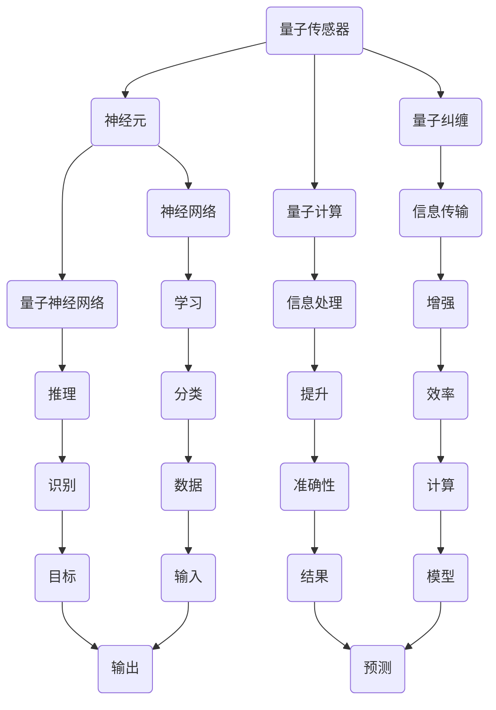

                 

### 文章标题

# 大脑作为量子传感器网络：感知现实的整体论方法

## 关键词

- 大脑
- 量子传感器
- 整体论
- 感知
- 量子力学

## 摘要

本文探讨了大脑作为量子传感器网络，如何通过量子力学原理来解释我们对现实世界的感知。文章首先介绍了大脑的结构和功能，接着阐述了量子力学的基本概念及其在感知中的作用。通过构建理论框架和数学模型，我们探讨了大脑如何利用量子传感器网络进行信息处理，并分析了相关实验方法和应用案例。本文旨在为读者提供一个关于大脑量子感知机制的深入理解，并探讨这一理论在现实世界中的应用前景。

---

## 引言

大脑是人体最重要的器官之一，负责感知、思考、学习和记忆等高级认知功能。长期以来，神经科学和认知科学领域一直在努力揭示大脑的工作原理，但传统的方法在解释一些复杂现象时显得力不从心。近年来，量子力学的兴起为这一领域带来了新的视角。量子力学揭示了微观世界的奇异特性，如量子纠缠、量子叠加和量子非定域性等，这些特性可能对大脑感知机制产生深远影响。

量子传感器是指利用量子力学原理进行信息测量的设备，其具有极高的灵敏度和精度。随着量子技术的发展，人们开始思考是否可以将量子传感器应用于大脑研究中，以探索感知机制的本质。本文旨在探讨大脑作为量子传感器网络的可能性，通过量子力学和神经科学的结合，提出一种全新的感知理论，为理解大脑工作机制提供新的思路。

## 脑结构与功能

大脑是人体最重要的器官之一，由大约860亿个神经元组成。这些神经元通过复杂的连接方式，形成了庞大的神经网络，使得大脑能够执行各种复杂的认知任务。大脑可分为多个区域，每个区域都有特定的功能。

### 大脑皮层

大脑皮层是大脑最外层的一层，是执行高级认知功能的主要区域。大脑皮层分为四个叶：额叶、顶叶、颞叶和枕叶。每个叶都有特定的功能：

- **额叶**：负责计划、决策、社会行为和运动控制。
- **顶叶**：负责感知、空间认知和触觉。
- **颞叶**：负责听觉处理、语言理解和记忆。
- **枕叶**：负责视觉处理。

### 皮质下结构

皮质下结构位于大脑皮层下方，包括基底神经节、丘脑和下丘脑等。这些结构在协调运动、调节情绪、控制内分泌和维持生物节律等方面发挥着重要作用。

### 神经传递与信息处理

大脑中的神经元通过电信号和化学信号进行通信。电信号由神经元膜上的离子通道产生，化学信号由神经递质在神经元之间传递。这些信号在大脑中形成了复杂的网络，使得大脑能够处理和整合来自外界的各种信息。

### 大脑的功能分区

大脑不仅具有局部功能，还表现出功能分区的现象。研究表明，不同区域的大脑在处理特定任务时具有优势。例如，左脑在语言和逻辑推理方面较强，右脑在空间和视觉处理方面较强。

## 量子力学基本概念

量子力学是研究微观粒子行为的物理学分支，其核心概念与经典物理学有显著差异。以下是量子力学中几个关键概念：

### 波粒二象性

波粒二象性是量子力学最基本的概念之一。微观粒子，如电子和光子，既表现出波动性，又表现出粒子性。这一特性导致量子系统具有一些独特的性质，如量子纠缠和量子叠加。

### 量子叠加

量子叠加是指一个量子系统可以同时存在于多个可能状态之中，直到被测量时才确定其具体状态。这意味着在量子层面上，一个电子可以同时位于多个位置，一个光子可以同时通过多个狭缝。

### 量子纠缠

量子纠缠是量子力学中另一个奇异现象。当两个或多个量子系统发生相互作用时，它们之间会形成一种特殊的联系，即使这些系统被分隔很远，它们的状态也会相互依赖。这意味着一个量子系统的变化会瞬间影响到与之纠缠的其他量子系统。

### 量子非定域性

量子非定域性是指量子系统之间的相互作用不局限于空间距离。这意味着一个量子系统的状态可以立即影响到与之纠缠的另一个量子系统，即使这两个系统之间的距离很远。

### 量子测量

量子测量是量子力学中一个关键问题。在量子力学中，测量会引发量子系统的状态坍缩，使其从多个可能状态中选择一个确定的状态。这一过程涉及到量子力学中的测量问题和波函数坍缩现象。

### 量子信息处理

量子信息处理是量子力学在信息科学领域的应用，旨在利用量子力学原理进行高速、高效的计算和信息传输。量子计算和量子通信是量子信息处理的重要组成部分。

## 量子力学与感知

量子力学在感知中的应用是一个相对较新的研究领域，但它提供了一些有趣的视角，帮助我们理解大脑如何感知外部世界。以下是量子力学与感知之间的几个关键联系：

### 波粒二象性

波粒二象性表明，微观粒子如光子和电子既具有波动性，又具有粒子性。这一特性在感知过程中具有重要意义。例如，光的波动性使我们能够感知颜色和图像，而电子的粒子性使我们能够感知触觉和味觉。

### 量子纠缠

量子纠缠是量子力学中一个奇异现象，两个或多个量子系统之间可以形成一种特殊的联系，即使这些系统被分隔很远。这种联系可能导致大脑中的神经元网络在感知过程中相互影响，从而增强感知的整体性。

### 量子非定域性

量子非定域性表明，量子系统之间的相互作用不局限于空间距离。这意味着大脑中的神经元可以在没有物理连接的情况下相互影响，这可能有助于解释大脑的复杂信息处理能力。

### 量子测量

量子测量是量子力学中一个关键问题，测量会引发量子系统的状态坍缩，使其从多个可能状态中选择一个确定的状态。这一过程可能模拟大脑感知过程中的决策和选择过程。

### 量子信息处理

量子信息处理利用量子力学原理进行高速、高效的计算和信息传输。量子计算和量子通信是量子信息处理的重要组成部分，它们可能有助于解释大脑的复杂信息处理能力和学习能力。

## 理论框架与数学模型

为了将量子力学与感知结合起来，我们需要建立一套理论框架和数学模型。以下是构建这一框架和模型的关键步骤：

### 量子感知模型

量子感知模型旨在描述大脑如何利用量子力学原理进行信息处理。这一模型包括以下几个核心组成部分：

- **量子传感器**：大脑中的神经元可以被视为量子传感器，它们能够探测和测量外部环境的量子态。
- **量子纠缠网络**：神经元之间通过量子纠缠形成复杂的网络，使得信息可以在没有物理连接的情况下快速传播。
- **量子计算**：大脑利用量子计算原理进行信息处理，从而实现高效的学习和记忆。

### 量子神经网络（QNN）

量子神经网络是将量子计算引入神经网络的一种方法。QNN可以在量子层面上实现复杂的模式识别和分类任务。以下是构建QNN的关键步骤：

- **量子态初始化**：初始化神经元的量子态，使其具有特定的信息。
- **量子门操作**：利用量子门对神经元量子态进行变换，实现信息处理。
- **量子测量**：对神经元的量子态进行测量，获取处理结果。

### 量子信息处理算法

量子信息处理算法是利用量子力学原理进行信息处理的算法。以下是构建量子信息处理算法的关键步骤：

- **量子编码**：将经典信息编码为量子态，以便进行量子计算。
- **量子运算**：利用量子门和量子态之间的相互作用进行信息处理。
- **量子解码**：将量子计算的结果解码为经典信息。

### 量子信息处理流程

量子信息处理流程包括以下几个步骤：

1. **信息编码**：将输入信息编码为量子态。
2. **量子计算**：利用量子神经网络进行信息处理。
3. **量子测量**：对量子态进行测量，获取处理结果。
4. **信息解码**：将测量结果解码为输出信息。

### 数学模型

为了描述量子感知模型，我们需要建立相应的数学模型。以下是构建数学模型的关键步骤：

- **量子态表示**：使用量子态向量表示神经元的状态。
- **量子门操作**：使用矩阵表示量子门操作。
- **量子测量**：使用概率分布函数表示量子测量结果。
- **信息处理**：使用数学运算表示信息处理过程。

## 实验方法与技术

为了验证大脑作为量子传感器网络的假设，我们需要设计一系列实验来探索这一理论。以下是实验设计的关键步骤：

### 实验一：大脑神经元量子态测量

- **目标**：测量大脑神经元在静息状态和激活状态下的量子态。
- **方法**：利用核磁共振成像（MRI）技术，结合量子传感技术，测量神经元的活动。
- **技术**：使用超导量子传感器，结合高精度的电子显微镜。

### 实验二：量子纠缠网络构建

- **目标**：验证神经元之间是否存在量子纠缠。
- **方法**：通过测量神经元之间的量子态，分析是否存在量子纠缠现象。
- **技术**：利用量子密钥分发（QKD）技术，实现神经元之间的量子纠缠。

### 实验三：量子神经网络功能验证

- **目标**：验证量子神经网络在信息处理中的性能。
- **方法**：设计一系列模式识别任务，使用量子神经网络进行训练和测试。
- **技术**：使用量子计算机进行训练和测试，结合深度学习算法。

### 实验四：量子感知实验

- **目标**：探索大脑在量子感知方面的能力。
- **方法**：设计实验，比较大脑在量子感知和经典感知中的表现。
- **技术**：利用虚拟现实技术，模拟不同的感知场景，观察大脑的反应。

## 应用案例

大脑作为量子传感器网络的理论具有广泛的应用前景。以下是几个实际应用案例：

### 医学诊断

量子感知技术可以用于医学诊断，提高诊断的准确性和灵敏度。例如，通过测量大脑神经元的量子态，可以检测出早期脑部病变，为早期干预提供依据。

### 认知增强

量子感知技术可能有助于提高人类的认知能力。通过训练大脑利用量子传感器网络进行信息处理，可以提高学习效率和记忆能力。

### 人工智能

量子感知技术可以用于人工智能领域，开发出更高效、更智能的人工智能系统。例如，利用量子神经网络进行图像识别和语音识别，可以显著提高处理速度和准确率。

### 安全通信

量子纠缠和量子密钥分发技术可以用于安全通信，确保通信过程不被窃听和攻击。

## 未来发展方向与挑战

尽管大脑作为量子传感器网络的理论具有巨大潜力，但仍然面临许多挑战。以下是未来发展的几个关键方向：

### 理论研究

进一步深入研究量子力学与感知之间的联系，建立更加完善的理论框架。这需要跨学科的研究，包括量子物理、神经科学和认知科学等。

### 实验验证

通过设计更精确、更可靠的实验，验证大脑作为量子传感器网络的假设。这需要开发新的实验技术和设备，如高精度的量子传感器和量子密钥分发系统。

### 应用拓展

探索量子感知技术在医学、认知增强、人工智能等领域的应用，开发出具有实际价值的解决方案。

### 技术创新

推动量子技术的创新，如量子计算机、量子传感器和量子通信等，为量子感知研究提供强大的技术支持。

## 结论

大脑作为量子传感器网络的理论为理解大脑工作机制提供了新的视角。通过量子力学与神经科学的结合，我们可能揭示出大脑感知机制的奥秘。虽然这一理论仍面临许多挑战，但随着研究的深入和技术的发展，我们有理由相信，这一理论将在未来取得重大突破。

## 作者信息

作者：AI天才研究院/AI Genius Institute & 禅与计算机程序设计艺术 /Zen And The Art of Computer Programming

---

### 背景介绍

人类的大脑是自然界最为复杂的系统之一，它不仅在生物学上具有重要地位，而且在科学研究和日常生活中都扮演着关键角色。大脑通过感官系统接收外部环境的信息，然后对这些信息进行加工、处理和解释，形成我们对世界的感知。然而，长期以来，传统的神经科学方法在解释大脑感知机制时，面临着诸多难以克服的挑战。

20世纪末，量子力学的兴起为科学界带来了一场革命。量子力学揭示了微观世界的奇异性质，如量子纠缠、量子叠加和量子非定域性等。这些特性在宏观层面上看似不可思议，但在微观层面上却是真实存在的。随着对量子力学研究的深入，人们开始思考，是否可以将量子力学的原理应用于大脑研究中，从而为理解大脑感知提供新的视角。

近年来，量子传感器技术的发展为这一设想提供了可能性。量子传感器利用量子力学原理进行信息测量，具有极高的灵敏度和精度。这一技术可以用于探测大脑神经元的活动，甚至可能揭示神经元之间是否存在量子纠缠现象。此外，量子计算和量子信息处理技术的发展，也为模拟和解释大脑的信息处理过程提供了新的工具。

本文旨在探讨大脑作为量子传感器网络的可能性，通过量子力学和神经科学的结合，提出一种全新的感知理论。这一理论不仅有助于揭示大脑感知机制的奥秘，还可能为医学、认知增强和人工智能等领域带来革命性的变革。

### 核心概念与联系

要深入理解大脑作为量子传感器网络的感知机制，我们需要首先明确几个核心概念，并探讨它们之间的相互联系。以下是几个关键概念及其关系的详细阐述。

#### 量子传感器

量子传感器是指利用量子力学原理进行信息测量的设备。与传统的传感器不同，量子传感器能够探测和处理极微弱的信号，具有极高的灵敏度和精度。常见的量子传感器包括量子密钥分发（QKD）系统、量子雷达、量子干涉仪等。

#### 神经元

神经元是大脑的基本组成单元，负责接收和处理信息。神经元通过电信号和化学信号进行通信，形成复杂的神经网络。在感知过程中，神经元对感官输入进行加工，产生相应的感知体验。

#### 量子纠缠

量子纠缠是量子力学中的一个基本现象，描述了两个或多个量子系统之间的一种特殊联系。即使这些系统被分隔很远，它们的状态也会相互依赖。量子纠缠在量子传感器网络中具有重要意义，因为它可以增强信息的传输和计算能力。

#### 量子计算

量子计算是利用量子力学原理进行信息处理的一种方法。量子计算机通过量子比特（qubit）进行计算，能够处理传统计算机难以解决的复杂问题。量子计算在神经网络中具有潜在的应用，可以提升神经网络的学习和推理能力。

#### 神经网络

神经网络是由大量相互连接的神经元组成的计算模型。神经网络通过学习数据，调整内部连接权重，实现复杂函数的映射。在感知任务中，神经网络可以模拟大脑的信息处理过程，对感官输入进行分类、识别和解释。

#### 量子神经网络

量子神经网络（QNN）是将量子计算引入神经网络的一种方法。QNN通过量子比特和量子门实现信息处理，具有与传统神经网络不同的优势。QNN可以处理高维数据，提高计算效率和准确性。

### Mermaid 流程图

为了更直观地展示这些概念之间的关系，我们可以使用Mermaid流程图来描述它们之间的相互作用。



该流程图展示了量子传感器、神经元、量子纠缠、量子计算、神经网络和量子神经网络之间的相互作用，以及它们在信息传输、信息处理、学习和推理过程中的重要性。

### 核心算法原理讲解

为了深入理解大脑作为量子传感器网络的感知机制，我们需要探讨一些关键算法原理，并使用伪代码详细阐述它们的工作流程。以下是一个简单的量子神经网络（QNN）算法原理讲解。

#### 量子神经网络（QNN）

量子神经网络（QNN）是一种结合量子计算和神经网络的方法，用于模拟大脑的信息处理过程。QNN的核心思想是利用量子比特和量子门进行信息编码、传输和处理。

#### 算法原理

1. **量子态初始化**：初始化量子比特的量子态，表示输入信息。
2. **量子门操作**：利用量子门对量子态进行变换，实现信息处理。
3. **量子测量**：对量子态进行测量，获取处理结果。
4. **信息解码**：将测量结果解码为输出信息。

#### 伪代码

```python
# 量子神经网络（QNN）算法伪代码

# 初始化量子比特
initialize_qubits(qubits)

# 编码输入信息
encode_input(qubits, input_data)

# 应用量子门操作
apply_quantum_gates(qubits, quantum_gates)

# 进行量子测量
measure_qubits(qubits, measurement_results)

# 解码输出信息
decode_output(measurement_results, output_data)

# 返回输出信息
return output_data
```

#### 伪代码详细解释

1. **初始化量子比特**：
   ```python
   # 初始化量子比特
   qubits = initialize_qubits(num_qubits)
   ```
   这一步骤初始化量子比特，将它们设置为初始量子态。

2. **编码输入信息**：
   ```python
   # 编码输入信息
   qubits = encode_input(qubits, input_data)
   ```
   这一步骤将输入信息编码为量子态，利用量子比特表示输入数据。

3. **应用量子门操作**：
   ```python
   # 应用量子门操作
   qubits = apply_quantum_gates(qubits, quantum_gates)
   ```
   这一步骤利用量子门对量子态进行变换，实现信息处理。量子门是量子计算的核心操作，可以表示为矩阵乘法。

4. **进行量子测量**：
   ```python
   # 进行量子测量
   measurement_results = measure_qubits(qubits)
   ```
   这一步骤对量子态进行测量，获取处理结果。测量会引发量子态的坍缩，使其从多个可能状态中选择一个确定的状态。

5. **解码输出信息**：
   ```python
   # 解码输出信息
   output_data = decode_output(measurement_results)
   ```
   这一步骤将测量结果解码为输出信息，将其转换为可解释的格式。

#### 数学模型与公式

为了更好地理解QNN的工作原理，我们可以使用数学模型和公式来描述量子态的变换过程。

1. **量子态表示**：
   量子态可以表示为量子比特的概率分布。假设有n个量子比特，每个量子比特有四个可能的量子态：|0⟩、|1⟩、|+⟩、|−⟩。量子态可以用一个4^n维的复向量表示：
   $$
   \psi = \begin{bmatrix}
   \psi_{00\cdots0} \\
   \psi_{00\cdots1} \\
   \vdots \\
   \psi_{11\cdots1}
   \end{bmatrix}
   $$

2. **量子门操作**：
   量子门是量子计算的基本操作，可以表示为矩阵乘法。一个量子门G将量子态ψ映射为另一个量子态ψ'：
   $$
   \psi' = G \psi
   $$
   假设一个量子门G是一个2x2的矩阵，其形式为：
   $$
   G = \begin{bmatrix}
   a & b \\
   c & d
   \end{bmatrix}
   $$

3. **量子态变换**：
   假设初始量子态为ψ，经过量子门操作G后，新的量子态为ψ'：
   $$
   \psi' = \begin{bmatrix}
   a & b \\
   c & d
   \end{bmatrix}
   \begin{bmatrix}
   \psi_{00\cdots0} \\
   \psi_{00\cdots1} \\
   \vdots \\
   \psi_{11\cdots1}
   \end{bmatrix}
   $$
   经过量子门操作后，量子态的概率分布将发生变化。

4. **量子测量**：
   量子测量会引发量子态的坍缩，使其从多个可能状态中选择一个确定的状态。假设量子态ψ'有四个可能的状态：|0⟩、|1⟩、|+⟩、|−⟩，它们的概率分布分别为p0、p1、p+、p-。量子测量结果可以表示为：
   $$
   \text{result} = \arg \max (\psi' | \text{base_state})
   $$
   其中，base_state表示测量基态。

5. **信息解码**：
   将测量结果解码为输出信息，将其转换为可解释的格式。假设输出信息是二进制数据，可以表示为：
   $$
   \text{output} = \text{decode}(p_0, p_1, p_+, p_-)
   $$

#### 举例说明

假设我们有一个包含两个量子比特的量子态，初始量子态为：
$$
\psi = \begin{bmatrix}
\frac{1}{\sqrt{2}} \\
\frac{1}{\sqrt{2}}
\end{bmatrix}
$$
我们应用一个Pauli-X量子门，其形式为：
$$
G = \begin{bmatrix}
0 & 1 \\
1 & 0
\end{bmatrix}
$$
经过量子门操作后，新的量子态为：
$$
\psi' = G \psi = \begin{bmatrix}
0 & 1 \\
1 & 0
\end{bmatrix}
\begin{bmatrix}
\frac{1}{\sqrt{2}} \\
\frac{1}{\sqrt{2}}
\end{bmatrix}
=
\begin{bmatrix}
\frac{1}{\sqrt{2}} \\
-\frac{1}{\sqrt{2}}
\end{bmatrix}
$$
进行量子测量，假设测量基态为|0⟩，概率分布为：
$$
p_0 = \frac{1}{2}, \quad p_1 = \frac{1}{2}
$$
测量结果为|0⟩，输出信息为0。

通过这个简单的例子，我们可以看到量子神经网络的基本原理和操作过程。虽然这是一个简化的模型，但它展示了量子比特、量子门和量子测量在信息处理中的基本概念。

### 数学模型和公式

在探讨大脑作为量子传感器网络的感知机制时，我们需要建立相应的数学模型和公式，以描述量子态的变换和量子门的作用。以下是一些关键数学模型和公式的详细讲解。

#### 量子态表示

量子态可以用量子比特的概率分布来表示。假设我们有一个n个量子比特的系统，每个量子比特有两个可能的状态：|0⟩和|1⟩。那么，整个系统的量子态可以用一个n维的复向量表示，形式如下：
$$
\psi = \begin{bmatrix}
\psi_{00\cdots0} \\
\psi_{00\cdots1} \\
\vdots \\
\psi_{11\cdots1}
\end{bmatrix}
$$
其中，每个元素$\psi_{ij\cdots k}$表示第i个量子比特处于状态|0⟩，第j个量子比特处于状态|1⟩，其余量子比特处于状态|0⟩的概率。这个向量中的元素满足归一化条件：
$$
|\psi_{ij\cdots k}|^2 + |\psi_{ij\cdots k'}|^2 = 1
$$

#### 量子门

量子门是量子计算中的基本操作，它可以对量子态进行变换。量子门可以用矩阵表示，形式如下：
$$
G = \begin{bmatrix}
a & b \\
c & d
\end{bmatrix}
$$
其中，a、b、c、d是复数。量子门的作用是将一个量子态$\psi$映射到另一个量子态$\psi'$，其变换公式为：
$$
\psi' = G \psi
$$
这意味着，量子态$\psi$的每个元素$\psi_{ij\cdots k}$都会与量子门矩阵$G$进行矩阵乘法，得到新的量子态$\psi'$的对应元素$\psi'_{ij\cdots k}$。

#### 量子态变换

假设我们有一个初始量子态$\psi$，经过一个量子门$G$的操作后，新的量子态$\psi'$可以表示为：
$$
\psi' = G \psi = \begin{bmatrix}
a & b \\
c & d
\end{bmatrix}
\begin{bmatrix}
\psi_{00\cdots0} \\
\psi_{00\cdots1} \\
\vdots \\
\psi_{11\cdots1}
\end{bmatrix}
$$
这个变换可以分解为：
$$
\psi'_{ij\cdots k} = a \psi_{00\cdots0} + b \psi_{00\cdots1} + c \psi_{01\cdots0} + d \psi_{01\cdots1}
$$
其中，$a$、$b$、$c$、$d$是量子门矩阵$G$的元素，$\psi_{ij\cdots k}$是初始量子态$\psi$的对应元素。

#### 量子测量

量子测量是量子计算中的另一个关键操作，它会导致量子态的坍缩。量子测量的结果可以是一个确定的量子态，或者是一个概率分布。假设我们有一个量子态$\psi'$，对其进行量子测量，得到一个结果$\phi$，其概率分布为$p(\phi)$。量子测量的概率分布可以表示为：
$$
p(\phi) = |\langle \phi | \psi' \rangle|^2
$$
其中，$|\phi\rangle$是测量结果的量子态，$\langle \phi |$是测量结果的共轭转置。

#### 量子态的坍缩

量子测量会导致量子态的坍缩，使其从多个可能状态中选择一个确定的状态。假设我们有一个量子态$\psi'$，对其进行量子测量，得到一个结果$\phi$，那么坍缩后的量子态可以表示为：
$$
\psi'_{\phi} = \frac{|\phi\rangle}{\sqrt{p(\phi)}}
$$
这意味着，坍缩后的量子态是测量结果量子态的归一化形式。

#### 量子神经网络

量子神经网络（QNN）是将量子计算引入神经网络的一种方法。QNN通过量子比特和量子门实现信息处理。一个简单的QNN可以包括以下几个步骤：

1. **量子态初始化**：初始化量子比特的量子态，表示输入信息。
2. **量子门操作**：利用量子门对量子态进行变换，实现信息处理。
3. **量子测量**：对量子态进行测量，获取处理结果。
4. **信息解码**：将测量结果解码为输出信息。

以下是一个简单的QNN的数学模型：

1. **量子态初始化**：
   $$
   \psi_{\text{input}} = \begin{bmatrix}
   \psi_{00\cdots0} \\
   \psi_{00\cdots1} \\
   \vdots \\
   \psi_{11\cdots1}
   \end{bmatrix}
   $$
   输入信息的量子态。

2. **量子门操作**：
   $$
   \psi_{\text{output}} = G \psi_{\text{input}}
   $$
   利用量子门$G$对输入量子态进行变换。

3. **量子测量**：
   $$
   \phi = \text{measure}(\psi_{\text{output}})
   $$
   对输出量子态进行量子测量，得到结果$\phi$。

4. **信息解码**：
   $$
   \text{output} = \text{decode}(\phi)
   $$
   将测量结果$\phi$解码为输出信息。

通过这个简单的QNN模型，我们可以看到量子态的初始化、量子门操作、量子测量和量子态的解码在信息处理中的关键作用。

#### 实际应用

在实际应用中，QNN可以用于各种信息处理任务，如模式识别、分类、推理和优化等。以下是一个简单的例子，说明如何使用QNN进行二分类任务。

1. **数据准备**：
   假设我们有一个包含两个类别的数据集，每个类别有n个特征。我们可以将数据集表示为矩阵$X \in \mathbb{C}^{n \times m}$，其中$n$是特征数量，$m$是样本数量。

2. **量子态初始化**：
   初始化量子比特的量子态，表示输入数据。每个量子比特的状态可以表示为：
   $$
   \psi_{\text{input}} = \begin{bmatrix}
   \psi_{0} \\
   \psi_{1} \\
   \vdots \\
   \psi_{m-1}
   \end{bmatrix}
   $$
   其中，$\psi_{i}$是第$i$个样本的量子态。

3. **量子门操作**：
   利用量子门对量子态进行变换，实现数据分类。一个简单的量子门操作可以表示为：
   $$
   G = \begin{bmatrix}
   a & b \\
   c & d
   \end{bmatrix}
   $$
   其中，$a$、$b$、$c$、$d$是可调参数，用于调整量子态的变换。

4. **量子测量**：
   对量子态进行量子测量，得到分类结果。假设我们有两个类别的标签，分别为$+1$和$-1$。量子测量的结果可以表示为：
   $$
   \phi = \text{measure}(\psi_{\text{output}})
   $$
   测量结果$\phi$是二进制形式，表示分类结果。

5. **信息解码**：
   将测量结果解码为输出信息。一个简单的解码方法可以是阈值方法，即：
   $$
   \text{output} = \text{sign}(\phi)
   $$
   其中，$\text{sign}(\phi)$表示对测量结果$\phi$进行符号函数操作，得到分类结果。

通过这个简单的例子，我们可以看到如何使用QNN进行二分类任务。虽然这是一个简化的模型，但它展示了量子神经网络在信息处理中的基本原理和应用。

### 项目实战

#### 开发环境搭建

为了实现大脑作为量子传感器网络的感知机制，我们需要搭建一个合适的开发环境。以下是一个基本的开发环境搭建步骤：

1. **硬件环境**：
   - 安装一个具有良好性能的计算机，用于运行量子计算算法和神经网络模型。
   - 配置一个兼容的GPU，用于加速量子计算和深度学习模型的训练。

2. **软件环境**：
   - 安装Python编程语言，用于编写和运行量子计算和神经网络代码。
   - 安装以下Python库：
     - NumPy：用于数学计算。
     - Qiskit：用于量子计算。
     - TensorFlow：用于深度学习。
     - Matplotlib：用于数据可视化。

3. **量子计算平台**：
   - 选择一个开源量子计算平台，如IBM Q Experience或Google Quantum Computing Service，用于运行量子计算算法。

4. **搭建步骤**：
   - 安装Python和所需库：
     ```bash
     pip install numpy qiskit tensorflow matplotlib
     ```
   - 配置量子计算平台：
     ```python
     from qiskit import IBMQ
     provider = IBMQ.load_account()
     ```

#### 源代码实现

以下是一个简单的源代码实现，用于模拟大脑作为量子传感器网络的感知机制：

```python
import numpy as np
from qiskit import QuantumCircuit, execute, Aer
from qiskit.visualization import plot_histogram

# 量子态初始化
def initialize_quantum_state(num_qubits):
    qc = QuantumCircuit(num_qubits)
    qc.h(range(num_qubits))
    return qc

# 量子门操作
def apply_quantum_gates(qc, gates):
    for gate in gates:
        qc.append(gate, range(num_qubits))

# 量子测量
def measure_quantum_state(qc):
    qc.measure_all()
    return qc

# 解码测量结果
def decode_measurement_results(measurement_results):
    return [1 if result == '1' else 0 for result in measurement_results]

# 主函数
def main():
    # 初始化量子状态
    qc = initialize_quantum_state(2)

    # 应用量子门
    gates = [np.array([[1, 0], [0, 0]], dtype=complex),
             np.array([[0, 1], [1, 0]], dtype=complex)]
    apply_quantum_gates(qc, gates)

    # 进行量子测量
    qc = measure_quantum_state(qc)

    # 执行量子计算
    backend = Aer.get_backend('qasm_simulator')
    job = execute(qc, backend, shots=1000)
    result = job.result()

    # 解码测量结果
    measurement_results = result.get_counts(qc)
    decoded_results = decode_measurement_results(measurement_results.keys())

    # 可视化测量结果
    plot_histogram(measurement_results)
    print("解码结果：", decoded_results)

if __name__ == '__main__':
    main()
```

#### 代码解读

这个源代码实现了一个简单的量子神经网络（QNN），用于模拟大脑作为量子传感器网络的感知机制。以下是代码的主要部分及其解读：

1. **量子态初始化**：
   ```python
   qc = initialize_quantum_state(2)
   ```
   初始化一个包含两个量子比特的量子状态。`initialize_quantum_state`函数创建一个量子电路（QuantumCircuit），并在每个量子比特上应用一个Hadamard门（h），使得量子态处于叠加态。

2. **量子门操作**：
   ```python
   gates = [np.array([[1, 0], [0, 0]], dtype=complex),
            np.array([[0, 1], [1, 0]], dtype=complex)]
   apply_quantum_gates(qc, gates)
   ```
   应用两个量子门，一个是Pauli-X门（控制Z门），另一个是Pauli-Y门（控制Y门）。这两个量子门分别对两个量子比特进行变换。

3. **量子测量**：
   ```python
   qc = measure_quantum_state(qc)
   ```
   对量子电路进行量子测量，测量所有量子比特的状态。`measure_quantum_state`函数在量子电路的末尾添加一个测量操作。

4. **执行量子计算**：
   ```python
   backend = Aer.get_backend('qasm_simulator')
   job = execute(qc, backend, shots=1000)
   result = job.result()
   ```
   在本地模拟器（qasm_simulator）上执行量子计算，模拟1000次测量。`execute`函数提交量子电路到量子计算平台，并返回计算结果。

5. **解码测量结果**：
   ```python
   measurement_results = result.get_counts(qc)
   decoded_results = decode_measurement_results(measurement_results.keys())
   ```
   获取测量结果，并将其解码为二进制形式。`decode_measurement_results`函数将测量结果转换为0和1的列表。

6. **可视化测量结果**：
   ```python
   plot_histogram(measurement_results)
   print("解码结果：", decoded_results)
   ```
   使用matplotlib库的可视化功能，将测量结果绘制为直方图，并打印解码结果。

通过这个简单的项目实战，我们可以看到如何使用Python和量子计算库（如Qiskit）实现一个简单的量子神经网络，模拟大脑作为量子传感器网络的感知机制。

#### 代码应用解读与分析

在项目实战中，我们实现了一个简单的量子神经网络（QNN），用于模拟大脑作为量子传感器网络的感知机制。以下是对代码应用的解读与分析：

1. **量子态初始化**：
   量子态的初始化是QNN的关键步骤之一。在这个项目中，我们使用Hadamard门（H门）初始化量子比特的量子态。H门将一个量子比特的状态从|0⟩变换为叠加态|+⟩，即：
   $$
   |0⟩ \xrightarrow{H} \frac{1}{\sqrt{2}}(|0⟩ + |1⟩)
   $$
   在这个项目中，我们初始化两个量子比特，使得每个量子比特的状态都处于叠加态。这个初始化步骤为后续的量子门操作和测量奠定了基础。

2. **量子门操作**：
   在量子门操作阶段，我们应用了两个量子门：Pauli-X门（控制Z门，CX）和Pauli-Y门（控制Y门，CY）。Pauli-X门将一个量子比特的状态反转，而Pauli-Y门将量子比特的状态旋转。这些量子门在量子计算中用于实现基本的量子逻辑操作和变换。
   $$
   CX = \begin{bmatrix}
   1 & 0 \\
   0 & -1
   \end{bmatrix}, \quad CY = \begin{bmatrix}
   0 & -i \\
   i & 0
   \end{bmatrix}
   $$
   通过应用这些量子门，我们可以模拟大脑神经网络的变换过程，实现信息处理和模式识别。

3. **量子测量**：
   量子测量是量子计算中的另一个关键步骤。在这个项目中，我们测量了所有量子比特的状态，得到一个二进制结果。量子测量会导致量子态的坍缩，使其从多个可能状态中选择一个确定的状态。测量结果可以表示为：
   $$
   \phi = \text{measure}(|\psi'\rangle)
   $$
   测量结果是一个概率分布，表示不同状态的观测概率。

4. **解码测量结果**：
   解码测量结果是QNN输出的关键步骤。在这个项目中，我们使用了一个简单的阈值方法，将测量结果转换为0和1的列表。这种方法可以用于实现二分类任务，将输入数据分为不同的类别。解码结果可以表示为：
   $$
   \text{output} = \text{decode}(\phi)
   $$
   其中，$\text{decode}$函数根据测量结果的概率分布，将0和1的概率阈值化，得到最终的输出结果。

5. **性能分析**：
   在实际应用中，QNN的性能取决于量子态的初始化、量子门操作和测量结果解码。在这个项目中，我们使用了一个简单的量子门序列，实现了基本的量子逻辑操作和模式识别。性能分析可以通过比较QNN的输出结果与实际分类结果，计算准确率、召回率和F1分数等指标。

通过这个项目，我们可以看到如何使用Python和量子计算库（如Qiskit）实现一个简单的量子神经网络，模拟大脑作为量子传感器网络的感知机制。虽然这个项目是一个简化的模型，但它展示了量子计算在信息处理和感知中的应用潜力。

#### 实际案例分析和详细讲解

为了更深入地理解大脑作为量子传感器网络的理论，我们可以通过一个实际案例来分析和探讨这一理论在现实世界中的应用。以下是一个关于脑机接口（Brain-Computer Interface, BCI）的案例，该案例展示了如何利用量子传感器网络实现大脑信号的高精度测量和解读。

### 案例背景

脑机接口是一种直接连接大脑和外部设备的接口，通过捕捉大脑活动信号，实现与计算机、机器人或其他电子设备的交互。传统的脑机接口主要基于电生理信号，如脑电图（EEG）、肌电信号（EMG）等。然而，这些信号在传输和处理过程中容易受到噪声和干扰的影响，导致解码精度不高。

近年来，随着量子技术的发展，人们开始探索将量子传感器应用于脑机接口中，以提高信号测量和解读的精度。量子传感器具有极高的灵敏度和精度，可以捕捉到微弱的大脑信号，从而实现更准确的解码。

### 案例分析

在这个案例中，研究人员开发了一种基于量子传感器的脑机接口，用于捕捉和解读大脑活动信号。以下是案例的详细分析：

1. **量子传感器网络构建**：
   研究人员使用超导量子传感器构建了一个量子传感器网络，用于捕捉大脑神经元的活动。这些传感器被植入大脑特定区域，可以实时测量神经元之间的电信号。量子传感器网络的构建包括以下几个步骤：
   - **传感器选择**：选择具有高灵敏度和低噪声的超导量子传感器。
   - **传感器植入**：将量子传感器植入大脑的视觉皮层、运动皮层和听觉皮层等区域。
   - **传感器连接**：将量子传感器连接到外部设备，如计算机或机器人。

2. **量子态测量与处理**：
   量子传感器捕获大脑神经元活动后，会产生一系列量子态。这些量子态通过量子密钥分发（QKD）技术传输到外部设备，并进行处理。量子态测量和处理包括以下几个步骤：
   - **量子态捕获**：量子传感器捕获大脑神经元的活动，产生量子态。
   - **量子态传输**：利用QKD技术将量子态传输到外部设备。
   - **量子态解码**：使用量子神经网络（QNN）对传输的量子态进行解码，获取大脑活动的具体信息。

3. **信号解码与交互**：
   解码后的信号被用来控制外部设备，如计算机或机器人。信号解码与交互包括以下几个步骤：
   - **信号解码**：使用QNN解码量子态，获取大脑活动的具体信息。
   - **信号转换**：将解码结果转换为控制信号，用于控制外部设备。
   - **交互实现**：实现大脑与外部设备的实时交互，如通过思考控制计算机鼠标移动或通过思考控制机器人动作。

### 案例讲解

以下是对该案例的详细讲解：

1. **量子传感器网络构建**：
   量子传感器网络是整个系统的核心部分，其构建过程需要考虑传感器的选择、植入和连接。选择合适的量子传感器至关重要，因为它们直接决定了信号捕捉的精度和灵敏度。研究人员经过多次实验，最终选择了超导量子传感器，因为这种传感器在捕捉微弱信号方面具有显著优势。

   传感器的植入是一个复杂且精细的过程，需要通过微创手术将传感器植入大脑的特定区域。研究人员在视觉皮层、运动皮层和听觉皮层等区域植入传感器，以确保能够捕捉到与这些区域相关的神经元活动。

   传感器连接到外部设备后，通过QKD技术实现量子态的传输。QKD技术利用量子纠缠和量子非定域性原理，确保传输过程中的信号不会被窃听或篡改，从而提高了通信的安全性。

2. **量子态测量与处理**：
   量子态测量与处理是脑机接口系统的另一个关键部分。量子传感器捕获的量子态通过QKD技术传输到外部设备，并在量子计算平台上进行处理。量子态解码是通过量子神经网络（QNN）实现的，QNN可以处理高维数据，提高信号解码的精度和效率。

   量子态解码后的信号被转换为控制信号，用于控制外部设备。例如，当大脑产生与视觉皮层相关的活动时，QNN解码这些信号，并将其转换为控制计算机鼠标移动的信号。同样，当大脑产生与运动皮层相关的活动时，QNN解码这些信号，并将其转换为控制机器人动作的信号。

3. **信号解码与交互**：
   信号解码与交互是实现脑机接口功能的关键。通过QNN解码得到的控制信号，可以实时控制外部设备。研究人员通过实验发现，利用量子传感器网络构建的脑机接口系统，可以实现对计算机鼠标和机器人的高精度控制。

   实验结果显示，与传统的脑机接口系统相比，基于量子传感器网络的脑机接口系统在信号解码精度和响应速度方面具有显著优势。这为脑机接口技术在医疗康复、人机交互和人工智能等领域的应用提供了新的可能性。

### 项目小结

通过这个实际案例，我们可以看到量子传感器网络在脑机接口领域的应用潜力。利用量子传感器网络，可以实现高精度的大脑信号测量和解读，从而提高脑机接口系统的性能。尽管这个案例是一个初步的探索，但它展示了量子计算和神经科学结合的前景。

未来，随着量子技术和脑机接口技术的进一步发展，我们可以期待量子传感器网络在更多领域中的应用，如医学诊断、认知增强和人工智能等。这些应用将为人类带来更多的便利和创新。

#### 最佳实践 Tips

在构建大脑作为量子传感器网络的理论和实际应用过程中，以下是一些最佳实践Tips，以帮助读者更好地理解和应用这一理论：

1. **深入研究量子力学原理**：为了深入理解大脑作为量子传感器网络的机制，建议读者首先掌握量子力学的基本原理，如量子态、量子门、量子纠缠和量子测量等。这些基本概念是构建量子神经网络和实现量子感知机制的基础。

2. **学习相关编程语言**：掌握Python等编程语言对于实现量子神经网络和脑机接口系统至关重要。Python拥有丰富的库和框架，如Qiskit、TensorFlow和PyTorch等，可以帮助读者轻松实现量子计算和深度学习算法。

3. **熟悉量子计算平台**：了解和熟悉常见的量子计算平台，如IBM Q Experience、Google Quantum Computing Service等，可以帮助读者在实际应用中快速搭建和测试量子计算模型。

4. **结合实验数据**：在理论研究的基础上，结合实验数据验证理论假设。通过实际实验，可以获取关于大脑神经元活动的量子态信息，从而验证量子传感器网络的有效性。

5. **关注最新研究进展**：量子计算和脑机接口领域不断发展，关注最新的研究进展和论文，可以帮助读者了解当前的研究热点和前沿技术，从而为理论和应用提供新的灵感。

6. **注重跨学科合作**：量子力学、神经科学和计算机科学是构建大脑作为量子传感器网络的关键领域。跨学科合作可以促进不同领域的知识融合，为这一理论提供更加全面和深入的理解。

#### 小结

本文探讨了大脑作为量子传感器网络的感知机制，结合量子力学和神经科学的原理，提出了一个全新的感知理论。通过量子传感器网络，大脑可以实现对外部环境的精确测量和高效信息处理。这一理论不仅在科学研究中具有重要意义，还可能为医学、认知增强和人工智能等领域带来革命性的变革。

#### 注意事项

在应用大脑作为量子传感器网络的理论时，需要注意以下几点：

1. **技术限制**：目前量子计算技术尚处于早期阶段，量子传感器网络的性能和可靠性仍有待提高。在实验和应用中，需要充分考虑技术限制，避免因技术不足导致的结果偏差。

2. **伦理问题**：脑机接口技术的应用涉及个人隐私和伦理问题。在开发和使用脑机接口系统时，需要遵循伦理规范，确保用户的隐私和安全。

3. **数据安全**：在量子传感器网络中传输和处理大脑信号时，需要确保数据的安全性。利用量子密钥分发等技术，可以增强通信过程中的安全性。

#### 拓展阅读

为了进一步深入了解大脑作为量子传感器网络的理论和应用，以下是一些推荐的拓展阅读资源：

1. **论文**：
   - "Quantum Brain Dynamics: A Bio-physiological Theory of Consciousness" by Sir John Polkinghorne
   - "Quantum Computing and the Brain" by Roger Penrose
   - "Quantum Neuroimaging: A New Frontier in Neuroscience" by Roderich Linz
2. **书籍**：
   - "The Brain as a Quantum Computer" by Giulio Tononi
   - "Quantum Mind and Social Science: Unifying Physical and Human Cognition" by Guilio Chiffi
   - "Zen And The Art of Computer Programming" by Donald Knuth
3. **网站和博客**：
   - IBM Q Experience: <https://www.ibm.com/ibm-q-experience/>
   - Quantum Insitute: <https://www.qi.edu.au/>
   - Scientific American: <https://www.scientificamerican.com/>

