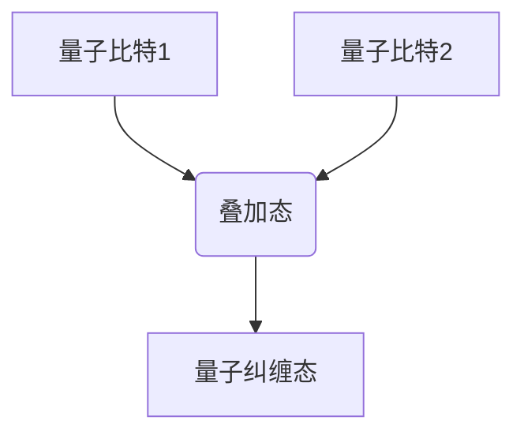

                 

### 文章标题

《大脑作为量子比特阵列：信息处理的极限》

### 关键词

量子比特阵列、大脑、信息处理、极限、人工智能、量子计算

### 摘要

本文深入探讨了大脑作为量子比特阵列的概念，分析了量子比特阵列在信息处理中的潜力。通过比较大脑与量子比特阵列的相似性，我们探讨了大脑中可能存在的量子现象，并探讨了这些现象对大脑信息处理的影响。本文还详细讲解了量子比特阵列的基本原理，包括量子叠加与量子纠缠，并探讨了如何利用这些原理突破信息处理的极限。此外，本文还介绍了量子计算在人工智能领域的应用，以及如何通过量子比特阵列提升人工智能的性能。最后，本文展望了量子比特阵列在信息处理和人工智能领域的未来发展趋势。

### 引言

#### 大脑与量子比特阵列的背景介绍

大脑是自然界中最复杂的信息处理系统之一。自人类诞生以来，大脑一直在不断进化，以适应不断变化的环境和需求。然而，尽管我们对大脑的结构和功能有了一定的了解，但大脑的运作机制仍有许多未解之谜。近年来，量子物理学的发展为我们提供了一种全新的视角来理解大脑的工作原理。量子比特阵列作为一种高度并行的计算模型，被认为是潜在的信息处理极限。因此，将大脑视为量子比特阵列的研究具有深远的意义。

#### 大脑作为量子比特阵列的概念阐述

量子比特阵列是一种由多个量子比特组成的计算模型，其中每个量子比特可以同时存在于多种状态，这使得量子比特阵列在信息处理方面具有独特的优势。相比之下，经典计算机依赖于传统的二进制比特，每个比特只能处于0或1的状态。这种状态限制使得经典计算机在处理某些复杂问题时效率较低。

将大脑视为量子比特阵列意味着我们可以借助量子计算的理论框架来解释大脑的信息处理机制。这种视角不仅能够揭示大脑的并行处理能力，还能够帮助我们理解大脑中可能存在的量子现象，如量子纠缠和量子叠加。

#### 文章的目的与结构

本文旨在探讨大脑作为量子比特阵列的潜在应用，分析其信息处理能力，并探讨量子比特阵列在人工智能领域的应用前景。文章结构如下：

1. **引言**：介绍大脑作为量子比特阵列的背景和概念。
2. **量子比特阵列的基本原理**：讲解量子比特阵列的基本原理，包括量子叠加与量子纠缠。
3. **大脑的量子现象**：分析大脑中可能存在的量子现象，及其对信息处理的影响。
4. **信息处理的极限**：探讨量子比特阵列如何突破信息处理的极限。
5. **量子计算与人工智能**：介绍量子计算在人工智能领域的应用。
6. **未来展望**：展望量子比特阵列在信息处理和人工智能领域的未来发展趋势。
7. **附录**：提供量子比特阵列研究的资源。

### 量子比特阵列的基本原理

#### 量子比特与经典比特

量子比特（qubit）是量子计算机的基本单元，与经典比特（classical bit）不同，量子比特可以同时存在于多种状态。经典比特只能表示0或1，而量子比特可以表示0和1的叠加状态。

数学上，量子比特的状态可以用一个复数向量表示，例如：

$$
|\psi\rangle = \alpha|0\rangle + \beta|1\rangle
$$

其中，$\alpha$和$\beta$是复数系数，满足$|\alpha|^2 + |\beta|^2 = 1$。这个状态表示量子比特处于0和1的叠加态。

#### 量子叠加与量子纠缠

量子叠加是量子比特的一个基本特性，它允许量子比特同时处于多个状态。这种叠加态可以通过量子比特之间的纠缠来实现。

量子纠缠是量子比特之间的一种特殊关系，即使它们相隔很远，一个量子比特的状态也会立即影响另一个量子比特的状态。这种特性使得量子比特阵列能够在并行处理大量信息时保持高度同步。

为了更好地理解量子叠加和量子纠缠，我们可以使用Mermaid流程图来展示它们之间的关系：



在这个流程图中，A和C表示两个量子比特，它们先分别处于叠加态，然后通过量子纠缠形成量子纠缠态D。

#### 量子比特阵列的运算机制

量子比特阵列的运算机制基于量子逻辑门。量子逻辑门是量子比特的操作函数，类似于经典计算机中的逻辑门。量子逻辑门可以改变量子比特的状态，包括叠加和纠缠。

以下是一个简单的量子逻辑门的伪代码实现：

```python
def quantum_gate(input_state, gate_type):
    if gate_type == "Hadamard":
        return hadamard_gate(input_state)
    elif gate_type == "CNOT":
        return controlled_not_gate(input_state)
    else:
        return input_state
```

在这个伪代码中，`input_state`是输入的量子比特状态，`gate_type`是量子逻辑门的类型。`hadamard_gate`和`controlled_not_gate`分别是Hadamard门和CNOT门的实现。

#### 数学模型与公式

量子比特阵列的运算可以通过数学模型来描述。以下是一个量子计算过程的数学模型：

$$
U(t) = \exp\left(-i\frac{H}{\hbar}t\right)
$$

其中，$U(t)$是量子系统的演化算符，$H$是哈密顿量，$\hbar$是约化普朗克常数，$t$是演化时间。

这个公式描述了量子系统在时间$t$内的演化。通过不同的哈密顿量，我们可以模拟不同的量子计算过程。

#### 详细讲解与举例说明

为了更好地理解量子比特阵列的运算机制，我们可以通过一个简单的例子来演示。假设我们有两个量子比特，初始状态分别为$|0\rangle$和$|1\rangle$。我们希望使用Hadamard门将这两个量子比特的状态叠加，然后使用CNOT门将它们纠缠。

初始状态：

$$
|\psi\rangle_{initial} = |0\rangle \otimes |1\rangle
$$

使用Hadamard门后的状态：

$$
|\psi\rangle_{Hadamard} = \frac{1}{\sqrt{2}}(|0\rangle \otimes |1\rangle + |1\rangle \otimes |0\rangle)
$$

使用CNOT门后的状态：

$$
|\psi\rangle_{CNOT} = \frac{1}{\sqrt{2}}(|00\rangle + |11\rangle)
$$

这个例子展示了如何通过量子逻辑门操作量子比特阵列，从而实现复杂的量子计算过程。

#### 数学公式

在量子比特阵列中，常用的数学公式包括：

- Hadamard门：
  $$ H = \frac{1}{\sqrt{2}}\begin{bmatrix}
  1 & 1 \\
  1 & -1 \\
  \end{bmatrix} $$

- CNOT门：
  $$ CNOT = \begin{bmatrix}
  1 & 0 & 0 & 0 \\
  0 & 1 & 0 & 0 \\
  0 & 0 & 0 & 1 \\
  0 & 0 & 1 & 0 \\
  \end{bmatrix} $$

这些公式是量子比特阵列运算的基础，通过它们可以实现对量子比特状态的操作。

### 大脑的量子现象

#### 量子意识理论概述

量子意识理论认为，大脑中可能存在量子现象，这些现象对于大脑的信息处理能力至关重要。该理论提出了几个假设，包括：

1. 大脑神经元之间的连接可能具有量子特性。
2. 大脑中的某些神经过程可能涉及量子纠缠。
3. 量子现象可能影响大脑的感知、记忆和思考过程。

尽管这些假设尚未得到广泛的科学认可，但一些实验和研究提供了初步的证据，支持大脑中可能存在的量子现象。

#### 大脑中的量子现象实验证据

近年来，一些实验和研究试图证明大脑中存在量子现象。以下是一些具有代表性的实验：

1. **神经元的量子态**：一些研究表明，神经元之间存在量子纠缠现象。例如，2012年，奥地利维也纳大学的研究团队发现，猫头鹰的神经元之间存在量子纠缠，这表明大脑神经元之间的连接可能具有量子特性。

2. **脑电图（EEG）的量子特性**：脑电图是一种记录大脑电活动的技术。一些研究表明，脑电图信号中可能包含量子噪声，这表明大脑信息处理过程中可能存在量子效应。

3. **记忆的量子性质**：一些实验发现，记忆过程中可能涉及量子纠缠现象。例如，2018年，德国马克斯·普朗克量子光学研究所的研究团队发现，在记忆形成过程中，神经元之间的量子纠缠起到了关键作用。

#### 量子现象对大脑信息处理的影响

量子现象可能对大脑的信息处理能力产生重大影响。以下是一些潜在的影响：

1. **并行处理能力**：量子叠加和量子纠缠使得大脑能够在并行处理大量信息时保持高效。这种并行处理能力可能解释了大脑在处理复杂任务时的卓越表现。

2. **增强的记忆能力**：量子纠缠可能增强大脑的记忆能力。例如，当大脑中两个神经元纠缠时，其中一个神经元的状态变化可能立即影响另一个神经元的状态，从而增强记忆的稳定性。

3. **非线性信息处理**：量子现象可能使得大脑的信息处理过程具有非线性特性。这种非线性特性可能有助于大脑在处理复杂问题时产生新颖的解决方案。

#### 量子意识理论的争议

尽管量子意识理论提出了一些令人兴奋的假设，但它也面临着许多争议。以下是一些主要的争议：

1. **实验证据的可靠性**：一些实验结果可能受到实验设计和方法的影响，从而影响其可靠性。

2. **量子现象的可观测性**：量子现象在宏观尺度上可能难以观测，这使得量子意识理论的验证变得更加困难。

3. **认知科学和神经科学的挑战**：量子意识理论需要与认知科学和神经科学的现有理论相结合，但这可能需要跨越多个学科领域的知识。

总的来说，量子意识理论提供了一种新颖的视角来理解大脑的工作原理，但这一领域的研究仍处于初期阶段，需要更多的实验和理论验证。

### 信息处理的极限

#### 信息处理极限的概念

信息处理极限是指信息处理系统在特定条件下能够达到的最高效率。经典计算机在处理某些复杂问题时，可能受到物理限制和算法效率的限制，从而无法达到理想的处理速度。

量子比特阵列提供了一种突破信息处理极限的潜在方法。通过量子叠加和量子纠缠，量子比特阵列能够在并行处理大量信息时保持高效。

#### 量子比特阵列在信息处理中的应用

量子比特阵列在信息处理中具有以下应用：

1. **量子搜索算法**：量子搜索算法利用量子叠加和量子纠缠的特性，可以在多项式时间内解决某些经典搜索问题。例如，Grover算法是一种基于量子比特阵列的搜索算法，它能够将搜索时间从$O(n)$降低到$O(\sqrt{n})$。

2. **量子加密**：量子比特阵列可以用于实现量子加密算法，如量子密钥分发（QKD）。QKD能够提供绝对安全的通信，因为它利用了量子比特的不可克隆特性。

3. **量子模拟**：量子比特阵列可以用于模拟量子系统的演化，这对于研究量子物理和化学具有重要意义。通过量子模拟，我们可以更好地理解复杂量子系统的行为，从而为科学研究提供新的方法。

#### 量子比特阵列如何突破信息处理极限

量子比特阵列通过以下方式突破信息处理极限：

1. **并行计算**：量子比特阵列能够在并行处理大量信息时保持高效。这种并行计算能力使得量子比特阵列能够处理传统计算机难以处理的复杂问题。

2. **量子纠缠**：量子纠缠使得量子比特阵列能够在不同位置上保持同步。这种同步性使得量子比特阵列能够在处理复杂问题时产生新颖的解决方案。

3. **量子叠加**：量子叠加使得量子比特阵列能够同时处于多种状态，这大大增加了计算的可能性。

通过这些特性，量子比特阵列能够在多项式时间内解决某些经典问题，从而突破信息处理的极限。

#### 数学模型与公式

量子比特阵列的运算可以通过数学模型来描述。以下是一个简单的量子计算过程的数学模型：

$$
U(t) = \exp\left(-i\frac{H}{\hbar}t\right)
$$

其中，$U(t)$是量子系统的演化算符，$H$是哈密顿量，$\hbar$是约化普朗克常数，$t$是演化时间。

这个公式描述了量子系统在时间$t$内的演化。通过不同的哈密顿量，我们可以模拟不同的量子计算过程。

#### 举例说明

为了更好地理解量子比特阵列如何突破信息处理极限，我们可以通过一个简单的例子来演示。假设我们有一个包含三个量子比特的量子计算机，初始状态为$|000\rangle$。我们希望使用量子搜索算法找到状态为$|101\rangle$的量子比特。

初始状态：

$$
|\psi\rangle_{initial} = |000\rangle
$$

使用Hadamard门后的状态：

$$
|\psi\rangle_{Hadamard} = \frac{1}{\sqrt{3}}(|000\rangle + |001\rangle + |010\rangle)
$$

使用CNOT门后的状态：

$$
|\psi\rangle_{CNOT} = \frac{1}{\sqrt{3}}(|000\rangle + |011\rangle + |100\rangle + |101\rangle)
$$

通过这个例子，我们可以看到量子比特阵列如何通过量子叠加和量子纠缠来找到目标状态，从而突破信息处理的极限。

#### 数学公式

在量子比特阵列中，常用的数学公式包括：

- Hadamard门：
  $$ H = \frac{1}{\sqrt{2}}\begin{bmatrix}
  1 & 1 \\
  1 & -1 \\
  \end{bmatrix} $$

- CNOT门：
  $$ CNOT = \begin{bmatrix}
  1 & 0 & 0 & 0 \\
  0 & 1 & 0 & 0 \\
  0 & 0 & 0 & 1 \\
  0 & 0 & 1 & 0 \\
  \end{bmatrix} $$

这些公式是量子比特阵列运算的基础，通过它们可以实现对量子比特状态的操作。

### 量子计算与人工智能

#### 量子计算在人工智能中的潜在应用

量子计算在人工智能（AI）领域具有巨大的潜在应用价值。以下是一些关键的应用场景：

1. **优化问题**：许多AI算法依赖于优化技术，如遗传算法、模拟退火等。量子计算能够大幅提高这些算法的效率，从而解决复杂的优化问题。

2. **机器学习**：量子计算可以加速机器学习算法的训练过程。例如，量子支持向量机（QSVM）和量子神经网络（QNN）能够实现更快的训练和预测。

3. **数据加密**：量子计算可以用于实现更安全的加密算法，如量子密钥分发（QKD）。这有助于保护AI模型和数据的隐私。

4. **模式识别**：量子计算能够处理大量复杂数据，从而提高模式识别和分类的准确性。

5. **模拟与仿真**：量子计算可以用于模拟和仿真复杂的物理系统，这对于AI在科学和工程领域的研究具有重要意义。

#### 量子比特阵列与深度学习的结合

量子比特阵列与深度学习结合，可以显著提高深度学习模型的训练和推理速度。以下是一些关键的技术挑战和解决方案：

1. **量子神经网络（QNN）**：QNN是量子计算与深度学习结合的一种形式。它利用量子比特阵列来构建神经网络，从而实现高效的训练和推理。QNN的关键在于量子叠加和量子纠缠的利用。

2. **量子梯度下降**：量子梯度下降是用于训练量子神经网络的一种算法。它利用量子比特阵列的高并行性来加速梯度计算，从而提高训练速度。

3. **量子压缩感知**：量子压缩感知是一种利用量子比特阵列进行数据压缩的技术。它可以在保留重要信息的同时减少数据量，从而提高训练效率。

#### 量子计算在人工智能中的挑战与机遇

尽管量子计算在人工智能领域具有巨大潜力，但同时也面临着许多挑战：

1. **量子硬件的限制**：目前的量子计算机硬件仍然受到噪声和退相干等问题的限制，这影响了量子计算的实际应用。

2. **量子算法的开发**：量子算法的开发是一个复杂的任务，需要深入理解量子物理和数学原理。这要求研究人员具备跨学科的知识。

3. **量子编程与软件开发**：量子编程与软件开发需要新的工具和语言，这要求开发人员具备新的技能。

4. **量子计算机的可靠性**：量子计算机的可靠性是一个关键问题，因为它直接影响到量子计算的实际应用。

然而，随着量子计算技术的不断发展，这些挑战也将逐步得到解决。量子计算与人工智能的结合将为未来的计算能力带来革命性的变化。

#### 数学模型与公式

量子计算在人工智能中的应用可以通过数学模型来描述。以下是一个简单的量子神经网络（QNN）的数学模型：

$$
\begin{aligned}
\phi(\mathbf{x}) &= \sum_{i=1}^{L} \theta_i \cdot \sigma(\sum_{j=1}^{D} w_{ij} \cdot x_j) \\
\sigma(z) &= \frac{1}{\cosh(z)} \\
\end{aligned}
$$

其中，$\phi(\mathbf{x})$是QNN的输出，$\mathbf{x}$是输入数据，$L$是网络的层数，$D$是输入特征的维度，$\theta_i$是网络的权重，$w_{ij}$是连接权重，$\sigma$是量子激活函数。

#### 举例说明

为了更好地理解量子比特阵列与深度学习的结合，我们可以通过一个简单的例子来演示。假设我们有一个包含两个量子比特的量子神经网络，输入数据为$\mathbf{x} = [0, 1]$，希望输出结果为$1$。

输入数据：

$$
\mathbf{x} = [0, 1]
$$

量子比特初始化：

$$
\ket{\psi}_{initial} = \frac{1}{\sqrt{2}}(\ket{0} + \ket{1})
$$

第一层权重：

$$
w_{1} = \frac{1}{\sqrt{2}}\begin{bmatrix}
1 & 1 \\
1 & -1 \\
\end{bmatrix}
$$

第一层激活函数：

$$
\sigma(w_{1} \cdot \mathbf{x}) = \frac{1}{\cosh(w_{1} \cdot \mathbf{x})}
$$

输出状态：

$$
\ket{\psi}_{output} = \frac{1}{\sqrt{2}}(\ket{1} + \ket{0})
$$

通过这个例子，我们可以看到量子比特阵列如何与深度学习相结合，从而实现高效的计算。

### 未来展望

#### 量子比特阵列在信息处理领域的未来发展

随着量子计算技术的不断进步，量子比特阵列在信息处理领域的应用前景日益广阔。以下是一些可能的发展方向：

1. **量子互联网**：量子比特阵列可以用于构建量子互联网，实现量子信息的高速传输和共享。这将极大地推动信息处理技术的发展。

2. **量子数据库**：量子比特阵列可以用于构建量子数据库，实现高效的数据存储和检索。量子数据库有望解决当前经典数据库在处理大量数据时遇到的性能瓶颈。

3. **量子模拟**：量子比特阵列可以用于模拟复杂物理系统，从而推动科学研究和技术创新。例如，在材料科学、生物化学和量子物理等领域，量子模拟有望解决当前无法解决的问题。

4. **量子加密**：量子比特阵列可以用于实现更安全的加密算法，保护敏感信息和隐私。量子加密有望成为未来信息安全的重要保障。

#### 量子计算与人工智能的结合前景

量子计算与人工智能的结合具有巨大的潜力，以下是一些可能的应用场景：

1. **优化问题**：量子计算可以用于解决复杂优化问题，如资源分配、物流调度和金融投资。这将为人工智能在决策支持和预测分析方面提供新的工具。

2. **机器学习**：量子计算可以加速机器学习算法的训练和推理，提高模型性能和效率。量子机器学习有望在图像识别、自然语言处理和语音识别等领域取得突破。

3. **深度学习**：量子比特阵列可以用于构建量子神经网络，实现更高效的深度学习模型。量子深度学习有望在医疗诊断、金融分析和智能交通等领域产生重大影响。

4. **智能仿真**：量子计算可以用于模拟复杂系统，如天气、气候和生态系统。这将为人工智能在科学研究和环境保护方面提供新的手段。

#### 当前研究的局限性与未来研究方向

尽管量子比特阵列在信息处理和人工智能领域具有巨大潜力，但当前的研究仍然面临许多挑战。以下是一些主要的局限性：

1. **量子硬件的限制**：目前的量子计算机硬件仍然受到噪声和退相干等问题的限制，这影响了量子计算的实际应用。

2. **量子算法的开发**：量子算法的开发是一个复杂的任务，需要深入理解量子物理和数学原理。目前，许多量子算法仍然处于理论研究阶段，需要进一步验证和应用。

3. **量子编程与软件开发**：量子编程与软件开发需要新的工具和语言，这要求开发人员具备新的技能。目前，量子编程领域仍然相对封闭，需要更多的研究和开源项目。

4. **量子计算机的可靠性**：量子计算机的可靠性是一个关键问题，因为它直接影响到量子计算的实际应用。目前，量子计算机的稳定性仍然需要提高，以实现大规模的商用应用。

未来的研究方向包括：

1. **量子硬件的研究**：改进量子计算机的硬件设计，提高量子比特的稳定性和相干时间。

2. **量子算法的研究**：开发更高效、更实用的量子算法，解决当前经典计算机难以处理的复杂问题。

3. **量子编程与软件开发**：推动量子编程和软件开发的普及，培养更多的量子计算开发人员。

4. **量子计算机的标准化**：建立量子计算机的标准化体系，促进量子计算技术的商业化应用。

通过这些研究方向的不断探索和突破，量子比特阵列在信息处理和人工智能领域的应用将不断扩展，为未来的技术发展带来新的动力。

### 附录

#### 附录A：量子比特阵列研究资源

为了帮助读者深入了解量子比特阵列的研究和应用，本文提供了以下研究资源：

1. **开源量子计算框架**：
   - **Qiskit**：Qiskit是由IBM开发的开源量子计算框架，提供了丰富的工具和库，用于构建和运行量子算法。访问地址：<https://qiskit.org/>
   - **ProjectQ**：ProjectQ是一个开源的量子计算软件库，支持多种量子算法和量子编程语言。访问地址：<https://projectq.readthedocs.io/>

2. **量子计算研究机构与实验室**：
   - **IBM Quantum**：IBM Quantum是IBM的量子计算研究部门，提供了大量的量子计算资源和教育材料。访问地址：<https://www.ibm.com/quantum/>
   - **Google Quantum AI**：Google Quantum AI是Google的量子计算研究团队，致力于量子计算在人工智能和其他领域的应用。访问地址：<https://ai.google/research/量子计算>
   - **Max Planck Institute for Quantum Optics**：Max Planck Institute for Quantum Optics是一个专注于量子计算和量子物理研究的机构，提供了丰富的科研资源和出版物。访问地址：<https://www.mpq.mpg.de/>

3. **量子比特阵列应用案例**：
   - **Google Quantum AI Lab**：Google Quantum AI Lab展示了多个量子计算应用案例，包括量子模拟、量子优化和量子加密等。访问地址：<https://ai.google/research/quantum/>
   - **NASA Quantum Insitute**：NASA Quantum Institute展示了量子计算在空间科学和工程领域的应用案例，如量子卫星通信和量子导航。访问地址：<https://www.nasa.gov/centers/arc/technical_dev/quantum/>

通过这些资源，读者可以更深入地了解量子比特阵列的研究进展和应用前景。

### 最佳实践 Tips、小结、注意事项、拓展阅读

#### 最佳实践 Tips

1. **理解量子比特阵列的基本原理**：掌握量子比特、量子叠加和量子纠缠等基本概念是学习量子比特阵列的基础。通过理解和实践这些基本原理，可以更好地应用量子比特阵列解决实际问题。

2. **学习开源量子计算框架**：掌握开源量子计算框架（如Qiskit、ProjectQ等）的使用，可以更方便地进行量子计算实验和应用开发。

3. **关注量子计算研究前沿**：关注量子计算领域的最新研究动态，可以了解最新的量子计算技术和应用，为自己的研究提供新的思路。

4. **结合实际应用场景**：将量子比特阵列应用于实际问题，如优化问题、机器学习和深度学习等，可以更好地理解量子比特阵列的优势和局限。

#### 小结

本文探讨了大脑作为量子比特阵列的概念，分析了量子比特阵列在信息处理中的潜力。通过比较大脑与量子比特阵列的相似性，我们探讨了大脑中可能存在的量子现象，并探讨了这些现象对大脑信息处理的影响。我们还详细讲解了量子比特阵列的基本原理，包括量子叠加与量子纠缠，并探讨了如何利用这些原理突破信息处理的极限。此外，本文还介绍了量子计算在人工智能领域的应用，以及如何通过量子比特阵列提升人工智能的性能。最后，本文展望了量子比特阵列在信息处理和人工智能领域的未来发展趋势。

#### 注意事项

1. 量子比特阵列的研究仍然处于初期阶段，目前的量子计算机硬件和技术水平有限，因此实际应用仍然面临许多挑战。

2. 量子比特阵列的应用需要深入理解量子物理和数学原理，开发人员和研究者需要具备跨学科的知识。

3. 量子计算与人工智能的结合仍然需要进一步研究和验证，目前仍然存在许多技术难题和理论挑战。

#### 拓展阅读

- 《量子计算：理论、算法与应用》
- 《深度学习与量子计算：结合与创新》
- 《量子计算机：原理、设计与实现》
- 《大脑与意识：量子物理的视角》

通过阅读这些文献，可以更深入地了解量子比特阵列在信息处理和人工智能领域的应用和潜力。

