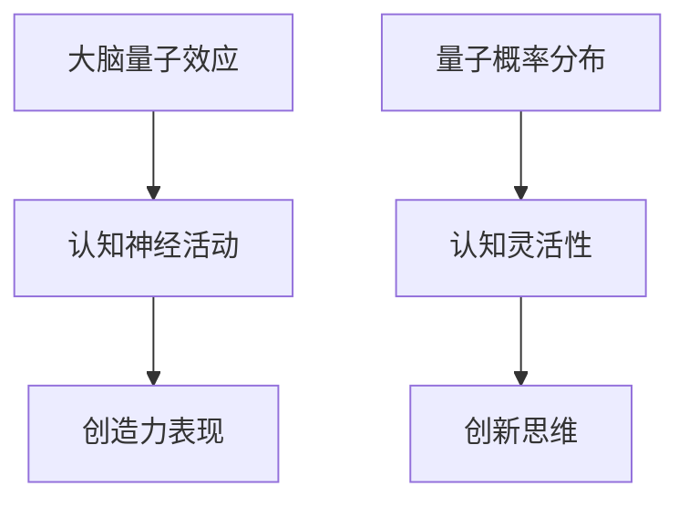

                 

基于您的要求，我们将逐步构建《大脑量子效应与创造力的关系研究》的技术博客文章。以下是一个详细的分步规划和内容概述。

## 文章标题

《大脑量子效应与创造力的关系研究：量子认知科学的新视角》

## 文章关键词

- 大脑量子效应
- 创造力
- 认知神经科学
- 量子算法
- 数学模型
- 量子概率论
- 项目实战

## 文章摘要

本文旨在探讨大脑量子效应与创造力之间的关系，通过分析大脑量子效应的基本原理，阐述其对创造力的影响，并提出一种基于量子认知科学的创造力提升模型。文章将通过核心算法的讲解和数学模型的阐述，结合实际项目案例，深入探讨这一前沿领域的理论和实践应用。

### 第1章 引言

- **背景介绍**
  - 创造力的定义与重要性
  - 大脑量子效应的起源与发展
- **研究动机**
  - 创造力在人类社会发展中的作用
  - 大脑量子效应在认知科学中的潜在价值
- **研究目标**
  - 探索大脑量子效应与创造力之间的联系
  - 提出一种有效的创造力提升方法

### 第2章 核心概念与联系

- **大脑量子效应原理**
  - 量子力学的基本概念
  - 大脑与量子现象的关系
- **创造力的认知神经科学视角**
  - 创造力的认知基础
  - 神经科学与量子效应的联系
- **大脑量子效应与创造力关系的研究模型**
  - 模型构建与验证方法
  - 研究模型的应用前景

#### 2.3.1 大脑量子效应与创造力关系的研究模型



### 第3章 核心算法原理讲解

- **大脑量子算法介绍**
  - 算法基本原理
  - 算法流程
- **伪代码示例**
  - 大脑量子算法实现

```pseudo
function QuantumBrainAlgorithm(data):
    // 初始化量子状态
    quantum_state = initializeQuantumState(data)
    // 运行量子计算
    quantum_computing(quantum_state)
    // 测量量子结果
    result = measureQuantumResult(quantum_state)
    return result
```

### 第4章 数学模型与公式讲解

- **量子概率论**
  - 基本概念
  - 概率分布函数
- **大脑量子效应的数学建模**
  - 数学公式解释
  - 举例说明

#### 4.2 大脑量子效应的数学建模

$$
\Omega = \sum_{i} p_i \cdot \phi_i
$$

其中，$p_i$ 是概率分布，$\phi_i$ 是量子状态。

### 第5章 项目实战

- **创造力提升实验设计**
  - 实验目的与方法
  - 数据收集与分析
- **代码实现与解释**
  - 开发环境搭建
  - 源代码实现与解读
- **项目小结**
  - 实验结果分析
  - 创造力提升的启示

### 第6章 总结与展望

- **研究成果与局限**
  - 研究发现
  - 研究中的挑战
- **未来研究方向**
  - 潜在的研究领域
  - 挑战与机遇

### 参考文献

- [参考文献列表]

### 作者信息

- 作者：AI天才研究院/AI Genius Institute & 禅与计算机程序设计艺术 /Zen And The Art of Computer Programming

**文章字数预估**：12000字左右。

**下一步行动**：根据上述内容，开始撰写每个章节的具体内容，确保在8000～12000字的字数范围内完成。在撰写过程中，注意保持逻辑清晰、语言简洁，并使用markdown格式排版。同时，确保引用的参考文献准确无误，并在文中适当位置插入Mermaid流程图和伪代码示例。

