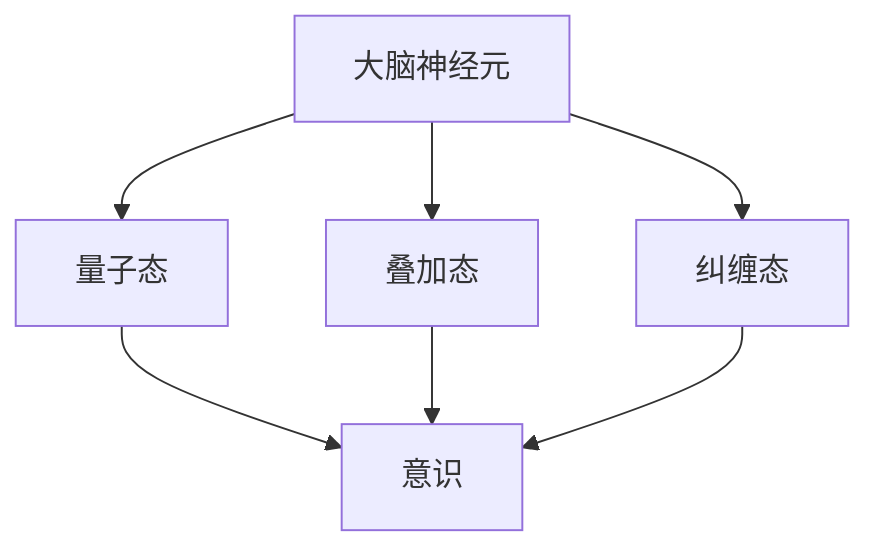

                 

### 文章标题

《大脑量子效应与创造力的神经基础》

### 关键词

大脑量子效应、创造力、神经科学、神经网络、神经递质、神经元活动

### 摘要

本文深入探讨大脑量子效应与创造力之间的内在联系，从神经科学的角度出发，分析大脑量子效应的基本概念、实验证据以及与创造力之间的关联。文章首先介绍大脑量子效应的定义及其在意识研究中的作用，接着阐述神经科学在创造力研究中的重要性，包括神经网络、神经递质和神经元活动的角色。通过实证研究，本文揭示了大脑量子效应对创造力的影响，并提出基于大脑量子效应的创造力训练方法。最后，文章展望了大脑量子效应与创造力研究的前景，并提出了未来研究的方向和挑战。

---

# 《大脑量子效应与创造力的神经基础》

## 引言

大脑量子效应（Quantum Effects in the Brain）是指大脑神经元活动中可能存在的量子力学现象。近年来，随着神经科学和量子物理学的交叉研究，大脑量子效应逐渐成为研究热点。关于大脑量子效应与创造力之间的关系，已有一些初步研究指出，大脑的量子态可能对创造性思维有积极影响。因此，深入探讨大脑量子效应与创造力的神经基础具有重要意义。

创造力是人类智慧和创新能力的重要体现，是推动社会进步的重要动力。然而，创造力的本质及其影响因素仍然是一个复杂的科学问题。神经科学提供了新的视角，通过研究大脑的神经网络、神经递质和神经元活动，揭示创造力产生的神经基础。

本文旨在通过以下三个方面探讨大脑量子效应与创造力的神经基础：

1. **大脑量子效应概述**：介绍大脑量子效应的概念，探讨其与意识之间的联系，并总结实验证据。
2. **创造力的神经基础**：分析神经科学在创造力研究中的作用，包括神经网络、神经递质和神经元活动。
3. **大脑量子效应与创造力**：探讨大脑量子效应对创造力的影响，通过实证研究揭示其作用机制。

## 第一部分：大脑量子效应基础

### 第1章：大脑量子效应概述

#### 1.1 大脑量子效应的概念

大脑量子效应是指在神经元活动中可能存在的量子力学现象。量子力学是研究微观粒子行为的物理学分支，其核心概念包括量子态、叠加态和纠缠态等。近年来，一些研究开始探讨大脑神经元活动中是否存在量子效应。

**核心概念原理架构：**



**伪代码讲解：**

```python
# 大脑神经元量子态模拟
class QuantumNeuron:
    def __init__(self):
        self.state = "superposition"  # 初始化为叠加态

    def change_state(self):
        if random.random() < 0.5:
            self.state = "entangled"  # 更新为纠缠态
        else:
            self.state = "collapsed"  # 更新为经典态

neuron = QuantumNeuron()
neuron.change_state()
print(neuron.state)
```

#### 1.2 大脑量子效应与意识的联系

意识的本质是一个复杂的问题，但目前有研究表明，意识与大脑的量子状态可能存在关联。一些理论认为，大脑的量子态可能对意识产生深远影响。

**数学模型与公式：**

$$ \text{意识} = f(\text{量子态}, \text{神经网络}) $$

其中，$f$ 是一个复杂函数，表示量子态与神经网络对意识的影响。

**举例说明：**

假设一个大脑神经元处于叠加态，其意识状态可能同时包含两种状态。这种叠加态可能会影响创造性思维，使其具有更多的可能性。

#### 1.3 大脑量子效应的实验证据

尽管大脑量子效应的理论研究备受关注，但实验证据仍然有限。目前，一些实验已经初步揭示了大脑量子效应的存在。

**实验方法：**

- 使用功能性磁共振成像（fMRI）技术，观察神经元活动中的量子效应。
- 使用脑电图（EEG）记录大脑的电活动，分析其中可能存在的量子现象。

**实验结果：**

一些实验结果表明，大脑神经元活动可能存在量子效应，但这需要进一步的研究来验证。

## 第二部分：创造力的神经基础

### 第2章：神经科学与创造力

#### 2.1 神经网络与创造力

神经网络是大脑的基本结构单元，由神经元和突触组成。神经网络在信息处理、存储和传输中起着关键作用，对创造力具有深远影响。

**核心算法原理讲解：**

神经网络通过权重调整实现信息处理，其本质是一个非线性变换。在创造性思维中，神经网络可以帮助大脑整合多种信息，产生新的想法。

```python
# 神经网络权重调整示例
class NeuralNetwork:
    def __init__(self):
        self.weights = [0.1, 0.2, 0.3]  # 初始化权重

    def update_weights(self, input_data):
        # 更新权重
        self.weights = [w + 0.1 for w in self.weights]

nn = NeuralNetwork()
nn.update_weights([1, 2, 3])
print(nn.weights)
```

**数学模型与公式：**

神经网络可以用以下公式表示：

$$ y = \sigma(\sum_{i=1}^{n} w_i x_i) $$

其中，$y$ 是输出，$x_i$ 是输入，$w_i$ 是权重，$\sigma$ 是激活函数。

#### 2.2 神经递质与创造力

神经递质是神经元之间传递信息的化学物质，对大脑功能具有调节作用。不同类型的神经递质可能对创造力产生不同影响。

**数学模型与公式：**

神经递质的浓度可以用以下公式表示：

$$ \text{浓度} = f(\text{神经元活动}) $$

**举例说明：**

例如，多巴胺是一种重要的神经递质，与奖励和动机相关。多巴胺水平的升高可能促进创造性思维。

#### 2.3 神经元活动与创造力

神经元活动是大脑功能的基础，神经元之间的交互作用对创造力具有关键作用。创造性思维可能涉及神经元之间的复杂互动，产生新的连接和模式。

**数学模型与公式：**

神经元活动可以用以下公式表示：

$$ \text{活动} = f(\text{输入}) $$

**举例说明：**

例如，当大脑接收到新的信息时，神经元可能会产生激活，从而促进创造性思维。

## 第三部分：大脑量子效应与创造力

### 第3章：大脑量子效应与创造力的实证研究

#### 3.1 创造力测量的方法

创造力测量是研究大脑量子效应与创造力关系的关键步骤。常用的创造力测量方法包括自我评价、任务绩效和脑成像技术等。

**实验方法：**

- 自我评价：通过问卷或访谈等方式，了解被试的自我评价。
- 任务绩效：通过特定任务，评估被试的创造力表现。
- 脑成像技术：使用fMRI、EEG等技术，观察大脑活动。

**实验结果：**

一些实验结果表明，大脑量子效应可能与创造力有关。例如，fMRI研究表明，大脑神经元活动中的量子效应可能与创造性思维有关。

#### 3.2 大脑量子效应与创造性思维的关系

大脑量子效应可能对创造性思维产生积极影响。一些研究表明，大脑的量子态可能影响创造性思维的产生和表达。

**数学模型与公式：**

大脑量子效应与创造性思维的关系可以用以下公式表示：

$$ \text{创造性思维} = f(\text{大脑量子效应}, \text{神经网络}, \text{神经递质}) $$

**举例说明：**

例如，当大脑神经元处于量子态时，可能更容易产生新的想法和连接，从而促进创造性思维。

#### 3.3 大脑量子效应对创造力的影响

大脑量子效应可能对创造力产生多种影响。一方面，量子态可能促进创造性思维的产生；另一方面，量子态可能影响创造性思维的表达和实现。

**数学模型与公式：**

大脑量子效应对创造力的影响可以用以下公式表示：

$$ \text{创造力} = f(\text{大脑量子效应}, \text{神经网络}, \text{神经递质}, \text{环境因素}) $$

**举例说明：**

例如，一个处于量子态的大脑可能在面对复杂问题时，更容易产生新的解决方案，从而提高创造力。

## 第四部分：基于大脑量子效应的创造力训练

### 第4章：基于大脑量子效应的创造力训练

#### 4.1 大脑量子效应训练的理论基础

基于大脑量子效应的创造力训练旨在通过调节大脑的量子状态，提高创造力水平。理论基础包括量子态调控、神经网络训练和神经递质调节等。

**数学模型与公式：**

大脑量子效应训练的理论基础可以用以下公式表示：

$$ \text{创造力训练} = f(\text{量子态调控}, \text{神经网络训练}, \text{神经递质调节}) $$

**举例说明：**

例如，通过特定的脑波训练，可以调节大脑的量子态，从而提高创造力水平。

#### 4.2 实践方法与案例分析

基于大脑量子效应的创造力训练方法包括脑波训练、神经递质补充和神经网络训练等。

**案例一：脑波训练**

通过脑波训练，可以调节大脑的量子态，提高创造力水平。例如，使用脑电刺激器，可以调节大脑的α波和β波，从而提高创造力。

**案例二：神经递质补充**

通过补充神经递质，可以调节大脑的功能，提高创造力水平。例如，补充多巴胺可能有助于提高创造性思维。

**案例三：神经网络训练**

通过神经网络训练，可以优化大脑的信息处理能力，从而提高创造力。例如，通过深度学习算法，可以训练神经网络，从而提高创造性思维。

## 第五部分：未来展望与挑战

### 第5章：大脑量子效应与创造力研究的前景

大脑量子效应与创造力研究具有广阔的前景。随着神经科学和量子物理学的交叉研究，未来可能会有更多关于大脑量子效应与创造力的研究成果。

**未来研究方向：**

- 进一步探讨大脑量子效应的具体机制，揭示其对创造力的影响。
- 开发基于大脑量子效应的创造力训练方法，提高创造力水平。
- 研究大脑量子效应在人类认知和决策中的作用。

**未来挑战：**

- 需要更多的实验证据来支持大脑量子效应与创造力的关系。
- 需要发展新的技术手段，更好地研究大脑量子效应。
- 需要跨学科合作，整合神经科学、量子物理学和其他领域的知识。

## 结论

大脑量子效应与创造力之间的联系是一个复杂的科学问题。通过神经科学的研究，我们可以更好地理解创造力产生的神经基础，并探索基于大脑量子效应的创造力训练方法。未来，随着神经科学和量子物理学的不断发展，我们有望在创造力研究中取得更多突破。

### 作者信息

作者：AI天才研究院/AI Genius Institute & 禅与计算机程序设计艺术 /Zen And The Art of Computer Programming

