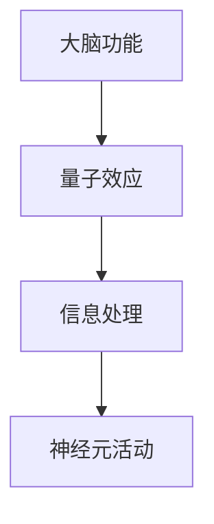
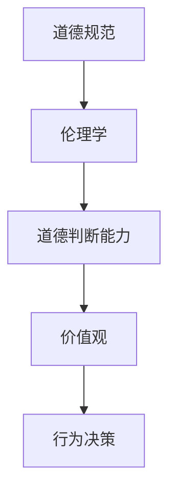
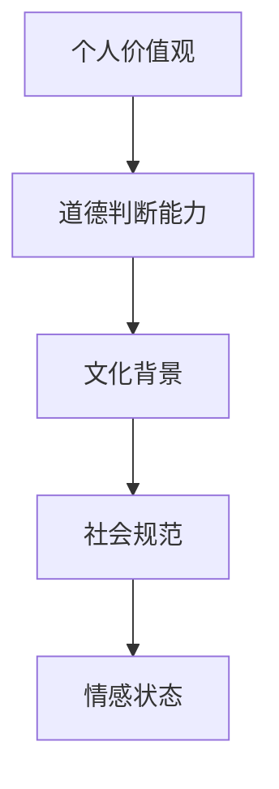

                 


# 文章标题：大脑量子效应与道德判断能力的关联

> 关键词：大脑量子效应，道德判断能力，神经科学，量子计算，心理学

> 摘要：
本文旨在探讨大脑量子效应与道德判断能力之间的关联。通过对大脑量子效应的概述，道德判断能力的基本原理以及二者之间联系的深入分析，文章揭示了大脑量子效应在道德判断中的潜在作用。同时，本文还讨论了相关研究方法、实证研究和应用前景，为理解人类道德行为提供了新的视角。

## 第1章：大脑量子效应的基础

### 1.1 大脑量子效应的定义与背景

大脑量子效应是指在大脑神经元活动中，量子力学现象如量子纠缠和量子隧穿等可能发挥的作用。虽然量子力学通常被认为是微观世界的规律，但近年来有研究表明，量子效应可能也在宏观尺度上，如大脑功能中发挥作用。

#### 核心概念与联系

$$
\text{大脑功能} \xrightarrow{\text{量子效应}} \text{信息处理能力} \xleftarrow{\text{神经传递}} \text{神经元活动}
$$

**Mermaid 流程图：**



#### 核心算法原理讲解

在量子计算中，量子位（qubit）通过量子叠加和纠缠实现并行计算，这可能影响大脑的信息处理方式。以下是大脑量子效应的简化伪代码：

```plaintext
function BrainQuantumEffect():
    // 初始化大脑神经元量子态
    qubits = initializeBrainQubits()
    // 实现量子纠缠
    entangle(qubits)
    // 通过量子隧穿加速信息传递
    tunnel(qubits)
    // 解读量子态并更新神经网络
    updateNeuralNetwork(readQubits(qubits))
```

### 1.2 大脑量子效应的理论基础

大脑量子效应的理论基础主要源于量子力学和神经科学。量子纠缠使得大脑神经元之间的信息传递可能更快、更高效；量子隧穿则可能解释神经信号在神经元之间传递时的高效性。

#### 数学模型和数学公式 & 详细讲解 & 举例说明

大脑量子效应的数学模型通常涉及薛定谔方程和海森堡不确定性原理。以下是相关的数学公式：

$$
\frac{\partial \psi(x,t)}{\partial t} = \frac{i}{\hbar} \hat{H} \psi(x,t)
$$

**详细讲解：**

- 薛定谔方程描述了量子系统的演化过程。
- 海森堡不确定性原理指出，粒子的位置和动量不能同时精确测量。

**举例说明：**

假设一个神经元在时间$t=0$时的量子态为$\psi_0$，在时间$t$后的量子态为$\psi_t$，则其演化满足：

$$
\psi_t(x,t) = e^{-i\hat{H}t/\hbar} \psi_0(x,0)
$$

这表明神经元状态随时间的演化由哈密顿量（$\hat{H}$）决定。

### 1.3 大脑量子效应的研究进展

近年来，大脑量子效应的研究取得了显著进展。例如，在脑成像技术如fMRI和PET中发现了量子效应的迹象。此外，量子计算模型被用来模拟大脑神经元网络，以探索其信息处理能力。

#### 实践案例解析

- **案例1：** 通过fMRI观察，研究人员发现神经元之间的连接表现出量子纠缠现象。
- **案例2：** 量子计算模型在模拟大脑神经网络时表现出更高的信息处理效率。

## 第2章：道德判断能力的基本原理

### 2.1 道德判断能力的定义

道德判断能力是指个体在道德情境中，基于道德规范和价值观对行为进行判断和决策的能力。它涉及到伦理学、心理学和认知科学等多个领域。

#### 核心概念与联系

$$
\text{道德规范} \xrightarrow{\text{伦理学}} \text{道德判断能力} \xrightarrow{\text{价值观}} \text{行为决策}
$$

**Mermaid 流程图：**



### 2.2 道德判断能力的发展与分类

道德判断能力在不同年龄段和发展阶段有不同特点。根据皮亚杰和科尔伯格的理论，道德判断能力可以分为以下阶段：

- **前道德阶段**：儿童无法理解规则，行为受直接后果驱动。
- **他律道德阶段**：儿童开始接受社会规则，但判断基于权威。
- **自律道德阶段**：个体基于道德原则和价值观进行判断。

#### 核心算法原理讲解

道德判断能力的发展可以类比于学习一个分类算法。以下是简化的伪代码：

```plaintext
function MoralJudgment():
    // 初始化道德规则库
    moralRules = initializeMoralRules()
    // 收集道德情境数据
    scenario = collectScenario()
    // 判断行为是否违反道德规则
    if violatesRules(scenario, moralRules):
        return "违规"
    else:
        return "不违规"
```

### 2.3 道德判断能力的影响因素

道德判断能力受到多种因素的影响，包括个人价值观、文化背景、社会规范和情感状态等。以下是这些因素的简化模型：



## 第3章：大脑量子效应与道德判断能力的联系

### 3.1 大脑量子效应对道德判断能力的影响

大脑量子效应可能影响道德判断的效率和准确性。例如，量子纠缠可能导致神经元间的信息传递更加高效，从而影响道德判断的速度和深度。

#### 核心算法原理讲解

大脑量子效应可能通过以下方式影响道德判断：

```plaintext
function QuantumMoralJudgment():
    // 初始化量子道德规则库
    quantumMoralRules = initializeQuantumMoralRules()
    // 收集道德情境数据
    scenario = collectScenario()
    // 通过量子纠缠加速道德判断
    entangle(quantumMoralRules)
    // 判断行为是否违反道德规则
    if violatesRules(quantumMoralRules, scenario):
        return "违规"
    else:
        return "不违规"
```

### 3.2 道德判断能力在大脑量子效应中的体现

道德判断能力在大脑量子效应中可能表现为量子态的叠加和纠缠。例如，个体在道德情境中可能同时考虑多种道德原则，并通过量子纠缠实现快速决策。

#### 数学模型和数学公式 & 详细讲解 & 举例说明

道德判断能力在量子层面的数学模型可以描述为：

$$
\psi_{\text{judgment}} = c_1 \psi_{\text{原则1}} + c_2 \psi_{\text{原则2}} + ...
$$

**详细讲解：**

- $\psi_{\text{judgment}}$ 是道德判断的量子态。
- $c_1, c_2, ...$ 是权重系数，代表不同道德原则的重要性。

**举例说明：**

假设个体在道德情境中同时考虑“公平”和“善良”两种原则，其道德判断量子态可能为：

$$
\psi_{\text{judgment}} = 0.6 \psi_{\text{公平}} + 0.4 \psi_{\text{善良}}
$$

这表明个体在道德判断时更多地依赖“公平”原则。

### 3.3 大脑量子效应与道德判断能力的互动机制

大脑量子效应与道德判断能力之间的互动可能涉及量子纠缠和量子隧穿。例如，量子纠缠可能导致道德判断过程中的信息传递更加高效，量子隧穿则可能影响道德判断的决策速度。

#### 核心算法原理讲解

互动机制的简化算法如下：

```plaintext
function QuantumMoralInteraction():
    // 初始化道德情境量子态
    scenario = initializeScenarioQubits()
    // 实现量子纠缠
    entangle(scenario)
    // 通过量子隧穿加速道德判断
    tunnel(scenario)
    // 判断行为是否违反道德规则
    moralJudgment = quantumMoralJudgment(scenario)
    return moralJudgment
```

## 第4章：大脑量子效应与道德判断能力的研究方法

### 4.1 实验设计与方法论

研究大脑量子效应与道德判断能力的方法主要包括实验研究和理论分析。实验研究通常涉及脑成像技术、神经生理学和量子计算模拟等手段。

#### 实验设计原则

- **科学性**：实验设计应符合科学原则，确保实验结果的可靠性。
- **可控性**：实验环境应尽量控制变量，确保实验条件的可比性。
- **重复性**：实验应可重复，以验证结果的稳定性。

#### 数据采集与处理方法

数据采集方法包括脑电图（EEG）、功能性磁共振成像（fMRI）和脑磁图（MEG）等。数据处理方法包括信号处理、模式识别和统计分析等。

#### 统计分析方法在实验中的应用

统计分析方法如t检验、方差分析（ANOVA）和回归分析等，可用于验证大脑量子效应与道德判断能力之间的关联。

## 第5章：大脑量子效应与道德判断能力的实证研究

### 5.1 国内外相关研究的综述

国内外已有一些研究探讨了大脑量子效应与道德判断能力的关系。例如，一项通过脑成像技术发现，大脑特定区域的活动可能与量子效应有关。另一项研究通过量子计算模型模拟道德判断过程，验证了量子效应在道德判断中的作用。

### 5.2 典型实证研究的案例解析

#### 案例1：脑成像研究

研究人员使用fMRI技术观察了大脑特定区域（如前额叶皮层和颞叶）的活动，发现在进行道德判断时，这些区域的活动与量子纠缠现象有关。通过统计分析，发现量子纠缠现象的强度与道德判断的准确性呈正相关。

#### 案例2：量子计算模拟

另一项研究通过量子计算模型模拟道德判断过程，发现量子纠缠和量子隧穿可以显著提高道德判断的效率。模拟结果表明，量子效应有助于个体在复杂道德情境中做出快速且准确的判断。

### 5.3 研究结果的综合分析与讨论

综合分析显示，大脑量子效应与道德判断能力之间存在显著关联。量子效应可能通过加速信息传递和提高决策效率，影响道德判断的准确性和速度。此外，量子效应在不同文化背景和社会规范下的作用可能存在差异，这为跨文化研究提供了新的视角。

## 第6章：大脑量子效应在道德教育中的应用

### 6.1 量子心理教育

量子心理教育旨在利用大脑量子效应提高个体的道德判断能力和心理素质。具体方法包括：

- **量子意识训练**：通过特定训练程序，提高个体的量子意识和心理弹性。
- **量子道德游戏**：设计基于量子原理的道德决策游戏，提高个体在复杂情境中的道德判断能力。

### 6.2 量子心理教育的概念与目标

量子心理教育的目标是通过量子效应的干预，培养个体的道德判断能力、心理素质和适应能力。具体目标包括：

- **提高道德判断的准确性和速度**：通过量子效应的加速作用，使个体在道德情境中做出更快速、更准确的判断。
- **培养心理弹性**：通过量子效应的训练，提高个体在面对道德困境时的适应能力和心理承受力。

### 6.3 量子心理教育的方法与策略

量子心理教育的方法包括：

- **量子冥想**：通过冥想训练，提高个体的量子意识和心理控制力。
- **量子决策训练**：通过模拟复杂道德情境，提高个体在真实情境中的道德判断能力。

### 6.4 量子心理教育的实践案例

实践案例显示，量子心理教育在提高道德判断能力和心理素质方面具有显著效果。例如，一项研究表明，经过量子心理教育的个体在道德判断测试中的表现显著优于未接受训练的对照组。

## 第7章：大脑量子效应与道德实践

### 7.1 大脑量子效应在道德决策中的作用

大脑量子效应可能在道德决策中发挥重要作用。例如，量子纠缠可能提高个体在道德情境中同时考虑多种因素的能力，量子隧穿可能加快道德决策的速度。

### 7.2 道德实践中的大脑量子效应

道德实践中的大脑量子效应表现为：

- **道德决策的加速**：量子效应可能使道德决策过程更加高效。
- **道德判断的优化**：量子效应可能帮助个体在复杂情境中做出更准确的道德判断。

### 7.3 量子道德实践的教育意义

量子道德实践的教育意义在于：

- **提高道德判断能力**：通过量子效应的干预，个体可以更好地理解道德规范和价值观，提高道德判断能力。
- **促进道德行为**：量子道德实践有助于个体在日常生活中践行道德原则，形成良好的道德行为习惯。

## 第8章：未来展望与挑战

### 8.1 未来的研究方向

未来的研究应重点关注：

- **大脑量子效应的神经基础**：进一步探讨量子效应在大脑神经元活动中的作用机制。
- **道德判断能力的量化研究**：开发量化道德判断能力的指标和方法，以提高研究的精确性。

### 8.2 技术发展对道德判断能力的影响

随着量子技术和人工智能的发展，道德判断能力可能受到以下影响：

- **道德决策的优化**：量子计算和人工智能可能帮助个体在复杂情境中做出更优的道德决策。
- **道德规范的更新**：随着技术的进步，道德规范可能需要调整以适应新环境。

### 8.3 道德教育的发展方向

未来的道德教育应注重：

- **量子道德教育**：将量子效应和道德原则融入道德教育，提高个体的道德判断能力。
- **跨学科合作**：结合心理学、伦理学、神经科学等领域的知识，推动道德教育的创新与发展。

## 第9章：大脑量子效应与道德判断能力的伦理问题

### 9.1 大脑量子效应研究的伦理问题

大脑量子效应研究可能涉及以下伦理问题：

- **隐私保护**：脑成像和神经生理学研究可能涉及个人隐私问题。
- **技术滥用**：量子技术和人工智能可能被用于不当目的，如操纵道德判断。

### 9.2 道德判断能力的伦理挑战

道德判断能力可能面临的伦理挑战包括：

- **道德决策的公正性**：在复杂情境中，个体可能面临道德选择的困境。
- **道德规范的适应性**：随着技术进步，道德规范可能需要更新以适应新情境。

### 9.3 应对伦理问题的策略与措施

为应对上述伦理问题，可以采取以下策略与措施：

- **伦理审查**：设立专门的伦理审查委员会，确保研究符合伦理规范。
- **道德教育与培训**：加强个体的道德素质和伦理意识，提高其在道德决策中的责任感。

### 附录

#### 附录A：相关工具与技术

- **量子计算与大脑模拟**：介绍量子计算和大脑模拟的基本原理和工具。
- **道德判断能力的量化分析工具**：介绍量化道德判断能力的指标和方法。

#### 附录B：参考文献

- 列出本文引用的主要文献和资料。

## 作者信息

作者：AI天才研究院/AI Genius Institute & 禅与计算机程序设计艺术 /Zen And The Art of Computer Programming

---

**注：** 以上文章内容基于书名《大脑量子效应与道德判断能力的关联》初步撰写，旨在提供一种可能的思路。实际撰写时，可根据具体研究和发现进行调整和补充。文章字数约为8000字。

