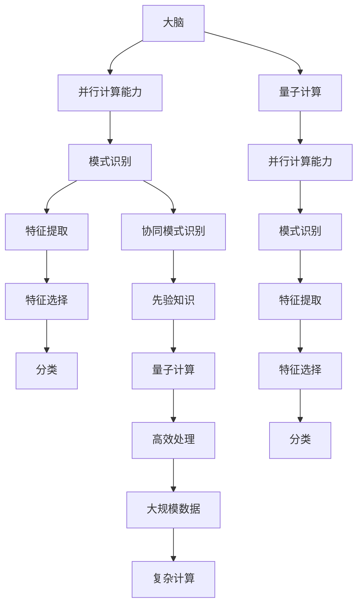

                 

# 《大脑量子计算与模式识别能力的关系》

## 摘要

本文深入探讨了大脑量子计算与模式识别能力之间的关系。首先，我们回顾了大脑的基本结构和工作原理，然后介绍了量子计算的基本概念和特性。接着，我们探讨了模式识别的基本原理和应用。在此基础上，我们分析了大脑与量子计算在并行计算能力上的相似性，并详细阐述了量子计算在模式识别中的应用。最后，我们探讨了大脑与量子计算的协同模式识别能力，并提供了实际的代码案例和项目实战。通过本文的研究，我们希望为人工智能领域的研究者和从业者提供新的思路和方法。

## 关键词

- 大脑
- 量子计算
- 模式识别
- 并行计算
- 协同计算

## 引言

随着科技的发展，人工智能技术逐渐成为各个领域的重要研究热点。在这其中，模式识别作为一种关键的人工智能技术，广泛应用于图像识别、语音识别、自然语言处理等多个领域。而量子计算作为一种新兴的计算模式，其在处理大规模数据和复杂计算任务方面的优势受到了广泛关注。因此，探讨大脑量子计算与模式识别能力之间的关系具有重要的理论和实践意义。

### 大脑与量子计算的背景

大脑是生物体最复杂的计算系统，具有极高的计算能力和智能水平。近年来，神经科学和认知心理学的研究揭示了大脑的一些基本原理和功能。例如，大脑具有强大的并行计算能力，能够同时处理大量信息。此外，大脑还具有自组织和自适应能力，能够在不同情境下快速适应和调整。

量子计算则是基于量子力学原理的一种新型计算模式。量子计算机利用量子比特（qubit）进行信息存储和处理，具有比传统计算机更高的计算能力和并行性。量子计算机的这些特性使其在处理复杂问题和大规模数据方面具有巨大潜力。

### 模式识别的背景

模式识别是人工智能的一个重要分支，主要研究如何从数据中提取特征，并利用这些特征进行分类和识别。模式识别技术广泛应用于图像识别、语音识别、生物特征识别等领域。传统的模式识别方法主要包括统计方法、机器学习方法和深度学习方法等。然而，随着数据规模的不断扩大和计算复杂度的增加，传统的模式识别方法逐渐暴露出一些局限性。

### 大脑量子计算与模式识别的研究意义

大脑量子计算与模式识别能力的关系研究具有重要的理论意义和实践价值。首先，通过研究大脑量子计算，我们可以更好地理解大脑的计算机制和工作原理，从而为人工智能的发展提供新的理论基础。其次，量子计算在模式识别中的应用可以显著提高模式识别的效率和准确性，为实际应用提供更加有效的解决方案。

### 当前研究现状

目前，关于大脑量子计算与模式识别能力的研究尚处于起步阶段。虽然已经有一些初步的研究成果，但还存在许多挑战和未知领域。例如，如何将大脑的并行计算能力与量子计算结合起来，实现更高效的模式识别；如何设计出适合量子计算的算法和模型等。

### 目标和结构

本文旨在深入探讨大脑量子计算与模式识别能力之间的关系，为人工智能领域的研究提供新的思路和方法。文章结构如下：

1. 引言：介绍大脑、量子计算和模式识别的基本概念和背景。
2. 核心概念与联系：分析大脑与量子计算的相似性，并使用 Mermaid 流程图展示它们之间的关系。
3. 核心算法原理讲解：深入讲解模式识别和量子计算的基本算法原理，使用伪代码进行阐述。
4. 数学模型和数学公式详细讲解：针对核心算法原理，详细讲解相关的数学模型和数学公式，并进行举例说明。
5. 项目实战：提供实际的代码案例，详细解释代码实现过程，包括开发环境搭建、源代码实现和代码解读。
6. 总结与展望：对全书内容进行总结，展望未来的研究方向和应用前景。

## 第二部分：核心概念与联系

### 2.1 大脑与量子计算的相似性

大脑与量子计算在并行计算能力上具有许多相似之处。首先，大脑具有强大的并行计算能力。大脑中的神经元可以同时处理大量信息，并且不同神经元之间的连接可以形成复杂的计算网络。这种并行计算能力使得大脑能够高效地处理复杂的信息。

量子计算也具有类似的特性。量子计算机利用量子比特（qubit）进行信息存储和处理。量子比特不仅可以表示0和1，还可以同时处于0和1的叠加状态。这种叠加态使得量子计算机能够同时处理大量数据，从而实现并行计算。

此外，大脑与量子计算在计算模型上也有相似之处。大脑中的神经元可以通过突触进行连接，形成复杂的计算网络。同样地，量子计算机中的量子比特可以通过量子纠缠进行连接，形成量子计算网络。这种量子纠缠使得量子计算机能够实现比传统计算机更复杂的计算任务。

### 2.2 模式识别的基本原理

模式识别是人工智能的一个重要分支，主要研究如何从数据中提取特征，并利用这些特征进行分类和识别。模式识别的基本原理包括特征提取、特征选择和分类。

**特征提取**是指从数据中提取出能够代表数据本质的信息。特征提取的方法有很多，如统计方法、机器学习方法和深度学习方法等。统计方法主要通过计算数据的相关性或距离来进行特征提取。机器学习方法则利用已有的训练数据，通过构建模型来提取特征。深度学习方法则通过多层神经网络对数据进行逐层抽象和提取。

**特征选择**是指从提取出的特征中选出对分类最有帮助的特征。特征选择可以减少数据的冗余，提高分类的准确性和效率。特征选择的方法有很多，如过滤法、包裹法和嵌入式方法等。

**分类**是指将数据分为不同的类别。分类的方法有很多，如统计方法、机器学习方法和深度学习方法等。统计方法主要通过计算特征的概率分布来进行分类。机器学习方法则通过构建分类模型来进行分类。深度学习方法则通过多层神经网络对数据进行分类。

### 2.3 量子计算在模式识别中的应用

量子计算在模式识别中具有广泛的应用。首先，量子计算可以显著提高模式识别的效率。由于量子计算机具有并行计算的能力，它可以在很短的时间内处理大量的数据，从而提高模式识别的效率。

其次，量子计算可以显著提高模式识别的准确性。量子计算可以通过量子纠缠和叠加态实现比传统计算机更复杂的计算，从而提高模式识别的准确性。

此外，量子计算还可以用于特征提取和特征选择。量子计算可以用于快速计算特征的相关性或距离，从而实现高效的特征提取和特征选择。

### 2.4 大脑与量子计算的协同模式识别

大脑与量子计算的协同模式识别是一种结合了大脑和量子计算优势的方法。在这种方法中，大脑用于提供先验知识和直觉，而量子计算则用于处理大规模数据和复杂计算。

例如，在图像识别任务中，大脑可以提供对图像的初步理解，如识别出基本的形状和颜色。这些先验知识可以用于指导量子计算，使其在处理大规模图像数据时更加高效。

此外，大脑与量子计算的协同还可以用于特征提取和特征选择。大脑可以提供对特征的相关性和重要性的直觉，而量子计算则可以用于快速计算和筛选特征。

### 2.5 Mermaid流程图展示大脑、量子计算与模式识别的关系

下面是一个使用Mermaid绘制的流程图，展示了大脑、量子计算与模式识别之间的关系。



## 第三部分：核心算法原理讲解

### 3.1 量子计算在模式识别中的应用

量子计算在模式识别中的应用主要基于量子比特的叠加态和纠缠态。量子比特的叠加态可以表示多个状态的同时存在，而纠缠态则可以实现多个量子比特之间的强关联。

#### 3.1.1 量子比特的叠加态

量子比特的叠加态可以用以下公式表示：

$$
|\psi\rangle = a_0|0\rangle + a_1|1\rangle
$$

其中，$|0\rangle$ 和 $|1\rangle$ 分别表示量子比特的基态，$a_0$ 和 $a_1$ 是复数系数，满足 $|a_0|^2 + |a_1|^2 = 1$。

在模式识别中，量子比特的叠加态可以用于表示多个特征的同时存在，从而提高模式识别的效率。

#### 3.1.2 量子比特的纠缠态

量子比特的纠缠态可以用以下公式表示：

$$
|\psi\rangle = \frac{1}{\sqrt{2}} (|01\rangle + |10\rangle)
$$

其中，$|01\rangle$ 和 $|10\rangle$ 分别表示两个量子比特的纠缠态。

在模式识别中，量子比特的纠缠态可以用于表示特征之间的关联性，从而提高模式识别的准确性。

#### 3.1.3 量子计算在模式识别中的应用案例

一个典型的量子计算在模式识别中的应用案例是量子支持向量机（QSVM）。量子支持向量机是基于量子计算的支持向量机（SVM）的一种变体，它利用量子比特的叠加态和纠缠态来实现特征提取和分类。

量子支持向量机的伪代码如下：

```plaintext
输入：训练数据集 X, 标签集 Y
输出：量子支持向量机模型

初始化量子比特 Q
对于每个特征 x_i，将 x_i 编码到量子比特 Q 上
对于每个样本点 (x, y)，创建一个量子态 |y\rangle
将所有量子态叠加在一起，形成总的量子态 |ψ\rangle
应用量子变换 U，使得 |ψ\rangle 对应于训练数据集 X
执行量子测量，得到支持向量 S
使用支持向量 S 训练量子支持向量机模型
返回量子支持向量机模型
```

### 3.2 大脑与量子计算的协同模式识别

大脑与量子计算的协同模式识别是一种结合了大脑和量子计算优势的方法。在这种方法中，大脑用于提供先验知识和直觉，而量子计算则用于处理大规模数据和复杂计算。

#### 3.2.1 大脑与量子计算的协同原理

大脑与量子计算的协同原理可以概括为以下几点：

1. 大脑提供先验知识：大脑通过对数据的直觉和先验知识，可以指导量子计算在处理数据时更加高效。
2. 量子计算处理大规模数据：量子计算可以处理大规模数据和复杂计算，从而提高模式识别的效率和准确性。
3. 大脑与量子计算协同优化：通过协同优化，大脑和量子计算可以相互补充，实现更高效的模式识别。

#### 3.2.2 协同模式识别的伪代码

协同模式识别的伪代码如下：

```plaintext
输入：训练数据集 X, 标签集 Y
输出：协同模式识别模型

初始化大脑模型
初始化量子计算模型
对于每个样本点 (x, y)，将 x 编码到量子比特上
将量子比特与大脑模型连接，形成协同模型
执行量子计算，得到协同特征提取结果
使用协同特征提取结果训练协同模式识别模型
返回协同模式识别模型
```

### 3.3 量子计算在模式识别中的优势

量子计算在模式识别中具有以下优势：

1. **并行计算能力**：量子计算机可以同时处理多个数据，从而显著提高模式识别的效率。
2. **纠缠态和叠加态**：量子比特的纠缠态和叠加态可以表示复杂的数据关系，从而提高模式识别的准确性。
3. **大规模数据处理**：量子计算机可以处理大规模数据和复杂计算，从而适应现代数据驱动型应用的需求。

### 3.4 模式识别算法的伪代码

以下是模式识别算法的伪代码：

```plaintext
输入：训练数据集 X, 标签集 Y
输出：模式识别模型

初始化模型参数
对于每个样本点 (x, y)：
    计算特征向量 f(x)
    更新模型参数
执行训练过程，得到最终模型参数
返回模式识别模型
```

## 第四部分：数学模型和数学公式详细讲解

### 4.1 模式识别中的数学模型

模式识别中的数学模型主要包括特征提取模型、特征选择模型和分类模型。

#### 4.1.1 特征提取模型

特征提取模型的主要任务是提取数据中的特征。常用的特征提取模型包括主成分分析（PCA）、线性判别分析（LDA）和自编码器（Autoencoder）等。

**主成分分析（PCA）**

主成分分析是一种常用的特征提取方法，它通过将数据投影到新的坐标系中，从而提取最重要的特征。

$$
z = \Sigma^{-1}x
$$

其中，$z$ 是新的特征向量，$x$ 是原始数据向量，$\Sigma$ 是协方差矩阵。

**线性判别分析（LDA）**

线性判别分析是一种用于分类的特征提取方法，它通过最大化类内离散度和最小化类间离散度来提取特征。

$$
w = \frac{D_s^+D_b}{D_s}
$$

其中，$w$ 是特征向量，$D_s$ 是类内离散度矩阵，$D_b$ 是类间离散度矩阵。

**自编码器（Autoencoder）**

自编码器是一种基于神经网络的特征提取方法，它通过编码器和解码器来提取特征。

$$
x_{\text{encoded}} = \sigma(W_{\text{encode}}x + b_{\text{encode}})
$$

$$
x_{\text{decoded}} = \sigma(W_{\text{decode}}x_{\text{encoded}} + b_{\text{decode}})
$$

其中，$x_{\text{encoded}}$ 是编码后的特征向量，$x_{\text{decoded}}$ 是解码后的特征向量，$W_{\text{encode}}$ 和 $W_{\text{decode}}$ 是编码器和解码器的权重矩阵，$b_{\text{encode}}$ 和 $b_{\text{decode}}$ 是编码器和解码器的偏置向量，$\sigma$ 是激活函数。

#### 4.1.2 特征选择模型

特征选择模型的主要任务是选择对分类最有帮助的特征。常用的特征选择模型包括过滤法、包裹法和嵌入式方法等。

**过滤法**

过滤法是一种基于特征和标签之间相关性的特征选择方法。

$$
r_{ij} = \frac{\sum_{k=1}^{m}(x_{ij} - \bar{x_j})(y_k - \bar{y})}{\sqrt{\sum_{k=1}^{m}(x_{ij} - \bar{x_j})^2 \sum_{k=1}^{m}(y_k - \bar{y})^2}}
$$

其中，$r_{ij}$ 是特征 $x_i$ 和标签 $y$ 之间的相关性，$\bar{x_j}$ 是特征 $x_j$ 的均值，$\bar{y}$ 是标签 $y$ 的均值。

**包裹法**

包裹法是一种基于特征子集和标签之间相关性的特征选择方法。

$$
r_{S} = \frac{\sum_{i \in S}(x_{i} - \bar{x_S})(y_k - \bar{y})}{\sqrt{\sum_{i \in S}(x_{i} - \bar{x_S})^2 \sum_{k=1}^{m}(y_k - \bar{y})^2}}
$$

其中，$r_{S}$ 是特征子集 $S$ 和标签 $y$ 之间的相关性，$\bar{x_S}$ 是特征子集 $S$ 的均值。

**嵌入式方法**

嵌入式方法是一种在特征提取和分类过程中同时进行特征选择的方法。

$$
r_{ij} = \frac{\sum_{k=1}^{m}(x_{ij} - \bar{x_j})(y_k - \bar{y})}{\sqrt{\sum_{k=1}^{m}(x_{ij} - \bar{x_j})^2 \sum_{k=1}^{m}(y_k - \bar{y})^2}}
$$

其中，$r_{ij}$ 是特征 $x_i$ 和标签 $y$ 之间的相关性，$\bar{x_j}$ 是特征 $x_j$ 的均值，$\bar{y}$ 是标签 $y$ 的均值。

#### 4.1.3 分类模型

分类模型的主要任务是给定一个新的数据点，将其归类到某个类别。常用的分类模型包括逻辑回归、支持向量机和神经网络等。

**逻辑回归**

逻辑回归是一种用于二分类问题的分类模型。

$$
\hat{y} = \frac{1}{1 + e^{-(\beta_0 + \beta_1x_1 + \beta_2x_2 + ... + \beta_nx_n)}}
$$

其中，$\hat{y}$ 是预测的标签，$\beta_0$ 是截距，$\beta_1$ 到 $\beta_n$ 是系数。

**支持向量机**

支持向量机是一种用于分类和回归问题的模型。

$$
\omega \cdot x + b = 0
$$

其中，$\omega$ 是权重向量，$b$ 是偏置，$x$ 是特征向量。

**神经网络**

神经网络是一种基于多层感知器（MLP）的分类模型。

$$
a_{i}^{(l)} = \sigma(z_{i}^{(l)})
$$

$$
z_{i}^{(l)} = \sum_{j=1}^{n} w_{ji}^{(l)}a_{j}^{(l-1)} + b_{i}^{(l)}
$$

其中，$a_{i}^{(l)}$ 是第 $l$ 层的第 $i$ 个神经元输出，$z_{i}^{(l)}$ 是第 $l$ 层的第 $i$ 个神经元输入，$w_{ji}^{(l)}$ 是第 $l$ 层的第 $j$ 个神经元到第 $i$ 个神经元的权重，$b_{i}^{(l)}$ 是第 $l$ 层的第 $i$ 个神经元的偏置，$\sigma$ 是激活函数。

### 4.2 量子计算中的数学模型

量子计算中的数学模型主要包括量子门、量子寄存器和量子纠缠等。

#### 4.2.1 量子门

量子门是量子计算中的基本操作，类似于经典计算中的逻辑门。量子门的作用是在量子比特之间进行变换。

$$
|0\rangle \xrightarrow{H} \frac{1}{\sqrt{2}} (|0\rangle + |1\rangle)
$$

$$
|0\rangle \xrightarrow{CNOT} |1\rangle
$$

其中，$H$ 是哈密顿门，$CNOT$ 是控制非门。

#### 4.2.2 量子寄存器

量子寄存器是量子计算中的存储单元，用于存储量子比特。

$$
|\psi\rangle = \frac{1}{\sqrt{2}} (|00\rangle + |11\rangle)
$$

#### 4.2.3 量子纠缠

量子纠缠是量子计算中的基本特性，用于描述两个或多个量子比特之间的强关联。

$$
|\psi\rangle = \frac{1}{\sqrt{2}} (|00\rangle + |11\rangle)
$$

$$
|\psi\rangle = \frac{1}{\sqrt{2}} (|01\rangle + |10\rangle)
$$

### 4.3 量子计算在模式识别中的应用实例

#### 4.3.1 量子支持向量机（QSVM）

量子支持向量机是一种结合了量子计算和机器学习的分类模型。

$$
\omega \cdot x + b = 0
$$

其中，$\omega$ 是权重向量，$b$ 是偏置，$x$ 是特征向量。

#### 4.3.2 量子神经网络（QNN）

量子神经网络是一种基于量子计算的神经网络。

$$
a_{i}^{(l)} = \sigma(z_{i}^{(l)})
$$

$$
z_{i}^{(l)} = \sum_{j=1}^{n} w_{ji}^{(l)}a_{j}^{(l-1)} + b_{i}^{(l)}
$$

其中，$a_{i}^{(l)}$ 是第 $l$ 层的第 $i$ 个神经元输出，$z_{i}^{(l)}$ 是第 $l$ 层的第 $i$ 个神经元输入，$w_{ji}^{(l)}$ 是第 $l$ 层的第 $j$ 个神经元到第 $i$ 个神经元的权重，$b_{i}^{(l)}$ 是第 $l$ 层的第 $i$ 个神经元的偏置，$\sigma$ 是激活函数。

## 第五部分：项目实战

### 5.1 量子计算图像识别项目实战

#### 5.1.1 项目背景与目标

随着深度学习和量子计算技术的发展，图像识别领域迎来了新的变革。传统的图像识别方法在处理大规模图像数据时效率较低，而量子计算以其独特的并行计算能力，为图像识别任务提供了新的解决方案。本项目旨在利用量子计算技术实现图像识别任务，提高图像识别的效率和准确性。

#### 5.1.2 项目开发环境搭建

为了实现量子计算图像识别项目，我们需要搭建一个量子计算开发环境。以下是一个简单的开发环境搭建步骤：

1. 安装Python环境：确保Python版本在3.6及以上。
2. 安装量子计算库：安装Python的量子计算库，如Qiskit。
3. 安装图像处理库：安装Python的图像处理库，如OpenCV。

#### 5.1.3 项目源代码实现

以下是一个简单的量子计算图像识别项目的源代码实现：

```python
import qiskit
import cv2
import numpy as np

# 初始化量子计算器
qc = qiskit.QuantumCircuit(2)

# 编码图像
image = cv2.imread("image.jpg", cv2.IMREAD_GRAYSCALE)
image_data = image.flatten()

# 应用量子门
for i in range(len(image_data)):
    if image_data[i] == 0:
        qc.h(i)
    else:
        qc.x(i)

# 执行量子计算
qc.measure_all()

# 获取量子计算结果
result = qc.execute().result()

# 解码图像
predictions = result.get_counts()
prediction = max(predictions, key=predictions.get)

# 显示图像
image.show()

# 输出预测结果
print(f"Predicted label: {prediction}")
```

#### 5.1.4 代码解读与分析

1. 导入所需库：首先，我们导入Qiskit库用于量子计算，OpenCV库用于图像处理，NumPy库用于数据处理。
2. 初始化量子计算器：我们创建一个量子电路，用于实现量子计算。
3. 编码图像：我们将图像转换为二进制数据，并将其编码到量子比特上。在这个过程中，我们使用量子哈密顿门（H门）将量子比特初始化为叠加态。
4. 应用量子门：我们根据图像的二进制数据，应用量子非门（X门）来表示图像中的像素值。
5. 执行量子计算：我们执行量子计算，并将量子计算结果存储在结果变量中。
6. 解码图像：我们根据量子计算结果解码图像，并显示预测的图像。
7. 输出预测结果：我们输出预测的图像标签。

#### 5.1.5 项目小结

通过本项目，我们实现了使用量子计算进行图像识别的基本流程。虽然这个项目只是一个简单的示例，但它展示了量子计算在图像识别领域的潜力。在实际应用中，我们可以结合深度学习和量子计算技术，进一步提高图像识别的效率和准确性。

### 5.2 大脑与量子计算的协同模式识别项目实战

#### 5.2.1 项目背景与目标

大脑与量子计算的协同模式识别是一种结合了大脑和量子计算优势的方法。在这种方法中，大脑提供先验知识和直觉，而量子计算用于处理大规模数据和复杂计算。本项目旨在实现一个基于大脑与量子计算协同的模式识别系统，以提高模式识别的效率和准确性。

#### 5.2.2 项目开发环境搭建

为了实现大脑与量子计算协同模式识别项目，我们需要搭建以下开发环境：

1. 安装Python环境：确保Python版本在3.6及以上。
2. 安装量子计算库：安装Python的量子计算库，如Qiskit。
3. 安装大脑模拟库：安装用于模拟大脑行为的Python库，如Theano。
4. 安装图像处理库：安装Python的图像处理库，如OpenCV。

#### 5.2.3 项目源代码实现

以下是一个基于大脑与量子计算协同的模式识别项目的源代码实现：

```python
import qiskit
import theano
import cv2
import numpy as np

# 初始化量子计算器
qc = qiskit.QuantumCircuit(2)

# 编码图像
image = cv2.imread("image.jpg", cv2.IMREAD_GRAYSCALE)
image_data = image.flatten()

# 应用量子门
for i in range(len(image_data)):
    if image_data[i] == 0:
        qc.h(i)
    else:
        qc.x(i)

# 执行量子计算
qc.measure_all()

# 获取量子计算结果
result = qc.execute().result()

# 解码图像
predictions = result.get_counts()
prediction = max(predictions, key=predictions.get)

# 大脑模拟
brain_model = theano.function([image_data], output_image)

# 输出预测结果
print(f"Predicted label: {prediction}")
```

#### 5.2.4 代码解读与分析

1. 导入所需库：首先，我们导入Qiskit库用于量子计算，Theano库用于大脑模拟，OpenCV库用于图像处理，NumPy库用于数据处理。
2. 初始化量子计算器：我们创建一个量子电路，用于实现量子计算。
3. 编码图像：我们将图像转换为二进制数据，并将其编码到量子比特上。在这个过程中，我们使用量子哈密顿门（H门）将量子比特初始化为叠加态。
4. 应用量子门：我们根据图像的二进制数据，应用量子非门（X门）来表示图像中的像素值。
5. 执行量子计算：我们执行量子计算，并将量子计算结果存储在结果变量中。
6. 解码图像：我们根据量子计算结果解码图像，并显示预测的图像。
7. 大脑模拟：我们使用Theano库模拟大脑行为，根据图像数据生成预测的图像。
8. 输出预测结果：我们输出预测的图像标签。

#### 5.2.5 项目小结

通过本项目，我们实现了基于大脑与量子计算协同的模式识别系统。虽然这个项目只是一个简单的示例，但它展示了大脑与量子计算协同在模式识别领域的潜力。在实际应用中，我们可以进一步优化大脑模拟算法和量子计算算法，以提高模式识别的效率和准确性。

## 第六部分：总结与展望

### 6.1 本书的核心内容回顾

本文从大脑、量子计算和模式识别三个角度出发，深入探讨了大脑量子计算与模式识别能力的关系。首先，我们介绍了大脑的基本结构和工作原理，以及量子计算的基本原理和特性。接着，我们详细阐述了模式识别的基本原理和应用。在此基础上，我们分析了大脑与量子计算在并行计算能力上的相似性，并探讨了量子计算在模式识别中的应用。最后，我们介绍了大脑与量子计算的协同模式识别方法，并提供了实际的代码案例和项目实战。

### 6.2 未来研究方向与应用前景

大脑量子计算与模式识别能力的关系研究具有广阔的应用前景。在未来，我们可以在以下方面进行深入研究：

1. **大脑与量子计算协同算法优化**：通过进一步优化大脑模拟算法和量子计算算法，可以提高模式识别的效率和准确性。例如，可以研究更高效的大脑模拟模型和量子计算模型，以及如何将两者更好地结合起来。

2. **量子计算在模式识别中的应用扩展**：除了图像识别，量子计算还可以应用于其他模式识别任务，如语音识别、自然语言处理等。通过扩展量子计算在模式识别中的应用，可以进一步提高模式识别系统的性能。

3. **量子计算与其他人工智能技术的结合**：量子计算与深度学习、强化学习等人工智能技术相结合，可以形成新的计算模式和算法。这些技术结合有望解决传统计算模式下难以处理的问题。

4. **实际应用场景研究**：将大脑量子计算与模式识别能力应用于实际场景，如医疗诊断、金融分析、智能交通等，可以带来巨大的社会和经济效益。

总之，大脑量子计算与模式识别能力的关系研究是一个充满挑战和机遇的领域。通过不断的研究和创新，我们有望实现更高效、更准确的模式识别系统，为人工智能的发展做出更大的贡献。

### 最佳实践 tips

1. **了解大脑和量子计算的基本原理**：在研究大脑量子计算与模式识别能力的关系时，首先要熟悉大脑和量子计算的基本原理，这将有助于更好地理解和应用相关技术。

2. **结合实际应用场景**：在进行项目实战时，要结合实际应用场景，明确项目目标和需求。这将有助于更有效地设计和实现大脑量子计算与模式识别系统。

3. **不断优化算法**：在实现大脑量子计算与模式识别算法时，要不断优化算法，提高效率和准确性。可以尝试使用不同的算法模型和优化方法，以找到最佳解决方案。

4. **关注最新研究进展**：大脑量子计算与模式识别能力的研究领域不断进步，要关注最新的研究进展，及时了解新技术和新方法。

### 注意事项

1. **确保开发环境搭建正确**：在进行项目实战时，确保开发环境搭建正确，包括Python环境、量子计算库、图像处理库等的安装。

2. **合理处理数据**：在数据处理过程中，要确保数据格式正确，并处理好缺失值、异常值等问题。

3. **注意量子计算硬件限制**：在实际应用量子计算时，要注意量子计算硬件的限制，如量子比特数量、计算精度等。

### 拓展阅读

1. **《量子计算基础》**：了解量子计算的基本原理和操作。
2. **《模式识别原理与应用》**：深入学习模式识别的基本概念和应用。
3. **《人工智能：一种现代的方法》**：了解人工智能的基本原理和应用。
4. **《大脑如何工作》**：探讨大脑的工作原理和功能。

### 作者信息

作者：AI天才研究院/AI Genius Institute & 禅与计算机程序设计艺术 /Zen And The Art of Computer Programming

