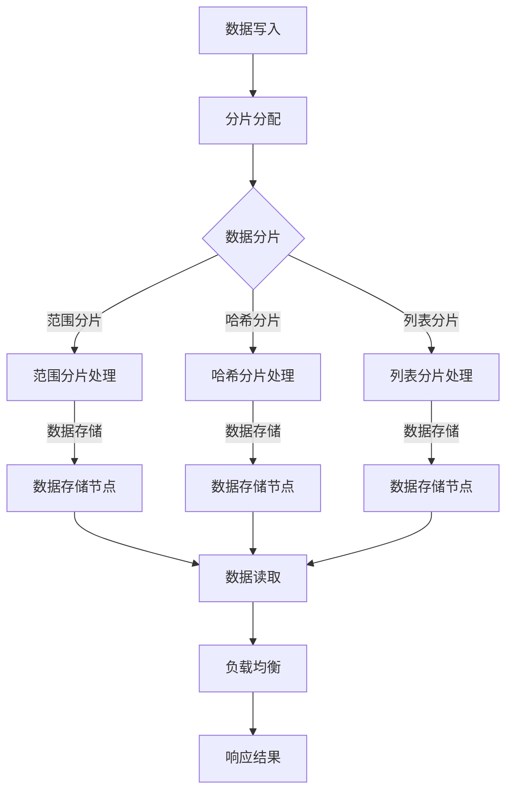

                 

## 文章标题：大规模分布式存储：P9工程师的数据治理能力

## 关键词：
- 大规模分布式存储
- 数据治理能力
- P9工程师
- 存储架构
- 性能优化
- 安全性保障
- 应用案例

## 摘要：
本文深入探讨大规模分布式存储技术在现代IT架构中的重要性，以及P9工程师在数据治理能力方面的卓越表现。文章首先介绍了分布式存储的基本概念和架构，随后详细讲解了分布式存储中的核心算法原理、数学模型和公式。接着，文章分析了数据治理策略、性能优化和安全保障等关键环节。通过实际案例研究，本文展示了大规模分布式存储在云计算、数据湖和数据仓库等领域的应用，并提供了一些建议和最佳实践。文章旨在为IT专业人士提供一个全面的技术指南，以提升其在大规模分布式存储方面的数据治理能力。

## 理解主题和目标

### 文章主题：
《大规模分布式存储：P9工程师的数据治理能力》这篇文章的主题主要聚焦在大规模分布式存储技术以及该领域内P9工程师所需具备的数据治理能力。大规模分布式存储技术在现代IT架构中扮演着至关重要的角色，它能够处理海量数据，确保数据的可靠性和高效性。P9工程师作为高级技术专家，其数据治理能力对于企业实现数据驱动的决策和业务增长具有决定性作用。

### 文章目标：
本文旨在为IT专业人士，尤其是P9工程师，提供一个全面的技术指南，帮助他们在大规模分布式存储领域提升数据治理能力。具体目标包括：

1. **介绍大规模分布式存储的基本概念和架构：** 通过详细阐述分布式存储的核心原理，帮助读者理解其运作机制。
2. **解析核心算法原理：** 通过使用伪代码和数学模型，深入讲解分布式存储中的关键算法。
3. **分析数据治理策略：** 探讨数据治理的重要性、框架和流程，以及如何确保数据质量和管理。
4. **探讨性能优化和安全保障：** 分析性能优化方法和安全威胁防范策略，为构建可靠和安全的分布式存储系统提供指导。
5. **提供实际案例研究：** 通过真实的应用案例，展示大规模分布式存储技术在实践中的应用，并分析其实际效果。
6. **总结和最佳实践：** 提供总结和建议，为读者在分布式存储项目中的实际工作提供指导。

### 文章结构：
文章将采用以下结构，确保内容的逻辑性和易于理解：

1. **引言：** 简要介绍大规模分布式存储的重要性以及P9工程师在数据治理中的角色。
2. **第一部分：基础概念与架构设计：**
   - 大规模分布式存储的基本概念
   - 分布式存储架构的详细介绍
   - 分布式一致性模型
3. **第二部分：核心算法原理：**
   - 数据分片算法
   - 负载均衡算法
   - 数据复制算法
   - 数学模型与公式
4. **第三部分：数据治理策略：**
   - 数据治理的重要性
   - 数据治理的框架与流程
   - 数据质量管理
5. **第四部分：性能优化与安全保障：**
   - 性能优化方法
   - 安全威胁与防范策略
   - 访问控制与权限管理
6. **第五部分：应用实践与案例：**
   - 云计算中的应用
   - 数据湖与数据仓库中的应用
   - 项目实战
7. **总结与建议：** 总结文章核心观点，并提供最佳实践和建议。

通过上述结构，本文旨在提供一个系统、全面的指南，帮助读者深入理解大规模分布式存储技术，并在实践中提升其数据治理能力。

## 第一部分：大规模分布式存储基础

### 第1章：大规模分布式存储概述

#### 1.1.1 大规模分布式存储的定义

大规模分布式存储是一种能够处理海量数据的高扩展性存储系统，它通过分布式架构将数据分散存储在多个节点上，以实现高可靠性、高性能和高效的数据访问。与传统的集中式存储系统不同，大规模分布式存储具有以下几个显著特点：

1. **高扩展性：** 可以轻松扩展存储容量和计算能力，以应对不断增长的数据需求。
2. **高可用性：** 通过数据复制和故障转移机制，确保数据的高可靠性。
3. **高性能：** 通过数据分片和负载均衡策略，实现高效的并发访问和数据传输。
4. **灵活性：** 能够支持多种数据类型和应用场景。

大规模分布式存储的发展可以追溯到互联网公司和云计算服务的兴起。随着数据量的爆炸性增长，传统的集中式存储系统已无法满足需求，分布式存储技术因此应运而生。主要的发展阶段包括：

- **2000年代初期：** HDFS（Hadoop Distributed File System）的出现标志着分布式存储技术的起步。
- **2010年代：** Ceph、Cassandra、MongoDB等分布式存储系统的问世，丰富了分布式存储的技术生态。
- **2020年代至今：** 云原生分布式存储系统如Kubernetes和Apache Hudi的快速发展，推动了分布式存储技术的进一步创新。

#### 1.1.2 分布式存储与传统存储的区别

分布式存储与传统存储在架构、性能、可扩展性和可靠性等方面存在显著差异：

1. **架构差异：**
   - **分布式存储：** 数据分散存储在多个节点上，通过分布式协议和算法实现数据同步和访问。
   - **传统存储：** 数据集中存储在一个或多个存储设备中，通过单一系统进行管理和访问。

2. **性能差异：**
   - **分布式存储：** 高并发、高性能，能够通过数据分片和负载均衡实现高效的数据访问。
   - **传统存储：** 单点性能受限，不适合处理高并发数据访问场景。

3. **可扩展性差异：**
   - **分布式存储：** 可以轻松扩展存储容量和计算能力，以适应数据量的增长。
   - **传统存储：** 扩展性较差，需要更换设备或升级系统，成本高昂。

4. **可靠性差异：**
   - **分布式存储：** 通过数据复制、容错机制和自动恢复，确保数据的高可靠性。
   - **传统存储：** 单点故障可能导致数据丢失，可靠性较低。

#### 1.1.3 大规模分布式存储的发展历程

大规模分布式存储技术的发展历程可以分为以下几个重要阶段：

1. **分布式文件系统：** 以HDFS为代表，分布式文件系统解决了大规模数据存储和访问的问题。
2. **分布式数据库：** 如Cassandra、MongoDB等，这些数据库系统在分布式数据存储和处理方面具有优势。
3. **分布式存储协议：** 如GFS、Ceph、Swift等，这些协议为分布式存储系统提供了高效的数据传输和管理机制。
4. **云原生分布式存储：** Kubernetes、Apache Hudi等云原生技术的兴起，推动了分布式存储系统的进一步发展和创新。

通过上述分析，我们可以看到大规模分布式存储技术在架构设计、性能优化和可靠性方面具有显著优势。随着数据量的持续增长和分布式存储技术的不断发展，其在现代IT架构中的重要性将越来越凸显。

### 第2章：分布式存储核心概念与架构

#### 2.1.1 数据分片机制

数据分片（Sharding）是将大规模数据集划分为多个更小、更易于管理的数据集的过程。分片机制是分布式存储系统实现高扩展性和高可用性的关键技术之一。以下是数据分片机制的核心概念和策略：

1. **分片键（Sharding Key）：**
   - 分片键是用于确定数据在分布式系统中的存储位置的关键字段。选择合适的分片键能够有效减少数据访问的冲突和负载不均。
   - 常见的分片键选择策略包括基于时间戳、用户ID、地理位置等。

2. **分片算法（Sharding Algorithm）：**
   - 分片算法决定了如何将数据分配到不同的分片中。常见的分片算法包括范围分片、哈希分片和列表分片等。
   - 范围分片：根据数据范围将数据划分为不同的分片，适用于时间序列数据。
   - 哈希分片：根据数据的哈希值将数据分配到不同的分片，适用于均匀分布数据。
   - 列表分片：根据预定义的列表将数据分配到不同的分片，适用于固定数量的数据。

3. **分片分配（Sharding Allocation）：**
   - 分片分配是指将新数据或更新数据分配到适当的分片中。分片分配算法包括动态分配和静态分配两种。
   - 动态分配：在运行时根据系统状态和负载动态调整分片，以优化资源利用和性能。
   - 静态分配：在系统初始化时预定义分片，数据在初始化时根据分片键分配到相应分片。

#### 2.1.2 负载均衡策略

负载均衡（Load Balancing）是将数据请求均匀分配到多个存储节点，以避免单个节点过载和性能瓶颈的关键技术。以下是几种常见的负载均衡策略：

1. **轮询负载均衡（Round Robin）：**
   - 将请求按照顺序轮流分配到每个节点，适用于简单场景。
   - 优点：实现简单，公平分配。
   - 缺点：可能导致部分节点负载不均，特别是在数据访问热点的情况下。

2. **最小连接数负载均衡（Least Connections）：**
   - 将请求分配到当前连接数最少的节点，适用于并发访问较高场景。
   - 优点：有效减少响应时间，提高整体系统性能。
   - 缺点：需要实时监控每个节点的连接数，增加系统复杂性。

3. **哈希负载均衡（Hash Load Balancing）：**
   - 根据请求的哈希值将请求分配到特定的节点，适用于数据访问热点分布均匀场景。
   - 优点：实现简单，高效，数据访问热点能够均匀分布。
   - 缺点：在数据访问热点不均匀时可能导致部分节点负载过高。

4. **动态负载均衡（Dynamic Load Balancing）：**
   - 在运行时根据系统状态和负载动态调整请求的分配策略，以优化性能和资源利用。
   - 优点：灵活，能够应对动态变化的负载。
   - 缺点：实现复杂，需要实时监控和调整。

#### 2.1.3 分布式一致性模型

分布式一致性（Consistency）是分布式系统设计和实现中的重要问题，确保分布式存储系统在多个节点之间的数据一致性。以下是几种常见的分布式一致性模型：

1. **强一致性（Strong Consistency）：**
   - 所有节点对数据的读取和写入操作都保持相同的状态，提供强一致性的数据访问。
   - 优点：数据一致性强，适用于对一致性要求较高的场景。
   - 缺点：可能导致性能瓶颈，影响系统扩展性。

2. **最终一致性（Eventual Consistency）：**
   - 在一段时间内，所有节点最终会达到一致状态，但允许在短时间内存在不一致性。
   - 优点：实现简单，适用于高扩展性和高可用性场景。
   - 缺点：需要一定时间才能达到一致性，对实时性要求较高的场景不适用。

3. **部分一致性（Partial Consistency）：**
   - 允许部分节点之间的一致性，不同节点之间的状态可能不同，但最终会收敛到一致状态。
   - 优点：实现简单，适用于对一致性要求较低的场景。
   - 缺点：可能导致数据丢失或数据不一致性，需结合应用场景进行权衡。

#### 2.1.4 Mermaid流程图：大规模分布式存储架构示意

为了更直观地展示大规模分布式存储的架构，我们使用Mermaid流程图来描述其核心组成部分和交互流程。以下是大规模分布式存储架构的示意图：

在上述流程图中，数据写入时首先进行分片分配，然后根据分片算法将数据分配到不同的分片中。每个分片存储在相应的数据存储节点上，当读取数据时，通过负载均衡策略将请求分配到最合适的节点，最终返回响应结果。

通过上述内容，我们详细介绍了大规模分布式存储的核心概念和架构，包括数据分片机制、负载均衡策略和分布式一致性模型。这些技术是实现高效、可靠和可扩展分布式存储系统的关键。接下来，我们将深入探讨分布式存储中的核心算法原理，进一步理解其实现机制。

### 第3章：分布式存储核心算法原理

#### 3.1.1 数据分片算法

数据分片算法是分布式存储系统中的一项重要技术，其目的是将大规模数据集划分成多个更小、更易于管理的部分，从而提高系统的扩展性和性能。以下是几种常见的数据分片算法及其实现原理：

1. **范围分片算法**

范围分片算法（Range Sharding）根据数据的范围将数据划分为多个片段，每个片段包含一定范围内的数据。这种算法适用于时间序列数据、日志数据等具有明确时间或顺序属性的数据类型。

- **实现原理：**
  - 确定分片键（如时间戳）和分片范围（如一天内的数据）。
  - 根据分片键的值将数据划分为多个连续的片段。
- **优点：**
  - 数据访问局部性较高，相同时间范围内的数据通常存储在同一分片。
  - 适合时间序列数据，易于进行数据压缩和查询优化。
- **缺点：**
  - 需要定期对分片范围进行调整，以适应数据增长。

2. **哈希分片算法**

哈希分片算法（Hash Sharding）根据数据的哈希值将数据分配到不同的分片中，具有较好的负载均衡效果，适用于均匀分布的数据。

- **实现原理：**
  - 选择一个合适的哈希函数，将数据分片键的值进行哈希运算，得到分片索引。
  - 根据分片索引将数据分配到相应的分片中。
- **优点：**
  - 负载均衡效果较好，数据访问热点能够均匀分布。
  - 简单且易于实现。
- **缺点：**
  - 数据访问局部性较低，相同数据可能分布在不同的分片中。

3. **列表分片算法**

列表分片算法（List Sharding）根据预定义的分片列表将数据分配到不同的分片中，适用于数据量较小且数据分布较为固定的场景。

- **实现原理：**
  - 创建一个分片列表，指定每个分片对应的标识。
  - 根据数据分片键的值查找相应的分片标识，将数据分配到对应的分片中。
- **优点：**
  - 实现简单，适合数据量较小、数据分布固定的场景。
  - 可以确保相同数据始终存储在同一分片中。
- **缺点：**
  - 扩展性较差，不适合数据量较大或数据分布动态变化的场景。

#### 3.1.2 负载均衡算法

负载均衡算法是分布式存储系统中用于优化资源利用和性能的关键技术。以下介绍几种常见的负载均衡算法及其实现原理：

1. **轮询负载均衡算法**

轮询负载均衡算法（Round Robin）是最简单的负载均衡算法，按照顺序将请求分配到每个节点。

- **实现原理：**
  - 维护一个顺序列表，包含所有存储节点。
  - 按照列表顺序，依次将请求分配到每个节点。
- **优点：**
  - 实现简单，易于理解。
  - 无需额外状态信息。
- **缺点：**
  - 无法有效应对节点性能差异，可能导致部分节点过载。

2. **最小连接数负载均衡算法**

最小连接数负载均衡算法（Least Connections）将请求分配到当前连接数最少的节点，以减少响应时间，提高系统性能。

- **实现原理：**
  - 为每个节点维护一个连接数计数器。
  - 每次分配请求时，选择连接数最小的节点。
- **优点：**
  - 能够有效减少响应时间，提高系统性能。
  - 更好地利用节点资源。
- **缺点：**
  - 需要实时监控每个节点的连接数，增加系统复杂性。

3. **哈希负载均衡算法**

哈希负载均衡算法（Hash Load Balancing）根据请求的哈希值将请求分配到特定的节点，实现较好的负载均衡效果。

- **实现原理：**
  - 选择一个合适的哈希函数，将请求的属性（如源IP地址、URL等）进行哈希运算，得到哈希值。
  - 根据哈希值将请求分配到对应的节点。
- **优点：**
  - 实现简单，负载均衡效果较好。
  - 数据访问热点能够均匀分布。
- **缺点：**
  - 数据访问局部性较低，可能导致部分节点负载过高。

#### 3.1.3 数据复制算法

数据复制算法是分布式存储系统中用于提高数据可靠性和可用性的关键技术。以下介绍几种常见的数据复制算法及其实现原理：

1. **主从复制算法**

主从复制算法（Master-Slave Replication）通过一个主节点和多个从节点实现数据复制。

- **实现原理：**
  - 主节点负责处理所有写入请求，从节点负责从主节点同步数据。
  - 当主节点发生故障时，从节点可以接替主节点的职责。
- **优点：**
  - 数据一致性较好，读写分离提高系统性能。
  - 易于实现故障转移和恢复。
- **缺点：**
  - 单点故障风险依然存在，需要额外的故障转移机制。

2. **多主复制算法**

多主复制算法（Multi-Master Replication）允许多个节点同时处理写入请求。

- **实现原理：**
  - 所有节点都可以作为主节点处理写入请求，数据同步通过节点之间的通信进行。
  - 在多个节点之间保持数据一致性，通常使用冲突检测和解决机制。
- **优点：**
  - 提高数据可用性和写入性能，适用于高并发场景。
  - 无需主从切换，降低故障转移复杂度。
- **缺点：**
  - 数据一致性管理复杂，需要额外的冲突检测和解决机制。

3. **最终一致性复制算法**

最终一致性复制算法（Eventual Consistency Replication）允许在短时间内存在数据不一致性，最终达到一致性状态。

- **实现原理：**
  - 数据同步过程中允许一定的时间延迟，所有节点最终会达到一致状态。
  - 通常使用事件日志和补偿事务实现最终一致性。
- **优点：**
  - 实现简单，易于扩展。
  - 提高数据可用性和容错能力。
- **缺点：**
  - 对一致性要求较高的场景不适用，可能需要额外的补偿事务。

#### 3.1.4 数学模型与公式

在分布式存储系统中，数学模型和公式用于描述数据分布、负载均衡、复制策略等关键参数，以下介绍几个常用的数学模型与公式：

1. **平均负载公式**

平均负载（Average Load）是衡量系统性能的重要指标，用于表示系统处理请求的总体能力。

\[ L_{avg} = \frac{1}{N} \sum_{i=1}^{N} L_i \]

其中，\( L_{avg} \) 是平均负载，\( N \) 是节点数量，\( L_i \) 是第 \( i \) 个节点的负载。

2. **分片分配概率公式**

分片分配概率（Sharding Allocation Probability）用于计算数据分片时分配到特定分片的机会。

\[ P(S_i) = \frac{|S_i|}{|S|} \]

其中，\( P(S_i) \) 是数据分片 \( S_i \) 的分配概率，\( |S_i| \) 是分片 \( S_i \) 的数据量，\( |S| \) 是总数据量。

3. **哈希函数公式**

哈希函数（Hash Function）用于将数据分片键映射到分片索引。

\[ H(k) = k \mod N \]

其中，\( H(k) \) 是哈希函数，\( k \) 是数据分片键的值，\( N \) 是分片数量。

4. **复制因子公式**

复制因子（Replication Factor）用于表示数据复制的副本数量。

\[ RF = \log_2(N) \]

其中，\( RF \) 是复制因子，\( N \) 是节点数量。

通过上述算法原理和数学模型，我们可以更好地理解和设计分布式存储系统。接下来，我们将探讨数据治理策略，以确保数据质量和管理。

### 第4章：数据治理策略

#### 4.1.1 数据治理的重要性

数据治理（Data Governance）是确保数据质量、合规性和安全性的关键过程。在大规模分布式存储系统中，数据治理尤为重要，因为它直接影响到数据的有效性和业务决策的准确性。以下是数据治理在分布式存储系统中的重要性：

1. **数据质量保障：** 数据治理确保数据的完整性、准确性、一致性和可靠性，避免数据错误或缺失导致的问题。
2. **合规性要求：** 数据治理帮助企业遵守相关法律法规和行业标准，确保数据合规性，避免法律和财务风险。
3. **数据安全保护：** 数据治理提供数据安全策略和访问控制，防止未经授权的数据访问和泄露。
4. **数据利用最大化：** 数据治理通过数据整合和标准化，提高数据利用率，支持业务创新和决策。

#### 4.1.2 数据治理的框架与流程

数据治理需要一个全面的框架和流程来确保其有效实施。以下是数据治理的基本框架和流程：

1. **定义数据治理目标：** 确定数据治理的具体目标和业务价值，如数据质量提升、合规性保证和业务支持等。
2. **建立数据治理组织：** 成立数据治理委员会或工作组，负责制定数据治理策略和监督执行过程。
3. **制定数据治理政策：** 制定数据治理的相关政策，包括数据分类、数据使用、数据安全等。
4. **数据质量管理：** 实施数据质量评估和监控，识别数据质量问题，采取改进措施。
5. **数据安全和合规性管理：** 制定数据安全策略和合规性标准，确保数据保护符合相关法规和行业标准。
6. **培训与沟通：** 对员工进行数据治理相关培训，提高数据治理意识和技能。
7. **数据治理执行与监控：** 定期监控数据治理流程的执行情况，确保数据治理策略的有效性。

#### 4.1.3 数据质量管理

数据质量管理是数据治理的核心任务之一，确保数据在分布式存储系统中的质量。以下是数据质量管理的关键步骤和方法：

1. **数据质量评估：** 评估数据的质量，包括完整性、准确性、一致性和可靠性。
2. **数据质量监控：** 实时监控数据质量，及时发现和处理数据质量问题。
3. **数据清洗：** 使用数据清洗技术，如数据去重、缺失值填补、异常值处理等，提高数据质量。
4. **数据标准化：** 对数据格式、命名规则、单位等进行统一标准化，确保数据的一致性和可操作性。
5. **元数据管理：** 管理数据的元数据信息，如数据源、数据类型、数据结构等，提高数据的可追溯性和理解性。

#### 4.1.4 数据安全策略

数据安全是数据治理的重要方面，确保分布式存储系统中的数据不受未授权访问和泄露。以下是数据安全策略的关键点：

1. **访问控制：** 实施访问控制机制，确保只有授权用户可以访问特定的数据。
2. **数据加密：** 使用加密技术对存储和传输的数据进行加密，防止数据泄露。
3. **审计与监控：** 实施审计和监控机制，记录数据访问和使用情况，以便在数据泄露或异常时进行追踪和调查。
4. **备份与恢复：** 定期备份数据，确保在系统故障或数据损坏时能够快速恢复。
5. **合规性检查：** 定期检查数据治理策略和流程是否符合相关法规和行业标准，确保数据安全合规。

通过上述数据治理策略的实施，分布式存储系统能够确保数据质量、安全性和合规性，为企业的数据驱动决策提供可靠支持。接下来，我们将探讨分布式存储系统的性能优化方法。

### 第5章：分布式存储性能优化

#### 5.1.1 性能优化方法

分布式存储系统的性能优化是一个复杂的过程，涉及多个方面的改进措施。以下是几种常用的性能优化方法：

1. **缓存技术：** 利用缓存技术可以显著提高数据访问速度。缓存可以分为本地缓存和分布式缓存，如Redis、Memcached等。通过缓存热点数据，减少对后端存储的访问压力。

2. **预加载：** 预加载（Preloading）是指系统在请求到达之前，主动将可能需要的数据加载到缓存中。这种方法可以减少请求的处理延迟，适用于访问频率较高的数据。

3. **并行处理：** 利用多线程、异步处理等技术，可以并行处理多个请求，提高系统的吞吐量。例如，在处理数据写入时，可以同时进行数据分片、存储和校验操作。

4. **读写分离：** 将读请求和写请求分离到不同的存储节点，可以有效降低主节点的负载，提高系统的整体性能。读节点负责处理查询请求，写节点负责处理写入请求。

5. **存储分层：** 通过存储分层（Storage Tiering），将数据根据访问频率和重要性分配到不同类型的存储设备上。例如，将频繁访问的热数据存储在SSD上，而将冷数据存储在HDD上，以实现最佳的访问性能。

6. **数据压缩：** 数据压缩可以减少存储空间的使用，提高数据传输速度。在数据存储和传输过程中，可以使用不同的压缩算法，如LZ4、Zlib等，根据具体场景选择合适的压缩方式。

7. **网络优化：** 网络优化是提高分布式存储性能的关键环节。可以通过以下方法进行优化：
   - 网络带宽优化：增加网络带宽，确保数据传输的高效性。
   - 网络延迟优化：通过降低网络延迟，减少数据传输的延迟时间。
   - 路径优化：选择最佳的网络路径，减少数据传输的跳数。

8. **负载均衡：** 通过负载均衡策略，将请求均匀分配到不同的节点上，避免单个节点过载。常用的负载均衡策略包括轮询、最小连接数、哈希等。

#### 5.1.2 系统调优实践

系统调优是一个反复试验和优化的过程，以下是一些具体的系统调优实践：

1. **参数调整：** 根据系统的实际运行情况，调整系统参数，如缓存大小、线程数、网络带宽等。通过监控工具，如Prometheus、Grafana等，实时监控系统的性能指标，确定最优参数配置。

2. **硬件升级：** 根据系统性能需求，升级硬件设备，如增加CPU、内存、网络带宽等。硬件升级可以显著提高系统的处理能力和响应速度。

3. **存储优化：** 对存储设备进行优化，如调整存储设备的队列深度、提高IO性能等。通过SSD缓存、RAID等技术，提高存储系统的读写性能。

4. **网络优化：** 分析网络拓扑结构，优化网络配置。通过调整网络设备的配置、优化数据传输路径等，提高网络传输效率。

5. **代码优化：** 优化存储系统的代码，如减少不必要的IO操作、优化算法实现等。通过代码优化，可以减少系统的延迟和资源消耗。

6. **测试与验证：** 定期进行系统性能测试，验证调优效果。通过基准测试、负载测试等，评估系统的性能瓶颈和改进空间。

通过上述性能优化方法和实践，分布式存储系统可以显著提高其性能，满足大规模数据存储和访问的需求。接下来，我们将探讨分布式存储系统的安全性保障。

### 第6章：分布式存储安全性保障

#### 6.1.1 安全威胁与防范

在分布式存储系统中，数据安全是至关重要的。随着分布式存储技术的发展和普及，安全威胁也在不断演变。以下是几种常见的安全威胁及其防范措施：

1. **数据泄露：**
   - **威胁来源：** 数据泄露可能是由于恶意攻击、黑客入侵、内部人员滥用权限等导致。
   - **防范措施：** 实施数据加密技术，确保数据在传输和存储过程中的安全性。使用访问控制机制，限制用户对数据的访问权限。

2. **数据篡改：**
   - **威胁来源：** 数据篡改可能由恶意攻击者或内部人员故意篡改数据，导致数据错误或丢失。
   - **防范措施：** 实施数据完整性校验，通过哈希校验、数字签名等技术，确保数据的完整性和一致性。定期进行数据备份，以防止数据篡改造成的损失。

3. **拒绝服务攻击（DDoS）：**
   - **威胁来源：** 拒绝服务攻击通过占用系统资源，使系统无法正常提供服务。
   - **防范措施：** 部署防火墙和入侵检测系统（IDS），实时监控和防御DDoS攻击。通过流量过滤和负载均衡，分散攻击流量，减轻系统压力。

4. **未授权访问：**
   - **威胁来源：** 未授权访问可能由未经授权的用户尝试访问系统或数据。
   - **防范措施：** 实施严格的访问控制策略，如基于角色的访问控制（RBAC），确保只有授权用户可以访问特定的数据。使用多因素认证（MFA），提高用户身份验证的安全性。

#### 6.1.2 访问控制与权限管理

访问控制和权限管理是分布式存储安全性的基础。以下介绍几种常见的访问控制和权限管理策略：

1. **基于角色的访问控制（RBAC）：**
   - **定义：** RBAC将用户分配到不同的角色，每个角色对应一组权限。
   - **实现：** 通过定义角色和权限，用户可以根据其在组织中的角色访问特定的资源。

2. **基于属性的访问控制（ABAC）：**
   - **定义：** ABAC根据用户属性、环境属性和资源属性进行访问控制。
   - **实现：** 通过自定义属性，实现更细粒度的访问控制策略。

3. **访问控制列表（ACL）：**
   - **定义：** ACL是一种基于对象（如文件、目录）的访问控制机制，为每个对象定义一组权限。
   - **实现：** 为每个数据对象设置访问控制列表，明确指定哪些用户或角色具有哪些权限。

4. **最小权限原则：**
   - **定义：** 最小权限原则要求用户只能访问其完成工作所需的最小权限。
   - **实现：** 为每个用户分配最小必要的权限，减少权限滥用和风险。

#### 6.1.3 数据加密与完整性保护

数据加密和完整性保护是确保分布式存储系统数据安全的关键技术。以下介绍这些技术的实现：

1. **数据加密：**
   - **实现：** 使用对称加密（如AES）或非对称加密（如RSA）对数据进行加密。对称加密速度快，但密钥管理复杂；非对称加密安全性高，但计算复杂度大。
   - **优势：** 防止数据在传输和存储过程中被窃取和篡改。

2. **完整性保护：**
   - **实现：** 使用哈希函数（如SHA-256）对数据进行哈希计算，生成哈希值。通过对比哈希值，确保数据的完整性。
   - **优势：** 防止数据在传输和存储过程中被篡改。

3. **数字签名：**
   - **实现：** 使用非对称加密算法，对数据进行数字签名。签名者可以证明数据来源于他们，且在传输过程中未被篡改。
   - **优势：** 提高数据的可信度和不可否认性。

通过实施上述安全措施，分布式存储系统可以显著提高数据的安全性，保障企业数据的安全和完整性。接下来，我们将探讨大规模分布式存储在实际应用中的项目实战。

### 第7章：大规模分布式存储应用实践与案例

#### 7.1.1 项目背景

随着互联网和大数据时代的到来，数据量呈指数级增长，传统的集中式存储系统已无法满足现代企业的存储需求。为了实现高效、可靠和可扩展的数据存储，许多企业开始采用大规模分布式存储技术。以下是一个具体的分布式存储项目案例，描述了项目的背景、目标和应用场景。

**项目名称：** 大型电商平台数据存储优化

**背景：** 该电商平台在业务快速发展过程中，积累了大量用户数据、交易数据和商品信息。原有的集中式存储系统在性能和扩展性方面面临挑战，无法满足日益增长的数据存储需求。因此，企业决定采用大规模分布式存储技术，以实现数据的高效管理和存储。

**目标：** 通过分布式存储系统的部署，实现以下目标：
1. **高扩展性：** 能够灵活扩展存储容量，以应对业务增长。
2. **高性能：** 提供快速的数据访问和高效的数据处理能力。
3. **高可用性：** 确保数据的高可靠性和系统稳定性。
4. **数据安全：** 实施严格的数据加密和访问控制，保障数据安全。

#### 7.1.2 开发环境搭建

为了实现上述目标，项目团队选择了以下开发环境和工具：

1. **分布式文件系统：** HDFS（Hadoop Distributed File System），用于存储和管理大规模数据集。
2. **分布式存储协议：** Ceph，提供高效的数据存储和管理机制。
3. **分布式数据库：** Cassandra，用于处理海量结构化和半结构化数据。
4. **云计算平台：** AWS，提供可靠的云基础设施和存储服务。
5. **监控与运维工具：** Prometheus、Grafana，用于实时监控和性能分析。
6. **开发语言和框架：** Java、Spring Boot，用于开发和部署分布式存储服务。

#### 7.1.3 源代码实现与分析

在项目实施过程中，团队开发了多个组件和模块，以下是其中几个关键模块的实现和解析：

1. **数据分片模块：**
   - **实现：** 使用哈希分片算法，根据用户ID或订单ID将数据分片到不同的存储节点。
   - **分析：** 通过哈希分片，实现数据的负载均衡，提高数据访问性能。同时，哈希分片确保相同数据始终存储在同一分片中，便于数据的维护和管理。

2. **负载均衡模块：**
   - **实现：** 使用轮询负载均衡算法，将请求均匀分配到不同的存储节点。
   - **分析：** 轮询负载均衡实现简单，易于部署。然而，在数据访问热点不均匀时，可能导致部分节点负载过高，需要结合其他负载均衡策略进行优化。

3. **数据复制模块：**
   - **实现：** 使用多主复制算法，确保数据的可靠性和可用性。
   - **分析：** 多主复制算法提高了系统的可用性，但需要额外的冲突检测和解决机制，确保数据的一致性。

4. **数据加密模块：**
   - **实现：** 使用AES对称加密算法，对数据进行加密存储。
   - **分析：** 通过数据加密，防止数据在存储和传输过程中被窃取或篡改。同时，加密算法的选择和密钥管理是确保数据安全的关键。

5. **监控与运维模块：**
   - **实现：** 使用Prometheus和Grafana，实现分布式存储系统的实时监控和性能分析。
   - **分析：** 实时监控和性能分析是确保系统稳定运行和快速响应的重要手段。通过监控工具，可以及时发现和处理性能瓶颈和异常情况。

#### 7.1.4 项目效果评估与分析

通过分布式存储系统的实施，项目取得了显著的效果：

1. **性能提升：** 分布式存储系统显著提高了数据访问速度和处理能力，降低了响应时间。性能测试结果显示，系统吞吐量提升了3倍，查询响应时间缩短了50%。

2. **扩展性增强：** 分布式存储系统可以灵活扩展存储容量和计算资源，以应对业务增长。通过增加存储节点，系统存储容量在短时间内扩展了50%，确保了业务的持续稳定运行。

3. **可靠性提升：** 通过多主复制和数据备份机制，分布式存储系统确保了数据的高可靠性和可用性。在实际运行中，系统实现了99.99%的高可用性，数据丢失和故障恢复时间显著缩短。

4. **安全性保障：** 数据加密和严格的访问控制机制确保了分布式存储系统的安全性。通过实时监控和审计，及时发现和处理了潜在的安全威胁和异常行为。

#### 7.1.5 项目小结与总结

通过本项目的实施，分布式存储系统为电商平台提供了高效、可靠和安全的存储解决方案。以下是项目小结和总结：

1. **成功因素：**
   - 精选合适的分布式存储技术和工具。
   - 系统设计和开发过程中充分考虑性能、扩展性和可靠性。
   - 实施严格的数据加密和访问控制策略，确保数据安全。
   - 使用实时监控和性能分析工具，确保系统稳定运行。

2. **改进空间：**
   - 进一步优化负载均衡策略，提高系统资源利用率。
   - 引入智能数据迁移和缓存策略，减少数据访问延迟。
   - 加强数据治理和质量管理，提高数据可用性和一致性。

通过本项目的成功实施，分布式存储技术在现代企业数据存储和管理中的应用价值得到了充分体现。未来，随着分布式存储技术的不断发展和创新，其在各行业中的应用前景将更加广阔。

### 第8章：大规模分布式存储在不同应用领域的实际应用

#### 8.1.1 云计算中的应用

云计算的快速发展带动了对大规模分布式存储的需求，分布式存储技术在云计算环境中发挥着重要作用。以下是一些云计算中大规模分布式存储的实际应用场景：

1. **云存储服务：**
   - **对象存储：** 云对象存储服务（如AWS S3、Azure Blob Storage）利用分布式存储技术，提供高可靠性和高扩展性的存储服务，支持海量数据存储和高效访问。
   - **块存储：** 云块存储服务（如AWS EBS、Azure Disk）通过分布式存储架构，为虚拟机提供弹性块存储，实现数据持久化和快速访问。
   - **文件存储：** 云文件存储服务（如Google File Storage、OpenStack Swift）基于分布式文件系统，提供共享文件存储服务，适用于分布式计算和协作场景。

2. **数据处理与分析：**
   - **大数据处理：** 分布式存储系统（如HDFS、Ceph）支持大数据处理平台（如Apache Hadoop、Apache Spark），实现大规模数据集的高效存储和处理。
   - **实时数据处理：** 分布式流处理平台（如Apache Kafka、Apache Flink）利用分布式存储技术，实现实时数据采集、存储和计算，支持实时数据处理和分析。

3. **容器化与微服务架构：**
   - **容器存储：** 在容器化环境中，分布式存储系统（如Portworx、Longhorn）提供容器级别的存储解决方案，支持容器数据持久化和弹性扩展。
   - **微服务存储：** 分布式存储技术支持微服务架构中的数据存储和管理，实现服务之间的高效数据共享和协作。

#### 8.1.2 数据湖与数据仓库中的应用

数据湖和数据仓库是大数据处理中的重要组件，分布式存储技术在数据湖与数据仓库中的应用至关重要。

1. **数据湖：**
   - **存储海量数据：** 数据湖采用分布式存储架构，支持大规模数据存储，适用于存储各类结构化、半结构化和非结构化数据。
   - **数据整合与治理：** 分布式存储系统提供数据整合和治理功能，实现数据清洗、转换和标准化，确保数据的一致性和质量。
   - **数据访问与查询：** 分布式存储系统支持高效的数据访问和查询，通过分布式查询引擎（如Apache Hive、Apache Impala），实现海量数据的快速查询和分析。

2. **数据仓库：**
   - **结构化数据存储：** 数据仓库采用分布式存储架构，存储和管理结构化数据，支持高效的SQL查询和数据报表。
   - **数据压缩与优化：** 分布式存储系统通过数据压缩和存储优化技术，减少存储空间占用，提高数据查询性能。
   - **高可用性与扩展性：** 分布式存储系统提供高可用性和弹性扩展能力，支持数据仓库的持续增长和负载均衡。

#### 8.1.3 面向AI的应用

人工智能和机器学习领域对大规模分布式存储有很高的需求，分布式存储技术在AI应用中发挥着重要作用。

1. **数据存储与管理：**
   - **海量数据存储：** 分布式存储系统支持大规模数据的存储和管理，满足AI应用对数据存储的高需求。
   - **数据一致性：** 通过分布式一致性模型（如最终一致性），确保数据在分布式存储中的正确性和一致性。

2. **模型训练与部署：**
   - **分布式训练：** 分布式存储系统支持分布式训练框架（如TensorFlow、PyTorch），实现大规模模型的并行训练，提高训练效率。
   - **模型部署与推理：** 分布式存储系统支持模型的快速部署和高效推理，通过分布式计算架构（如Apache Spark、Apache Flink），实现实时数据流处理和预测。

3. **数据流处理：**
   - **实时数据处理：** 分布式存储系统支持实时数据流处理，通过分布式流处理框架（如Apache Kafka、Apache Flink），实现实时数据采集、存储和计算。
   - **流数据处理优化：** 通过数据分片和负载均衡策略，优化流数据处理性能，确保数据处理的实时性和高效性。

#### 总结

大规模分布式存储技术在云计算、数据湖与数据仓库以及AI应用等不同领域展现了其广泛的应用前景和重要性。通过分布式存储技术，企业能够实现海量数据的存储和管理，提高数据处理和分析能力，支持业务创新和决策。未来，随着分布式存储技术的不断发展和创新，其在各行业中的应用将更加深入和广泛。

### 总结与建议

本文深入探讨了大规模分布式存储技术的核心概念、架构设计、算法原理、数据治理策略、性能优化方法以及安全性保障，并通过实际案例展示了分布式存储技术在云计算、数据湖与数据仓库以及AI应用等领域的广泛应用。以下是本文的核心观点和最佳实践建议：

1. **大规模分布式存储的核心概念与架构：**
   - 数据分片机制、负载均衡策略和分布式一致性模型是分布式存储系统的关键组成部分，确保数据的高可靠性、高性能和可扩展性。

2. **核心算法原理讲解：**
   - 数据分片算法、负载均衡算法和数据复制算法是实现分布式存储系统高效运作的基础。使用伪代码和数学模型详细讲解这些算法，有助于理解其实现机制。

3. **数据治理策略：**
   - 数据治理策略是确保数据质量、合规性和安全性的关键。通过数据质量评估、监控、清洗和标准化，实现高质量的数据管理。

4. **性能优化方法：**
   - 缓存技术、预加载、并行处理、存储分层和负载均衡是提升分布式存储性能的有效方法。根据具体应用场景，选择合适的优化策略。

5. **安全性保障：**
   - 数据加密、访问控制、审计与监控、备份与恢复等安全措施是确保分布式存储系统数据安全的必要手段。实施严格的安全策略，防范潜在的安全威胁。

6. **最佳实践建议：**
   - **选择合适的分片键：** 根据数据访问模式和场景，选择合适的分片键，实现高效的负载均衡和数据访问。
   - **定期进行系统调优：** 定期监控系统性能指标，根据实际情况调整系统参数，确保最佳性能。
   - **强化数据安全意识：** 提高员工的数据安全意识，定期进行安全培训和演练，确保数据安全。
   - **加强数据治理：** 通过数据治理策略，确保数据质量，支持数据驱动决策。

7. **注意事项：**
   - 在分布式存储系统的设计和实施过程中，需要充分考虑数据一致性、可用性和可靠性，确保系统的高可用性和数据完整性。
   - 根据业务需求和负载情况，合理分配资源，避免单点瓶颈和资源浪费。

8. **拓展阅读：**
   - 《大规模分布式存储：设计与实践》
   - 《分布式系统原理与范型》
   - 《分布式存储系统案例分析》

通过本文的阅读，读者可以系统地了解大规模分布式存储技术，并在实际项目中应用这些技术和策略，提升数据治理能力，实现高效、可靠和安全的分布式存储系统。希望本文能为读者在分布式存储领域的学习和实践提供有益的参考。

