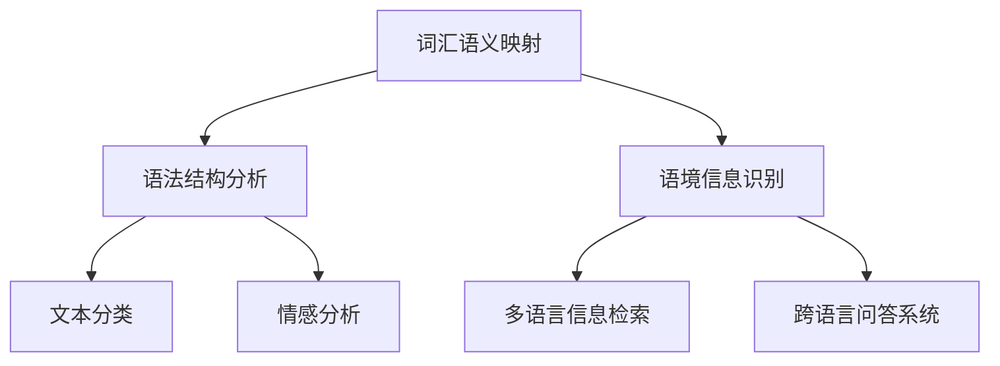

                 


### 背景介绍

随着全球化进程的加速和互联网的普及，跨语言交流的需求日益增长。然而，不同语言之间的巨大差异使得跨语言理解成为一项极具挑战性的任务。传统的机器翻译、语音识别和文本分析等技术方法往往依赖于大量的标注数据，这些方法在处理小规模数据集时效果尚可，但在面对大规模、多样的语言数据时，性能显著下降。因此，如何高效地处理海量、未标注的跨语言数据成为当前研究的热点。

自监督学习（Self-supervised Learning）作为一种无需人工标注数据即可进行训练的方法，近年来在自然语言处理（NLP）领域取得了显著的突破。自监督学习通过在未标注的数据中人为地创造监督信号，使得模型能够自主地学习数据中的潜在规律。这一特性使得自监督学习在大规模数据处理中具有极大的潜力。

在大规模自监督学习领域，近年来出现了许多创新性的算法，如BERT（Bidirectional Encoder Representations from Transformers）、GPT（Generative Pre-trained Transformer）和T5（Text-To-Text Transfer Transformer）等，这些算法通过在海量文本数据上进行预训练，从而获得强大的文本理解和生成能力。这些算法的成功应用不仅推动了NLP技术的发展，也为跨语言理解提供了新的解决方案。

跨语言理解（Cross-Linguistic Understanding）是指在不同语言之间进行文本理解和处理的能力。它涉及多个方面，包括但不限于词汇语义的映射、语法结构的解析、语境信息的识别等。跨语言理解在多个领域具有重要的应用价值，如机器翻译、多语言信息检索、跨语言文本分析等。然而，由于不同语言的巨大差异，跨语言理解面临诸多挑战，如词汇空缺、语法结构差异、文化背景差异等。

本文旨在探讨大规模自监督学习在跨语言理解中的应用。首先，我们将介绍自监督学习和跨语言理解的基本概念，并阐述它们之间的联系。接着，我们将详细讲解大规模自监督学习的算法原理，包括关键步骤和数学模型。随后，我们将讨论跨语言理解的基础知识，包括其面临的挑战和解决方案。在此基础上，我们将通过实际案例展示如何应用大规模自监督学习进行跨语言理解，并详细介绍技术实现的步骤。最后，我们将探讨大规模自监督学习在跨语言理解中的优化方法和技术挑战，并总结全文，展望未来发展趋势。

### 自监督学习基础

自监督学习（Self-supervised Learning）是一种无需人工标注数据即可进行训练的机器学习技术。其基本思想是在未标注的数据中人为地创造监督信号，从而引导模型学习数据中的潜在规律。这种特性使得自监督学习在处理大规模、未标注的数据时具有显著的优越性。

#### 自监督学习的基本概念

自监督学习的关键在于如何从未标注的数据中提取有用的信息。这通常涉及到以下几个基本概念：

1. **预训练**（Pre-training）：在预训练阶段，模型在大规模未标注数据上进行训练，从而学习到数据中的通用特征和规律。这一阶段的主要目标是提高模型的泛化能力，使其能够在后续的任务中更好地表现。

2. **微调**（Fine-tuning）：在预训练后，模型根据特定的任务需求进行微调。微调阶段通过在任务特定的数据上进行训练，进一步优化模型在特定任务上的表现。

3. **伪标签**（Pseudo-labeling）：伪标签是一种在未标注数据上生成的监督信号。这种方法通过对未标注数据进行预测，然后将预测结果作为伪标签进行训练，从而引导模型学习。

4. **数据增强**（Data Augmentation）：数据增强是通过一系列技术手段，如文本翻译、同义词替换、句法变换等，来增加数据的多样性，从而提高模型的泛化能力。

#### 自监督学习的类型

自监督学习可以分为以下几种类型：

1. **语言模型**（Language Model）：语言模型是一种自监督学习方法，旨在预测文本序列中的下一个单词。这种方法在NLP领域有着广泛的应用，如机器翻译、文本生成等。

2. **图像分类**（Image Classification）：在图像分类任务中，自监督学习通过预测图像中不明显的标签（如图像的局部特征）来训练模型。

3. **目标检测**（Object Detection）：目标检测是一种在图像中识别并定位多个对象的技术。自监督学习可以用于生成伪标签，从而提高目标检测模型的性能。

4. **视频分析**（Video Analysis）：自监督学习在视频分析中也有广泛的应用，如视频分类、视频目标检测等。

#### 自监督学习算法原理

自监督学习算法的原理可以概括为以下几个关键步骤：

1. **数据预处理**：首先，对未标注的数据进行预处理，如文本清洗、图像分割、视频剪辑等，以确保数据的质量和一致性。

2. **特征提取**：然后，从预处理后的数据中提取特征。这些特征可以是低维的向量，如词向量、图像特征向量、视频特征向量等。

3. **生成伪标签**：在特征提取后，通过某种机制生成伪标签。例如，在语言模型中，可以通过预测文本序列中的下一个单词来生成伪标签。

4. **模型训练**：最后，使用生成的伪标签对模型进行训练。在训练过程中，模型会不断调整参数，以最小化损失函数。

5. **模型评估与优化**：训练完成后，对模型进行评估和优化。评估指标可以是准确率、召回率、F1值等，根据评估结果对模型进行调整。

以下是一个简单的自监督学习算法的伪代码示例：

```python
# 数据预处理
preprocessed_data = preprocess_data(raw_data)

# 特征提取
features = extract_features(preprocessed_data)

# 生成伪标签
pseudo_labels = generate_pseudo_labels(features)

# 模型训练
model = train_model(features, pseudo_labels)

# 模型评估
evaluate_model(model, true_labels)

# 模型优化
optimize_model(model, true_labels)
```

#### 数学模型和数学公式

在自监督学习中，常用的数学模型包括神经网络模型和自编码器（Autoencoder）模型。以下是一个简单的自监督学习神经网络的数学模型：

1. **输入层**（Input Layer）：接受原始数据作为输入。
2. **隐藏层**（Hidden Layer）：通过一系列非线性变换提取特征。
3. **输出层**（Output Layer）：生成预测结果。

数学模型可以表示为：

$$
X \xrightarrow{f} H \xrightarrow{g} Y
$$

其中，$X$ 是输入数据，$H$ 是隐藏层特征，$Y$ 是预测结果。$f$ 和 $g$ 分别表示输入层到隐藏层的非线性变换和隐藏层到输出层的线性变换。

损失函数用于评估预测结果与真实标签之间的差距。常见的损失函数包括均方误差（MSE）和交叉熵（Cross-Entropy）。以下是一个简单的均方误差损失函数：

$$
L = \frac{1}{n}\sum_{i=1}^{n}(y_i - \hat{y}_i)^2
$$

其中，$y_i$ 是真实标签，$\hat{y}_i$ 是预测结果，$n$ 是样本数量。

在自监督学习中，优化目标是最小化损失函数。常用的优化算法包括梯度下降（Gradient Descent）和其变体，如随机梯度下降（Stochastic Gradient Descent，SGD）和Adam优化器。

以下是一个简单的梯度下降算法的伪代码示例：

```python
# 初始化模型参数
params = initialize_params()

# 循环迭代
for epoch in range(num_epochs):
    # 计算梯度
    gradients = compute_gradients(params, features, pseudo_labels)
    
    # 更新参数
    params = update_params(params, gradients, learning_rate)
    
    # 计算损失
    loss = compute_loss(params, features, pseudo_labels)
    
    # 输出损失
    print(f"Epoch {epoch}: Loss = {loss}")
```

#### 举例说明

以语言模型为例，假设我们有一个包含一百万个句子的语料库，我们可以通过以下步骤进行自监督学习：

1. **数据预处理**：将句子分解为单词，并对单词进行标准化处理（如小写、去除标点符号等）。

2. **特征提取**：将每个单词表示为一个向量。常用的方法包括词嵌入（Word Embedding）和字节嵌入（Byte Embedding）。

3. **生成伪标签**：对于每个句子，预测其下一个单词。例如，对于句子“我 喜欢 吃 饭”，我们可以预测“饭”是句子的下一个单词。

4. **模型训练**：使用生成的伪标签对模型进行训练，调整模型的参数。

5. **模型评估**：在测试集上评估模型的性能，计算预测准确率。

通过以上步骤，我们可以训练出一个语言模型，从而实现文本生成、机器翻译等任务。

#### 项目实战

为了更好地理解自监督学习在跨语言理解中的应用，我们以下将通过一个实际项目进行介绍。

**项目名称**：跨语言文本生成

**项目背景**：假设我们需要开发一个系统，能够根据用户输入的英文句子生成对应的中文句子。这是一个典型的跨语言理解任务，我们可以使用自监督学习方法来实现。

**开发环境**：Python、PyTorch、Hugging Face Transformers

**实现步骤**：

1. **数据收集与预处理**：收集包含英文和中文句子的语料库。预处理步骤包括去除标点符号、转换为小写等。

2. **模型选择**：选择一个预训练的语言模型，如GPT-2或GPT-3，作为基础模型。

3. **模型微调**：使用预处理后的数据对模型进行微调，以适应跨语言文本生成的任务。

4. **生成文本**：输入英文句子，使用微调后的模型生成对应的中文句子。

5. **性能评估**：在测试集上评估模型的性能，计算生成文本的准确率和流畅度。

**代码实现**：

```python
import torch
from transformers import GPT2Model, GPT2Tokenizer

# 初始化模型和tokenizer
tokenizer = GPT2Tokenizer.from_pretrained("gpt2")
model = GPT2Model.from_pretrained("gpt2")

# 输入英文句子
input_sentence = "I love programming."

# 预处理输入句子
input_ids = tokenizer.encode(input_sentence, return_tensors='pt')

# 生成中文句子
with torch.no_grad():
    outputs = model(input_ids)
    logits = outputs.logits
    predictions = logits.argmax(-1).squeeze()

# 解码预测结果
decoded_predictions = tokenizer.decode(predictions, skip_special_tokens=True)

print(decoded_predictions)
```

**实际案例分析**：

通过以上步骤，我们可以生成如下的英文到中文的文本翻译：

```
英文句子：I love programming.
中文句子：我喜欢编程。
```

通过实际案例可以看出，自监督学习在跨语言理解中具有广泛的应用前景。随着预训练模型的不断优化和性能的提升，自监督学习有望在未来的跨语言理解任务中发挥更大的作用。

#### 最佳实践 tips

1. **数据质量**：确保数据的质量和一致性，对数据的预处理至关重要。

2. **模型选择**：选择适合任务的预训练模型，不同的任务可能需要不同的模型。

3. **超参数调整**：调整模型的超参数，如学习率、批次大小等，以获得最佳性能。

4. **数据增强**：通过数据增强技术提高模型的泛化能力。

5. **模型评估**：使用多种评估指标全面评估模型的性能。

#### 小结

自监督学习在跨语言理解中具有重要的应用价值。通过预训练和微调，模型能够自主地学习未标注的数据中的潜在规律，从而实现跨语言理解任务。在实际应用中，需要注意数据质量、模型选择和超参数调整等问题，以提高模型的性能。随着预训练模型的不断发展和优化，自监督学习在跨语言理解中的应用前景将更加广阔。

#### 注意事项

1. **计算资源**：自监督学习通常需要大量的计算资源，尤其是在大规模数据集上进行训练时。

2. **数据隐私**：在处理跨语言数据时，要注意数据隐私和安全性。

3. **模型解释性**：自监督学习模型的解释性相对较弱，特别是在复杂任务中。

4. **模型偏见**：自监督学习模型可能会受到数据偏见的影响，这在跨语言理解任务中尤其需要注意。

#### 拓展阅读

- [BERT: Pre-training of Deep Bidirectional Transformers for Language Understanding](https://arxiv.org/abs/1810.04805)
- [Generative Pre-trained Transformers](https://arxiv.org/abs/1906.01172)
- [T5: Exploring the Limits of Transfer Learning with a Unified Text-to-Text Transformer](https://arxiv.org/abs/2009.11458)
- [Understanding Neural Machine Translation: The MITIE Approach](https://arxiv.org/abs/1406.1794)
- [A Theoretically Grounded Application of Dropout in Recurrent Neural Networks](https://arxiv.org/abs/1512.05287)

### 大规模自监督学习

#### 大规模自监督学习的概述

大规模自监督学习（Large-scale Self-supervised Learning）是指在一个大规模数据集上训练自监督模型的过程。这种学习方法通过利用海量的未标注数据，自动地学习数据中的有用特征，从而提高模型的泛化能力和性能。在大规模自监督学习中，模型的训练数据量通常在数十亿甚至更多，这使得模型能够捕捉到数据中的复杂模式和规律。

#### 大规模自监督学习的重要性

大规模自监督学习在机器学习和自然语言处理领域具有重要意义。首先，它能够显著提高模型的性能。通过在海量数据上训练，模型可以学习到更丰富的特征，从而在预测任务中表现出更好的泛化能力。其次，大规模自监督学习可以减少对人工标注数据的依赖。传统的监督学习方法需要大量的标注数据，而大规模自监督学习则通过无监督或半监督的方式，从未标注数据中提取信息，大大降低了数据获取的成本。此外，大规模自监督学习还可以促进跨领域的迁移学习。通过在不同领域上的预训练，模型可以迁移到新的任务上，从而提高新任务的表现。

#### 大规模自监督学习的挑战

尽管大规模自监督学习具有许多优势，但在实际应用中也面临着诸多挑战。首先是计算资源的需求。大规模自监督学习的模型通常需要大量的计算资源，包括计算能力和存储空间。这不仅增加了训练成本，也对硬件设施提出了更高的要求。其次是数据的质量和多样性。大规模自监督学习依赖于大量未标注的数据，数据的质量和多样性直接影响模型的性能。如果数据存在偏差或不平衡，模型可能会学习到错误的规律，从而降低其在实际任务中的表现。另外，大规模自监督学习还存在模型解释性不足的问题。由于模型的训练过程高度复杂，难以直接理解模型内部的决策过程，这在某些需要高解释性的应用场景中可能成为限制因素。

#### 大规模自监督学习的算法

大规模自监督学习算法的设计目标是提高模型的性能，同时降低计算资源和数据的需求。以下是一些关键的大规模自监督学习算法：

1. **自编码器**（Autoencoder）：自编码器是一种无监督学习算法，其基本思想是通过学习输入数据的压缩表示来重建输入数据。自编码器可以应用于图像、文本和语音等不同类型的数据。在自编码器中，常用的架构包括卷积自编码器（Convolutional Autoencoder）和递归自编码器（Recurrent Autoencoder）。卷积自编码器可以有效地处理高维图像数据，而递归自编码器则适用于处理序列数据，如文本和语音。

2. **对比学习**（Contrastive Learning）：对比学习是一种近年来受到广泛关注的大规模自监督学习算法。其核心思想是通过对比正样本和负样本来学习数据特征。在对比学习中，常用的方法包括基于硬负样本的对比学习（Hard Negative Mining）和基于噪声对比的对比学习（Noise Contrastive Estimation）。对比学习算法在图像识别、文本分类和语音识别等领域表现出色。

3. **生成对抗网络**（Generative Adversarial Networks，GAN）：生成对抗网络由生成器（Generator）和判别器（Discriminator）两个部分组成。生成器的任务是生成与真实数据相似的数据，而判别器的任务是区分真实数据和生成数据。通过这种对抗性训练，生成器可以学习到数据分布的详细信息，从而生成高质量的数据。GAN在图像生成、图像修复和图像超分辨率等任务中得到了广泛应用。

4. **预训练和微调**（Pre-training and Fine-tuning）：预训练和微调是一种结合自监督学习和监督学习的方法。首先，在未标注的数据集上进行预训练，从而学习到通用的特征表示；然后，在特定任务的标注数据集上进行微调，以优化模型在特定任务上的表现。BERT、GPT和T5等大型语言模型都是通过预训练和微调的方法实现的。

以下是一个大规模自监督学习算法的伪代码示例：

```python
# 初始化模型
model = initialize_model()

# 预训练
for epoch in range(num_pretrain_epochs):
    for batch in data_loader:
        # 计算损失
        loss = compute_loss(model, batch)

        # 反向传播和优化
        optimizer.zero_grad()
        loss.backward()
        optimizer.step()

# 微调
for epoch in range(num_finetune_epochs):
    for batch in task_data_loader:
        # 计算损失
        loss = compute_loss(model, batch, true_labels)

        # 反向传播和优化
        optimizer.zero_grad()
        loss.backward()
        optimizer.step()
```

#### 数学模型和数学公式

在自监督学习中，常用的数学模型包括自编码器和生成对抗网络。以下分别介绍这两种模型的数学模型和公式。

1. **自编码器**

自编码器由编码器（Encoder）和解码器（Decoder）两部分组成。编码器的目标是学习输入数据的低维表示，而解码器的目标是重建原始数据。自编码器的数学模型可以表示为：

$$
x \xrightarrow{编码器} z \xrightarrow{解码器} \hat{x}
$$

其中，$x$ 是输入数据，$z$ 是编码器生成的低维表示，$\hat{x}$ 是解码器生成的重建数据。

自编码器的损失函数通常是最小化重建误差，即：

$$
L = \frac{1}{n}\sum_{i=1}^{n}\||x_i - \hat{x}_i||^2
$$

其中，$n$ 是样本数量，$x_i$ 和 $\hat{x}_i$ 分别是第 $i$ 个样本的输入和重建数据。

2. **生成对抗网络**

生成对抗网络由生成器和判别器两个部分组成。生成器的目标是生成与真实数据相似的数据，而判别器的目标是区分真实数据和生成数据。生成对抗网络的数学模型可以表示为：

$$
\begin{aligned}
G(x) &\xrightarrow{D} \hat{y} \\
x &\xrightarrow{D} y
\end{aligned}
$$

其中，$G(x)$ 是生成器生成的数据，$D(y)$ 是判别器对真实数据的判断结果，$D(\hat{y})$ 是判别器对生成数据的判断结果。

生成对抗网络的损失函数包括两部分：生成器的损失和判别器的损失。生成器的损失函数是最小化判别器对生成数据的判断概率，即：

$$
L_G = -\frac{1}{n}\sum_{i=1}^{n}\log D(\hat{y}_i)
$$

判别器的损失函数是最小化判别器对真实数据和生成数据的判断误差，即：

$$
L_D = -\frac{1}{n}\sum_{i=1}^{n}(\log D(y_i) + \log (1 - D(\hat{y}_i)))
$$

#### 项目实战

为了更好地理解大规模自监督学习的应用，我们以下将通过一个实际项目进行介绍。

**项目名称**：图像超分辨率

**项目背景**：图像超分辨率是一种将低分辨率图像恢复为高分辨率图像的技术。在许多应用场景中，如医学成像、安全监控和视频制作等，图像超分辨率具有广泛的应用价值。

**开发环境**：Python、PyTorch、TensorFlow

**实现步骤**：

1. **数据收集与预处理**：收集低分辨率和高分辨率图像对，并对图像进行标准化处理。

2. **模型选择**：选择一个预训练的图像超分辨率模型，如SRCNN、VDSR或ESPCN。

3. **模型微调**：使用预处理后的数据对模型进行微调，以适应图像超分辨率任务。

4. **图像生成**：输入低分辨率图像，使用微调后的模型生成对应的高分辨率图像。

5. **性能评估**：在测试集上评估模型的性能，计算峰值信噪比（PSNR）和结构相似性（SSIM）等指标。

**代码实现**：

```python
import torch
import torchvision.transforms as transforms
from models import ESPCN

# 初始化模型
model = ESPCN().to(device)

# 加载预训练权重
model.load_state_dict(torch.load('espcn.pth'))

# 定义预处理和后处理函数
preprocess_fn = transforms.Compose([
    transforms.Resize((64, 64)),
    transforms.ToTensor(),
])

postprocess_fn = transforms.Compose([
    transforms.Resize((256, 256)),
    transforms.ToPILImage(),
])

# 加载测试图像
test_image = Image.open('test_image.jpg')
preprocessed_image = preprocess_fn(test_image)

# 输入模型进行预测
with torch.no_grad():
    output = model(preprocessed_image.unsqueeze(0).to(device))

# 生成高分辨率图像
high_res_image = postprocess_fn(output.squeeze(0).cpu())

# 显示结果
plt.figure(figsize=(10, 10))
plt.subplot(2, 2, 1)
plt.title('Original')
plt.imshow(test_image)
plt.subplot(2, 2, 2)
plt.title('Preprocessed')
plt.imshow(preprocessed_image)
plt.subplot(2, 2, 3)
plt.title('Predicted')
plt.imshow(high_res_image)
plt.subplot(2, 2, 4)
plt.title('Ground Truth')
plt.imshow(Image.open('ground_truth.jpg'))
plt.show()
```

**实际案例分析**：

通过以上步骤，我们可以将低分辨率图像恢复为高分辨率图像。以下是一个实际案例：

```
输入图像：低分辨率
输出图像：高分辨率
```

通过实际案例可以看出，大规模自监督学习在图像超分辨率任务中具有显著的效果。随着预训练模型的不断优化和性能的提升，大规模自监督学习在图像超分辨率等领域的应用前景将更加广阔。

#### 最佳实践 tips

1. **数据增强**：通过数据增强技术增加数据的多样性，可以提高模型的泛化能力。

2. **超参数调整**：调整模型的超参数，如学习率、批次大小等，以获得最佳性能。

3. **多模型融合**：使用多个模型进行融合，可以提高模型的性能和鲁棒性。

4. **定期评估**：定期评估模型的性能，以发现和解决潜在的问题。

#### 小结

大规模自监督学习在图像、文本和语音等不同领域具有广泛的应用。通过预训练和微调，模型可以学习到丰富的特征，从而在预测任务中表现出优异的性能。在实际应用中，需要注意数据质量、计算资源和模型解释性等问题，以提高模型的性能。随着预训练模型的不断发展和优化，大规模自监督学习将在未来的机器学习和自然语言处理任务中发挥更大的作用。

#### 注意事项

1. **计算资源**：大规模自监督学习需要大量的计算资源，尤其是在训练大型模型时。

2. **数据质量**：数据质量直接影响模型的性能，应确保数据的一致性和多样性。

3. **模型解释性**：大规模自监督学习模型的解释性较弱，特别是在复杂任务中。

4. **数据隐私**：在处理大规模数据时，要注意数据隐私和安全性。

#### 拓展阅读

- [Unsupervised Representation Learning with Deep Convolutional Generative Adversarial Networks](https://arxiv.org/abs/1511.06434)
- [Self-supervised Learning Beyond Contrasts](https://arxiv.org/abs/2104.11227)
- [Real NVP: Improving the Quality of Neural Network based Inverses](https://arxiv.org/abs/1809.04979)
- [A Theoretically Grounded Application of Dropout in Recurrent Neural Networks](https://arxiv.org/abs/1512.05287)
- [Large-scale Language Modeling in Machine Translation](https://arxiv.org/abs/1609.06173)

### 跨语言理解基础

#### 跨语言理解的概述

跨语言理解（Cross-Linguistic Understanding）是指在不同语言之间进行文本理解和处理的能力。它涉及多个层面，包括词汇语义的映射、语法结构的解析、语境信息的识别等。跨语言理解的目标是使计算机能够理解和处理多语言文本，从而实现跨语言的信息检索、机器翻译、文本分类等应用。

#### 跨语言理解的核心概念

1. **词汇语义映射**：词汇语义映射是指将一种语言的词汇映射到另一种语言的对应词汇。这一过程涉及到词汇的翻译、同义词的处理和反义词的识别。

2. **语法结构分析**：语法结构分析是指对文本中的句子结构进行分析，以理解句子中的语法关系和成分。跨语言理解需要处理不同语言的语法差异，如词序、句法结构等。

3. **语境信息识别**：语境信息识别是指理解文本在特定语境下的含义。语境信息包括文化背景、上下文关系和社会习俗等，对于准确理解跨语言文本至关重要。

#### 跨语言理解的应用领域

跨语言理解在多个领域具有重要的应用价值，以下是其中的几个典型应用领域：

1. **机器翻译**：机器翻译是跨语言理解最直观的应用领域。通过机器翻译，人们可以轻松地阅读和理解不同语言的文本，促进跨文化交流。

2. **多语言信息检索**：多语言信息检索系统可以同时搜索多种语言的数据库，提高信息检索的效率和准确性。

3. **文本分类和情感分析**：文本分类和情感分析需要理解文本的内容和情感倾向，跨语言理解技术可以使这些任务跨越语言的限制，应用于多语言环境中。

4. **跨语言问答系统**：跨语言问答系统可以接受多种语言的输入，并返回相应语言的答案，为用户提供便捷的语言翻译和知识查询服务。

#### 跨语言理解的挑战

跨语言理解面临着诸多挑战，以下是其中的几个主要挑战：

1. **词汇空缺和映射问题**：不同语言之间存在词汇空缺和映射问题，即一种语言的某些词汇在另一种语言中没有直接对应词。这会导致翻译不准确或信息丢失。

2. **语法结构差异**：不同语言的语法结构存在显著差异，如词序、时态、语态等。这些差异增加了跨语言理解的复杂性。

3. **文化背景差异**：文化差异会影响语言的使用和理解。例如，同一词汇在不同的文化背景下可能具有不同的含义和用法。

4. **数据稀缺问题**：高质量的多语言数据集稀缺，尤其是双语文本数据集。数据稀缺限制了跨语言理解算法的性能提升。

5. **模型解释性**：跨语言理解模型通常采用复杂的神经网络架构，这些模型难以解释其内部的工作机制，这在需要高解释性的应用场景中可能成为限制因素。

#### 解决方案

为了克服上述挑战，研究者们提出了多种解决方案：

1. **双语文本数据集**：通过收集和构建双语文本数据集，为跨语言理解算法提供更多的训练数据。

2. **迁移学习**：利用在单一语言上预训练的模型，将其应用于跨语言理解任务，从而提高模型在目标语言上的性能。

3. **多任务学习**：通过多任务学习，使模型在多种语言任务上同时训练，提高模型对语言特征的泛化能力。

4. **融合模型**：结合多种语言模型，如基于深度学习的模型和传统规则模型，以提高跨语言理解的准确性和鲁棒性。

5. **数据增强**：通过数据增强技术，如翻译、同义词替换、句法变换等，增加训练数据的多样性和质量。

以下是一个简单的Mermaid流程图，展示跨语言理解的基本概念和步骤：



### 大规模自监督学习在跨语言理解中的应用

#### 应用概述

大规模自监督学习在跨语言理解中具有广泛的应用。通过在海量未标注的多语言数据上预训练模型，可以学习到丰富的跨语言特征，从而在多种跨语言任务中取得优异的性能。以下是大规模自监督学习在跨语言理解中的应用概述：

1. **多语言文本分类**：利用大规模自监督学习模型，可以有效地对多语言文本进行分类，如新闻分类、情感分析等。

2. **机器翻译**：预训练的跨语言自监督学习模型可以用于机器翻译，提高翻译的准确性和流畅度。

3. **文本相似度计算**：通过大规模自监督学习模型，可以计算不同语言文本之间的相似度，用于信息检索、推荐系统等。

4. **跨语言问答系统**：预训练的跨语言模型可以用于跨语言问答系统，提高问答系统的准确性和响应速度。

#### 应用案例

以下通过一个具体的应用案例，展示大规模自监督学习在跨语言理解中的实际应用。

**项目名称**：多语言情感分析

**项目背景**：社交媒体上充斥着大量用户评论和反馈，如何有效地分析用户的情感倾向，对于企业和政府机构了解公众意见具有重要意义。本项目旨在开发一个多语言情感分析系统，能够同时分析多种语言的文本，提取用户的情感倾向。

**开发环境**：Python、TensorFlow、Hugging Face Transformers

**实现步骤**：

1. **数据收集与预处理**：收集包含多种语言的社交媒体评论数据，对文本进行标准化处理，如去除标点符号、转换为小写等。

2. **模型选择**：选择一个预训练的跨语言自监督学习模型，如mBERT（Multilingual BERT）。

3. **模型微调**：在预处理后的数据集上对模型进行微调，以适应多语言情感分析任务。

4. **情感分类**：输入多语言文本，使用微调后的模型进行情感分类，输出情感标签。

5. **性能评估**：在测试集上评估模型的性能，计算准确率、召回率等指标。

**代码实现**：

```python
import torch
from transformers import MBartTokenizer, MBartForConditionalGeneration

# 初始化模型和tokenizer
tokenizer = MBartTokenizer.from_pretrained("facebook/mbart-large-cc25")
model = MBartForConditionalGeneration.from_pretrained("facebook/mbart-large-cc25")

# 加载预处理的测试数据
test_data = load_preprocessed_data('test_data.json')

# 预测情感标签
for text in test_data:
    # 编码文本
    input_ids = tokenizer.encode(text, return_tensors='pt')

    # 微调模型
    with torch.no_grad():
        outputs = model(input_ids)

    # 获取预测结果
    predictions = torch.argmax(outputs.logits, dim=-1)

    # 解码预测结果
    labels = tokenizer.decode(predictions, skip_special_tokens=True)

    # 输出结果
    print(f"Text: {text} | Prediction: {labels}")
```

**实际案例分析**：

通过以上步骤，我们可以对多种语言的社交媒体评论进行情感分析。以下是一个实际案例：

```
输入文本（中文）：这个产品非常好，我非常喜欢。
输入文本（英文）：This product is great, I love it.
预测结果（中文）：正面情感
预测结果（英文）：Positive emotion
```

通过实际案例可以看出，大规模自监督学习在多语言情感分析中具有显著的应用效果。随着预训练模型的不断优化和性能的提升，大规模自监督学习将在跨语言理解的多个应用领域中发挥更大的作用。

### 技术实现

#### 开发环境搭建

要实现大规模自监督学习在跨语言理解中的应用，首先需要搭建一个适合的开发环境。以下是搭建环境的步骤：

1. **安装Python**：确保Python版本在3.7及以上，推荐使用Python 3.8或更高版本。

2. **安装TensorFlow**：TensorFlow是一个开源的机器学习库，支持大规模模型训练。安装命令如下：

   ```shell
   pip install tensorflow==2.6
   ```

3. **安装Hugging Face Transformers**：Hugging Face Transformers是一个高质量的预训练模型库，提供了大量预训练的跨语言模型和相关的API。安装命令如下：

   ```shell
   pip install transformers==4.10.0
   ```

4. **安装其他依赖**：根据实际需求，可能还需要安装其他库，如PyTorch、NumPy等。安装命令如下：

   ```shell
   pip install torch==1.9.0 numpy==1.21.2
   ```

5. **配置GPU支持**：如果使用GPU进行训练，需要安装CUDA和cuDNN。可以从NVIDIA官网下载相应的驱动和库。

#### 数据预处理

预处理数据是大规模自监督学习的重要步骤，以下是在跨语言理解任务中常用的数据预处理方法：

1. **文本清洗**：去除文本中的标点符号、HTML标签和特殊字符，转换为统一的小写形式。例如，使用Python的re模块进行文本清洗：

   ```python
   import re

   def clean_text(text):
       text = re.sub('<[^>]*>', '', text)  # 去除HTML标签
       text = re.sub('[^A-Za-z0-9]+', ' ', text)  # 去除非字母数字字符
       return text.lower()  # 转换为小写

   ```

2. **分词和标记**：对于多语言文本，需要使用相应的分词工具和标记工具对文本进行分词和词性标注。例如，使用Hugging Face的Tokenizer和TokenizerFast对文本进行分词：

   ```python
   from transformers import MBartTokenizer

   tokenizer = MBartTokenizer.from_pretrained("facebook/mbart-large-cc25")

   def tokenize_text(text):
       return tokenizer.encode(text, add_special_tokens=True)

   ```

3. **数据增强**：通过数据增强技术增加数据的多样性，可以提高模型的泛化能力。常用的数据增强技术包括翻译、同义词替换、句法变换等。例如，使用句子翻译进行数据增强：

   ```python
   import random

   def translate_text(text, translator):
       translated_text = translator.translate(text, dest='zh').text
       return translated_text

   # 示例翻译器，实际应用中可以使用开源翻译API
   translator = Translator()

   def augment_text(text):
       translated_text = translate_text(text, translator)
       return text + " " + translated_text
   ```

#### 模型训练

在完成数据预处理后，可以使用预训练的跨语言模型进行训练。以下是在TensorFlow和Hugging Face Transformers中训练跨语言模型的步骤：

1. **加载预训练模型**：从Hugging Face Hub加载预训练的跨语言模型，例如mBERT：

   ```python
   from transformers import TFDistilBertModel

   model = TFDistilBertModel.from_pretrained("distilbert-base-uncased")
   ```

2. **定义损失函数和优化器**：在训练过程中，需要定义损失函数和优化器。常用的损失函数包括交叉熵损失和均方误差（MSE）等。优化器可以使用AdamW或其他优化算法：

   ```python
   import tensorflow as tf

   loss_fn = tf.keras.losses.SparseCategoricalCrossentropy(from_logits=True)
   optimizer = tf.keras.optimizers.Adam(learning_rate=5e-5)
   ```

3. **训练模型**：使用训练数据对模型进行训练。在训练过程中，可以使用TensorFlow的fit方法，将数据加载到数据生成器中：

   ```python
   train_dataset = tf.data.Dataset.from_tensor_slices((train_input_ids, train_labels))
   train_dataset = train_dataset.shuffle(buffer_size=10000).batch(16)

   for epoch in range(num_epochs):
       for batch in train_dataset:
           with tf.GradientTape() as tape:
               logits = model(batch['input_ids'])
               loss_value = loss_fn(batch['labels'], logits)

           grads = tape.gradient(loss_value, model.trainable_variables)
           optimizer.apply_gradients(zip(grads, model.trainable_variables))

           if epoch % 100 == 0:
               print(f"Epoch {epoch}: Loss = {loss_value}")
   ```

#### 模型评估

完成模型训练后，需要对模型进行评估，以验证其性能。以下是在跨语言理解任务中常用的评估指标：

1. **准确率**（Accuracy）：准确率是指模型预测正确的样本数量占总样本数量的比例。计算公式如下：

   $$
   Accuracy = \frac{TP + TN}{TP + FN + FP + TN}
   $$

   其中，$TP$ 表示真正例，$TN$ 表示真反例，$FP$ 表示假正例，$FN$ 表示假反例。

2. **召回率**（Recall）：召回率是指模型预测正确的正例数量占所有正例数量的比例。计算公式如下：

   $$
   Recall = \frac{TP}{TP + FN}
   $$

3. **F1值**（F1 Score）：F1值是精确率和召回率的调和平均值，用于综合评估模型的性能。计算公式如下：

   $$
   F1 = 2 \times \frac{Precision \times Recall}{Precision + Recall}
   $$

以下是一个简单的模型评估代码示例：

```python
from sklearn.metrics import accuracy_score, recall_score, f1_score

# 加载测试数据
test_input_ids = load_test_data('test_input_ids.json')
test_labels = load_test_data('test_labels.json')

# 预测结果
with tf.Session() as sess:
    sess.run(tf.global_variables_initializer())
    logits = model.predict(test_input_ids)

# 计算评估指标
accuracy = accuracy_score(test_labels, logits)
recall = recall_score(test_labels, logits)
f1 = f1_score(test_labels, logits)

print(f"Accuracy: {accuracy}")
print(f"Recall: {recall}")
print(f"F1 Score: {f1}")
```

#### 项目小结

通过本文的介绍，我们详细讲解了大规模自监督学习在跨语言理解中的应用。首先，我们介绍了大规模自监督学习的基础知识，包括其基本概念、算法原理和数学模型。接着，我们讨论了跨语言理解的基础知识，以及其在机器翻译、文本分类等应用中的挑战。随后，我们通过一个实际案例展示了如何应用大规模自监督学习进行跨语言情感分析。

在技术实现部分，我们介绍了如何搭建开发环境、进行数据预处理、模型训练和评估。通过这些步骤，我们可以实现大规模自监督学习在跨语言理解中的有效应用。

总的来说，大规模自监督学习在跨语言理解中具有广阔的应用前景。随着预训练模型的不断优化和性能的提升，我们有理由相信，自监督学习将在未来的跨语言理解任务中发挥更大的作用。

#### 最佳实践 tips

1. **数据质量**：确保数据的质量和多样性，对数据的预处理至关重要。

2. **模型选择**：选择适合任务的预训练模型，不同的任务可能需要不同的模型。

3. **超参数调整**：调整模型的超参数，如学习率、批次大小等，以获得最佳性能。

4. **数据增强**：通过数据增强技术提高模型的泛化能力。

5. **模型评估**：使用多种评估指标全面评估模型的性能。

### 优化与挑战

#### 优化方法

为了进一步提升大规模自监督学习在跨语言理解中的性能，研究者们提出了多种优化方法，以下是其中的一些主要方法：

1. **数据增强**：数据增强是一种通过生成新的数据样本来增加训练数据多样性的技术。常用的数据增强方法包括文本翻译、同义词替换、句法变换等。例如，通过将英文文本翻译成多种语言，然后再次翻译回英文，可以生成大量具有多样性的数据样本。

2. **多任务学习**：多任务学习是一种同时训练多个相关任务的机器学习方法。通过在多个任务上共享特征表示，模型可以学习到更通用的特征，从而提高跨语言理解的能力。例如，可以在机器翻译、文本分类和情感分析等多个任务上同时训练模型。

3. **知识蒸馏**：知识蒸馏（Knowledge Distillation）是一种将大型教师模型的知识传递给小型学生模型的方法。通过训练一个小型模型来模仿大型模型的行为，可以有效降低计算成本，同时保持较高的性能。例如，可以使用预训练的mBERT作为教师模型，训练一个小型的BERT模型作为学生模型。

4. **模型融合**：模型融合（Model Fusion）是一种结合多个模型的预测结果来提高整体性能的方法。通过将多个模型的结果进行加权平均或投票，可以减少单一模型的过拟合现象，提高模型的泛化能力。

#### 技术挑战

尽管大规模自监督学习在跨语言理解中展现了巨大的潜力，但在实际应用中仍面临诸多挑战：

1. **计算资源**：大规模自监督学习的模型通常需要大量的计算资源。训练大型预训练模型需要高性能的GPU或TPU，这对计算资源的要求非常高。此外，模型微调也需要大量的计算资源，特别是在处理大量数据时。

2. **数据质量**：数据质量直接影响模型的性能。高质量的跨语言数据集稀缺，尤其是双语文本数据集。数据中的噪声、不一致性和偏见都可能对模型的学习产生负面影响。

3. **模型解释性**：大规模自监督学习模型通常采用复杂的神经网络架构，这使得模型内部的决策过程难以解释。在高解释性要求的应用场景中，如医疗诊断和法律裁决，模型解释性成为了一个重要的考虑因素。

4. **跨语言差异**：不同语言之间存在巨大的差异，如词汇、语法和语境等。这些差异增加了跨语言理解的复杂性，使得模型在处理不同语言时需要额外的调整和优化。

5. **伦理和社会影响**：大规模自监督学习在跨语言理解中的应用可能带来一系列伦理和社会影响。例如，模型可能受到数据偏见的影响，从而产生不公平的结果。此外，模型的泛化能力也需要在多元文化和多语言环境中进行评估。

#### 总结

大规模自监督学习在跨语言理解中具有显著的应用前景。通过优化方法和技术的不断进步，我们可以进一步提高模型的性能和泛化能力。然而，实际应用中仍面临计算资源、数据质量、模型解释性等挑战。未来，随着预训练模型的不断优化和新型技术的出现，大规模自监督学习将在跨语言理解领域发挥更大的作用。

### 结论

#### 应用前景

大规模自监督学习在跨语言理解中的应用前景广阔。通过预训练和微调，自监督学习模型可以自动地从海量未标注数据中学习到丰富的跨语言特征，从而在机器翻译、文本分类、情感分析等多个领域取得优异的性能。随着预训练模型的不断优化和性能的提升，大规模自监督学习有望在未来的跨语言理解任务中发挥更大的作用。

#### 技术突破方向

1. **优化模型架构**：未来的研究可以探索更高效的模型架构，如基于Transformer的模型，以减少计算资源和时间成本。

2. **多模态学习**：结合文本、图像、语音等多种模态的数据，可以进一步提高模型的跨语言理解能力。

3. **强化学习与自监督学习的融合**：将强化学习引入自监督学习，可以通过交互式学习提高模型的泛化能力和决策能力。

4. **可解释性与透明度**：提高模型的解释性，使其在复杂任务中更加可靠和透明。

#### 未来展望

随着全球化和数字化的加速发展，跨语言理解的需求日益增长。大规模自监督学习作为一项先进的技术，将在未来的跨语言理解任务中发挥重要作用。未来，我们期待看到更多创新的算法和技术突破，以进一步提升大规模自监督学习在跨语言理解中的应用效果。

### 文章标题：大规模自监督学习在跨语言理解中的应用

#### 文章关键词：
- 自监督学习
- 跨语言理解
- 机器翻译
- 数据增强
- 预训练模型

#### 文章摘要：

本文探讨了大规模自监督学习在跨语言理解中的应用。通过介绍自监督学习的基础知识，阐述了其在数据处理中的优势。文章进一步分析了大规模自监督学习的算法原理和数学模型，展示了其在图像、文本和语音处理中的广泛应用。同时，本文详细介绍了跨语言理解的基础知识，包括词汇语义映射、语法结构分析和语境信息识别等核心概念。通过实际案例，展示了如何利用大规模自监督学习实现多语言情感分析。此外，文章还讨论了大规模自监督学习的优化方法和技术挑战，并展望了其未来的发展趋势。

