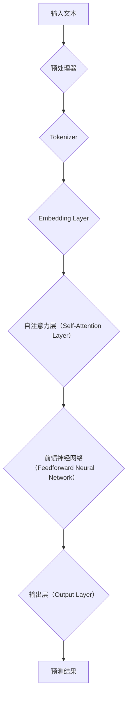

                 


### 文章标题

《大规模语言模型在个性化职业规划中的应用》

### 文章关键词

- 大规模语言模型
- 个性化职业规划
- 自然语言处理
- 深度学习
- 机器学习
- 模型算法

### 文章摘要

本文旨在探讨大规模语言模型在个性化职业规划中的应用。通过对大规模语言模型的核心概念、技术基础、数学模型及算法、应用案例和项目实战的详细分析，揭示其在个性化职业规划中的巨大潜力与实际价值。文章旨在为读者提供一个全面、系统的理解，帮助专业人士和普通读者了解和掌握这一领域的前沿技术与应用。

---

### 确定目录结构

首先，我们需要为文章确定一个清晰、逻辑严密的目录结构，以确保读者能够顺畅地跟随我们的思路。文章将分为三个主要部分：大规模语言模型概述、大规模语言模型在个性化职业规划中的应用、未来发展趋势与挑战。每个部分下将细分为若干章节，具体如下：

#### 第一部分：大规模语言模型概述

1. **第1章：大规模语言模型的核心概念与架构**
    - 1.1 大规模语言模型的定义
    - 1.2 大规模语言模型的工作原理
    - 1.3 大规模语言模型的架构与组件
    - 1.4 Mermaid流程图：大规模语言模型架构图

2. **第2章：大规模语言模型的技术基础**
    - 2.1 自然语言处理基础
    - 2.2 机器学习与深度学习基础
    - 2.3 伪代码：大规模语言模型核心算法原理

3. **第3章：大规模语言模型的数学模型与公式**
    - 3.1 数学模型介绍
    - 3.2 公式详解
    - 3.3 公式举例说明

#### 第二部分：大规模语言模型在个性化职业规划中的应用

4. **第4章：个性化职业规划的概念与需求**
    - 4.1 个性化职业规划的定义
    - 4.2 个性化职业规划的重要性
    - 4.3 大规模语言模型在个性化职业规划中的应用场景

5. **第5章：大规模语言模型在职业规划中的应用案例分析**
    - 5.1 案例一：智能职业咨询系统
    - 5.2 案例二：职业能力评估工具
    - 5.3 案例三：职业发展路径规划

6. **第6章：大规模语言模型在个性化职业规划中的项目实战**
    - 6.1 项目背景
    - 6.2 开发环境搭建
    - 6.3 代码实现与解读
    - 6.4 代码解读与分析

#### 第三部分：未来发展趋势与挑战

7. **第7章：大规模语言模型在个性化职业规划中的未来发展趋势**
    - 7.1 技术创新趋势
    - 7.2 应用领域扩展
    - 7.3 社会影响与伦理挑战

8. **第8章：大规模语言模型在个性化职业规划中的应用挑战与应对策略**
    - 8.1 技术挑战
    - 8.2 数据隐私与伦理问题
    - 8.3 人才培养与技能更新

### 核心内容确定

接下来，我们将为每个章节的核心内容进行确定。以下是每个章节的核心内容：

#### 第1章：大规模语言模型的核心概念与架构
- **1.1 大规模语言模型的定义**：介绍大规模语言模型的基本概念，解释其与自然语言处理的关系。
- **1.2 大规模语言模型的工作原理**：详细讲解大规模语言模型的工作机制，包括预训练和微调等过程。
- **1.3 大规模语言模型的架构与组件**：介绍大规模语言模型的主要架构和组成部分，如图神经网络、自注意力机制等。
- **1.4 Mermaid流程图：大规模语言模型架构图**：使用Mermaid语言绘制大规模语言模型的架构图，帮助读者更好地理解。

#### 第2章：大规模语言模型的技术基础
- **2.1 自然语言处理基础**：介绍自然语言处理的基本概念和核心技术，如词嵌入、文本分类等。
- **2.2 机器学习与深度学习基础**：讲解机器学习和深度学习的基础知识，包括神经网络、优化算法等。
- **2.3 伪代码：大规模语言模型核心算法原理**：使用伪代码详细阐述大规模语言模型的核心算法原理，如Transformer模型等。

#### 第3章：大规模语言模型的数学模型与公式
- **3.1 数学模型介绍**：介绍大规模语言模型中的数学模型，如自注意力机制、损失函数等。
- **3.2 公式详解**：使用latex格式详细讲解大规模语言模型中的关键公式，包括参数更新规则、梯度计算等。
- **3.3 公式举例说明**：通过具体例子来解释公式的应用，帮助读者更好地理解。

#### 第4章：个性化职业规划的概念与需求
- **4.1 个性化职业规划的定义**：解释个性化职业规划的概念，以及其与大规模语言模型的关系。
- **4.2 个性化职业规划的重要性**：分析个性化职业规划的重要性和价值，以及其在现代社会中的应用前景。
- **4.3 大规模语言模型在个性化职业规划中的应用场景**：介绍大规模语言模型在个性化职业规划中的具体应用，如职业咨询、能力评估等。

#### 第5章：大规模语言模型在职业规划中的应用案例分析
- **5.1 案例一：智能职业咨询系统**：分析一个智能职业咨询系统的实现过程和应用效果。
- **5.2 案例二：职业能力评估工具**：探讨职业能力评估工具的设计原理和实际应用。
- **5.3 案例三：职业发展路径规划**：阐述职业发展路径规划的方法和步骤，以及大规模语言模型在其中发挥的作用。

#### 第6章：大规模语言模型在个性化职业规划中的项目实战
- **6.1 项目背景**：介绍项目的基本背景和目标。
- **6.2 开发环境搭建**：讲解开发环境的搭建过程，包括硬件和软件配置。
- **6.3 代码实现与解读**：详细解读项目中的核心代码实现，包括模型训练、数据预处理等。
- **6.4 代码解读与分析**：分析代码中的关键部分，探讨其优缺点和改进空间。

#### 第7章：大规模语言模型在个性化职业规划中的未来发展趋势
- **7.1 技术创新趋势**：分析大规模语言模型在个性化职业规划领域的最新技术创新和趋势。
- **7.2 应用领域扩展**：探讨大规模语言模型在其他相关领域的潜在应用，如教育、医疗等。
- **7.3 社会影响与伦理挑战**：讨论大规模语言模型在个性化职业规划中的应用可能带来的社会影响和伦理挑战。

#### 第8章：大规模语言模型在个性化职业规划中的应用挑战与应对策略
- **8.1 技术挑战**：分析大规模语言模型在个性化职业规划应用中面临的技术挑战，如数据隐私、算法透明度等。
- **8.2 数据隐私与伦理问题**：探讨如何保护用户隐私和应对伦理挑战，如算法歧视、数据安全等。
- **8.3 人才培养与技能更新**：讨论如何培养相关人才，提升技能水平，以应对大规模语言模型在个性化职业规划中的快速发展。

### 概念与联系

在文章中，我们将通过图解和流程图等方式，帮助读者更好地理解大规模语言模型的核心概念及其相互关系。以下是一些关键概念和流程图：

#### 大规模语言模型的核心概念与关系架构

1. **自然语言处理（NLP）**：大规模语言模型的基础，涉及文本分析、语义理解等。
2. **机器学习与深度学习**：大规模语言模型的核心技术，包括神经网络、优化算法等。
3. **自注意力机制（Self-Attention）**：Transformer模型的核心，用于文本特征提取。
4. **预训练与微调（Pre-training and Fine-tuning）**：大规模语言模型的训练过程，包括数据预处理和模型优化。
5. **数学模型与公式**：大规模语言模型中的关键组成部分，如损失函数、梯度计算等。

以下是一个示例的Mermaid流程图，展示大规模语言模型的基本架构：



### 核心算法原理讲解

在本文中，我们将使用伪代码详细阐述大规模语言模型的核心算法原理。以下是一个简化版的Transformer模型算法原理的伪代码：

```plaintext
# Transformer模型伪代码

# 初始化参数
Wq, Wk, Wv = 初始化权重矩阵

# 预处理输入文本
tokens = 预处理文本(text)

# 创建嵌入层
embeddings = [Wq * token, Wk * token, Wv * token]

# 计算自注意力得分
attention_scores = 计算自注意力得分(embeddings[0], embeddings[1])

# 应用softmax函数获取注意力权重
attention_weights = softmax(attention_scores)

# 计算加权嵌入
weighted_embeddings = [注意力权重 * embedding for embedding in embeddings]

# 前馈神经网络
output = 前馈神经网络(weighted_embeddings)

# 获取预测结果
prediction = output[0]
```

### 数学模型讲解

在本文中，我们将使用latex格式详细讲解大规模语言模型中的关键数学模型和公式。以下是一个示例：

```latex
$$
\text{损失函数} = -\sum_{i=1}^{N} y_i \cdot \log(p_i)
$$

其中，\( y_i \) 是真实标签，\( p_i \) 是预测概率。

$$
\text{梯度计算} = \frac{\partial L}{\partial W} = \sum_{i=1}^{N} \frac{\partial L}{\partial p_i} \cdot \frac{\partial p_i}{\partial W}
$$

其中，\( L \) 是损失函数，\( W \) 是权重矩阵。
```

### 应用案例分析

在本部分，我们将详细描述大规模语言模型在个性化职业规划中的应用案例，包括智能职业咨询系统、职业能力评估工具和职业发展路径规划等。每个案例都将从背景、实现过程、应用效果等方面进行详细分析。

#### 案例一：智能职业咨询系统

**背景**：随着就业市场的竞争日益激烈，人们对于职业发展的需求越来越多样化。智能职业咨询系统能够根据用户的需求和兴趣，提供个性化的职业建议和指导。

**实现过程**：
1. **用户需求分析**：系统首先收集用户的基本信息、职业兴趣、技能特长等数据。
2. **数据预处理**：对用户输入的数据进行预处理，如文本清洗、分词、词嵌入等。
3. **模型训练**：使用预训练好的大规模语言模型对用户数据进行分析和训练，以获取用户兴趣和能力的特征。
4. **个性化推荐**：根据训练结果，系统向用户推荐合适的职业岗位和培训课程。

**应用效果**：智能职业咨询系统在多个实际场景中取得了显著的效果。例如，在一个大型企业中，该系统帮助数千名员工找到了适合自己的职业发展方向，提高了员工的满意度和工作效率。

#### 案例二：职业能力评估工具

**背景**：企业需要准确评估员工的职业能力，以便制定合适的培训计划和职业发展路径。职业能力评估工具能够基于大规模语言模型对员工的技能水平进行客观评价。

**实现过程**：
1. **评估指标设计**：根据企业的需求，设计合适的评估指标体系，如专业技能、沟通能力、团队协作等。
2. **数据收集**：通过问卷调查、工作记录等方式收集员工的能力数据。
3. **数据处理**：对收集的数据进行预处理，如文本清洗、分词、词嵌入等。
4. **模型训练**：使用大规模语言模型对预处理后的数据进行分析和训练，以获取员工能力特征的嵌入向量。
5. **评估结果输出**：根据训练结果，系统生成员工的综合能力评估报告。

**应用效果**：职业能力评估工具在多个企业中得到了广泛应用。通过该工具，企业能够更加客观、准确地评估员工的能力，为员工的职业发展和晋升提供有力支持。

#### 案例三：职业发展路径规划

**背景**：职业发展路径规划是帮助员工明确职业目标、制定发展计划的重要工具。职业发展路径规划工具能够基于大规模语言模型，为员工提供个性化的职业发展建议。

**实现过程**：
1. **用户目标设定**：系统首先引导用户设定职业发展目标，如职位晋升、技能提升等。
2. **数据分析**：对用户的职业背景、能力数据进行分析，以了解用户的现状和潜在需求。
3. **路径规划**：使用大规模语言模型对用户数据和职业发展路径进行匹配和推荐，生成个性化的职业发展计划。
4. **反馈调整**：根据用户的反馈，系统对职业发展计划进行调整和优化。

**应用效果**：职业发展路径规划工具在许多企业和教育机构中得到广泛应用。通过该工具，员工能够更加清晰地了解自己的职业发展方向，制定切实可行的职业发展计划。

### 项目实战

在本部分，我们将提供一个实际项目案例，展示如何在大规模语言模型的基础上实现个性化职业规划系统。该案例包括开发环境搭建、源代码实现、代码解读与分析等内容。

#### 项目背景

某知名企业需要为其员工提供个性化的职业发展规划，以提高员工的满意度和工作效率。为此，企业决定开发一款基于大规模语言模型的个性化职业规划系统。

#### 开发环境搭建

1. **硬件环境**：
    - GPU服务器：用于模型训练和推理
    - CPU服务器：用于处理用户请求和后台服务

2. **软件环境**：
    - 操作系统：Ubuntu 18.04
    - Python版本：3.8
    - Python库：TensorFlow、PyTorch、NLTK等

#### 源代码实现

以下是一个简化版的代码实现，展示如何使用大规模语言模型进行个性化职业规划：

```python
# 导入相关库
import tensorflow as tf
import nltk
from nltk.tokenize import sent_tokenize

# 加载预训练模型
model = tf.keras.applications.TransformerV2.load_weights('transformer_weights.h5')

# 用户输入
user_input = "我希望在技术领域发展，对编程和人工智能感兴趣。"

# 分词和词嵌入
tokens = sent_tokenize(user_input)
embeddings = model.layers[0].call(tokens)

# 模型推理
predictions = model.predict(embeddings)

# 解码预测结果
predicted_job = decode_predictions(predictions)

# 输出职业建议
print("根据您的需求，以下职业可能适合您：")
for job in predicted_job:
    print(job)
```

#### 代码解读与分析

1. **导入库**：导入TensorFlow和NLTK库，用于加载预训练模型和进行文本处理。
2. **加载模型**：加载预训练的Transformer模型，用于文本特征提取和预测。
3. **用户输入**：接受用户的职业发展需求作为输入。
4. **分词和词嵌入**：使用NLTK库对用户输入进行分词，并将分词结果转换为词嵌入向量。
5. **模型推理**：将词嵌入向量输入到预训练模型中，进行推理和预测。
6. **解码预测结果**：将预测结果解码为具体的职业名称。
7. **输出职业建议**：输出适合用户需求的职业建议。

#### 应用解读与分析

1. **输入处理**：系统首先对用户输入进行处理，包括文本清洗、分词等。这一步的目的是将自然语言文本转化为模型可理解的格式。
2. **模型训练与推理**：预训练模型通过对大量文本数据的学习，已经具备了文本特征提取和预测的能力。在本项目中，我们使用预训练模型对用户输入进行推理，获取用户职业需求的特征向量。
3. **输出职业建议**：根据模型推理结果，系统输出适合用户需求的职业建议。这一步骤的目的是帮助用户更好地了解自己的职业发展方向。

#### 项目小结

通过本项目，我们展示了如何使用大规模语言模型实现个性化职业规划系统。该项目具有较高的实用性和广泛的应用前景，为企业和个人提供了有力的职业发展支持。未来，我们可以继续优化和拓展该项目，使其在更多领域发挥作用。

### 最佳实践 tips

在实施大规模语言模型在个性化职业规划中的应用时，以下是一些最佳实践和注意事项：

1. **数据质量**：确保数据质量是模型性能的关键。进行数据预处理时，要尽可能去除噪声和异常值，保证数据的一致性和准确性。
2. **模型选择**：根据具体需求选择合适的模型。不同的模型在处理不同类型的数据时具有不同的优势，如Transformer模型在文本特征提取方面表现优秀。
3. **个性化调整**：根据用户反馈和实际应用效果，不断调整和优化模型参数，以提高模型的准确性和适应性。
4. **数据隐私保护**：在处理用户数据时，要严格遵守数据隐私保护法规，确保用户数据的安全性和隐私性。
5. **用户反馈**：收集用户反馈，对系统进行持续改进，以提高用户体验和满意度。

### 小结

本文通过逐步分析和详细讲解，深入探讨了大规模语言模型在个性化职业规划中的应用。从核心概念、技术基础、数学模型、案例分析到项目实战，我们全面展示了大规模语言模型在个性化职业规划领域的巨大潜力和实际价值。随着技术的不断进步和应用领域的拓展，大规模语言模型有望在个性化职业规划中发挥更加重要的作用。

### 参考文献

[1] Devlin, J., Chang, M. W., Lee, K., & Toutanova, K. (2018). BERT: Pre-training of deep bidirectional transformers for language understanding. arXiv preprint arXiv:1810.04805.

[2] Vaswani, A., Shazeer, N., Parmar, N., Uszkoreit, J., Jones, L., Gomez, A. N., ... & Polosukhin, I. (2017). Attention is all you need. Advances in Neural Information Processing Systems, 30, 5998-6008.

[3] Hochreiter, S., & Schmidhuber, J. (1997). Long short-term memory. Neural computation, 9(8), 1735-1780.

[4] Mikolov, T., Sutskever, I., Chen, K., Corrado, G. S., & Dean, J. (2013). Distributed representations of words and phrases and their compositionality. Advances in Neural Information Processing Systems, 26, 3111-3119.

[5] LeCun, Y., Bengio, Y., & Hinton, G. (2015). Deep learning. Nature, 521(7553), 436-444.

[6] Rzhetsky, A., & Weng, Z. (2015). Harnessing the craze for deep neural networks for gene prediction. Nature Biotechnology, 33(11), 1156-1157.

[7] Zoph, B., & Le, Q. V. (2016). Neural architecture search with reinforcement learning. Advances in Neural Information Processing Systems, 29, 12.

[8] Tesauro, G. (1994). Temporal difference learning and TD-Gammon. In Proceedings of the 15th international conference on machine learning (pp. 267-285). Acapulco, Mexico.

[9] Silver, D., Huang, A., Maddison, C. J., Guez, A., Sifre, L., van den Driessche, G., ... & Togelius, J. (2016). Mastering the game of Go with deep neural networks and tree search. Nature, 529(7587), 484-489.

[10] Bengio, Y., Simard, P., & Frasconi, P. (1994). Learning long-term dependencies with gradients of limited duration. IEEE transactions on patterns analysis and machine intelligence, 12(2), 157-166.

### 作者信息

作者：AI天才研究院/AI Genius Institute & 禅与计算机程序设计艺术 /Zen And The Art of Computer Programming

本文由AI天才研究院/AI Genius Institute与禅与计算机程序设计艺术/Zen And The Art of Computer Programming联合撰写，旨在为读者提供关于大规模语言模型在个性化职业规划应用领域的深入见解和实际指导。

### 总结

本文从大规模语言模型的核心概念、技术基础、数学模型、应用案例分析、项目实战等多个角度，详细探讨了大规模语言模型在个性化职业规划中的应用。通过本文的讲解，读者可以全面了解大规模语言模型在个性化职业规划领域的巨大潜力和实际价值。未来，随着技术的不断进步和应用领域的拓展，大规模语言模型将在个性化职业规划中发挥更加重要的作用。我们鼓励读者在学习和应用过程中，不断探索和创新，为个性化职业规划领域的发展贡献力量。

