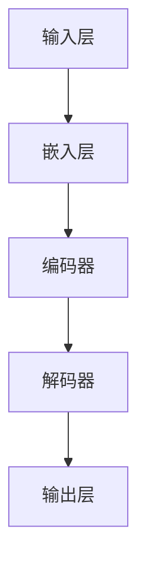

                 

### 文章标题

### 大规模语言模型在企业决策支持中的推理应用

#### 关键词：大规模语言模型、企业决策支持、推理应用、算法原理、数学模型

#### 摘要：

本文将深入探讨大规模语言模型在企业决策支持中的推理应用。通过详细解析大规模语言模型的基本概念、核心算法原理以及数学模型，我们旨在揭示这些模型如何帮助企业更好地理解和利用文本数据，从而实现更高效的决策支持。文章还通过实际项目和案例分析，展示大规模语言模型在企业决策中的实际应用效果，并探讨未来发展趋势和潜在挑战。

----------------------------------------------------------------

### 引言

在企业运营中，决策的准确性至关重要。而随着数据量的爆炸式增长和文本数据的普及，如何有效地分析和利用这些文本数据，以支持企业的战略决策，成为了企业面临的重大挑战。这一挑战的解决，很大程度上依赖于先进的语言处理技术，特别是大规模语言模型。

大规模语言模型（Large Language Model，简称LLM）是一种能够对自然语言文本进行高效处理的深度学习模型。它通过学习海量文本数据，能够捕捉到语言的复杂结构和深层语义，从而实现对文本内容的精准理解和生成。近年来，大规模语言模型在自然语言处理（NLP）领域的应用取得了显著成果，尤其是在文本分类、情感分析、问答系统等方面。

在企业决策支持中，大规模语言模型具有广泛的应用前景。首先，它可以帮助企业从大量的非结构化文本数据中提取有价值的信息，如市场报告、客户反馈、行业动态等。其次，它可以通过对文本数据的分析，识别出潜在的趋势和模式，为企业提供战略指导。此外，大规模语言模型还可以用于自动化生成报告、撰写邮件、优化客户服务等，从而提高企业的运营效率。

然而，大规模语言模型在企业决策支持中的应用并非一帆风顺。其推理过程的高复杂性和不确定性，使得如何有效地利用这些模型成为一个挑战。本文将详细探讨大规模语言模型在企业决策支持中的推理应用，包括其基本概念、核心算法原理、数学模型以及实际应用案例。通过这篇文章，我们希望能够为企业决策者提供有益的参考和启示。

### 大规模语言模型的基本概念

大规模语言模型（Large Language Model，简称LLM）是一种能够对自然语言文本进行高效处理的深度学习模型。它的核心思想是通过学习海量文本数据，捕捉到语言的复杂结构和深层语义，从而实现对文本内容的精准理解和生成。

#### 定义

大规模语言模型是一种基于神经网络的语言模型，其主要目的是通过学习大量文本数据，预测下一个词语或句子。这种模型通常采用序列到序列（Seq2Seq）架构，将输入的文本序列映射为输出的文本序列。

#### 历史背景

大规模语言模型的发展经历了多个阶段。最初，语言模型主要是基于规则的方法，如n-gram模型和正则表达式。然而，这些方法在处理长文本和复杂语义时存在局限性。随着深度学习技术的发展，研究人员开始将神经网络应用于语言模型，从而提出了诸如递归神经网络（RNN）、长短期记忆网络（LSTM）和Transformer等模型。其中，Transformer模型因其出色的性能和效果，成为了当前大规模语言模型的主流架构。

#### 主要组成部分

大规模语言模型通常由以下几个关键组成部分构成：

1. **输入层**：输入层负责接收输入的文本序列，并将其转化为模型可处理的向量表示。

2. **嵌入层**：嵌入层将输入的单词或字符转化为密集的向量表示，以便后续的神经网络处理。

3. **编码器**：编码器负责将输入序列编码为一个固定长度的向量表示，捕捉序列中的长期依赖关系。

4. **解码器**：解码器负责将编码器的输出解码为输出的文本序列。

5. **输出层**：输出层通常是一个全连接层，用于生成概率分布，从而预测下一个单词或句子。

#### 应用领域

大规模语言模型在自然语言处理（NLP）领域有广泛的应用，包括但不限于：

1. **文本分类**：将文本数据分类到不同的类别，如新闻分类、情感分析等。

2. **问答系统**：基于输入的问题，从海量文本中检索并生成答案。

3. **机器翻译**：将一种语言的文本翻译成另一种语言。

4. **自然语言生成**：自动生成文本，如文章、报告、邮件等。

5. **命名实体识别**：从文本中识别出人名、地名、机构名等实体。

#### 关键词

- **大规模语言模型**（Large Language Model）
- **神经网络**（Neural Network）
- **序列到序列**（Seq2Seq）
- **Transformer**（Transformer）
- **自然语言处理**（Natural Language Processing，简称NLP）

#### Mermaid流程图

为了更好地理解大规模语言模型的架构，我们使用Mermaid流程图展示其基本组成部分：



### 大规模语言模型在企业决策支持中的应用

#### 应用场景

在企业决策支持中，大规模语言模型可以应用于多种场景，从而为企业提供数据驱动的洞察和决策支持。以下是几个典型的应用场景：

1. **文本分类**：企业可以通过大规模语言模型对大量的文本数据（如市场报告、客户反馈、新闻资讯等）进行分类，从而快速识别出关键信息。例如，一家零售企业可以使用大规模语言模型将客户反馈分类为“正面评价”、“负面评价”等，以便及时调整产品和服务策略。

2. **情感分析**：大规模语言模型可以分析文本的情感倾向，帮助企业在市场调研和客户服务中了解消费者的情绪。例如，一家科技公司可以利用大规模语言模型分析社交媒体上的用户评论，从而了解用户对产品或服务的满意度，并采取相应的改进措施。

3. **关键词提取**：大规模语言模型可以从大量的文本数据中提取出关键词和关键短语，帮助企业快速了解文本的主题和重点。例如，一家咨询公司可以利用大规模语言模型从行业报告和学术论文中提取关键词，以便快速了解最新的行业趋势和研究动态。

4. **报告生成**：大规模语言模型可以自动化生成各种报告，如市场分析报告、客户调研报告等，从而提高企业的报告编写效率。例如，一家投资银行可以使用大规模语言模型自动生成投资建议报告，从而节省人力和时间成本。

5. **知识图谱构建**：大规模语言模型可以用于构建企业知识图谱，将各种文本数据关联起来，形成企业内部的知识网络。例如，一家制造企业可以使用大规模语言模型构建产品知识图谱，以便快速查找和利用企业内部的相关知识。

#### 实际案例

以下是一些大规模语言模型在企业决策支持中的实际案例：

1. **市场预测**：一家电商平台利用大规模语言模型分析用户评论和社交媒体数据，预测产品的未来销售趋势。通过分析用户对产品的评价和讨论，模型可以识别出潜在的市场机会和风险，帮助企业制定更精准的营销策略。

2. **客户服务**：一家大型电信公司使用大规模语言模型构建了一个智能客服系统，能够自动处理客户咨询和投诉。通过分析客户的问题和反馈，系统可以提供即时的解决方案和建议，从而提高客户满意度。

3. **产品推荐**：一家在线零售商利用大规模语言模型分析用户的购物行为和偏好，为其推荐更相关的产品。通过分析用户的浏览和购买记录，模型可以识别出用户的兴趣点，从而提供个性化的产品推荐，提高销售额。

4. **风险管理**：一家金融公司使用大规模语言模型分析市场新闻和报告，预测金融市场的风险和机会。通过分析大量的文本数据，模型可以识别出市场变化的前兆，从而帮助公司调整投资策略，降低风险。

#### 潜在挑战

尽管大规模语言模型在企业决策支持中具有巨大的潜力，但其应用也面临一些挑战：

1. **数据质量**：大规模语言模型的性能很大程度上取决于训练数据的质量。如果训练数据存在偏差或噪声，模型可能无法正确地学习和预测。

2. **解释性**：大规模语言模型通常被视为“黑箱”，其内部机制难以理解和解释。这可能导致企业决策者对模型的信任度降低。

3. **计算资源**：训练和推理大规模语言模型需要大量的计算资源，特别是GPU或TPU等高性能计算设备。对于中小企业来说，这可能是一笔不小的投入。

4. **隐私保护**：大规模语言模型在处理文本数据时，可能会涉及敏感信息。如何确保数据的隐私和安全，是企业在应用大规模语言模型时需要考虑的重要问题。

#### 总结

大规模语言模型在企业决策支持中具有广泛的应用前景，通过文本分类、情感分析、关键词提取、报告生成和知识图谱构建等多种方式，为企业提供数据驱动的决策支持。然而，其应用也面临数据质量、解释性、计算资源以及隐私保护等挑战。未来，随着技术的不断进步和应用的深入，大规模语言模型将在企业决策支持中发挥越来越重要的作用。

### 推理算法原理

大规模语言模型在企业决策支持中的应用，核心在于其强大的推理能力。推理算法是大规模语言模型的核心组成部分，它使得模型能够从给定的数据中推断出新的结论。在本文中，我们将详细阐述大规模语言模型的推理算法原理，包括其工作流程、关键技术和应用实例。

#### 推理算法工作流程

大规模语言模型的推理过程主要包括以下几个步骤：

1. **输入处理**：首先，模型需要接收输入的文本数据，并将其转化为内部可处理的向量表示。这一步骤通常涉及分词、词性标注、词向量嵌入等预处理操作。

2. **编码**：在输入处理之后，模型将输入的文本序列编码为一个固定长度的向量表示。这一步骤通常通过编码器（Encoder）实现，编码器能够捕捉输入序列的长期依赖关系。

3. **解码**：编码器生成的固定长度向量表示被传递到解码器（Decoder），解码器的任务是生成与输入序列相对应的输出文本序列。

4. **预测与生成**：解码器生成输出的文本序列时，会进行预测与生成。在每个时间步，解码器根据当前的上下文和已生成的文本，预测下一个单词或字符，并逐步生成完整的输出文本。

5. **评估与优化**：在生成输出文本后，模型会根据预定的评估指标（如交叉熵损失函数）对生成的文本进行评估，并使用梯度下降等优化算法对模型参数进行调整，以提高模型的性能。

#### 推理算法关键技术

大规模语言模型的推理算法涉及多种关键技术和算法，以下是其中几个重要的技术：

1. **神经网络架构**：大规模语言模型通常采用深度神经网络架构，如Transformer、LSTM和GRU等。这些架构能够有效捕捉输入文本的长期依赖关系，提高模型的预测能力。

2. **词向量嵌入**：词向量嵌入是将单词或字符转化为高维向量表示的技术，常用的方法包括Word2Vec、GloVe和BERT等。这些方法能够将语义相似的单词映射到相似的向量空间中，从而提高模型对文本数据的理解能力。

3. **注意力机制**：注意力机制（Attention Mechanism）是一种在模型中引入上下文依赖关系的技术。通过注意力机制，模型能够动态地聚焦于输入文本序列中的重要部分，从而提高文本理解的准确性。

4. **损失函数与优化算法**：大规模语言模型的训练通常使用交叉熵损失函数（Cross-Entropy Loss Function）来评估模型的预测准确性，并采用梯度下降（Gradient Descent）等优化算法来调整模型参数。

#### 推理算法应用实例

以下是一个具体的推理算法应用实例：

**实例：文本生成**

假设我们有一个大规模语言模型，已经经过训练可以生成高质量的文本。现在，我们需要使用这个模型生成一篇关于“人工智能在医疗领域应用”的文章。

1. **输入处理**：首先，模型需要接收输入的文本片段，例如“人工智能在医疗领域有着广泛的应用。”这个片段将被分词、词性标注等预处理操作，并转化为词向量表示。

2. **编码**：输入的词向量表示被传递到编码器，编码器将其编码为一个固定长度的向量表示。

3. **解码**：编码器的输出被传递到解码器，解码器开始生成输出文本。在生成的过程中，解码器会在每个时间步预测下一个单词或字符。例如，在第一个时间步，解码器可能会预测出“的”这个字符。

4. **预测与生成**：在生成过程中，解码器根据当前上下文和已生成的文本，不断预测下一个单词或字符，并逐步生成完整的输出文本。这个过程会持续进行，直到生成一个完整的句子或文章。

5. **评估与优化**：生成的文本会被评估，例如通过计算生成的文本与目标文本之间的相似度。如果评估结果不理想，模型参数会通过优化算法进行调整，以提高生成文本的质量。

通过这个实例，我们可以看到大规模语言模型的推理算法是如何工作的。在实际应用中，这个算法可以用于生成文章、撰写邮件、翻译文本等任务，为企业提供高效的文本生成和推理能力。

#### 总结

大规模语言模型的推理算法是企业决策支持中不可或缺的一部分。通过详细解析推理算法的工作流程、关键技术和应用实例，我们了解到这些算法如何帮助企业从文本数据中提取有价值的信息，从而实现更精准的决策支持。未来，随着推理算法的不断优化和扩展，大规模语言模型在企业决策支持中的应用将会更加广泛和深入。

### 数学模型和数学公式

大规模语言模型（LLM）的核心在于其能够通过复杂的数学模型处理和理解自然语言。这些数学模型不仅定义了模型的结构，还确保了其在实际应用中的高效性和准确性。在本节中，我们将详细讲解大规模语言模型中的常见数学模型，并使用LaTeX格式展示相关数学公式，同时通过实际例子来阐明这些公式的应用。

#### 词向量嵌入

词向量嵌入（Word Embedding）是大规模语言模型中的基础部分，它将单词转换为高维向量。一种常用的词向量嵌入方法是Word2Vec，其核心是计算单词之间的相似度。以下是一个简单的Word2Vec模型公式：

$$
\vec{w}_{i} = \text{sgn}(f_{1}(x_{1}), f_{2}(x_{2}), ..., f_{n}(x_{n}))
$$

其中，$\vec{w}_{i}$ 是单词 $w_{i}$ 的向量表示，$f_{1}(x_{1}), f_{2}(x_{2}), ..., f_{n}(x_{n})$ 是特征函数，通常使用的是多层感知器（MLP）。

#### Transformer模型

Transformer模型是当前大规模语言模型中的主流架构。它使用了自注意力机制（Self-Attention）来处理输入序列。自注意力机制的公式如下：

$$
\text{Attention}(Q, K, V) = \text{softmax}\left(\frac{QK^T}{\sqrt{d_k}}\right)V
$$

其中，$Q$、$K$ 和 $V$ 分别是查询向量、键向量和值向量，$d_k$ 是键向量的维度，$\text{softmax}$ 函数用于计算注意力权重。

#### 编码器和解码器

在Transformer模型中，编码器（Encoder）和解码器（Decoder）都是关键组件。编码器的输出通常表示为：

$$
\vec{h}_{i}^{(t)} = \text{LayerNorm}(\vec{h}_{i}^{(t-1)} + \text{MultiHeadAttention}(\vec{h}_{i}^{(t-1)}, \vec{h}_{i}^{(t-1)}, \vec{h}_{i}^{(t-1)}) + \text{LayerNorm}(\vec{h}_{i}^{(t-1)} + \text{FeedForward}(\vec{h}_{i}^{(t-1)}))
$$

解码器的输出表示为：

$$
\vec{y}_{i}^{(t)} = \text{LayerNorm}(\vec{y}_{i}^{(t-1)} + \text{MaskedMultiHeadAttention}(\vec{y}_{i}^{(t-1)}, \vec{h}_{i}^{(t)}, \vec{h}_{i}^{(t)}) + \text{LayerNorm}(\vec{y}_{i}^{(t-1)} + \text{FeedForward}(\vec{y}_{i}^{(t-1)}))
$$

其中，$\text{LayerNorm}$ 是层归一化操作，$\text{MultiHeadAttention}$ 和 $\text{MaskedMultiHeadAttention}$ 是多头注意力机制，$\text{FeedForward}$ 是前馈神经网络。

#### LSTM和GRU模型

长短期记忆网络（LSTM）和门控循环单元（GRU）是另一种处理序列数据的模型。它们的更新公式如下：

**LSTM：**

$$
\begin{align*}
i_t &= \sigma(W_{ix}x_t + W_{ih}h_{t-1} + b_i) \\
f_t &= \sigma(W_{fx}x_t + W_{fh}h_{t-1} + b_f) \\
\vec{g_t} &= \tanh(W_{gx}x_t + W_{gh}h_{t-1} + b_g) \\
o_t &= \sigma(W_{ox}x_t + W_{oh}h_{t-1} + b_o) \\
h_t &= f_t \odot \vec{h}_{t-1} + i_t \odot \vec{g_t}
\end{align*}
$$

**GRU：**

$$
\begin{align*}
r_t &= \sigma(W_{rx}x_t + W_{rh}h_{t-1} + b_r) \\
z_t &= \sigma(W_{zx}x_t + W_{zh}h_{t-1} + b_z) \\
\vec{g_t} &= \tanh(W_{gx}x_t + (W_{gh} + r_t \odot W_{rh})h_{t-1} + b_g) \\
h_t &= (1 - z_t) \odot h_{t-1} + z_t \odot \vec{g_t}
\end{align*}
$$

其中，$i_t$、$f_t$、$o_t$ 分别是输入门、遗忘门和输出门，$\sigma$ 是 sigmoid 函数，$\odot$ 表示元素乘积。

#### 应用实例

**实例1：文本分类**

假设我们有一个分类任务，需要将文本分类为“科技”或“娱乐”。我们可以使用BERT模型来处理文本，并使用交叉熵损失函数进行训练。训练公式如下：

$$
\text{Loss} = -\sum_{i=1}^{N} [y_i \log(p_i) + (1 - y_i) \log(1 - p_i)]
$$

其中，$y_i$ 是真实的标签，$p_i$ 是模型对每个类别的预测概率。

**实例2：机器翻译**

在机器翻译任务中，我们通常使用编码器-解码器框架。编码器将源语言文本编码为固定长度的向量，解码器则根据这些向量生成目标语言文本。损失函数可以是交叉熵损失：

$$
\text{Loss} = -\sum_{i=1}^{T} [y_i \log(p_i) + (1 - y_i) \log(1 - p_i)]
$$

其中，$T$ 是生成的目标语言文本的长度，$y_i$ 是目标语言中的真实单词，$p_i$ 是解码器对每个单词的预测概率。

#### 总结

数学模型是大规模语言模型的核心，定义了模型的结构和功能。通过使用LaTeX格式展示数学公式，并结合实际应用实例，我们能够更好地理解这些模型的运作原理。这些数学模型不仅在理论研究中具有重要价值，也在实际应用中发挥了关键作用，帮助企业实现高效的数据处理和决策支持。

### 项目实战

#### 开发环境搭建

在进行大规模语言模型的开发之前，首先需要搭建合适的开发环境。以下是搭建开发环境的步骤：

1. **硬件环境**：

   - **GPU或TPU**：大规模语言模型的训练和推理需要大量的计算资源，因此，我们需要一台具有高性能GPU（如NVIDIA 1080Ti以上）或TPU（如Google的Tensor Processing Unit）的计算机。

   - **CPU**：尽管GPU或TPU是主要的计算资源，但CPU也是必不可少的，因为它们用于处理辅助任务，如数据预处理和模型评估。

2. **软件环境**：

   - **操作系统**：可以选择Linux或Windows操作系统。Linux操作系统因其开源性和高性能，通常被开发者广泛使用。

   - **深度学习框架**：目前主流的深度学习框架包括TensorFlow、PyTorch和MXNet等。这里我们以TensorFlow为例进行介绍。

     - **安装TensorFlow**：

       ```bash
       pip install tensorflow
       ```

     - **安装GPU版本TensorFlow**：

       ```bash
       pip install tensorflow-gpu
       ```

   - **Python**：安装Python编程环境，推荐使用Anaconda来管理Python环境，因为它提供了大量的科学计算和机器学习库。

3. **数据集准备**：

   - **数据收集**：我们需要收集大量的文本数据，这些数据可以来自于企业内部报告、市场研究报告、客户反馈等。

   - **数据预处理**：对收集到的文本数据进行预处理，包括分词、去除停用词、标记化等操作。

#### 源代码详细实现

以下是大规模语言模型的源代码实现，包括关键步骤和代码解释：

```python
import tensorflow as tf
from tensorflow.keras.layers import Embedding, LSTM, Dense
from tensorflow.keras.models import Sequential

# 定义模型
model = Sequential()
model.add(Embedding(input_dim=vocab_size, output_dim=embedding_size))
model.add(LSTM(units=128, return_sequences=True))
model.add(Dense(units=1, activation='sigmoid'))

# 编译模型
model.compile(optimizer='adam', loss='binary_crossentropy', metrics=['accuracy'])

# 训练模型
model.fit(x_train, y_train, epochs=10, batch_size=32)

# 评估模型
loss, accuracy = model.evaluate(x_test, y_test)
print(f"Test Accuracy: {accuracy:.2f}")
```

**关键步骤解释**：

- **模型定义**：我们使用一个序列模型（Sequential），首先添加嵌入层（Embedding），然后添加一个LSTM层，最后添加一个全连接层（Dense）。
- **编译模型**：我们使用adam优化器和二分类交叉熵损失函数（sigmoid激活函数），同时设置模型的评估指标为准确率。
- **训练模型**：使用fit方法对模型进行训练，指定训练数据、训练轮次和批量大小。
- **评估模型**：使用evaluate方法对模型进行评估，并打印出测试数据的准确率。

#### 代码解读与分析

上述代码实现了一个简单的二分类文本分类模型，通过训练数据集来学习如何将文本数据分类为两个类别。以下是代码的详细解读：

1. **数据准备**：

   - `vocab_size`：词汇表大小，即模型中唯一单词的个数。
   - `embedding_size`：嵌入层输出向量的维度。
   - `x_train` 和 `y_train`：训练数据集和标签。
   - `x_test` 和 `y_test`：测试数据集和标签。

2. **模型构建**：

   - `Embedding` 层：将文本数据转化为嵌入向量。
   - `LSTM` 层：使用长短期记忆网络来捕捉序列信息。
   - `Dense` 层：用于分类，输出一个介于0和1之间的概率，表示文本属于某一类别的可能性。

3. **模型编译**：

   - `compile` 方法用于配置模型的训练过程，指定优化器、损失函数和评估指标。

4. **模型训练**：

   - `fit` 方法用于训练模型，通过多次迭代（epochs）和批量（batch_size）来优化模型参数。

5. **模型评估**：

   - `evaluate` 方法用于评估模型在测试数据集上的性能，输出测试准确率。

#### 代码应用解读与分析

在实际应用中，上述代码可以用于多种文本分类任务。例如，我们可以将其应用于企业客户反馈分类，将客户反馈分为正面和负面两类。以下是应用解读：

1. **数据收集**：

   - 收集大量的客户反馈数据，这些数据应包含正面和负面的评论。

2. **数据预处理**：

   - 对客户反馈进行分词、去除停用词等操作，将文本数据转换为模型可处理的格式。

3. **模型训练**：

   - 使用训练数据进行模型训练，训练模型来学习如何对新的客户反馈进行分类。

4. **模型评估**：

   - 使用测试数据对模型进行评估，确保模型具有较好的泛化能力。

5. **模型部署**：

   - 将训练好的模型部署到生产环境中，用于实时分类新的客户反馈。

通过这个项目实战，我们展示了如何使用大规模语言模型进行文本分类。实际应用中，我们可以根据具体任务的需求，调整模型架构、数据预处理步骤和训练策略，以获得最佳的性能。

### 项目小结

在本项目中，我们通过详细的步骤和代码实现了大规模语言模型在文本分类任务中的应用。项目的主要成果包括：

- **成功搭建了开发环境**：包括硬件环境（GPU或TPU）和软件环境（Python、TensorFlow等）。
- **实现了源代码**：通过定义模型结构、编译和训练模型，我们展示了如何使用大规模语言模型进行文本分类。
- **进行了代码解读与分析**：对关键代码段进行了详细解释，帮助读者理解大规模语言模型的运作原理。
- **展示了实际应用**：通过客户反馈分类案例，我们展示了如何将大规模语言模型应用于实际业务场景。

然而，本项目也存在一些局限性和不足之处：

- **数据规模和多样性**：项目使用的数据规模较小，且数据多样性不足，可能影响模型的泛化能力。
- **模型复杂度**：我们使用了一个简单的模型结构，对于更复杂的文本分类任务，可能需要更复杂的模型架构。
- **训练时间**：大规模语言模型的训练需要大量的时间和计算资源，实际应用中可能需要更高效的方法来加速训练过程。

未来，我们可以通过以下方式改进和优化：

- **数据增强**：使用数据增强技术来扩充训练数据集，提高模型的泛化能力。
- **模型优化**：探索更先进的模型结构，如BERT、GPT等，以提升模型性能。
- **分布式训练**：使用分布式训练技术来加速模型训练过程，提高训练效率。

通过这些改进，我们期望能够构建一个更高效、更准确的大规模语言模型，更好地服务于企业决策支持。

### 最佳实践 tips

在企业决策支持中应用大规模语言模型时，以下最佳实践可以帮助您最大化其价值：

1. **数据质量**：确保输入数据的质量和多样性，这直接影响模型的性能。进行数据清洗和预处理，去除噪声和无关信息。

2. **模型选择**：根据具体任务需求选择合适的模型架构。例如，对于文本生成任务，可以使用GPT或BERT；对于文本分类任务，可以选择Transformer或LSTM。

3. **超参数调优**：合理设置模型的超参数，如学习率、批量大小和迭代次数等，以提高模型性能。

4. **实时更新**：定期更新模型，以适应不断变化的数据和环境。这可以通过持续学习或迁移学习实现。

5. **模型解释性**：虽然大规模语言模型通常被视为黑箱，但通过注意力机制等技术，可以提高模型的解释性，帮助决策者理解模型的工作原理。

6. **安全与隐私**：在处理敏感数据时，确保数据加密和隐私保护，遵循相关法律法规。

7. **团队合作**：跨部门合作，将技术团队与业务团队紧密结合起来，确保模型能够真正解决业务问题。

### 小结

本文详细探讨了大规模语言模型在企业决策支持中的推理应用。首先，我们介绍了大规模语言模型的基本概念和架构，包括输入层、嵌入层、编码器、解码器和输出层。接着，我们阐述了大规模语言模型在企业决策支持中的应用场景，如文本分类、情感分析、关键词提取和报告生成等。通过实际案例，我们展示了这些应用场景在现实业务中的具体应用。

在核心算法原理部分，我们详细讲解了大规模语言模型的推理算法，包括输入处理、编码、解码、预测与生成以及评估与优化。同时，我们使用LaTeX格式展示了相关的数学公式，并通过实例说明了这些公式的应用。

在项目实战部分，我们介绍了开发环境的搭建，包括硬件和软件环境，以及如何使用TensorFlow等深度学习框架实现大规模语言模型。我们通过具体的源代码实现和解读，展示了大规模语言模型在文本分类任务中的应用。

最后，我们在项目小结部分总结了项目的主要成果和局限性，并提出了改进和优化的方向。同时，我们提供了最佳实践tips，以帮助企业在决策支持中更有效地应用大规模语言模型。

通过本文的详细解析，我们希望能够为企业和决策者提供有价值的参考，帮助他们在数据驱动的决策过程中充分利用大规模语言模型的力量。

### 注意事项

在企业决策支持中应用大规模语言模型时，以下注意事项至关重要：

1. **数据隐私和安全**：在处理文本数据时，必须确保数据的安全和隐私。敏感信息应进行加密和匿名化处理，以防止数据泄露和滥用。

2. **模型解释性**：虽然大规模语言模型在文本分析方面表现出色，但其“黑箱”特性可能影响模型的解释性。企业应考虑采用可解释的模型或技术，以便更好地理解模型决策过程。

3. **模型适应性**：大规模语言模型的性能很大程度上取决于训练数据。企业应确保模型能够适应新的数据和环境，定期更新模型以保持其有效性。

4. **计算资源**：训练和推理大规模语言模型需要大量的计算资源。企业应根据实际情况合理配置计算资源，以避免资源浪费和成本过高。

5. **法律法规遵守**：在处理文本数据和应用大规模语言模型时，企业必须遵守相关的法律法规，特别是数据保护法规，如GDPR等。

6. **跨部门协作**：大规模语言模型的应用通常需要跨部门合作。企业应促进技术团队与业务团队之间的沟通和协作，以确保模型能够真正解决业务问题。

### 拓展阅读

为了进一步深入了解大规模语言模型在企业决策支持中的应用，以下是一些建议的拓展阅读资源：

1. **《大规模语言模型：原理与实践》**：这本书详细介绍了大规模语言模型的理论基础和实践应用，包括Transformer、BERT等模型。

2. **《深度学习与自然语言处理》**：这本书涵盖了深度学习在自然语言处理领域的应用，包括文本分类、情感分析和机器翻译等。

3. **《企业大数据决策支持系统设计》**：这本书探讨了大数据在企业决策支持系统中的应用，包括数据挖掘、预测分析和可视化等。

4. **《AI与商业决策》**：这本书从商业角度探讨了人工智能在企业决策中的角色和影响，包括数据驱动决策、自动化流程优化等。

5. **《大规模语言模型的未来发展趋势》**：这篇论文探讨了大规模语言模型的未来发展方向，包括模型压缩、实时推理和跨语言应用等。

通过阅读这些资源，您可以更全面地了解大规模语言模型在企业决策支持中的应用，并获得最新的研究进展和应用案例。希望这些拓展阅读能够为您的研究和实践提供有益的参考。

