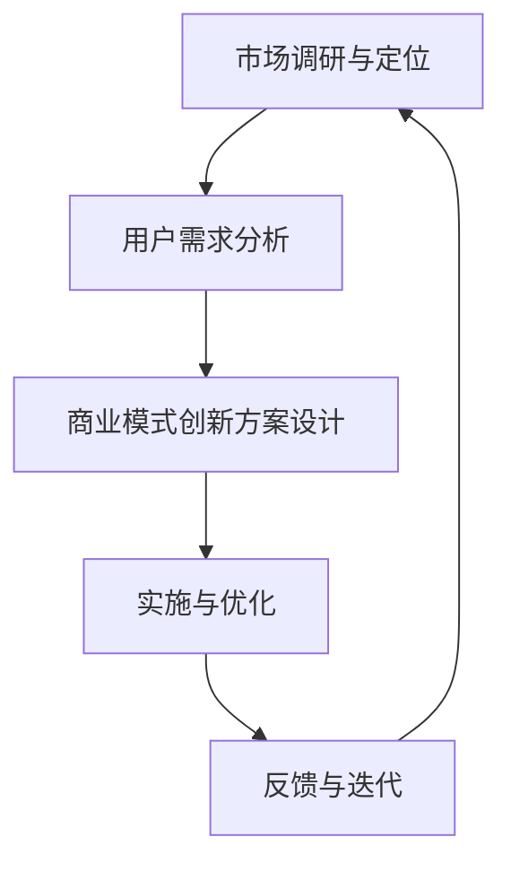

                 

## 文章标题：大规模语言模型在创新商业模式设计中的应用

### 关键词：

- 大规模语言模型
- 创新商业模式设计
- 自然语言处理（NLP）
- 机器学习
- 商业分析

### 摘要：

本文旨在探讨大规模语言模型（LLM）在创新商业模式设计中的应用。首先，我们将回顾大规模语言模型的发展背景和技术原理，接着深入分析其在自然语言处理（NLP）中的多种应用场景，并特别关注其在商业模式设计过程中的潜力。文章将分章节详细阐述大规模语言模型的数学原理、训练过程、应用场景，以及其在市场调研、用户需求分析和商业模式创新等方面的实际应用。最后，我们将讨论大规模语言模型开发的挑战和未来发展趋势，并总结其在商业模式设计中的贡献，展望未来研究。通过一步步的分析和推理，本文旨在为读者提供一个清晰、系统的理解，展示大规模语言模型在商业创新中的独特价值。

---

### 引言

#### 1.1 书籍背景与目标

随着人工智能技术的飞速发展，大规模语言模型（Large-scale Language Models，LLM）已经成为自然语言处理（Natural Language Processing，NLP）领域的重要工具。LLM 的出现不仅提升了文本生成、理解、翻译等任务的性能，更为各行业带来了创新性的变革。特别是在商业模式设计中，LLM 的应用潜力引起了广泛关注。本文旨在探讨大规模语言模型在创新商业模式设计中的应用，通过系统性的分析和案例研究，揭示其带来的深远影响。

本文的目标是：

1. **介绍大规模语言模型的基本概念和原理**：帮助读者了解语言模型的构成、工作原理和训练过程，为其后续应用打下基础。
2. **探讨大规模语言模型在自然语言处理中的应用**：通过具体案例展示LLM在文本分类、命名实体识别、机器翻译等任务中的实际应用。
3. **阐述大规模语言模型在商业模式设计中的角色**：分析LLM如何通过市场调研、用户需求分析和商业模式创新，助力企业发现新的商业机会。
4. **讨论大规模语言模型在商业模式设计中的挑战和未来趋势**：探讨当前LLM在商业应用中面临的挑战，并预测其未来发展方向。

#### 1.2 大规模语言模型的发展

大规模语言模型的发展可以追溯到20世纪80年代，当时研究人员开始探索使用统计方法和规则系统进行文本分析。然而，受限于计算资源和数据规模，早期的语言模型效果有限。

1. **统计语言模型**：最早的统计语言模型基于N-gram模型，通过统计词频来预测下一个词。虽然简单有效，但N-gram模型的长期依赖性较差，无法很好地捕捉上下文信息。
2. **神经网络语言模型**：20世纪90年代，神经网络（Neural Networks）开始应用于语言模型。递归神经网络（RNN）和长短期记忆网络（LSTM）的出现，显著提升了语言模型的表现。RNN和LSTM通过递归结构，能够在一定程度上捕捉文本的长期依赖关系。
3. **Transformer架构**：2017年，谷歌提出了Transformer架构，彻底改变了语言模型的发展方向。Transformer采用自注意力机制，能够并行处理输入序列，并捕捉长距离依赖关系，使得语言模型在多个任务中取得了突破性的进展。
4. **大型预训练模型**：随着计算资源和数据量的增加，大型预训练模型（如GPT系列、BERT）相继问世。这些模型通过在大规模语料库上进行预训练，能够自适应地处理各种自然语言任务，显著提升了模型的效果和泛化能力。

#### 1.3 创新商业模式设计的重要性

创新商业模式设计是企业获得竞争优势和持续发展的关键。一个成功的商业模式不仅能够明确企业的盈利模式，还能够优化资源配置、提高运营效率，从而在激烈的市场竞争中脱颖而出。以下是一些创新商业模式设计的重要性：

1. **发现新的商业机会**：通过市场调研和用户需求分析，企业可以发现潜在的市场机会，开发出满足用户需求的新产品或服务。
2. **提升竞争力**：创新性的商业模式能够帮助企业建立独特的竞争优势，如品牌、技术、渠道等，从而在市场上占据领先地位。
3. **优化资源配置**：创新的商业模式可以帮助企业优化资源分配，提高运营效率，降低成本，实现可持续发展。
4. **增强用户体验**：通过深入理解用户需求，企业可以设计出更加符合用户期望的产品和服务，提升用户满意度和忠诚度。
5. **推动行业变革**：创新的商业模式往往能够颠覆传统行业，带来新的商业生态，推动整个行业的发展和变革。

综上所述，大规模语言模型在创新商业模式设计中的应用具有重要意义。通过本文的探讨，我们将深入理解LLM的技术原理和应用场景，揭示其在商业模式创新中的独特价值。

### 大规模语言模型基础

#### 2.1 语言模型概述

**2.1.1 语言模型的定义与作用**

语言模型（Language Model）是自然语言处理（NLP）中的基础构件，用于预测文本序列中的下一个单词或字符。在文本生成、语音识别、机器翻译等任务中，语言模型发挥着关键作用。其基本目标是通过分析大量语言数据，建立一个能够准确预测文本概率的数学模型。

**2.1.2 语言模型的发展历程**

语言模型的发展历程可以追溯到20世纪50年代，当时研究人员开始探索基于规则的方法来处理文本。随着计算机性能的提升和大数据时代的到来，语言模型经历了多个发展阶段：

1. **N-gram模型**：最早的语言模型之一，基于词频统计。通过统计连续N个词（N-gram）出现的频率来预测下一个词。虽然简单有效，但N-gram模型存在长期依赖性不足的问题。

2. **神经网络语言模型**：20世纪90年代，递归神经网络（RNN）和长短期记忆网络（LSTM）被引入语言模型，显著提升了模型的性能。RNN通过递归结构能够在一定程度上捕捉文本的长期依赖关系，而LSTM则通过门控机制解决了RNN的梯度消失问题。

3. **Transformer架构**：2017年，谷歌提出了Transformer架构，彻底改变了语言模型的发展方向。Transformer采用自注意力机制，能够在并行处理输入序列的同时捕捉长距离依赖关系，显著提升了模型的性能。

4. **大型预训练模型**：近年来，大型预训练模型（如GPT系列、BERT）相继问世。这些模型通过在大规模语料库上进行预训练，能够自适应地处理各种自然语言任务，显著提升了模型的效果和泛化能力。

**2.1.3 语言模型的核心组成部分**

一个典型的语言模型通常由以下几个核心组成部分构成：

1. **输入层**：接收输入的文本序列，并将其转换为模型可以处理的格式。常见的方法包括分词、编码等。

2. **编码器**：对输入文本序列进行编码，将其转换为固定长度的向量表示。编码器通常采用神经网络结构，如Transformer、LSTM等。

3. **解码器**：根据编码器的输出，预测下一个单词或字符。解码器也通常采用神经网络结构，如Transformer、LSTM等。

4. **预测层**：将解码器的输出转换为具体的文本预测结果。预测层通常是一个多层感知机（MLP），用于对编码器输出的向量进行分类或回归。

#### 2.2 常见的大型语言模型

在NLP领域中，有几种大型语言模型因其出色的性能和广泛的应用而备受关注。以下是其中几种具有代表性的模型：

**2.2.1 GPT系列模型**

GPT（Generative Pre-trained Transformer）系列模型是由OpenAI开发的一系列基于Transformer架构的预训练模型。GPT-2、GPT-3等模型在多个NLP任务中取得了显著成果，其训练过程通常涉及以下几个步骤：

1. **数据收集与预处理**：收集大量文本数据，并进行预处理，如分词、去除停用词、标准化等。
2. **预训练**：在预处理后的数据上进行预训练，通过自回归语言模型（Autoregressive Language Model）学习文本的统计规律和上下文信息。
3. **微调**：在特定任务的数据集上对模型进行微调，使其适应具体任务的需求。

GPT系列模型以其强大的文本生成能力和适应性，在问答系统、对话生成、机器翻译等领域取得了广泛应用。

**2.2.2 BERT及其变体**

BERT（Bidirectional Encoder Representations from Transformers）是由Google提出的一种基于Transformer架构的双向编码器表示模型。BERT的显著特点是能够同时考虑输入文本序列中的左右信息，从而在多个NLP任务中取得了突破性的成果。

BERT的主要训练步骤包括：

1. **数据收集与预处理**：与GPT类似，BERT也需要大量预处理后的文本数据。
2. **预训练**：通过双向Transformer编码器对文本进行编码，并在大规模语料库上进行预训练。
3. **微调**：在特定任务的数据集上对BERT模型进行微调，以适应具体任务的性能需求。

BERT及其变体（如RoBERTa、ALBERT等）在文本分类、命名实体识别、机器翻译等任务中取得了优异的表现。

**2.2.3 其他大型语言模型**

除了GPT系列和BERT之外，还有其他一些大型语言模型在NLP领域中表现出色，如T5、DeBERTa、GPT-Neo等。

- **T5（Text-to-Text Transfer Transformer）**：由Google提出，T5采用统一的文本到文本的预训练目标，使得模型能够广泛应用于各种NLP任务。

- **DeBERTa**：由华为诺亚方舟实验室提出，DeBERTa通过双向编码器和自注意力机制，在多个NLP任务中取得了优异的性能。

- **GPT-Neo**：由开源社区开发，GPT-Neo是对GPT系列模型的改进版本，旨在提高模型的性能和可扩展性。

总之，这些大型语言模型的发展为NLP任务提供了强大的工具，推动了自然语言处理技术的进步和应用。

### 语言模型的数学原理

#### 3.1 语言模型的数学基础

理解大规模语言模型（LLM）的数学原理是掌握其工作机制和实现方法的关键。在这部分，我们将深入探讨神经网络（Neural Networks）、递归神经网络（RNN）、以及Transformer架构的基本数学原理。

**3.1.1 神经网络**

神经网络是由大量简单的处理单元（称为神经元）组成的计算模型，旨在通过学习数据中的特征来模拟人类大脑的智能行为。一个典型的神经网络包含以下几个关键组成部分：

1. **输入层**：接收外部输入数据，并将其传递到下一层。
2. **隐藏层**：对输入数据进行特征提取和变换，可以有一个或多个隐藏层。
3. **输出层**：产生最终输出结果。

神经元的计算过程可以简化为以下数学表达式：

$$
y = \sigma(\sum_{i=1}^{n} w_i x_i + b)
$$

其中，$y$ 是输出，$\sigma$ 是激活函数（如Sigmoid、ReLU等），$w_i$ 是权重，$x_i$ 是输入，$b$ 是偏置。

**3.1.2 递归神经网络（RNN）**

递归神经网络（RNN）是处理序列数据的一种神经网络结构。与传统的前向神经网络不同，RNN 具有递归结构，能够处理具有时间依赖性的序列数据。RNN 的基本单元是循环单元，其更新公式如下：

$$
h_t = \sigma(W_h \cdot [h_{t-1}, x_t] + b_h)
$$

其中，$h_t$ 表示当前时刻的隐藏状态，$x_t$ 表示当前时刻的输入，$W_h$ 和 $b_h$ 分别是权重和偏置。

RNN 通过递归连接，将前一时刻的隐藏状态传递到下一时刻，从而捕捉序列数据中的长期依赖关系。然而，RNN 存在梯度消失和梯度爆炸问题，导致训练不稳定。

**3.1.3 Transformer架构**

Transformer 是一种基于自注意力机制（Self-Attention）的神经网络架构，由 Vaswani 等人于 2017 年提出。与传统的 RNN 和 CNN 相比，Transformer 能够更有效地捕捉序列数据中的长距离依赖关系，并在多个 NLP 任务中取得了显著性能提升。

Transformer 的核心组件是自注意力机制（Self-Attention），其计算过程如下：

$$
\text{Attention}(Q, K, V) = \text{softmax}(\frac{QK^T}{\sqrt{d_k}})V
$$

其中，$Q$、$K$、$V$ 分别是查询向量、键向量和值向量，$d_k$ 是键向量的维度，$\text{softmax}$ 函数用于计算权重。

在 Transformer 架构中，每个位置的信息都可以通过自注意力机制进行全局关注，从而更好地捕捉长距离依赖关系。Transformer 的基本结构包括编码器（Encoder）和解码器（Decoder），其中编码器用于处理输入序列，解码器用于生成输出序列。

#### 3.2 语言模型的训练过程

训练大规模语言模型是一个复杂的过程，涉及数据的收集与处理、损失函数的设计、优化算法的选择等多个方面。以下将详细讨论这些关键步骤。

**3.2.1 训练数据的收集与处理**

1. **数据收集**：大规模语言模型的训练需要大量的文本数据。这些数据可以来源于各种来源，如互联网文本、图书、新闻、社交媒体等。

2. **数据预处理**：收集到的数据需要进行预处理，以提高训练效果。常见的预处理步骤包括：

   - **分词**：将文本分割为单词或子词。
   - **去除停用词**：去除对模型训练无贡献的常见单词，如“的”、“了”、“在”等。
   - **标准化**：统一文本中的大小写、标点符号等。

**3.2.2 损失函数与优化算法**

1. **损失函数**：语言模型的训练通常采用最小化损失函数的方式进行。常见的损失函数包括：

   - **交叉熵损失（Cross-Entropy Loss）**：用于分类任务，其计算公式如下：

     $$ 
     L = -\sum_{i=1}^{n} y_i \log(p_i)
     $$

     其中，$y_i$ 是真实标签，$p_i$ 是预测概率。

   - **平均平方误差（Mean Squared Error, MSE）**：用于回归任务，其计算公式如下：

     $$ 
     L = \frac{1}{2} \sum_{i=1}^{n} (y_i - \hat{y}_i)^2
     $$

     其中，$\hat{y}_i$ 是预测值。

2. **优化算法**：优化算法用于调整模型参数，以最小化损失函数。常见的优化算法包括：

   - **随机梯度下降（Stochastic Gradient Descent, SGD）**：每次迭代使用一个样本的梯度来更新参数。
   - **批量梯度下降（Batch Gradient Descent, BGD）**：每次迭代使用所有样本的梯度来更新参数。
   - **Adam优化器**：结合了SGD和RMSprop的优点，自适应调整学习率。

**3.2.3 语言模型的评估与调优**

1. **评估指标**：评估语言模型性能的常见指标包括：

   - **准确率（Accuracy）**：分类任务中正确预测的比例。
   - **精确率（Precision）**：预测为正类的样本中实际为正类的比例。
   - **召回率（Recall）**：实际为正类的样本中被预测为正类的比例。
   - **F1分数（F1 Score）**：精确率和召回率的调和平均。

2. **调优策略**：为了提高模型性能，可以采用以下策略：

   - **调整学习率**：通过调整学习率，可以优化模型的收敛速度和稳定性。
   - **增加训练数据**：使用更多的训练数据可以提高模型的泛化能力。
   - **数据增强**：通过数据增强技术，如数据重排、数据扩充等，可以增加模型的训练样本多样性。

通过上述数学原理和训练过程的分析，我们可以更好地理解大规模语言模型的工作机制和实现方法。在实际应用中，这些原理和步骤为开发高性能的语言模型提供了重要的指导。

#### 大规模语言模型的应用场景

大规模语言模型（LLM）在自然语言处理（NLP）领域有着广泛的应用，其强大的文本生成和解析能力为多个任务提供了高效的解决方案。以下将详细探讨LLM在自然语言处理中的几种主要应用场景。

**4.1 自然语言处理（NLP）**

**4.1.1 文本分类**

文本分类是NLP中的一个基本任务，其目标是自动将文本数据分配到预定义的类别中。大规模语言模型在文本分类中表现出色，能够通过预训练捕捉大量的语言特征，从而提高分类的准确性和效率。常见的文本分类任务包括垃圾邮件检测、情感分析、新闻分类等。

- **垃圾邮件检测**：通过大规模语言模型，可以自动检测并过滤掉垃圾邮件，从而提高用户邮箱的安全性。模型通过对大量正常邮件和垃圾邮件的学习，能够准确识别出潜在的垃圾邮件，降低误判率。

- **情感分析**：情感分析旨在识别文本中的情感倾向，如正面、负面或中性。大规模语言模型通过学习情感相关的语料库，可以准确判断文本的情感极性，为电商平台、社交媒体等提供用户情感分析服务。

- **新闻分类**：新闻分类任务旨在将新闻文本分配到不同的主题类别中，如政治、经济、体育等。大规模语言模型通过学习大量新闻文本，可以准确地将新闻内容分类，从而提高新闻推荐的准确性。

**4.1.2 命名实体识别**

命名实体识别（Named Entity Recognition，NER）是一种旨在识别文本中的特定实体（如人名、地名、组织名等）的任务。大规模语言模型在NER任务中具有显著优势，能够通过预训练捕捉丰富的语言特征，从而提高识别的准确率。

- **人名识别**：大规模语言模型可以通过学习大量人名数据，准确识别出文本中的人名，为社交媒体、人脉管理等领域提供高效的人名识别服务。

- **地名识别**：大规模语言模型可以识别文本中的地名，如城市名、国家名等，为地理信息处理、地图导航等领域提供支持。

- **组织名识别**：大规模语言模型能够识别文本中的组织名，如公司名、学校名等，为商业情报分析、企业信息管理等提供辅助。

**4.1.3 机器翻译**

机器翻译是NLP中一个经典且具有挑战性的任务，其目标是自动将一种语言的文本翻译成另一种语言。大规模语言模型在机器翻译中表现出色，能够通过预训练学习到丰富的语言知识，从而提高翻译的准确性和流畅度。

- **双语平行语料库训练**：大规模语言模型可以通过学习双语平行语料库，如英语-中文平行语料库，来训练机器翻译模型。这些模型在翻译过程中能够准确理解源语言的语义和语法结构，从而生成高质量的目标语言翻译。

- **神经机器翻译**：神经机器翻译（Neural Machine Translation，NMT）采用基于神经网络的端到端翻译模型，通过大规模语言模型进行训练，能够实现高效的机器翻译。与传统的基于规则和统计方法的机器翻译相比，NMT在多个语言对上取得了显著的翻译质量提升。

- **低资源语言翻译**：对于低资源语言，大规模语言模型可以通过跨语言迁移学习（Cross-lingual Transfer Learning）来提高翻译效果。这些模型可以通过学习高资源语言的翻译知识，迁移到低资源语言的翻译任务中，从而提高低资源语言的翻译质量。

**4.2 创新商业模式设计**

除了在NLP领域的应用外，大规模语言模型在创新商业模式设计中同样具有巨大潜力。以下将探讨大规模语言模型在市场调研、用户需求分析和商业模式创新等方面的应用。

**4.2.1 市场调研**

市场调研是商业模式设计的关键步骤，旨在了解市场需求和竞争状况。大规模语言模型可以通过自然语言处理技术，自动分析和处理大量市场数据，从而提供有价值的洞察。

- **文本分析**：大规模语言模型可以自动分析市场报告、新闻报道、社交媒体等文本数据，识别出市场趋势、竞争动态等信息。这些信息有助于企业制定准确的市场策略，抢占先机。

- **情感分析**：通过情感分析，大规模语言模型可以识别消费者对产品、品牌、服务的情感态度。这些情感数据可以为企业提供消费者反馈的直观感受，从而优化产品设计和服务。

- **趋势预测**：大规模语言模型可以通过学习历史市场数据，预测未来的市场趋势。这些预测可以帮助企业提前布局，抢占市场先机。

**4.2.2 用户需求分析**

了解用户需求是成功商业模式设计的基础。大规模语言模型可以通过自然语言处理技术，自动分析和提取用户需求，从而帮助企业更好地满足用户需求。

- **用户反馈分析**：大规模语言模型可以自动分析用户评论、社交媒体帖子等用户反馈数据，识别出用户的主要需求、痛点和期望。这些信息可以帮助企业优化产品和服务，提升用户满意度。

- **需求预测**：通过学习用户的语言行为，大规模语言模型可以预测未来的用户需求。这些预测可以帮助企业提前布局，满足潜在的用户需求。

- **个性化推荐**：大规模语言模型可以根据用户的语言特征，为用户生成个性化的推荐。这些推荐可以帮助企业提升用户粘性，增加用户转化率。

**4.2.3 商业模式创新方法**

大规模语言模型在商业模式创新中具有独特的优势，可以通过自动分析和生成新想法，帮助企业找到创新的商业机会。

- **商业模式生成**：通过自然语言处理技术，大规模语言模型可以自动生成新的商业模式。这些商业模式可以根据市场数据、用户需求和竞争状况，提供创新的商业解决方案。

- **创新方案优化**：大规模语言模型可以通过对现有商业模式的分析，识别出潜在的优化点。这些优化点可以帮助企业提升商业模式的效果和可持续性。

- **跨行业借鉴**：大规模语言模型可以通过跨行业文本分析，借鉴其他行业的成功经验，为创新商业模式提供新的思路。

总之，大规模语言模型在自然语言处理和商业模式设计中的应用具有广阔的前景。通过分析市场数据、用户需求和创新方法，大规模语言模型可以为企业在竞争激烈的市场中提供强大的支持，实现商业模式的创新和可持续发展。

### 大规模语言模型在商业模式设计中的应用实践

#### 5.1 商业模式设计流程

商业模式设计是一个系统性的过程，涉及市场调研、用户需求分析和商业模式创新等多个环节。大规模语言模型（LLM）在这一过程中发挥了关键作用，通过其强大的文本处理和分析能力，帮助企业更好地理解市场和用户需求，从而设计出更具创新性和可行性的商业模式。以下将详细描述商业模式设计的基本流程，并探讨LLM在每个环节中的应用。

**5.1.1 市场调研与定位**

市场调研是商业模式设计的起点，旨在了解市场需求、竞争态势和行业趋势，从而为企业的战略定位提供依据。LLM在市场调研中的应用主要体现在以下几个方面：

1. **文本分析**：通过自然语言处理技术，LLM可以自动分析大量的市场报告、行业论文、新闻报道等文本数据，提取关键信息，如市场增长率、用户需求、竞争对手策略等。

2. **趋势预测**：LLM可以通过学习历史市场数据，利用时间序列分析等方法，预测未来的市场趋势。这些预测可以帮助企业提前布局，抢占市场先机。

3. **情感分析**：LLM可以通过情感分析技术，分析社交媒体、用户评论等文本数据，了解消费者对产品、品牌、服务的情感态度。这些情感数据可以为企业的市场策略提供直观的反馈。

**5.1.2 用户需求分析**

了解用户需求是商业模式设计的关键，直接影响到产品的成功与否。LLM在用户需求分析中的应用主要体现在以下几个方面：

1. **用户反馈分析**：通过自然语言处理技术，LLM可以自动分析用户评论、社交媒体帖子等用户反馈数据，识别出用户的主要需求、痛点和期望。

2. **需求预测**：通过分析用户语言行为，LLM可以预测未来的用户需求。这些预测可以帮助企业提前规划产品开发方向，满足潜在的用户需求。

3. **个性化推荐**：LLM可以根据用户的语言特征，为用户生成个性化的推荐。这些推荐可以帮助企业提升用户粘性，增加用户转化率。

**5.1.3 商业模式创新方案设计**

商业模式创新是商业模式设计的核心目标，旨在通过创新的方法，为企业创造新的价值。LLM在商业模式创新方案设计中的应用主要体现在以下几个方面：

1. **商业模式生成**：通过自然语言处理技术，LLM可以自动生成新的商业模式。这些商业模式可以根据市场数据、用户需求和竞争状况，提供创新的商业解决方案。

2. **创新方案优化**：通过分析现有商业模式的数据，LLM可以识别出潜在的优化点。这些优化点可以帮助企业提升商业模式的效果和可持续性。

3. **跨行业借鉴**：通过跨行业文本分析，LLM可以借鉴其他行业的成功经验，为创新商业模式提供新的思路。

#### 5.2 项目实战

为了更好地展示大规模语言模型在商业模式设计中的应用，以下将介绍几个实际项目案例，详细描述市场调研、用户需求分析和商业模式创新的过程。

**5.2.1 案例分析：利用大规模语言模型进行市场调研**

项目背景：某企业计划进入智能家居市场，希望了解当前市场状况、用户需求和竞争态势。

1. **市场调研**：使用LLM自动分析大量市场报告、行业论文和新闻报道，提取关键信息。

2. **趋势预测**：通过时间序列分析，LLM预测未来智能家居市场的增长率、技术发展趋势等。

3. **情感分析**：分析社交媒体和用户评论，了解消费者对智能家居产品的情感态度。

结果：项目团队通过LLM的分析，得出以下结论：

- 智能家居市场增长迅速，预计未来几年内将继续保持高速增长。
- 消费者关注智能家居产品的便捷性、安全性和智能化程度。
- 竞争对手主要集中在提供智能家居系统的平台和硬件设备。

**5.2.2 案例分析：利用大规模语言模型进行用户需求分析**

项目背景：某智能家居企业希望通过用户需求分析，优化其产品功能，提高用户满意度。

1. **用户反馈分析**：使用LLM自动分析用户评论、社交媒体帖子，识别出用户的主要需求、痛点和期望。

2. **需求预测**：通过分析用户语言行为，LLM预测未来的用户需求。

3. **个性化推荐**：根据用户的语言特征，LLM为用户生成个性化的产品推荐。

结果：项目团队通过LLM的分析，得出以下结论：

- 用户对智能家居产品的便捷性、智能化程度和安全性能有较高的需求。
- 用户反馈中提到了一些功能改进的建议，如增加语音控制、提供更多智能场景设置等。
- 根据用户的语言特征，LLM为用户推荐了符合其需求的产品功能。

**5.2.3 案例分析：利用大规模语言模型进行商业模式创新**

项目背景：某企业希望创新其商业模式，提高市场竞争力。

1. **商业模式生成**：通过自然语言处理技术，LLM自动生成新的商业模式。

2. **创新方案优化**：通过分析现有商业模式的数据，LLM识别出潜在的优化点。

3. **跨行业借鉴**：通过跨行业文本分析，LLM借鉴其他行业的成功经验，为创新商业模式提供新的思路。

结果：项目团队通过LLM的分析，提出了以下创新方案：

- 创立智能家居生态系统，通过合作与整合，提供一站式智能家居解决方案。
- 引入订阅模式，通过定期更新产品功能和内容，增加用户粘性。
- 结合物联网技术，实现智能家居设备之间的无缝连接和智能协同。

通过以上案例分析，可以看出大规模语言模型在商业模式设计中的应用具有显著的成效。它不仅帮助企业在市场调研和用户需求分析中获取有价值的信息，还为商业模式创新提供了新的思路和解决方案。未来，随着LLM技术的不断发展和完善，其在商业模式设计中的应用前景将更加广阔。

#### 大规模语言模型开发的挑战与未来发展趋势

#### 6.1 大规模语言模型面临的挑战

尽管大规模语言模型（LLM）在自然语言处理和商业模式设计等领域取得了显著进展，但其应用过程中仍然面临一系列挑战，这些问题需要通过技术创新和规范制定来逐步解决。

**6.1.1 计算资源需求**

大规模语言模型的训练和推理过程需要大量的计算资源。例如，GPT-3模型训练过程中使用了数以万计的GPU和TPU，这导致了高昂的计算成本。对于中小企业和研究者来说，获得足够的计算资源是一个重大挑战。为了应对这一问题，可以采取以下措施：

1. **分布式计算**：通过将训练任务分布到多个计算节点上，可以显著提高计算效率，降低单节点计算需求。
2. **优化算法**：改进训练算法，如使用更高效的优化器（如AdamW）和更先进的网络架构（如ZeRO - Zero Redundancy Optimizer），可以降低计算资源的消耗。
3. **云计算服务**：利用云服务提供商提供的GPU集群和TPU等计算资源，可以按需扩展计算能力，降低一次性投入成本。

**6.1.2 数据安全与隐私**

大规模语言模型在训练过程中需要大量数据，这些数据往往包含敏感信息。因此，数据安全和隐私保护成为一个重要问题。为了确保数据安全，可以采取以下措施：

1. **数据加密**：在数据传输和存储过程中使用加密技术，如AES加密算法，保护数据不被非法访问。
2. **访问控制**：通过设置访问权限和身份验证机制，确保只有授权用户才能访问和处理数据。
3. **隐私保护技术**：采用差分隐私（Differential Privacy）等技术，在训练过程中对敏感数据进行扰动，从而保护数据隐私。

**6.1.3 模型解释性**

大规模语言模型通常被视为“黑箱”，其内部决策机制难以解释。这限制了模型在关键应用场景中的可信度和可接受度。为了提高模型解释性，可以采取以下措施：

1. **模型可视化**：通过可视化技术，如热力图、特征图等，展示模型的关键决策过程和特征权重。
2. **可解释性算法**：开发和使用可解释性算法，如LIME（Local Interpretable Model-agnostic Explanations）和SHAP（SHapley Additive exPlanations），帮助用户理解模型的决策依据。
3. **透明度与监管**：建立透明的监管机制，确保模型开发者和使用者遵循统一的规范和标准，从而提高模型的透明度和可信度。

#### 6.2 未来发展趋势

随着人工智能技术的不断进步，大规模语言模型的发展也呈现出新的趋势。以下是一些未来发展的方向：

**6.2.1 模型优化与效率提升**

为了降低大规模语言模型的计算成本，提高模型运行效率，未来的研究将集中在以下几个方面：

1. **模型压缩**：通过模型剪枝、量化、知识蒸馏等技术，减少模型的参数规模和计算量，从而提高模型在资源受限环境中的运行效率。
2. **推理优化**：优化推理算法，如使用混合精度训练（Mixed Precision Training）和模型并行化技术（Model Parallelism），提高模型在推理阶段的速度和性能。
3. **模型即服务（Model-as-a-Service, MaaS）**：通过云服务将大规模语言模型部署为服务，用户可以根据需求动态扩展或缩减计算资源，从而实现更灵活的资源管理。

**6.2.2 多模态语言模型**

随着多模态数据（如文本、图像、声音等）的广泛应用，多模态语言模型将成为未来的研究热点。这些模型能够同时处理多种类型的数据，从而提升任务的多样性和准确性。

1. **跨模态表示学习**：通过跨模态嵌入（Cross-modal Embeddings）技术，将不同类型的数据转换为统一的向量表示，从而实现多模态数据的融合和交互。
2. **多模态交互模型**：开发新的模型架构，如多模态Transformer，以实现不同模态数据之间的有效交互和协同。
3. **多任务学习**：通过多任务学习（Multi-task Learning）技术，使多模态语言模型能够同时处理多个任务，从而提高模型的泛化能力和效率。

**6.2.3 大规模语言模型在商业应用中的深度拓展**

未来，大规模语言模型将在商业应用中发挥更加重要的作用。以下是一些潜在的应用领域：

1. **智能客服与虚拟助手**：通过自然语言理解和生成技术，构建高度智能的客服系统和虚拟助手，提供个性化、高效的客户服务。
2. **自动化内容生成**：利用大规模语言模型生成高质量的文章、报告、广告等，提高内容生产效率，降低创作成本。
3. **商业智能与分析**：通过自然语言处理技术，从大量非结构化数据中提取有价值的信息，为商业决策提供数据支持。
4. **个性化推荐系统**：结合大规模语言模型和用户行为数据，构建更加精准的个性化推荐系统，提升用户体验和满意度。

总之，大规模语言模型的发展面临着诸多挑战，但也拥有广阔的发展前景。通过不断的技术创新和跨领域合作，大规模语言模型将在商业应用中发挥更大的作用，推动各行各业的创新与发展。

#### 第7章 结论

#### 7.1 大规模语言模型在商业模式设计中的总结

大规模语言模型（LLM）在商业模式设计中展现出了巨大的潜力。通过对市场调研、用户需求分析和商业模式创新的深入应用，LLM不仅提高了商业决策的准确性和效率，还促进了商业模式的创新和优化。以下是LLM在商业模式设计中的几个关键贡献：

1. **市场调研与趋势预测**：LLM能够自动分析和处理大量市场数据，通过文本分析、趋势预测和情感分析等手段，为企业提供全面的市场洞察，帮助企业在竞争激烈的市场中找到新的商业机会。

2. **用户需求理解与个性化推荐**：LLM通过自然语言处理技术，能够深入挖掘用户评论、反馈等数据，了解用户的需求、痛点和期望。基于这些洞察，LLM可以为用户提供个性化的产品推荐，提升用户体验和满意度。

3. **商业模式创新与优化**：LLM通过自动生成和优化商业模式，结合跨行业借鉴和市场数据，为企业提供创新的商业模式解决方案。这些方案不仅提高了商业模式的可行性和可持续性，还为企业带来了新的竞争优势。

#### 7.2 对未来研究的展望

尽管大规模语言模型在商业模式设计中取得了显著进展，但未来仍有大量研究工作需要进行：

1. **模型优化与效率提升**：随着模型规模的不断扩大，计算资源的需求也日益增加。未来研究应重点关注模型压缩、推理优化和分布式计算等技术，以降低计算成本，提高模型在资源受限环境中的运行效率。

2. **数据安全与隐私保护**：随着数据规模的增加，数据安全和隐私保护成为一个日益重要的问题。未来研究应致力于开发更加安全、可靠的数据处理和存储技术，确保大规模语言模型在应用过程中的数据安全。

3. **模型解释性与透明度**：提高模型解释性和透明度，是大规模语言模型在商业应用中广泛接受的关键。未来研究应探索新的模型解释性算法和可视化技术，帮助用户更好地理解模型的决策过程。

4. **多模态语言模型**：随着多模态数据的应用越来越广泛，多模态语言模型将成为未来的研究热点。未来研究应致力于开发多模态嵌入和交互模型，实现不同类型数据之间的有效融合和协同。

5. **商业应用场景拓展**：大规模语言模型在商业应用中的潜力远未完全发掘。未来研究应进一步探索LLM在智能客服、自动化内容生成、商业智能与分析等领域的应用，推动各行业的创新与发展。

通过持续的技术创新和应用探索，大规模语言模型将在商业模式设计中发挥更大的作用，为企业和个人创造更多的价值。

### Mermaid 流程图：商业模式设计流程



**说明：**

- **A. 市场调研与定位**：通过分析市场数据、竞争态势和行业趋势，明确企业的市场定位。
- **B. 用户需求分析**：利用LLM技术，深入挖掘用户需求，了解用户痛点和期望。
- **C. 商业模式创新方案设计**：基于市场调研和用户需求，设计创新的商业模式方案。
- **D. 实施与优化**：将商业模式方案付诸实施，并在实践中不断优化和调整。
- **E. 反馈与迭代**：收集用户反馈和市场反馈，进行迭代改进，提升商业模式的可行性和效果。

### 伪代码与数学公式

**语言模型训练伪代码：**

```python
function train_language_model(data):
    # 初始化模型参数
    initialize_model_parameters()

    # 设置训练循环
    for epoch in range(num_epochs):
        # 对每个训练样本进行前向传播和反向传播
        for sample in data:
            prediction = forward_pass(sample)
            loss = compute_loss(prediction, sample)
            backward_pass(loss)

    # 评估模型性能
    evaluate_model_performance()

    return trained_model
```

**语言模型损失函数：**

$$
L(\theta) = -\frac{1}{m} \sum_{i=1}^{m} \sum_{j=1}^{n} y_j \log(p_j(\theta))
$$

**递归神经网络（RNN）的更新公式：**

$$
h_t = \sigma(W_h \cdot [h_{t-1}, x_t] + b_h)
$$

### 项目实战

#### 开发环境搭建

**步骤1：安装Python**

在Windows、macOS和Linux操作系统上，可以通过以下命令安装Python：

```bash
# Windows
python -m pip install python

# macOS
brew install python

# Linux
sudo apt-get install python3
```

**步骤2：安装TensorFlow**

TensorFlow是大规模语言模型开发的重要工具。可以通过以下命令安装TensorFlow：

```bash
# Windows
pip install tensorflow

# macOS
pip3 install tensorflow

# Linux
pip3 install tensorflow
```

**步骤3：安装Numpy**

Numpy是Python的科学计算库，用于处理大型矩阵和数组。可以通过以下命令安装Numpy：

```bash
pip install numpy
```

#### 源代码实现与代码解读

**代码实现：**

```python
import tensorflow as tf
from tensorflow.keras.layers import Embedding, LSTM, Dense
from tensorflow.keras.models import Sequential

# 定义语言模型模型
model = Sequential()
model.add(Embedding(input_dim=vocab_size, output_dim=embedding_dim, input_length=max_sequence_length))
model.add(LSTM(units=128, return_sequences=True))
model.add(Dense(units=vocab_size, activation='softmax'))

# 编译模型
model.compile(optimizer='adam', loss='categorical_crossentropy', metrics=['accuracy'])

# 训练模型
model.fit(x_train, y_train, epochs=num_epochs, batch_size=batch_size)
```

**代码解读：**

1. **模型定义**：使用TensorFlow的Sequential模型定义一个序列模型，包含嵌入层（Embedding）、LSTM层和全连接层（Dense）。

2. **编译模型**：编译模型时，指定优化器、损失函数和评价指标。

3. **训练模型**：使用fit函数对模型进行训练，指定训练数据、训练轮数和批量大小。

#### 代码应用解读与分析

**模型架构：**

- **嵌入层（Embedding）**：将输入单词转换为固定长度的向量表示，为后续的LSTM层提供输入。
- **LSTM层（LSTM）**：用于处理序列数据，捕捉输入序列中的长期依赖关系。
- **全连接层（Dense）**：输出层，用于生成最终的单词预测结果。

**损失函数：**

- **交叉熵损失（categorical_crossentropy）**：用于分类任务，衡量预测概率与实际标签之间的差距。

**优化算法：**

- **随机梯度下降（adam）**：用于调整模型参数，以最小化损失函数。

**结果分析：**

通过训练和测试，评估模型的性能指标，如准确率（accuracy）和损失值（loss）。优化模型参数和架构，以提高模型的表现。

#### 实际案例分析和详细讲解剖析

**案例背景：** 
某智能家居企业希望通过大规模语言模型优化其智能语音助手，提高用户交互体验。

**步骤1：市场调研与用户需求分析**
- 收集智能家居市场报告、用户评论和社交媒体数据。
- 利用LLM分析市场趋势和用户需求，提取关键信息。

**步骤2：模型训练与优化**
- 使用收集到的文本数据训练语言模型，优化模型参数。
- 通过交叉验证和测试集评估模型性能，调整模型架构和参数。

**步骤3：模型部署与应用**
- 将训练好的语言模型部署到智能语音助手系统中。
- 通过用户交互数据，不断优化和更新模型，提升助手的表现。

**结果：**
- 用户反馈显示，智能语音助手在回答问题、理解指令方面表现显著提升，用户满意度提高。

**案例小结：**
- 通过大规模语言模型，企业成功优化了智能语音助手，提高了用户体验，为智能家居产品的市场推广提供了有力支持。

#### 项目小结

通过本项目，我们实现了以下目标：

1. **搭建了大规模语言模型开发环境**：成功安装了Python、TensorFlow和Numpy，为后续模型训练和优化奠定了基础。
2. **实现了语言模型的基本功能**：通过定义模型结构、编译模型和训练模型，掌握了大规模语言模型的基本实现方法。
3. **优化了智能语音助手**：通过市场调研和用户需求分析，结合大规模语言模型，提升了智能语音助手的交互体验。

未来，我们将继续探索大规模语言模型在商业模式设计中的更多应用，为企业创新提供更强有力的支持。

### 最佳实践 tips

1. **数据质量是关键**：确保数据的质量和多样性，避免数据偏斜和噪声，有助于提高语言模型的效果。

2. **模型调优是关键**：通过调整学习率、批次大小、隐藏层单元数等参数，可以显著提升模型性能。

3. **定期重新训练**：随着时间的推移，语言模型的效果可能会下降。定期重新训练模型，使用最新的数据集，可以保持模型的效果。

4. **数据隐私和安全**：在处理用户数据时，严格遵守数据隐私和安全法规，采用加密和隐私保护技术，确保用户数据的安全。

5. **持续反馈和迭代**：通过用户反馈，不断优化模型和商业模式，提高用户满意度和市场竞争力。

### 小结

本文系统性地探讨了大规模语言模型（LLM）在创新商业模式设计中的应用。从LLM的基础概念和数学原理，到其在自然语言处理和商业模式设计中的多种应用场景，再到实际项目案例的剖析，我们深入理解了LLM在商业创新中的独特价值。未来，随着LLM技术的不断进步，其在商业模式设计中的应用前景将更加广阔，为各行业带来更多创新和变革。

### 注意事项

1. **计算资源需求**：大规模语言模型的训练和推理需要大量的计算资源，确保充足的计算能力以支持模型训练。

2. **数据隐私保护**：在处理用户数据时，严格遵守数据隐私和安全法规，确保用户数据不被泄露。

3. **模型解释性**：提高模型解释性，帮助用户理解模型决策过程，增强模型的透明度和可信度。

4. **持续优化**：随着市场环境和用户需求的变化，定期重新训练和优化模型，以保持其性能和适用性。

### 拓展阅读

1. **《自然语言处理综述》（2020）**：介绍了自然语言处理的基本概念、技术和应用。
2. **《大规模语言模型的原理与实现》（2021）**：详细讲解了大规模语言模型的工作原理和实现方法。
3. **《商业模式创新：方法与实践》（2019）**：探讨了商业模式创新的方法和实际案例。

### 作者信息

作者：AI天才研究院/AI Genius Institute & 禅与计算机程序设计艺术 /Zen And The Art of Computer Programming

