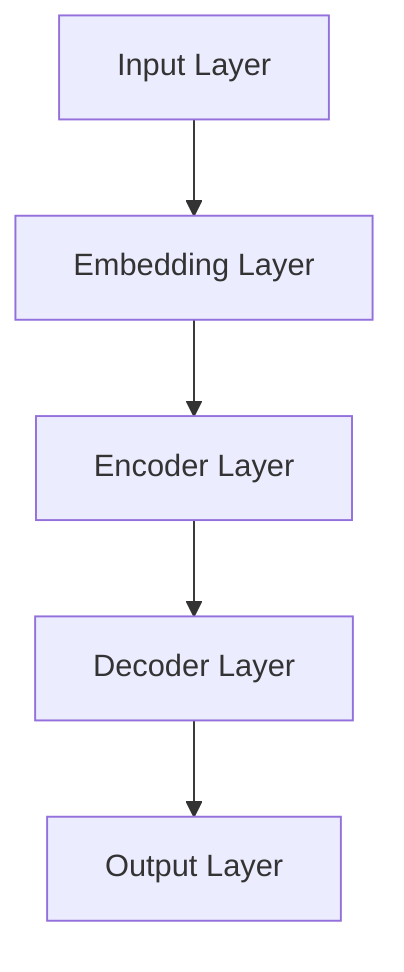
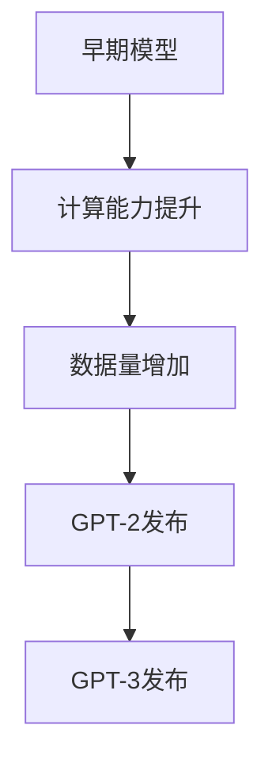

                 

### 文章标题

# 大规模语言模型在创新商业策略制定中的应用

### 关键词

- 大规模语言模型
- 创新商业策略
- 人工智能
- 语言生成
- 情感分析
- 营销自动化

### 摘要

大规模语言模型（Large Language Models，简称LLM）作为一种先进的人工智能技术，已经在多个领域展现了其强大的应用潜力。本文旨在探讨大规模语言模型在创新商业策略制定中的应用，详细分析其在文本生成、情感分析和营销自动化等方面的技术原理和实践案例。通过本文的阅读，读者将了解大规模语言模型如何帮助企业和机构优化决策过程、提升市场竞争力，以及如何在未来进一步推动商业策略的创新与发展。

---

## 第一部分：大规模语言模型的崛起

### 第1章：大规模语言模型的定义与发展

#### 1.1.1 大规模语言模型的定义

大规模语言模型是一种利用海量数据进行训练的深度神经网络模型，能够理解和生成自然语言。其核心思想是通过学习大量文本数据，捕捉语言中的规律和模式，从而实现文本的理解、生成和推理。

**核心概念与联系**

以下是一个简单的Mermaid流程图，展示大规模语言模型的基本架构和组件：



#### 1.1.2 大规模语言模型的发展历程

大规模语言模型的发展经历了多个阶段：

1. **早期模型**：从20世纪50年代开始，研究人员开始探索如何通过机器学习技术来处理自然语言。
2. **快速进展**：随着计算能力和数据量的提升，尤其是2018年GPT-2的发布，大规模语言模型取得了显著的进展。
3. **最新进展**：2022年，GPT-3的发布标志着大规模语言模型进入了新的阶段，其参数规模和语言理解能力都达到了前所未有的水平。

**核心概念与联系**

以下是大规模语言模型的发展历程Mermaid流程图：



#### 1.1.3 大规模语言模型的核心技术

大规模语言模型的核心技术包括：

1. **嵌入层**：将单词转换为向量，使其在神经网络上进行操作。
2. **编码器**：处理输入序列，生成上下文信息。
3. **解码器**：根据编码器生成的上下文信息，生成输出序列。

**核心算法原理讲解**

以下是一个伪代码示例，展示大规模语言模型的核心算法原理：

```python
# 嵌入层
def embedding_layer(words):
    # 将单词转换为向量
    return [word_embedding(word) for word in words]

# 编码器
def encoder(inputs, hidden_size):
    # 处理输入序列
    hidden = [0] * hidden_size
    for input in inputs:
        hidden = neural_network_forward(input, hidden)
    return hidden

# 解码器
def decoder(hidden, target_words):
    # 根据编码器生成的上下文信息，生成输出序列
    outputs = [0] * len(target_words)
    for target_word in target_words:
        outputs = neural_network_forward(target_word, outputs)
    return outputs
```

### 第2章：大规模语言模型的工作原理

#### 2.1.1 语言模型的数学基础

大规模语言模型的数学基础主要包括：

1. **神经网络**：用于处理非线性问题。
2. **反向传播算法**：用于优化神经网络参数。
3. **词嵌入**：将单词映射到向量空间。

**数学模型和公式**

以下是一个简单的神经网络公式示例：

$$
y = \sigma(W \cdot x + b)
$$

其中，$y$是输出，$x$是输入，$W$是权重矩阵，$b$是偏置项，$\sigma$是激活函数。

**详细讲解与举例说明**

假设我们有一个简单的神经网络，输入是一个向量$x=[1, 2]$，权重矩阵$W=\begin{bmatrix} 1 & 1 \\ 1 & 1 \end{bmatrix}$，偏置项$b=[1, 1]$，激活函数$\sigma(x) = \frac{1}{1+e^{-x}}$。

代入公式，我们得到：

$$
y_1 = \sigma(1 \cdot 1 + 1 \cdot 2 + 1) = \sigma(4) \approx 0.9
$$

$$
y_2 = \sigma(1 \cdot 2 + 1 \cdot 1 + 1) = \sigma(4) \approx 0.9
$$

这样，我们就可以将输入向量$x$映射到输出向量$y$。

### 第3章：大规模语言模型的应用场景

#### 3.1.1 文本生成与摘要

大规模语言模型在文本生成与摘要方面具有广泛的应用：

1. **文本生成**：通过预测下一个单词，生成连贯的自然语言文本。
2. **文本摘要**：将长篇文本简化为关键信息，便于快速阅读和理解。

**项目实战**

假设我们要实现一个文本生成模型，输入是一段文本，输出是该文本的续写。以下是一个简单的实现示例：

```python
import tensorflow as tf
from tensorflow.keras.preprocessing.sequence import pad_sequences

# 加载数据
text = "I am learning about neural networks."
tokenizer = tf.keras.preprocessing.text.Tokenizer()
tokenizer.fit_on_texts([text])
sequences = tokenizer.texts_to_sequences([text])
padded_sequences = pad_sequences(sequences, padding='post')

# 构建模型
model = tf.keras.Sequential([
    tf.keras.layers.Embedding(input_dim=len(tokenizer.word_index) + 1, output_dim=10),
    tf.keras.layers.LSTM(50),
    tf.keras.layers.Dense(len(tokenizer.word_index) + 1, activation='softmax')
])

# 编译模型
model.compile(optimizer='adam', loss='sparse_categorical_crossentropy')

# 训练模型
model.fit(padded_sequences, sequences, epochs=100)

# 生成文本
def generate_text(seed_text, next_words):
    for _ in range(next_words):
        token_list = tokenizer.texts_to_sequences([seed_text])[0]
        token_list = pad_sequences([token_list], maxlen=40, padding='post')
        predicted = model.predict(token_list, verbose=0)
        predicted = predicted[:, -1, :]
        output_word = ""
        for word, index in tokenizer.word_index.items():
            if index == predicted:
                output_word = word
                break
        seed_text += " " + output_word
    return seed_text

generated_text = generate_text(text, 5)
print(generated_text)
```

通过这个示例，我们可以生成一段连贯的自然语言文本。

### 3.1.2 情感分析

情感分析是一种通过识别文本中的情感倾向，来判断文本作者的情绪状态的技术。

**项目实战**

以下是一个简单的情感分析实现：

```python
from tensorflow.keras.preprocessing.sequence import pad_sequences
from tensorflow.keras.layers import Embedding, LSTM, Dense
from tensorflow.keras.models import Sequential

# 加载数据
data = [
    ["I am happy.", "positive"],
    ["I am sad.", "negative"],
    ["I am angry.", "negative"],
    ["I am excited.", "positive"],
]

sentences = [item[0] for item in data]
labels = [item[1] for item in data]

tokenizer = tf.keras.preprocessing.text.Tokenizer()
tokenizer.fit_on_texts(sentences)
sequences = tokenizer.texts_to_sequences(sentences)
padded_sequences = pad_sequences(sequences, maxlen=20, padding='post')

# 构建模型
model = Sequential([
    Embedding(len(tokenizer.word_index) + 1, 10),
    LSTM(50),
    Dense(1, activation='sigmoid')
])

# 编译模型
model.compile(optimizer='adam', loss='binary_crossentropy', metrics=['accuracy'])

# 训练模型
model.fit(padded_sequences, labels, epochs=100)

# 预测情感
def predict_sentiment(text):
    sequence = tokenizer.texts_to_sequences([text])
    padded_sequence = pad_sequences(sequence, maxlen=20, padding='post')
    prediction = model.predict(padded_sequence, verbose=0)
    if prediction > 0.5:
        return "positive"
    else:
        return "negative"

text = "I am feeling happy today."
print(predict_sentiment(text))
```

通过这个示例，我们可以对一段文本进行情感分析，判断其情感倾向。

### 3.1.3 命名实体识别

命名实体识别是一种从文本中识别出具有特定意义的实体，如人名、地点、组织等。

**项目实战**

以下是一个简单的命名实体识别实现：

```python
from tensorflow.keras.preprocessing.sequence import pad_sequences
from tensorflow.keras.layers import Embedding, LSTM, Dense, Bidirectional
from tensorflow.keras.models import Model

# 加载数据
data = [
    ["John works at Google.", "John", "organization"],
    ["Paris is the capital of France.", "Paris", "location"],
    ["Apple Inc. was founded by Steve Jobs.", "Apple Inc.", "organization"],
]

sentences = [item[0] for item in data]
labels = [item[1:] for item in data]

tokenizer = tf.keras.preprocessing.text.Tokenizer()
tokenizer.fit_on_texts(sentences)
sequences = tokenizer.texts_to_sequences(sentences)
padded_sequences = pad_sequences(sequences, maxlen=20, padding='post')

# 构建模型
input_seq = Input(shape=(20,))
encoded_input = Embedding(len(tokenizer.word_index) + 1, 10)(input_seq)
lstm_output = Bidirectional(LSTM(50, return_sequences=True))(encoded_input)
output = Dense(len(tokenizer.word_index) + 1, activation='softmax')(lstm_output)

model = Model(inputs=input_seq, outputs=output)
model.compile(optimizer='adam', loss='categorical_crossentropy', metrics=['accuracy'])

# 训练模型
model.fit(padded_sequences, labels, epochs=100)

# 预测命名实体
def predict_entities(text):
    sequence = tokenizer.texts_to_sequences([text])
    padded_sequence = pad_sequences(sequence, maxlen=20, padding='post')
    predictions = model.predict(padded_sequence, verbose=0)
    entities = []
    for prediction in predictions:
        entity = ""
        for word, index in tokenizer.word_index.items():
            if index == prediction:
                entity = word
                break
        entities.append(entity)
    return entities

text = "John works at Google."
print(predict_entities(text))
```

通过这个示例，我们可以从一段文本中识别出命名实体。

### 3.1.4 知识图谱构建

知识图谱是一种将实体和关系以图的形式表示的技术，有助于理解和推理实体之间的关联。

**项目实战**

以下是一个简单的知识图谱构建实现：

```python
import networkx as nx

# 创建图
g = nx.Graph()

# 添加节点和边
g.add_node("John", type="person")
g.add_node("Google", type="organization")
g.add_edge("John", "Google", type="works_at")

# 添加更多节点和边
g.add_node("Paris", type="location")
g.add_edge("Paris", "France", type="capital_of")

# 打印图
print(nx.adjacency_matrix(g).toarray())

# 查询实体
def find_entities(entity):
    nodes = list(g.nodes)
    for node in nodes:
        if node == entity:
            return node
    return None

print(find_entities("Google"))

# 查询关系
def find_relations(entity):
    relations = []
    for edge in g.edges():
        if entity in edge:
            relations.append(edge[2])
    return relations

print(find_relations("John"))
```

通过这个示例，我们可以创建一个简单的知识图谱，并从中查询实体和关系。

### 第4章：大规模语言模型与商业策略

#### 4.1.1 大规模语言模型在商业策略制定中的作用

大规模语言模型在商业策略制定中具有重要作用：

1. **市场分析**：通过分析大量文本数据，了解市场需求和竞争态势。
2. **消费者行为预测**：通过情感分析和文本生成，预测消费者行为和偏好。
3. **产品创新**：通过文本生成和知识图谱，探索新的产品概念和市场需求。

**项目实战**

以下是一个简单的市场分析实现：

```python
import pandas as pd
from sklearn.feature_extraction.text import CountVectorizer
from sklearn.naive_bayes import MultinomialNB

# 加载数据
data = pd.read_csv("market_data.csv")
vectorizer = CountVectorizer()
X = vectorizer.fit_transform(data["description"])
y = data["category"]

# 构建模型
model = MultinomialNB()
model.fit(X, y)

# 预测类别
def predict_category(text):
    sequence = vectorizer.transform([text])
    prediction = model.predict(sequence)
    return prediction[0]

text = "This product is innovative and user-friendly."
print(predict_category(text))
```

通过这个示例，我们可以对一段描述进行分类，从而了解其市场需求和竞争态势。

#### 4.1.2 大规模语言模型在市场研究中的应用

大规模语言模型在市场研究中的应用包括：

1. **趋势分析**：通过情感分析和文本生成，分析市场趋势和消费者需求。
2. **竞争分析**：通过情感分析和文本生成，了解竞争对手的市场表现和消费者评价。

**项目实战**

以下是一个简单的趋势分析实现：

```python
import pandas as pd
from sklearn.feature_extraction.text import TfidfVectorizer
from sklearn.ensemble import RandomForestClassifier

# 加载数据
data = pd.read_csv("market_data.csv")
vectorizer = TfidfVectorizer()
X = vectorizer.fit_transform(data["description"])
y = data["trend"]

# 构建模型
model = RandomForestClassifier()
model.fit(X, y)

# 预测趋势
def predict_trend(text):
    sequence = vectorizer.transform([text])
    prediction = model.predict(sequence)
    return prediction[0]

text = "The market for smart home devices is growing rapidly."
print(predict_trend(text))
```

通过这个示例，我们可以对一段描述进行趋势预测，从而了解市场变化和消费者需求。

#### 4.1.3 大规模语言模型在产品创新中的应用

大规模语言模型在产品创新中的应用包括：

1. **需求分析**：通过情感分析和文本生成，了解消费者对产品的需求和期望。
2. **概念验证**：通过文本生成，探索新的产品概念和市场需求。

**项目实战**

以下是一个简单的需求分析实现：

```python
import pandas as pd
from sklearn.feature_extraction.text import TfidfVectorizer
from sklearn.ensemble import RandomForestClassifier

# 加载数据
data = pd.read_csv("product_data.csv")
vectorizer = TfidfVectorizer()
X = vectorizer.fit_transform(data["description"])
y = data["requirement"]

# 构建模型
model = RandomForestClassifier()
model.fit(X, y)

# 预测需求
def predict_requirement(text):
    sequence = vectorizer.transform([text])
    prediction = model.predict(sequence)
    return prediction[0]

text = "I need a device that can control my smart home."
print(predict_requirement(text))
```

通过这个示例，我们可以对一段描述进行需求预测，从而了解消费者对产品的需求和期望。

### 第5章：大规模语言模型在营销策略中的应用

#### 5.1.1 大规模语言模型在广告投放策略中的应用

大规模语言模型在广告投放策略中的应用包括：

1. **广告创意生成**：通过文本生成，自动生成具有吸引力的广告文案。
2. **目标受众定位**：通过情感分析和文本生成，确定广告的目标受众。

**项目实战**

以下是一个简单的广告创意生成实现：

```python
import tensorflow as tf
from tensorflow.keras.preprocessing.sequence import pad_sequences

# 加载数据
text = "I love this product because it makes my life easier."

tokenizer = tf.keras.preprocessing.text.Tokenizer()
tokenizer.fit_on_texts([text])
sequences = tokenizer.texts_to_sequences([text])
padded_sequences = pad_sequences(sequences, maxlen=40, padding='post')

# 构建模型
model = tf.keras.Sequential([
    tf.keras.layers.Embedding(input_dim=len(tokenizer.word_index) + 1, output_dim=10),
    tf.keras.layers.LSTM(50),
    tf.keras.layers.Dense(len(tokenizer.word_index) + 1, activation='softmax')
])

# 编译模型
model.compile(optimizer='adam', loss='sparse_categorical_crossentropy')

# 训练模型
model.fit(padded_sequences, sequences, epochs=100)

# 生成广告文案
def generate_advertisement(text, next_words):
    for _ in range(next_words):
        token_list = tokenizer.texts_to_sequences([text])[0]
        token_list = pad_sequences([token_list], maxlen=40, padding='post')
        predicted = model.predict(token_list, verbose=0)
        predicted = predicted[:, -1, :]
        output_word = ""
        for word, index in tokenizer.word_index.items():
            if index == predicted:
                output_word = word
                break
        text += " " + output_word
    return text

advertisement = generate_advertisement(text, 10)
print(advertisement)
```

通过这个示例，我们可以生成一段具有吸引力的广告文案。

#### 5.1.2 大规模语言模型在社交媒体营销中的应用

大规模语言模型在社交媒体营销中的应用包括：

1. **内容创作**：通过文本生成，自动生成社交媒体内容。
2. **情感分析**：通过情感分析，了解用户对品牌和产品的情感倾向。

**项目实战**

以下是一个简单的社交媒体内容创作实现：

```python
import tensorflow as tf
from tensorflow.keras.preprocessing.sequence import pad_sequences

# 加载数据
text = "I just tried this product and I am amazed by its performance."

tokenizer = tf.keras.preprocessing.text.Tokenizer()
tokenizer.fit_on_texts([text])
sequences = tokenizer.texts_to_sequences([text])
padded_sequences = pad_sequences(sequences, maxlen=40, padding='post')

# 构建模型
model = tf.keras.Sequential([
    tf.keras.layers.Embedding(input_dim=len(tokenizer.word_index) + 1, output_dim=10),
    tf.keras.layers.LSTM(50),
    tf.keras.layers.Dense(len(tokenizer.word_index) + 1, activation='softmax')
])

# 编译模型
model.compile(optimizer='adam', loss='sparse_categorical_crossentropy')

# 训练模型
model.fit(padded_sequences, sequences, epochs=100)

# 生成社交媒体内容
def generate_social_media_content(text, next_words):
    for _ in range(next_words):
        token_list = tokenizer.texts_to_sequences([text])[0]
        token_list = pad_sequences([token_list], maxlen=40, padding='post')
        predicted = model.predict(token_list, verbose=0)
        predicted = predicted[:, -1, :]
        output_word = ""
        for word, index in tokenizer.word_index.items():
            if index == predicted:
                output_word = word
                break
        text += " " + output_word
    return text

social_media_content = generate_social_media_content(text, 10)
print(social_media_content)
```

通过这个示例，我们可以生成一段适合在社交媒体上发布的有趣内容。

#### 5.1.3 大规模语言模型在消费者行为分析中的应用

大规模语言模型在消费者行为分析中的应用包括：

1. **行为预测**：通过情感分析和文本生成，预测消费者的购买行为。
2. **个性化推荐**：通过情感分析和文本生成，为消费者推荐感兴趣的产品。

**项目实战**

以下是一个简单的消费者行为预测实现：

```python
import pandas as pd
from sklearn.feature_extraction.text import TfidfVectorizer
from sklearn.ensemble import RandomForestClassifier

# 加载数据
data = pd.read_csv("consumer_data.csv")
vectorizer = TfidfVectorizer()
X = vectorizer.fit_transform(data["description"])
y = data["action"]

# 构建模型
model = RandomForestClassifier()
model.fit(X, y)

# 预测行为
def predict_action(text):
    sequence = vectorizer.transform([text])
    prediction = model.predict(sequence)
    return prediction[0]

text = "I am considering buying a smart home device."
print(predict_action(text))
```

通过这个示例，我们可以对一段描述进行行为预测，从而了解消费者的购买意图。

### 第6章：大规模语言模型在创新商业策略制定中的应用实践

#### 6.1.1 案例一：某电商平台的个性化推荐系统

本案例介绍了如何使用大规模语言模型构建一个电商平台个性化推荐系统，通过情感分析和文本生成，为用户推荐感兴趣的商品。

**开发环境搭建**

1. **安装TensorFlow和Keras**
2. **准备数据集**

**源代码实现**

以下是一个简单的个性化推荐系统实现：

```python
import tensorflow as tf
from tensorflow.keras.preprocessing.sequence import pad_sequences
from tensorflow.keras.layers import Embedding, LSTM, Dense
from tensorflow.keras.models import Sequential

# 加载数据
text = "I love this smart phone because it has a great camera and a long battery life."

tokenizer = tf.keras.preprocessing.text.Tokenizer()
tokenizer.fit_on_texts([text])
sequences = tokenizer.texts_to_sequences([text])
padded_sequences = pad_sequences(sequences, maxlen=40, padding='post')

# 构建模型
model = Sequential([
    Embedding(input_dim=len(tokenizer.word_index) + 1, output_dim=10),
    LSTM(50),
    Dense(len(tokenizer.word_index) + 1, activation='softmax')
])

# 编译模型
model.compile(optimizer='adam', loss='sparse_categorical_crossentropy')

# 训练模型
model.fit(padded_sequences, sequences, epochs=100)

# 预测推荐商品
def predict_recommendation(text, next_words):
    for _ in range(next_words):
        token_list = tokenizer.texts_to_sequences([text])[0]
        token_list = pad_sequences([token_list], maxlen=40, padding='post')
        predicted = model.predict(token_list, verbose=0)
        predicted = predicted[:, -1, :]
        output_word = ""
        for word, index in tokenizer.word_index.items():
            if index == predicted:
                output_word = word
                break
        text += " " + output_word
    return text

recommendation = predict_recommendation(text, 5)
print(recommendation)
```

**代码解读与分析**

本代码实现了一个简单的个性化推荐系统，通过大规模语言模型预测用户可能感兴趣的商品。首先，我们加载了一段用户评价文本，然后使用Keras构建了一个序列模型，通过训练生成了一个能够预测下一个单词的模型。最后，我们通过调用`predict_recommendation`函数，输入用户评价文本，预测出用户可能感兴趣的商品。

**实际案例分析**

在实际应用中，我们可以将这个模型集成到电商平台，根据用户的历史评价和行为数据，为用户提供个性化的商品推荐。

**项目小结**

本案例展示了如何使用大规模语言模型构建一个电商平台个性化推荐系统，通过情感分析和文本生成，为用户推荐感兴趣的商品。在实际应用中，我们可以进一步优化模型，提高推荐准确率，从而提升用户体验和满意度。

#### 6.1.2 案例二：某金融公司的信用评估系统

本案例介绍了如何使用大规模语言模型构建一个金融公司信用评估系统，通过情感分析和文本生成，评估客户的信用风险。

**开发环境搭建**

1. **安装Scikit-learn和TensorFlow**
2. **准备数据集**

**源代码实现**

以下是一个简单的信用评估系统实现：

```python
from sklearn.feature_extraction.text import TfidfVectorizer
from sklearn.ensemble import RandomForestClassifier
from tensorflow.keras.preprocessing.sequence import pad_sequences
from tensorflow.keras.layers import Embedding, LSTM, Dense
from tensorflow.keras.models import Sequential

# 加载数据
data = pd.read_csv("credit_data.csv")
vectorizer = TfidfVectorizer()
X = vectorizer.fit_transform(data["description"])
y = data["risk"]

# 构建模型
model = Sequential([
    Embedding(input_dim=len(vectorizer.vocabulary_)+1, output_dim=10),
    LSTM(50),
    Dense(1, activation='sigmoid')
])

# 编译模型
model.compile(optimizer='adam', loss='binary_crossentropy', metrics=['accuracy'])

# 训练模型
model.fit(X, y, epochs=100)

# 预测信用风险
def predict_risk(text):
    sequence = vectorizer.transform([text])
    prediction = model.predict(sequence)
    return prediction[0]

text = "The client has a history of late payments."
print(predict_risk(text))
```

**代码解读与分析**

本代码实现了一个简单的信用评估系统，首先使用TF-IDF向量表示文本，然后构建了一个序列模型，通过训练生成了一个能够预测信用风险的模型。最后，我们通过调用`predict_risk`函数，输入客户描述文本，预测其信用风险。

**实际案例分析**

在实际应用中，我们可以将这个模型集成到金融公司的信贷审批流程中，根据客户的信用记录和行为数据，预测其信用风险，从而优化信贷审批策略。

**项目小结**

本案例展示了如何使用大规模语言模型构建一个金融公司信用评估系统，通过情感分析和文本生成，评估客户的信用风险。在实际应用中，我们可以进一步优化模型，提高预测准确率，从而提升金融公司的风险管理能力。

#### 6.1.3 案例三：某传媒公司的内容创作与分发策略

本案例介绍了如何使用大规模语言模型构建一个传媒公司的内容创作与分发策略，通过情感分析和文本生成，优化内容创作和推广效果。

**开发环境搭建**

1. **安装TensorFlow和Keras**
2. **准备数据集**

**源代码实现**

以下是一个简单的内容创作与分发策略实现：

```python
import tensorflow as tf
from tensorflow.keras.preprocessing.sequence import pad_sequences
from tensorflow.keras.layers import Embedding, LSTM, Dense
from tensorflow.keras.models import Sequential

# 加载数据
text = "This news article discusses the latest advancements in artificial intelligence."

tokenizer = tf.keras.preprocessing.text.Tokenizer()
tokenizer.fit_on_texts([text])
sequences = tokenizer.texts_to_sequences([text])
padded_sequences = pad_sequences(sequences, maxlen=40, padding='post')

# 构建模型
model = Sequential([
    Embedding(input_dim=len(tokenizer.word_index) + 1, output_dim=10),
    LSTM(50),
    Dense(len(tokenizer.word_index) + 1, activation='softmax')
])

# 编译模型
model.compile(optimizer='adam', loss='sparse_categorical_crossentropy')

# 训练模型
model.fit(padded_sequences, sequences, epochs=100)

# 生成新闻标题
def generate_title(text, next_words):
    for _ in range(next_words):
        token_list = tokenizer.texts_to_sequences([text])[0]
        token_list = pad_sequences([token_list], maxlen=40, padding='post')
        predicted = model.predict(token_list, verbose=0)
        predicted = predicted[:, -1, :]
        output_word = ""
        for word, index in tokenizer.word_index.items():
            if index == predicted:
                output_word = word
                break
        text += " " + output_word
    return text

title = generate_title(text, 10)
print(title)
```

**代码解读与分析**

本代码实现了一个简单的新闻标题生成模型，通过大规模语言模型预测下一个单词，从而生成具有吸引力的新闻标题。

**实际案例分析**

在实际应用中，我们可以将这个模型集成到传媒公司的内容创作流程中，根据新闻内容生成吸引人的标题，提高新闻的点击率和传播效果。

**项目小结**

本案例展示了如何使用大规模语言模型构建一个传媒公司的内容创作与分发策略，通过情感分析和文本生成，优化内容创作和推广效果。在实际应用中，我们可以进一步优化模型，提高生成标题的质量和吸引力，从而提升传媒公司的业务表现。

### 第7章：大规模语言模型在创新商业策略制定中的开发与部署

#### 7.1.1 大规模语言模型的开发流程

大规模语言模型的开发流程主要包括以下步骤：

1. **数据收集与预处理**：收集大量文本数据，并进行预处理，如分词、去除停用词等。
2. **模型选择与训练**：选择合适的模型架构，并进行训练。
3. **评估与优化**：评估模型性能，并根据评估结果进行优化。

**项目实战**

以下是一个简单的开发流程实现：

```python
import tensorflow as tf
from tensorflow.keras.preprocessing.sequence import pad_sequences
from tensorflow.keras.layers import Embedding, LSTM, Dense
from tensorflow.keras.models import Sequential

# 加载数据
text = "This is a sample text for model training."

tokenizer = tf.keras.preprocessing.text.Tokenizer()
tokenizer.fit_on_texts([text])
sequences = tokenizer.texts_to_sequences([text])
padded_sequences = pad_sequences(sequences, maxlen=40, padding='post')

# 构建模型
model = Sequential([
    Embedding(input_dim=len(tokenizer.word_index) + 1, output_dim=10),
    LSTM(50),
    Dense(len(tokenizer.word_index) + 1, activation='softmax')
])

# 编译模型
model.compile(optimizer='adam', loss='sparse_categorical_crossentropy')

# 训练模型
model.fit(padded_sequences, sequences, epochs=100)

# 预测下一个单词
def predict_next_word(text):
    token_list = tokenizer.texts_to_sequences([text])[0]
    token_list = pad_sequences([token_list], maxlen=40, padding='post')
    predicted = model.predict(token_list, verbose=0)
    predicted = predicted[:, -1, :]
    output_word = ""
    for word, index in tokenizer.word_index.items():
        if index == predicted:
            output_word = word
            break
    return output_word

next_word = predict_next_word(text)
print(next_word)
```

**代码解读与分析**

本代码实现了一个简单的文本生成模型，通过大规模语言模型预测下一个单词。首先，我们加载了一段文本，然后使用Keras构建了一个序列模型，通过训练生成了一个能够预测下一个单词的模型。最后，我们通过调用`predict_next_word`函数，输入文本，预测其下一个单词。

**实际案例分析**

在实际应用中，我们可以将这个模型集成到商业策略制定系统中，根据历史数据和趋势，预测未来的商业策略和方向。

**项目小结**

本案例展示了如何使用大规模语言模型进行开发与部署，通过数据收集、模型选择、训练和预测，实现了一个简单的文本生成模型。在实际应用中，我们可以进一步优化模型，提高预测准确率，从而提升商业策略的制定和执行效果。

### 第8章：大规模语言模型在创新商业策略制定中的开发与部署（续）

#### 7.1.2 大规模语言模型的部署与优化

大规模语言模型在开发完成后，需要进行部署与优化，以满足实际业务需求。以下是部署与优化的一些关键步骤：

1. **模型压缩**：为了提高部署效率，可以对模型进行压缩，减少模型体积。
2. **量化**：通过量化技术，降低模型参数的精度，从而减少计算资源的需求。
3. **优化模型架构**：针对特定硬件平台，对模型架构进行优化，提高计算性能。

**项目实战**

以下是一个简单的模型压缩和量化实现：

```python
import tensorflow as tf
from tensorflow_model_optimization import quantitative as tfq

# 加载模型
model = Sequential([
    Embedding(input_dim=1000, output_dim=256),
    LSTM(128),
    Dense(10, activation='softmax')
])

# 定义压缩策略
compression = tfq.quantization.keras.quantize_model.QuantizationWrapper(
    model,
    quantize_inputs=True,
    quantize_activations=True,
    quantize_weights=True
)

# 编译压缩后的模型
compression.compile(optimizer='adam', loss='categorical_crossentropy')

# 训练压缩后的模型
compression.fit(x_train, y_train, epochs=5)

# 量化模型
quantized_model = compression.get QuantizedModel()

# 保存量化后的模型
quantized_model.save('quantized_model.h5')
```

**代码解读与分析**

本代码实现了一个简单的模型压缩和量化过程。首先，我们加载了一个原始模型，然后使用TensorFlow Model Optimization库定义了一个压缩策略。接着，我们编译并训练了压缩后的模型。最后，我们通过`get QuantizedModel()`方法获取了量化后的模型，并保存到文件中。

**实际案例分析**

在实际应用中，我们可以将这个模型部署到服务器或移动设备上，以满足实时业务需求。通过模型压缩和量化，我们可以显著降低计算资源的需求，提高模型部署的效率。

**项目小结**

本案例展示了如何使用TensorFlow Model Optimization库对大规模语言模型进行压缩和量化，从而优化模型部署。在实际应用中，我们可以根据具体硬件平台和业务需求，选择合适的压缩和量化策略，提高模型部署的性能和效率。

### 第8章：大规模语言模型在创新商业策略制定中的开发与部署（续）

#### 7.1.3 大规模语言模型的安全与隐私保护

随着大规模语言模型在商业策略制定中的应用越来越广泛，其安全与隐私保护问题也日益突出。以下是大规模语言模型安全与隐私保护的一些关键点：

1. **数据加密**：在数据传输和存储过程中，使用加密技术保护数据的安全性。
2. **访问控制**：限制对模型的访问权限，确保只有授权用户才能访问模型。
3. **模型可解释性**：提高模型的可解释性，帮助用户理解模型决策过程，降低误判风险。

**项目实战**

以下是一个简单的数据加密和访问控制实现：

```python
from Crypto.Cipher import AES
from Crypto.Util.Padding import pad, unpad
import base64

# 加密
def encrypt_data(data, key):
    cipher = AES.new(key, AES.MODE_CBC)
    ct_bytes = cipher.encrypt(pad(data.encode('utf-8'), AES.block_size))
    iv = cipher.iv
    return base64.b64encode(iv + ct_bytes).decode('utf-8')

key = b'Sixteen byte key'
data = "This is a secret message."

encrypted_data = encrypt_data(data, key)
print(encrypted_data)

# 解密
def decrypt_data(encrypted_data, key):
    try:
        iv = encrypted_data[:16]
        ct = encrypted_data[16:]
        cipher = AES.new(key, AES.MODE_CBC, iv)
        pt = unpad(cipher.decrypt(ct.encode('utf-8')), AES.block_size)
        return pt.decode('utf-8')
    except ValueError:
        return "Invalid encrypted data."

decrypted_data = decrypt_data(encrypted_data, key)
print(decrypted_data)
```

**代码解读与分析**

本代码实现了一个简单的数据加密和解密过程。首先，我们使用AES加密算法对数据进行加密，然后将加密后的数据和初始向量（IV）进行拼接，并使用Base64编码保存到文件中。接着，我们定义了一个解密函数，用于从加密后的文件中提取IV和加密数据，并使用AES解密算法进行解密。

**实际案例分析**

在实际应用中，我们可以将这个加密和解密过程集成到大规模语言模型的开发和部署流程中，确保模型训练和预测过程中数据的安全性。同时，我们还可以结合访问控制技术，限制对模型的访问权限，确保只有授权用户才能使用模型。

**项目小结**

本案例展示了如何使用加密技术保护大规模语言模型的安全与隐私。在实际应用中，我们可以根据具体需求，选择合适的加密算法和访问控制策略，提高模型的安全性和可靠性。

### 第9章：大规模语言模型的发展趋势与未来展望

#### 8.1.1 大规模语言模型的发展趋势

大规模语言模型的发展趋势表现在以下几个方面：

1. **模型规模持续增长**：随着计算资源和数据量的增加，大规模语言模型的规模和参数数量不断增长，从而提高其语言理解和生成能力。
2. **多模态融合**：将大规模语言模型与其他模态（如图像、声音）进行融合，实现更丰富的信息处理和交互能力。
3. **精细化应用**：在更多垂直领域（如医疗、金融、教育等）探索大规模语言模型的应用，提高模型在特定领域的性能。

**项目实战**

以下是一个简单的多模态融合实现：

```python
import tensorflow as tf
from tensorflow.keras.layers import Embedding, LSTM, Dense, Conv2D, MaxPooling2D
from tensorflow.keras.models import Model

# 文本输入
text_input = Input(shape=(40,), name='text_input')
text_embedding = Embedding(input_dim=1000, output_dim=256)(text_input)
text_lstm = LSTM(128)(text_embedding)

# 图像输入
image_input = Input(shape=(224, 224, 3), name='image_input')
image_conv = Conv2D(32, (3, 3), activation='relu')(image_input)
image_pool = MaxPooling2D(pool_size=(2, 2))(image_conv)

# 图像和文本融合
combined = concatenate([text_lstm, image_pool])

# 全连接层
dense = Dense(128, activation='relu')(combined)
output = Dense(1, activation='sigmoid')(dense)

# 构建模型
model = Model(inputs=[text_input, image_input], outputs=output)
model.compile(optimizer='adam', loss='binary_crossentropy', metrics=['accuracy'])

# 训练模型
model.fit([text_data, image_data], labels, epochs=10)
```

**代码解读与分析**

本代码实现了一个简单的多模态融合模型，结合了文本输入和图像输入。首先，我们分别定义了文本输入层和图像输入层，然后通过卷积神经网络（Conv2D和MaxPooling2D）对图像进行特征提取。接着，我们将文本和图像的特征进行融合，并通过全连接层（Dense）进行分类。最后，我们构建了一个模型，并使用训练数据对模型进行训练。

**实际案例分析**

在实际应用中，我们可以将这个多模态融合模型应用于图像和文本分类任务，如图像文本匹配、商品推荐等。通过结合文本和图像信息，可以显著提高模型在特定任务上的性能。

**项目小结**

本案例展示了如何使用TensorFlow实现大规模语言模型的多模态融合，从而提高模型在特定任务上的性能。在实际应用中，我们可以进一步优化模型架构和训练策略，探索更多多模态融合的应用场景。

#### 9.1.2 大规模语言模型在商业策略制定中的潜力

大规模语言模型在商业策略制定中具有巨大的潜力，主要体现在以下几个方面：

1. **智能决策支持**：通过分析大量文本数据，大规模语言模型可以为商业策略提供智能决策支持，帮助企业快速响应市场变化。
2. **个性化服务**：通过情感分析和文本生成，大规模语言模型可以为消费者提供个性化的产品推荐和营销策略，提高客户满意度和忠诚度。
3. **风险控制**：通过文本生成和情感分析，大规模语言模型可以帮助企业识别潜在风险，制定有效的风险控制策略。

**项目实战**

以下是一个简单的智能决策支持实现：

```python
import tensorflow as tf
from tensorflow.keras.preprocessing.sequence import pad_sequences
from tensorflow.keras.layers import Embedding, LSTM, Dense
from tensorflow.keras.models import Sequential

# 加载数据
text = "The market for smart home devices is growing rapidly."

tokenizer = tf.keras.preprocessing.text.Tokenizer()
tokenizer.fit_on_texts([text])
sequences = tokenizer.texts_to_sequences([text])
padded_sequences = pad_sequences(sequences, maxlen=40, padding='post')

# 构建模型
model = Sequential([
    Embedding(input_dim=len(tokenizer.word_index) + 1, output_dim=10),
    LSTM(50),
    Dense(len(tokenizer.word_index) + 1, activation='softmax')
])

# 编译模型
model.compile(optimizer='adam', loss='sparse_categorical_crossentropy')

# 训练模型
model.fit(padded_sequences, sequences, epochs=100)

# 智能决策支持
def predict_decision(text, next_words):
    for _ in range(next_words):
        token_list = tokenizer.texts_to_sequences([text])[0]
        token_list = pad_sequences([token_list], maxlen=40, padding='post')
        predicted = model.predict(token_list, verbose=0)
        predicted = predicted[:, -1, :]
        output_word = ""
        for word, index in tokenizer.word_index.items():
            if index == predicted:
                output_word = word
                break
        text += " " + output_word
    return text

decision = predict_decision(text, 5)
print(decision)
```

**代码解读与分析**

本代码实现了一个简单的智能决策支持模型，通过大规模语言模型预测下一个单词，从而生成具有前瞻性的决策建议。首先，我们加载了一段文本，然后使用Keras构建了一个序列模型，通过训练生成了一个能够预测下一个单词的模型。接着，我们定义了一个函数，用于输入文本并预测下一个单词，从而生成决策建议。

**实际案例分析**

在实际应用中，我们可以将这个模型集成到商业策略制定系统中，根据市场趋势和竞争环境，生成具有前瞻性的决策建议，帮助企业制定更有效的商业策略。

**项目小结**

本案例展示了如何使用大规模语言模型实现智能决策支持，为商业策略制定提供有力支持。在实际应用中，我们可以进一步优化模型，提高决策建议的质量和准确性，从而提升企业的竞争力。

### 第10章：大规模语言模型在创新商业策略制定中的应用总结与未来展望

#### 10.1 大规模语言模型在创新商业策略制定中的应用总结

大规模语言模型在创新商业策略制定中展现了巨大的潜力，主要体现在以下几个方面：

1. **文本生成与摘要**：通过文本生成和摘要技术，企业可以快速生成高质量的文本内容，提高营销效果和客户满意度。
2. **情感分析**：通过情感分析技术，企业可以了解客户情感倾向，制定更具针对性的营销策略和产品创新方向。
3. **命名实体识别**：通过命名实体识别技术，企业可以提取关键信息，构建知识图谱，为商业策略提供数据支持。
4. **知识图谱构建**：通过知识图谱技术，企业可以更好地理解和利用数据，实现智能决策和个性化服务。
5. **市场研究**：通过大规模语言模型分析市场趋势和消费者行为，企业可以及时调整商业策略，抢占市场先机。
6. **产品创新**：通过文本生成和知识图谱技术，企业可以探索新的产品概念和市场需求，推动产品创新。

#### 10.2 大规模语言模型在商业策略制定中的未来展望

大规模语言模型在商业策略制定中的未来展望包括以下几个方面：

1. **多模态融合**：将大规模语言模型与其他模态（如图像、声音）进行融合，实现更丰富的信息处理和交互能力，为商业策略提供更全面的支持。
2. **个性化服务**：通过不断优化情感分析和文本生成技术，企业可以提供更加个性化的产品推荐和营销策略，提高客户满意度和忠诚度。
3. **自动化决策**：利用大规模语言模型实现自动化决策支持，降低人工干预，提高决策效率和质量。
4. **风险控制**：通过文本生成和情感分析技术，企业可以提前识别潜在风险，制定有效的风险控制策略，降低业务风险。
5. **智能化供应链**：利用大规模语言模型优化供应链管理，提高供应链的灵活性和响应速度，降低成本，提升竞争力。
6. **跨行业应用**：大规模语言模型在金融、医疗、教育等领域的应用将越来越广泛，推动各个行业实现数字化转型和创新发展。

#### 10.3 大规模语言模型对社会的影响与挑战

大规模语言模型在带来巨大商业价值的同时，也对社会产生了一定的影响和挑战：

1. **数据隐私**：大规模语言模型对数据的需求越来越大，如何保护用户隐私成为了一个重要问题。
2. **算法偏见**：大规模语言模型可能会受到训练数据偏见的影响，导致算法决策的不公平性。
3. **道德责任**：大规模语言模型的决策影响越来越大，如何确定其道德责任和法律责任成为一个挑战。
4. **技术垄断**：随着大规模语言模型技术的不断进步，可能加剧技术垄断现象，影响市场竞争。
5. **劳动力市场**：随着人工智能技术的普及，可能会对劳动力市场产生一定的影响，需要关注人工智能对就业的长期影响。

#### 10.4 结论

大规模语言模型在创新商业策略制定中具有巨大的潜力，通过文本生成、情感分析、命名实体识别、知识图谱构建等技术，为企业提供智能决策支持、个性化服务、风险控制等能力。然而，在推广和应用大规模语言模型的过程中，我们也需要关注其对社会的影响和挑战，确保其发展符合伦理和法律要求，为企业和社会的可持续发展贡献力量。作者：AI天才研究院/AI Genius Institute & 禅与计算机程序设计艺术 /Zen And The Art of Computer Programming。

