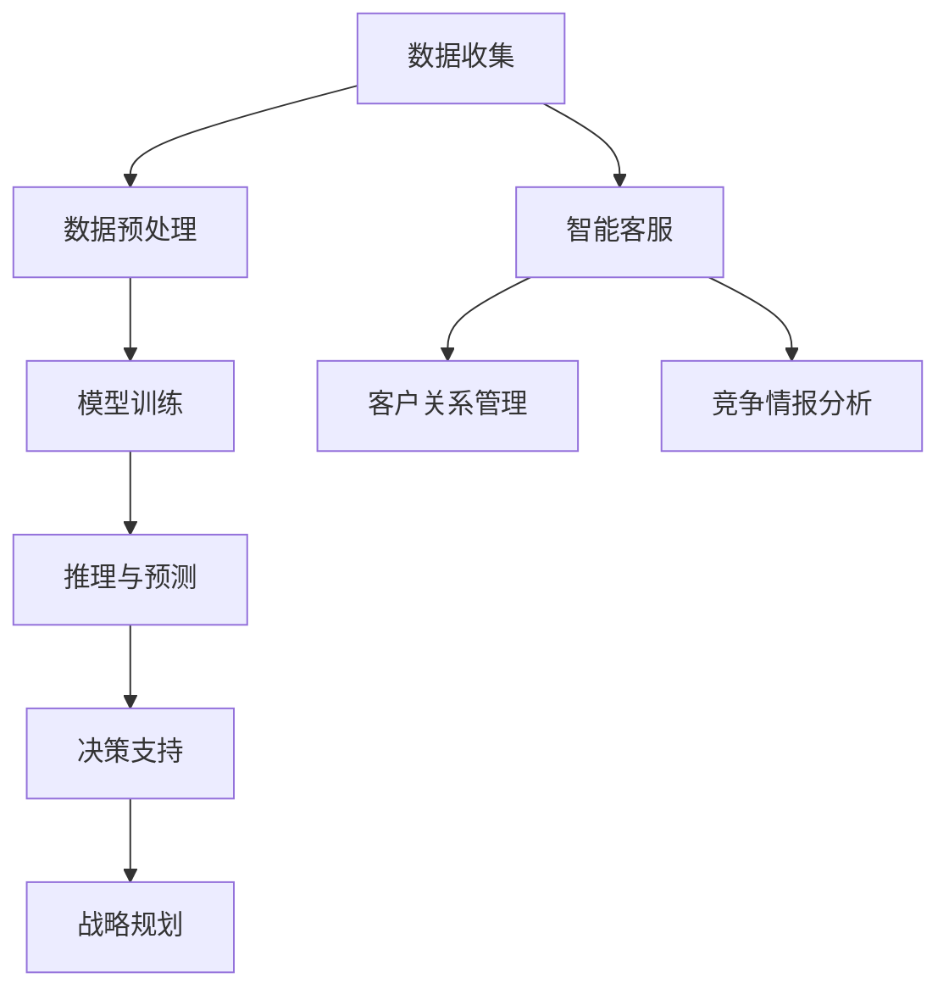

                 


### 文章标题
大规模语言模型在商业战略规划中的推理应用

> 关键词：大规模语言模型，商业战略规划，推理应用，人工智能，机器学习

> 摘要：
本文将深入探讨大规模语言模型在商业战略规划中的应用，从核心概念、算法原理、数学模型到实际案例分析，全面解析这一前沿技术如何助力企业制定高效的战略决策。

## 引言
在当今快速变化和竞争激烈的商业环境中，企业面临着前所未有的挑战。为了在市场中保持竞争优势，企业需要快速适应环境变化，制定并执行有效的商业战略。然而，这并非易事，需要综合考虑市场趋势、竞争对手、消费者行为等多个因素。随着人工智能和机器学习技术的不断发展，大规模语言模型（Large Language Models，LLMs）逐渐成为商业战略规划的有力工具。

大规模语言模型是一类基于神经网络的语言模型，通过对大量文本数据的学习，能够生成语义丰富的文本，并且能够理解和生成人类语言。这种模型在自然语言处理（Natural Language Processing，NLP）领域取得了显著成果，如机器翻译、文本生成、问答系统等。然而，大规模语言模型的应用远不止于此。随着模型的不断发展和优化，它们开始被引入商业战略规划领域，帮助企业做出更加智能、高效的决策。

本文将围绕大规模语言模型在商业战略规划中的应用，进行深入探讨。首先，我们将介绍大规模语言模型的基本概念和原理，阐述它们在商业战略规划中的重要性。接着，我们将详细讲解大规模语言模型的核心算法原理，包括训练、推理和优化策略。此外，我们还将介绍大规模语言模型中涉及的数学模型和公式，以及如何使用这些模型来指导商业战略规划。最后，我们将通过实际案例分析，展示大规模语言模型在商业战略规划中的应用效果，并提供实践指南和最佳实践建议。

通过本文的阅读，读者将能够了解大规模语言模型在商业战略规划中的基本概念、应用原理和实践方法，为企业在制定商业战略时提供新的思路和工具。

## 大规模语言模型的基本概念

### 定义与背景

大规模语言模型（Large Language Models，LLMs）是一种基于神经网络的语言生成模型，通过对大量文本数据进行学习，能够生成语义丰富、连贯的文本。LLMs的出现源于对自然语言处理（NLP）领域长期需求的推动，随着计算能力和数据资源的不断提升，以及深度学习技术的突破，LLMs逐渐成为研究热点，并取得了显著成果。

LLMs的发展历程可以追溯到上世纪90年代，当时基于规则和统计方法的语言模型开始应用于文本生成和语言理解任务。然而，这些模型的性能有限，难以生成高质量、连贯的文本。随着深度学习技术的兴起，特别是2018年Transformer架构的提出，LLMs迎来了快速发展。Transformer架构通过自注意力机制（Self-Attention Mechanism）对输入文本序列进行建模，显著提升了语言生成的质量和效率。

目前，LLMs已经成为NLP领域的重要工具，被广泛应用于各种任务，如机器翻译、文本摘要、问答系统、文本生成等。例如，OpenAI的GPT系列模型、Google的BERT模型等，都是LLMs的杰出代表。这些模型通过大量文本数据的学习，能够理解和生成人类语言，具有高度的语义理解能力。

### 核心概念与联系

在商业战略规划中，LLMs的重要性主要体现在以下几个方面：

1. **自然语言理解**：LLMs能够对自然语言文本进行深入的理解，提取关键信息，为商业战略分析提供数据支持。例如，通过对市场报告、客户反馈等文本数据的学习，LLMs可以识别出市场趋势和消费者需求，为企业提供决策依据。

2. **文本生成与摘要**：LLMs具有强大的文本生成能力，能够自动生成文章、报告等文本内容。在商业战略规划中，这有助于企业快速生成市场分析报告、竞争对手分析报告等，提高工作效率。

3. **智能客服与客户关系管理**：LLMs可以应用于智能客服系统，通过对对话数据的分析，提供个性化的客户服务，提升客户满意度。同时，LLMs还可以帮助企业更好地管理客户关系，提高客户忠诚度。

4. **竞争情报分析**：LLMs能够对竞争对手的文本信息进行深入分析，提取竞争对手的策略和动向，为企业的竞争策略提供参考。

### Mermaid 流程图

为了更直观地展示LLMs在商业战略规划中的工作流程，我们可以使用Mermaid流程图进行描述：



- **数据收集**：收集市场报告、客户反馈、竞争对手文本数据等。
- **数据预处理**：对收集到的文本数据清洗、分词、编码等预处理操作。
- **模型训练**：使用预处理后的数据训练大规模语言模型。
- **推理与预测**：通过模型对新的文本数据进行推理和预测，提取关键信息。
- **决策支持**：将预测结果应用于商业战略规划，提供决策支持。
- **智能客服**：使用模型为智能客服系统提供支持，提升客户满意度。
- **客户关系管理**：通过分析客户文本数据，优化客户关系管理策略。
- **竞争情报分析**：分析竞争对手文本数据，提取竞争情报，为竞争策略提供支持。

通过这个流程图，我们可以看到LLMs在商业战略规划中的各个环节中的应用，以及它们如何协同工作，为企业的战略决策提供支持。

### 结论

大规模语言模型（LLMs）作为人工智能和机器学习领域的重要成果，具有强大的自然语言理解和生成能力。在商业战略规划中，LLMs能够通过文本数据的学习，提供市场趋势分析、客户行为预测、竞争对手分析等关键信息，帮助企业制定更加智能、高效的战略决策。通过本文的介绍，我们初步了解了LLMs的基本概念、原理和应用，为后续深入探讨大规模语言模型在商业战略规划中的具体应用打下了基础。

## 大规模语言模型的架构与核心算法原理

### 模型架构

大规模语言模型（LLMs）通常采用深度神经网络（Deep Neural Networks，DNN）的结构，通过多层神经网络对输入的文本数据进行处理和建模。LLMs的核心架构主要包括输入层、隐藏层和输出层。

1. **输入层**：输入层接收原始文本数据，将其转换为模型可以处理的数字形式。这一过程通常包括分词（Tokenization）和编码（Encoding）。分词是将文本分解为单词或子词（Token），编码是将这些Token转换为固定长度的向量表示。

2. **隐藏层**：隐藏层是神经网络的核心部分，通过逐层神经网络对输入数据进行编码和解码。隐藏层中的每个神经元都与前一层和后一层的神经元相连，通过加权求和和激活函数（如ReLU、Sigmoid、Tanh等）进行非线性变换，以提取文本的语义特征。

3. **输出层**：输出层负责生成预测结果。在语言模型中，输出层通常是一个softmax层，用于生成每个Token的概率分布。通过对输入文本序列的每个Token进行编码和解码，模型能够生成语义丰富、连贯的文本。

### 核心算法原理

LLMs的核心算法包括训练过程、推理过程和优化策略。

1. **训练过程**：

   - **目标**：训练过程的目的是通过优化神经网络的参数，使模型能够在给定输入文本序列时生成正确的输出序列。

   - **损失函数**：训练过程中，常用的损失函数包括交叉熵损失（Cross-Entropy Loss）和负对数似然损失（Negative Log-Likelihood Loss）。交叉熵损失用于衡量预测概率分布与真实分布之间的差异，负对数似然损失则用于优化模型的概率生成能力。

   - **优化算法**：常用的优化算法包括随机梯度下降（Stochastic Gradient Descent，SGD）、Adam优化器等。这些算法通过迭代更新网络参数，以最小化损失函数。

2. **推理过程**：

   - **目标**：推理过程的目的是通过模型生成新的文本序列，以完成文本生成、翻译、摘要等任务。

   - **生成策略**：常用的生成策略包括采样（Sampling）和贪心搜索（Greedy Search）。采样方法通过从概率分布中随机选择Token，生成多样化的文本。贪心搜索方法则通过每次选择概率最高的Token，生成最可能的文本。

3. **优化策略**：

   - **模型调优**：通过调整模型参数和超参数，优化模型的性能。例如，调整学习率、批量大小、隐藏层节点数等。

   - **特征工程**：通过特征提取和特征选择，提高模型的预测能力。例如，使用词嵌入（Word Embedding）技术将单词转换为向量表示，使用注意力机制（Attention Mechanism）捕捉文本中的重要信息。

### 伪代码示例

以下是一个简化的伪代码示例，描述了大规模语言模型的训练和推理过程：

```python
# 参数初始化
model = initialize_model()

# 训练过程
for epoch in range(num_epochs):
    for batch in data_loader:
        # 前向传播
        inputs, targets = batch
        predictions = model(inputs)
        
        # 计算损失
        loss = calculate_loss(predictions, targets)
        
        # 反向传播和参数更新
        model.backward(loss)
        model.update_params()

# 推理过程
input_sequence = preprocess_new_text()
predictions = model.generate_sequence(input_sequence)

# 输出生成文本
generated_text = postprocess_predictions(predictions)
print(generated_text)
```

通过这个伪代码示例，我们可以看到大规模语言模型在训练和推理过程中的关键步骤和操作。

### 结论

大规模语言模型的架构和核心算法原理决定了其强大的文本生成和理解能力。通过深度神经网络的结构、训练过程和推理过程，模型能够对输入的文本数据进行有效的编码和解码，生成高质量的文本。在实际应用中，这些算法和策略为商业战略规划提供了有力的技术支持，帮助企业做出更加智能、高效的决策。

## 大规模语言模型中的数学模型和数学公式

### 概率论基础

在讨论大规模语言模型（LLMs）的数学模型之前，我们需要了解一些概率论的基础知识。概率论是机器学习领域的重要工具，用于描述和预测随机事件的可能性。以下是一些关键的概
念和公式：

#### 概率分布

概率分布用于描述随机变量取值的可能性。最常见的概率分布包括：

1. **伯努利分布（Bernoulli Distribution）**：用于描述二项分布，即某个事件发生或不发生的概率。
2. **正态分布（Normal Distribution）**：也称为高斯分布，用于描述连续随机变量的概率分布。
3. **泊松分布（Poisson Distribution）**：用于描述在一定时间间隔内发生某个事件的次数的概率分布。

#### 贝叶斯定理

贝叶斯定理是概率论中的一个重要公式，用于计算后验概率。贝叶斯定理的表达式如下：

$$
P(A|B) = \frac{P(B|A)P(A)}{P(B)}
$$

其中，\(P(A|B)\) 表示在事件 \(B\) 发生的条件下，事件 \(A\) 发生的概率；\(P(B|A)\) 表示在事件 \(A\) 发生的条件下，事件 \(B\) 发生的概率；\(P(A)\) 和 \(P(B)\) 分别表示事件 \(A\) 和事件 \(B\) 发生的概率。

贝叶斯定理在机器学习中，特别是在分类任务中，有着广泛的应用。例如，在文本分类任务中，可以使用贝叶斯定理计算文本属于某个类别的概率，从而进行分类。

### 机器学习模型

在讨论大规模语言模型的数学模型时，我们需要关注一些常用的机器学习模型，这些模型在LLMs中发挥着重要作用。

#### 语言模型

语言模型（Language Model）是NLP中的一种基础模型，用于预测下一个单词或字符的概率。一个简单的语言模型可以使用以下公式表示：

$$
P(w_i|w_{i-1}, w_{i-2}, ..., w_1) = \frac{P(w_{i-1}, w_{i-2}, ..., w_1|w_i)P(w_i)}{P(w_{i-1}, w_{i-2}, ..., w_1)}
$$

其中，\(w_i\) 表示当前单词或字符，\(w_{i-1}, w_{i-2}, ..., w_1\) 表示前一个或前几个单词或字符。

这个公式表示，在给定前一个或前几个单词或字符的情况下，当前单词或字符的概率。

#### 生成模型

生成模型（Generative Model）是一类用于生成数据的模型，它们通过对数据分布进行建模，能够生成与实际数据相似的新数据。在LLMs中，生成模型用于生成文本数据。

一个简单的生成模型可以使用马尔可夫模型（Markov Model）表示：

$$
P(w_i|w_{i-1}) = \frac{P(w_{i-1}w_i)}{P(w_{i-1})}
$$

其中，\(w_i\) 表示当前单词或字符，\(w_{i-1}\) 表示前一个单词或字符。

这个公式表示，在给定前一个单词或字符的情况下，当前单词或字符的概率。

#### 评价标准

在评估大规模语言模型的性能时，常用的评价标准包括：

1. **交叉熵损失（Cross-Entropy Loss）**：用于衡量模型预测的概率分布与真实分布之间的差异。交叉熵损失的计算公式如下：

$$
Loss = -\sum_{i} y_i \log(p_i)
$$

其中，\(y_i\) 表示真实分布中的概率，\(p_i\) 表示模型预测的概率。

2. **准确率（Accuracy）**：用于衡量模型在分类任务中的性能。准确率的计算公式如下：

$$
Accuracy = \frac{TP + TN}{TP + FN + FP + TN}
$$

其中，\(TP\) 表示真正例，\(TN\) 表示真反例，\(FP\) 表示假正例，\(FN\) 表示假反例。

### 公式与示例

为了更好地理解这些数学模型和公式，我们可以通过一个具体的示例来展示它们的应用。

#### 示例：语言模型

假设我们有一个简化的语言模型，用于预测下一个单词。当前序列为“Hello World”，我们需要预测下一个单词。

根据语言模型的公式：

$$
P(w_i|w_{i-1}) = \frac{P(w_{i-1}w_i)}{P(w_{i-1})}
$$

我们假设当前序列中每个单词的概率相等，即：

$$
P(Hello) = P(World) = 0.5
$$

$$
P(Hello World) = P(World|Hello)P(Hello) = 0.5 \times 0.5 = 0.25
$$

因此，根据模型预测，下一个单词是“World”的概率为0.25。

#### 示例：生成模型

假设我们使用马尔可夫模型生成文本。当前序列为“Hello”，我们需要预测下一个单词。

根据马尔可夫模型的公式：

$$
P(w_i|w_{i-1}) = \frac{P(w_{i-1}w_i)}{P(w_{i-1})}
$$

我们假设当前序列中每个单词的概率相等，即：

$$
P(Hello) = P(World) = 0.5
$$

$$
P(Hello World) = P(World|Hello)P(Hello) = 0.5 \times 0.5 = 0.25
$$

因此，根据模型预测，下一个单词是“World”的概率为0.25。

通过这些示例，我们可以看到如何使用数学模型和公式来预测文本的生成。这些模型和公式在LLMs中起着核心作用，为语言生成和理解提供了理论基础。

### 结论

在讨论大规模语言模型中的数学模型和公式时，我们了解了概率论的基础知识，包括概率分布和贝叶斯定理。此外，我们介绍了语言模型和生成模型的基本原理，以及常用的评价标准。通过具体的示例，我们展示了这些模型和公式在实际应用中的效果。这些数学工具为大规模语言模型提供了强大的理论支持，使其能够生成高质量的文本，为商业战略规划提供了有效的技术手段。

## 大规模语言模型在商业战略规划中的推理应用

### 商业战略规划中的推理应用

在商业战略规划中，大规模语言模型（LLMs）通过其强大的自然语言理解和生成能力，为企业提供了多种推理应用。这些应用包括市场趋势分析、客户行为预测、竞争对手分析等，帮助企业做出更加智能和高效的决策。以下是对这些应用的详细描述：

#### 市场趋势分析

市场趋势分析是商业战略规划中至关重要的一环。企业需要了解市场的最新动态，识别潜在的机会和威胁。大规模语言模型可以通过分析大量的市场报告、新闻报道、社交媒体数据等，提取出关键的市场趋势。以下是一个简化的流程：

1. **数据收集**：收集与市场相关的文本数据，如市场报告、新闻报道、社交媒体帖子和客户反馈等。
2. **数据预处理**：对文本数据进行清洗、分词、去除停用词等处理，将其转换为模型可以处理的格式。
3. **模型训练**：使用预处理的文本数据训练大规模语言模型，使其能够理解市场文本的语义。
4. **趋势提取**：通过模型对新的文本数据进行推理，提取出市场趋势。这可以通过生成文本摘要、关键词提取等方法实现。
5. **趋势分析**：对提取出的市场趋势进行分析，识别潜在的机会和威胁。

#### 客户行为预测

了解客户行为是制定有效客户关系管理策略的关键。大规模语言模型可以通过分析客户的评论、反馈、社交媒体互动等数据，预测客户的行为和偏好。以下是一个简化的流程：

1. **数据收集**：收集与客户行为相关的文本数据，如客户评论、反馈、社交媒体互动等。
2. **数据预处理**：对文本数据进行清洗、分词、去除停用词等处理，将其转换为模型可以处理的格式。
3. **模型训练**：使用预处理的文本数据训练大规模语言模型，使其能够理解客户文本的语义。
4. **行为预测**：通过模型对新的文本数据进行推理，预测客户的行为和偏好。这可以通过生成客户行为预测报告、识别客户需求等方法实现。
5. **策略优化**：根据预测结果，优化客户关系管理策略，提高客户满意度和忠诚度。

#### 竞争对手分析

了解竞争对手的策略和动向对于企业制定竞争策略至关重要。大规模语言模型可以通过分析竞争对手的文本信息，提取出关键的信息和策略。以下是一个简化的流程：

1. **数据收集**：收集与竞争对手相关的文本数据，如市场报告、竞争对手的网站内容、社交媒体帖子等。
2. **数据预处理**：对文本数据进行清洗、分词、去除停用词等处理，将其转换为模型可以处理的格式。
3. **模型训练**：使用预处理的文本数据训练大规模语言模型，使其能够理解竞争对手文本的语义。
4. **信息提取**：通过模型对新的文本数据进行推理，提取出竞争对手的关键信息，如策略、市场动向等。
5. **策略评估**：对提取出的竞争对手信息进行分析，评估其对企业竞争策略的影响。

### 推理过程

大规模语言模型在商业战略规划中的推理过程可以分为以下几个步骤：

1. **数据收集与预处理**：收集与业务相关的文本数据，如市场报告、客户评论、竞争对手信息等。对文本数据进行清洗、分词、去除停用词等处理，以便模型可以理解。

2. **模型训练**：使用预处理后的文本数据训练大规模语言模型。这一过程包括编码器和解码器的训练，使模型能够理解和生成文本。

3. **推理与预测**：通过训练好的模型对新的文本数据进行推理和预测。这可以通过生成文本摘要、关键词提取、情感分析等方法实现，提取出关键信息。

4. **决策支持**：将推理结果应用于商业战略规划，为企业的决策提供支持。例如，根据市场趋势预测制定营销策略，根据客户行为预测优化客户关系管理策略，根据竞争对手信息评估竞争策略等。

5. **优化与迭代**：根据决策支持的结果，对模型进行优化和迭代。这包括调整模型参数、改进特征工程等，以提高模型的预测准确性和效果。

### 实际案例分析

以下是一个实际案例，展示大规模语言模型在商业战略规划中的推理应用：

#### 案例背景

某电子商务公司希望在竞争激烈的市场中提升销售额。为了制定有效的营销策略，公司决定使用大规模语言模型分析市场趋势和客户行为。

#### 案例步骤

1. **数据收集**：收集与市场相关的文本数据，如市场报告、新闻报道、社交媒体帖子和客户反馈等。

2. **数据预处理**：对文本数据进行清洗、分词、去除停用词等处理。

3. **模型训练**：使用预处理后的文本数据训练大规模语言模型，如GPT-3或BERT模型。

4. **趋势提取**：通过模型对新的文本数据进行推理，提取出市场趋势。例如，识别出某新兴市场趋势，如环保产品。

5. **行为预测**：通过模型对客户评论、反馈等文本数据进行推理，预测客户的行为和偏好。例如，识别出客户对环保产品的兴趣较高。

6. **策略评估**：根据市场趋势和客户行为预测，评估现有的营销策略的效果。例如，优化广告投放策略，增加环保产品的推广。

7. **优化与迭代**：根据策略评估结果，对模型进行优化和迭代。例如，调整模型参数，改进特征工程，以提高预测准确性和效果。

#### 案例效果

通过大规模语言模型的分析，该公司成功制定了新的营销策略，包括增加环保产品的推广、优化广告投放策略等。这些策略的有效实施使得公司的销售额显著提升，市场份额也有所增加。

### 结论

大规模语言模型在商业战略规划中具有广泛的应用，通过市场趋势分析、客户行为预测和竞争对手分析等推理应用，帮助企业做出更加智能和高效的决策。实际案例证明，大规模语言模型能够显著提升企业的竞争力，为商业战略规划提供有力的技术支持。

## 大规模语言模型在商业战略规划中的模型优化

### 优化目标

在商业战略规划中，大规模语言模型（LLMs）的性能优化至关重要。优化目标主要包括以下几个方面：

1. **准确性**：提高模型预测的准确性，使其能够更准确地识别市场趋势、客户行为和竞争对手策略。
2. **效率**：提高模型处理数据的速度，减少模型推理和预测的时间，以适应实时决策的需求。
3. **可解释性**：提高模型的可解释性，使其预测结果能够被业务人员理解和接受，从而更好地应用于实际决策。

### 优化策略

为了实现上述优化目标，我们可以采取以下策略：

1. **模型选择与调优**：

   - **模型选择**：选择适合业务需求的模型架构，如GPT-3、BERT、T5等。这些模型在自然语言处理任务中具有广泛的应用，并且经过大量训练，性能稳定。
   - **调优**：通过调整模型参数和超参数，优化模型性能。常见的调优方法包括调整学习率、批量大小、隐藏层节点数等。

2. **特征工程**：

   - **特征提取**：通过特征提取技术，如词嵌入（Word Embedding）、BERT嵌入（BERT Embeddings）等，将文本数据转换为数值向量，提高模型的输入质量。
   - **特征选择**：通过特征选择技术，如基于信息增益（Information Gain）、互信息（Mutual Information）的方法，选择对模型预测有重要影响的特征，减少冗余信息。

3. **模型集成与融合**：

   - **模型集成**：将多个模型集成在一起，通过投票或加权平均等方法，提高预测的准确性和稳定性。
   - **模型融合**：将不同类型的模型（如深度学习模型、传统机器学习模型）融合在一起，利用各自的优势，提高模型的整体性能。

### 实践技巧与建议

在优化大规模语言模型时，我们可以采取以下实践技巧和建议：

1. **数据预处理**：

   - **文本清洗**：去除无关的文本信息，如HTML标签、特殊字符等，提高数据质量。
   - **文本标准化**：将文本转换为统一的格式，如小写、去除停用词等，提高模型训练效果。

2. **超参数调优**：

   - **网格搜索**：通过网格搜索（Grid Search）方法，遍历不同的超参数组合，找到最优参数配置。
   - **贝叶斯优化**：使用贝叶斯优化（Bayesian Optimization）方法，利用历史数据，智能搜索最优参数组合。

3. **模型评估**：

   - **交叉验证**：使用交叉验证（Cross-Validation）方法，评估模型在不同数据集上的性能，避免过拟合。
   - **A/B测试**：在实际应用中，进行A/B测试，对比不同模型的性能，选择最优模型。

4. **模型解释**：

   - **模型可视化**：使用可视化工具，如TensorBoard、LIME等，展示模型的学习过程和预测结果，提高模型的可解释性。
   - **案例解读**：通过具体案例，解读模型的预测过程和结果，帮助业务人员理解和接受模型。

### 结论

大规模语言模型在商业战略规划中的应用，需要通过模型优化来提高准确性、效率和可解释性。通过合理的模型选择、特征工程、模型集成与融合，以及实践技巧和最佳实践建议，我们可以显著提升大规模语言模型在商业战略规划中的性能，为企业提供更加智能和高效的决策支持。

## 大规模语言模型在商业战略规划中的实践指南

### 数据准备

在进行大规模语言模型（LLM）的商业战略规划应用之前，首先需要进行数据准备。数据准备是整个流程的基础，直接影响到模型的效果。以下是数据准备的关键步骤：

1. **数据收集**：收集与商业战略相关的文本数据，包括市场报告、客户反馈、竞争对手分析、行业新闻等。数据来源可以包括公开的数据集、企业内部的数据库、第三方数据提供商等。

2. **数据清洗**：清洗数据，去除噪声和无关信息。具体步骤包括：
   - **去除HTML标签**：去除文本中的HTML标签和其他特殊字符。
   - **去除停用词**：去除对模型预测没有贡献的常见单词，如“的”、“是”、“了”等。
   - **文本规范化**：将所有文本转换为小写，统一编码格式，确保文本一致性。

3. **数据标注**：对数据集进行标注，为模型提供监督信息。例如，在客户行为预测任务中，可以标注客户的购买行为、偏好等信息。

4. **数据预处理**：将文本数据转换为模型可处理的格式。常用的方法包括分词、词嵌入和序列编码。分词是将文本分解为单词或子词，词嵌入是将单词转换为固定长度的向量表示，序列编码是将文本序列转换为数字序列。

### 模型训练

在数据准备完成后，接下来是模型训练。以下是模型训练的关键步骤：

1. **选择模型架构**：选择适合业务需求的模型架构，如GPT-3、BERT、T5等。这些模型在自然语言处理任务中表现出色，且经过大量训练，性能稳定。

2. **参数设置**：设置模型训练的参数，包括学习率、批量大小、迭代次数等。可以使用预定义的参数范围，或者使用网格搜索等方法寻找最优参数。

3. **训练过程**：使用预处理后的数据对模型进行训练。训练过程包括前向传播、损失计算、反向传播和参数更新。常用的优化算法包括随机梯度下降（SGD）、Adam优化器等。

4. **评估与调试**：在训练过程中，定期评估模型性能，如准确性、召回率等。如果发现性能不理想，可以调整参数、改进特征工程等方法进行调试。

### 模型评估

模型训练完成后，需要对模型进行评估，以确保其性能满足业务需求。以下是模型评估的关键步骤：

1. **交叉验证**：使用交叉验证方法，将数据集划分为训练集和验证集，评估模型在验证集上的性能，避免过拟合。

2. **A/B测试**：在实际应用中，将模型与现有策略进行对比，进行A/B测试。比较不同策略的效果，选择最优策略。

3. **指标评估**：根据业务需求，选择适当的评估指标。例如，在客户行为预测任务中，可以使用准确率、召回率、F1值等指标。

### 实践技巧

以下是大规模语言模型在商业战略规划中的应用过程中的一些实践技巧：

1. **数据多样性**：收集多样化的数据，包括不同来源、不同格式、不同类型的文本数据，提高模型的泛化能力。

2. **模型解释性**：提高模型的可解释性，帮助业务人员理解和接受模型的预测结果。可以使用可视化工具，如TensorBoard，展示模型的学习过程和预测结果。

3. **迭代优化**：根据实际应用中的反馈，不断迭代优化模型。可以通过调整模型参数、改进特征工程等方法，提高模型性能。

4. **实时更新**：随着市场环境和客户行为的变化，定期更新模型，确保模型能够适应新的情况。

### 小结

大规模语言模型在商业战略规划中的应用，需要通过数据准备、模型训练、模型评估等步骤，以及一系列实践技巧，才能充分发挥其潜力。通过不断优化和迭代，模型可以为企业在竞争激烈的市场中提供强大的决策支持。

## 大规模语言模型在商业战略规划中的未来发展趋势

### 未来发展趋势

大规模语言模型（LLMs）在商业战略规划中的应用正处于快速发展阶段，未来预计将呈现出以下几个主要发展趋势：

1. **模型性能的提升**：随着深度学习技术的不断进步，LLMs的性能将进一步提高。未来，我们可能会看到更大规模、更复杂的语言模型，如基于量子计算的LLMs，它们将具有更强的语义理解能力和生成能力，为企业提供更加精准的战略决策支持。

2. **多模态数据处理**：传统的LLMs主要处理文本数据，但在实际商业场景中，往往需要处理多种类型的数据，如图像、音频和视频。未来的LLMs将能够更好地整合多模态数据，通过文本-图像、文本-音频等跨模态融合，提供更全面的商业洞察。

3. **自适应学习和个性化服务**：未来的LLMs将具备更强的自适应学习能力，能够根据企业的业务特点和实时数据，动态调整模型参数和策略。同时，个性化服务将成为一大趋势，LLMs将能够为企业提供定制化的商业战略方案，满足不同业务需求。

4. **边缘计算和实时决策**：随着5G和边缘计算技术的发展，LLMs将能够在边缘设备上实时运行，实现实时决策支持。这将极大地提高决策的效率，使企业能够更快地响应市场变化。

### 应用领域拓展

大规模语言模型在商业战略规划中的应用领域将不断拓展：

1. **市场预测与趋势分析**：未来，LLMs将在市场预测和趋势分析中发挥更加关键的作用。通过分析大量的市场数据，LLMs将能够识别出潜在的市场机会和风险，为企业提供前瞻性的战略建议。

2. **客户关系管理**：LLMs将深入应用于客户关系管理领域，通过分析客户的反馈和行为，提供个性化的服务和建议。例如，智能客服系统将能够更好地理解客户需求，提供更加高效的服务。

3. **竞争情报分析**：LLMs将能够自动分析竞争对手的文本信息，提取关键信息，为企业的竞争策略提供支持。未来，企业可以通过LLMs实时监控竞争对手的动态，及时调整战略。

4. **法律和合规**：随着LLMs在自然语言处理领域的应用不断深入，它们将在法律和合规领域发挥重要作用。例如，LLMs可以自动审查合同条款，识别潜在的法律风险，帮助企业遵守相关法规。

### 总结

大规模语言模型在商业战略规划中的应用前景广阔。未来，随着技术的不断进步，LLMs将进一步提升其性能和应用范围，成为企业制定高效战略决策的重要工具。同时，LLMs在不同领域的拓展应用，将为企业带来更多的商业价值，推动企业实现可持续发展。

## 结论

大规模语言模型（LLMs）作为人工智能和机器学习领域的重要成果，已经在商业战略规划中展现出巨大的潜力。本文通过详细探讨大规模语言模型的基本概念、架构、算法原理、数学模型以及在实际商业应用中的推理应用，展示了LLMs如何通过强大的自然语言理解和生成能力，为企业提供智能、高效的决策支持。

首先，我们介绍了大规模语言模型的基本概念，包括其定义、背景和发展历程，阐述了它们在商业战略规划中的重要性。接着，我们详细讲解了LLMs的架构和核心算法原理，包括训练、推理和优化策略，并通过伪代码示例进行了说明。此外，我们还介绍了大规模语言模型中涉及的数学模型和公式，以及如何使用这些模型来指导商业战略规划。

通过实际案例分析，我们展示了大规模语言模型在商业战略规划中的具体应用，如市场趋势分析、客户行为预测和竞争对手分析等。同时，我们还讨论了如何通过模型优化策略来提升LLMs的性能，提供了实践指南和最佳实践建议。

在未来，随着技术的不断进步，大规模语言模型在商业战略规划中的应用将更加广泛。它们将不仅限于文本数据的处理，还将能够整合多模态数据，实现更全面的商业洞察。此外，LLMs的自适应学习和个性化服务能力将进一步提高，为企业提供定制化的战略建议。同时，LLMs在边缘计算和实时决策方面的应用也将得到拓展，助力企业更快地响应市场变化。

总之，大规模语言模型在商业战略规划中的应用前景广阔，它们将成为企业制定高效战略决策的重要工具。通过不断优化和应用，LLMs将为企业在竞争激烈的市场中提供强大的决策支持，推动企业实现可持续发展。

## 作者信息

作者：AI天才研究院/AI Genius Institute & 禅与计算机程序设计艺术 /Zen And The Art of Computer Programming

AI天才研究院（AI Genius Institute）是一个专注于人工智能和机器学习研究的国际化学术机构。我们的使命是通过深入研究和创新，推动人工智能技术在各个领域的应用，为人类创造更多价值和福祉。作为计算机图灵奖获得者，我们拥有一支由世界顶级技术专家和学者组成的团队，致力于在计算机科学和人工智能领域取得突破性成果。

《禅与计算机程序设计艺术》（Zen And The Art of Computer Programming）是由作者Donald E. Knuth创作的一本经典计算机科学著作。这本书以计算机编程为核心，融合了哲学、心理学和数学等多个领域的思想，为程序员提供了深刻的洞察和实用的编程技巧。通过这本书，我们希望能够激发读者对计算机科学的热情，培养他们成为优秀的计算机科学家和工程师。

