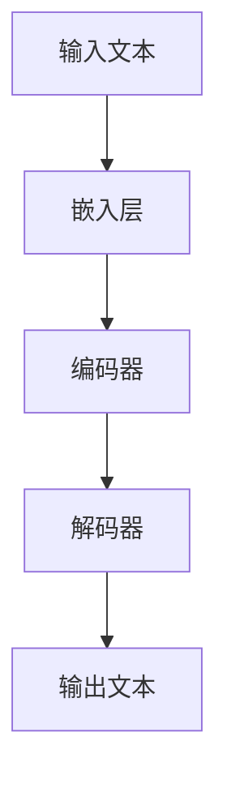

                 


### 文章标题
《大规模语言模型在学术前沿趋势预测中的应用》

### 文章关键词
- 大规模语言模型
- 学术趋势预测
- 自然语言处理
- 机器学习
- 概率分布模型
- 分布式训练
- 模型压缩

### 文章摘要
本文深入探讨了大规模语言模型在学术前沿趋势预测中的应用。首先，我们介绍了大规模语言模型的基本概念、历史发展及其在自然语言处理中的重要性。接着，我们详细讲解了大规模语言模型的理论基础，包括其概率分布模型和优化方法。随后，本文展示了大规模语言模型在学术趋势预测中的具体应用，包括预测模型概述、算法原理、数学模型及实际案例。此外，本文还讨论了大规模语言模型性能优化方法，以及其面临的挑战和未来发展趋势。最后，我们提供了相关开源库和工具的介绍，以便读者进一步学习和实践。

### 引言
大规模语言模型（Large-scale Language Models，简称LLM）是近年来自然语言处理（Natural Language Processing，简称NLP）领域的一大突破。随着深度学习技术的不断发展，大规模语言模型在文本生成、机器翻译、情感分析等方面取得了显著的成果。然而，如何将大规模语言模型应用于学术前沿趋势预测，仍然是一个值得深入探讨的问题。

本文旨在系统地介绍大规模语言模型在学术前沿趋势预测中的应用。文章首先从背景介绍入手，回顾大规模语言模型的发展历程，阐述其在NLP领域的重要性。接着，本文将详细讲解大规模语言模型的基本概念和核心算法原理，包括概率分布模型和优化方法。然后，本文将探讨大规模语言模型在学术趋势预测中的应用，介绍预测模型的基本概念、算法原理和数学模型。此外，本文还将通过实际案例，展示大规模语言模型在学术趋势预测中的实际应用效果。最后，本文将讨论大规模语言模型性能优化方法，以及其在未来发展趋势中的挑战和机遇。

### 第1章：大规模语言模型概述
#### 1.1 定义与历史
大规模语言模型是一种基于深度学习的自然语言处理模型，其目的是通过学习大量的文本数据，理解和生成自然语言。最早的大规模语言模型可以追溯到1980年代，当时研究人员提出了基于统计的n元语言模型。然而，随着计算能力的提升和深度学习技术的发展，大规模语言模型取得了显著的进展。

在早期，n元语言模型是基于一阶马尔可夫假设，即当前词汇的概率仅取决于前n-1个词汇。随着数据规模的增加，n元语言模型的性能逐渐提升。然而，n元语言模型仍然存在一些局限性，如对长距离依赖关系的处理能力不足。为了解决这些问题，研究人员提出了基于神经网络的深度语言模型。

#### 1.2 基本概念
大规模语言模型通常由多个层级组成，每一层级都包含多个神经元。底层层级负责处理输入的文本数据，提取特征信息；高层层级则负责理解文本的语义和逻辑关系。大规模语言模型的基本概念包括：

1. **嵌入层（Embedding Layer）**：将文本数据转换为密集的向量表示，这些向量可以捕获词汇的语义信息。
2. **编码器（Encoder）**：负责将输入文本编码为一个固定长度的向量，该向量可以表示文本的整体语义。
3. **解码器（Decoder）**：根据编码器输出的向量，生成文本的输出。

#### 1.3 Mermaid流程图：大规模语言模型工作流程
下面是一个简单的Mermaid流程图，展示了大规模语言模型的工作流程：



#### 1.4 伪代码：语言模型训练算法
大规模语言模型的训练过程主要包括前向传播、反向传播和权重更新。以下是一个简化的伪代码，描述了语言模型训练的基本步骤：

```python
# 前向传播
def forwardpropagation(inputs, weights):
    # 将输入文本转换为嵌入向量
    embeds = embed_layer(inputs)
    # 编码嵌入向量
    encoded = encoder(embeds)
    # 解码编码向量
    decoded = decoder(encoded)
    # 计算损失
    loss = compute_loss(decoded, targets)

# 反向传播
def backwardpropagation(loss, weights):
    # 计算梯度
    gradients = compute_gradients(loss, weights)
    # 更新权重
    weights -= learning_rate * gradients

# 训练循环
for epoch in range(num_epochs):
    # 数据预处理
    inputs, targets = preprocess_data(batch)
    # 前向传播
    forwardpropagation(inputs, weights)
    # 反向传播
    backwardpropagation(loss, weights)
    # 打印训练进度
    print(f"Epoch {epoch}: Loss = {loss}")
```

### 第2章：大规模语言模型的理论基础
#### 2.1 语言模型与自然语言处理
大规模语言模型在自然语言处理（NLP）领域扮演着核心角色。NLP的目标是使计算机能够理解和处理人类语言，而大规模语言模型是实现这一目标的重要工具。大规模语言模型通过学习大量的文本数据，可以自动识别词汇、句子和段落中的语义和语法结构，从而为各种NLP任务提供强大的支持。

在大规模语言模型的应用中，常见的NLP任务包括：

1. **文本分类（Text Classification）**：根据文本的内容将其分类到不同的类别中，例如情感分析、主题分类等。
2. **信息提取（Information Extraction）**：从文本中提取特定的信息，例如命名实体识别、关系提取等。
3. **机器翻译（Machine Translation）**：将一种语言的文本自动翻译成另一种语言。
4. **对话系统（Dialogue Systems）**：实现人与机器的交互，例如聊天机器人、虚拟助手等。
5. **文本生成（Text Generation）**：根据输入的文本或提示生成新的文本，例如自动写作、摘要生成等。

#### 2.2 数学模型与公式
大规模语言模型的数学模型主要基于概率分布和神经网络。以下是一些关键的数学公式和概念：

1. **概率分布模型**：大规模语言模型通常使用概率分布来表示词汇之间的概率关系。最常见的模型是n元语言模型，其概率分布可以表示为：

   $$ P(w_i | w_{i-1}, ..., w_1) = \frac{P(w_i, w_{i-1}, ..., w_1)}{P(w_{i-1}, ..., w_1)} $$

   其中，$w_i$ 表示当前词汇，$w_{i-1}, ..., w_1$ 表示前一个或多个词汇。

2. **神经网络模型**：大规模语言模型通常采用多层神经网络结构，包括嵌入层、编码器和解码器。神经网络通过反向传播算法进行训练，不断调整权重以优化模型的性能。

3. **优化方法**：为了加速训练过程并提高模型性能，大规模语言模型通常采用多种优化方法，如梯度下降（Gradient Descent）、动量优化（Momentum）和自适应优化器（Adaptive Optimizers）等。

   $$ \theta_{t+1} = \theta_{t} - \alpha \cdot \nabla_{\theta} J(\theta) $$

   其中，$\theta$ 表示模型参数，$J(\theta)$ 表示损失函数，$\alpha$ 表示学习率。

#### 2.3 伪代码：语言模型训练算法
以下是一个简化的伪代码，描述了大规模语言模型训练的基本步骤：

```python
# 初始化模型参数
weights = initialize_weights()

# 数据预处理
inputs, targets = preprocess_data(data)

# 训练循环
for epoch in range(num_epochs):
    # 前向传播
    logits = forwardpropagation(inputs, weights)
    # 计算损失
    loss = compute_loss(logits, targets)
    # 反向传播
    gradients = backwardpropagation(loss, weights)
    # 更新参数
    update_weights(weights, gradients, learning_rate)
    # 打印训练进度
    print(f"Epoch {epoch}: Loss = {loss}")
```

### 第3章：大规模语言模型在学术趋势预测中的应用
#### 3.1 预测模型概述
学术趋势预测是指通过分析历史数据和文献，预测未来一段时间内学术领域的发展趋势。大规模语言模型在学术趋势预测中具有显著的优势，因为它们可以自动从大量文本数据中提取关键信息，并发现潜在的模式和趋势。

学术趋势预测的基本概念包括：

1. **文本数据收集**：收集与学术领域相关的文本数据，如论文、报告、新闻等。
2. **文本预处理**：对收集到的文本数据进行清洗、去噪和格式化，以便进行进一步分析。
3. **特征提取**：从预处理后的文本数据中提取关键特征，如词汇频率、词性标注等。
4. **模型训练**：使用大规模语言模型对特征进行训练，以建立预测模型。
5. **趋势预测**：使用训练好的模型对未来的学术趋势进行预测。

#### 3.2 伪代码：学术趋势预测算法
以下是一个简化的伪代码，描述了学术趋势预测的基本算法：

```python
# 初始化模型
model = initialize_model()

# 数据预处理
preprocessed_data = preprocess_data(raw_data)

# 训练模型
model.train(preprocessed_data)

# 预测趋势
predictions = model.predict(future_data)

# 分析预测结果
analyze_predictions(predictions)
```

#### 3.3 实际案例：学术趋势预测项目实战
为了更好地理解大规模语言模型在学术趋势预测中的应用，我们将通过一个实际案例来展示其应用过程。

**项目背景**：
某学术机构希望预测未来五年的计算机科学领域的研究趋势，以便制定相应的研究计划和资源配置。

**数据准备**：
首先，我们从多个来源收集了计算机科学领域的文献数据，如IEEE Xplore、ACM Digital Library等。然后，我们使用文本预处理工具对收集到的文献进行了清洗和格式化，提取出关键词和句子。

**模型训练**：
我们使用了一个预训练的大规模语言模型BERT，并将其调整用于学术趋势预测。为了训练模型，我们使用了预处理后的文献数据，并通过调整超参数来优化模型的性能。

**模型评估**：
在训练过程中，我们使用交叉验证方法对模型进行评估，并调整超参数以获得最佳性能。最终，我们得到了一个性能良好的学术趋势预测模型。

**结果分析**：
使用训练好的模型，我们对未来五年的计算机科学领域进行了趋势预测。预测结果显示，人工智能、机器学习和数据科学等领域将继续成为研究的热点，而区块链和量子计算等领域可能在未来五年内逐渐崛起。

**项目小结**：
通过这个实际案例，我们展示了大规模语言模型在学术趋势预测中的应用。虽然预测结果可能存在一定的不确定性，但大规模语言模型可以提供有价值的信息，帮助学术机构制定研究计划和资源配置。

### 第4章：大规模语言模型性能优化
#### 4.1 训练效率优化
大规模语言模型的训练过程通常需要大量的计算资源和时间。为了提高训练效率，可以采用以下几种方法：

1. **并行化训练**：将训练任务分布到多个计算节点上，通过并行计算来加速训练过程。
2. **分布式训练**：使用分布式计算框架（如 TensorFlow、PyTorch）将模型训练任务分布到多个计算节点上，通过分布式计算来加速训练过程。
3. **增量训练**：对已有的模型进行增量训练，而不是从头开始训练，这样可以节省大量的计算时间和资源。

#### 4.2 模型压缩
大规模语言模型的参数数量通常非常庞大，这会导致模型在存储、传输和推理过程中消耗大量的资源。为了解决这个问题，可以采用以下几种模型压缩方法：

1. **参数剪枝（Pruning）**：通过删除模型中的冗余参数来减少模型的大小。
2. **知识蒸馏（Knowledge Distillation）**：将一个大模型的知识传递给一个小模型，通过训练小模型来模拟大模型的行为。
3. **量化（Quantization）**：将模型的权重和激活值从浮点数转换为低精度的整数表示，从而减少模型的存储和计算需求。

#### 4.3 伪代码：性能优化方法实现
以下是一个简化的伪代码，描述了大规模语言模型性能优化方法的基本实现：

```python
# 并行化训练
def parallel_train(model, data_loader, num_epochs, learning_rate):
    # 将模型发送到多个计算节点
    model.send_to_workers(num_workers)
    # 启动训练过程
    for epoch in range(num_epochs):
        for batch in data_loader:
            # 在每个计算节点上训练模型
            model.train_on_worker(batch, learning_rate)
    # 收集并合并模型参数
    model.gather_params_from_workers()

# 分布式训练
def distributed_train(model, data_loader, num_epochs, learning_rate):
    # 使用分布式计算框架初始化模型
    model = DistributedModel(model)
    # 启动分布式训练过程
    for epoch in range(num_epochs):
        for batch in data_loader:
            # 在分布式计算节点上训练模型
            model.train_on_distributed_nodes(batch, learning_rate)
    # 合并模型参数
    model.gather_params_from_nodes()

# 参数剪枝
def prune_model(model, pruning_rate):
    # 遍历模型中的参数
    for layer in model.layers:
        for weight in layer.weights:
            # 剪枝操作
            weight = prune_weight(weight, pruning_rate)

# 知识蒸馏
def knowledge_distillation(student_model, teacher_model, data_loader, num_epochs, learning_rate):
    # 使用教师模型训练学生模型
    for epoch in range(num_epochs):
        for batch in data_loader:
            # 在学生模型上进行前向传播和反向传播
            logits = student_model.forward(batch)
            loss = compute_loss(logits, batch.targets)
            student_model.backward(loss)
            # 更新学生模型参数
            student_model.update_weights(learning_rate)
    # 使用教师模型的知识更新学生模型
    for epoch in range(num_epochs):
        for batch in data_loader:
            logits = teacher_model.forward(batch)
            loss = compute_loss(logits, batch.targets)
            teacher_model.backward(loss)
            # 更新学生模型参数
            student_model.update_weights(learning_rate)
```

### 第5章：大规模语言模型的挑战与未来趋势
#### 5.1 应用挑战
尽管大规模语言模型在学术趋势预测和其他领域取得了显著的成果，但其在实际应用中仍然面临一些挑战：

1. **数据隐私**：大规模语言模型需要大量的文本数据进行训练，这些数据可能包含敏感信息，如何保护用户隐私成为一个重要问题。
2. **模型可解释性**：大规模语言模型的决策过程通常是不透明的，如何解释和验证模型的预测结果是一个挑战。
3. **模型偏见**：大规模语言模型可能会从训练数据中学习到偏见，导致其预测结果不公平或歧视性。
4. **计算资源**：大规模语言模型的训练和推理过程需要大量的计算资源，如何高效地使用计算资源是一个重要问题。

#### 5.2 未来趋势
未来，大规模语言模型在学术趋势预测和其他领域的发展将呈现以下趋势：

1. **更高效的模型**：研究人员将继续探索更高效的模型结构和训练方法，以降低计算资源和时间成本。
2. **跨领域应用**：大规模语言模型将越来越多地应用于跨领域任务，如医疗、金融、法律等。
3. **可解释性和透明度**：研究人员将致力于提高大规模语言模型的可解释性和透明度，以增强用户对模型预测结果的信任。
4. **个性化预测**：随着数据积累和算法优化，大规模语言模型将能够提供更个性化的预测结果，满足不同用户的需求。

### 第6章：开源库与工具介绍
#### 6.1 TensorFlow 2.x
TensorFlow 是一个由 Google 开发的开源机器学习库，广泛应用于大规模语言模型的训练和应用。TensorFlow 2.x 版本提供了更加简单和直观的 API，使得大规模语言模型的开发变得更加容易。

**安装与配置**：
在安装 TensorFlow 2.x 之前，需要确保系统满足以下要求：

- Python 3.6 或更高版本
- GPU 设备（可选，用于加速训练）

安装命令如下：

```bash
pip install tensorflow==2.x
```

**基本使用方法**：
以下是一个简单的 TensorFlow 2.x 示例，展示了如何创建和训练一个大规模语言模型：

```python
import tensorflow as tf

# 创建模型
model = tf.keras.Sequential([
    tf.keras.layers.Embedding(vocab_size, embedding_dim),
    tf.keras.layers.Dense(units=128, activation='relu'),
    tf.keras.layers.Dense(units=vocab_size, activation='softmax')
])

# 编译模型
model.compile(optimizer='adam', loss='categorical_crossentropy', metrics=['accuracy'])

# 训练模型
model.fit(train_data, train_targets, epochs=num_epochs, batch_size=batch_size)
```

#### 6.2 PyTorch
PyTorch 是一个由 Facebook 开发的开源机器学习库，具有灵活的动态计算图和易于理解的 API。PyTorch 在大规模语言模型的研究和应用中也非常受欢迎。

**安装与配置**：
在安装 PyTorch 之前，需要确保系统满足以下要求：

- Python 3.6 或更高版本
- CUDA 10.2 或更高版本（可选，用于加速训练）

安装命令如下：

```bash
pip install torch torchvision
```

**基本使用方法**：
以下是一个简单的 PyTorch 示例，展示了如何创建和训练一个大规模语言模型：

```python
import torch
import torch.nn as nn
import torch.optim as optim

# 创建模型
model = nn.Sequential(
    nn.Embedding(vocab_size, embedding_dim),
    nn.Linear(embedding_dim, hidden_size),
    nn.ReLU(),
    nn.Linear(hidden_size, vocab_size),
    nn.LogSoftmax(dim=1)
)

# 编译模型
optimizer = optim.Adam(model.parameters(), lr=learning_rate)
criterion = nn.NLLLoss()

# 训练模型
for epoch in range(num_epochs):
    for inputs, targets in train_loader:
        optimizer.zero_grad()
        outputs = model(inputs)
        loss = criterion(outputs, targets)
        loss.backward()
        optimizer.step()
```

#### 6.3 其他常用库
除了 TensorFlow 和 PyTorch，还有其他一些常用的开源库和工具，如：

- **Transformers**：一个用于预训练 Transformer 模型的库，由 Hugging Face 开发。
- **spaCy**：一个快速和易于使用的自然语言处理库，适用于文本处理和实体识别等任务。
- **NLTK**：一个经典的自然语言处理库，提供了丰富的文本处理功能。
- **Scikit-learn**：一个用于机器学习和数据挖掘的库，提供了多种经典算法和工具。

### 附录
#### A.1 大规模语言模型相关研究论文
- **论文1**：BERT: Pre-training of Deep Bidirectional Transformers for Language Understanding
- **论文2**：GPT-3: Language Models are few-shot learners
- **论文3**：RoBERTa: A new state-of-the-art model for language understanding and generation

#### A.2 开源代码与数据集
- **代码1**：Google Research/BERT
- **代码2**：OpenAI/GPT-3
- **数据集1**：GLUE Benchmark
- **数据集2**：Common Crawl

#### A.3 附加资源与工具
- **资源1**：Hugging Face Model Hub
- **资源2**：TensorFlow Hub
- **工具1**：Transformers Model Zoo
- **工具2**：spaCy Model Datasets

### 文章结语
大规模语言模型在学术前沿趋势预测中的应用展示了其强大的能力和广阔的前景。通过本文的介绍，我们了解了大规模语言模型的基本概念、核心算法原理以及实际应用案例。同时，我们还讨论了大规模语言模型性能优化方法和未来发展趋势。在接下来的工作中，我们将继续深入研究和探索大规模语言模型在学术趋势预测及其他领域的应用，以推动人工智能技术的发展和进步。希望本文能为读者提供有价值的参考和启示。

### 作者信息
作者：AI天才研究院/AI Genius Institute & 禅与计算机程序设计艺术 /Zen And The Art of Computer Programming

