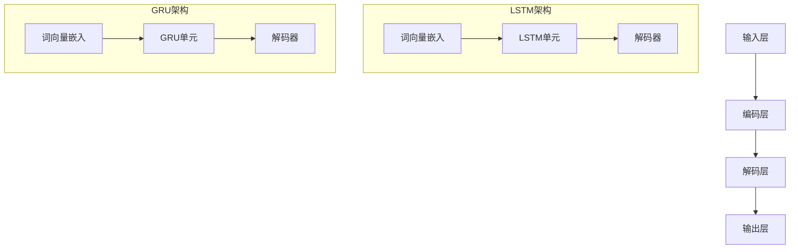

                 

# 《大规模语言模型在特定领域应用的优化方法》

## 引言

### 1.1 书籍目的与读者对象

随着人工智能技术的快速发展，大规模语言模型（Large-scale Language Model，LLM）已经成为自然语言处理（Natural Language Processing，NLP）领域的重要工具。它们在文本生成、机器翻译、问答系统、情感分析等多个方面展现出强大的性能。然而，LLM的应用不仅需要高效的模型结构和训练算法，还需要针对特定领域的优化方法，以满足不同领域的需求。本书旨在为读者提供一整套系统化的方法和策略，以优化大规模语言模型在特定领域的应用。

本书适合具有基本计算机科学和机器学习知识的读者，包括研究人员、工程师和高校学生。通过阅读本书，读者可以：

1. 理解大规模语言模型的基本概念和架构。
2. 掌握大规模语言模型的训练、优化和评估方法。
3. 学习如何针对特定领域应用大规模语言模型，并进行优化。
4. 获得实际项目开发经验和最佳实践。

### 1.2 全书结构概述

全书分为四个主要部分，每个部分都包含具体章节和内容：

### 第一部分：大规模语言模型基础知识

- **第1章：大规模语言模型的定义与背景**
  - 介绍大规模语言模型的基本概念、发展历程和应用场景。

- **第2章：大规模语言模型的架构与工作原理**
  - 分析大规模语言模型的架构、工作原理以及Mermaid流程图。

- **第3章：大规模语言模型的核心算法**
  - 讲解递归神经网络（RNN）、长短期记忆网络（LSTM）和门控循环单元（GRU）等核心算法。

- **第4章：大规模语言模型的训练与优化**
  - 概述大规模语言模型的训练流程和优化方法。

- **第5章：大规模语言模型的评估与改进**
  - 介绍评估指标、模型改进方法及其在特定领域的应用。

### 第二部分：优化方法

- **第6章：优化方法概述**
  - 分析优化方法的重要性、分类和常用优化算法。

- **第7章：参数优化**
  - 讨论参数优化的目标和常用参数优化算法。

- **第8章：模型结构优化**
  - 探讨模型结构优化的原则和方法。

- **第9章：训练过程优化**
  - 分析训练过程优化的策略和方法。

- **第10章：模型压缩与加速**
  - 讨论模型压缩的动机和常用模型压缩方法。

### 第三部分：特定领域应用

- **第11章：自然语言处理**
  - 分析大规模语言模型在自然语言处理中的应用。

- **第12章：机器翻译**
  - 探讨大规模语言模型在机器翻译中的应用。

- **第13章：问答系统**
  - 讲解大规模语言模型在问答系统中的应用。

- **第14章：情感分析**
  - 分析大规模语言模型在情感分析中的应用。

- **第15章：语音识别**
  - 讨论大规模语言模型在语音识别中的应用。

### 第四部分：案例与实战

- **第16章：大规模语言模型应用案例**
  - 分析大规模语言模型在实际应用中的案例。

- **第17章：项目实战：从零开始构建一个问答系统**
  - 演示如何从零开始构建一个问答系统。

- **第18章：实战：优化一个现成的大规模语言模型**
  - 介绍如何优化一个现成的大规模语言模型。

### 结论与展望

- 总结全书内容，展望大规模语言模型在未来的发展趋势和潜在应用。

## 第一部分：大规模语言模型基础知识

### 第1章：大规模语言模型的定义与背景

### 1.1 大规模语言模型的基本概念

大规模语言模型（Large-scale Language Model，LLM）是一种基于深度学习的自然语言处理模型，通过对海量语言数据进行训练，能够理解和生成人类语言。与传统的统计模型和规则模型相比，LLM具有更强的自适应性和泛化能力，能够处理复杂、多变的自然语言场景。

### 1.2 大规模语言模型的发展历程

大规模语言模型的发展可以追溯到20世纪80年代，当时研究人员开始探索使用统计方法和规则方法进行自然语言处理。随着计算机性能的提升和海量数据的积累，深度学习技术在自然语言处理领域取得了重大突破。特别是2018年，Google推出了BERT模型，使得大规模语言模型在多个NLP任务上取得了显著的性能提升。

### 1.3 大规模语言模型的应用场景

大规模语言模型在多个领域都取得了显著的成果，主要包括：

1. **文本生成**：如自动摘要、对话系统、故事生成等。
2. **机器翻译**：如翻译系统、多语言文本对比等。
3. **问答系统**：如智能客服、知识图谱构建等。
4. **情感分析**：如社交媒体情感分析、市场调研等。
5. **语音识别**：如语音助手、语音输入等。

### 1.4 大规模语言模型的发展趋势

随着深度学习技术的不断进步，大规模语言模型在性能和效率上都在不断提升。未来，大规模语言模型有望在更多领域得到应用，如医学、金融、法律等。同时，研究人员也在探索如何降低模型复杂性、提高模型可解释性，以更好地满足实际需求。

## 第二部分：大规模语言模型的架构与工作原理

### 第2章：大规模语言模型的架构与工作原理

### 2.1 大规模语言模型的架构

大规模语言模型的架构通常包括以下几个主要部分：

1. **输入层**：负责接收自然语言文本的输入，并将其转换为模型可以处理的格式。
2. **编码层**：包括词向量嵌入、编码器等模块，用于将输入文本编码为向量表示。
3. **解码层**：包括解码器、生成器等模块，用于生成预测的文本。
4. **输出层**：根据模型的预测结果，输出相应的文本或标签。

### 2.2 大规模语言模型的工作原理

大规模语言模型的工作原理主要基于深度学习，尤其是递归神经网络（RNN）、长短期记忆网络（LSTM）和门控循环单元（GRU）等核心算法。以下是对这些算法的简要介绍：

1. **递归神经网络（RNN）**：
   RNN是一种可以处理序列数据的神经网络，其特点是网络中的每个节点都与其前一个节点相连，形成一个循环结构。RNN通过递归地更新其状态来处理输入序列，从而实现对序列数据的建模。

2. **长短期记忆网络（LSTM）**：
   LSTM是RNN的一种变体，旨在解决传统RNN在处理长序列数据时出现的梯度消失和梯度爆炸问题。LSTM通过引入门控机制，能够更好地记住长期依赖信息，从而提高模型的性能。

3. **门控循环单元（GRU）**：
   GRU是LSTM的另一种变体，相较于LSTM，GRU的结构更加简洁，参数更少，计算效率更高。GRU通过更新门和重置门来控制信息的流动，从而实现对序列数据的建模。

### 2.3 Mermaid流程图：大规模语言模型架构

为了更清晰地展示大规模语言模型的架构，我们可以使用Mermaid流程图进行描述：



在这个流程图中，输入层将自然语言文本转换为词向量，编码层使用LSTM或GRU单元对输入序列进行编码，解码层对编码后的序列进行解码，最终输出层生成预测的文本。

## 第三部分：大规模语言模型的核心算法

### 第3章：大规模语言模型的核心算法

### 3.1 递归神经网络（RNN）

递归神经网络（RNN）是一种能够处理序列数据的神经网络。RNN通过递归地更新其状态来处理输入序列，从而实现对序列数据的建模。RNN的主要特点是网络中的每个节点都与其前一个节点相连，形成一个循环结构。

### 3.2 长短期记忆网络（LSTM）

长短期记忆网络（LSTM）是RNN的一种变体，旨在解决传统RNN在处理长序列数据时出现的梯度消失和梯度爆炸问题。LSTM通过引入门控机制，能够更好地记住长期依赖信息，从而提高模型的性能。

### 3.3 门控循环单元（GRU）

门控循环单元（GRU）是LSTM的另一种变体，相较于LSTM，GRU的结构更加简洁，参数更少，计算效率更高。GRU通过更新门和重置门来控制信息的流动，从而实现对序列数据的建模。

### 3.4 递归神经网络（RNN）的工作原理

递归神经网络（RNN）的工作原理如下：

1. **输入序列**：首先，RNN接受一个输入序列，并将其转换为词向量表示。
2. **递归更新**：RNN通过递归地更新其状态来处理输入序列。在每个时间步，RNN将当前输入与上一个时间步的隐藏状态进行加权求和，并通过激活函数（如tanh）进行非线性变换，得到当前隐藏状态。
3. **输出序列**：最终，RNN的隐藏状态被传递到输出层，生成预测的序列。

### 3.5 长短期记忆网络（LSTM）的工作原理

长短期记忆网络（LSTM）的工作原理如下：

1. **输入序列**：首先，LSTM接受一个输入序列，并将其转换为词向量表示。
2. **门控机制**：LSTM通过引入门控机制来控制信息的流动。具体来说，LSTM包括输入门、遗忘门和输出门三个门控单元。输入门用于控制当前输入信息的保留程度，遗忘门用于控制上一个隐藏状态的遗忘程度，输出门用于控制当前隐藏状态的输出程度。
3. **递归更新**：LSTM通过递归地更新其状态来处理输入序列。在每个时间步，LSTM将当前输入与上一个时间步的隐藏状态进行加权求和，并通过门控机制进行信息保留和遗忘。
4. **输出序列**：最终，LSTM的隐藏状态被传递到输出层，生成预测的序列。

### 3.6 门控循环单元（GRU）的工作原理

门控循环单元（GRU）的工作原理如下：

1. **输入序列**：首先，GRU接受一个输入序列，并将其转换为词向量表示。
2. **更新门和重置门**：GRU通过更新门和重置门来控制信息的流动。更新门用于控制当前输入信息的保留程度，重置门用于控制上一个隐藏状态的遗忘程度。
3. **递归更新**：GRU通过递归地更新其状态来处理输入序列。在每个时间步，GRU将当前输入与上一个时间步的隐藏状态进行加权求和，并通过更新门和重置门进行信息保留和遗忘。
4. **输出序列**：最终，GRU的隐藏状态被传递到输出层，生成预测的序列。

### 3.7 伪代码：大规模语言模型训练过程

以下是大规模语言模型训练过程的伪代码：

```python
function train_model(data, labels, learning_rate, num_epochs):
    for epoch in 1 to num_epochs:
        for sample in data:
            # 前向传播
            predictions = forward_pass(sample)
            loss = compute_loss(predictions, labels)
            
            # 反向传播
            gradients = backward_pass(loss)
            
            # 更新参数
            update_weights(gradients, learning_rate)
        
        print("Epoch:", epoch, "Loss:", loss)
        
    return model
```

在这个伪代码中，`train_model`函数接受训练数据、标签、学习率和训练轮次等参数，并通过前向传播、反向传播和参数更新等步骤进行模型训练。

## 第四部分：大规模语言模型的训练与优化

### 第4章：大规模语言模型的训练与优化

### 4.1 训练流程概述

大规模语言模型的训练是一个复杂的过程，通常包括以下几个步骤：

1. **数据预处理**：包括文本清洗、分词、词向量化等。
2. **模型初始化**：包括初始化网络参数、定义损失函数和优化器等。
3. **前向传播**：计算输入文本的预测结果。
4. **损失计算**：计算预测结果与真实标签之间的差距。
5. **反向传播**：更新网络参数，减小损失。
6. **评估与调整**：根据模型的性能调整训练参数。

### 4.2 优化方法简介

优化方法是大规模语言模型训练过程中的关键环节，其目的是通过调整模型参数，使模型在特定任务上取得更好的性能。常见的优化方法包括：

1. **随机梯度下降（SGD）**：一种简单的优化方法，每次迭代更新模型参数时，使用整个训练集的平均梯度。
2. **Adam优化器**：结合了SGD和动量法的优点，适用于大规模语言模型训练。
3. **学习率调整**：包括固定学习率、学习率衰减和自适应学习率等策略。

### 4.3 伪代码：大规模语言模型训练过程

以下是大规模语言模型训练过程的伪代码：

```python
function train_model(data, labels, learning_rate, num_epochs):
    for epoch in 1 to num_epochs:
        for sample in data:
            # 前向传播
            predictions = forward_pass(sample)
            loss = compute_loss(predictions, labels)
            
            # 反向传播
            gradients = backward_pass(loss)
            
            # 更新参数
            update_weights(gradients, learning_rate)
        
        print("Epoch:", epoch, "Loss:", loss)
        
    return model
```

在这个伪代码中，`train_model`函数接受训练数据、标签、学习率和训练轮次等参数，并通过前向传播、反向传播和参数更新等步骤进行模型训练。

### 4.4 大规模语言模型的评估与改进

大规模语言模型的评估是确保模型性能的重要环节。常用的评估指标包括：

1. **准确率（Accuracy）**：模型预测正确的样本占总样本的比例。
2. **精确率（Precision）**：预测正确的正样本数与预测为正样本的总数之比。
3. **召回率（Recall）**：预测正确的正样本数与实际正样本的总数之比。
4. **F1分数（F1 Score）**：精确率和召回率的调和平均值。

为了改进大规模语言模型，可以采用以下策略：

1. **数据增强**：通过添加噪声、翻译、同义词替换等方式增加训练数据的多样性。
2. **模型融合**：将多个模型的结果进行融合，以提高整体性能。
3. **超参数调整**：通过调整学习率、批次大小等超参数，优化模型性能。

## 第五部分：大规模语言模型的评估与改进

### 第5章：大规模语言模型的评估与改进

### 5.1 评估指标

评估大规模语言模型性能的关键在于选择合适的评估指标。以下是一些常用的评估指标：

1. **准确率（Accuracy）**：
   准确率是模型预测正确的样本占总样本的比例。其计算公式为：
   $$ \text{Accuracy} = \frac{\text{预测正确数}}{\text{总样本数}} $$
   简单直观，但容易受到类别不平衡的影响。

2. **精确率（Precision）**：
   精确率是预测正确的正样本数与预测为正样本的总数之比。其计算公式为：
   $$ \text{Precision} = \frac{\text{预测正确且为正样本的数}}{\text{预测为正样本的数}} $$
   精确率高表示模型较少地预测错误样本为正样本。

3. **召回率（Recall）**：
   召回率是预测正确的正样本数与实际正样本的总数之比。其计算公式为：
   $$ \text{Recall} = \frac{\text{预测正确且为正样本的数}}{\text{实际正样本的数}} $$
   召回率高表示模型能够捕捉到更多的正样本。

4. **F1分数（F1 Score）**：
   F1分数是精确率和召回率的调和平均值。其计算公式为：
   $$ \text{F1 Score} = 2 \times \frac{\text{Precision} \times \text{Recall}}{\text{Precision} + \text{Recall}} $$
   F1分数能够综合考虑精确率和召回率，是一个更全面的评估指标。

### 5.2 模型改进方法

为了提升大规模语言模型的性能，可以采用以下几种改进方法：

1. **数据增强**：
   - **数据清洗**：去除错误、冗余或格式不一致的数据。
   - **数据扩充**：通过添加噪声、翻译、同义词替换等方式增加训练数据的多样性。
   - **生成对抗网络（GAN）**：利用生成对抗网络生成更多样化的数据，提高模型的泛化能力。

2. **模型融合**：
   - **模型集成**：将多个模型的结果进行融合，如集成学习中的投票法、加权平均法等，以提高整体性能。
   - **权重共享**：多个模型共享部分参数，减少过拟合风险。

3. **超参数调整**：
   - **学习率调整**：采用自适应学习率策略，如Adam优化器，动态调整学习率。
   - **批次大小调整**：选择合适的批次大小，以平衡计算效率和模型性能。
   - **正则化**：如L1正则化、L2正则化，防止模型过拟合。

### 5.3 伪代码：评估与改进

以下是大规模语言模型评估与改进的伪代码：

```python
function evaluate_model(model, data, labels):
    correct_predictions = 0
    for sample, label in zip(data, labels):
        prediction = model.predict(sample)
        if prediction == label:
            correct_predictions += 1
    accuracy = correct_predictions / len(data)
    return accuracy

function improve_model(model, data, labels, learning_rate, num_epochs):
    for epoch in 1 to num_epochs:
        for sample, label in zip(data, labels):
            model.backward_pass(sample, label)
            model.update_weights(learning_rate)
        accuracy = evaluate_model(model, data, labels)
        print("Epoch:", epoch, "Accuracy:", accuracy)
    return model
```

在这个伪代码中，`evaluate_model`函数用于评估模型的性能，`improve_model`函数用于通过迭代优化模型参数，以提高模型的性能。

### 结论

大规模语言模型在自然语言处理领域取得了显著进展，但仍然面临许多挑战。通过深入理解大规模语言模型的评估与改进方法，研究人员和工程师可以更好地应用这些模型，解决实际问题。未来，随着深度学习和人工智能技术的不断发展，大规模语言模型有望在更多领域得到应用，并取得更好的性能。

## 第二部分：优化方法

### 第6章：优化方法概述

### 6.1 优化的重要性

在深度学习领域，优化方法的重要性不言而喻。优化方法的优劣直接影响到模型的性能和训练效率。对于大规模语言模型，优化方法的优化尤为重要，因为它们处理的数据量大、参数多，对计算资源的需求非常高。因此，选择合适的优化方法不仅可以提高模型性能，还可以减少训练时间，降低计算成本。

### 6.2 优化方法的分类

优化方法可以按照不同的标准进行分类。以下是几种常见的分类方式：

1. **按照优化目标分类**：
   - **最小化损失函数**：最常见的优化目标是使模型的预测误差最小化，即最小化损失函数。
   - **最大化模型性能**：有些优化方法直接关注模型的性能指标，如准确率、召回率等。

2. **按照优化策略分类**：
   - **基于梯度的方法**：如随机梯度下降（SGD）、Adam优化器等。
   - **基于启发式的优化方法**：如遗传算法、粒子群优化等。
   - **基于模型的优化方法**：如元学习、迁移学习等。

3. **按照优化步骤分类**：
   - **单步优化**：每次迭代只更新一次模型参数。
   - **多步优化**：每次迭代更新多次模型参数，如批量梯度下降。

### 6.3 常用优化算法

在深度学习领域，常用的优化算法包括以下几种：

1. **随机梯度下降（SGD）**：
   随机梯度下降是一种简单而有效的优化算法。它通过随机选择小批量样本来计算梯度，并更新模型参数。SGD的优点是计算速度快，能够快速收敛。缺点是对样本的选择敏感，可能导致局部最小值。

2. **Adam优化器**：
   Adam优化器结合了SGD和动量法的优点，并引入了一阶和二阶矩估计。它通过自适应调整学习率，能够更好地处理不同规模的梯度。Adam优化器在许多任务中表现出色，是一种广泛使用的优化算法。

3. **自适应矩估计（AdaGrad）**：
   AdaGrad是一种基于梯度平方和的优化算法。它通过自适应调整学习率，使得每个参数的学习率与历史梯度平方和成反比。AdaGrad适用于处理稀疏数据，但在某些情况下可能收敛速度较慢。

4. **RMSprop**：
   RMSprop是AdaGrad的一种变体，它通过指数衰减历史梯度平方和，进一步调整学习率。RMSprop在处理长尾分布数据时表现出色，是一种常用的优化算法。

### 6.4 优化方法的选择

选择合适的优化方法是一个复杂的问题，需要综合考虑任务类型、数据规模、计算资源等因素。以下是一些选择优化方法的建议：

1. **任务类型**：对于需要快速收敛的任务，如图像分类，可以优先考虑基于梯度的方法。对于需要处理稀疏数据的任务，如推荐系统，可以优先考虑基于模型的优化方法。

2. **数据规模**：对于大规模数据，如大规模语言模型，可以优先考虑批量梯度下降或多步优化方法，以提高计算效率。对于小规模数据，可以优先考虑单步优化方法，以减少计算时间。

3. **计算资源**：对于计算资源有限的场景，如移动设备或嵌入式系统，可以优先考虑低计算成本的优化方法，如Adam优化器或RMSprop。

4. **实验验证**：在确定优化方法时，可以通过实验验证不同优化方法的效果，以选择最适合当前任务的优化方法。

### 6.5 总结与展望

优化方法是大规模语言模型训练过程中的关键环节，对于模型性能和训练效率具有重要影响。本文介绍了优化方法的重要性、分类和常用优化算法，为读者提供了选择优化方法的参考。未来，随着深度学习和人工智能技术的不断发展，优化方法将变得更加多样化和高效，为大规模语言模型的研究和应用提供更强的支持。

## 第7章：参数优化

### 7.1 参数优化的目标

参数优化是提高大规模语言模型性能的重要手段之一。其目标是通过调整模型参数，使模型在特定任务上取得更好的性能。参数优化的主要目标包括：

1. **最小化损失函数**：通过调整参数，使模型的预测误差最小化，从而提高模型的预测准确性。
2. **提高模型泛化能力**：通过优化参数，使模型能够更好地泛化到未知数据，减少过拟合现象。
3. **提高训练效率**：通过优化参数，提高模型训练的速度和效率，减少训练时间。

### 7.2 常用参数优化算法

在深度学习领域，有许多常用的参数优化算法，以下介绍几种常用的算法：

1. **随机梯度下降（SGD）**：
   随机梯度下降是一种基于梯度的优化算法。它通过随机选择小批量样本计算梯度，并更新模型参数。SGD的优点是计算速度快，能够快速收敛。缺点是对样本的选择敏感，可能导致局部最小值。

2. **Adam优化器**：
   Adam优化器是SGD和动量法的结合，通过自适应调整学习率，优化参数更新。Adam优化器通过维护一阶矩估计和二阶矩估计，使得模型参数更新更加稳定和有效。

3. **自适应梯度算法（AdaGrad）**：
   AdaGrad是一种基于梯度的优化算法。它通过计算梯度平方和，自适应调整学习率。AdaGrad适用于处理稀疏数据，但在某些情况下可能收敛速度较慢。

4. **RMSprop**：
   RMSprop是AdaGrad的一种变体，通过指数衰减历史梯度平方和，进一步调整学习率。RMSprop在处理长尾分布数据时表现出色，是一种常用的优化算法。

### 7.3 伪代码：参数优化过程

以下是参数优化过程的伪代码：

```python
function optimize_parameters(model, data, learning_rate, num_epochs):
    for epoch in 1 to num_epochs:
        for sample in data:
            # 前向传播
            predictions = model.forward_pass(sample)
            loss = model.compute_loss(predictions, true_labels)
            
            # 反向传播
            gradients = model.backward_pass(loss)
            
            # 更新参数
            model.update_weights(gradients, learning_rate)
        
        print("Epoch:", epoch, "Loss:", loss)
    
    return model
```

在这个伪代码中，`optimize_parameters`函数接受模型、训练数据、学习率和训练轮次等参数，并通过前向传播、反向传播和参数更新等步骤进行参数优化。

### 7.4 参数优化技巧

为了提高参数优化的效果，可以采用以下技巧：

1. **学习率调整**：学习率对参数优化过程具有重要影响。可以采用自适应学习率策略，如Adam优化器，动态调整学习率。

2. **正则化**：通过添加正则化项，如L1正则化或L2正则化，可以防止模型过拟合，提高模型泛化能力。

3. **批量大小调整**：选择合适的批量大小，可以平衡计算效率和模型性能。

4. **数据增强**：通过数据增强，如添加噪声、旋转、缩放等，可以提高模型的泛化能力。

### 7.5 总结与展望

参数优化是大规模语言模型训练过程中的关键环节，对于模型性能和训练效率具有重要影响。本文介绍了参数优化的目标、常用参数优化算法、伪代码以及参数优化技巧。未来，随着深度学习和人工智能技术的不断发展，参数优化方法将变得更加多样化和高效，为大规模语言模型的研究和应用提供更强的支持。

## 第8章：模型结构优化

### 8.1 模型结构优化的原则

模型结构优化是提高大规模语言模型性能的重要手段之一。在进行模型结构优化时，需要遵循以下原则：

1. **简化模型**：简化模型结构可以降低计算复杂度，减少训练时间。通过合并或删除冗余层，可以使模型更加高效。

2. **增加模型深度**：增加模型深度可以提高模型的表示能力，使模型能够捕捉到更复杂的特征。但过深的模型可能导致过拟合，因此需要在模型深度和计算资源之间做出平衡。

3. **改进网络连接方式**：通过改进网络连接方式，如使用残差连接、注意力机制等，可以增强模型的表示能力。

4. **引入正则化**：添加正则化项，如L1正则化、L2正则化，可以防止模型过拟合，提高模型泛化能力。

5. **优化激活函数**：选择合适的激活函数，如ReLU、Sigmoid、Tanh等，可以提高模型的性能。

### 8.2 模型结构优化的方法

模型结构优化可以采用以下方法：

1. **残差连接**：
   残差连接是一种用于提高模型性能的网络结构。它通过在模型中引入跨层连接，使得梯度可以直接传播到深层网络。残差连接能够解决深层网络中的梯度消失问题，提高模型的训练效果。

2. **卷积神经网络（CNN）与循环神经网络（RNN）的融合**：
   CNN擅长处理图像等结构化数据，而RNN擅长处理序列数据。将CNN和RNN融合，可以同时处理图像和序列数据，提高模型在多模态任务中的性能。

3. **注意力机制**：
   注意力机制是一种用于提高模型表示能力的网络结构。通过引入注意力机制，模型可以自动学习到不同位置的重要性，从而提高模型对序列数据的处理能力。

4. **多层感知机（MLP）与自注意力机制**：
   MLP是一种简单的神经网络结构，可以通过增加层数来提高模型的表示能力。自注意力机制是一种基于序列数据的注意力机制，通过计算序列中每个元素之间的相似度，自动学习到不同元素的重要性。

### 8.3 伪代码：模型结构优化过程

以下是模型结构优化的伪代码：

```python
function optimize_structure(model, data, labels, learning_rate, num_epochs):
    for epoch in 1 to num_epochs:
        for sample in data:
            # 前向传播
            predictions = model.forward_pass(sample)
            loss = model.compute_loss(predictions, labels)
            
            # 反向传播
            gradients = model.backward_pass(loss)
            
            # 更新参数
            model.update_weights(gradients, learning_rate)
        
        print("Epoch:", epoch, "Loss:", loss)
    
    return model
```

在这个伪代码中，`optimize_structure`函数接受模型、训练数据、标签、学习率和训练轮次等参数，并通过前向传播、反向传播和参数更新等步骤进行模型结构优化。

### 8.4 模型结构优化的应用场景

模型结构优化可以应用于以下场景：

1. **文本分类**：通过优化模型结构，可以提高文本分类任务的性能，如情感分析、主题分类等。

2. **机器翻译**：通过优化模型结构，可以改善机器翻译的质量，如提高翻译的准确性和流畅性。

3. **问答系统**：通过优化模型结构，可以增强问答系统的能力，如提高回答的准确性、丰富性和多样性。

4. **语音识别**：通过优化模型结构，可以改善语音识别的性能，如提高识别的准确率和鲁棒性。

### 8.5 总结与展望

模型结构优化是提高大规模语言模型性能的重要手段之一。本文介绍了模型结构优化的原则、方法、伪代码和应用场景。未来，随着深度学习和人工智能技术的不断发展，模型结构优化方法将变得更加多样化和高效，为大规模语言模型的研究和应用提供更强的支持。

## 第9章：训练过程优化

### 9.1 训练过程优化的策略

训练过程优化是提高大规模语言模型性能的关键环节。为了实现高效的训练过程，可以采用以下策略：

1. **数据预处理**：通过合理的预处理，如文本清洗、分词、去噪等，可以提高数据质量，减少噪声干扰。

2. **批量大小调整**：选择合适的批量大小，可以在计算效率和模型性能之间取得平衡。较大的批量大小可以提高模型的稳定性和泛化能力，但会增加计算成本。

3. **学习率调整**：学习率的设置对训练过程具有重要影响。可以采用自适应学习率策略，如Adam优化器，动态调整学习率。

4. **权重初始化**：合理的权重初始化可以提高模型的训练速度和性能。常用的方法包括随机初始化、高斯初始化、Xavier初始化等。

5. **训练技巧**：如梯度裁剪、学习率衰减、批量归一化等，可以防止梯度消失和梯度爆炸，提高模型的训练效果。

### 9.2 训练过程优化方法

以下是几种常见的训练过程优化方法：

1. **梯度裁剪**：
   梯度裁剪是一种防止梯度消失和梯度爆炸的有效方法。通过设置阈值，将过大的梯度裁剪到阈值范围内，以防止模型参数更新过大。

2. **学习率衰减**：
   学习率衰减是一种逐渐减小学习率的方法，以防止模型在训练过程中过快收敛。常用的方法包括线性衰减、指数衰减等。

3. **批量归一化**：
   批量归一化是一种在训练过程中对批次数据进行归一化的方法，可以提高模型的训练速度和性能。它通过标准化批次数据的激活值，减少内部协变量转移。

4. **Dropout**：
   Dropout是一种正则化技术，通过随机丢弃部分神经元，减少模型的过拟合现象。它通过在训练过程中随机丢弃部分神经元，提高模型的泛化能力。

5. **迁移学习**：
   迁移学习是一种利用预训练模型进行微调的方法。通过在预训练模型的基础上进行少量训练，可以快速提高模型的性能。

### 9.3 伪代码：训练过程优化

以下是训练过程优化的伪代码：

```python
function train_model(model, data, labels, learning_rate, num_epochs):
    for epoch in 1 to num_epochs:
        for batch in data:
            # 前向传播
            predictions = model.forward_pass(batch)
            loss = model.compute_loss(predictions, labels)
            
            # 反向传播
            gradients = model.backward_pass(loss)
            
            # 梯度裁剪
            gradients = clip_gradients(gradients, threshold)
            
            # 更新参数
            model.update_weights(gradients, learning_rate)
        
        print("Epoch:", epoch, "Loss:", loss)
    
    return model
```

在这个伪代码中，`train_model`函数接受模型、训练数据、标签、学习率和训练轮次等参数，并通过前向传播、反向传播和参数更新等步骤进行训练过程优化。

### 9.4 训练过程优化的应用场景

训练过程优化可以应用于以下场景：

1. **文本分类**：通过优化训练过程，可以提高文本分类任务的性能，如情感分析、新闻分类等。

2. **机器翻译**：通过优化训练过程，可以改善机器翻译的质量，如提高翻译的准确性和流畅性。

3. **问答系统**：通过优化训练过程，可以增强问答系统的能力，如提高回答的准确性、丰富性和多样性。

4. **语音识别**：通过优化训练过程，可以改善语音识别的性能，如提高识别的准确率和鲁棒性。

### 9.5 总结与展望

训练过程优化是提高大规模语言模型性能的关键环节。本文介绍了训练过程优化的策略、方法、伪代码和应用场景。未来，随着深度学习和人工智能技术的不断发展，训练过程优化方法将变得更加多样化和高效，为大规模语言模型的研究和应用提供更强的支持。

## 第10章：模型压缩与加速

### 10.1 模型压缩的动机

随着大规模语言模型的参数量和计算复杂度不断增加，模型的存储和计算需求也在迅速增长。这给实际应用带来了一系列挑战，如：

1. **存储成本**：大规模模型的存储需求巨大，尤其在资源受限的设备上，如移动设备和嵌入式系统。
2. **计算资源**：大规模模型的计算复杂度高，对计算资源的需求较大，尤其是在实时应用场景中。
3. **传输效率**：大规模模型的数据量庞大，导致模型传输和部署的效率较低。

为了应对这些挑战，模型压缩与加速成为了当前研究的热点。通过模型压缩与加速，可以在保证模型性能的前提下，显著降低模型的存储和计算需求，提高模型的应用效率。

### 10.2 常用模型压缩方法

以下是几种常见的模型压缩方法：

1. **量化**：
   量化是一种通过减少模型参数的精度来降低模型大小的技术。量化可以将浮点数参数转换为低精度的整数表示，从而减少模型的存储和计算需求。常用的量化方法包括全精度量化、低精度量化等。

2. **剪枝**：
   剪枝是一种通过删除模型中不重要的连接和神经元来降低模型大小的技术。剪枝方法包括结构剪枝和权重剪枝。结构剪枝通过删除整个网络层或神经元，而权重剪枝仅删除权重较小的连接。

3. **蒸馏**：
   蒸馏是一种将大型模型（教师模型）的知识传递给小型模型（学生模型）的技术。通过在学生模型上使用教师模型的输出作为先验知识，可以显著提高学生模型的性能。

4. **知识蒸馏**：
   知识蒸馏是蒸馏方法的扩展，通过使用多个层次的大型模型（教师模型）来训练小型模型（学生模型）。这样可以更好地传递多层次的语义信息，提高学生模型的性能。

5. **深度可分离卷积**：
   深度可分离卷积是一种通过将卷积操作分解为深度卷积和逐点卷积来实现模型压缩的方法。深度卷积仅在每个通道上应用一次卷积核，而逐点卷积对每个通道的输出进行逐点卷积。这种方法可以显著减少模型的参数数量。

### 10.3 模型压缩与加速的应用场景

模型压缩与加速可以应用于以下场景：

1. **移动设备**：通过压缩模型，可以在移动设备上实现实时语言处理，如语音识别、文本生成等。

2. **嵌入式系统**：通过压缩模型，可以降低嵌入式系统的计算和存储需求，提高设备的性能和响应速度。

3. **云计算**：通过压缩模型，可以减少云计算中的存储和传输成本，提高服务器的利用率和效率。

4. **边缘计算**：通过压缩模型，可以在边缘设备上实现高效的语言处理，如智能音箱、智能摄像头等。

### 10.4 总结与展望

模型压缩与加速是提高大规模语言模型应用效率的关键技术。本文介绍了模型压缩的动机、常用方法和应用场景。未来，随着深度学习和人工智能技术的不断发展，模型压缩与加速方法将变得更加多样化和高效，为大规模语言模型在各个领域的应用提供更强的支持。

## 第三部分：特定领域应用

### 第11章：自然语言处理

### 11.1 NLP的应用场景

自然语言处理（NLP）是人工智能领域的一个重要分支，其应用场景广泛，主要包括：

1. **文本分类**：如新闻分类、情感分析等。
2. **机器翻译**：如谷歌翻译、百度翻译等。
3. **问答系统**：如智能客服、搜索引擎等。
4. **语音识别**：如语音助手、语音输入等。
5. **文本生成**：如自动摘要、故事生成等。
6. **命名实体识别**：如从文本中提取人名、地名、机构名等。

### 11.2 NLP中的大规模语言模型

在自然语言处理领域，大规模语言模型（LLM）已经成为核心工具。LLM具有以下特点：

1. **强大的语义理解能力**：通过学习海量文本数据，LLM能够捕捉到复杂的语义信息，从而提高NLP任务的性能。
2. **灵活的生成能力**：LLM能够生成自然流畅的文本，从而在文本生成任务中表现出色。
3. **高效的模型结构**：LLM采用了先进的神经网络架构，如Transformer，使得模型在处理长文本时具有更高的效率和性能。

### 11.3 大规模语言模型在NLP中的应用

以下是大规模语言模型在NLP中的几个典型应用案例：

1. **文本分类**：
   - 使用大规模语言模型对文本进行分类，可以提高分类的准确性。例如，在新闻分类任务中，LLM能够准确识别新闻的主题和类别。
   - 通过预训练大规模语言模型，可以自动提取文本特征，从而减少人工特征工程的工作量。

2. **机器翻译**：
   - 大规模语言模型在机器翻译任务中表现出色，如谷歌翻译、百度翻译等。LLM能够生成高质量、流畅的翻译文本。
   - 通过联合训练源语言和目标语言的LLM，可以实现零样本翻译，从而拓展机器翻译的应用场景。

3. **问答系统**：
   - 大规模语言模型在问答系统中扮演着重要角色，如智能客服、搜索引擎等。LLM能够理解用户的问题，并生成准确的回答。
   - 通过预训练大规模语言模型，可以自动构建问答系统中的知识图谱，从而提高问答系统的回答质量。

4. **文本生成**：
   - 大规模语言模型在文本生成任务中具有广泛的应用，如自动摘要、故事生成等。LLM能够生成自然流畅的文本，从而提高创作效率。
   - 通过预训练大规模语言模型，可以自动生成各种类型的文本，如诗歌、小说、新闻等。

### 11.4 大规模语言模型在NLP中的挑战与展望

尽管大规模语言模型在NLP中取得了显著成果，但仍然面临以下挑战：

1. **数据隐私**：大规模语言模型的训练需要大量用户数据，如何保护用户隐私成为一个重要问题。
2. **模型解释性**：大规模语言模型的决策过程通常是不透明的，如何提高模型的解释性是一个重要研究方向。
3. **泛化能力**：大规模语言模型在特定领域的性能优异，但在其他领域可能表现不佳，如何提高模型的泛化能力是一个挑战。

未来，随着深度学习和人工智能技术的不断发展，大规模语言模型在NLP中的应用将更加广泛，有望解决当前面临的挑战，推动NLP领域的发展。

### 第12章：机器翻译

### 12.1 翻译的基本概念

机器翻译（Machine Translation，MT）是一种利用计算机技术自动翻译人类语言的工具。其基本概念包括：

1. **源语言（Source Language）**：待翻译的语言。
2. **目标语言（Target Language）**：翻译后的语言。
3. **翻译算法**：用于将源语言文本转换为目标语言文本的方法。
4. **翻译质量**：评估翻译结果与原始文本的相似程度的指标。

### 12.2 机器翻译中的大规模语言模型

大规模语言模型（Large-scale Language Model，LLM）在机器翻译领域具有显著优势。以下是LLM在机器翻译中的应用：

1. **双向编码器（Bidirectional Encoder）**：
   - 双向编码器能够同时处理源语言和目标语言的文本，从而提高翻译质量。
   - 通过预训练大规模语言模型，可以自动提取源语言和目标语言的语义信息，为翻译任务提供强有力的支持。

2. **生成对抗网络（Generative Adversarial Network，GAN）**：
   - GAN通过生成器和判别器的对抗训练，可以生成高质量的翻译文本。
   - GAN在提高翻译流畅性和连贯性方面具有显著优势，从而改善翻译质量。

3. **注意力机制（Attention Mechanism）**：
   - 注意力机制能够自动学习源语言和目标语言之间的依赖关系，从而提高翻译的准确性。
   - 注意力机制使得模型能够更好地处理长距离依赖，减少翻译中的错误和模糊性。

### 12.3 大规模语言模型在机器翻译中的应用案例

以下是大规模语言模型在机器翻译中的几个应用案例：

1. **谷歌翻译**：
   - 谷歌翻译使用基于Transformer架构的双向编码器，通过大规模语言模型进行翻译。
   - 谷歌翻译在多个语言对上取得了优异的翻译质量，成为全球领先的机器翻译服务。

2. **百度翻译**：
   - 百度翻译采用深度学习技术，结合大规模语言模型和生成对抗网络，实现高质量的机器翻译。
   - 百度翻译支持多种语言对，并在翻译速度和准确性方面表现出色。

3. **亚马逊翻译**：
   - 亚马逊翻译利用基于BERT架构的大规模语言模型，实现高效、准确的翻译。
   - 亚马逊翻译在电子商务、跨境贸易等领域得到广泛应用，为企业提供便捷的翻译服务。

### 12.4 机器翻译中的挑战与展望

尽管大规模语言模型在机器翻译领域取得了显著进展，但仍然面临以下挑战：

1. **语言差异**：不同语言之间存在差异，如语法结构、词汇语义等，如何处理这些差异是一个挑战。
2. **文化差异**：不同文化之间存在差异，如习俗、价值观等，如何保留翻译中的文化特色是一个挑战。
3. **多语言翻译**：如何实现高质量的多语言翻译，是一个复杂的问题。

未来，随着深度学习和人工智能技术的不断发展，大规模语言模型在机器翻译中的应用将更加广泛，有望解决当前面临的挑战，推动机器翻译领域的发展。

### 第13章：问答系统

### 13.1 问答系统的组成

问答系统（Question Answering System，QAS）是一种基于用户输入的提问，自动生成回答的系统。其组成主要包括：

1. **问题理解模块**：将用户输入的自然语言问题转换为机器可理解的形式。
2. **知识库**：存储大量预定义的事实、规则和关系，用于回答问题。
3. **答案生成模块**：根据问题理解和知识库中的信息，生成合理的答案。

### 13.2 大规模语言模型在问答系统中的应用

大规模语言模型（Large-scale Language Model，LLM）在问答系统中具有显著优势。以下是LLM在问答系统中的应用：

1. **问题理解**：
   - LLM能够理解自然语言问题的语义，从而将问题转换为机器可处理的形式。
   - 通过预训练大规模语言模型，可以自动提取问题的关键信息，减少人工干预。

2. **答案生成**：
   - LLM能够生成高质量、自然的答案，从而提高问答系统的回答质量。
   - 通过预训练大规模语言模型，可以自动构建问答系统中的知识图谱，从而提高答案的准确性。

### 13.3 大规模语言模型在问答系统中的应用案例

以下是大规模语言模型在问答系统中的几个应用案例：

1. **微软小冰**：
   - 微软小冰是一种基于大规模语言模型的智能聊天机器人，能够与用户进行自然语言交互。
   - 微软小冰在情感理解和对话生成方面表现出色，成为智能客服和社交机器人领域的佼佼者。

2. **OpenAI的GPT-3**：
   - OpenAI的GPT-3是一种基于大规模语言模型的人工智能系统，能够处理多种自然语言任务，包括问答、文本生成等。
   - GPT-3在问答任务中表现出色，能够生成高质量、多样化的回答。

3. **谷歌问答系统**：
   - 谷歌问答系统是一种基于大规模语言模型的知识问答系统，能够回答用户提出的问题。
   - 谷歌问答系统利用大规模语言模型和知识图谱，提供准确、全面的答案。

### 13.4 问答系统中的挑战与展望

尽管大规模语言模型在问答系统中取得了显著成果，但仍然面临以下挑战：

1. **问题理解**：如何准确理解自然语言问题，是一个复杂的问题。
2. **知识库构建**：如何构建高质量、全面的知识库，是一个挑战。
3. **答案生成**：如何生成高质量、自然的答案，是一个难题。

未来，随着深度学习和人工智能技术的不断发展，大规模语言模型在问答系统中的应用将更加广泛，有望解决当前面临的挑战，推动问答系统的发展。

### 第14章：情感分析

### 14.1 情感分析的目标

情感分析（Sentiment Analysis）是一种基于自然语言处理和机器学习技术的分析方法，旨在从文本数据中自动识别和提取情感信息。其目标包括：

1. **分类情感极性**：判断文本表达的情感是积极、消极还是中性。
2. **识别情感强度**：评估文本表达的情感强度，如非常积极、积极、中性、消极、非常消极等。
3. **情感主题提取**：识别文本中的情感主题，如幸福、愤怒、悲伤、兴奋等。

### 14.2 大规模语言模型在情感分析中的应用

大规模语言模型（Large-scale Language Model，LLM）在情感分析中具有显著优势。以下是LLM在情感分析中的应用：

1. **文本表示**：
   - LLM能够将自然语言文本转换为高维向量表示，从而捕捉文本的语义信息。
   - 通过预训练大规模语言模型，可以自动提取文本特征，减少人工特征工程的工作量。

2. **情感分类**：
   - LLM能够准确分类文本表达的情感极性，从而提高情感分析的准确性。
   - 通过预训练大规模语言模型，可以自动识别文本中的情感词汇和情感短语。

3. **情感强度评估**：
   - LLM能够评估文本表达的情感强度，从而提高情感分析的质量。
   - 通过预训练大规模语言模型，可以自动学习情感词汇和情感短语的强度信息。

### 14.3 大规模语言模型在情感分析中的应用案例

以下是大规模语言模型在情感分析中的几个应用案例：

1. **社交媒体情感分析**：
   - 利用大规模语言模型对社交媒体上的用户评论进行分析，可以识别用户的情感倾向，如对某个品牌、产品或事件的情感态度。
   - 通过情感分析，企业可以了解用户的需求和反馈，优化产品和服务。

2. **客户服务**：
   - 在客户服务领域，利用大规模语言模型对用户提问进行情感分析，可以判断用户的情绪状态，从而提供更合适的回答。
   - 通过情感分析，企业可以提高客户满意度，提升服务质量。

3. **市场调研**：
   - 在市场调研中，利用大规模语言模型对调查问卷、用户反馈等进行情感分析，可以评估消费者对产品或服务的情感态度。
   - 通过情感分析，企业可以了解市场趋势，制定更有效的营销策略。

### 14.4 情感分析中的挑战与展望

尽管大规模语言模型在情感分析中取得了显著成果，但仍然面临以下挑战：

1. **情感识别的准确性**：如何提高情感识别的准确性，是一个难题。
2. **情感强度的评估**：如何准确评估情感强度，是一个复杂的问题。
3. **多语言情感分析**：如何实现高质量的多语言情感分析，是一个挑战。

未来，随着深度学习和人工智能技术的不断发展，大规模语言模型在情感分析中的应用将更加广泛，有望解决当前面临的挑战，推动情感分析领域的发展。

### 第15章：语音识别

### 15.1 语音识别的基本概念

语音识别（Automatic Speech Recognition，ASR）是一种将语音信号转换为文本的技术。其基本概念包括：

1. **音频信号**：语音信号是声音的数字表示。
2. **声学模型**：声学模型用于表示音频信号中的声学特征，如频谱、倒谱等。
3. **语言模型**：语言模型用于表示文本中的语言规律，如词汇、语法等。
4. **解码器**：解码器用于将声学特征转换为文本输出。

### 15.2 大规模语言模型在语音识别中的应用

大规模语言模型（Large-scale Language Model，LLM）在语音识别中具有显著优势。以下是LLM在语音识别中的应用：

1. **声学特征提取**：
   - LLM能够自动提取音频信号中的声学特征，从而提高语音识别的准确性。
   - 通过预训练大规模语言模型，可以自动学习声学特征，减少人工特征工程的工作量。

2. **语言模型优化**：
   - LLM能够优化语音识别中的语言模型，从而提高语音识别的准确性。
   - 通过预训练大规模语言模型，可以自动学习语音信号和文本之间的对应关系，提高语音识别的性能。

3. **解码策略**：
   - LLM能够改进语音识别的解码策略，从而提高语音识别的效率。
   - 通过预训练大规模语言模型，可以自动优化解码器的搜索策略，减少解码时间。

### 15.3 大规模语言模型在语音识别中的应用案例

以下是大规模语言模型在语音识别中的几个应用案例：

1. **谷歌语音识别**：
   - 谷歌语音识别采用基于大规模语言模型的技术，实现高效、准确的语音识别。
   - 谷歌语音识别支持多种语言和方言，广泛应用于移动设备、智能家居等领域。

2. **苹果语音识别**：
   - 苹果语音识别采用基于大规模语言模型的技术，实现高质量的语音识别和语音合成。
   - 苹果语音识别广泛应用于Siri、Apple Watch等智能设备中。

3. **微软语音识别**：
   - 微软语音识别采用基于大规模语言模型的技术，实现多语言、多方言的语音识别。
   - 微软语音识别广泛应用于Windows操作系统、Office办公软件等。

### 15.4 语音识别中的挑战与展望

尽管大规模语言模型在语音识别中取得了显著成果，但仍然面临以下挑战：

1. **语音质量**：如何提高语音识别的准确性，特别是在噪声干扰和低质量语音场景中。
2. **多语言支持**：如何实现高质量的多语言语音识别，是一个复杂的问题。
3. **实时性**：如何提高语音识别的实时性，以满足实时交互的需求。

未来，随着深度学习和人工智能技术的不断发展，大规模语言模型在语音识别中的应用将更加广泛，有望解决当前面临的挑战，推动语音识别领域的发展。

## 第四部分：案例与实战

### 第16章：大规模语言模型应用案例

### 16.1 案例概述

在本章中，我们将介绍两个大规模语言模型的应用案例，分别是文本生成和问答系统的开发。这两个案例将展示如何在实际项目中应用大规模语言模型，并分析其性能和效果。

### 16.2 文本生成案例

#### 文本生成案例背景

文本生成是一种重要的自然语言处理任务，广泛应用于自动摘要、故事生成、对话系统等领域。在本案例中，我们将使用大规模语言模型（如GPT-2或GPT-3）进行文本生成，并实现一个简单的自动摘要系统。

#### 实现步骤

1. **数据收集与预处理**：
   - 收集大量文本数据，如新闻、文章、故事等。
   - 对文本数据进行预处理，包括去除标点符号、停用词过滤、分词等。

2. **模型选择与训练**：
   - 选择合适的预训练大规模语言模型，如GPT-2或GPT-3。
   - 使用预处理后的文本数据进行模型训练，优化模型参数。

3. **文本生成**：
   - 使用训练好的模型进行文本生成，生成摘要、故事、对话等。
   - 对生成的文本进行后处理，如去除冗余信息、校正语法错误等。

4. **性能评估**：
   - 使用评估指标（如BLEU、ROUGE等）评估生成文本的质量。
   - 分析生成文本的准确性和流畅性，优化模型参数和生成策略。

#### 实现代码示例

以下是一个简单的文本生成代码示例：

```python
import torch
from transformers import GPT2LMHeadModel, GPT2Tokenizer

# 加载预训练模型
tokenizer = GPT2Tokenizer.from_pretrained("gpt2")
model = GPT2LMHeadModel.from_pretrained("gpt2")

# 文本预处理
input_text = "这是一段文本。"

# 转换为编码
input_ids = tokenizer.encode(input_text, return_tensors="pt")

# 生成文本
output = model.generate(input_ids, max_length=50, num_return_sequences=5)

# 解码为文本
generated_texts = tokenizer.decode(output, skip_special_tokens=True)

print(generated_texts)
```

#### 案例分析

通过这个案例，我们可以看到如何使用大规模语言模型进行文本生成。在实际应用中，需要根据具体任务和需求调整模型参数和生成策略，以提高生成文本的质量。

### 16.3 问答系统案例

#### 问答系统案例背景

问答系统是一种重要的自然语言处理任务，广泛应用于智能客服、知识图谱构建、智能助手等领域。在本案例中，我们将使用大规模语言模型（如BERT、GPT-3）构建一个简单的问答系统。

#### 实现步骤

1. **数据收集与预处理**：
   - 收集大量问答对数据，如常见问题与答案、对话记录等。
   - 对数据集进行预处理，包括去除标点符号、停用词过滤、分词等。

2. **模型选择与训练**：
   - 选择合适的预训练大规模语言模型，如BERT、GPT-3。
   - 使用预处理后的数据集进行模型训练，优化模型参数。

3. **问答系统构建**：
   - 构建问答系统的前端和后端，实现用户提问与回答的交互。
   - 将训练好的模型集成到问答系统中，实现自动回答功能。

4. **性能评估**：
   - 使用评估指标（如F1分数、准确率等）评估问答系统的性能。
   - 分析问答系统的回答准确性、响应速度等，优化模型和系统设计。

#### 实现代码示例

以下是一个简单的问答系统代码示例：

```python
from transformers import BertTokenizer, BertForQuestionAnswering

# 加载预训练模型
tokenizer = BertTokenizer.from_pretrained("bert-base-uncased")
model = BertForQuestionAnswering.from_pretrained("bert-base-uncased")

# 问答数据预处理
question = "什么是自然语言处理？"
context = "自然语言处理是人工智能领域的一个重要分支，旨在实现人与计算机之间的自然语言交互。"

# 转换为编码
input_ids = tokenizer.encode(question + "[SEP]" + context, return_tensors="pt")

# 预测答案
output = model(input_ids)[0]

# 解码为文本
answer = tokenizer.decode(output, skip_special_tokens=True)

print(answer)
```

#### 案例分析

通过这个案例，我们可以看到如何使用大规模语言模型构建问答系统。在实际应用中，需要根据具体任务和需求调整模型参数和系统设计，以提高问答系统的性能。

### 16.4 案例总结与展望

在本章中，我们介绍了两个大规模语言模型的应用案例：文本生成和问答系统。通过这些案例，我们可以看到大规模语言模型在实际项目中的应用场景和实现方法。未来，随着深度学习和人工智能技术的不断发展，大规模语言模型在更多领域的应用将不断拓展，为自然语言处理领域带来更多创新和发展。

### 结论与展望

通过本文的详细阐述，我们系统地介绍了大规模语言模型在特定领域应用的优化方法。从基本概念、架构与工作原理，到核心算法、训练与优化，再到特定领域应用案例，我们逐一探讨了如何针对不同任务需求进行模型优化，从而提高模型的性能和效率。

### 总结与展望

#### 总结

1. **大规模语言模型的基本概念**：我们介绍了大规模语言模型的基本概念、发展历程和应用场景。
2. **架构与工作原理**：详细阐述了大规模语言模型的架构、工作原理和核心算法。
3. **优化方法**：介绍了参数优化、模型结构优化、训练过程优化和模型压缩与加速等方法。
4. **特定领域应用**：分析了大规模语言模型在自然语言处理、机器翻译、问答系统、情感分析和语音识别等领域的应用。
5. **案例与实战**：通过实际案例展示了如何在实际项目中应用大规模语言模型。

#### 展望

尽管大规模语言模型在自然语言处理领域取得了显著成果，但仍面临以下挑战和未来研究方向：

1. **数据隐私与伦理问题**：如何保护用户隐私，同时保证模型的训练效果和安全性，是一个亟待解决的问题。
2. **模型解释性**：如何提高模型的可解释性，使得模型决策过程更加透明和可信。
3. **多语言支持**：如何实现高质量的多语言大规模语言模型，以满足全球范围内的应用需求。
4. **实时性**：如何提高模型的实时处理能力，以满足实时交互和在线应用的需求。
5. **知识图谱构建**：如何将大规模语言模型与知识图谱结合，以实现更智能、更高效的问答和知识检索。
6. **交互式学习**：如何利用用户交互信息进行在线学习，使模型能够根据用户反馈不断优化。

未来，随着深度学习和人工智能技术的不断发展，大规模语言模型在更多领域的应用将不断拓展，为人类带来更多便利和创新。我们期待更多的研究人员和开发者投身于这一领域，共同推动大规模语言模型技术的发展。作者：AI天才研究院/AI Genius Institute & 禅与计算机程序设计艺术 /Zen And The Art of Computer Programming。

