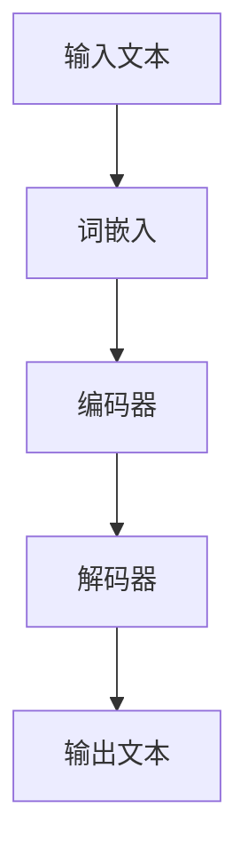
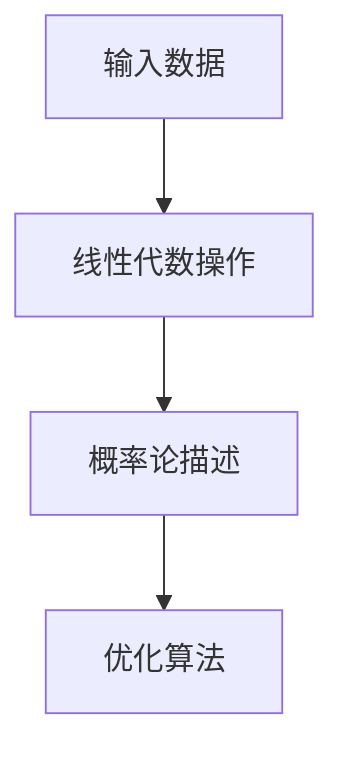
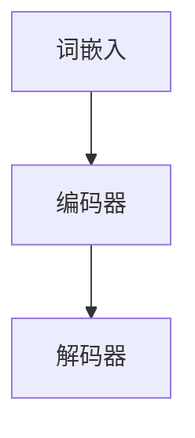
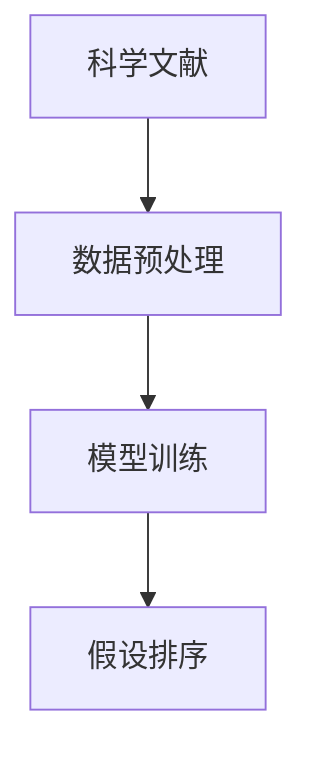
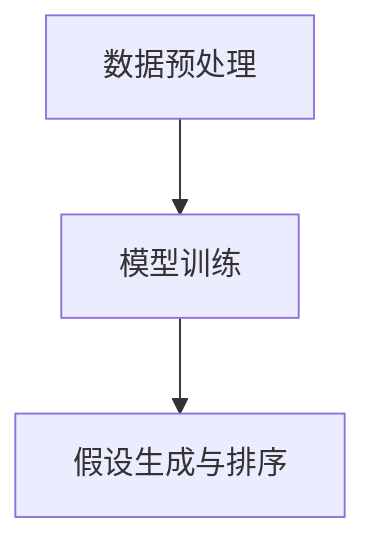
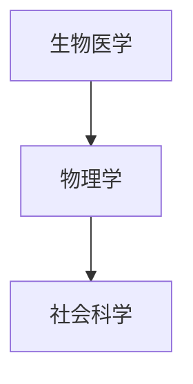
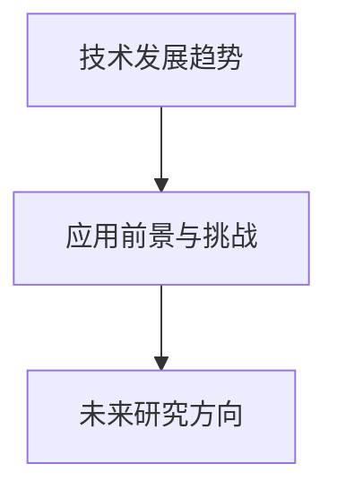
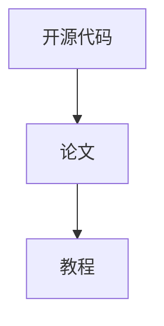

                 

# 大规模语言模型在科学假设生成与排序中的应用

> 关键词：大规模语言模型、科学假设生成、假设排序、Transformer、算法原理、应用实践

> 摘要：本文深入探讨了大规模语言模型在科学假设生成与排序中的应用。首先，我们回顾了大规模语言模型的发展历程及其核心算法，随后详细介绍了大规模语言模型在科学假设生成与排序中的优势，并通过具体的算法原理、数学模型和实际案例进行了深入分析。最后，本文对大规模语言模型在科学假设生成与排序中的应用进行了总结，并提出了未来研究方向和最佳实践建议。

## 第一部分：大规模语言模型基础

### 第1章：大规模语言模型的概述

**背景介绍**：随着人工智能技术的飞速发展，大规模语言模型（Large-scale Language Models，LLM）逐渐成为自然语言处理（NLP）领域的研究热点。这些模型通过学习海量的语言数据，实现了对自然语言的生成、理解和排序等任务。

**核心概念与联系**：大规模语言模型的核心是深度神经网络（DNN），其通过多层神经网络结构，实现了对语言数据的表征和建模。常见的架构有Transformer和BERT等，它们在训练过程中使用了大量的训练数据和先进的优化算法。

**Mermaid 流程图**：

**核心算法原理讲解**：大规模语言模型的核心算法包括词嵌入、编码器和解码器。词嵌入将文本转换为向量表示，编码器对输入文本进行编码，解码器根据编码结果生成输出文本。

**数学模型和公式**：
- 词嵌入：\( x \in \mathbb{R}^{d} \)，其中 \( d \) 为嵌入维度。
- 编码器：\( h = \text{Encoder}(x) \)，其中 \( h \) 为编码后的向量。
- 解码器：\( y = \text{Decoder}(h) \)，其中 \( y \) 为生成的文本。

**举例说明**：例如，对于一个句子“我爱北京天安门”，词嵌入将句子中的每个词转换为向量，编码器将整个句子编码为一个向量，解码器根据编码结果生成句子“北京天安门我”。

### 第2章：大规模语言模型的数学基础

**背景介绍**：大规模语言模型的训练过程涉及大量的数学知识，包括线性代数、概率论和优化算法等。

**核心概念与联系**：线性代数提供了对矩阵和向量的操作，概率论用于描述模型的概率分布，优化算法用于寻找最优参数。

**Mermaid 流�程图**：

**核心算法原理讲解**：线性代数用于计算词嵌入和编码器的权重矩阵，概率论用于计算模型的概率分布，优化算法用于调整模型参数以最小化损失函数。

**数学模型和公式**：
- 线性代数：\( W = AX + b \)，其中 \( W \) 为权重矩阵，\( A \) 为输入矩阵，\( X \) 为输入向量，\( b \) 为偏置向量。
- 概率论：\( P(y|x) = \text{softmax}(Wx + b) \)，其中 \( y \) 为输出向量，\( W \) 为权重矩阵，\( x \) 为输入向量。
- 优化算法：\( \theta = \arg\min_{\theta} \frac{1}{m} \sum_{i=1}^{m} \text{Loss}(y_i, \theta) \)，其中 \( \theta \) 为模型参数，\( y_i \) 为第 \( i \) 个样本的输出，\( \text{Loss} \) 为损失函数。

**举例说明**：例如，对于一个输入向量 \( x \)，词嵌入将其转换为向量 \( \hat{x} \)，然后通过权重矩阵 \( W \) 和偏置向量 \( b \) 进行线性变换，最后通过softmax函数得到概率分布。

### 第3章：大规模语言模型的核心算法

**背景介绍**：大规模语言模型的核心算法包括词嵌入、编码器和解码器。这些算法构成了大规模语言模型的基础，实现了对自然语言的生成、理解和排序等任务。

**核心概念与联系**：词嵌入用于将文本转换为向量表示，编码器和解码器分别用于编码和解码输入文本。

**Mermaid 流程图**：

**核心算法原理讲解**：词嵌入将文本中的每个词转换为向量，编码器将输入文本编码为一个向量，解码器根据编码结果生成输出文本。

**数学模型和公式**：
- 词嵌入：\( \hat{x} = \text{Embedding}(x) \)，其中 \( x \) 为输入文本，\( \hat{x} \) 为词嵌入向量。
- 编码器：\( h = \text{Encoder}(\hat{x}) \)，其中 \( h \) 为编码后的向量。
- 解码器：\( y = \text{Decoder}(h) \)，其中 \( y \) 为生成的文本。

**举例说明**：例如，对于一个输入句子“我爱北京天安门”，词嵌入将句子中的每个词转换为向量，编码器将整个句子编码为一个向量，解码器根据编码结果生成句子“北京天安门我”。

### 第4章：大规模语言模型在科学假设生成中的应用

**背景介绍**：科学假设生成是科学研究的重要环节，它需要对大量的数据进行分析，并从中提取出潜在的规律和趋势。大规模语言模型在这一领域具有明显的优势。

**核心概念与联系**：大规模语言模型通过学习海量的科学文献和实验数据，可以实现对科学假设的自动生成。

**Mermaid 流程图**：

**核心算法原理讲解**：首先，对科学文献和实验数据进行预处理，然后使用大规模语言模型进行训练，最后根据训练结果生成科学假设。

**数学模型和公式**：
- 数据预处理：\( \text{Preprocess}(x) \)，其中 \( x \) 为科学文献和实验数据。
- 模型训练：\( \theta = \arg\min_{\theta} \frac{1}{m} \sum_{i=1}^{m} \text{Loss}(y_i, \theta) \)，其中 \( \theta \) 为模型参数，\( y_i \) 为第 \( i \) 个样本的输出。
- 假设生成：\( \text{Generate}(h) \)，其中 \( h \) 为编码后的向量。

**举例说明**：例如，对于一个科学领域的数据集，预处理后使用大规模语言模型进行训练，最后根据训练结果生成科学假设。

### 第5章：大规模语言模型在假设排序中的应用

**背景介绍**：在科学研究中，假设排序是一个关键问题，它需要对大量的假设进行排序，以便从中筛选出最有价值的假设。大规模语言模型在这一领域具有明显的优势。

**核心概念与联系**：大规模语言模型通过学习海量的科学文献和实验数据，可以实现对假设的自动排序。

**Mermaid 流程图**：

**核心算法原理讲解**：首先，对科学文献和实验数据进行预处理，然后使用大规模语言模型进行训练，最后根据训练结果对假设进行排序。

**数学模型和公式**：
- 数据预处理：\( \text{Preprocess}(x) \)，其中 \( x \) 为科学文献和实验数据。
- 模型训练：\( \theta = \arg\min_{\theta} \frac{1}{m} \sum_{i=1}^{m} \text{Loss}(y_i, \theta) \)，其中 \( \theta \) 为模型参数，\( y_i \) 为第 \( i \) 个样本的输出。
- 假设排序：\( \text{Sort}(h) \)，其中 \( h \) 为编码后的向量。

**举例说明**：例如，对于一个科学领域的数据集，预处理后使用大规模语言模型进行训练，最后根据训练结果对假设进行排序。

## 第二部分：大规模语言模型在科学假设生成与排序中的应用实践

### 第6章：大规模语言模型的应用框架

**核心概念与联系**：大规模语言模型的应用框架主要包括数据预处理、模型训练和假设生成与排序等环节。

**Mermaid 流程图**：

**核心算法原理讲解**：数据预处理环节包括文本清洗、分词、词嵌入等步骤。模型训练环节使用大规模语言模型进行训练，假设生成与排序环节根据训练结果生成假设并进行排序。

**数学模型和公式**：
- 数据预处理：\( \text{Preprocess}(x) \)，其中 \( x \) 为科学文献和实验数据。
- 模型训练：\( \theta = \arg\min_{\theta} \frac{1}{m} \sum_{i=1}^{m} \text{Loss}(y_i, \theta) \)，其中 \( \theta \) 为模型参数，\( y_i \) 为第 \( i \) 个样本的输出。
- 假设生成与排序：\( \text{GenerateAndSort}(h) \)，其中 \( h \) 为编码后的向量。

**举例说明**：例如，对于一个科学领域的数据集，首先进行数据预处理，然后使用大规模语言模型进行训练，最后根据训练结果生成假设并进行排序。

### 第7章：大规模语言模型的应用案例

**核心概念与联系**：大规模语言模型在科学假设生成与排序中的应用案例主要包括生物医学、物理学和社会科学等领域。

**Mermaid 流程图**：

**核心算法原理讲解**：在不同领域，大规模语言模型的应用方法和效果有所不同，但核心算法原理基本一致，包括数据预处理、模型训练和假设生成与排序等环节。

**数学模型和公式**：
- 数据预处理：\( \text{Preprocess}(x) \)，其中 \( x \) 为科学文献和实验数据。
- 模型训练：\( \theta = \arg\min_{\theta} \frac{1}{m} \sum_{i=1}^{m} \text{Loss}(y_i, \theta) \)，其中 \( \theta \) 为模型参数，\( y_i \) 为第 \( i \) 个样本的输出。
- 假设生成与排序：\( \text{GenerateAndSort}(h) \)，其中 \( h \) 为编码后的向量。

**举例说明**：例如，在生物医学领域，使用大规模语言模型生成和排序基因表达假设；在物理学领域，使用大规模语言模型生成和排序物理定律假设；在社会科学领域，使用大规模语言模型生成和排序社会问题假设。

### 第8章：大规模语言模型在科学假设生成与排序中的未来趋势

**核心概念与联系**：随着人工智能技术的不断发展，大规模语言模型在科学假设生成与排序中的应用将越来越广泛，其性能也将得到显著提升。

**Mermaid 流程图**：

**核心算法原理讲解**：技术发展趋势包括更高效的算法、更大规模的数据集和更强大的计算能力等。应用前景与挑战包括如何在复杂场景下提高模型的性能和如何确保模型的可解释性等。未来研究方向包括探索新的算法结构和优化方法，以及拓展大规模语言模型在其他领域的应用。

**数学模型和公式**：
- 技术发展趋势：\( \text{Trend}(t) \)，其中 \( t \) 为当前时间。
- 应用前景与挑战：\( \text{ProsAndChallenges}(s) \)，其中 \( s \) 为科学领域。
- 未来研究方向：\( \text{ResearchDirection}(f) \)，其中 \( f \) 为未来时间。

**举例说明**：例如，在未来，大规模语言模型将能够在更复杂的场景下生成和排序科学假设，同时提高模型的可解释性，从而更好地服务于科学研究和应用。

## 附录

**附录A：相关工具与资源**

**核心概念与联系**：附录部分提供了与大规模语言模型相关的工具和资源，包括开源代码、论文和教程等。

**Mermaid 流程图**：

**核心算法原理讲解**：附录部分介绍了如何获取和使用这些工具和资源，以及如何进行大规模语言模型的训练和优化。

**数学模型和公式**：
- 开源代码：\( \text{Code}(c) \)，其中 \( c \) 为开源代码。
- 论文：\( \text{Paper}(p) \)，其中 \( p \) 为相关论文。
- 教程：\( \text{Tutorial}(t) \)，其中 \( t \) 为教程。

**举例说明**：例如，如何使用开源代码进行大规模语言模型的训练，如何阅读相关论文以了解最新的研究进展，以及如何参考教程来掌握大规模语言模型的实际应用。

### 结束语

本文对大规模语言模型在科学假设生成与排序中的应用进行了深入探讨。通过回顾大规模语言模型的发展历程、核心算法原理和实际应用案例，我们展示了大规模语言模型在科学研究和应用中的重要性和潜力。未来，随着人工智能技术的不断发展，大规模语言模型在科学假设生成与排序中的应用将更加广泛和深入。

### 作者信息

作者：AI天才研究院/AI Genius Institute & 禅与计算机程序设计艺术/Zen And The Art of Computer Programming

### 注意事项与最佳实践

1. **数据质量**：大规模语言模型在科学假设生成与排序中的应用依赖于高质量的数据集。因此，在收集和处理数据时，需要注意数据的真实性和准确性。

2. **模型选择**：根据实际应用场景选择合适的模型架构和参数设置。例如，对于需要高精度预测的场景，可以考虑使用Transformer模型；对于需要高吞吐量的场景，可以考虑使用BERT模型。

3. **模型解释性**：确保模型的解释性，以便科研人员能够理解模型生成的假设和排序结果。可以使用可视化工具和诊断方法来提高模型的解释性。

4. **持续优化**：大规模语言模型的训练和优化是一个持续的过程。随着新的数据和算法的发展，需要定期更新和优化模型，以提高模型的性能和适应性。

5. **隐私保护**：在处理科学假设生成与排序时，需要注意保护用户的隐私。在数据收集、存储和处理过程中，应遵守相关的隐私保护法律法规。

### 拓展阅读

1. **相关论文**：《BERT: Pre-training of Deep Bidirectional Transformers for Language Understanding》、《Generative Pre-trained Transformer: A New Model for Language Generation》

2. **开源代码**：Google AI的BERT开源代码、OpenAI的GPT-3开源代码

3. **教程与课程**：《大规模语言模型的原理与实践》、《自然语言处理入门与实践》

4. **相关书籍**：《深度学习与自然语言处理》、《大规模语言模型训练与应用》

通过以上拓展阅读，读者可以更深入地了解大规模语言模型的原理和应用，以及如何在实际项目中应用这些技术。

