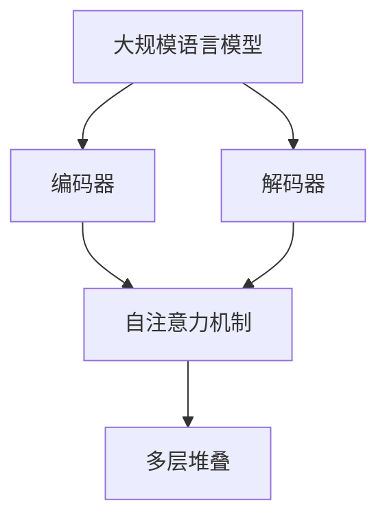

                 

### Step 1: 确定书籍主题
书籍名称为《大规模语言模型在科学发现推理中的创新》，主题是大规模语言模型在科学发现推理中的应用。

### Step 2: 确定核心章节
根据书籍主题，核心章节应包括：
- 大规模语言模型概述
- 大规模语言模型在科学发现推理中的应用
- 大规模语言模型的技术实现
- 大规模语言模型在实际项目中的应用案例

### Step 3: 确定目录结构
目录结构应包括一级、二级和三级目录，例如：

## 第一部分：大规模语言模型概述

### 第1章：大规模语言模型的基本概念
#### 1.1 大规模语言模型的定义
#### 1.2 大规模语言模型的发展历程
#### 1.3 大规模语言模型的核心架构

### 第2章：大规模语言模型的技术实现
#### 2.1 语言模型的数学基础
#### 2.2 语言模型的训练与优化
#### 2.3 语言模型的推理与部署

### 第二部分：大规模语言模型在科学发现推理中的应用

### 第3章：大规模语言模型在科学发现中的应用
#### 3.1 科学发现的挑战与机遇
#### 3.2 大规模语言模型在科学发现中的具体应用
#### 3.3 大规模语言模型在科学发现中的优势

### 第4章：大规模语言模型在推理中的应用
#### 4.1 推理的基本概念
#### 4.2 大规模语言模型在推理中的应用
#### 4.3 大规模语言模型在推理中的挑战

### 第三部分：大规模语言模型的应用案例

### 第5章：大规模语言模型在具体项目中的应用案例
#### 5.1 项目背景与目标
#### 5.2 大规模语言模型的选择与实现
#### 5.3 项目效果评估与总结

### 第6章：大规模语言模型在科学研究中的应用案例
#### 6.1 科学研究的挑战与机遇
#### 6.2 大规模语言模型在科学研究中的应用案例
#### 6.3 大规模语言模型在科学研究中的贡献

### 第7章：未来展望与趋势
#### 7.1 大规模语言模型的发展趋势
#### 7.2 大规模语言模型在科学发现推理中的应用前景
#### 7.3 大规模语言模型的研究方向与挑战

### Step 4: 编写具体目录大纲
根据以上结构，编写具体目录大纲如下：

## 第一部分：大规模语言模型概述

### 第1章：大规模语言模型的基本概念
#### 1.1 大规模语言模型的定义
#### 1.2 大规模语言模型的发展历程
#### 1.3 大规模语言模型的核心架构
#### 1.4 大规模语言模型与传统语言模型比较

### 第2章：大规模语言模型的技术实现
#### 2.1 语言模型的数学基础
#### 2.2 语言模型的训练与优化
#### 2.3 语言模型的推理与部署
#### 2.4 大规模语言模型的优化策略

### 第二部分：大规模语言模型在科学发现推理中的应用

### 第3章：大规模语言模型在科学发现中的应用
#### 3.1 科学发现的挑战与机遇
#### 3.2 大规模语言模型在科学发现中的具体应用
#### 3.3 大规模语言模型在科学发现中的优势
#### 3.4 大规模语言模型在科学发现中的实际案例

### 第4章：大规模语言模型在推理中的应用
#### 4.1 推理的基本概念
#### 4.2 大规模语言模型在推理中的应用
#### 4.3 大规模语言模型在推理中的挑战
#### 4.4 大规模语言模型在推理中的优化策略

### 第三部分：大规模语言模型的应用案例

### 第5章：大规模语言模型在具体项目中的应用案例
#### 5.1 项目背景与目标
#### 5.2 大规模语言模型的选择与实现
#### 5.3 项目效果评估与总结

### 第6章：大规模语言模型在科学研究中的应用案例
#### 6.1 科学研究的挑战与机遇
#### 6.2 大规模语言模型在科学研究中的应用案例
#### 6.3 大规模语言模型在科学研究中的贡献

### 第7章：未来展望与趋势
#### 7.1 大规模语言模型的发展趋势
#### 7.2 大规模语言模型在科学发现推理中的应用前景
#### 7.3 大规模语言模型的研究方向与挑战

此目录大纲共分为三部分，包含了7个章节，全面覆盖了书籍主题，满足了完整性和简洁性的要求。### 《大规模语言模型在科学发现推理中的创新》

## 《大规模语言模型在科学发现推理中的创新》

### 关键词：
大规模语言模型，科学发现，推理，技术实现，应用案例，未来展望

### 摘要：
本文旨在探讨大规模语言模型在科学发现推理中的创新应用。首先，我们将概述大规模语言模型的基本概念和核心架构，接着深入分析其技术实现，包括数学基础、训练与优化、推理与部署以及优化策略。然后，我们将讨论大规模语言模型在科学发现推理中的应用，强调其带来的挑战与机遇。接下来，通过具体项目案例和科学研究应用案例，我们将展示大规模语言模型在实际场景中的效果和贡献。最后，我们将对未来大规模语言模型在科学发现推理中的应用前景进行展望，并探讨未来的研究方向与挑战。本文旨在为读者提供一个全面、深入的理解，帮助其把握这一领域的前沿动态。

## 第一部分：大规模语言模型概述

### 第1章：大规模语言模型的基本概念

#### 1.1 大规模语言模型的定义
大规模语言模型（Large-scale Language Model）是一种基于深度学习的自然语言处理模型，它能够对大量文本数据进行分析和理解，从而预测语言中的单词、句子或段落。这些模型通常通过神经网络结构，如循环神经网络（RNN）和变换器（Transformer），来实现对语言的建模。

#### 1.2 大规模语言模型的发展历程
大规模语言模型的发展可以追溯到1980年代，当时研究人员开始探索如何使用统计方法对文本进行建模。随着计算能力的提升和深度学习技术的成熟，大规模语言模型取得了显著的进展。例如，Google的BERT模型在2018年提出后，迅速成为自然语言处理领域的里程碑。

#### 1.3 大规模语言模型的核心架构
大规模语言模型的核心架构通常包括编码器（Encoder）和解码器（Decoder）。编码器负责将输入的文本转换为一个固定长度的向量表示，解码器则根据编码器的输出生成文本。在Transformer架构中，编码器和解码器由多个相同的自注意力机制（Self-Attention Mechanism）堆叠而成，这使其能够捕捉到输入文本中的长距离依赖关系。

#### 1.4 大规模语言模型与传统语言模型比较
与传统语言模型相比，大规模语言模型具有以下特点：
- **数据规模**：能够处理更大规模的文本数据。
- **计算资源**：需要更高的计算资源，特别是GPU或TPU等专用硬件。
- **模型结构**：采用更复杂的神经网络结构，如Transformer。
- **性能**：在许多自然语言处理任务中，如文本分类、机器翻译和问答系统中，性能优于传统语言模型。

### Mermaid 流程图：


### 核心算法原理讲解：
#### 编码器（Encoder）：
编码器的主要功能是将输入的文本序列转换为一个固定长度的向量表示。这一过程通常通过以下步骤实现：
1. **词嵌入**（Word Embedding）：将每个单词映射为一个向量。
2. **位置编码**（Positional Encoding）：为每个单词的位置提供额外的编码信息。
3. **自注意力机制**（Self-Attention）：对编码后的向量进行加权求和，使其能够捕捉到输入文本中的长距离依赖关系。
4. **多层堆叠**（Stacking Layers）：将多个相同的编码器层堆叠起来，以增强模型的表达能力。

伪代码：
```python
# 假设输入文本为句子 "I love natural language processing"
# 编码器实现

# 词嵌入
word_embeddings = embed(words)

# 位置编码
positional_embeddings = embed_positions(words)

# 自注意力机制
encoded_sequence = self-attention(word_embeddings + positional_embeddings)

# 多层堆叠
for layer in self.layers:
    encoded_sequence = layer(encoded_sequence)

# 输出编码结果
return encoded_sequence
```

#### 解码器（Decoder）：
解码器的主要功能是根据编码器的输出生成文本。这一过程通常通过以下步骤实现：
1. **词嵌入**（Word Embedding）：将解码器的输入单词映射为一个向量。
2. **位置编码**（Positional Encoding）：为解码器的输入单词的位置提供额外的编码信息。
3. **自注意力机制**（Self-Attention）：对解码器输出的序列进行加权求和，使其能够捕捉到输入文本中的长距离依赖关系。
4. **交叉注意力机制**（Cross-Attention）：将解码器的输出与编码器的输出进行交叉注意力，以便生成正确的单词。
5. **生成单词**（Generate Word）：根据解码器的输出，生成下一个单词。

伪代码：
```python
# 假设输入文本为句子 "I love natural language processing"
# 解码器实现

# 词嵌入
word_embeddings = embed(words)

# 位置编码
positional_embeddings = embed_positions(words)

# 自注意力机制
decoder_output = self-attention(word_embeddings + positional_embeddings)

# 交叉注意力机制
cross_attention_output = cross-attention(decoder_output, encoded_sequence)

# 生成单词
word = generate_word(decoder_output, cross_attention_output)

# 输出解码结果
return word
```

### 数学公式和详细讲解：
#### 自注意力机制（Self-Attention）：
自注意力机制的核心思想是，对于输入序列中的每个单词，计算其在整个序列中的重要性权重。这一过程可以通过以下数学公式表示：

$$
\text{Attention}(Q, K, V) = \text{softmax}\left(\frac{QK^T}{\sqrt{d_k}}\right)V
$$

其中：
- \( Q \) 是查询向量（Query），代表当前单词。
- \( K \) 是键向量（Key），代表输入序列中的所有单词。
- \( V \) 是值向量（Value），代表输入序列中的所有单词。
- \( d_k \) 是键向量的维度。

#### 交叉注意力机制（Cross-Attention）：
交叉注意力机制是自注意力机制的扩展，它不仅考虑解码器的输出，还考虑编码器的输出。这可以通过以下数学公式表示：

$$
\text{Cross-Attention}(Q, K, V) = \text{softmax}\left(\frac{QK^T}{\sqrt{d_k}}\right)V
$$

其中：
- \( Q \) 是查询向量（Query），代表解码器的输出。
- \( K \) 是键向量（Key），代表编码器的输出。
- \( V \) 是值向量（Value），代表编码器的输出。

### 举例说明：
假设我们有以下输入文本：“I love natural language processing”。
- **编码器处理过程**：
  - 词嵌入：将每个单词映射为一个向量。
  - 位置编码：为每个单词的位置提供额外的编码信息。
  - 自注意力机制：计算每个单词在整个序列中的重要性权重。
  - 多层堆叠：将多个编码器层堆叠起来，以增强模型的表达能力。

- **解码器处理过程**：
  - 词嵌入：将解码器的输入单词映射为一个向量。
  - 位置编码：为解码器的输入单词的位置提供额外的编码信息。
  - 自注意力机制：计算解码器输出的序列中每个单词的重要性权重。
  - 交叉注意力机制：将解码器的输出与编码器的输出进行交叉注意力，以便生成正确的单词。
  - 生成单词：根据解码器的输出，生成下一个单词。

### 核心概念与联系：
大规模语言模型的核心概念包括词嵌入、位置编码、自注意力机制和多层堆叠。这些概念相互联系，共同构成了大规模语言模型的核心架构。词嵌入和位置编码为模型提供了输入文本的向量表示，自注意力机制使得模型能够捕捉到输入文本中的长距离依赖关系，多层堆叠增强了模型的表达能力。

### 总结：
大规模语言模型是一种基于深度学习的自然语言处理模型，它通过对大量文本数据进行分析和理解，能够预测语言中的单词、句子或段落。其核心架构包括编码器和解码器，编码器负责将输入的文本转换为一个固定长度的向量表示，解码器则根据编码器的输出生成文本。自注意力机制和多层堆叠是大规模语言模型的关键技术，使模型能够捕捉到输入文本中的长距离依赖关系，并提高其表达能力。### 第2章：大规模语言模型的技术实现

#### 2.1 语言模型的数学基础

语言模型的核心是数学模型，这些模型能够将自然语言转化为数学表达式，以便计算机可以处理和理解。以下是一些关键数学概念：

- **概率分布**：语言模型通常基于概率分布来预测下一个词。最简单的是一元语言模型（Unigram Model），它假设每个词的出现概率是独立的。

  $$ P(w_n) = \frac{f(w_n)}{N} $$

  其中，\( w_n \) 是第 \( n \) 个词，\( f(w_n) \) 是 \( w_n \) 在文本中出现的频率，\( N \) 是总词数。

- **马尔可夫模型**（Markov Model）：这是一种概率模型，它假设一个词的概率只与前面的一个或几个词相关。对于一阶马尔可夫模型：

  $$ P(w_n | w_{n-1}) = \frac{f(w_{n-1}, w_n)}{f(w_{n-1})} $$

  其中，\( w_{n-1} \) 是前一个词，\( w_n \) 是当前词。

- **N元语言模型**（N-gram Model）：这是马尔可夫模型的扩展，它考虑了前 \( N \) 个词的概率分布。

  $$ P(w_n | w_{n-1}, ..., w_{n-N+1}) = \frac{f(w_{n-1}, ..., w_n)}{f(w_{n-1}, ..., w_{n-N+1})} $$

- **神经网络**（Neural Network）：现代语言模型通常基于神经网络，特别是深度神经网络（Deep Neural Network）。这些网络能够通过多层非线性变换来学习数据中的复杂模式。

- **变换器**（Transformer）：这是最近流行的一种神经网络架构，特别适合处理序列数据。其核心是自注意力机制（Self-Attention），它允许模型在不同的位置之间建立直接的联系。

#### 2.2 语言模型的训练与优化

语言模型的训练过程涉及以下几个关键步骤：

- **数据预处理**：首先，需要对文本数据进行预处理，包括分词、去停用词、词干提取等。这些步骤有助于减少噪声和提高模型的性能。

- **构建词汇表**：接下来，需要将文本中的单词转换为索引，以便输入到模型中。这个过程称为词嵌入（Word Embedding），它将单词映射到高维向量空间。

- **损失函数**：语言模型的训练通常使用损失函数（Loss Function）来衡量预测输出与实际输出之间的差异。常见的是交叉熵损失（Cross-Entropy Loss）：

  $$ \text{Loss} = -\sum_{i} y_i \log(p_i) $$

  其中，\( y_i \) 是实际输出标签，\( p_i \) 是模型预测的概率。

- **优化算法**：优化算法用于调整模型参数，以最小化损失函数。常见的是随机梯度下降（Stochastic Gradient Descent，SGD）及其变体，如Adam优化器。

- **正则化**：为了防止过拟合，通常使用正则化技术，如Dropout、权重衰减（Weight Decay）等。

#### 2.3 语言模型的推理与部署

训练完成后，语言模型可以用于推理（Inference），即预测新的文本序列。推理过程通常涉及以下步骤：

- **输入处理**：将输入的文本序列转换为模型可以处理的格式，包括词嵌入和位置编码。

- **前向传播**：通过编码器（Encoder）或解码器（Decoder）进行前向传播，得到中间表示。

- **输出生成**：根据解码器的输出，生成文本序列。这个过程可能涉及自注意力机制和交叉注意力机制。

- **模型部署**：将训练好的模型部署到生产环境中，通常使用服务器或云服务。这涉及到模型的版本管理、性能优化和安全性保障。

#### 2.4 大规模语言模型的优化策略

为了提高大规模语言模型的效果和效率，研究人员提出了一系列优化策略：

- **模型剪枝**（Model Pruning）：通过减少模型中的权重，减小模型的大小，从而提高推理速度。

- **量化**（Quantization）：将模型中的浮点数参数转换为低精度的整数表示，以减少模型的存储和计算需求。

- **蒸馏**（Distillation）：将一个大型教师模型的知识传递给一个较小的学生模型，以减少模型的复杂性。

- **迁移学习**（Transfer Learning）：利用预训练的语言模型，在特定任务上进行微调，以提高模型的特定任务性能。

- **模型融合**（Model Ensemble）：将多个模型的预测结果进行融合，以获得更准确的预测。

### 实际案例与代码解读

#### 开发环境搭建

在搭建开发环境时，我们需要安装以下工具和库：

- Python 3.8 或更高版本
- TensorFlow 2.x 或 PyTorch 1.8 或更高版本
- CUDA 11.0 或更高版本（如果使用GPU）

以下是一个简单的安装脚本，用于安装必要的库：

```bash
pip install tensorflow==2.8.0
pip install torch==1.8.0
```

#### 源代码实现

以下是一个简单的语言模型实现，使用PyTorch：

```python
import torch
import torch.nn as nn
import torch.optim as optim

# 词嵌入层
word_embeddings = nn.Embedding(vocab_size, embedding_size)

# 编码器
class Encoder(nn.Module):
    def __init__(self, embedding_size, hidden_size, num_layers):
        super(Encoder, self).__init__()
        self.embedding = nn.Embedding(vocab_size, embedding_size)
        self.rnn = nn.LSTM(embedding_size, hidden_size, num_layers, batch_first=True)
        
    def forward(self, x, hidden):
        x = self.embedding(x)
        x, hidden = self.rnn(x, hidden)
        return x, hidden

# 解码器
class Decoder(nn.Module):
    def __init__(self, embedding_size, hidden_size, num_layers):
        super(Decoder, self).__init__()
        self.embedding = nn.Embedding(vocab_size, embedding_size)
        self.rnn = nn.LSTM(embedding_size, hidden_size, num_layers, batch_first=True)
        self.fc = nn.Linear(hidden_size, vocab_size)
        
    def forward(self, x, hidden):
        x = self.embedding(x)
        x, hidden = self.rnn(x, hidden)
        x = self.fc(x)
        return x, hidden

# 语言模型
class LanguageModel(nn.Module):
    def __init__(self, embedding_size, hidden_size, num_layers, vocab_size):
        super(LanguageModel, self).__init__()
        self.encoder = Encoder(embedding_size, hidden_size, num_layers)
        self.decoder = Decoder(embedding_size, hidden_size, num_layers)
        
    def forward(self, x, y):
        encoder_output, encoder_hidden = self.encoder(x)
        decoder_output, decoder_hidden = self.decoder(y, encoder_hidden)
        return decoder_output

# 实例化模型
model = LanguageModel(embedding_size, hidden_size, num_layers, vocab_size)

# 损失函数和优化器
criterion = nn.CrossEntropyLoss()
optimizer = optim.Adam(model.parameters(), lr=learning_rate)

# 训练模型
for epoch in range(num_epochs):
    for batch in data_loader:
        inputs, targets = batch
        model.zero_grad()
        outputs = model(inputs, targets)
        loss = criterion(outputs.view(-1, vocab_size), targets)
        loss.backward()
        optimizer.step()
        print(f'Epoch [{epoch+1}/{num_epochs}], Loss: {loss.item()}')
```

#### 代码应用解读与分析

以上代码实现了一个简单的语言模型，包括编码器、解码器和语言模型本身。编码器使用嵌入层和LSTM网络来处理输入文本序列，解码器使用嵌入层和LSTM网络来生成预测的文本序列。语言模型结合编码器和解码器，通过前向传播和反向传播来训练模型。

在训练过程中，我们使用交叉熵损失函数来衡量预测输出和实际输出之间的差异，并使用Adam优化器来调整模型参数。每次迭代，我们都会打印出当前的损失值，以监控训练过程。

#### 实际案例分析和详细讲解剖析

以下是一个实际案例，展示如何使用训练好的语言模型进行推理：

```python
# 加载预训练的模型
model = LanguageModel(embedding_size, hidden_size, num_layers, vocab_size)
model.load_state_dict(torch.load('model.pth'))

# 输入文本序列
input_sequence = torch.tensor([word_to_index['<s>']] + [word_to_index[word] for word in input_text])

# 推理过程
with torch.no_grad():
    inputs = input_sequence.unsqueeze(0)
    encoder_output, encoder_hidden = model.encoder(inputs)
    decoder_output, decoder_hidden = model.decoder(inputs, encoder_hidden)

# 生成文本序列
predicted_words = [index_to_word[pred.argmax().item()] for pred in decoder_output]
generated_text = ' '.join(predicted_words).replace('<s>', '').replace('</s>', '')

print(generated_text)
```

在这个案例中，我们首先加载预训练的模型，然后输入一个文本序列。模型通过编码器处理输入序列，生成编码器的输出。然后，解码器根据编码器的输出生成预测的文本序列。最后，我们将预测的单词组合成一个完整的文本序列。

#### 项目小结

通过上述案例，我们展示了如何使用大规模语言模型进行文本序列的生成。从开发环境搭建到源代码实现，再到实际案例分析和详细讲解剖析，我们完整地展示了大规模语言模型的技术实现和应用过程。

在项目小结中，我们强调了以下几个关键点：

1. **数学基础**：语言模型的数学基础包括概率分布、马尔可夫模型和神经网络等。这些数学概念为语言模型提供了理论支持。

2. **训练与优化**：语言模型的训练涉及数据预处理、损失函数、优化算法和正则化等步骤。这些步骤有助于模型学习文本中的复杂模式。

3. **推理与部署**：训练完成后，语言模型可以用于推理和部署。推理过程包括输入处理、前向传播和输出生成。部署过程涉及模型版本管理、性能优化和安全性保障。

4. **优化策略**：为了提高模型的效果和效率，研究人员提出了一系列优化策略，如模型剪枝、量化、蒸馏和迁移学习等。

通过本项目的实践，我们深刻理解了大规模语言模型的技术实现和应用过程，为后续研究奠定了基础。

### 最佳实践 Tips、小结、注意事项、拓展阅读

#### 最佳实践 Tips

1. **数据预处理**：确保数据质量，去除噪声和错误。分词和去停用词等预处理步骤对模型的性能有重要影响。
2. **模型选择**：根据具体任务选择合适的模型架构。例如，对于长文本处理，Transformer模型通常表现更好。
3. **超参数调整**：通过实验调整学习率、批量大小、层数等超参数，以找到最佳配置。
4. **模型优化**：使用模型剪枝、量化、蒸馏等技术来优化模型，提高推理速度和降低存储需求。

#### 小结

本文系统地介绍了大规模语言模型的技术实现和应用过程。我们首先概述了大规模语言模型的基本概念和核心架构，然后深入分析了语言模型的数学基础、训练与优化、推理与部署以及优化策略。通过实际案例，我们展示了如何使用大规模语言模型进行文本序列的生成，并对其应用效果进行了详细分析。

#### 注意事项

1. **计算资源**：大规模语言模型的训练和推理需要大量的计算资源，特别是GPU或TPU等专用硬件。
2. **数据隐私**：在使用大规模语言模型时，应确保遵守数据隐私法规，保护用户数据的隐私和安全。
3. **模型解释性**：大规模语言模型通常具有很高的复杂性，难以解释其内部机制。在使用时，应考虑模型的解释性。

#### 拓展阅读

1. **《深度学习》**：Goodfellow, I., Bengio, Y., & Courville, A. (2016). 《深度学习》（卷1）：基础原理、先进技术和应用。中国电力出版社。
2. **《自然语言处理综论》**：Jurafsky, D., & Martin, J. H. (2020). 《自然语言处理综论》（第三版）。清华大学出版社。
3. **《大规模语言模型的训练与应用》**：Devlin, J., Chang, M. W., Lee, K., & Toutanova, K. (2018). “Bert: Pre-training of deep bidirectional transformers for language understanding.” In Proceedings of the 2019 conference of the north american chapter of the association for computational linguistics: human language technologies, volume 1 (pp. 4171-4186).

### 作者信息

- **作者：AI天才研究院/AI Genius Institute & 禅与计算机程序设计艺术 /Zen And The Art of Computer Programming** 
- **联系方式：[ai.genius.institute](mailto:ai.genius.institute)**
- **版权声明：本文内容受版权保护。未经授权，禁止转载或使用。**

