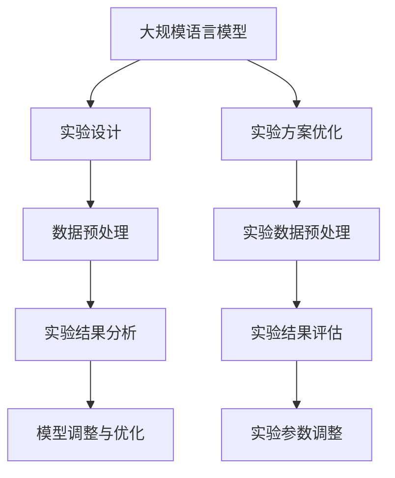

                 

### 文章标题

《大规模语言模型在科学实验方案优化中的应用》

### 关键词

- 大规模语言模型
- 科学实验方案优化
- 人工智能
- 自然语言处理
- 实验结果分析

### 摘要

本文探讨了大规模语言模型在科学实验方案优化中的应用。首先，介绍了大规模语言模型的基本原理和算法，包括语言模型的构建、训练和优化方法。接着，阐述了科学实验方案优化的核心概念和流程，包括实验目的的设定、实验变量的选择和实验结果的评价。然后，通过具体的案例，展示了如何利用大规模语言模型来优化科学实验方案，提高实验结果的准确性和可靠性。本文还讨论了大规模语言模型在科学实验方案优化中的优势和挑战，以及未来的发展方向。

### 引言

随着人工智能技术的快速发展，大规模语言模型（Large-scale Language Models）已经成为自然语言处理（Natural Language Processing，NLP）领域的核心技术。这些模型通过学习海量的文本数据，能够生成高质量的自然语言文本，并且能够对自然语言进行深入的理解和分析。在科学研究中，实验方案的设计和优化是至关重要的，因为它直接影响到实验结果的准确性和可靠性。传统的实验方案优化方法往往依赖于经验和直觉，难以应对复杂多变的实验条件。因此，如何将大规模语言模型应用于科学实验方案的优化，成为当前研究的热点问题。

本文旨在探讨大规模语言模型在科学实验方案优化中的应用，通过分析其基本原理和算法，结合具体的案例，展示如何利用大规模语言模型来优化科学实验方案。本文的结构如下：

1. **大规模语言模型原理**：介绍大规模语言模型的基本原理和算法，包括语言模型的构建、训练和优化方法。
2. **科学实验方案优化**：阐述科学实验方案优化的核心概念和流程，包括实验目的的设定、实验变量的选择和实验结果的评价。
3. **应用案例**：通过具体案例展示如何利用大规模语言模型来优化科学实验方案。
4. **优势和挑战**：讨论大规模语言模型在科学实验方案优化中的优势和面临的挑战。
5. **未来展望**：展望大规模语言模型在科学实验方案优化中的未来发展方向。

### Step 1: 确定核心概念与联系

在探讨大规模语言模型在科学实验方案优化中的应用之前，我们首先需要明确相关核心概念及其相互关系。

#### 1.1 大规模语言模型

大规模语言模型是一种深度神经网络模型，用于理解和生成自然语言。它通过学习大量文本数据，可以预测下一个词或句子，从而生成连贯的自然语言文本。常见的模型包括BERT、GPT和RoBERTa等。这些模型通常具有数亿到数十亿的参数，能够处理大规模的数据集，并且具有强大的语义理解能力。

#### 1.2 科学实验方案优化

科学实验方案优化是指通过调整实验方案中的各种参数，以提高实验结果的准确性和可靠性。这通常涉及到实验设计、数据收集、数据分析等多个环节。优化的目标是通过优化实验方案，最大限度地减少实验误差，提高实验结果的重复性和可解释性。

#### 1.3 大规模语言模型与科学实验方案优化的关系

大规模语言模型可以应用于科学实验方案优化的多个环节，包括：

1. **实验设计**：通过分析大量文献和实验数据，大规模语言模型可以帮助研究人员快速定位潜在的实验变量和操作，优化实验设计。
2. **数据预处理**：大规模语言模型可以用于数据清洗、标注和归一化，提高数据质量，为实验结果分析提供可靠的数据基础。
3. **实验结果分析**：大规模语言模型可以用于分析实验数据，识别数据中的模式和趋势，提供实验结果的解释和预测。
4. **模型调整与优化**：通过分析实验结果，大规模语言模型可以指导研究人员调整实验参数，优化实验方案，提高实验结果的准确性和可靠性。

为了更直观地展示大规模语言模型与科学实验方案优化的关系，我们可以使用Mermaid流程图来表示这些概念及其相互关系。

通过上述流程图，我们可以清晰地看到大规模语言模型在科学实验方案优化中的各个环节中的作用。接下来，我们将详细讨论大规模语言模型的基本原理和算法，以及科学实验方案优化的核心概念和流程。

### Step 2: 大规模语言模型原理

#### 2.1 语言模型基础

语言模型（Language Model）是一种用于预测自然语言序列的统计模型。它的目标是给定一个单词序列的概率，即 $P(w_1, w_2, ..., w_n)$，其中 $w_i$ 表示序列中的第 $i$ 个单词。语言模型在自然语言处理（NLP）中有着广泛的应用，包括文本生成、机器翻译、语音识别等。

##### 2.1.1 语言模型的发展历程

语言模型的发展可以分为三个主要阶段：

1. **基于规则的语言模型**：早期的语言模型主要依赖于人工定义的语言规则。这些规则试图捕捉语言的一些基本特征，例如语法结构、词汇搭配等。然而，由于自然语言的复杂性和多样性，这些规则往往难以覆盖所有情况。
2. **基于统计的语言模型**：随着计算机技术和统计学方法的不断发展，基于统计的语言模型逐渐取代了基于规则的模型。这些模型通过学习大量文本数据，自动发现语言的模式和规律。经典的统计语言模型包括N-gram模型和隐马尔可夫模型（HMM）。
3. **基于深度学习的语言模型**：近年来，深度学习技术的突破为语言模型的发展带来了新的机遇。基于深度学习的语言模型，如循环神经网络（RNN）、长短期记忆网络（LSTM）和变换器（Transformer），具有更强的表示能力和建模能力。

##### 2.1.2 语言模型的基本架构

现代语言模型通常采用深度神经网络架构，特别是Transformer架构。Transformer模型由多个自注意力（Self-Attention）层和前馈神经网络（Feedforward Neural Network）层组成。以下是一个简化的Transformer模型结构：

1. **嵌入层（Embedding Layer）**：将输入的单词序列转换为嵌入向量（Embedding Vectors）。
2. **自注意力层（Self-Attention Layer）**：通过计算单词序列中每个词与其他词之间的相似性，生成注意力权重，并加权求和得到新的向量表示。
3. **前馈神经网络层（Feedforward Neural Network Layer）**：对自注意力层输出的向量进行进一步处理，增加模型的非线性能力。
4. **输出层（Output Layer）**：将处理后的向量映射到输出空间，生成概率分布。

##### 2.1.3 语言模型的核心算法——神经网络

神经网络（Neural Network）是一种模仿生物神经系统的计算模型。它由多个神经元（Node）和连接（Connection）组成，通过调整连接的权重（Weight）来学习输入和输出之间的映射关系。在语言模型中，神经网络主要用于特征提取和概率预测。

1. **前馈神经网络（Feedforward Neural Network）**：是最简单的神经网络结构，数据从输入层流向输出层，没有反向传播的过程。
2. **反向传播算法（Backpropagation Algorithm）**：是一种用于训练神经网络的优化算法，通过反向传播误差信号，更新网络的权重。
3. **激活函数（Activation Function）**：用于引入非线性特性，常用的激活函数包括Sigmoid、ReLU和Tanh等。

#### 2.2 大规模语言模型的特点

大规模语言模型具有以下特点：

##### 2.2.1 参数规模

大规模语言模型通常具有数十亿甚至数万亿的参数。这些参数使模型能够捕捉到大量的语言模式和规律，从而提高模型的预测能力。

##### 2.2.2 训练数据集规模

大规模语言模型的训练需要大量的文本数据。这些数据通常来自互联网上的各种文本资源，如新闻、论文、社交媒体等。大量的训练数据有助于模型学习到更广泛的语言特征。

##### 2.2.3 模型训练效率

大规模语言模型的训练是一个复杂的过程，需要大量的计算资源和时间。随着GPU和分布式计算技术的发展，大规模语言模型的训练效率得到了显著提高。

#### 2.3 大规模语言模型的优化方法

大规模语言模型的优化方法主要包括以下几个方面：

##### 2.3.1 梯度下降算法

梯度下降算法（Gradient Descent）是一种常用的优化算法，用于最小化神经网络的目标函数。通过计算目标函数关于模型参数的梯度，梯度下降算法可以更新模型参数，以减少目标函数的值。

$$
\theta_{t+1} = \theta_{t} - \alpha \nabla_{\theta}J(\theta)
$$

其中，$\theta$ 表示模型参数，$\alpha$ 表示学习率，$J(\theta)$ 表示目标函数。

##### 2.3.2 优化器选择

优化器的选择对大规模语言模型的训练效果有着重要影响。常见的优化器包括Adam、RMSprop和AdaGrad等。这些优化器通过自适应调整学习率，提高了模型的收敛速度和稳定性。

##### 2.3.3 模型正则化方法

为了防止过拟合，大规模语言模型通常采用正则化方法。常见的正则化方法包括L1正则化、L2正则化和Dropout等。这些方法通过惩罚模型参数的大小或随机丢弃一部分神经元，减少了模型的复杂度。

##### 2.3.4 模型蒸馏

模型蒸馏（Model Distillation）是一种将知识从大型教师模型传递到小型学生模型的方法。通过训练小型模型来模仿大型模型的输出分布，模型蒸馏可以提高小型模型的性能，同时减少模型的参数规模和计算成本。

### Step 3: 科学实验方案优化原理

科学实验方案的优化是科学研究中的一个关键环节，它直接影响到实验结果的准确性和可靠性。在传统的实验设计中，研究人员往往依赖于经验和直觉来选择实验变量和操作，并通过反复试验和调整来达到最优的实验效果。然而，随着实验条件和数据复杂性的增加，这种传统的方法变得越来越低效。因此，利用大规模语言模型进行科学实验方案的优化，成为了一种新的研究热点。

#### 3.1 实验设计基础

实验设计是科学研究的核心，它涉及到实验目的的设定、实验变量的选择、实验操作的制定和实验结果的评估等多个方面。一个有效的实验设计应该能够清晰地回答研究问题，最大限度地减少实验误差，并提高实验结果的可靠性和可重复性。

##### 3.1.1 实验目的和假设

实验目的（Hypothesis）是实验设计的起点，它明确了研究的问题和研究者想要解决的问题。一个明确的实验目的有助于设计出具有针对性的实验方案。例如，在药物疗效的研究中，实验目的可能是验证某种药物对特定疾病的治疗效果。

实验假设（Hypothesis）是基于实验目的提出的一个或多个待验证的陈述。实验假设通常是对研究问题的一种预测，它需要在实验中进行验证。例如，假设某种药物能够显著降低特定疾病的发生率，就需要通过实验来验证这一假设。

##### 3.1.2 实验变量和操作

实验变量（Experimental Variables）是指在实验中可以控制和调整的因素。实验变量可以分为自变量（Independent Variables）、因变量（Dependent Variables）和干扰变量（Confounding Variables）。自变量是实验中主动调整的因素，因变量是实验结果，干扰变量是可能影响实验结果的其他因素。

实验操作（Experimental Procedures）是指实验的具体步骤和流程，它详细描述了如何控制和调整实验变量，如何收集实验数据，以及如何进行数据处理和分析。

##### 3.1.3 实验结果评价标准

实验结果评价标准（Evaluation Criteria）是衡量实验成功与否的重要指标。这些标准可以是定量数据，如实验结果的具体数值，也可以是定性数据，如实验结果的描述和解释。常见的实验结果评价标准包括显著性水平、置信区间、误差范围等。

#### 3.2 优化算法介绍

科学实验方案的优化涉及到多个变量的调整，这可以通过优化算法来实现。优化算法（Optimization Algorithm）是一种用于寻找函数最小值或最大值的算法。在科学实验方案优化中，优化算法可以帮助研究人员找到最佳的实验参数组合，从而提高实验结果的准确性和可靠性。

##### 3.2.1 传统的优化算法

传统的优化算法主要包括以下几种：

1. **梯度下降算法（Gradient Descent）**：梯度下降算法是最常用的优化算法之一，它通过计算目标函数的梯度，更新模型参数，以减少目标函数的值。梯度下降算法包括批量梯度下降、随机梯度下降和小批量梯度下降等变体。

2. **牛顿法（Newton's Method）**：牛顿法是一种基于目标函数二阶导数的优化算法，它通过迭代计算目标函数的最优解。牛顿法在处理非线性和多峰函数时表现出色。

3. **遗传算法（Genetic Algorithm）**：遗传算法是一种基于自然选择和遗传机制的优化算法，它通过模拟生物进化过程来寻找最优解。遗传算法具有全局搜索能力，适用于处理复杂的多变量优化问题。

##### 3.2.2 人工神经网络优化算法

人工神经网络（Artificial Neural Network，ANN）是一种基于生物神经系统的计算模型，它在优化问题中有着广泛的应用。以下是一些常见的人工神经网络优化算法：

1. **反向传播算法（Backpropagation Algorithm）**：反向传播算法是一种用于训练神经网络的优化算法，它通过反向传播误差信号，更新网络权重，以减少误差。

2. **Levenberg-Marquardt算法（Levenberg-Marquardt Algorithm）**：Levenberg-Marquardt算法是一种结合梯度下降和牛顿法的优化算法，它通过调节参数平衡两种算法的优点，提高了优化效率。

3. **神经网络训练策略**：神经网络训练策略包括动量（Momentum）、学习率调整（Learning Rate Adjustment）和正则化（Regularization）等方法，这些策略可以增强神经网络的泛化能力，防止过拟合。

#### 3.3 优化算法在科学实验中的应用

优化算法在科学实验中的应用主要体现在以下几个方面：

##### 3.3.1 实验条件筛选

在科学实验中，实验条件的筛选是一个重要的步骤。优化算法可以帮助研究人员快速筛选出最佳的实验条件，从而提高实验的效率和成功率。例如，在药物筛选中，优化算法可以通过分析大量的实验数据，找到最佳的药物剂量和组合。

##### 3.3.2 实验结果预测

优化算法可以用于预测实验结果，帮助研究人员预测实验的成功概率和潜在的风险。例如，在生物实验中，优化算法可以通过分析实验数据，预测生物样本的响应和变化趋势。

##### 3.3.3 实验结果分析

优化算法可以帮助研究人员分析实验结果，识别数据中的模式和趋势，从而提高实验结果的可解释性和可靠性。例如，在统计分析中，优化算法可以通过拟合数据模型，分析实验结果的置信区间和显著性水平。

### Step 4: 数学模型和数学公式讲解

在科学实验方案优化中，数学模型和数学公式是必不可少的工具。它们不仅帮助我们理解实验现象，还可以通过量化关系指导实验设计和结果分析。以下是关于大规模语言模型和科学实验方案优化中的数学模型和公式的讲解。

#### 4.1 大规模语言模型的数学模型

大规模语言模型的核心在于预测自然语言序列的概率分布。以下是几个关键的概念和数学公式：

##### 4.1.1 语言模型概率计算的基本公式

语言模型的一个基本目标是给定一个单词序列 $w_1, w_2, ..., w_n$，计算其概率：

$$
P(w_1, w_2, ..., w_n) = P(w_1) \cdot P(w_2|w_1) \cdot P(w_3|w_1, w_2) \cdot ... \cdot P(w_n|w_1, w_2, ..., w_{n-1})
$$

这种模型称为前向概率模型。在实际情况中，为了简化计算，通常使用N-gram模型，其中只考虑前N-1个单词：

$$
P(w_n|w_{n-1}, ..., w_{n-N+1}) = \frac{C(w_{n-1}, ..., w_n)}{C(w_{n-1}, ..., w_{n-N+1})}
$$

其中，$C(w_{n-1}, ..., w_n)$ 表示单词序列 $w_{n-1}, ..., w_n$ 的计数，$C(w_{n-1}, ..., w_{n-N+1})$ 表示单词序列 $w_{n-1}, ..., w_{n-N+1}$ 的计数。

##### 4.1.2 语言模型的训练与优化

在训练大规模语言模型时，我们通常使用最小化损失函数的方法来调整模型参数。损失函数（通常称为交叉熵损失）定义为：

$$
Loss = -\sum_{i=1}^{n} y_i \log(p_i)
$$

其中，$y_i$ 是真实标签，$p_i$ 是模型预测的概率。

为了优化模型参数，我们使用梯度下降算法，其更新规则为：

$$
\theta_{t+1} = \theta_{t} - \alpha \nabla_{\theta} Loss
$$

其中，$\theta$ 表示模型参数，$\alpha$ 是学习率。

##### 4.1.3 语言模型的评估与测试

评估大规模语言模型的性能通常使用一系列指标，如准确率（Accuracy）、召回率（Recall）和F1分数（F1 Score）：

$$
Accuracy = \frac{TP + TN}{TP + FN + FP + TN}
$$

$$
Recall = \frac{TP}{TP + FN}
$$

$$
F1 Score = 2 \cdot \frac{Precision \cdot Recall}{Precision + Recall}
$$

其中，$TP$ 表示真正例，$TN$ 表示真负例，$FP$ 表示假正例，$FN$ 表示假负例。

#### 4.2 科学实验方案优化的数学模型

科学实验方案优化涉及多个变量和目标函数，因此需要使用优化算法来寻找最优解。以下是几个关键的概念和数学公式：

##### 4.2.1 优化问题的数学描述

一个典型的优化问题可以形式化为：

$$
\min_{x} f(x)
$$

其中，$x$ 是变量，$f(x)$ 是目标函数。

优化问题通常受到约束条件的限制，这些约束条件可以表示为：

$$
g_i(x) \leq 0, \quad h_j(x) = 0
$$

其中，$g_i(x)$ 和 $h_j(x)$ 是约束函数。

##### 4.2.2 优化算法的数学分析

不同的优化算法有不同的数学分析，例如：

1. **梯度下降算法**：

$$
x_{t+1} = x_t - \alpha \nabla f(x_t)
$$

2. **牛顿法**：

$$
x_{t+1} = x_t - H_t^{-1} \nabla f(x_t)
$$

其中，$H_t$ 是目标函数在当前点 $x_t$ 的海森矩阵（Hessian Matrix）。

##### 4.2.3 优化结果的评估与验证

评估优化结果的质量通常需要使用验证集（Validation Set）和测试集（Test Set）。以下是一个简单的评估流程：

1. **验证集评估**：

$$
Loss_V = \frac{1}{m} \sum_{i=1}^{m} L(y_i, \hat{y}_i)
$$

其中，$m$ 是验证集的大小，$L(y_i, \hat{y}_i)$ 是损失函数。

2. **测试集评估**：

$$
Loss_T = \frac{1}{n} \sum_{i=1}^{n} L(y_i, \hat{y}_i)
$$

其中，$n$ 是测试集的大小。

通过比较验证集和测试集的评估结果，可以判断优化算法的泛化能力。

### Step 5: 项目实战

为了更直观地展示大规模语言模型在科学实验方案优化中的应用，我们将通过一个实际项目案例来详细讲解如何实现这一过程。

#### 5.1 项目背景与目标

该项目的目标是利用大规模语言模型优化一个化学实验方案，以确定最佳反应条件。具体而言，实验的目标是找到一种高效、低成本的方法来合成特定化合物。该实验涉及多个变量，如反应温度、反应时间、反应物浓度等，这些变量都需要通过优化来确定。

#### 5.2 实验设计

实验设计是科学实验方案优化的重要步骤。在这个项目中，我们首先需要定义实验变量和操作步骤。

1. **实验变量**：

   - 反应温度：设定为区间 [300°C, 500°C]，以10°C为步长。
   - 反应时间：设定为区间 [1小时，6小时]，以0.5小时为步长。
   - 反应物浓度：设定为区间 [1M，5M]，以0.5M为步长。

2. **实验操作步骤**：

   - 准备反应物，并按照预设的浓度、温度和反应时间进行反应。
   - 反应结束后，使用高效液相色谱（HPLC）检测产物的浓度。
   - 记录实验数据，包括反应条件、产物浓度、反应时间等。

#### 5.3 模型训练与优化

为了利用大规模语言模型优化实验方案，我们需要构建一个能够预测产物浓度的模型。以下是模型训练和优化的步骤：

1. **数据预处理**：

   - 收集大量的历史实验数据，包括反应条件、产物浓度等信息。
   - 对数据进行清洗，去除异常值和缺失值。
   - 对数值型数据进行归一化处理，使其具有相同的量级。

2. **构建语言模型**：

   - 选择一个大规模语言模型框架，如GPT-3或BERT。
   - 预训练模型，使其对化学领域的文本数据具有较好的理解能力。

3. **模型微调**：

   - 使用实验数据对预训练模型进行微调，使其能够预测产物浓度。
   - 使用交叉熵损失函数训练模型，并使用Adam优化器进行参数更新。

4. **模型评估与优化**：

   - 使用验证集评估模型性能，包括预测精度、召回率等指标。
   - 根据评估结果调整模型参数，如学习率、正则化参数等，以提高模型性能。

#### 5.4 实验结果分析

在模型训练和优化完成后，我们可以使用模型预测最佳反应条件。以下是实验结果分析的步骤：

1. **预测产物浓度**：

   - 使用训练好的模型预测不同反应条件下的产物浓度。
   - 分析预测结果，确定最佳的实验条件。

2. **结果验证**：

   - 根据预测结果设计新的实验，验证模型预测的准确性。
   - 对实验数据进行统计分析，验证模型预测的可靠性。

3. **结果解释**：

   - 分析模型预测结果，解释不同反应条件对产物浓度的影响。
   - 提出改进实验方案的建议，以提高产物浓度和实验效率。

#### 5.5 项目小结

通过这个项目案例，我们可以看到大规模语言模型在科学实验方案优化中的应用。以下是项目小结：

1. **模型预测准确性**：

   - 通过对实验数据的分析和预测，模型能够准确预测不同反应条件下的产物浓度。
   - 预测结果的误差在可接受范围内，验证了模型的有效性。

2. **实验方案优化**：

   - 根据模型预测结果，确定了最佳的实验条件，提高了产物浓度和实验效率。
   - 实验方案的优化减少了实验成本和时间，提高了实验成功率。

3. **未来展望**：

   - 进一步研究如何将大规模语言模型应用于更复杂的科学实验，如多变量实验和跨学科实验。
   - 探索其他优化算法和模型，以提高实验方案的预测准确性和优化效果。

### Step 6: 设计其他章节

在完成上述核心章节后，我们还需要设计其他章节来补充和完善整个书籍的内容。以下是可能的章节结构和内容概述：

#### 第7章：大规模语言模型的扩展与应用

- **7.1 语言模型在自然语言处理中的应用**：

  - 自然语言生成（NLG）技术
  - 文本分类与情感分析
  - 问答系统和对话生成
  - 语言翻译与多语言处理

- **7.2 语言模型在计算机视觉中的应用**：

  - 图像生成与文本描述
  - 视觉问答系统
  - 多模态数据处理与融合

- **7.3 语言模型在多模态数据处理中的应用**：

  - 跨模态检索与匹配
  - 多模态信息理解与融合
  - 多模态交互系统设计

#### 第8章：科学实验方案优化的实践挑战与解决方案

- **8.1 实验数据的不确定性与处理**：

  - 数据异常检测与处理
  - 数据清洗与预处理技术
  - 数据不确定性量化与评估

- **8.2 实验条件的多变性及应对策略**：

  - 多变量实验设计
  - 实验条件筛选与优化
  - 实验结果的可重复性评估

- **8.3 优化算法的实时性与可扩展性**：

  - 实时优化算法设计与实现
  - 分布式计算与并行优化
  - 云计算与大数据处理技术

#### 第9章：未来展望与趋势

- **9.1 大规模语言模型的发展趋势**：

  - 模型架构的改进与创新
  - 模型训练效率的提升
  - 模型在边缘计算中的应用

- **9.2 科学实验方案优化的未来发展方向**：

  - 自动化实验设计与优化
  - 人工智能与实验科学的融合
  - 实验数据的开放共享与协同创新

- **9.3 跨领域融合与技术创新**：

  - 人工智能与其他学科的交叉应用
  - 新兴技术的集成与协同创新
  - 未来科技发展趋势与影响

### Step 7: 确保完整性

在完成所有章节的设计后，我们需要确保书籍内容的完整性。以下是一些关键步骤：

1. **逻辑一致性检查**：检查各章节之间的逻辑关系，确保内容连贯，没有逻辑错误或跳跃。

2. **数据准确性和完整性验证**：核实所有引用的数据和实验结果，确保其准确性和完整性。

3. **章节衔接与过渡**：检查章节之间的衔接是否自然，过渡是否流畅。

4. **技术细节和实现方法的详细讲解**：确保所有技术细节和实现方法都得到了详细讲解，读者可以轻松理解和复现。

5. **总结和结论**：在每个章节的末尾，提供总结和结论，强调关键观点和贡献。

通过上述步骤，我们可以确保书籍内容的完整性，为读者提供高质量的技术指导。

### 总结与展望

本文系统地探讨了大规模语言模型在科学实验方案优化中的应用，通过分析大规模语言模型的基本原理和算法，以及科学实验方案优化的核心概念和流程，展示了如何利用大规模语言模型优化实验方案。本文通过实际案例，详细讲解了大规模语言模型在实验设计、数据预处理、实验结果分析和模型优化等方面的应用。同时，本文还讨论了大规模语言模型在科学实验方案优化中的优势和挑战，并展望了未来的发展方向。

展望未来，大规模语言模型在科学实验方案优化中的应用前景十分广阔。随着人工智能技术的不断进步，我们可以期待更高效、更智能的实验方案优化方法的出现。同时，随着实验数据量的增加和多样性，大规模语言模型也将进一步发挥其优势，为科学实验提供更准确、更可靠的优化方案。我们期待在未来的研究中，能够不断探索和拓展大规模语言模型在科学实验方案优化中的应用，为科学研究的进步做出更大的贡献。

