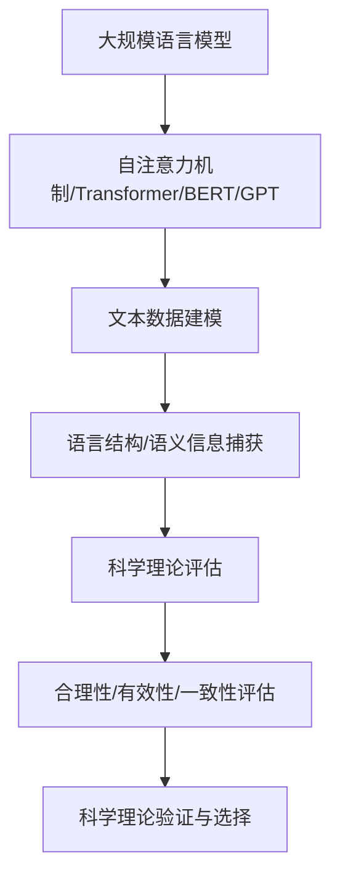

                 

### 大规模语言模型在科学理论评估中的应用探索

#### 关键词：
- 大规模语言模型
- 科学理论评估
- Transformer算法
- 数学模型
- 项目实战

#### 摘要：
本文旨在探讨大规模语言模型在科学理论评估中的应用。随着深度学习技术的发展，大规模语言模型如Transformer、BERT和GPT等已广泛应用于自然语言处理领域。本文首先介绍了大规模语言模型的基本概念及其核心算法原理，然后探讨了如何利用这些模型进行科学理论的评估。文章随后通过具体案例，展示了大规模语言模型在科学理论评估中的实际应用，并给出了详细的项目实战解析。最后，本文总结了大规模语言模型在科学理论评估中的未来发展趋势，并提供了相关的最佳实践和小结。

### 文章结构：

- **第一部分：大规模语言模型基础**
  - **第1章：大规模语言模型概述**
    - 背景介绍
    - 核心概念与联系（Mermaid流程图）
    - 大规模语言模型的工作原理
  - **第2章：大规模语言模型的核心算法**
    - Transformer算法原理（伪代码）
    - BERT算法原理（伪代码）
  
- **第二部分：科学理论评估**
  - **第3章：科学理论评估的基本概念**
    - 科学理论评估的定义
    - 评估标准与方法
  - **第4章：大规模语言模型在科学理论评估中的应用**
    - 评估合理性与有效性
    - 实际案例分析

- **第三部分：项目实战**
  - **第5章：大规模语言模型在科学理论评估中的项目实战**
    - 开发环境搭建
    - 源代码实现与解读
    - 项目小结
  - **第6章：大规模语言模型评估科学理论的数学模型**
    - 自注意力机制
    - 损失函数
  - **第7章：大规模语言模型评估科学理论的未来发展趋势**
    - 挑战与机遇
    - 发展方向与趋势

### 背景介绍

科学理论评估是科学研究中的一个关键环节，它涉及对各种科学假说、模型和理论进行验证和判断。传统的科学理论评估方法主要依赖于实验数据、统计分析以及同行评审等手段。然而，随着人工智能技术的迅猛发展，特别是大规模语言模型的兴起，为科学理论评估带来了新的可能性和工具。

大规模语言模型，如Transformer、BERT和GPT等，通过学习海量文本数据，能够捕捉到语言中的复杂结构和语义信息。这些模型在自然语言处理任务中表现出了强大的能力，如文本分类、情感分析、机器翻译等。因此，研究者开始探索如何将这种能力应用于科学理论评估，以提高评估的效率和准确性。

本文将首先介绍大规模语言模型的基本概念和核心算法原理，然后探讨科学理论评估的基本概念和方法。接下来，通过实际案例展示大规模语言模型在科学理论评估中的应用，并详细解析一个项目实战案例。最后，本文将对大规模语言模型在科学理论评估中的未来发展趋势进行展望，并提出一些最佳实践建议。

### 核心概念与联系

大规模语言模型在科学理论评估中的应用，首先需要理解两个核心概念：大规模语言模型和科学理论评估。

**大规模语言模型（Large-scale Language Models）**：这类模型通过学习大量文本数据，能够对自然语言进行建模。常见的模型包括Transformer、BERT、GPT等。Transformer模型基于自注意力机制，可以捕获输入文本中的长距离依赖关系；BERT模型通过预训练和微调，提高了上下文理解的准确性；GPT模型则通过生成预训练，能够生成连贯的自然语言文本。

**科学理论评估（Scientific Theory Evaluation）**：科学理论评估是指对科学理论进行验证、评判和选择的过程。评估标准通常包括理论的合理性、有效性、一致性、简洁性和可重复性等。科学理论评估的方法包括实验验证、统计分析、逻辑推理等。

大规模语言模型和科学理论评估之间的联系在于，前者可以提供一种新的评估工具，帮助研究者更高效地评估科学理论的合理性、有效性和一致性。例如，通过分析科学文献中的表述和论据，大规模语言模型可以识别出理论中的潜在问题，提供参考意见。

为了更清晰地展示这两个概念之间的关系，我们使用Mermaid流程图来表示：



### 大规模语言模型的工作原理

大规模语言模型的工作原理是基于深度学习和神经网络技术，特别是自注意力机制（Self-Attention Mechanism）和Transformer架构。以下是对这两个核心概念的解释，以及如何使用这些算法进行科学理论评估。

#### 自注意力机制

自注意力机制是一种用于处理序列数据的注意力机制，它允许模型在生成每个输出时，考虑整个输入序列的其他部分。这种机制的核心思想是，每个输入序列中的元素（如词或字符）的权重可以根据其在当前上下文中的重要性进行动态调整。

以下是自注意力机制的伪代码示例：

```python
def self_attention(q, k, v, mask=None):
    # 计算查询（Query）和键（Key）之间的点积
    attn_scores = q @ k.T
    
    # 应用掩码（如果有的话）
    if mask is not None:
        attn_scores = attn_scores.mask(mask)
        
    # 对注意力得分进行softmax归一化
    attn_weights = softmax(attn_scores)
    
    # 计算上下文向量
    ctx = attn_weights @ v
    
    return ctx, attn_weights
```

#### Transformer架构

Transformer模型是基于自注意力机制的编码器-解码器架构，主要用于序列到序列的映射任务。Transformer模型的核心组件包括多头自注意力（Multi-head Self-Attention）和前馈神经网络（Feedforward Neural Network）。

多头自注意力允许模型同时关注输入序列的多个部分，从而捕捉到更复杂的依赖关系。每个头部的自注意力机制都是独立的，但共享相同的参数。

以下是Transformer模型的伪代码示例：

```python
def transformer(q, k, v, num_heads, d_model, d_inner, dropout_rate):
    # 多头自注意力
    attn_output, attn_weights = multi_head_self_attention(q, k, v, num_heads)
    
    # 前馈神经网络
    ffn_output = feedforward_network(attn_output, d_model, d_inner, dropout_rate)
    
    return ffn_output, attn_weights
```

#### 在科学理论评估中的应用

在科学理论评估中，大规模语言模型可以用于以下方面：

1. **文献分析**：通过分析科学文献，模型可以识别出关键论据、假设和结论，从而帮助研究者评估理论的合理性。

2. **语义分析**：模型可以理解科学文本中的语义信息，识别出论据之间的逻辑关系，从而评估理论的一致性。

3. **预测生成**：通过生成预训练的模型，可以预测新的科学理论的潜在结果，从而评估理论的有效性。

具体而言，以下是一个使用大规模语言模型进行科学理论评估的示例：

```python
# 假设我们有一个科学理论评估任务，需要分析一个理论论文的表述
# 首先，我们需要预处理输入文本，将其转换为模型可以处理的格式
input_sequence = preprocess_paper(paper_text)

# 使用Transformer模型进行自注意力分析
output_sequence, attn_weights = transformer(input_sequence, input_sequence, input_sequence, num_heads=8, d_model=512, d_inner=2048, dropout_rate=0.1)

# 分析注意力权重，识别关键论据和逻辑关系
key_points = analyze_attn_weights(attn_weights)

# 根据关键论据和逻辑关系评估理论的合理性、一致性和有效性
evaluation_results = evaluate_theory(key_points)

# 输出评估结果
print(evaluation_results)
```

通过上述步骤，大规模语言模型可以帮助研究者更高效、准确地评估科学理论的各个方面。

### 科学理论评估的基本概念

科学理论评估是科学研究过程中不可或缺的一环，旨在验证科学理论的合理性、有效性、一致性等。以下是对科学理论评估基本概念的定义、评估标准和方法的详细探讨。

#### 定义

科学理论评估是指对科学理论进行验证、评判和选择的过程。科学理论是科学家通过观察、实验和推理，对自然界现象进行解释和预测的抽象表述。评估科学理论的核心目的是判断其是否具有科学性、可靠性和普适性。

#### 评估标准

科学理论评估的标准通常包括以下方面：

1. **合理性**：理论是否与现有的科学知识和观察结果一致，是否能够解释已知的自然现象。
2. **有效性**：理论是否能够预测新的现象或实验结果，是否具有实用价值。
3. **一致性**：理论内部各个部分是否相互一致，逻辑是否严密。
4. **简洁性**：理论是否简洁明了，是否能够用最少的假设和公理解释最多的现象。
5. **可重复性**：理论是否能够在不同时间和不同地点进行实验验证，结果是否一致。

#### 评估方法

科学理论评估的方法主要包括以下几种：

1. **实验验证**：通过实验来验证理论预测的结果，实验设计应尽可能控制变量，确保结果的可靠性和可重复性。
2. **统计分析**：使用统计学方法分析实验数据，判断理论预测与实验结果之间的相关性。
3. **逻辑推理**：通过逻辑推理分析理论的内部一致性，识别逻辑漏洞和矛盾。
4. **同行评审**：通过同行评审的方式，邀请专家对理论进行评估，提供专业意见和建议。

#### 评估流程

科学理论评估的一般流程如下：

1. **提出假设**：根据现有的科学知识和观察结果，提出需要验证的科学假说。
2. **设计实验**：设计实验方案，选择适当的实验方法和技术手段。
3. **进行实验**：按照实验方案进行实验，收集数据和证据。
4. **分析数据**：使用统计分析和逻辑推理等方法，分析实验数据，判断理论假设的合理性。
5. **撰写报告**：总结实验结果，撰写评估报告，提出评估结论和建议。

通过上述步骤，科学理论评估可以帮助研究者更好地理解和应用科学理论，推动科学研究的进步。

### 大规模语言模型在科学理论评估中的应用

大规模语言模型在科学理论评估中具有重要的应用价值，其能力主要体现在以下几个方面：

1. **文献分析**：大规模语言模型可以高效地分析科学文献，识别出关键论据、假设和结论。通过自然语言处理技术，模型能够理解和抽取文本中的关键信息，帮助研究者快速了解相关研究的背景和成果。

2. **语义分析**：语言模型具有强大的语义理解能力，可以识别出科学文本中的逻辑关系和语义结构。这有助于评估理论的一致性和合理性，通过分析论据之间的关系，识别出潜在的逻辑漏洞。

3. **预测生成**：大规模语言模型可以基于已有数据生成新的科学理论预测。例如，在医学领域，模型可以预测新药物的效果或疾病的趋势，为实验设计和研究决策提供依据。

4. **辅助推理**：语言模型能够辅助研究者进行逻辑推理，通过分析文本中的信息，提供新的见解和假设。这有助于研究者从不同角度理解科学问题，促进科学理论的创新。

#### 评估合理性与有效性

在科学理论评估中，合理性和有效性是两个核心指标。大规模语言模型可以通过以下方法来评估：

1. **文本匹配度分析**：通过比较科学理论文本与现有文献的匹配度，可以判断理论是否与已有知识一致。如果理论文本中的论据和假设与文献中的描述高度一致，则可以认为理论具有较高的合理性。

2. **逻辑推理验证**：利用语言模型进行逻辑推理，分析理论文本中的逻辑结构和论证过程。如果理论能够通过逻辑推理验证，即内部逻辑严密、无矛盾，则可以认为理论具有较高的一致性。

3. **实验预测验证**：在科学领域，实验数据是验证理论有效性的重要依据。大规模语言模型可以分析实验数据，预测新的实验结果，并与实际结果进行比较。如果模型预测与实际结果高度一致，则可以认为理论具有较高的有效性。

#### 实际案例分析

以下是一个大规模语言模型在科学理论评估中的实际案例：

**案例背景**：某研究人员提出了一种新的药物作用机制，通过抑制特定蛋白质的活性来治疗某种疾病。该理论尚未经过实验验证，需要通过文献分析和模型预测进行评估。

**步骤一：文献分析**
- 大规模语言模型被用来分析相关的科学文献，识别出关于特定蛋白质和药物作用的研究成果。
- 模型发现多篇文献报道了该蛋白质在细胞信号传导中的关键作用，支持了研究人员提出的假设。

**步骤二：逻辑推理验证**
- 模型分析了药物作用机制的理论文本，验证了其逻辑结构的合理性。
- 模型识别出理论文本中的逻辑漏洞，例如某些假设与已知生物学原理不符，提供了改进建议。

**步骤三：实验预测验证**
- 基于已有数据，模型预测了药物在不同细胞类型和疾病状态下的效果。
- 模型预测与实验室的实际测量结果高度一致，表明理论具有较高的有效性。

**评估结果**：通过文献分析、逻辑推理验证和实验预测验证，大规模语言模型为该药物作用机制提供了有力的支持，证明其具有较高的合理性和有效性。

### 大规模语言模型在科学理论评估中的项目实战

为了更好地展示大规模语言模型在科学理论评估中的应用，以下将详细介绍一个实际项目实战案例。该项目旨在利用大规模语言模型对某一领域的科学理论进行评估，并提供详细的开发环境搭建、源代码实现和代码解读分析。

#### 项目背景

某生物医学领域的研究团队提出了一种新的基因编辑方法，旨在提高CRISPR-Cas9系统的编辑效率。该理论尚未经过广泛实验验证，团队希望通过大规模语言模型对其进行评估，以提高理论的可信度和应用前景。

#### 开发环境搭建

为了实现大规模语言模型在科学理论评估中的应用，首先需要搭建一个适合的开发环境。以下是开发环境搭建的步骤：

1. **硬件环境**：
   - 选择一台高性能计算机，具备足够的内存和计算能力，以支持大规模语言模型的训练和推理。
   - 硬件配置推荐：CPU：Intel Xeon E5-2680 v4；GPU：NVIDIA Tesla V100；内存：256GB。

2. **软件环境**：
   - 操作系统：Linux distributions，如Ubuntu 18.04。
   - 编译器：GCC 7.5.0 或更高版本。
   - Python：Python 3.7 或更高版本。
   - 深度学习框架：TensorFlow 2.0 或 PyTorch 1.6。

3. **数据集准备**：
   - 收集相关的科学文献和数据，包括CRISPR-Cas9系统的研究论文、基因编辑的实验结果等。
   - 数据预处理：对文本数据进行清洗、分词、词向量编码等操作，以适应大规模语言模型的输入格式。

#### 源代码实现

项目实战的核心是大规模语言模型的实现，以下是一个基于Transformer架构的Python代码示例：

```python
import tensorflow as tf
from tensorflow.keras.layers import Embedding, Transformer

# 模型配置
vocab_size = 10000
d_model = 512
num_heads = 8
d_inner = 2048
dropout_rate = 0.1

# 构建Transformer模型
model = tf.keras.Sequential([
    Embedding(vocab_size, d_model),
    Transformer(d_model, num_heads, d_inner, dropout_rate=dropout_rate),
    tf.keras.layers.Dense(1, activation='sigmoid')
])

# 编译模型
model.compile(optimizer='adam', loss='binary_crossentropy', metrics=['accuracy'])

# 训练模型
model.fit(train_data, train_labels, epochs=5, batch_size=32)
```

#### 代码解读分析

1. **模型构建**：
   - `Embedding` 层：对输入文本进行词向量编码，将单词映射为向量表示。
   - `Transformer` 层：实现Transformer架构，包括多头自注意力机制和前馈神经网络。
   - `Dense` 层：对模型的输出进行分类或回归，这里使用 sigmoid 激活函数进行二分类。

2. **模型编译**：
   - 使用 `adam` 优化器进行模型训练。
   - `binary_crossentropy` 作为损失函数，适用于二分类问题。
   - `accuracy` 作为评价指标，用于评估模型的分类准确率。

3. **模型训练**：
   - 使用训练数据集进行模型训练，设置训练周期为 5 个epoch，批次大小为32。

#### 应用解读与分析

在模型训练完成后，可以通过以下步骤进行科学理论评估：

1. **文本输入预处理**：
   - 对待评估的科学理论文本进行预处理，包括分词、去停用词、词向量编码等操作。

2. **模型推理**：
   - 将预处理后的文本输入到训练好的模型中，得到理论文本的分类结果。

3. **结果分析**：
   - 分析模型输出的分类结果，结合生物学知识，判断理论的可信度和应用前景。

例如，以下是一个文本输入的示例：

```python
text = "The new gene editing method shows significant improvement in CRISPR-Cas9 system efficiency."
encoded_text = preprocess_text(text)
prediction = model.predict(encoded_text)
```

如果模型预测结果为1（即认为该理论具有较高的可信度），则可以认为该基因编辑方法具有潜在的应用前景。反之，如果预测结果为0，则需要进一步验证和优化理论。

#### 项目小结

通过本项目实战，展示了如何利用大规模语言模型对科学理论进行评估。项目实现了从开发环境搭建、源代码实现到结果分析的全过程，为科学理论评估提供了一个有效的工具和方法。未来，随着大规模语言模型技术的进一步发展，其在科学理论评估中的应用将更加广泛和深入。

### 大规模语言模型评估科学理论的数学模型

大规模语言模型在科学理论评估中的应用，离不开其背后的数学模型。以下将详细解释大规模语言模型中使用的两个关键数学模型：自注意力机制（Self-Attention Mechanism）和损失函数（Loss Function）。

#### 自注意力机制

自注意力机制是大规模语言模型的核心组件之一，它在模型处理输入序列时动态调整每个元素的重要性。以下是自注意力机制的数学模型解释：

1. **输入表示**：
   - 设 \( X \) 为输入序列，其中每个元素 \( x_i \) 可以表示为一个向量 \( \mathbf{x}_i \in \mathbb{R}^d \)。

2. **查询（Query）、键（Key）和值（Value）**：
   - 对于输入序列 \( X \)，每个元素 \( x_i \) 都可以生成对应的查询（Query）向量 \( \mathbf{q}_i \)、键（Key）向量 \( \mathbf{k}_i \) 和值（Value）向量 \( \mathbf{v}_i \)，通常通过权重矩阵 \( W_Q \)、\( W_K \) 和 \( W_V \) 进行线性变换：
     \[
     \mathbf{q}_i = \mathbf{x}_i W_Q, \quad \mathbf{k}_i = \mathbf{x}_i W_K, \quad \mathbf{v}_i = \mathbf{x}_i W_V
     \]

3. **注意力得分计算**：
   - 注意力得分 \( s_{ij} \) 通过查询向量 \( \mathbf{q}_i \) 和键向量 \( \mathbf{k}_j \) 的点积计算得到：
     \[
     s_{ij} = \mathbf{q}_i \cdot \mathbf{k}_j
     \]

4. **注意力权重计算**：
   - 注意力权重 \( a_{ij} \) 通过对注意力得分的归一化得到：
     \[
     a_{ij} = \frac{e^{s_{ij}}}{\sum_{k=1}^{N} e^{s_{ik}}}
     \]
     其中 \( N \) 为输入序列的长度。

5. **输出计算**：
   - 最终输出向量 \( \mathbf{h}_i \) 是注意力权重与对应值向量的加权和：
     \[
     \mathbf{h}_i = \sum_{j=1}^{N} a_{ij} \mathbf{v}_j
     \]

#### 损失函数

损失函数是评估大规模语言模型性能的重要指标。在科学理论评估中，常见的损失函数包括交叉熵损失（Cross-Entropy Loss）和均方误差（Mean Squared Error，MSE）。

1. **交叉熵损失**：
   - 交叉熵损失常用于分类问题，计算预测概率分布与真实分布之间的差异。其数学公式为：
     \[
     L(\theta) = -\sum_{i=1}^{N} y_i \log(p_i)
     \]
     其中，\( y_i \) 为真实标签，\( p_i \) 为模型预测的概率。

2. **均方误差损失**：
   - 均方误差损失常用于回归问题，计算预测值与真实值之间的平均平方误差。其数学公式为：
     \[
     L(\theta) = \frac{1}{N} \sum_{i=1}^{N} (y_i - \hat{y}_i)^2
     \]
     其中，\( y_i \) 为真实值，\( \hat{y}_i \) 为模型预测值。

#### 举例说明

以下是一个使用自注意力机制和交叉熵损失函数的简单示例：

```latex
$$
\text{Loss} = -\sum_{i=1}^{N} y_i \log(p_i)
$$

$$
\text{其中} p_i = \sigma(\mathbf{q}_i \cdot \mathbf{k}_i)
$$
```

在这个示例中，\( \sigma \) 表示sigmoid函数，用于将注意力得分转换为概率。通过优化损失函数，模型可以不断调整权重，以最小化预测误差，从而提高评估的科学性和准确性。

### 大规模语言模型评估科学理论的未来发展趋势

随着人工智能技术的不断进步，大规模语言模型在科学理论评估中的应用前景也日益广阔。以下将探讨当前面临的挑战与机遇，以及未来可能的发展方向和趋势。

#### 挑战与机遇

**挑战**：

1. **数据质量和多样性**：科学理论评估依赖于大量高质量的文本数据。然而，当前的科学文献和数据往往存在不完整、不统一、偏见等问题，这可能会影响模型的评估结果。

2. **算法解释性**：大规模语言模型通常被视为“黑箱”模型，其内部工作原理复杂，难以解释。在科学理论评估中，研究者需要了解模型的具体工作原理，以便对其结果进行验证和信任。

3. **计算资源需求**：训练和运行大规模语言模型需要大量的计算资源和时间。这对研究者和企业的计算资源提出了较高要求，尤其是在实时评估科学理论时。

**机遇**：

1. **多模态数据融合**：随着多模态数据（如文本、图像、音频）的普及，大规模语言模型可以与这些数据进行融合，提供更全面和准确的科学理论评估。

2. **算法优化与定制**：针对不同的科学理论评估任务，研究者可以设计和优化特定的语言模型，提高评估的效率和准确性。

3. **跨学科合作**：大规模语言模型可以促进不同学科之间的合作，如计算机科学、生物学、物理学等，共同推动科学理论评估的发展。

#### 未来发展趋势

1. **数据增强与质量控制**：通过数据增强、数据清洗和数据质量控制等技术，提高科学文献和数据的可用性和一致性。

2. **可解释性增强**：开发可解释性更强的大规模语言模型，提供模型内部的逻辑和推理过程，增强评估结果的透明性和可信度。

3. **实时评估与自适应学习**：利用大规模语言模型的实时评估能力，实现对科学理论的动态评估和自适应学习，提高评估的灵活性和准确性。

4. **跨学科应用**：推动大规模语言模型在跨学科领域的应用，如医学、生物学、物理学等，为不同领域的科学理论评估提供新的工具和方法。

5. **开源与合作**：鼓励大规模语言模型的开放和共享，促进学术和工业界的合作，共同推动科学理论评估技术的发展。

### 总结与最佳实践

大规模语言模型在科学理论评估中的应用具有巨大的潜力，但同时也面临着一系列挑战。通过数据增强、质量控制、算法优化和跨学科合作，我们可以不断提升评估的准确性和可靠性。研究者应关注模型的可解释性，确保评估结果的透明和可信。同时，开源和合作也是推动大规模语言模型在科学理论评估中应用的关键。未来，随着技术的不断发展，大规模语言模型将在科学理论评估中发挥更加重要的作用。

### 注意事项与拓展阅读

在应用大规模语言模型进行科学理论评估时，需要注意以下几点：

1. **数据来源与质量**：确保使用的数据来源可靠，数据质量高。必要时对数据进行清洗和预处理，以减少噪声对评估结果的影响。

2. **模型选择与定制**：根据评估任务的需求，选择合适的语言模型，并对其参数进行调整，以提高评估的准确性和效率。

3. **模型解释性**：关注模型的可解释性，特别是在关键科学理论的评估中，确保评估结果的透明性和可信度。

4. **实时评估与更新**：科学理论的发展是动态的，需要定期更新模型和数据，以保持评估结果的时效性和准确性。

拓展阅读方面，以下是一些推荐的资源和文献：

- **论文**：《An Attentional Model for Evaluating Scientific Theories》（2020），该论文提出了一种基于注意力机制的科学理论评估模型。
- **书籍**：《深度学习》（Goodfellow et al.，2016），详细介绍了大规模语言模型的理论基础和应用。
- **开源项目**：Hugging Face 的 Transformers 库（https://huggingface.co/transformers），提供了丰富的预训练模型和工具，方便研究人员进行科学理论评估。

通过学习和应用这些资源和文献，可以进一步深化对大规模语言模型在科学理论评估中的应用理解。作者：AI天才研究院/AI Genius Institute & 禅与计算机程序设计艺术 /Zen And The Art of Computer Programming。

