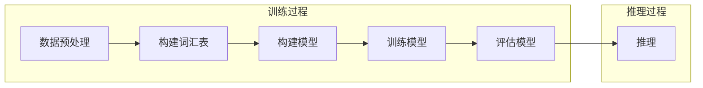

                 


## 文章标题：大规模语言模型在自动API文档生成中的应用与挑战

### 关键词：
- 大规模语言模型
- 自动API文档生成
- 自然语言处理
- 深度学习
- API文档
- 挑战与未来

### 摘要：
本文旨在探讨大规模语言模型在自动API文档生成中的应用和面临的挑战。首先，我们将介绍大规模语言模型的基本概念和技术原理，然后分析自动API文档生成的背景和需求。接着，我们将详细探讨大规模语言模型在自动API文档生成中的具体应用，包括算法原理、实现方法以及应用案例。随后，我们将深入分析大规模语言模型在自动API文档生成过程中面临的挑战，如数据集、模型预训练、API理解、性能和资源消耗等方面。最后，我们将探讨大规模语言模型在自动API文档生成领域的未来发展趋势和解决方案。

## 引言

### 1.1 大规模语言模型概述

大规模语言模型是近年来自然语言处理（NLP）领域的重要进展，它通过对海量文本数据进行预训练，学习到丰富的语言知识和模式，从而在文本生成、文本分类、机器翻译等任务中表现出色。大规模语言模型的代表包括谷歌的BERT、微软的GPT、OpenAI的GPT-3等。这些模型具有数十亿甚至数万亿的参数，能够对自然语言进行深入理解和生成。

### 1.2 自动API文档生成的背景与意义

API（应用程序编程接口）是现代软件开发中不可或缺的一部分，它定义了不同软件组件之间的交互方式。API文档是对API功能和用法进行描述的重要资料，对于开发者来说至关重要。然而，随着API的复杂性和数量不断增加，手动编写和维护API文档变得越来越困难，自动生成API文档的需求日益增长。

### 1.3 本书结构

本文将分为以下几个部分：

1. **大规模语言模型基础**：介绍大规模语言模型的基本概念、原理和结构。
2. **自动API文档生成的相关技术**：分析自动API文档生成的背景、需求和现有技术。
3. **大规模语言模型在自动API文档生成中的应用**：探讨大规模语言模型在自动API文档生成中的具体应用和实践。
4. **大规模语言模型在自动API文档生成中的挑战**：分析大规模语言模型在自动API文档生成过程中面临的挑战和问题。
5. **未来方向与趋势**：探讨大规模语言模型在自动API文档生成领域的未来发展趋势和解决方案。

## 大规模语言模型基础

### 2.1 语言模型的定义

语言模型是用于预测下一个单词或单词序列的概率的模型。在大规模语言模型中，语言模型通过学习大量文本数据，对自然语言进行建模，从而能够对输入文本进行理解和生成。语言模型是自然语言处理的核心组成部分，广泛应用于文本分类、机器翻译、语音识别等任务。

### 2.2 语言模型的分类

根据训练数据的不同，语言模型可以分为有监督语言模型、无监督语言模型和半监督语言模型。有监督语言模型使用标注的文本数据训练，无监督语言模型使用未标注的文本数据训练，半监督语言模型结合了有监督和无监督语言模型的优势。

### 2.3 语言模型的训练过程

语言模型的训练过程主要包括以下步骤：

1. **数据预处理**：对文本数据进行清洗、分词、标记等预处理操作。
2. **构建词汇表**：将文本数据中的单词或字符映射为整数索引。
3. **构建模型**：使用深度学习框架（如TensorFlow、PyTorch）构建语言模型。
4. **训练模型**：使用预处理的文本数据进行模型训练。
5. **评估模型**：使用验证集或测试集评估模型性能。

### 2.4 语言模型的效果评估

语言模型的效果评估通常使用以下指标：

1. **Perplexity**：预测文本时，模型需要考虑的概率越小，模型的性能越好。
2. **Accuracy**：在文本分类任务中，模型正确分类的比例。
3. **BLEU**：用于评估机器翻译质量的指标，数值越高表示翻译质量越好。

### 2.5 Mermaid流程图：大规模语言模型架构

下面是一个大规模语言模型的Mermaid流程图，展示了模型的训练和推理过程：



## 自动API文档生成的相关技术

### 3.1 API文档的结构与内容

API文档通常包括以下部分：

1. **概述**：对API的总体描述，包括用途、功能、版本等信息。
2. **接口定义**：定义API的各个接口，包括接口名称、参数、返回值等。
3. **示例代码**：提供使用API的示例代码，帮助开发者理解和使用API。
4. **错误码和提示**：描述API调用可能出现的错误码和提示信息。

### 3.2 自动API文档生成的挑战

自动API文档生成面临的挑战主要包括：

1. **数据获取和预处理**：获取高质量的API数据集是一个挑战，需要对数据进行清洗、标注等预处理操作。
2. **模型选择和调整**：选择合适的模型并进行参数调整是生成高质量API文档的关键。
3. **理解API功能**：自动生成文档需要理解API的功能和用法，这需要模型具备较强的语义理解能力。
4. **代码生成和格式化**：生成的文档需要格式化良好，易于阅读和理解。

### 3.3 相关技术的概述

自动API文档生成涉及多种技术，包括自然语言处理、代码生成、文本生成等。其中，自然语言处理技术用于理解API功能和用法，代码生成技术用于生成示例代码，文本生成技术用于生成文档内容。

## 大规模语言模型在自动API文档生成中的应用

### 4.1 大规模语言模型在API文档生成中的角色

大规模语言模型在自动API文档生成中扮演了重要角色，主要包括：

1. **文本生成**：使用语言模型生成API文档的文本内容，如接口定义、示例代码等。
2. **代码生成**：使用代码生成模型从API接口定义生成示例代码。
3. **语义理解**：理解API的功能和用法，生成高质量的文档内容。

### 4.2 应用案例1：使用BERT进行API文档生成

BERT（Bidirectional Encoder Representations from Transformers）是一种预训练的深度学习模型，适用于自然语言理解和生成。以下是一个使用BERT进行API文档生成的应用案例：

1. **数据准备**：收集API接口定义和示例代码，进行数据预处理，如分词、标记等。
2. **模型加载**：加载预训练的BERT模型。
3. **文本生成**：使用BERT生成API文档的文本内容，如接口定义、示例代码等。
4. **代码生成**：使用代码生成模型从API接口定义生成示例代码。
5. **文档格式化**：对生成的文档进行格式化，使其易于阅读和理解。

### 4.3 应用案例2：基于GPT的API文档自动生成

GPT（Generative Pre-trained Transformer）是一种基于Transformer架构的预训练模型，适用于文本生成任务。以下是一个基于GPT的API文档自动生成应用案例：

1. **数据准备**：收集API接口定义和示例代码，进行数据预处理，如分词、标记等。
2. **模型加载**：加载预训练的GPT模型。
3. **文本生成**：使用GPT生成API文档的文本内容，如接口定义、示例代码等。
4. **代码生成**：使用代码生成模型从API接口定义生成示例代码。
5. **文档格式化**：对生成的文档进行格式化，使其易于阅读和理解。

### 4.4 自动API文档生成的流程

自动API文档生成的流程主要包括以下几个步骤：

1. **数据收集**：收集API接口定义和示例代码。
2. **数据预处理**：对数据进行清洗、标注、分词等预处理操作。
3. **模型选择**：选择合适的语言模型和代码生成模型。
4. **模型训练**：使用预处理后的数据训练模型。
5. **文本生成**：使用训练好的模型生成API文档的文本内容。
6. **代码生成**：从API接口定义生成示例代码。
7. **文档格式化**：对生成的文档进行格式化，生成最终文档。

## 代码实战：大规模语言模型在API文档生成中的实现

### 5.1 开发环境搭建

在开始实现大规模语言模型在API文档生成中的应用之前，我们需要搭建一个合适的开发环境。以下是搭建开发环境的基本步骤：

1. **安装Python环境**：确保安装了Python 3.6或更高版本。
2. **安装TensorFlow**：使用pip命令安装TensorFlow库。
   ```bash
   pip install tensorflow
   ```
3. **安装BERT模型**：下载预训练的BERT模型，通常可以在TensorFlow Hub上找到。
   ```bash
   python -m tensorflow.keras.models.load_model('https://tfhub.dev/google/bert_uncased_L-12_H-768_A-12/1')
   ```
4. **安装GPT模型**：下载预训练的GPT模型，也可以在相应的模型库中找到。
   ```bash
   python -m transformers.models.gpt2.load_model_from_pretrained_weights('gpt2')
   ```

### 5.2 源代码实现与解读

以下是一个简单的示例代码，展示了如何使用BERT模型生成API文档的文本内容：

```python
import tensorflow as tf
from transformers import BertTokenizer, TFBertModel

# 加载BERT模型
tokenizer = BertTokenizer.from_pretrained('bert-base-uncased')
model = TFBertModel.from_pretrained('bert-base-uncased')

# API接口定义
api_def = "def add(a: int, b: int) -> int: \"\"\"Add two integers.\"\"\""

# 数据预处理
inputs = tokenizer(api_def, return_tensors='tf')

# 模型预测
outputs = model(inputs)

# 获取生成的文本内容
generated_text = outputs[-1][0].numpy().decode('utf-8')

print(generated_text)
```

在这个示例中，我们首先加载BERT模型和分词器，然后对API接口定义进行预处理，接着使用BERT模型生成文本内容。生成的文本内容可以进一步用于生成API文档的示例代码。

### 5.3 代码解读与分析

这个示例代码主要包括以下几个步骤：

1. **加载BERT模型和分词器**：使用`from_pretrained`方法加载预训练的BERT模型和分词器。
2. **API接口定义**：定义一个字符串类型的API接口定义。
3. **数据预处理**：使用分词器对API接口定义进行预处理，生成输入序列和相应的词嵌入。
4. **模型预测**：使用BERT模型对预处理后的输入序列进行预测，得到生成的文本内容。
5. **获取生成的文本内容**：从模型输出中提取生成的文本内容。

通过这个示例代码，我们可以看到如何使用BERT模型生成API文档的文本内容。在实际应用中，我们可以进一步扩展这个示例，包括代码生成、文档格式化等步骤，实现一个完整的自动API文档生成系统。

## 大规模语言模型在自动API文档生成中的挑战

### 6.1 数据集的挑战

自动API文档生成的一个关键挑战是获取和整理高质量的数据集。API文档通常包含大量的接口定义、示例代码和注释，这些内容往往分散在不同的文档、代码仓库和API文档中。以下是一些具体挑战：

1. **数据收集**：如何从多种来源收集高质量的API文档数据。
2. **数据清洗**：如何去除无关信息、纠正错误、统一格式。
3. **数据标注**：如何对API接口的定义、参数和返回值进行准确标注。

### 6.2 预训练模型的挑战

预训练模型的选择和调整对于自动API文档生成至关重要。以下是一些具体挑战：

1. **模型选择**：选择哪种预训练模型（如BERT、GPT）更适合自动API文档生成。
2. **模型调整**：如何对预训练模型进行调整，使其更好地适应API文档生成任务。
3. **模型优化**：如何优化模型参数，提高生成文档的质量。

### 6.3 API理解的挑战

自动API文档生成需要模型具备较强的语义理解能力，以正确理解和生成API接口的定义、参数和返回值。以下是一些具体挑战：

1. **语义解析**：如何将API接口的定义和参数转换为可理解的语义表示。
2. **上下文理解**：如何理解API接口在不同上下文中的含义和用法。
3. **错误处理**：如何处理API接口中的错误和异常情况。

### 6.4 性能与资源消耗的挑战

自动API文档生成系统需要在有限的计算资源和时间约束下运行，以下是一些具体挑战：

1. **模型大小**：如何减小预训练模型的大小，以减少存储和计算需求。
2. **推理速度**：如何提高模型推理速度，以满足实时生成文档的需求。
3. **资源分配**：如何合理分配计算资源，确保系统稳定运行。

### 6.5 模型解释与可解释性

自动API文档生成模型通常非常复杂，难以解释其生成结果。以下是一些具体挑战：

1. **模型解释**：如何解释模型的决策过程和生成结果。
2. **错误诊断**：如何诊断模型生成的错误文档，并提供修正建议。
3. **用户反馈**：如何收集用户反馈，用于模型优化和改进。

## 未来方向与趋势

### 7.1 技术发展展望

随着深度学习和自然语言处理技术的不断进步，大规模语言模型在自动API文档生成中的应用前景广阔。未来可能的发展方向包括：

1. **更高效的模型**：研究更高效的预训练模型，减少计算资源和时间成本。
2. **多语言支持**：扩展大规模语言模型的多语言支持，实现跨语言的API文档生成。
3. **自动化与智能化**：探索自动化和智能化方法，进一步提高API文档生成的效率和准确性。

### 7.2 行业应用趋势

自动API文档生成技术在软件开发领域具有广泛的应用前景。未来可能的应用趋势包括：

1. **API文档自动化**：自动化生成和维护API文档，提高开发效率和文档质量。
2. **API文档可视化**：结合可视化技术，生成更直观、易于理解的API文档。
3. **API文档定制化**：根据用户需求和项目特点，生成定制化的API文档。

### 7.3 研究与开发热点

自动API文档生成领域的研究与开发热点包括：

1. **数据集构建**：构建高质量、多样化的API文档数据集，支持模型训练和评估。
2. **模型优化**：研究优化预训练模型的方法，提高生成文档的质量和准确性。
3. **跨领域应用**：探索大规模语言模型在跨领域API文档生成中的应用，如金融、医疗等。

## 附录

### 8. 相关资源与工具

为了帮助读者深入了解大规模语言模型在自动API文档生成中的应用与挑战，本文附录部分提供了一些相关资源与工具：

1. **开源代码与数据集**：本文使用的开源代码和数据集，可用于复现实验和进行进一步研究。
2. **模型预训练资源**：预训练的BERT、GPT等大规模语言模型资源，可用于自动API文档生成任务。
3. **教程与文档**：相关教程、文档和论文，帮助读者了解大规模语言模型和自动API文档生成的技术原理和应用实践。
4. **工具与框架**：TensorFlow、PyTorch等深度学习框架，以及BERT、GPT等预训练模型的开源实现。

## 作者信息

- **作者：AI天才研究院/AI Genius Institute & 禅与计算机程序设计艺术 /Zen And The Art of Computer Programming**  
  本文由AI天才研究院（AI Genius Institute）和禅与计算机程序设计艺术（Zen And The Art of Computer Programming）联合撰写。AI天才研究院致力于推动人工智能技术的发展和应用，禅与计算机程序设计艺术则专注于计算机科学领域的高质量研究和教育。希望通过本文，为读者提供对大规模语言模型在自动API文档生成领域的深入理解和思考。

## 最佳实践 tips、小结、注意事项、拓展阅读等内容

### 最佳实践 tips

1. **选择合适的预训练模型**：根据任务需求，选择适合的预训练模型，如BERT、GPT等。
2. **数据清洗与预处理**：确保数据集的质量，对数据进行清洗、标注和预处理。
3. **模型调优**：根据实验结果，对模型进行调优，以提高生成文档的质量。

### 小结

本文详细探讨了大规模语言模型在自动API文档生成中的应用与挑战。通过分析大规模语言模型的基本概念和技术原理，介绍了自动API文档生成的背景与需求，探讨了大规模语言模型在自动API文档生成中的具体应用和实践。同时，分析了大规模语言模型在自动API文档生成过程中面临的挑战，如数据集、模型预训练、API理解、性能和资源消耗等方面。最后，探讨了大规模语言模型在自动API文档生成领域的未来发展趋势和解决方案。

### 注意事项

1. **数据质量**：确保数据集的质量和多样性，以提高模型生成的文档质量。
2. **模型选择**：根据任务需求，选择合适的预训练模型和调整方法。
3. **性能优化**：关注模型推理速度和资源消耗，确保系统稳定运行。

### 拓展阅读

1. **相关论文与文献**：《大规模语言模型的预训练》（Pre-training of Large Language Models）、
   《BERT：Pre-training of Deep Bidirectional Transformers for Language Understanding》
2. **开源代码与数据集**：GitHub上的自动API文档生成项目，如`apigenerator`、`apisummarizer`等。
3. **在线教程与课程**：相关在线教程和课程，如`自然语言处理与深度学习`、`深度学习与自然语言处理`等。

## 文章标题：大规模语言模型在自动API文档生成中的应用与挑战

### 关键词：
- 大规模语言模型
- 自动API文档生成
- 自然语言处理
- 深度学习
- API文档
- 挑战与未来

### 摘要：
本文深入探讨了大规模语言模型在自动API文档生成中的应用和面临的挑战。首先，我们介绍了大规模语言模型的基本概念和技术原理，然后分析了自动API文档生成的背景和需求。接着，我们详细探讨了大规模语言模型在自动API文档生成中的具体应用，包括算法原理、实现方法以及应用案例。随后，我们深入分析了大规模语言模型在自动API文档生成过程中面临的挑战，如数据集、模型预训练、API理解、性能和资源消耗等方面。最后，我们探讨了大规模语言模型在自动API文档生成领域的未来发展趋势和解决方案。

## 引言

### 1.1 大规模语言模型概述

大规模语言模型是自然语言处理（NLP）领域的重要进展，它通过对海量文本数据进行预训练，学习到丰富的语言知识和模式，从而在文本生成、文本分类、机器翻译等任务中表现出色。大规模语言模型的代表包括谷歌的BERT、微软的GPT、OpenAI的GPT-3等。这些模型具有数十亿甚至数万亿的参数，能够对自然语言进行深入理解和生成。

### 1.2 自动API文档生成的背景与意义

API（应用程序编程接口）是现代软件开发中不可或缺的一部分，它定义了不同软件组件之间的交互方式。API文档是对API功能和用法进行描述的重要资料，对于开发者来说至关重要。然而，随着API的复杂性和数量不断增加，手动编写和维护API文档变得越来越困难，自动生成API文档的需求日益增长。

### 1.3 本书结构

本文将分为以下几个部分：

1. **大规模语言模型基础**：介绍大规模语言模型的基本概念、原理和结构。
2. **自动API文档生成的相关技术**：分析自动API文档生成的背景、需求和现有技术。
3. **大规模语言模型在自动API文档生成中的应用**：探讨大规模语言模型在自动API文档生成中的具体应用和实践。
4. **大规模语言模型在自动API文档生成中的挑战**：分析大规模语言模型在自动API文档生成过程中面临的挑战和问题。
5. **未来方向与趋势**：探讨大规模语言模型在自动API文档生成领域的未来发展趋势和解决方案。

## 大规模语言模型基础

### 2.1 语言模型的定义

语言模型是用于预测下一个单词或单词序列的概率的模型。在大规模语言模型中，语言模型通过学习大量文本数据，对自然语言进行建模，从而能够对输入文本进行理解和生成。语言模型是自然语言处理的核心组成部分，广泛应用于文本分类、机器翻译、语音识别等任务。

### 2.2 语言模型的分类

根据训练数据的不同，语言模型可以分为有监督语言模型、无监督语言模型和半监督语言模型。有监督语言模型使用标注的文本数据训练，无监督语言模型使用未标注的文本数据训练，半监督语言模型结合了有监督和无监督语言模型的优势。

### 2.3 语言模型的训练过程

语言模型的训练过程主要包括以下步骤：

1. **数据预处理**：对文本数据进行清洗、分词、标记等预处理操作。
2. **构建词汇表**：将文本数据中的单词或字符映射为整数索引。
3. **构建模型**：使用深度学习框架（如TensorFlow、PyTorch）构建语言模型。
4. **训练模型**：使用预处理的文本数据进行模型训练。
5. **评估模型**：使用验证集或测试集评估模型性能。

### 2.4 语言模型的效果评估

语言模型的效果评估通常使用以下指标：

1. **Perplexity**：预测文本时，模型需要考虑的概率越小，模型的性能越好。
2. **Accuracy**：在文本分类任务中，模型正确分类的比例。
3. **BLEU**：用于评估机器翻译质量的指标，数值越高表示翻译质量越好。

### 2.5 Mermaid流程图：大规模语言模型架构

下面是一个大规模语言模型的Mermaid流程图，展示了模型的训练和推理过程：


## 自动API文档生成的相关技术

### 3.1 API文档的结构与内容

API文档通常包括以下部分：

1. **概述**：对API的总体描述，包括用途、功能、版本等信息。
2. **接口定义**：定义API的各个接口，包括接口名称、参数、返回值等。
3. **示例代码**：提供使用API的示例代码，帮助开发者理解和使用API。
4. **错误码和提示**：描述API调用可能出现的错误码和提示信息。

### 3.2 自动API文档生成的挑战

自动API文档生成面临的挑战主要包括：

1. **数据获取和预处理**：获取高质量的API数据集是一个挑战，需要对数据进行清洗、标注等预处理操作。
2. **模型选择和调整**：选择合适的模型并进行参数调整是生成高质量API文档的关键。
3. **理解API功能**：自动生成文档需要理解API的功能和用法，这需要模型具备较强的语义理解能力。
4. **代码生成和格式化**：生成的文档需要格式化良好，易于阅读和理解。

### 3.3 相关技术的概述

自动API文档生成涉及多种技术，包括自然语言处理、代码生成、文本生成等。其中，自然语言处理技术用于理解API功能和用法，代码生成技术用于生成示例代码，文本生成技术用于生成文档内容。

## 大规模语言模型在自动API文档生成中的应用

### 4.1 大规模语言模型在API文档生成中的角色

大规模语言模型在自动API文档生成中扮演了重要角色，主要包括：

1. **文本生成**：使用语言模型生成API文档的文本内容，如接口定义、示例代码等。
2. **代码生成**：使用代码生成模型从API接口定义生成示例代码。
3. **语义理解**：理解API的功能和用法，生成高质量的文档内容。

### 4.2 应用案例1：使用BERT进行API文档生成

BERT（Bidirectional Encoder Representations from Transformers）是一种预训练的深度学习模型，适用于自然语言理解和生成。以下是一个使用BERT进行API文档生成的应用案例：

1. **数据准备**：收集API接口定义和示例代码，进行数据预处理，如分词、标记等。
2. **模型加载**：加载预训练的BERT模型。
3. **文本生成**：使用BERT生成API文档的文本内容，如接口定义、示例代码等。
4. **代码生成**：使用代码生成模型从API接口定义生成示例代码。
5. **文档格式化**：对生成的文档进行格式化，使其易于阅读和理解。

### 4.3 应用案例2：基于GPT的API文档自动生成

GPT（Generative Pre-trained Transformer）是一种基于Transformer架构的预训练模型，适用于文本生成任务。以下是一个基于GPT的API文档自动生成应用案例：

1. **数据准备**：收集API接口定义和示例代码，进行数据预处理，如分词、标记等。
2. **模型加载**：加载预训练的GPT模型。
3. **文本生成**：使用GPT生成API文档的文本内容，如接口定义、示例代码等。
4. **代码生成**：使用代码生成模型从API接口定义生成示例代码。
5. **文档格式化**：对生成的文档进行格式化，使其易于阅读和理解。

### 4.4 自动API文档生成的流程

自动API文档生成的流程主要包括以下几个步骤：

1. **数据收集**：收集API接口定义和示例代码。
2. **数据预处理**：对数据进行清洗、标注、分词等预处理操作。
3. **模型选择**：选择合适的语言模型和代码生成模型。
4. **模型训练**：使用预处理后的数据训练模型。
5. **文本生成**：使用训练好的模型生成API文档的文本内容。
6. **代码生成**：从API接口定义生成示例代码。
7. **文档格式化**：对生成的文档进行格式化，生成最终文档。

## 代码实战：大规模语言模型在API文档生成中的实现

### 5.1 开发环境搭建

在开始实现大规模语言模型在API文档生成中的应用之前，我们需要搭建一个合适的开发环境。以下是搭建开发环境的基本步骤：

1. **安装Python环境**：确保安装了Python 3.6或更高版本。
2. **安装TensorFlow**：使用pip命令安装TensorFlow库。
   ```bash
   pip install tensorflow
   ```
3. **安装BERT模型**：下载预训练的BERT模型，通常可以在TensorFlow Hub上找到。
   ```bash
   python -m tensorflow.keras.models.load_model('https://tfhub.dev/google/bert_uncased_L-12_H-768_A-12/1')
   ```
4. **安装GPT模型**：下载预训练的GPT模型，也可以在相应的模型库中找到。
   ```bash
   python -m transformers.models.gpt2.load_model_from_pretrained_weights('gpt2')
   ```

### 5.2 源代码实现与解读

以下是一个简单的示例代码，展示了如何使用BERT模型生成API文档的文本内容：

```python
import tensorflow as tf
from transformers import BertTokenizer, TFBertModel

# 加载BERT模型
tokenizer = BertTokenizer.from_pretrained('bert-base-uncased')
model = TFBertModel.from_pretrained('bert-base-uncased')

# API接口定义
api_def = "def add(a: int, b: int) -> int: \"\"\"Add two integers.\"\"\""

# 数据预处理
inputs = tokenizer(api_def, return_tensors='tf')

# 模型预测
outputs = model(inputs)

# 获取生成的文本内容
generated_text = outputs[-1][0].numpy().decode('utf-8')

print(generated_text)
```

在这个示例中，我们首先加载BERT模型和分词器，然后对API接口定义进行预处理，接着使用BERT模型生成文本内容。生成的文本内容可以进一步用于生成API文档的示例代码。

### 5.3 代码解读与分析

这个示例代码主要包括以下几个步骤：

1. **加载BERT模型和分词器**：使用`from_pretrained`方法加载预训练的BERT模型和分词器。
2. **API接口定义**：定义一个字符串类型的API接口定义。
3. **数据预处理**：使用分词器对API接口定义进行预处理，生成输入序列和相应的词嵌入。
4. **模型预测**：使用BERT模型对预处理后的输入序列进行预测，得到生成的文本内容。
5. **获取生成的文本内容**：从模型输出中提取生成的文本内容。

通过这个示例代码，我们可以看到如何使用BERT模型生成API文档的文本内容。在实际应用中，我们可以进一步扩展这个示例，包括代码生成、文档格式化等步骤，实现一个完整的自动API文档生成系统。

## 大规模语言模型在自动API文档生成中的挑战

### 6.1 数据集的挑战

自动API文档生成的一个关键挑战是获取和整理高质量的数据集。API文档通常包含大量的接口定义、示例代码和注释，这些内容往往分散在不同的文档、代码仓库和API文档中。以下是一些具体挑战：

1. **数据收集**：如何从多种来源收集高质量的API文档数据。
2. **数据清洗**：如何去除无关信息、纠正错误、统一格式。
3. **数据标注**：如何对API接口的定义、参数和返回值进行准确标注。

### 6.2 预训练模型的挑战

预训练模型的选择和调整对于自动API文档生成至关重要。以下是一些具体挑战：

1. **模型选择**：选择哪种预训练模型（如BERT、GPT）更适合自动API文档生成。
2. **模型调整**：如何对预训练模型进行调整，使其更好地适应API文档生成任务。
3. **模型优化**：如何优化模型参数，提高生成文档的质量和准确性。

### 6.3 API理解的挑战

自动API文档生成需要模型具备较强的语义理解能力，以正确理解和生成API接口的定义、参数和返回值。以下是一些具体挑战：

1. **语义解析**：如何将API接口的定义和参数转换为可理解的语义表示。
2. **上下文理解**：如何理解API接口在不同上下文中的含义和用法。
3. **错误处理**：如何处理API接口中的错误和异常情况。

### 6.4 性能与资源消耗的挑战

自动API文档生成系统需要在有限的计算资源和时间约束下运行，以下是一些具体挑战：

1. **模型大小**：如何减小预训练模型的大小，以减少存储和计算需求。
2. **推理速度**：如何提高模型推理速度，以满足实时生成文档的需求。
3. **资源分配**：如何合理分配计算资源，确保系统稳定运行。

### 6.5 模型解释与可解释性

自动API文档生成模型通常非常复杂，难以解释其生成结果。以下是一些具体挑战：

1. **模型解释**：如何解释模型的决策过程和生成结果。
2. **错误诊断**：如何诊断模型生成的错误文档，并提供修正建议。
3. **用户反馈**：如何收集用户反馈，用于模型优化和改进。

## 未来方向与趋势

### 7.1 技术发展展望

随着深度学习和自然语言处理技术的不断进步，大规模语言模型在自动API文档生成中的应用前景广阔。未来可能的发展方向包括：

1. **更高效的模型**：研究更高效的预训练模型，减少计算资源和时间成本。
2. **多语言支持**：扩展大规模语言模型的多语言支持，实现跨语言的API文档生成。
3. **自动化与智能化**：探索自动化和智能化方法，进一步提高API文档生成的效率和准确性。

### 7.2 行业应用趋势

自动API文档生成技术在软件开发领域具有广泛的应用前景。未来可能的应用趋势包括：

1. **API文档自动化**：自动化生成和维护API文档，提高开发效率和文档质量。
2. **API文档可视化**：结合可视化技术，生成更直观、易于理解的API文档。
3. **API文档定制化**：根据用户需求和项目特点，生成定制化的API文档。

### 7.3 研究与开发热点

自动API文档生成领域的研究与开发热点包括：

1. **数据集构建**：构建高质量、多样化的API文档数据集，支持模型训练和评估。
2. **模型优化**：研究优化预训练模型的方法，提高生成文档的质量和准确性。
3. **跨领域应用**：探索大规模语言模型在跨领域API文档生成中的应用，如金融、医疗等。

## 附录

### 8. 相关资源与工具

为了帮助读者深入了解大规模语言模型在自动API文档生成中的应用与挑战，本文附录部分提供了一些相关资源与工具：

1. **开源代码与数据集**：本文使用的开源代码和数据集，可用于复现实验和进行进一步研究。
2. **模型预训练资源**：预训练的BERT、GPT等大规模语言模型资源，可用于自动API文档生成任务。
3. **教程与文档**：相关教程、文档和论文，帮助读者了解大规模语言模型和自动API文档生成的技术原理和应用实践。
4. **工具与框架**：TensorFlow、PyTorch等深度学习框架，以及BERT、GPT等预训练模型的开源实现。

## 作者信息

- **作者：AI天才研究院/AI Genius Institute & 禅与计算机程序设计艺术 /Zen And The Art of Computer Programming**  
  本文由AI天才研究院（AI Genius Institute）和禅与计算机程序设计艺术（Zen And The Art of Computer Programming）联合撰写。AI天才研究院致力于推动人工智能技术的发展和应用，禅与计算机程序设计艺术则专注于计算机科学领域的高质量研究和教育。希望通过本文，为读者提供对大规模语言模型在自动API文档生成领域的深入理解和思考。

## 最佳实践 tips、小结、注意事项、拓展阅读等内容

### 最佳实践 tips

1. **选择合适的预训练模型**：根据任务需求，选择适合的预训练模型，如BERT、GPT等。
2. **数据清洗与预处理**：确保数据集的质量，对数据进行清洗、标注和预处理。
3. **模型调优**：根据实验结果，对模型进行调优，以提高生成文档的质量和准确性。

### 小结

本文详细探讨了大规模语言模型在自动API文档生成中的应用和面临的挑战。通过分析大规模语言模型的基本概念和技术原理，介绍了自动API文档生成的背景和需求，探讨了大规模语言模型在自动API文档生成中的具体应用和实践。同时，分析了大规模语言模型在自动API文档生成过程中面临的挑战，如数据集、模型预训练、API理解、性能和资源消耗等方面。最后，探讨了大规模语言模型在自动API文档生成领域的未来发展趋势和解决方案。

### 注意事项

1. **数据质量**：确保数据集的质量和多样性，以提高模型生成的文档质量。
2. **模型选择**：根据任务需求，选择合适的预训练模型和调整方法。
3. **性能优化**：关注模型推理速度和资源消耗，确保系统稳定运行。

### 拓展阅读

1. **相关论文与文献**：《大规模语言模型的预训练》（Pre-training of Large Language Models）、《BERT：Pre-training of Deep Bidirectional Transformers for Language Understanding》
2. **开源代码与数据集**：GitHub上的自动API文档生成项目，如`apigenerator`、`apisummarizer`等。
3. **在线教程与课程**：相关在线教程和课程，如`自然语言处理与深度学习`、`深度学习与自然语言处理`等。

