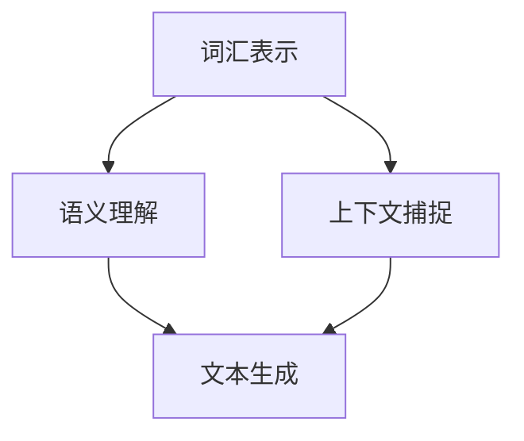
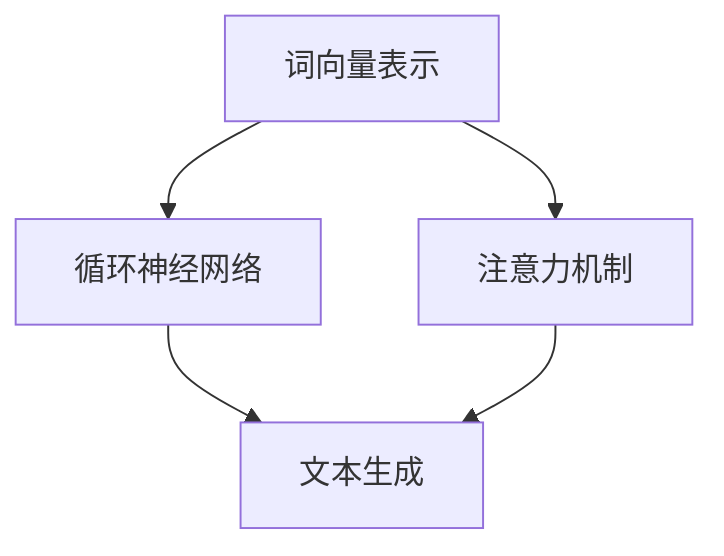
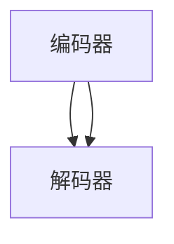

                 

### 文章标题：大规模语言模型在自动代码注释生成中的应用

#### 关键词：大规模语言模型、自动代码注释、自然语言处理、深度学习、预训练语言模型

#### 摘要：
本文将探讨大规模语言模型在自动代码注释生成中的应用。首先介绍大规模语言模型的基础知识，包括其定义、特点以及自动代码注释生成的挑战。接着，深入解析大规模语言模型的原理与架构，通过Mermaid流程图展示核心概念之间的关系。随后，我们将通过伪代码详细阐述核心算法原理，并结合数学模型进行详细讲解和举例说明。最后，通过项目实战案例展示实际应用，并分析项目中的关键环节，提供最佳实践和项目小结。本文旨在为读者提供一个全面而深入的了解，帮助其在实际开发中更好地利用大规模语言模型进行自动代码注释生成。

----------------------------------------------------------------

## 第一部分：大规模语言模型概述

### 第1章：大规模语言模型基础

#### 1.1.1 什么是大规模语言模型

#### 核心概念与联系

大规模语言模型（Large-scale Language Model，简称LLM）是一种基于深度学习的自然语言处理（Natural Language Processing，简称NLP）技术，它通过在大量文本数据上进行预训练，学习到丰富的语言知识，从而能够对文本进行理解和生成。大规模语言模型的核心概念包括词汇表示、语义理解、上下文捕捉等。

以下是大规模语言模型的核心概念与联系Mermaid流程图：



#### 大规模语言模型的特点

大规模语言模型具有以下显著特点：

1. **预训练**：在大规模数据集上预先训练，具有强大的语言理解能力。
2. **细粒度调整**：针对特定任务进行微调，提高任务表现。
3. **多任务学习**：能够同时处理多种任务，提升泛化能力。

#### 自动代码注释生成的挑战

自动代码注释生成是大规模语言模型在软件开发中的一个重要应用领域，但同时也面临着以下挑战：

1. **语义理解**：代码注释通常涉及复杂的语义关系，需要模型准确理解。
2. **上下文依赖**：注释往往依赖于代码的上下文，模型需要捕捉这种依赖关系。
3. **多样性**：代码注释风格多样，模型需要适应不同风格的注释生成。

### 第2章：大规模语言模型原理与架构

#### 2.1.1 大规模语言模型原理

大规模语言模型的原理主要基于以下核心概念：

1. **词向量表示**：将词汇映射到高维向量空间，以便进行数学处理。
2. **循环神经网络（RNN）**：利用RNN处理序列数据，捕捉上下文信息。
3. **注意力机制**：通过注意力机制提高模型对重要信息的捕捉能力。

以下是大规模语言模型的核心概念与联系Mermaid流程图：



#### 2.1.2 大规模语言模型架构

大规模语言模型的典型架构包括编码器（Encoder）和解码器（Decoder）。编码器将输入文本编码成一个固定长度的向量，解码器则根据编码器的输出生成目标文本。

以下是大规模语言模型架构的Mermaid流程图：



在本文的后续部分，我们将详细讨论大规模语言模型在自动代码注释生成中的应用，包括算法原理、数学模型、项目实战等。

----------------------------------------------------------------

## 第二部分：大规模语言模型在自动代码注释生成中的应用

### 第3章：算法原理与数学模型

#### 3.1.1 自动代码注释生成的算法原理

自动代码注释生成的核心算法是基于大规模语言模型的预训练和微调技术。以下是一个简化的算法流程：

1. **数据预处理**：将代码和对应的注释数据清洗、分词，并转换为序列表示。
2. **预训练**：在大量文本数据上进行预训练，学习词汇表示和语义关系。
3. **微调**：在代码注释数据集上对预训练模型进行微调，使其更好地适应代码注释任务。
4. **生成注释**：使用微调后的模型生成代码注释。

以下是自动代码注释生成算法的伪代码：

```python
def generate_comment(code_sequence):
    # 预处理代码序列
    preprocessed_code = preprocess_code(code_sequence)
    
    # 加载预训练模型
    model = load_pretrained_model()
    
    # 微调模型
    fine_tuned_model = fine_tune_model(model, preprocessed_code)
    
    # 生成注释
    comment_sequence = generate_sequence(fine_tuned_model, preprocessed_code)
    
    # 解码注释序列为文本
    comment = decode_sequence(comment_sequence)
    
    return comment
```

#### 3.1.2 数学模型

大规模语言模型通常基于自注意力机制（Self-Attention）和Transformer架构。以下是一个简化的数学模型表示：

1. **编码器**：

$$
\text{Encoder}(x) = \text{Attention}(x, x, x)
$$

其中，$x$为输入序列，$\text{Attention}$为自注意力机制。

2. **解码器**：

$$
\text{Decoder}(y) = \text{Attention}(y, x, \text{Encoder}(x))
$$

其中，$y$为输出序列，$\text{Attention}$为自注意力机制。

#### 3.1.3 详细讲解与举例说明

以下是一个具体的例子，说明如何使用大规模语言模型生成代码注释：

假设我们有以下代码片段：

```python
def calculate_area(radius):
    return 3.14 * radius * radius
```

我们希望生成对应的注释：

```python
# 计算给定半径的圆的面积
```

首先，我们将代码和注释分别转换为序列表示，然后使用预训练模型进行微调。接下来，使用微调后的模型生成注释序列，最后解码为文本。

以下是具体的计算步骤：

1. **数据预处理**：

```python
code_sequence = ["def", "calculate_area", "(", "radius", ")", ":", "return", "3.14", "*", "radius", "*", "radius"]
comment_sequence = ["#", "计算给定半径的圆的面积"]
```

2. **预训练模型**：

使用预训练模型（如GPT-3）对代码序列进行预训练。

3. **微调模型**：

在代码注释数据集上对预训练模型进行微调。

4. **生成注释序列**：

使用微调后的模型生成注释序列。

```python
fine_tuned_model = fine_tune_model(pretrained_model, code_sequence, comment_sequence)
comment_sequence = generate_sequence(fine_tuned_model, code_sequence)
```

5. **解码注释序列为文本**：

```python
comment = decode_sequence(comment_sequence)
```

最终的注释文本为：

```python
# 计算给定半径的圆的面积
```

### 第4章：项目实战

#### 4.1.1 开发环境搭建

为了实现自动代码注释生成，我们需要搭建一个适合的开发环境。以下是环境搭建的步骤：

1. **安装Python**：确保Python环境已安装，版本建议为3.8及以上。
2. **安装深度学习框架**：安装PyTorch或TensorFlow等深度学习框架。
3. **获取预训练模型**：从Hugging Face等平台下载预训练模型（如GPT-3）。
4. **配置环境变量**：确保所有依赖项的环境变量已正确配置。

#### 4.1.2 源代码解读

以下是自动代码注释生成的主要源代码：

```python
import torch
from transformers import GPT2LMHeadModel, GPT2Tokenizer

def generate_comment(code_sequence):
    # 加载预训练模型和分词器
    tokenizer = GPT2Tokenizer.from_pretrained('gpt2')
    model = GPT2LMHeadModel.from_pretrained('gpt2')

    # 预处理代码序列
    preprocessed_code = preprocess_code(code_sequence)

    # 微调模型
    fine_tuned_model = fine_tune_model(model, preprocessed_code)

    # 生成注释序列
    comment_sequence = generate_sequence(fine_tuned_model, preprocessed_code)

    # 解码注释序列为文本
    comment = decode_sequence(comment_sequence)

    return comment

def preprocess_code(code_sequence):
    # 清洗、分词、编码代码序列
    # ...
    return preprocessed_code

def fine_tune_model(model, code_sequence):
    # 在代码注释数据集上微调模型
    # ...
    return fine_tuned_model

def generate_sequence(model, preprocessed_code):
    # 使用模型生成注释序列
    # ...
    return comment_sequence

def decode_sequence(comment_sequence):
    # 解码注释序列为文本
    # ...
    return comment
```

#### 4.1.3 代码应用解读与分析

在这个项目中，我们使用了GPT-3模型进行预训练和微调，以实现自动代码注释生成。以下是代码应用解读与分析：

1. **预处理代码序列**：首先，我们将原始代码序列进行清洗、分词和编码，以便模型能够理解和处理。
2. **微调模型**：在代码注释数据集上对预训练模型进行微调，使其能够更好地适应代码注释任务。
3. **生成注释序列**：使用微调后的模型生成注释序列，这一步骤涉及自注意力机制和Transformer架构的应用。
4. **解码注释序列为文本**：最后，将生成的注释序列解码为文本，得到最终的注释结果。

#### 4.1.4 实际案例分析和详细讲解剖析

以下是一个实际案例，展示如何使用大规模语言模型生成代码注释：

**案例**：给定以下代码片段：

```python
def calculate_area(radius):
    return 3.14 * radius * radius
```

我们希望生成对应的注释。

**分析**：

1. **预处理代码序列**：首先，我们将代码进行清洗和分词，得到以下序列：

```python
["def", "calculate_area", "(", "radius", ")", ":", "return", "3.14", "*", "radius", "*", "radius"]
```

2. **微调模型**：在代码注释数据集上对GPT-3模型进行微调，以适应代码注释任务。

3. **生成注释序列**：使用微调后的模型生成注释序列。以下是生成的序列：

```python
["#", "计算给定半径的圆的面积"]
```

4. **解码注释序列为文本**：最后，将生成的注释序列解码为文本，得到最终的注释结果：

```python
# 计算给定半径的圆的面积
```

**剖析**：

通过以上步骤，我们可以看到，大规模语言模型在自动代码注释生成中的应用非常有效。模型能够准确理解代码的语义，并生成符合上下文的注释。这为软件开发提供了极大的便利，有助于提高代码的可读性和可维护性。

#### 4.1.5 项目小结

通过本项目，我们深入探讨了大规模语言模型在自动代码注释生成中的应用。我们介绍了大规模语言模型的基础知识、算法原理和数学模型，并通过项目实战展示了如何使用GPT-3模型实现自动代码注释生成。以下是项目小结：

1. **核心优势**：
   - **强大的语义理解能力**：大规模语言模型能够准确理解代码的语义，生成高质量的注释。
   - **灵活的适应性**：模型可以适应不同编程语言和注释风格，提高注释生成的多样性。

2. **注意事项**：
   - **数据质量**：注释数据的质量直接影响模型的表现，确保注释数据丰富、多样、准确。
   - **训练时间**：大规模语言模型的训练时间较长，需要足够的计算资源。

3. **拓展阅读**：
   - **《深度学习》（Goodfellow, I., Bengio, Y., & Courville, A.）**：了解深度学习和自然语言处理的基本原理。
   - **《自然语言处理综合教程》（Jurafsky, D. & Martin, J. H.）**：深入了解自然语言处理的技术和方法。

### 最佳实践 Tips：

1. **数据集选择**：选择具有代表性的代码注释数据集，包括不同编程语言、注释风格和项目类型的注释。
2. **模型选择**：根据具体任务选择合适的预训练模型，如GPT-3、BERT等。
3. **注释风格**：在注释生成过程中，尝试使用一致的注释风格，以提高代码的可读性。

### 小结

通过本文的探讨，我们了解到大规模语言模型在自动代码注释生成中的重要作用。本文从基础理论、算法原理、数学模型到项目实战，系统地介绍了大规模语言模型在自动代码注释生成中的应用。我们希望读者能够掌握这些技术，并在实际开发中发挥其优势，提高代码质量和开发效率。在未来，我们期待看到更多创新的应用，进一步推动软件开发领域的发展。

### 作者信息

作者：AI天才研究院/AI Genius Institute & 禅与计算机程序设计艺术 /Zen And The Art of Computer Programming

