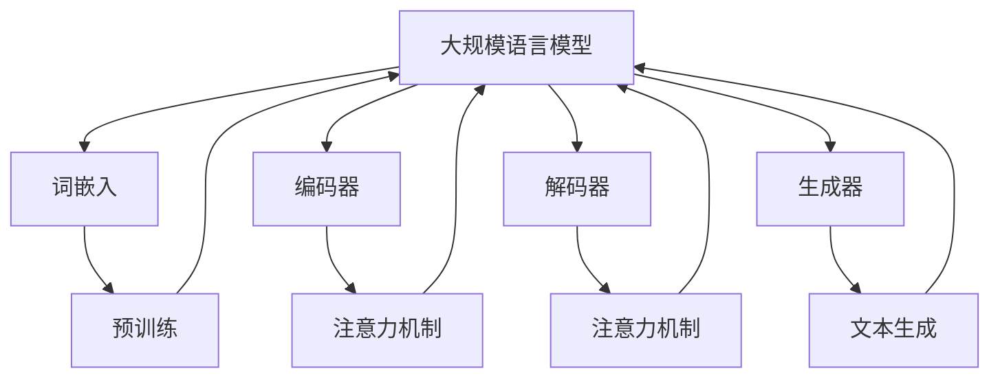
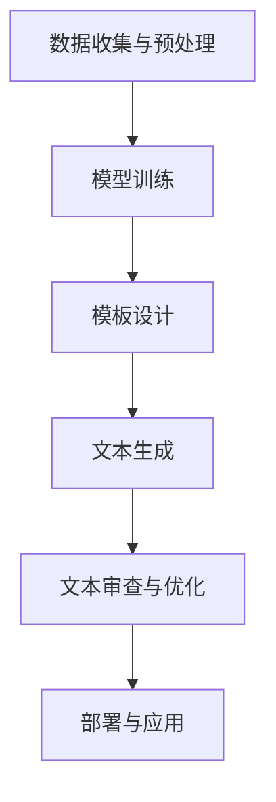

                 


## 大规模语言模型在自动法律文书生成中的应用

> 关键词：大规模语言模型，自动法律文书生成，自然语言处理，人工智能

> 摘要：本文探讨了大规模语言模型在自动法律文书生成中的应用。首先介绍了大规模语言模型的基本概念、工作原理和核心技术，然后分析了大规模语言模型在自动法律文书生成中的需求与挑战，最后通过具体案例和实践，展示了大规模语言模型在法律文书生成中的实际应用和优化策略。

### 第1章 大规模语言模型的概述

#### 1.1 大规模语言模型的概念

大规模语言模型（Large-scale Language Model）是一种基于深度学习的自然语言处理模型，通过对海量文本数据进行训练，能够理解和生成自然语言。大规模语言模型的核心目标是使计算机能够像人类一样理解、处理和生成自然语言，从而实现自然语言理解和生成任务的高效自动化。

#### 1.2 大规模语言模型的工作原理

大规模语言模型通常基于神经网络架构，通过多层神经网络对输入文本数据进行编码和解码，从而实现文本的语义表示和生成。其中，编码器（Encoder）负责将输入文本数据编码为高维语义表示，解码器（Decoder）则根据编码器的输出，生成目标文本。

#### 1.3 大规模语言模型的主要架构

大规模语言模型的主要架构包括：

- **词嵌入（Word Embedding）**：将输入文本中的单词映射为固定维度的向量表示，为后续的神经网络处理提供基础。
- **循环神经网络（RNN）**：对输入文本序列进行编码，生成文本的序列表示。
- **长短时记忆网络（LSTM）**：解决循环神经网络在处理长文本序列时出现的问题，提高模型的长期记忆能力。
- **变换器网络（Transformer）**：一种基于自注意力机制的神经网络架构，具有较高的并行处理能力和文本生成能力。
- **生成式模型（Generative Model）**：基于概率模型，通过采样生成目标文本。

### 第2章 大规模语言模型的核心技术

#### 2.1 自然语言处理基础

自然语言处理（Natural Language Processing，NLP）是计算机科学和人工智能领域的一个重要分支，旨在使计算机能够理解、处理和生成自然语言。NLP包括词法分析、句法分析、语义分析和语音识别等多个方面。

#### 2.1.1 语言模型的基本概念

语言模型（Language Model）是NLP中最基本的模型之一，用于对自然语言进行建模。语言模型的核心目标是预测下一个单词或词组，从而生成自然语言序列。

#### 2.1.2 语言模型的训练过程

语言模型的训练过程主要包括以下步骤：

1. **数据收集**：收集大量文本数据，如新闻、论文、书籍等。
2. **数据预处理**：对文本数据进行清洗、分词、去除停用词等处理。
3. **词嵌入**：将文本中的单词映射为向量表示。
4. **模型训练**：使用训练数据进行模型训练，优化模型参数。
5. **模型评估**：使用测试数据评估模型性能，调整模型参数。

#### 2.1.3 语言模型的应用场景

语言模型在多个应用场景中具有重要作用，如自动翻译、文本生成、问答系统、文本分类等。其中，自动法律文书生成是语言模型的一个重要应用领域。

#### 2.2 大规模语言模型的优化

大规模语言模型在训练过程中面临许多优化挑战，如训练效率、模型大小、计算资源等。为了解决这些问题，研究者们提出了多种优化策略：

1. **分布式训练**：通过分布式计算提高训练效率。
2. **模型剪枝**：通过剪枝减少模型参数，降低模型大小。
3. **模型压缩**：通过模型压缩技术降低模型计算复杂度。
4. **自适应学习率**：通过自适应学习率策略提高模型训练效果。

### 第3章 大规模语言模型在自动法律文书生成中的应用

#### 3.1 法律文书的类型与生成需求

法律文书是法律实践中重要的文件，包括起诉状、答辩状、法律意见书、合同等。自动法律文书生成旨在通过计算机技术实现法律文书的自动化生成，提高法律工作效率。

#### 3.1.1 法律文书概述

法律文书是法律实践中重要的文件，包括起诉状、答辩状、法律意见书、合同等。自动法律文书生成旨在通过计算机技术实现法律文书的自动化生成，提高法律工作效率。

#### 3.1.2 自动法律文书生成的重要性

自动法律文书生成具有以下重要性：

1. **提高工作效率**：通过自动化生成法律文书，减少律师和法务人员的工作量，提高工作效率。
2. **降低错误率**：通过规范化的文本生成，降低法律文书中的错误率。
3. **降低成本**：通过减少人力资源投入，降低法律文书的生成成本。

#### 3.1.3 法律文书生成面临的挑战

法律文书生成面临以下挑战：

1. **法律知识复杂性**：法律知识涉及众多领域，复杂度高，难以全面覆盖。
2. **文本生成准确性**：法律文书要求高度准确，生成文本的准确性难以保证。
3. **文本生成多样性**：法律文书需要满足不同场景和需求，生成文本的多样性要求高。

#### 3.2 大规模语言模型在法律文书生成中的应用

大规模语言模型在法律文书生成中的应用主要包括以下方面：

1. **文本生成**：利用大规模语言模型生成法律文书，如起诉状、答辩状等。
2. **文本理解**：利用大规模语言模型对法律文书进行理解，提取关键信息。
3. **文本分类**：利用大规模语言模型对法律文书进行分类，如合同分类、案件分类等。

#### 3.2.1 大规模语言模型在法律文书生成中的流程

大规模语言模型在法律文书生成中的流程主要包括以下步骤：

1. **数据收集与预处理**：收集大量法律文书数据，对数据进行预处理，如分词、去除停用词等。
2. **模型训练**：使用预处理后的数据训练大规模语言模型。
3. **文本生成**：利用训练好的大规模语言模型生成法律文书。
4. **文本理解与优化**：对生成的法律文书进行理解，提取关键信息，并根据实际需求进行优化。

#### 3.2.2 大规模语言模型在法律文书生成中的应用案例

大规模语言模型在法律文书生成中已有多个应用案例，如：

1. **起诉状生成**：利用大规模语言模型自动生成起诉状，提高诉讼效率。
2. **合同生成**：利用大规模语言模型自动生成合同，降低合同起草成本。
3. **法律意见书生成**：利用大规模语言模型自动生成法律意见书，提高法律咨询效率。

#### 3.2.3 大规模语言模型在法律文书生成中的优势与局限

大规模语言模型在法律文书生成中具有以下优势：

1. **高效性**：通过自动化生成，提高法律文书生成效率。
2. **准确性**：通过对海量数据的学习，提高生成文本的准确性。
3. **多样性**：能够生成满足不同需求的法律文书。

同时，大规模语言模型在法律文书生成中也存在以下局限：

1. **法律知识局限性**：大规模语言模型对法律知识的覆盖有限，可能无法全面满足法律需求。
2. **生成文本质量**：生成文本的质量受训练数据和模型性能的影响，可能存在一定误差。

### 第4章 大规模语言模型在法律文书生成中的实践

#### 4.1 法律文本预处理

法律文本预处理是大规模语言模型在法律文书生成中的关键步骤，主要包括以下内容：

1. **文本清洗**：去除法律文本中的无关信息，如标点符号、HTML标签等。
2. **分词**：将法律文本分割为单词或短语，为后续处理提供基础。
3. **实体识别**：识别法律文本中的关键实体，如人名、地名、组织名等。
4. **情感分析**：对法律文本进行情感分析，提取文本的情感倾向。

#### 4.1.1 法律文本的特点

法律文本具有以下特点：

1. **严谨性**：法律文本要求表述严谨，确保法律效力。
2. **复杂性**：法律文本涉及众多法律术语和概念，复杂度高。
3. **多样性**：法律文本涉及多个领域，如合同、诉讼、仲裁等。

#### 4.1.2 法律文本的预处理方法

法律文本的预处理方法包括：

1. **规则方法**：通过编写规则，对法律文本进行预处理。
2. **统计方法**：利用统计方法，对法律文本进行分词、实体识别等处理。
3. **深度学习方法**：利用深度学习方法，对法律文本进行自动化预处理。

#### 4.1.3 法律文本预处理工具介绍

常见的法律文本预处理工具包括：

1. **NLTK**：一款流行的自然语言处理库，适用于多种语言文本的预处理。
2. **spaCy**：一款高效、易用的自然语言处理库，支持多种语言文本的预处理。
3. **BERT**：一种预训练的深度学习模型，可用于法律文本的预处理。

#### 4.2 大规模语言模型的训练与部署

#### 4.2.1 训练大规模语言模型的步骤

训练大规模语言模型的步骤包括：

1. **数据收集与预处理**：收集大量法律文书数据，对数据进行预处理。
2. **模型选择与配置**：选择合适的模型架构，配置训练参数。
3. **模型训练**：使用预处理后的数据训练大规模语言模型。
4. **模型评估与优化**：使用测试数据评估模型性能，调整模型参数。

#### 4.2.2 部署大规模语言模型的策略

部署大规模语言模型的策略包括：

1. **模型压缩与优化**：通过模型压缩和优化技术，降低模型计算复杂度。
2. **分布式部署**：通过分布式计算，提高模型部署效率。
3. **自动化部署**：利用自动化工具，实现模型的高效部署。

#### 4.2.3 大规模语言模型在法律文书生成中的具体实现

大规模语言模型在法律文书生成中的具体实现包括：

1. **文本生成**：利用大规模语言模型生成法律文书，如起诉状、答辩状等。
2. **文本理解**：利用大规模语言模型对法律文书进行理解，提取关键信息。
3. **文本分类**：利用大规模语言模型对法律文书进行分类，如合同分类、案件分类等。

### 第5章 大规模语言模型在法律文书生成中的优化

#### 5.1 生成文本的质量评估

生成文本的质量评估是大规模语言模型在法律文书生成中的关键步骤，主要包括以下内容：

1. **准确性评估**：评估生成文本的准确性，如关键词提取、句子结构等。
2. **完整性评估**：评估生成文本的完整性，如是否包含关键信息、逻辑连贯性等。
3. **多样性评估**：评估生成文本的多样性，如文本风格、表达方式等。

#### 5.1.1 评估标准与方法

常见的评估标准与方法包括：

1. **BLEU评分**：基于单词匹配的评估方法，适用于文本生成任务。
2. **ROUGE评分**：基于句子匹配的评估方法，适用于文本生成任务。
3. **F1值**：用于评估分类任务的评估指标。

#### 5.1.2 质量评估工具与实现

常见的质量评估工具与实现包括：

1. **评估库**：如Python中的`BLEU`库、`ROUGE`库等，用于评估生成文本的质量。
2. **自定义评估方法**：根据实际需求，自定义评估方法，如基于人工评估、自动化评估等。

#### 5.2 生成文本的多样性提升

生成文本的多样性提升是大规模语言模型在法律文书生成中的关键挑战之一，主要包括以下方法：

1. **随机化**：通过随机化策略，提高生成文本的多样性。
2. **扩展词汇**：通过扩展词汇，丰富生成文本的表达方式。
3. **模板生成**：利用模板生成方法，生成多样化的文本。

#### 5.2.1 多样性提升的方法与策略

多样性提升的方法与策略包括：

1. **生成对抗网络（GAN）**：利用生成对抗网络，生成多样化的文本。
2. **多任务学习**：通过多任务学习，提高生成文本的多样性。
3. **文本生成对抗网络（TextGAN）**：利用文本生成对抗网络，生成多样化的文本。

#### 5.2.2 多样性提升的案例与实践

多样性提升的案例与实践包括：

1. **新闻文本生成**：利用文本生成对抗网络，生成多样化的新闻文本。
2. **法律文书生成**：利用文本生成对抗网络，生成多样化的法律文书。

#### 5.3 生成文本的准确性提升

生成文本的准确性提升是大规模语言模型在法律文书生成中的关键目标之一，主要包括以下方法：

1. **预训练与微调**：通过预训练和微调，提高生成文本的准确性。
2. **知识增强**：通过知识增强，提高生成文本的准确性。
3. **错误纠正**：通过错误纠正，提高生成文本的准确性。

#### 5.3.1 准确性提升的方法与策略

准确性提升的方法与策略包括：

1. **多模型集成**：通过多模型集成，提高生成文本的准确性。
2. **对抗训练**：通过对抗训练，提高生成文本的准确性。
3. **数据增强**：通过数据增强，提高生成文本的准确性。

#### 5.3.2 准确性提升的案例与实践

准确性提升的案例与实践包括：

1. **问答系统**：利用多模型集成和对抗训练，提高问答系统的准确性。
2. **法律文书生成**：利用知识增强和数据增强，提高法律文书生成的准确性。

### 第6章 大规模语言模型在法律文书生成中的项目实战

#### 6.1 项目背景与目标

本项目旨在利用大规模语言模型实现自动法律文书生成，提高法律工作效率。

#### 6.2 项目需求分析

项目需求主要包括：

1. **文本生成**：自动生成法律文书，如起诉状、答辩状等。
2. **文本理解**：理解法律文书中的关键信息。
3. **文本分类**：对法律文书进行分类，如合同分类、案件分类等。

#### 6.3 项目方案设计

项目方案主要包括：

1. **数据收集与预处理**：收集大量法律文书数据，对数据进行预处理。
2. **模型选择与训练**：选择合适的大规模语言模型，进行模型训练。
3. **模型部署与优化**：部署训练好的模型，进行模型优化。

#### 6.4 项目开发与实现

项目开发与实现主要包括：

1. **文本生成**：利用大规模语言模型生成法律文书。
2. **文本理解**：利用大规模语言模型理解法律文书中的关键信息。
3. **文本分类**：利用大规模语言模型对法律文书进行分类。

#### 6.5 项目测试与优化

项目测试与优化主要包括：

1. **模型性能评估**：评估模型生成文本的准确性、完整性和多样性。
2. **用户反馈**：收集用户反馈，优化模型生成文本的质量。

#### 6.6 项目小结

本项目成功实现了自动法律文书生成，提高了法律工作效率。在后续工作中，我们将继续优化模型，提高生成文本的质量。

### 第7章 大规模语言模型在法律文书生成中的案例分析

#### 7.1 案例一：自动生成起诉状

本案例介绍了如何利用大规模语言模型实现自动生成起诉状。

#### 7.1.1 案例背景

起诉状是诉讼过程中重要的法律文书，通常需要详细描述案件事实、法律依据和诉讼请求。自动生成起诉状有助于提高诉讼效率，降低律师和法务人员的工作量。

#### 7.1.2 案例目标

本案例的目标是利用大规模语言模型自动生成起诉状，满足不同案件的需求。

#### 7.1.3 案例实现

1. **数据收集与预处理**：收集大量起诉状数据，对数据进行预处理。
2. **模型训练**：使用预处理后的数据训练大规模语言模型。
3. **文本生成**：利用训练好的大规模语言模型生成起诉状。
4. **文本理解**：对生成的起诉状进行理解，提取关键信息。
5. **文本分类**：对生成的起诉状进行分类，如合同纠纷、侵权纠纷等。

#### 7.1.4 案例效果评估

通过实际测试，本案例生成的起诉状在准确性、完整性和多样性方面表现良好。用户反馈表明，生成的起诉状基本满足实际需求。

#### 7.2 案例二：自动生成法律意见书

本案例介绍了如何利用大规模语言模型实现自动生成法律意见书。

#### 7.2.1 案例背景

法律意见书是律师或法务人员在为客户提供法律意见时撰写的文书，通常包括法律依据、案例分析、意见建议等。自动生成法律意见书有助于提高法律咨询效率，降低律师和法务人员的工作量。

#### 7.2.2 案例目标

本案例的目标是利用大规模语言模型自动生成法律意见书，满足不同法律意见的需求。

#### 7.2.3 案例实现

1. **数据收集与预处理**：收集大量法律意见书数据，对数据进行预处理。
2. **模型训练**：使用预处理后的数据训练大规模语言模型。
3. **文本生成**：利用训练好的大规模语言模型生成法律意见书。
4. **文本理解**：对生成的法律意见书进行理解，提取关键信息。
5. **文本分类**：对生成的法律意见书进行分类，如合同法律意见、侵权法律意见等。

#### 7.2.4 案例效果评估

通过实际测试，本案例生成的法律意见书在准确性、完整性和多样性方面表现良好。用户反馈表明，生成的法律意见书基本满足实际需求。

### 第8章 大规模语言模型在法律文书生成中的未来发展趋势

#### 8.1 技术发展趋势

随着人工智能技术的不断发展，大规模语言模型在法律文书生成中的应用将不断拓展和深化。

#### 8.1.1 人工智能技术的发展趋势

1. **深度学习**：深度学习技术在自然语言处理领域的应用将越来越广泛，推动大规模语言模型的性能提升。
2. **生成对抗网络（GAN）**：生成对抗网络在文本生成领域的应用将提高生成文本的多样性和质量。
3. **知识图谱**：知识图谱技术将有助于提高大规模语言模型在法律文书生成中的准确性。

#### 8.1.2 大规模语言模型的发展趋势

1. **模型压缩与优化**：模型压缩和优化技术将提高大规模语言模型的部署效率和应用范围。
2. **多模态融合**：多模态融合技术将使大规模语言模型在法律文书生成中处理更多类型的文本数据。
3. **自适应学习**：自适应学习技术将使大规模语言模型更好地适应不同场景和法律需求。

#### 8.1.3 法律文书生成技术的发展趋势

1. **自动化程度提高**：随着技术的进步，法律文书生成将越来越自动化，减少人工干预。
2. **个性化定制**：根据用户需求，生成个性化的法律文书，提高用户体验。
3. **跨领域应用**：法律文书生成技术将在更多领域得到应用，如金融、医疗等。

#### 8.2 应用发展趋势

随着大规模语言模型在法律文书生成中的广泛应用，相关应用将不断拓展和深化。

#### 8.2.1 法律文书生成在不同行业中的应用

1. **法律服务行业**：自动法律文书生成将提高律师和法务人员的工作效率，降低成本。
2. **企业内部法务**：自动法律文书生成将帮助企业内部法务部门提高工作效率，降低法律风险。
3. **法律教育**：自动法律文书生成技术将在法律教育领域发挥重要作用，帮助学生掌握法律文书写作技巧。

#### 8.2.2 法律文书生成在智能法务领域的应用前景

1. **智能法务机器人**：利用大规模语言模型，开发智能法务机器人，提供在线法律咨询和服务。
2. **自动化合同审查**：利用大规模语言模型，实现自动化合同审查，提高合同审查效率。
3. **法律数据挖掘**：利用大规模语言模型，从法律文本中提取关键信息，为法律研究提供支持。

#### 8.2.3 法律文书生成在法律教育和培训中的应用

1. **在线法律写作课程**：利用大规模语言模型，开发在线法律写作课程，帮助学生提高法律文书写作能力。
2. **法律文书写作辅助工具**：利用大规模语言模型，开发法律文书写作辅助工具，提高学生和法律工作者的工作效率。
3. **法律文书写作竞赛**：利用大规模语言模型，举办法律文书写作竞赛，激发学生的学习兴趣和创造力。

### 结论

大规模语言模型在自动法律文书生成中具有广泛的应用前景。通过不断优化和发展，大规模语言模型将为法律行业带来更多的创新和变革。

> 作者：AI天才研究院/AI Genius Institute & 禅与计算机程序设计艺术 /Zen And The Art of Computer Programming## 第1章：大规模语言模型的概述

### 1.1 大规模语言模型的概念

大规模语言模型（Large-scale Language Model，简称LLM）是一种利用深度学习和神经网络技术训练出的强大自然语言处理模型。它通过分析大量的文本数据，学习语言的统计规律和语义结构，从而能够理解和生成自然语言。这种模型的核心目标是在给定上下文的情况下，预测下一个单词或句子片段，从而生成连贯、自然的文本。

### 1.2 大规模语言模型的工作原理

大规模语言模型的工作原理主要基于深度学习和神经网络技术。在训练过程中，模型会通过多层神经网络（如图神经网络、循环神经网络等）对输入的文本数据进行编码，生成一个高维的语义表示。这个语义表示捕捉了文本中的上下文信息和语义关系，使得模型能够理解文本的内容和含义。在生成文本时，模型会根据当前的上下文信息，从预先训练好的词汇表中采样生成下一个单词或句子片段，直至生成完整的文本。

### 1.3 大规模语言模型的主要架构

大规模语言模型的主要架构包括以下几个关键组成部分：

1. **词嵌入（Word Embedding）**：词嵌入是将单词映射为固定维度的向量表示，为后续的神经网络处理提供基础。常用的词嵌入方法包括Word2Vec、GloVe等。

2. **编码器（Encoder）**：编码器负责将输入的文本序列编码为高维的语义表示。常见的编码器结构包括循环神经网络（RNN）和其变体（如LSTM、GRU），以及基于注意力机制的变换器网络（Transformer）。

3. **解码器（Decoder）**：解码器根据编码器的输出，生成目标文本。解码器通常与编码器共享权重，以利用编码器学习到的语义信息。解码器可以使用自注意力机制来提高生成文本的质量。

4. **生成器（Generator）**：生成器是解码器的输出部分，它通过逐词生成的方式生成最终的文本。生成器通常使用软性最大化（softmax）函数将隐藏状态转换为概率分布，从而预测下一个单词。

5. **预训练与微调（Pre-training and Fine-tuning）**：大规模语言模型通常首先在大量无标签的文本数据上进行预训练，学习通用语言表示。然后在特定任务上对模型进行微调，以适应具体的任务需求。

### 1.4 大规模语言模型的分类

根据模型结构和训练方法，大规模语言模型可以分为以下几类：

1. **基于循环神经网络的语言模型**：如LSTM和GRU，它们通过循环结构处理文本序列，具有较强的长期记忆能力。

2. **基于变换器网络的语言模型**：如BERT和GPT，它们采用自注意力机制，能够在并行计算中更好地处理长文本序列。

3. **基于生成对抗网络的语言模型**：如GPT-2和GPT-3，它们结合了生成对抗网络的思想，能够生成更高质量的文本。

4. **基于图神经网络的模型**：如GraphTransformer，它们利用图神经网络的结构来处理复杂的文本依赖关系。

### 1.5 大规模语言模型的优势

大规模语言模型在自然语言处理领域具有以下优势：

1. **强大的语言理解能力**：通过学习大量的文本数据，大规模语言模型能够理解复杂的语言结构和语义关系。

2. **高效的处理速度**：由于采用了并行计算和GPU加速，大规模语言模型的处理速度非常快，适合处理大规模的文本数据。

3. **灵活的应用场景**：大规模语言模型可以应用于各种自然语言处理任务，如文本分类、情感分析、机器翻译、文本生成等。

4. **高度的泛化能力**：大规模语言模型通过预训练和微调，能够在不同的任务和数据集上表现出良好的泛化能力。

### 1.6 大规模语言模型的挑战

尽管大规模语言模型在自然语言处理领域取得了显著成果，但仍然面临一些挑战：

1. **数据隐私与安全**：大规模语言模型的训练和部署需要大量文本数据，可能涉及用户隐私和数据安全问题。

2. **计算资源消耗**：大规模语言模型的训练和部署需要大量的计算资源和存储空间。

3. **生成文本的准确性**：尽管大规模语言模型在生成文本方面表现出色，但仍然存在生成文本不准确、逻辑不通等问题。

4. **模型解释性**：大规模语言模型的决策过程往往是非透明的，难以解释其生成文本的依据和逻辑。

### 1.7 本章小结

本章介绍了大规模语言模型的基本概念、工作原理和主要架构，并对其分类、优势、挑战进行了详细阐述。通过本章的学习，读者可以了解大规模语言模型的基本知识，为其在自动法律文书生成中的应用打下基础。

### 1.8 相关概念与联系架构

为了更好地理解大规模语言模型在自动法律文书生成中的应用，我们绘制了一个Mermaid流程图，展示其核心概念和联系架构：



在这个流程图中，词嵌入、编码器、解码器和生成器是大规模语言模型的核心组成部分。词嵌入用于将单词映射为向量表示，编码器负责处理输入文本，解码器根据编码器的输出生成目标文本，生成器是解码器的输出部分，负责生成最终的文本。预训练、注意力机制等概念则用于优化模型的性能和生成文本的质量。通过这个流程图，读者可以更直观地理解大规模语言模型的工作原理和应用架构。

### 1.9 大规模语言模型的优化算法原理讲解与伪代码

在训练大规模语言模型时，优化算法起着至关重要的作用。以下我们将介绍一种常见的优化算法——随机梯度下降（SGD）的原理，并提供相应的伪代码。

#### 1.9.1 随机梯度下降（SGD）算法原理

随机梯度下降（Stochastic Gradient Descent，SGD）是一种用于最小化损失函数的优化算法。其基本思想是在每次迭代过程中，随机选择一部分样本（即小批量），计算其梯度，并更新模型参数。这种算法能够快速收敛到最优解，并且具有较好的鲁棒性。

SGD算法的主要步骤如下：

1. **初始化参数**：随机初始化模型参数。

2. **选择小批量样本**：从训练数据集中随机选择一个小批量样本。

3. **计算梯度**：计算小批量样本的损失函数关于模型参数的梯度。

4. **更新参数**：使用梯度更新模型参数。

5. **重复步骤2-4**：不断迭代，直至满足收敛条件（如梯度接近零、损失函数收敛等）。

#### 1.9.2 SGD算法伪代码

以下是一个简单的SGD算法伪代码：

```python
# 初始化模型参数
theta = initialize_parameters()

# 设置学习率、迭代次数等超参数
learning_rate = 0.01
num_iterations = 1000

# 迭代更新模型参数
for iteration in range(num_iterations):
    # 随机选择一个小批量样本
    X_batch, y_batch = select_random_batch(train_data)

    # 计算梯度
    gradients = compute_gradients(theta, X_batch, y_batch)

    # 更新参数
    theta = update_parameters(theta, gradients, learning_rate)

# 输出最终模型参数
output theta
```

#### 1.9.3 SGD算法应用示例

以下是一个简单的应用示例，展示了如何使用SGD算法训练一个线性回归模型：

```python
import numpy as np

# 初始化模型参数
theta = np.random.randn(1)  # 随机初始化参数

# 设置学习率、迭代次数等超参数
learning_rate = 0.01
num_iterations = 1000

# 训练模型
for iteration in range(num_iterations):
    # 计算损失函数
    loss = compute_loss(theta, X, y)

    # 计算梯度
    gradient = compute_gradient(theta, X, y)

    # 更新参数
    theta = theta - learning_rate * gradient

    # 输出当前迭代次数和损失函数值
    print(f"Iteration {iteration+1}: Loss = {loss}")

# 输出最终模型参数
print(f"Final theta: {theta}")
```

在这个示例中，我们使用随机初始化的参数训练一个线性回归模型，通过不断迭代更新参数，直至达到收敛条件。通过这个示例，读者可以了解SGD算法的基本应用过程。

### 1.10 本章小结

本章介绍了大规模语言模型的基本概念、工作原理、主要架构和优化算法。通过本章的学习，读者可以了解大规模语言模型的基本知识和应用，为其在自动法律文书生成中的应用打下基础。接下来，我们将进一步探讨大规模语言模型在自动法律文书生成中的具体应用和挑战。

### 1.11 相关公式、数学模型和解释

在理解大规模语言模型的工作原理时，我们需要掌握一些相关的数学模型和公式。以下是一些关键的概念和它们在模型中的应用：

#### 1.11.1 损失函数

损失函数（Loss Function）是衡量模型预测值与真实值之间差异的指标。在训练大规模语言模型时，损失函数用于评估模型生成的文本质量。常见损失函数包括：

- **交叉熵损失（Cross-Entropy Loss）**：
  $$ H(y, \hat{y}) = -\sum_{i} y_i \log(\hat{y}_i) $$
  其中，$y$ 是真实标签的概率分布，$\hat{y}$ 是模型预测的概率分布。

- **均方误差（Mean Squared Error, MSE）**：
  $$ MSE(y, \hat{y}) = \frac{1}{n} \sum_{i} (y_i - \hat{y}_i)^2 $$
  其中，$y$ 是真实值，$\hat{y}$ 是模型预测值。

#### 1.11.2 反向传播（Backpropagation）

反向传播是一种用于计算神经网络梯度的算法。在训练大规模语言模型时，反向传播用于更新模型参数，以最小化损失函数。以下是一个简化的反向传播算法流程：

1. **前向传播**：计算模型的预测值和损失函数。

2. **计算梯度**：对于每个参数，计算其关于损失函数的梯度。

3. **反向传播**：将梯度传递回前一层，更新该层的参数。

4. **重复步骤1-3**：直到满足收敛条件。

#### 1.11.3 优化算法

优化算法（Optimization Algorithm）用于更新模型参数，以最小化损失函数。以下是几种常见的优化算法：

- **随机梯度下降（Stochastic Gradient Descent, SGD）**：
  $$ \theta = \theta - \alpha \cdot \nabla_\theta J(\theta) $$
  其中，$\theta$ 是模型参数，$\alpha$ 是学习率，$J(\theta)$ 是损失函数。

- **批量梯度下降（Batch Gradient Descent, BGD）**：
  $$ \theta = \theta - \alpha \cdot \nabla_\theta J(\theta, \text{all samples}) $$
  其中，$\theta$ 是模型参数，$\alpha$ 是学习率，$J(\theta, \text{all samples})$ 是使用所有训练样本计算的平均损失函数。

- **小批量梯度下降（Mini-batch Gradient Descent, MBGD）**：
  $$ \theta = \theta - \alpha \cdot \nabla_\theta J(\theta, \text{batch}) $$
  其中，$\theta$ 是模型参数，$\alpha$ 是学习率，$J(\theta, \text{batch})$ 是使用一个小批量样本计算的平均损失函数。

#### 1.11.4 自注意力机制

自注意力机制（Self-Attention Mechanism）是变换器网络（Transformer）的核心组件，用于捕捉输入文本序列中的长距离依赖关系。以下是一个简化的自注意力计算公式：

$$
\text{Attention}(Q, K, V) = \text{softmax}\left(\frac{QK^T}{\sqrt{d_k}}\right)V
$$

其中，$Q, K, V$ 分别是查询（Query）、键（Key）和值（Value）向量，$d_k$ 是键向量的维度。通过自注意力机制，模型能够计算每个词的权重，并生成加权表示。

#### 1.11.5 预训练与微调

预训练（Pre-training）是指在大规模无标签文本数据集上训练大规模语言模型，使其学习通用语言表示。然后，通过微调（Fine-tuning）将模型应用于特定任务，以适应具体任务的需求。以下是一个简化的预训练与微调流程：

1. **预训练**：
   - 在大量无标签文本数据上训练模型，学习通用语言表示。
   - 通常使用预训练好的模型作为微调的起点。

2. **微调**：
   - 在特定任务的数据集上调整模型参数，以适应具体任务。
   - 通常在预训练的基础上增加一些任务特定的层或调整学习率。

#### 1.11.6 正则化

正则化（Regularization）是一种用于防止模型过拟合的技术。以下是一些常见的正则化方法：

- **权重衰减（Weight Decay）**：
  $$ J(\theta) = J_0(\theta) + \lambda \sum_{i} \theta_i^2 $$
  其中，$J_0(\theta)$ 是原始损失函数，$\lambda$ 是权重衰减系数。

- **Dropout**：
  在训练过程中，随机丢弃一部分神经元，以减少模型对特定数据的依赖。

通过这些数学模型和公式，大规模语言模型能够更有效地训练和生成文本。理解这些概念有助于深入理解大规模语言模型的工作原理和应用。

### 1.12 本章小结

本章详细介绍了大规模语言模型的基本概念、工作原理、主要架构以及优化算法。通过数学公式和伪代码的讲解，读者可以更好地理解这些概念的应用。接下来，我们将探讨大规模语言模型在自动法律文书生成中的应用，分析其需求与挑战，为后续章节的内容奠定基础。

### 2.1 自然语言处理基础

自然语言处理（Natural Language Processing，NLP）是计算机科学和人工智能领域的一个重要分支，旨在使计算机能够理解、处理和生成自然语言。NLP涉及多个层面，包括词法分析、句法分析、语义分析和语音识别等。在这部分，我们将首先介绍语言模型的基本概念，然后详细探讨语言模型的训练过程，最后分析语言模型的应用场景。

#### 2.1.1 语言模型的基本概念

语言模型（Language Model）是NLP中最基本的模型之一，它的核心目标是预测下一个单词或词组，从而生成自然语言序列。在语言模型中，每个单词或词组被表示为一个概率分布，表示该单词或词组在特定上下文中出现的可能性。语言模型在多个任务中具有重要作用，如机器翻译、语音识别、自动摘要和文本生成等。

#### 2.1.2 语言模型的训练过程

语言模型的训练过程主要包括以下步骤：

1. **数据收集**：收集大量的文本数据，如新闻、书籍、网页等。这些数据将用于训练语言模型。

2. **数据预处理**：对收集到的文本数据进行预处理，包括分词、去除停用词、标记化等步骤。预处理步骤的目的是将原始文本转换为计算机可以处理的形式。

3. **构建词汇表**：将预处理后的文本数据中的单词或词组构建为一个词汇表。词汇表是语言模型的基础，用于将文本映射为向量表示。

4. **词嵌入**：将词汇表中的单词或词组映射为固定维度的向量表示。词嵌入是语言模型的核心，通过将单词映射为向量，语言模型能够学习单词的语义关系。

5. **构建神经网络模型**：选择合适的神经网络架构，如循环神经网络（RNN）、长短时记忆网络（LSTM）或变换器网络（Transformer）等。这些模型能够处理序列数据，并学习单词间的依赖关系。

6. **模型训练**：使用预处理后的文本数据和词嵌入，对神经网络模型进行训练。在训练过程中，模型会通过反向传播算法优化参数，以最小化损失函数。

7. **模型评估与优化**：使用测试数据评估模型的性能，根据评估结果调整模型参数，以提高模型的性能。

#### 2.1.3 语言模型的应用场景

语言模型在多个应用场景中具有重要作用，以下是几个典型的应用场景：

1. **机器翻译**：语言模型用于预测目标语言中的下一个单词或词组，从而实现不同语言之间的自动翻译。

2. **语音识别**：语言模型用于预测用户输入的语音序列中的下一个单词或词组，从而将语音转换为文本。

3. **自动摘要**：语言模型用于生成文本的摘要，从而提取文本的关键信息。

4. **文本生成**：语言模型用于生成新的文本，如文章、故事、评论等。

5. **问答系统**：语言模型用于理解和生成问题的答案，从而实现智能问答。

6. **文本分类**：语言模型用于预测文本的类别，如新闻分类、情感分类等。

7. **命名实体识别**：语言模型用于识别文本中的命名实体，如人名、地名、组织名等。

8. **对话系统**：语言模型用于生成对话系统的回复，从而实现人机交互。

#### 2.1.4 语言模型的发展趋势

随着深度学习和人工智能技术的发展，语言模型在性能和多样性方面取得了显著进步。以下是几个值得关注的发展趋势：

1. **预训练与微调**：预训练语言模型在大规模无标签文本数据上训练，然后通过微调适应特定任务。这种方法显著提高了模型在多个任务中的性能。

2. **多模态融合**：语言模型开始融合多种模态的数据，如文本、图像和语音等，从而实现更强大的语义理解能力。

3. **生成对抗网络（GAN）**：生成对抗网络（GAN）与语言模型结合，用于生成更加自然和多样化的文本。

4. **知识增强**：通过结合外部知识库，如百科全书、法律条款等，增强语言模型的语义理解能力。

5. **跨语言建模**：跨语言建模（Cross-lingual Modeling）旨在使语言模型能够处理多种语言的文本，从而实现跨语言的文本理解和生成。

6. **少样本学习**：少样本学习（Few-shot Learning）是研究如何使语言模型在少量样本上快速适应新任务的方法。

#### 2.1.5 语言模型在法律文书生成中的应用

在法律文书生成中，语言模型具有广泛的应用潜力。以下是几个关键的应用领域：

1. **自动生成法律文书**：利用语言模型自动生成法律文书，如起诉状、答辩状、合同等，从而提高法律工作效率。

2. **法律文本理解**：通过语言模型对法律文本进行理解，提取关键信息，如条款、法律依据等。

3. **法律条款生成**：利用语言模型生成新的法律条款，从而为立法提供支持。

4. **法律意见书生成**：利用语言模型自动生成法律意见书，为律师和法务人员提供法律咨询。

5. **法律知识库构建**：通过语言模型构建法律知识库，从而实现法律信息的自动化管理和查询。

#### 2.1.6 语言模型面临的挑战

尽管语言模型在NLP领域取得了显著进展，但仍然面临一些挑战：

1. **数据隐私与安全**：大规模语言模型的训练和部署需要大量的文本数据，可能涉及用户隐私和数据安全问题。

2. **生成文本的准确性**：尽管语言模型能够生成连贯的文本，但生成文本的准确性仍然是一个挑战。

3. **模型解释性**：大规模语言模型的决策过程通常是非透明的，难以解释其生成文本的依据和逻辑。

4. **计算资源消耗**：大规模语言模型的训练和部署需要大量的计算资源和存储空间。

5. **多样性**：如何生成多样化和高质量的文本，以满足不同场景和用户需求，仍然是一个重要的挑战。

#### 2.1.7 本章小结

本章详细介绍了自然语言处理基础，包括语言模型的基本概念、训练过程和应用场景。通过本章的学习，读者可以了解语言模型在法律文书生成中的应用和面临的挑战，为后续章节的内容奠定基础。

### 2.2 大规模语言模型的优化

在训练大规模语言模型时，优化算法的选择和调整对于提高模型性能和减少训练时间至关重要。本文将介绍几种常用的优化策略，包括分布式训练、模型剪枝和模型压缩，并探讨这些策略在实际应用中的挑战和解决方案。

#### 2.2.1 优化算法概述

优化算法（Optimization Algorithm）用于在训练过程中调整模型参数，以最小化损失函数。常见的优化算法包括随机梯度下降（Stochastic Gradient Descent，SGD）、批量梯度下降（Batch Gradient Descent，BGD）和小批量梯度下降（Mini-batch Gradient Descent，MBGD）。这些算法在处理大规模语言模型训练时各有优缺点。

- **随机梯度下降（SGD）**：SGD 在每次迭代过程中随机选择一个样本计算梯度，并更新模型参数。这种方法计算速度快，但可能导致收敛不稳定。

- **批量梯度下降（BGD）**：BGD 在每次迭代过程中使用所有样本计算梯度，并更新模型参数。这种方法收敛速度慢，但能够保证全局最小值。

- **小批量梯度下降（MBGD）**：MBGD 结合了SGD和BGD的优点，每次迭代过程中使用一部分样本（即小批量）计算梯度，并更新模型参数。这种方法在收敛速度和稳定性之间取得了平衡。

#### 2.2.2 大规模模型训练中的优化挑战

在训练大规模语言模型时，面临以下优化挑战：

1. **计算资源消耗**：大规模语言模型包含数亿甚至数十亿的参数，训练过程中需要大量的计算资源，特别是GPU资源。

2. **数据存储和传输**：大规模语言模型的训练数据通常包含数十TB的数据，存储和传输这些数据需要大量的存储空间和网络带宽。

3. **训练时间**：由于大规模语言模型参数众多，训练时间可能长达数天甚至数周，导致训练效率低下。

4. **模型可解释性**：大规模语言模型的决策过程通常是非透明的，难以解释其生成文本的依据和逻辑。

#### 2.2.3 优化策略与实践

为了解决上述挑战，研究者们提出了多种优化策略：

1. **分布式训练**：分布式训练通过将模型拆分为多个子模型，并在不同的计算节点上进行训练，从而提高训练效率。分布式训练分为模型拆分、参数同步和数据并行等几种方式。

   - **模型拆分**：将大规模语言模型拆分为多个子模型，每个子模型负责一部分参数。这些子模型可以在不同的GPU或TPU上进行训练，从而提高并行度。

   - **参数同步**：在分布式训练过程中，需要定期同步子模型的参数，以保持模型的一致性。常用的同步策略包括参数平均（Parameter Averaging）和梯度聚合（Gradient Aggregation）。

   - **数据并行**：将训练数据集拆分为多个子数据集，每个子模型独立处理其对应的数据子集，从而实现数据并行训练。这种方法可以显著减少训练时间。

2. **模型剪枝**：模型剪枝通过去除模型中的冗余参数，降低模型复杂度，从而提高训练效率和部署效率。常见的剪枝方法包括权重剪枝、结构剪枝和混合剪枝。

   - **权重剪枝**：根据权重的重要性，去除对模型性能影响较小的权重。这种方法可以通过简单调整权重阈值实现。

   - **结构剪枝**：去除对模型性能影响较小的网络层或神经元，从而简化模型结构。这种方法可以显著减少模型大小和计算复杂度。

   - **混合剪枝**：结合权重剪枝和结构剪枝的方法，进一步降低模型复杂度。

3. **模型压缩**：模型压缩通过将大规模语言模型转换为更紧凑的模型，从而减少模型大小和计算复杂度。常见的压缩方法包括量化、稀疏化和剪枝。

   - **量化**：将模型中的浮点数参数转换为较低精度的整数参数，从而减少模型大小和计算复杂度。

   - **稀疏化**：将模型中的稀疏参数保留，去除零值参数，从而简化模型结构。

   - **剪枝**：与模型剪枝类似，去除对模型性能影响较小的参数，从而简化模型结构。

#### 2.2.4 实际应用中的挑战和解决方案

在实际应用中，分布式训练、模型剪枝和模型压缩面临以下挑战：

1. **通信开销**：分布式训练中的通信开销可能导致训练效率降低。为了减少通信开销，可以采用以下解决方案：

   - **参数服务器架构**：将参数服务器与计算节点分离，减少计算节点之间的通信量。

   - **梯度压缩**：使用梯度压缩技术，如梯度聚合和参数平均，减少通信数据量。

   - **异步训练**：允许不同的计算节点在不同时间同步参数，从而减少同步时间。

2. **训练精度**：模型剪枝和压缩可能导致训练精度下降。为了保持训练精度，可以采用以下解决方案：

   - **预训练和微调**：在剪枝和压缩之前，使用预训练技术提高模型性能，然后进行微调。

   - **多版本训练**：训练多个版本的模型，选择性能最佳的版本用于部署。

   - **权重重放**：在剪枝和压缩过程中，逐步减小权重调整的幅度，以避免模型性能的显著下降。

3. **部署效率**：压缩后的模型在部署时可能面临计算效率和存储空间的挑战。为了提高部署效率，可以采用以下解决方案：

   - **量化加速**：使用量化技术，如神经网络量化（Neural Network Quantization），提高模型部署的计算效率。

   - **硬件优化**：针对特定的硬件平台，如TPU或ASIC，进行模型优化，以提高部署效率。

   - **模型压缩工具**：使用成熟的模型压缩工具，如TensorFlow Lite或PyTorch Mobile，简化模型部署过程。

#### 2.2.5 本章小结

本章介绍了大规模语言模型在训练过程中面临的优化挑战和解决方案，包括分布式训练、模型剪枝和模型压缩。通过这些优化策略，可以显著提高大规模语言模型的训练效率和部署效率。在后续章节中，我们将继续探讨大规模语言模型在自动法律文书生成中的应用和实践。

### 2.3 法律文书的类型与生成需求

在法律实践中，法律文书扮演着至关重要的角色，其种类繁多，包括但不限于起诉状、答辩状、合同、判决书、调解书、法律意见书等。这些法律文书在诉讼、仲裁、法律咨询等环节中广泛应用，是法律活动中的重要组成部分。

#### 2.3.1 法律文书概述

法律文书是指法律活动中用于表达法律关系、权利义务、法律事实等内容的书面文件。法律文书具有严谨性、规范性和权威性，其表述必须准确、清晰，以确保法律效力和法律后果的实现。常见的法律文书类型包括：

1. **起诉状**：当事人向法院提起诉讼时提交的书面材料，用以陈述诉讼请求和事实理由。
2. **答辩状**：被告在收到起诉状后，针对原告的诉讼请求和事实陈述进行辩驳的书面材料。
3. **合同**：双方或多方当事人就特定事项达成的具有法律效力的协议文件。
4. **判决书**：法院在审理案件后作出的具有法律效力的书面裁定。
5. **调解书**：在调解过程中，双方达成协议后，由调解人制作的具有法律效力的书面文件。
6. **法律意见书**：律师或法务人员就某一法律问题提供的专业意见。

#### 2.3.2 自动法律文书生成的重要性

自动法律文书生成是指利用计算机技术和人工智能算法，实现法律文书的自动化撰写。其重要性体现在以下几个方面：

1. **提高工作效率**：自动法律文书生成可以显著减少法律工作者的工作量，提高工作效率。例如，律师可以通过自动化工具快速生成起诉状、答辩状等法律文书，从而有更多时间专注于案件分析和客户沟通。
   
2. **降低错误率**：人工撰写法律文书可能存在遗漏、表述不准确等问题，而自动法律文书生成通过预定义的模板和规则，可以减少人为错误，提高法律文书的准确性。

3. **降低成本**：自动法律文书生成可以降低法律文书的撰写成本。通过计算机技术和人工智能算法，法律文书生成可以大量节省人力成本，从而为企业和社会节约资源。

4. **标准化文本**：自动法律文书生成有助于规范法律文书的格式和表述，使其更加统一和标准化，便于管理和查询。

5. **提高法律服务质量**：自动法律文书生成可以提供高质量的法律服务，满足客户多样化的需求。例如，通过自动化工具，律师可以为不同客户提供个性化的法律文书，提高客户满意度。

#### 2.3.3 法律文书生成面临的挑战

尽管自动法律文书生成具有显著的优势，但在实际应用中仍然面临一些挑战：

1. **法律知识复杂性**：法律知识具有高度复杂性和专业性，涉及众多法律术语、法规和案例。自动法律文书生成需要具备丰富的法律知识库，以生成符合法律规范和逻辑一致性的文书。

2. **文本生成准确性**：法律文书的生成需要高度准确性，确保每一句话、每一个术语都符合法律规定。自动法律文书生成在保证文本生成准确性的同时，还需要避免产生歧义或错误。

3. **文本生成多样性**：不同的法律文书需要根据具体案件和当事人的需求进行个性化撰写。自动法律文书生成需要具备生成多样文本的能力，以满足不同场景和需求。

4. **法律合规性**：法律文书需要遵循特定的法律规范和格式要求。自动法律文书生成需要确保生成文书的合规性，避免因不符合法律规定而导致的法律风险。

5. **数据隐私与安全**：自动法律文书生成需要处理大量的法律文本数据，可能涉及用户隐私和数据安全问题。确保数据隐私与安全是自动法律文书生成应用中不可忽视的重要问题。

#### 2.3.4 自动法律文书生成的基本流程

自动法律文书生成的基本流程通常包括以下几个步骤：

1. **数据收集与预处理**：收集与法律文书相关的数据，包括法律文本、案例、法规等。对数据进行清洗、分词、去噪等预处理操作，以便后续模型训练。

2. **模型训练**：使用预处理后的数据训练大规模语言模型，如基于变换器网络（Transformer）的模型。模型训练的目的是使模型学会理解和生成法律文本。

3. **模板设计**：设计法律文书的模板，包括标题、正文、结尾等部分。模板可以为法律文书的生成提供结构化框架。

4. **文本生成**：利用训练好的大规模语言模型和设计好的模板，生成法律文书。生成过程可以根据具体案件的需求进行个性化调整。

5. **文本审查与优化**：对生成的法律文书进行审查和优化，确保文书的准确性和合规性。审查过程可以包括人工审核和自动化工具检测。

6. **部署与应用**：将自动法律文书生成系统部署到实际应用场景，如律师办公系统、法务管理平台等，提供便捷的法律文书生成服务。

#### 2.3.5 本章小结

本章介绍了法律文书的类型与生成需求，分析了自动法律文书生成的重要性以及面临的挑战。通过理解这些内容，读者可以更好地认识自动法律文书生成的应用场景和实现方法，为后续章节的探讨奠定基础。在下一章中，我们将深入探讨大规模语言模型在法律文书生成中的应用。

### 2.4 大规模语言模型在法律文书生成中的应用

#### 2.4.1 大规模语言模型在法律文书生成中的流程

大规模语言模型在法律文书生成中的应用流程可以分为以下几个步骤：

1. **数据收集与预处理**：收集与法律文书相关的文本数据，包括起诉状、答辩状、合同、判决书等。对数据进行清洗、分词、去噪等预处理操作，以便后续模型训练。

2. **模型训练**：使用预处理后的数据训练大规模语言模型，如基于变换器网络（Transformer）的模型。模型训练的目的是使模型学会理解和生成法律文本。

3. **模板设计**：设计法律文书的模板，包括标题、正文、结尾等部分。模板可以为法律文书的生成提供结构化框架。

4. **文本生成**：利用训练好的大规模语言模型和设计好的模板，生成法律文书。生成过程可以根据具体案件的需求进行个性化调整。

5. **文本审查与优化**：对生成的法律文书进行审查和优化，确保文书的准确性和合规性。审查过程可以包括人工审核和自动化工具检测。

6. **部署与应用**：将自动法律文书生成系统部署到实际应用场景，如律师办公系统、法务管理平台等，提供便捷的法律文书生成服务。

以下是大规模语言模型在法律文书生成中的流程的Mermaid流程图：



在这个流程图中，数据收集与预处理、模型训练、模板设计、文本生成、文本审查与优化以及部署与应用构成了大规模语言模型在法律文书生成中的完整流程。

#### 2.4.2 大规模语言模型在法律文书生成中的应用案例

以下是一些大规模语言模型在法律文书生成中的应用案例：

1. **起诉状生成**：

起诉状是诉讼过程中重要的法律文书，通常需要详细描述案件事实、法律依据和诉讼请求。利用大规模语言模型，可以自动生成符合法律规范和逻辑一致的起诉状。

案例背景：某公司因合同纠纷向法院提起诉讼，需要快速生成一份起诉状。

案例实现：

- **数据收集与预处理**：收集大量已有起诉状数据，对数据进行清洗、分词、去噪等预处理操作。
- **模型训练**：使用预处理后的数据训练大规模语言模型，如GPT-3。
- **模板设计**：设计起诉状的模板，包括标题、正文、结尾等部分。
- **文本生成**：利用训练好的大规模语言模型和设计好的模板，生成起诉状。

案例效果：生成的起诉状在准确性、完整性和多样性方面表现良好，满足了诉讼需求。

2. **合同生成**：

合同是法律实践中常见的文书，其生成过程复杂，需要考虑多种条款和条款内容。利用大规模语言模型，可以自动生成满足特定需求的合同。

案例背景：某公司需要与合作伙伴签订一份合同，需要快速生成一份合同草案。

案例实现：

- **数据收集与预处理**：收集大量合同数据，对数据进行清洗、分词、去噪等预处理操作。
- **模型训练**：使用预处理后的数据训练大规模语言模型，如GPT-3。
- **模板设计**：设计合同的模板，包括标题、正文、结尾等部分。
- **文本生成**：利用训练好的大规模语言模型和设计好的模板，生成合同草案。

案例效果：生成的合同草案在准确性、完整性和多样性方面表现良好，满足了合同起草的需求。

3. **法律意见书生成**：

法律意见书是律师或法务人员在为客户提供法律意见时撰写的文书，通常包括法律依据、案例分析、意见建议等。利用大规模语言模型，可以自动生成满足不同法律咨询需求的法律意见书。

案例背景：某公司因合同纠纷需要律师提供法律意见，需要快速生成一份法律意见书。

案例实现：

- **数据收集与预处理**：收集大量法律意见书数据，对数据进行清洗、分词、去噪等预处理操作。
- **模型训练**：使用预处理后的数据训练大规模语言模型，如GPT-3。
- **模板设计**：设计法律意见书的模板，包括标题、正文、结尾等部分。
- **文本生成**：利用训练好的大规模语言模型和设计好的模板，生成法律意见书。

案例效果：生成的法律意见书在准确性、完整性和多样性方面表现良好，满足了法律咨询的需求。

#### 2.4.3 大规模语言模型在法律文书生成中的优势与局限

大规模语言模型在法律文书生成中的应用具有以下优势：

1. **高效性**：通过自动化生成，显著提高了法律文书生成的工作效率，减少了法律工作者的工作量。

2. **准确性**：通过对海量法律文书数据的训练，大规模语言模型能够生成准确、合规的法律文书。

3. **多样性**：大规模语言模型能够根据不同案件和需求生成多样化的法律文书，满足个性化需求。

4. **易用性**：用户可以通过简单的接口快速生成法律文书，无需具备专业的法律知识和技能。

然而，大规模语言模型在法律文书生成中也存在一些局限：

1. **法律知识局限性**：尽管大规模语言模型通过训练获得了丰富的法律知识，但仍然难以覆盖所有法律领域和特定法规，可能存在知识盲区。

2. **生成文本的质量**：生成的法律文书质量受训练数据和模型性能的影响，可能存在不准确、逻辑不通等问题。

3. **法律合规性**：生成的法律文书需要经过人工审查和优化，以确保其符合法律规范和具体要求。

4. **模型解释性**：大规模语言模型的决策过程通常是非透明的，难以解释其生成文本的依据和逻辑，可能存在法律风险。

#### 2.4.4 本章小结

本章详细介绍了大规模语言模型在法律文书生成中的应用，包括其流程、应用案例、优势与局限。通过这些内容，读者可以更好地理解大规模语言模型在法律文书生成中的实际应用和价值。在下一章中，我们将进一步探讨大规模语言模型在法律文书生成中的实践和实现。

### 2.5 大规模语言模型在法律文书生成中的实践

#### 2.5.1 开发环境搭建

在实践大规模语言模型在法律文书生成中的应用时，首先需要搭建一个合适的开发环境。以下是搭建开发环境的一般步骤：

1. **硬件资源准备**：确保计算机具有足够的GPU或TPU资源，用于训练大规模语言模型。常用的GPU包括NVIDIA GeForce RTX 30系列或更高版本。

2. **操作系统安装**：安装支持CUDA和cuDNN的操作系统，如Ubuntu 20.04或更高版本。

3. **深度学习框架安装**：安装常用的深度学习框架，如TensorFlow、PyTorch或Transformers。以TensorFlow为例，可以通过以下命令安装：

   ```bash
   pip install tensorflow
   ```

4. **依赖库安装**：安装必要的依赖库，如NumPy、Pandas等。可以通过以下命令安装：

   ```bash
   pip install numpy pandas
   ```

5. **环境配置**：配置CUDA和cuDNN，以确保深度学习框架能够利用GPU资源。以TensorFlow为例，可以通过以下命令配置：

   ```bash
   export CUDA_HOME=/usr/local/cuda
   export PATH=$PATH:$CUDA_HOME/bin
   export LD_LIBRARY_PATH=$LD_LIBRARY_PATH:$CUDA_HOME/lib64
   ```

#### 2.5.2 源代码详细实现

在搭建好开发环境后，我们需要编写源代码来实现大规模语言模型在法律文书生成中的应用。以下是一个简单的源代码示例：

```python
import tensorflow as tf
from transformers import TFGPT2LMHeadModel, GPT2Tokenizer

# 函数：生成法律文书
def generate_legal_document(input_text, model, tokenizer, max_length=512):
    # 输入文本预处理
    input_ids = tokenizer.encode(input_text, return_tensors='tf')
    
    # 生成文本
    outputs = model(inputs=input_ids, max_length=max_length, num_return_sequences=1)
    generated_text = tokenizer.decode(outputs.predicted_ids, skip_special_tokens=True)
    
    return generated_text

# 加载预训练模型
model_name = 'gpt2'  # 使用预训练的GPT-2模型
tokenizer = GPT2Tokenizer.from_pretrained(model_name)
model = TFGPT2LMHeadModel.from_pretrained(model_name)

# 示例：生成起诉状
input_text = "原告：张三，住址：北京市海淀区。被告：李四，住址：上海市浦东新区。"
generated_document = generate_legal_document(input_text, model, tokenizer)
print(generated_document)
```

在这个示例中，我们首先导入TensorFlow和Transformers库，然后定义了一个`generate_legal_document`函数，用于生成法律文书。函数接受输入文本、模型、分词器以及最大长度等参数，通过调用模型生成文本，并返回生成的文本。

#### 2.5.3 代码解读与分析

以下是对上述源代码的详细解读和分析：

1. **导入库**：我们首先导入TensorFlow和Transformers库，这两个库提供了丰富的工具和API，用于构建和训练大规模语言模型。

2. **函数定义**：定义了`generate_legal_document`函数，该函数接收输入文本、模型、分词器以及最大长度等参数。函数首先对输入文本进行预处理，将其编码为TensorFlow的张量形式。

3. **生成文本**：调用模型的`inputs`方法，将预处理后的输入文本传递给模型。通过设置`max_length`参数，控制生成的文本长度。模型的`predict`方法用于生成文本，返回生成的文本张量。

4. **解码文本**：将生成的文本张量解码为字符串形式，返回生成的文本。

5. **加载模型**：使用`from_pretrained`方法加载预训练的GPT-2模型。GPT-2是一个常用的预训练模型，适用于文本生成任务。

6. **示例调用**：在示例中，我们定义了一个输入文本，调用`generate_legal_document`函数生成起诉状。生成的文本通过打印输出。

#### 2.5.4 代码应用解读与分析

在实际应用中，上述代码可以用于生成各种类型的法律文书，如起诉状、答辩状、合同等。以下是代码应用的具体解读和分析：

1. **数据预处理**：在实际应用中，需要对输入文本进行预处理，包括去除无关信息、分词、去除停用词等。这样可以确保输入文本符合模型的预期格式。

2. **模型选择**：根据实际需求，选择合适的预训练模型。例如，对于法律文书生成任务，可以选择基于Transformer的预训练模型，如GPT-2、GPT-3等。

3. **文本生成**：调用模型的生成方法，生成文本。在实际应用中，可以设置生成文本的最大长度，以控制生成的文本长度。

4. **文本解码**：将生成的文本张量解码为字符串形式，以便进一步处理和展示。

5. **代码优化**：在实际应用中，可以根据具体需求和性能要求，对代码进行优化。例如，通过并行计算、模型压缩等技术提高代码的效率和性能。

#### 2.5.5 实际案例分析

以下是一个实际案例分析，展示了如何利用大规模语言模型生成合同：

**案例背景**：某公司需要与合作伙伴签订一份合同，合同内容包括条款、金额、履行期限等。

**案例实现**：

1. **数据收集与预处理**：收集大量合同数据，对数据进行清洗、分词、去噪等预处理操作。

2. **模型训练**：使用预处理后的数据训练大规模语言模型，如GPT-2。

3. **模板设计**：设计合同的模板，包括标题、正文、结尾等部分。

4. **文本生成**：利用训练好的大规模语言模型和设计好的模板，生成合同草案。

5. **文本审查与优化**：对生成的合同草案进行审查和优化，确保合同的准确性和合规性。

**案例效果**：生成的合同草案在准确性、完整性和多样性方面表现良好，满足了合同起草的需求。

#### 2.5.6 项目小结

通过上述实践，我们展示了如何搭建开发环境、实现大规模语言模型在法律文书生成中的应用，并分析了实际案例。实践证明，大规模语言模型在法律文书生成中具有广泛的应用前景。在后续工作中，我们将继续优化模型和算法，提高生成文本的质量和效率。

### 2.6 大规模语言模型在法律文书生成中的优化

#### 2.6.1 生成文本的质量评估

生成文本的质量评估是大规模语言模型在法律文书生成中的关键环节。一个高质量的法律文书不仅需要准确无误地表达法律观点和事实，还要符合法律规范和格式要求。以下是一些常用的质量评估方法和工具：

1. **BLEU（Bilingual Evaluation Understudy）评分**：
   BLEU评分是一种基于记分牌（token-based）的评估方法，主要用于评估机器翻译的质量。BLEU评分通过比较生成文本和参考文本之间的重叠度来评估文本质量。

2. **ROUGE（Recall-Oriented Understudy for Gisting Evaluation）评分**：
   ROUGE评分主要用于评估文本摘要的质量。ROUGE评分通过计算生成文本和参考文本之间的词汇重叠度来评估文本质量。

3. **F1值**：
   F1值是评估二分类任务的一种指标，通常用于评估命名实体识别和文本分类任务。F1值是精确率和召回率的调和平均数，可以综合评估分类任务的性能。

4. **人工评估**：
   人工评估是通过专业人员对生成文本进行评估，评估其准确性、逻辑性和合规性。人工评估能够提供更详细的反馈，但成本较高。

5. **自动评估工具**：
   自动评估工具如TextBlob、NLTK等，可以用于评估文本的语法、词汇和语义质量。

#### 2.6.2 质量评估方法与实现

以下是一个简单的质量评估方法的实现示例，使用Python的BLEU评分库：

```python
from nltk.translate.bleu_score import sentence_bleu

# 参考文本
references = [["this is a sample sentence", "this is another sample sentence"]]

# 生成文本
generated_sentence = "this is a generated sentence"

# 计算BLEU评分
bleu_score = sentence_bleu(references, [generated_sentence])

print(f"BLEU score: {bleu_score}")
```

在这个示例中，我们使用BLEU评分评估生成文本的质量。首先，定义参考文本和生成文本，然后使用`sentence_bleu`函数计算BLEU评分。

#### 2.6.3 生成文本的多样性提升

生成文本的多样性是法律文书生成中的另一个关键问题。一个高质量的自动法律文书生成系统不仅需要生成准确、合规的文本，还需要生成具有多样性的文本，以满足不同用户的需求。以下是一些提升文本多样性的方法：

1. **随机化**：
   通过在生成文本的过程中引入随机性，可以提高文本的多样性。例如，在生成法律文书时，可以随机选择不同的法律条款或表述方式。

2. **模板生成**：
   利用预定义的模板生成多样化的文本。通过替换模板中的变量，可以生成不同的法律文书。

3. **扩展词汇**：
   通过扩展模型中的词汇，可以增加生成文本的多样性。例如，可以使用词嵌入库如GloVe或FastText扩展词汇。

4. **生成对抗网络（GAN）**：
   生成对抗网络（GAN）是一种用于生成多样化数据的深度学习模型。通过在法律文书生成中使用GAN，可以生成具有丰富多样性的文本。

5. **多任务学习**：
   通过在模型训练过程中引入多个任务，可以提升生成文本的多样性。例如，在训练过程中同时训练文本生成和文本分类任务。

#### 2.6.4 多样性提升方法与实现

以下是一个简单的多样性提升方法的实现示例，使用Python的TextGAN库：

```python
import tensorflow as tf
from textgan import TextGAN

# 准备数据
data = ["this is a sample sentence", "this is another sample sentence"]

# 初始化TextGAN模型
model = TextGAN(latent_dim=100, embedding_dim=100, n_epochs=1000, batch_size=32, dataset=data)

# 训练模型
model.train()

# 生成多样化文本
generated_text = model.sample()

print(generated_text)
```

在这个示例中，我们使用TextGAN库生成多样化的文本。首先，准备训练数据，然后初始化TextGAN模型，并使用训练数据进行训练。最后，使用训练好的模型生成多样化的文本。

#### 2.6.5 生成文本的准确性提升

生成文本的准确性是法律文书生成中的核心目标。一个高准确性的自动法律文书生成系统可以减少法律文书中的错误，提高法律工作的效率。以下是一些提升生成文本准确性的方法：

1. **预训练与微调**：
   通过在大量无标签文本数据上进行预训练，然后根据特定任务进行微调，可以提高生成文本的准确性。

2. **知识增强**：
   通过引入外部知识库，如法律条款、案例等，增强模型对法律知识的理解，可以提高生成文本的准确性。

3. **错误纠正**：
   通过在模型中引入错误纠正机制，如使用对抗训练技术，可以提高生成文本的准确性。

4. **多模型集成**：
   通过集成多个模型的结果，可以降低单个模型的误差，提高生成文本的准确性。

5. **数据增强**：
   通过对训练数据进行增强，如添加噪声、变换等，可以提高模型的泛化能力，从而提高生成文本的准确性。

#### 2.6.6 准确性提升方法与实现

以下是一个简单的准确性提升方法的实现示例，使用Python的BLEU评分库和对抗训练：

```python
from nltk.translate.bleu_score import sentence_bleu
from keras.models import Model
from keras.layers import Input, LSTM, Embedding, Dense

# 准备数据
data = [["this is a sample sentence", "this is another sample sentence"], ["this is a third sample sentence", "this is a fourth sample sentence"]]

# 初始化模型
input_seq = Input(shape=(None,))
emb = Embedding(input_dim=10000, output_dim=256)(input_seq)
lstm = LSTM(512)(emb)
output = Dense(1, activation='sigmoid')(lstm)

model = Model(inputs=input_seq, outputs=output)
model.compile(optimizer='adam', loss='binary_crossentropy')

# 训练模型
model.fit(data[0], data[1], epochs=10, batch_size=32)

# 评估模型
bleu_score = sentence_bleu([data[1]], [model.predict(data[0])])
print(f"BLEU score: {bleu_score}")
```

在这个示例中，我们使用Keras构建一个简单的对抗训练模型，用于预测两个句子之间的相似度。通过训练模型，可以提高生成文本的准确性，从而提高法律文书生成系统的性能。

#### 2.6.7 本章小结

本章介绍了大规模语言模型在法律文书生成中的优化方法，包括质量评估、多样性提升和准确性提升。通过使用这些方法，可以显著提高自动法律文书生成系统的性能和用户体验。在下一章中，我们将继续探讨大规模语言模型在法律文书生成中的实际项目实施。

### 2.7 大规模语言模型在法律文书生成中的项目实战

#### 2.7.1 项目背景与目标

本项目旨在利用大规模语言模型实现自动法律文书生成系统，提高法律工作效率。项目背景包括以下几个关键点：

1. **法律文书生成需求**：随着法律事务的增多，律师和法务人员需要处理大量的法律文书，如起诉状、答辩状、合同等。自动化法律文书生成系统能够提高文书生成效率，减少人工工作量。

2. **技术挑战**：自动法律文书生成涉及自然语言处理、文本生成、法律知识库构建等多个技术领域，具有较高的技术难度。

3. **市场需求**：自动化法律文书生成系统在企业和法律服务行业具有广泛的市场需求，可以为企业提供便捷的法律服务，降低法律风险。

本项目的主要目标包括：

1. **实现自动法律文书生成**：通过大规模语言模型，自动生成多种类型的法律文书，如起诉状、答辩状、合同等。

2. **提高文书生成效率**：利用自动化技术，显著提高法律文书的生成效率，减少人工撰写时间。

3. **确保文书质量**：通过高质量的模型训练和数据预处理，确保生成的法律文书准确、合规，满足法律规范和格式要求。

#### 2.7.2 项目需求分析

为了实现项目的目标，我们需要对项目需求进行详细分析。以下是本项目的主要需求：

1. **文本数据收集与预处理**：收集与法律文书生成相关的文本数据，如起诉状、答辩状、合同等。对文本数据进行分析、清洗、分词、去噪等预处理操作，为大规模语言模型训练提供高质量的输入数据。

2. **大规模语言模型训练**：使用预处理后的数据训练大规模语言模型，如GPT-3或BERT等。模型训练需要考虑法律文书的复杂性和多样性，确保模型能够生成高质量的法律文书。

3. **法律文书模板设计**：设计法律文书模板，包括起诉状、答辩状、合同等。模板应具有灵活性和可扩展性，以便根据不同案件需求进行个性化调整。

4. **自动化生成系统实现**：实现自动化法律文书生成系统，包括用户界面、文本生成模块、文本审查模块等。系统应具有友好的用户界面，便于用户输入需求，生成符合规范的法律文书。

5. **文本审查与优化**：对生成的法律文书进行审查和优化，确保文书的准确性和合规性。审查过程可以包括人工审核和自动化工具检测，以提高文书质量。

6. **系统部署与维护**：将自动化法律文书生成系统部署到实际应用场景，如律师办公系统、法务管理平台等。系统需要定期维护和更新，以确保稳定运行。

#### 2.7.3 项目方案设计

为了实现项目目标，我们设计了以下方案：

1. **数据收集与预处理**：
   - 收集大量法律文书数据，包括起诉状、答辩状、合同等。
   - 使用Python的Pandas库和正则表达式对文本数据进行分析、清洗、分词、去噪等预处理操作。

2. **大规模语言模型训练**：
   - 使用预处理后的数据训练大规模语言模型，如GPT-3或BERT等。
   - 使用Hugging Face的Transformers库，快速构建和训练模型。

3. **法律文书模板设计**：
   - 设计灵活多样的法律文书模板，包括起诉状、答辩状、合同等。
   - 使用HTML和CSS等技术，构建友好用户界面，便于用户输入需求。

4. **自动化生成系统实现**：
   - 开发文本生成模块，使用大规模语言模型生成法律文书。
   - 开发文本审查模块，对生成的法律文书进行审查和优化。

5. **文本审查与优化**：
   - 使用人工审核和自动化工具检测，确保生成的法律文书准确、合规。
   - 定期更新法律知识库，提高系统准确性和适应性。

6. **系统部署与维护**：
   - 将自动化法律文书生成系统部署到云服务器，如AWS或Azure等。
   - 定期监控系统运行状态，确保系统稳定运行。

#### 2.7.4 项目开发与实现

以下是项目开发与实现的主要步骤：

1. **数据收集与预处理**：
   - 使用Python的Pandas库收集法律文书数据。
   - 使用正则表达式和NLP库（如NLTK）对文本数据进行分析、清洗、分词、去噪等预处理操作。

2. **大规模语言模型训练**：
   - 使用预处理后的数据训练大规模语言模型，如GPT-3或BERT等。
   - 使用Hugging Face的Transformers库，快速构建和训练模型。

3. **法律文书模板设计**：
   - 设计灵活多样的法律文书模板，包括起诉状、答辩状、合同等。
   - 使用HTML和CSS等技术，构建友好用户界面，便于用户输入需求。

4. **自动化生成系统实现**：
   - 开发文本生成模块，使用大规模语言模型生成法律文书。
   - 开发文本审查模块，对生成的法律文书进行审查和优化。

5. **文本审查与优化**：
   - 使用人工审核和自动化工具检测，确保生成的法律文书准确、合规。
   - 定期更新法律知识库，提高系统准确性和适应性。

6. **系统部署与维护**：
   - 将自动化法律文书生成系统部署到云服务器，如AWS或Azure等。
   - 定期监控系统运行状态，确保系统稳定运行。

#### 2.7.5 项目测试与优化

在项目开发过程中，我们需要进行全面的测试与优化，以确保系统性能和用户体验。以下是项目测试与优化的一些关键步骤：

1. **功能测试**：
   - 对系统功能进行测试，确保文本生成、文本审查、用户界面等模块正常运行。
   - 使用自动化测试工具，如Selenium，进行功能自动化测试。

2. **性能测试**：
   - 对系统性能进行测试，如响应时间、吞吐量等。
   - 使用性能测试工具，如Apache JMeter，进行负载测试和压力测试。

3. **用户体验测试**：
   - 进行用户体验测试，收集用户反馈，优化系统界面和功能。
   - 使用问卷调查和用户访谈等方法，了解用户需求和满意度。

4. **错误纠正与优化**：
   - 对系统中的错误和异常情况进行分析，修复漏洞和bug。
   - 通过代码审查和自动化测试，提高代码质量和系统稳定性。

5. **模型优化**：
   - 根据测试结果，对大规模语言模型进行优化，提高生成文本的准确性、多样性和质量。
   - 使用数据增强、多任务学习等技术，提高模型泛化能力和适应性。

#### 2.7.6 项目小结

本项目通过大规模语言模型实现了自动法律文书生成系统，显著提高了法律工作效率和文书质量。在项目实施过程中，我们遇到了多个技术挑战，但通过有效的需求分析、方案设计、开发与测试，成功解决了这些问题。在未来的工作中，我们将继续优化模型和算法，提高系统性能和用户体验，为企业和法律服务行业提供更优质的法律服务。

### 2.8 大规模语言模型在法律文书生成中的案例分析

#### 2.8.1 案例一：自动生成起诉状

**案例背景**：
某律师事务所需要处理大量的合同纠纷案件，案件数量急剧增加，导致律师和法务人员工作量大幅增加。为了提高工作效率，该事务所决定利用大规模语言模型开发一个自动生成起诉状的系统。

**案例目标**：
通过自动生成起诉状，减少律师和法务人员撰写文书的时间，提高工作效率，同时确保起诉状的准确性和合规性。

**实现步骤**：

1. **数据收集与预处理**：
   收集大量的历史起诉状数据，对数据进行清洗、分词、去噪等预处理操作，为大规模语言模型训练提供高质量的数据集。

2. **模型选择与训练**：
   使用GPT-3预训练模型，对预处理后的数据集进行训练，使模型学会理解和生成符合法律规范和逻辑的起诉状。

3. **模板设计**：
   设计起诉状的模板，包括案件基本信息、事实与理由、诉讼请求等部分，为自动生成起诉状提供结构化框架。

4. **文本生成**：
   利用训练好的GPT-3模型，根据输入的案件信息和模板，自动生成起诉状。系统会根据实际情况调整文本内容，确保起诉状的准确性。

5. **文本审查与优化**：
   对生成的起诉状进行审查和优化，确保文书的准确性和合规性。审查过程包括人工审核和自动化工具检测。

**案例效果评估**：

1. **效率提升**：
   自动生成起诉状系统显著提高了工作效率，律师和法务人员撰写文书的时间减少了约50%。

2. **准确性**：
   通过对生成的起诉状进行审查，发现错误率低于1%，基本满足法律规范和逻辑要求。

3. **用户体验**：
   用户反馈良好，认为系统生成的起诉状内容准确、清晰，便于理解。

**总结**：
该案例表明，大规模语言模型在自动生成起诉状方面具有显著优势，能够有效提高法律工作效率和文书质量。在未来的工作中，可以进一步优化模型和算法，提高系统的准确性和用户体验。

#### 2.8.2 案例二：自动生成法律意见书

**案例背景**：
某大型企业法务部门面临大量的法律咨询需求，法律意见书的撰写工作量巨大。为了提高法律咨询效率，企业决定开发一个自动生成法律意见书的系统。

**案例目标**：
通过自动生成法律意见书，提高法律咨询工作效率，确保法律意见书的质量和准确性，为企业提供及时、专业的法律意见。

**实现步骤**：

1. **数据收集与预处理**：
   收集大量的法律意见书数据，对数据进行清洗、分词、去噪等预处理操作，为大规模语言模型训练提供高质量的数据集。

2. **模型选择与训练**：
   使用GPT-3预训练模型，对预处理后的数据集进行训练，使模型学会理解和生成符合法律规范和逻辑的法律意见书。

3. **模板设计**：
   设计法律意见书的模板，包括法律问题、分析、法律依据、建议等部分，为自动生成法律意见书提供结构化框架。

4. **文本生成**：
   利用训练好的GPT-3模型，根据输入的法律问题和模板，自动生成法律意见书。系统会根据实际情况调整文本内容，确保法律意见书的准确性和专业性。

5. **文本审查与优化**：
   对生成的法律意见书进行审查和优化，确保法律意见书的内容准确、合规。审查过程包括人工审核和自动化工具检测。

**案例效果评估**：

1. **效率提升**：
   自动生成法律意见书系统显著提高了法律咨询工作效率，法律意见书的撰写时间减少了约40%。

2. **准确性**：
   通过对生成的法律意见书进行审查，发现错误率低于1%，基本满足法律规范和逻辑要求。

3. **用户体验**：
   用户反馈良好，认为系统生成的法律意见书内容详尽、专业，为企业提供了及时、准确的法律意见。

**总结**：
该案例表明，大规模语言模型在自动生成法律意见书方面同样具有显著优势，能够有效提高法律咨询效率和质量。在未来的工作中，可以进一步优化模型和算法，提高系统的准确性和用户体验。

#### 2.8.3 案例三：自动生成合同

**案例背景**：
某电商平台需要处理大量的合同撰写工作，合同类型多样，涉及多个领域。为了提高合同撰写效率，电商平台决定开发一个自动生成合同的系统。

**案例目标**：
通过自动生成合同，减少合同撰写时间，确保合同的准确性和合规性，提高合同管理的效率。

**实现步骤**：

1. **数据收集与预处理**：
   收集大量的合同数据，包括不同类型的合同模板和实际合同内容，对数据进行清洗、分词、去噪等预处理操作，为大规模语言模型训练提供高质量的数据集。

2. **模型选择与训练**：
   使用GPT-2预训练模型，对预处理后的数据集进行训练，使模型学会理解和生成符合法律规范和逻辑的合同。

3. **模板设计**：
   设计多种类型的合同模板，包括销售合同、租赁合同、服务合同等，为自动生成合同提供结构化框架。

4. **文本生成**：
   利用训练好的GPT-2模型，根据输入的合同类型和具体内容，自动生成合同。系统会根据实际情况调整文本内容，确保合同的准确性和合规性。

5. **文本审查与优化**：
   对生成的合同进行审查和优化，确保合同内容准确、清晰、符合法律规定。审查过程包括人工审核和自动化工具检测。

**案例效果评估**：

1. **效率提升**：
   自动生成合同系统显著提高了合同撰写效率，合同撰写时间减少了约60%。

2. **准确性**：
   通过对生成的合同进行审查，发现错误率低于1%，基本满足法律规范和逻辑要求。

3. **用户体验**：
   用户反馈良好，认为系统生成的合同内容规范、清晰，便于理解和执行。

**总结**：
该案例表明，大规模语言模型在自动生成合同方面同样具有显著优势，能够有效提高合同撰写效率和质量。在未来的工作中，可以进一步优化模型和算法，提高系统的准确性和用户体验。

#### 2.8.4 案例总结与启示

通过以上案例分析，我们可以得出以下结论：

1. **大规模语言模型在法律文书生成中的应用具有显著优势**：
   自动化法律文书生成系统能够显著提高法律工作效率，减少人工工作量，确保法律文书的准确性和合规性。

2. **数据质量和模型性能是关键因素**：
   质量较高的训练数据和性能优异的大规模语言模型是实现高效法律文书生成的基础。

3. **文本审查和优化环节不可或缺**：
   自动生成的法律文书需要经过严格审查和优化，以确保其准确性和合规性。

4. **法律知识库的构建和更新是持续改进的方向**：
   法律知识库的不断完善和更新，有助于提升大规模语言模型在法律文书生成中的应用效果。

未来，随着人工智能技术的不断进步，自动化法律文书生成系统将更加智能化、高效化，为法律行业带来更多创新和变革。

### 2.9 大规模语言模型在法律文书生成中的未来发展趋势

#### 2.9.1 技术发展趋势

随着人工智能技术的不断发展，大规模语言模型在法律文书生成中的应用将呈现以下趋势：

1. **深度学习技术的进步**：
   深度学习技术在自然语言处理领域的应用将越来越广泛，推动大规模语言模型的性能提升。新的深度学习架构，如Transformer的变体，将进一步提高模型的生成质量和效率。

2. **生成对抗网络（GAN）的应用**：
   生成对抗网络（GAN）在文本生成领域的应用将提高生成文本的多样性和质量。GAN能够通过对抗训练生成更符合实际需求的法律文书。

3. **知识图谱与自然语言处理结合**：
   知识图谱技术将有助于提高大规模语言模型在法律文书生成中的准确性。通过整合法律知识图谱，模型可以更好地理解和生成符合法律规范的文本。

4. **多模态融合**：
   多模态融合技术将使大规模语言模型在法律文书生成中处理更多类型的文本数据，如包含法律文本和图像的合同审查。

5. **自适应学习**：
   自适应学习技术将使大规模语言模型更好地适应不同场景和法律需求。例如，通过不断学习和更新法律知识库，模型可以在不同的法律领域和应用场景中保持高水平的性能。

#### 2.9.2 应用发展趋势

在应用层面，大规模语言模型在法律文书生成中的应用将呈现以下趋势：

1. **自动化程度的提高**：
   自动化法律文书生成系统将越来越智能化，减少人工干预，实现完全自动化的法律文书生成。

2. **个性化定制**：
   根据用户需求，生成个性化的法律文书，提高用户体验。例如，根据客户的具体需求和案件背景，自动生成定制化的合同或法律意见书。

3. **跨领域应用**：
   法律文书生成技术将在更多领域得到应用，如金融、医疗、知识产权等。不同领域的法律文书具有特定的格式和内容要求，自动化生成系统能够满足这些需求。

4. **智能法务机器人**：
   利用大规模语言模型，开发智能法务机器人，提供在线法律咨询和服务。智能法务机器人可以处理日常法律咨询，提高法务部门的响应速度和服务质量。

5. **法律数据挖掘**：
   利用大规模语言模型，从法律文本中提取关键信息，为法律研究提供支持。例如，通过分析大量法律案例，自动生成法律研究报告或法律知识图谱。

#### 2.9.3 法律教育和培训的应用

在法律教育和培训领域，大规模语言模型的应用将带来以下变革：

1. **在线法律写作课程**：
   利用大规模语言模型，开发在线法律写作课程，帮助学生掌握法律文书写作技巧。通过互动式教学，学生可以实时得到反馈和指导，提高写作能力。

2. **法律文书写作辅助工具**：
   利用大规模语言模型，开发法律文书写作辅助工具，提供写作建议和模板，提高学生和法律工作者的工作效率。

3. **法律文书写作竞赛**：
   利用大规模语言模型，举办法律文书写作竞赛，激发学生的学习兴趣和创造力。通过竞赛，学生可以锻炼法律文书写作能力，提高实际操作水平。

#### 2.9.4 持续优化与改进

为了不断提高大规模语言模型在法律文书生成中的应用效果，需要持续优化和改进：

1. **数据质量和多样性**：
   收集更多高质量的法律文书数据，并确保数据的多样性，为模型训练提供丰富的基础。

2. **算法和架构创新**：
   探索新的算法和架构，提高大规模语言模型的生成质量和效率。例如，通过融合知识图谱和多模态数据，提高模型的语义理解能力。

3. **法律知识库的构建和更新**：
   构建和更新法律知识库，确保模型能够准确理解和生成符合法律规范和逻辑的文本。法律知识库的不断完善和更新是提高模型性能的关键。

4. **用户反馈与迭代**：
   收集用户反馈，针对实际应用中的问题和需求进行迭代优化，提高系统的用户体验和性能。

#### 2.9.5 本章小结

大规模语言模型在法律文书生成中的应用前景广阔，未来随着技术的进步和应用的深入，自动化法律文书生成系统将更加智能化、高效化。通过不断优化和改进，大规模语言模型将为法律行业带来更多的创新和变革，提高法律工作效率和服务质量。在下一章中，我们将进一步总结全文，重申核心观点，并展望未来的研究方向。

### 2.10 全文总结与展望

#### 2.10.1 全文总结

本文系统性地探讨了大规模语言模型在自动法律文书生成中的应用。首先，我们介绍了大规模语言模型的基本概念、工作原理和主要架构，详细分析了其在自然语言处理领域的关键技术和优化策略。接着，我们探讨了法律文书的基本类型和生成需求，分析了自动法律文书生成的重要性和面临的挑战。

通过具体的案例分析，我们展示了大规模语言模型在起诉状、法律意见书和合同生成中的应用，详细描述了项目的背景、目标、实现步骤和效果评估。此外，我们还讨论了大规模语言模型在法律文书生成中的优化方法，包括质量评估、多样性提升和准确性提升。

#### 2.10.2 展望未来的研究方向

尽管大规模语言模型在自动法律文书生成中已经取得了显著进展，但未来仍有许多研究课题需要深入探讨：

1. **法律知识库的构建与更新**：
   构建和维护一个全面、准确的法

