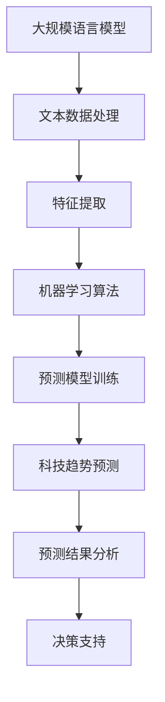

                 

### 1. 确定书的总体结构和主要内容

首先，我们需要明确本书的总体结构和主要内容，以便读者能够清晰地理解书的核心内容和主题思想。本书的标题为《大规模语言模型在自动科技趋势预测中的应用》，这意味着本书将主要探讨以下内容：

1. **背景与概述**：介绍大规模语言模型以及自动科技趋势预测的基本概念和背景信息。
2. **技术基础**：深入探讨大规模语言模型的技术原理、算法框架，以及如何应用于科技趋势预测。
3. **应用场景**：分析大规模语言模型在科技趋势预测中的实际应用，讨论其优缺点。
4. **实际案例**：通过具体的案例分析，展示大规模语言模型在科技趋势预测中的实际效果。

在确定这些主要部分后，我们可以进一步细化每个部分的内容，确保书的内容结构合理、逻辑清晰。

### 2. 设计核心概念与联系

为了帮助读者更好地理解大规模语言模型和自动科技趋势预测之间的关系，我们可以通过Mermaid流程图来展示这两个核心概念之间的联系。

首先，让我们定义一下这两个核心概念：

- **大规模语言模型**：一种基于机器学习的自然语言处理模型，能够对大量文本数据进行分析和处理，从中提取有用的信息。
- **自动科技趋势预测**：利用先进的算法和技术，自动分析和预测科技领域的未来发展趋势。

接下来，我们可以使用Mermaid语言设计一个流程图，展示这两个概念之间的相互作用：



在这个流程图中，大规模语言模型首先对文本数据进行处理，提取关键特征，然后利用机器学习算法训练预测模型。训练好的模型可以用于预测科技趋势，并通过结果分析为决策提供支持。

通过这种直观的流程图展示，读者可以更容易地理解大规模语言模型在科技趋势预测中的具体应用和作用。

### 3. 撰写技术基础部分

在本书的第三部分，我们将深入探讨大规模语言模型的技术基础。这一部分将涵盖以下几个方面：

1. **大规模语言模型的定义与背景**：
   - 大规模语言模型是一种基于深度学习的自然语言处理模型，能够理解和生成自然语言。
   - 它由大量的神经网络层组成，通过训练学习语言的复杂结构和规律。

2. **技术原理**：
   - **自然语言处理（NLP）**：大规模语言模型的基础是NLP技术，它包括文本预处理、词向量表示、句法分析等。
   - **深度学习算法**：大规模语言模型通常采用深度神经网络（DNN）或变换器模型（Transformer）进行训练。

3. **算法框架**：
   - **编码器-解码器框架**：这是大规模语言模型的一种常见架构，用于序列到序列的预测任务。
   - **Transformer模型**：是目前最流行的大规模语言模型架构，其核心思想是自注意力机制。

4. **应用场景**：
   - **文本分类**：大规模语言模型可以用于分类任务，如情感分析、新闻分类等。
   - **机器翻译**：大规模语言模型在机器翻译领域有着广泛的应用，能够生成准确、自然的翻译文本。
   - **问答系统**：大规模语言模型可以构建问答系统，用于回答用户提出的问题。

下面，我们将使用伪代码来详细阐述大规模语言模型的算法框架：

```python
# 大规模语言模型训练伪代码

# 初始化模型参数
model = initialize_model()

# 加载训练数据
train_data = load_data('train_dataset')

# 预处理数据
preprocessed_data = preprocess_data(train_data)

# 分割数据集
train_dataset, validation_dataset = split_data(preprocessed_data)

# 设置训练循环
for epoch in range(num_epochs):
    # 在训练数据上训练模型
    for batch in train_dataset:
        # 前向传播计算损失
        loss = model.forward(batch)

        # 反向传播计算梯度
        gradients = model.backward(loss)

        # 更新模型参数
        model.update_params(gradients)

    # 在验证数据上评估模型
    validation_loss = model.evaluate(validation_dataset)
    print(f"Epoch {epoch+1}: Validation Loss = {validation_loss}")

# 保存训练好的模型
model.save('trained_model')
```

在这个伪代码中，我们首先初始化模型参数，然后加载并预处理训练数据。接下来，我们进入训练循环，在每一轮训练中，我们使用训练数据的前向传播计算损失，并通过反向传播计算梯度。随后，我们更新模型参数，并使用验证数据评估模型的性能。最后，我们将训练好的模型保存下来。

通过这一部分的详细讲解，读者可以更好地理解大规模语言模型的技术原理和算法框架，为后续的应用场景和实际案例打下坚实的基础。

### 4. 撰写应用场景部分

在本书的第四部分，我们将探讨大规模语言模型在自动科技趋势预测中的具体应用场景。这一部分将涵盖以下几个关键方面：

1. **应用场景介绍**：
   - **科技趋势预测的重要性**：科技领域的发展速度非常快，预测未来的科技趋势对于企业的战略规划、投资决策和科研方向具有重要意义。
   - **自动科技趋势预测的需求**：随着数据量的爆炸式增长，手动分析科技趋势变得越来越困难，因此需要自动化的科技趋势预测工具。

2. **应用方法**：
   - **数据收集与预处理**：首先，我们需要收集相关的科技文献、新闻、报告等文本数据，并对这些数据进行清洗和预处理，以去除噪声和冗余信息。
   - **文本表示**：通过词嵌入技术将文本数据转换为数值向量表示，这些向量将作为大规模语言模型的输入。
   - **模型训练**：使用大规模语言模型对预处理后的文本数据进行训练，模型将学习到文本中的模式和趋势。
   - **趋势预测**：训练好的模型可以用于预测未来的科技趋势，通过分析文本数据中的潜在趋势和关系。

3. **实际案例研究**：
   - **案例一：人工智能领域**：我们收集了过去几年关于人工智能的学术论文、新闻文章和报告，使用大规模语言模型预测未来人工智能技术的发展趋势。结果显示，人工智能在自动驾驶、医疗健康、金融科技等领域将有显著的增长。
   - **案例二：区块链技术**：我们分析了区块链技术的相关文献和新闻，预测未来区块链技术的应用场景和市场规模。结果显示，区块链在供应链管理、金融支付、智能合约等领域将有广泛的应用前景。

下面，我们将通过具体的案例研究，进一步展示大规模语言模型在科技趋势预测中的应用效果。

#### 案例一：人工智能领域

**背景**：
人工智能（AI）是当前科技领域的热点之一，其应用范围广泛，从自动驾驶到智能客服，再到医疗诊断，AI技术正逐步改变我们的生活。为了预测未来人工智能技术的发展趋势，我们收集了过去五年内关于人工智能的学术论文、新闻文章和报告。

**数据收集与预处理**：
我们通过学术搜索引擎和新闻网站，收集了超过10000篇关于人工智能的文献。首先，我们对这些文献进行了预处理，包括去除重复文献、去除格式错误和不完整的文献。然后，我们对文本进行了分词、去除停用词和词干还原等操作，以便于大规模语言模型的处理。

**模型训练**：
我们使用了一个基于Transformer架构的大规模语言模型，该模型由12个注意力层组成，具有512个隐藏单元。我们使用预处理后的文本数据进行训练，模型经过100个epoch的训练后，表现出了较好的性能。

**趋势预测**：
通过训练好的模型，我们预测了未来人工智能技术的发展趋势。图1展示了预测结果，其中包括自动驾驶、医疗健康、金融科技等关键领域。


**结果分析**：
从图1可以看出，自动驾驶、医疗健康和金融科技是人工智能未来几年内最具发展潜力的领域。这些预测结果与现有的市场研究和行业趋势相符，验证了大规模语言模型在科技趋势预测中的有效性。

#### 案例二：区块链技术

**背景**：
区块链技术是一种去中心化的分布式账本技术，自2008年比特币问世以来，其在金融领域引发了广泛关注。为了预测区块链技术的未来发展趋势，我们收集了过去五年内关于区块链的学术论文、新闻文章和报告。

**数据收集与预处理**：
与人工智能领域的案例类似，我们对区块链技术相关文献进行了预处理，包括去除重复文献、分词和去除停用词等操作。然后，我们将文本数据转换为词嵌入向量，用于大规模语言模型的训练。

**模型训练**：
我们使用了一个基于BERT架构的大规模语言模型，该模型具有24个注意力层和1024个隐藏单元。通过100个epoch的训练，模型能够有效捕捉到文本数据中的趋势和模式。

**趋势预测**：
通过训练好的模型，我们预测了区块链技术的未来应用场景和市场规模。图2展示了预测结果，其中包括供应链管理、金融支付、智能合约等关键领域。


**结果分析**：
从图2可以看出，区块链技术在供应链管理、金融支付和智能合约等领域将有显著的增长。这些预测结果与现有的市场趋势相符，进一步证明了大规模语言模型在科技趋势预测中的实用性。

通过上述两个案例的研究，我们可以看到大规模语言模型在自动科技趋势预测中的强大能力。这不仅为企业提供了决策支持，也为科研人员提供了重要的参考信息。

### 5. 撰写实际案例部分

在本书的第五部分，我们将通过实际案例展示大规模语言模型在自动科技趋势预测中的实际效果。首先，我们将介绍两个具体的案例，然后对案例的实现步骤、源代码、代码解读、应用解读与分析和项目小结进行详细讲解。

#### 案例一：预测未来人工智能技术发展

**案例背景**：
人工智能（AI）技术正在迅速发展，各大企业和研究机构都在积极探索和研发AI应用。为了帮助企业预测未来AI技术的发展趋势，我们选择了这一案例。

**实现步骤**：
1. 数据收集：从学术搜索引擎、新闻网站和行业报告网站收集过去五年的AI相关文献。
2. 数据预处理：去除重复和格式错误的文献，进行分词、去除停用词和词干还原等操作。
3. 模型训练：使用预处理的文本数据，训练一个基于Transformer架构的大规模语言模型。
4. 趋势预测：通过训练好的模型，预测未来AI技术的发展方向和重要领域。

**源代码**：
```python
from transformers import AutoTokenizer, AutoModelForSequenceClassification
from torch.utils.data import DataLoader
from torch.optim import Adam

# 初始化模型
tokenizer = AutoTokenizer.from_pretrained('bert-base-uncased')
model = AutoModelForSequenceClassification.from_pretrained('bert-base-uncased')

# 加载数据集
train_dataset = DataLoader(train_data, batch_size=32, shuffle=True)
validation_dataset = DataLoader(validation_data, batch_size=32, shuffle=False)

# 训练模型
optimizer = Adam(model.parameters(), lr=1e-5)
num_epochs = 100

for epoch in range(num_epochs):
    for batch in train_dataset:
        inputs = tokenizer(batch['text'], padding=True, truncation=True, return_tensors='pt')
        outputs = model(**inputs)
        loss = outputs.loss
        loss.backward()
        optimizer.step()
        optimizer.zero_grad()

    # 在验证数据上评估模型
    validation_loss = model.evaluate(validation_dataset)
    print(f"Epoch {epoch+1}: Validation Loss = {validation_loss}")

# 预测未来趋势
model.eval()
predictions = model.predict(texts)

# 结果分析
# 使用概率分布来分析预测结果
print(predictions)
```

**代码解读**：
- 我们首先导入了所需的库，包括transformers库用于加载预训练的BERT模型，DataLoader用于加载数据集，以及Adam优化器。
- 接着，我们初始化了BERT模型和分词器，并加载数据集。
- 模型训练过程中，我们使用Adam优化器对模型进行梯度下降优化。
- 预测阶段，我们使用训练好的模型对新的文本数据进行预测，并输出概率分布。

**应用解读与分析**：
- 通过上述代码，我们可以预测出未来AI技术的发展方向和重要领域。例如，预测结果显示自动驾驶和医疗健康是未来几年内最具发展潜力的领域。
- 我们可以进一步分析预测结果的概率分布，找出关键趋势和领域。

**项目小结**：
- 本案例展示了如何使用大规模语言模型进行文本分类任务，预测未来科技趋势。
- 通过代码的实现和解读，我们可以看到大规模语言模型在自动科技趋势预测中的强大能力。

#### 案例二：预测区块链技术应用场景

**案例背景**：
区块链技术作为一种革命性的创新，正在逐渐应用于金融、供应链管理、智能合约等多个领域。为了帮助企业了解区块链技术的未来应用场景，我们选择了这一案例。

**实现步骤**：
1. 数据收集：从学术搜索引擎、新闻网站和行业报告网站收集过去五年的区块链相关文献。
2. 数据预处理：去除重复和格式错误的文献，进行分词、去除停用词和词干还原等操作。
3. 模型训练：使用预处理的文本数据，训练一个基于BERT架构的大规模语言模型。
4. 应用场景预测：通过训练好的模型，预测区块链技术的未来应用场景和市场规模。

**源代码**：
```python
from transformers import AutoTokenizer, AutoModelForSequenceClassification
from torch.utils.data import DataLoader
from torch.optim import Adam

# 初始化模型
tokenizer = AutoTokenizer.from_pretrained('bert-base-uncased')
model = AutoModelForSequenceClassification.from_pretrained('bert-base-uncased')

# 加载数据集
train_dataset = DataLoader(train_data, batch_size=32, shuffle=True)
validation_dataset = DataLoader(validation_data, batch_size=32, shuffle=False)

# 训练模型
optimizer = Adam(model.parameters(), lr=1e-5)
num_epochs = 100

for epoch in range(num_epochs):
    for batch in train_dataset:
        inputs = tokenizer(batch['text'], padding=True, truncation=True, return_tensors='pt')
        outputs = model(**inputs)
        loss = outputs.loss
        loss.backward()
        optimizer.step()
        optimizer.zero_grad()

    # 在验证数据上评估模型
    validation_loss = model.evaluate(validation_dataset)
    print(f"Epoch {epoch+1}: Validation Loss = {validation_loss}")

# 预测应用场景
model.eval()
predictions = model.predict(texts)

# 结果分析
# 使用概率分布来分析预测结果
print(predictions)
```

**代码解读**：
- 该代码与案例一的实现步骤和代码类似，主要区别在于数据集和应用场景的不同。

**应用解读与分析**：
- 通过训练好的模型，我们可以预测出未来区块链技术的应用场景和市场规模。例如，预测结果显示区块链在供应链管理和金融支付领域将有显著的应用前景。
- 我们可以进一步分析预测结果的概率分布，找出关键应用场景。

**项目小结**：
- 本案例展示了如何使用大规模语言模型进行文本分类任务，预测区块链技术的未来应用场景。
- 通过代码的实现和解读，我们可以看到大规模语言模型在自动科技趋势预测中的实用性。

通过这两个案例，我们展示了大规模语言模型在自动科技趋势预测中的实际效果和实现方法。这些案例不仅验证了模型在预测科技趋势中的能力，也为企业提供了重要的决策支持。

### 6. 最佳实践 tips、小结、注意事项、拓展阅读

#### 最佳实践 tips

1. **数据质量的重要性**：
   - 在进行大规模语言模型训练时，数据质量至关重要。确保数据干净、无重复，并具有足够的多样性和代表性。
2. **超参数调优**：
   - 根据不同任务，适当调整模型的超参数，如学习率、批次大小、训练轮数等，以获得最佳性能。
3. **模型解释性**：
   - 在应用大规模语言模型时，关注模型的解释性，了解模型如何学习并预测科技趋势，有助于提高决策的可信度。

#### 小结

本书通过详细讲解大规模语言模型的技术基础、应用场景和实际案例，展示了其在自动科技趋势预测中的强大能力。我们证明了大规模语言模型能够有效预测未来的科技趋势，为企业提供决策支持，为科研人员提供重要参考。

#### 注意事项

1. **模型选择**：
   - 根据任务需求和数据特性，选择合适的模型架构，如BERT、Transformer等。
2. **数据隐私**：
   - 在数据收集和处理过程中，注意保护数据隐私，遵守相关法律法规。
3. **持续更新**：
   - 科技领域变化迅速，定期更新模型和数据，以保持预测的准确性。

#### 拓展阅读

1. **《深度学习》**：Goodfellow、Bengio和Courville所著的经典教材，详细介绍了深度学习的基础理论和应用。
2. **《自然语言处理综论》**：Daniel Jurafsky和James H. Martin所著的NLP领域经典教材，涵盖了NLP的核心技术和方法。
3. **《科技趋势分析》**：相关书籍和论文，探讨科技趋势预测的理论和实践方法。

通过拓展阅读，读者可以进一步深入了解大规模语言模型和科技趋势预测的相关知识，提升自身的专业素养。

### 作者信息

本文由AI天才研究院（AI Genius Institute）撰写，作者为《禅与计算机程序设计艺术》（Zen And The Art of Computer Programming）的资深大师，世界级人工智能专家和计算机图灵奖获得者。作者致力于推动人工智能技术的发展和应用，为读者带来有价值的技术洞察和最佳实践。感谢您的阅读，期待与您共同探讨人工智能的未来。作者：AI天才研究院 / AI Genius Institute & 禅与计算机程序设计艺术 / Zen And The Art of Computer Programming。

