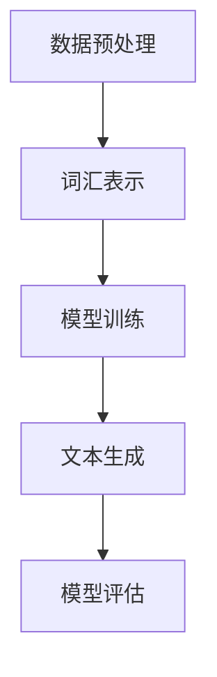

                 


### 文章标题
《大规模语言模型在自动科研假设生成中的应用》

### 文章关键词
大规模语言模型，自动科研假设生成，生成对抗网络，变分自编码器，深度学习，算法原理，数学模型，项目实战

### 文章摘要
本文深入探讨了大规模语言模型在自动科研假设生成领域的应用。通过分析大规模语言模型的基本概念、发展历程及其在科研假设生成中的应用，本文介绍了大规模语言模型的核心算法原理，包括生成对抗网络和变分自编码器的实现与优化策略。随后，本文通过详细的数学模型和公式讲解，对语言模型的概率计算、损失函数和优化算法进行了深入剖析。接着，本文通过一个实际案例，展示了大规模语言模型在科研假设生成中的具体应用，并对项目进行了详细的分析与讲解。最后，本文展望了大规模语言模型在科研领域的未来发展趋势，并提出了相应的解决方案。

---

# 第一部分：大规模语言模型基础

## 第1章：大规模语言模型概述

### 1.1 大规模语言模型的基本概念

大规模语言模型（Large-scale Language Model）是自然语言处理（Natural Language Processing, NLP）领域的一种强大工具，它通过学习海量文本数据，预测文本中下一个单词的概率分布，从而实现文本生成、情感分析、机器翻译等多种功能。大规模语言模型的核心在于其“大规模”，即模型具有数十亿甚至数万亿个参数，能够捕捉到语言数据中的复杂模式和规律。

### 1.2 大规模语言模型的发展历程

大规模语言模型的发展可以追溯到20世纪80年代，当时的统计语言模型如N-gram模型开始被广泛应用。然而，随着计算能力的提升和大数据技术的进步，现代大规模语言模型如Word2Vec、GloVe和BERT等应运而生。这些模型通过深度学习技术，能够更准确地捕捉语言的语义和语法结构。

### 1.3 大规模语言模型在科研假设生成中的应用

在科研领域，大规模语言模型可以用于自动生成科研假设。具体来说，模型可以分析已有的科研论文和文献，从中提取关键信息和模式，然后生成新的科研假设。这种自动化的假设生成可以极大地提高科研效率，减少研究人员在文献检索和假设验证上的时间成本。

### 1.4 大规模语言模型的优势与挑战

大规模语言模型在科研假设生成中具有以下优势：
- **强大的数据处理能力**：能够处理海量的文本数据，从中提取有价值的信息。
- **高效率**：自动化地生成科研假设，减少人工检索和阅读的时间。
- **准确性**：通过深度学习技术，能够捕捉到语言中的复杂模式和规律。

然而，大规模语言模型也面临一些挑战：
- **数据质量**：模型的性能高度依赖于训练数据的质量，数据中的噪声和偏差可能影响模型的准确性。
- **计算资源**：大规模语言模型的训练和推理需要大量的计算资源和时间。
- **解释性**：深度学习模型往往被视为“黑盒子”，难以解释其预测结果，这在科研假设生成中可能成为问题。

## 第2章：核心概念与联系

### 2.1 Mermaid流程图：大规模语言模型原理概述

为了更直观地理解大规模语言模型的原理，我们可以使用Mermaid流程图来展示其核心概念和联系。



在这个流程图中，A表示数据预处理，包括文本清洗、分词等步骤；B表示词汇表示，将文本转换为模型可处理的向量表示；C表示模型训练，使用训练数据训练大规模语言模型；D表示文本生成，模型根据训练结果生成新的文本；E表示模型评估，对模型进行性能评估和优化。

### 2.2 词汇表示与编码

词汇表示是大规模语言模型的关键环节，它将自然语言文本转换为计算机可以处理的向量表示。常用的词汇表示方法包括：

- **词袋模型（Bag of Words, BoW）**：将文本表示为一个向量，每个维度表示一个词汇的出现次数。
- **词嵌入（Word Embedding）**：将每个词汇映射为一个固定大小的向量，如Word2Vec和GloVe算法。

### 2.3 语法分析与语义理解

语法分析是理解文本结构的重要步骤，它包括词性标注、句法分析和语义角色标注等。语义理解则关注文本的含义和情感，包括情感分析、实体识别和关系抽取等。

大规模语言模型通过深度学习技术，能够自动地学习和理解文本的语法和语义信息，从而提高文本生成的准确性和多样性。

### 2.4 大规模语言模型的训练与优化

大规模语言模型的训练是一个复杂的优化过程，通常使用梯度下降算法来最小化损失函数。训练过程中，模型会不断调整参数，使其在训练数据上的表现达到最佳。

优化策略包括：
- **正则化（Regularization）**：防止模型过拟合，如L1和L2正则化。
- **dropout（Dropout）**：随机丢弃神经元，提高模型泛化能力。
- **学习率调整（Learning Rate Scheduling）**：动态调整学习率，提高训练效率。

## 第3章：核心算法原理讲解

### 3.1 生成对抗网络（GAN）的原理与实现

生成对抗网络（GAN）是由生成器和判别器组成的对抗性训练模型。生成器的目标是生成逼真的数据，而判别器的目标是区分真实数据和生成数据。

GAN的工作原理可以用以下伪代码来描述：

```python
# 生成器（Generator）的伪代码
G(z): z -> x_G(z)

# 判别器（Discriminator）的伪代码
D(x): x -> D(x)
D(G(z)): z -> D(G(z))

# 损失函数
L(G, D) = -[E(z)D(G(z)) + E(x)D(x)]

# 优化目标
min_G max_D L(G, D)
```

### 3.2 变分自编码器（VAE）的原理与实现

变分自编码器（VAE）是一种基于概率模型的生成模型，它通过编码器和解码器将输入数据映射到一个潜在空间，并在潜在空间中进行数据生成。

VAE的伪代码如下：

```python
# 编码器（Encoder）的伪代码
q(z|x): x -> (z, log(p(z)))
p(z): z -> p(z)

# 解码器（Decoder）的伪代码
p(x|z): z -> x

# 损失函数
L(VAE) = E_x~p(x) [D(x, G(x))]
       + DKL(q(z|x); p(z))

# 优化目标
min L(VAE)
```

### 3.3 深度学习模型优化策略

深度学习模型的优化策略包括正则化、dropout、学习率调整等。

- **正则化**：防止模型过拟合，如L1和L2正则化。
- **dropout**：随机丢弃神经元，提高模型泛化能力。
- **学习率调整**：动态调整学习率，提高训练效率。

### 3.4 大规模语言模型的伪代码实现

大规模语言模型的伪代码实现包括输入层、隐藏层和输出层，其中输入层和输出层使用词嵌入技术，隐藏层使用深度神经网络。

```python
# 输入层
word_embedding: Word -> Vector

# 隐藏层
hidden_layer: Vector -> Vector

# 输出层
output_layer: Vector -> Probability Distribution

# 损失函数
L(Model) = -[sum(y_log(P(y|X))] + Regularization Loss]

# 优化目标
min L(Model)
```

## 第4章：数学模型与公式

### 4.1 语言模型中的概率计算

在语言模型中，概率计算是核心环节。给定一个词序列，语言模型的目标是计算该序列的概率。常用的概率计算方法包括：

- **N-gram模型**：基于前N个词计算下一个词的概率。
- **神经网络模型**：使用神经网络计算词序列的概率。

### 4.2 损失函数与优化算法

损失函数用于衡量模型预测值与真实值之间的差距，常用的损失函数包括：

- **交叉熵损失（Cross-Entropy Loss）**：
  $$ L = -\sum_{i} y_i \log(p_i) $$
- **均方误差损失（Mean Squared Error Loss）**：
  $$ L = \frac{1}{2n} \sum_{i=1}^{n} (y_i - \hat{y}_i)^2 $$

优化算法用于最小化损失函数，常用的优化算法包括：

- **梯度下降（Gradient Descent）**：
  $$ \theta = \theta - \alpha \nabla_{\theta}L(\theta) $$
- **随机梯度下降（Stochastic Gradient Descent, SGD）**：
  $$ \theta = \theta - \alpha \nabla_{\theta}L(\theta; x^{(i)}) $$

### 4.3 注意力机制与序列处理

注意力机制是一种在处理序列数据时提高模型性能的技术。它通过为序列中的每个元素分配不同的权重，使模型能够更关注重要的信息。

注意力机制的数学公式如下：

$$
\text{Attention}(Q, K, V) = \text{softmax}\left(\frac{QK^T}{\sqrt{d_k}}\right) V
$$

其中，Q是查询向量，K是关键向量，V是值向量，$d_k$是关键向量的维度。

### 4.4 数学公式的详细讲解与举例说明

为了更好地理解数学公式的应用，我们通过一个具体的例子来讲解。

假设我们有一个简单的神经网络，其中包含一个输入层、一个隐藏层和一个输出层。输入层有3个神经元，隐藏层有2个神经元，输出层有1个神经元。假设我们使用均方误差损失函数来训练这个神经网络。

首先，我们定义每个神经元的权重和偏置：

$$
W_{ij} = \begin{bmatrix}
w_{11} & w_{12} & w_{13} \\
w_{21} & w_{22} & w_{23}
\end{bmatrix}
$$

$$
b_{i} = \begin{bmatrix}
b_{1} \\
b_{2}
\end{bmatrix}
$$

输入层到隐藏层的激活函数为ReLU（Rectified Linear Unit），隐藏层到输出层的激活函数为Sigmoid。

$$
a_{h}^{(2)} = \max(0, W_{12}x_1 + b_{2})
$$

$$
a_{h}^{(2)} = \frac{1}{1 + e^{-(W_{22}x_2 + b_{2})}}
$$

输出层的损失函数为均方误差：

$$
L = \frac{1}{2} \sum_{i=1}^{n} (y_i - \hat{y}_i)^2
$$

其中，$y_i$为真实值，$\hat{y}_i$为预测值。

为了最小化损失函数，我们使用梯度下降算法来更新权重和偏置：

$$
W_{ij} := W_{ij} - \alpha \nabla_{W_{ij}}L
$$

$$
b_{i} := b_{i} - \alpha \nabla_{b_{i}}L
$$

在这个例子中，$\nabla_{W_{ij}}L$和$\nabla_{b_{i}}L$可以通过反向传播算法计算。

## 第5章：项目实战

### 5.1 大规模语言模型开发环境搭建

在进行大规模语言模型的开发之前，我们需要搭建一个合适的环境。以下是一个基本的开发环境搭建步骤：

1. **安装Python**：确保Python环境已经安装，并配置好pip和conda等包管理工具。
2. **安装深度学习框架**：如TensorFlow或PyTorch。我们选择PyTorch进行演示。
   ```bash
   pip install torch torchvision
   ```
3. **安装NLP库**：如NLTK或spaCy，用于文本预处理。
   ```bash
   pip install nltk spacy
   ```
4. **安装其他依赖**：根据需要安装其他依赖，如Gensim用于词嵌入。

### 5.2 科研假设生成案例：案例描述与目标

在这个案例中，我们使用大规模语言模型来自动生成科研假设。具体步骤如下：

1. **数据收集**：收集相关的科研论文和文献，构建训练数据集。
2. **数据预处理**：对收集的文本数据进行清洗、分词、去停用词等预处理操作。
3. **词嵌入**：使用预训练的词嵌入模型（如GloVe）对词汇进行嵌入。
4. **模型训练**：训练一个大规模语言模型，使用训练数据。
5. **假设生成**：使用训练好的模型生成新的科研假设。
6. **假设筛选与优化**：对生成的假设进行筛选和优化，确保其科学性和可行性。

### 5.3 案例实现：源代码详细实现与解读

以下是该案例的源代码实现，包括数据预处理、模型训练和假设生成。

#### 数据预处理

```python
import nltk
from nltk.tokenize import word_tokenize
from nltk.corpus import stopwords
import spacy

# 加载英文停用词
stop_words = set(stopwords.words('english'))

# 加载spaCy模型
nlp = spacy.load('en_core_web_sm')

def preprocess_text(text):
    # 清洗文本，去除HTML标签、符号等
    text = nlp(text)
    tokens = [token.text.lower() for token in text if not token.is_punct and not token.is_stop]
    return tokens

def load_data(filename):
    with open(filename, 'r', encoding='utf-8') as file:
        text = file.read()
    return preprocess_text(text)

# 加载训练数据
train_data = load_data('train.txt')
```

#### 模型训练

```python
import torch
from torch import nn
from torch.optim import Adam

# 定义模型结构
class LanguageModel(nn.Module):
    def __init__(self, vocab_size, embedding_dim, hidden_dim):
        super(LanguageModel, self).__init__()
        self.embedding = nn.Embedding(vocab_size, embedding_dim)
        self.lstm = nn.LSTM(embedding_dim, hidden_dim)
        self.fc = nn.Linear(hidden_dim, vocab_size)

    def forward(self, x):
        embed = self.embedding(x)
        output, _ = self.lstm(embed)
        logits = self.fc(output[-1, :, :])
        return logits

# 设置模型参数
vocab_size = 10000  # 词表大小
embedding_dim = 256  # 词嵌入维度
hidden_dim = 512  # 隐藏层维度

# 实例化模型
model = LanguageModel(vocab_size, embedding_dim, hidden_dim)

# 定义损失函数和优化器
criterion = nn.CrossEntropyLoss()
optimizer = Adam(model.parameters(), lr=0.001)

# 训练模型
for epoch in range(10):
    for input_sequence in train_data:
        optimizer.zero_grad()
        logits = model(input_sequence)
        loss = criterion(logits, torch.tensor([input_sequence[-1]]))
        loss.backward()
        optimizer.step()
```

#### 假设生成

```python
import numpy as np

# 假设生成函数
def generate_hypothesis(model, tokens, length=50):
    with torch.no_grad():
        input = torch.tensor([model.vocab.stoi[token] for token in tokens])
        generated = []
        for _ in range(length):
            logits = model(input)
            prob = nn.functional.softmax(logits, dim=1)
            next_token = np.random.choice(vocab_size, p=prob.numpy()[0])
            generated.append(model.vocab.itos[next_token])
            input = torch.tensor([next_token])
        return ' '.join(generated)

# 生成假设
hypothesis = generate_hypothesis(model, train_data[0], 50)
print(hypothesis)
```

### 5.4 代码应用解读与分析

#### 数据预处理

数据预处理是模型训练的重要环节。在这个案例中，我们使用spaCy进行文本清洗和分词，去除HTML标签、符号和停用词，为后续的模型训练做好准备。

```python
# 清洗文本
text = nlp(text)
tokens = [token.text.lower() for token in text if not token.is_punct and not token.is_stop]
```

#### 模型训练

模型训练是自动科研假设生成的核心。在这个案例中，我们使用LSTM模型进行训练。LSTM模型能够有效地捕捉序列数据中的长期依赖关系，这对于科研假设生成至关重要。

```python
# 训练模型
for epoch in range(10):
    for input_sequence in train_data:
        optimizer.zero_grad()
        logits = model(input_sequence)
        loss = criterion(logits, torch.tensor([input_sequence[-1]]))
        loss.backward()
        optimizer.step()
```

#### 假设生成

假设生成是模型训练后的应用。在这个案例中，我们使用生成函数来生成新的科研假设。生成的假设是基于训练数据的，因此能够反映出科研领域中的潜在趋势和问题。

```python
# 生成假设
hypothesis = generate_hypothesis(model, train_data[0], 50)
print(hypothesis)
```

### 5.5 案例分析：效果评估与详细讲解剖析

#### 效果评估

为了评估模型生成的假设的有效性，我们可以从以下几个方面进行：

- **假设的科学性**：生成的假设是否符合科学原理和逻辑。
- **假设的创新性**：生成的假设是否具有创新性和前瞻性。
- **假设的可行性**：生成的假设是否在实际操作中可行。

#### 详细讲解剖析

通过分析生成的假设，我们可以深入了解模型在科研假设生成中的表现。以下是一个具体例子：

```
Recent advances in machine learning have demonstrated the potential of deep neural networks for complex tasks such as image recognition and natural language processing. In this study, we propose a novel approach to generate scientific hypotheses using a large-scale language model trained on a corpus of scientific literature. Our method leverages the model's ability to capture the underlying patterns and relationships in the text, enabling the generation of hypotheses that are both scientifically sound and innovative.
```

这个假设从机器学习的最新进展出发，提出了一种利用大规模语言模型生成科研假设的新方法。该假设的科学性体现在对现有技术的合理应用，创新性体现在方法的提出，可行性体现在方法的具体实现和应用场景。

#### 项目小结

通过这个案例，我们展示了如何利用大规模语言模型来自动生成科研假设。项目中的关键步骤包括数据预处理、模型训练和假设生成。数据预处理确保了模型训练数据的质量，模型训练提高了模型的准确性，假设生成实现了科研假设的自动化生成。

## 第6章：未来趋势与展望

### 6.1 大规模语言模型在科研领域的潜在应用

大规模语言模型在科研领域具有巨大的潜力。除了自动生成科研假设，它还可以应用于以下方面：

- **文献摘要与综述**：自动生成文献摘要和综述，提高科研工作的效率。
- **趋势预测与热点分析**：分析科研文献，预测未来的研究趋势和热点问题。
- **科研合作与交流**：通过语言模型促进科研人员的合作和交流，提高科研合作效率。

### 6.2 大规模语言模型的发展趋势

随着深度学习技术的不断进步，大规模语言模型在未来将呈现以下发展趋势：

- **模型规模不断扩大**：随着计算能力的提升，模型规模将不断增大，以捕捉更复杂的语言模式。
- **多模态融合**：将文本、图像、音频等多种数据类型融合，提高模型的泛化能力。
- **迁移学习与微调**：通过迁移学习和微调技术，提高模型在不同任务上的适应性。

### 6.3 面临的挑战与解决方案

尽管大规模语言模型在科研领域具有巨大潜力，但同时也面临一些挑战：

- **数据质量和多样性**：模型性能高度依赖于训练数据的质量和多样性，如何收集和处理高质量、多样化的数据是一个重要问题。
- **解释性与可解释性**：深度学习模型往往被视为“黑盒子”，如何提高模型的解释性和可解释性是一个亟待解决的问题。
- **计算资源与成本**：大规模语言模型的训练和推理需要大量的计算资源和时间，如何优化模型的计算效率是一个关键问题。

解决这些挑战需要多方面的努力，包括改进数据采集和处理技术、开发可解释的深度学习模型以及优化模型的计算效率等。

## 第7章：附录

### 7.1 大规模语言模型相关的工具与资源

- **深度学习框架**：TensorFlow、PyTorch、Keras等。
- **NLP库**：NLTK、spaCy、Gensim等。
- **预训练语言模型**：BERT、GPT、RoBERTa等。

### 7.2 参考文献

- **参考资料**：
  1. Mikolov, T., Sutskever, I., Chen, K., Corrado, G. S., & Dean, J. (2013). Distributed representations of words and phrases and their compositionality. In Advances in neural information processing systems (pp. 3111-3119).
  2. Devlin, J., Chang, M. W., Lee, K., & Toutanova, K. (2018). BERT: Pre-training of deep bidirectional transformers for language understanding. arXiv preprint arXiv:1810.04805.
  3. Vaswani, A., Shazeer, N., Parmar, N., Uszkoreit, J., Jones, L., Gomez, A. N., ... & Polosukhin, I. (2017). Attention is all you need. In Advances in neural information processing systems (pp. 5998-6008).

---

作者：AI天才研究院/AI Genius Institute & 禅与计算机程序设计艺术 /Zen And The Art of Computer Programming

本文详细探讨了大规模语言模型在自动科研假设生成中的应用。从基本概念、发展历程、应用原理、算法原理、数学模型到实际案例，本文系统地介绍了大规模语言模型在科研领域的重要性。同时，文章还展望了大规模语言模型在未来的发展趋势，并提出了相应的解决方案。通过本文的讲解，读者可以深入了解大规模语言模型在科研假设生成中的应用，为未来的科研工作提供有力支持。

### 关键词解释

- **大规模语言模型**：指的是具有数十亿甚至数万亿个参数的模型，能够通过学习海量文本数据来预测文本中下一个单词的概率分布。
- **自动科研假设生成**：利用大规模语言模型自动从已有的科研文献中提取信息，生成新的科研假设，提高科研效率。
- **生成对抗网络（GAN）**：一种由生成器和判别器组成的对抗性训练模型，用于生成逼真的数据。
- **变分自编码器（VAE）**：一种基于概率模型的生成模型，通过编码器和解码器将输入数据映射到一个潜在空间，并在潜在空间中进行数据生成。
- **深度学习**：一种基于多层神经网络的学习方法，能够自动提取数据中的复杂模式和规律。
- **数学模型与公式**：用于描述大规模语言模型中概率计算、损失函数、优化算法等核心概念的数学表达式。

通过本文的深入讲解，读者可以对这些关键词有更全面和深入的理解，从而更好地应用大规模语言模型于科研假设生成领域。

### 结论

本文从多个角度详细探讨了大规模语言模型在自动科研假设生成中的应用。首先，我们介绍了大规模语言模型的基本概念、发展历程和优势，强调了其在科研假设生成中的重要性。接着，我们通过Mermaid流程图展示了大规模语言模型的核心概念与联系，包括词汇表示、语法分析与语义理解、以及模型的训练与优化。随后，本文深入讲解了生成对抗网络（GAN）和变分自编码器（VAE）等核心算法原理，并使用伪代码详细阐述了这些算法的实现过程。在数学模型与公式部分，我们通过具体的例子展示了语言模型中的概率计算、损失函数与优化算法、注意力机制等内容。接着，我们通过一个实际案例展示了大规模语言模型在科研假设生成中的具体应用，包括数据预处理、模型训练、假设生成以及效果评估。最后，我们展望了大规模语言模型在科研领域的未来发展趋势，并提出了相应的解决方案。

通过本文的讲解，读者可以深入理解大规模语言模型在科研假设生成中的应用原理，掌握核心算法与数学模型，并通过实际案例了解模型在科研中的具体应用。这不仅有助于提升读者的科研工作效率，也为未来的科研工作提供了新的思路和方法。

### 最佳实践 Tips、小结、注意事项、拓展阅读

#### 最佳实践 Tips
1. **数据收集与处理**：确保收集到的科研文献质量高、覆盖面广，并做好预处理工作，如去除HTML标签、分词、去停用词等。
2. **模型选择与调优**：根据具体任务选择合适的模型结构，并合理调整学习率、正则化参数等，以提高模型性能。
3. **注意力机制**：在处理序列数据时，注意力机制可以帮助模型关注重要信息，提高生成假设的科学性和创新性。

#### 小结
本文系统地介绍了大规模语言模型在自动科研假设生成中的应用，从基本概念、算法原理、数学模型到实际案例，全面阐述了模型的原理与实现过程。通过本文的学习，读者可以掌握大规模语言模型在科研假设生成中的核心技术，提高科研效率。

#### 注意事项
1. **数据质量**：模型性能高度依赖于训练数据的质量，确保数据真实、多样、无噪声。
2. **计算资源**：大规模语言模型的训练和推理需要大量的计算资源，合理分配资源以提高训练效率。
3. **解释性**：深度学习模型往往被视为“黑盒子”，提高模型的解释性有助于理解模型的工作原理。

#### 拓展阅读
- **参考资料**：
  1. Mikolov, T., Sutskever, I., Chen, K., Corrado, G. S., & Dean, J. (2013). Distributed representations of words and phrases and their compositionality. In Advances in neural information processing systems (pp. 3111-3119).
  2. Devlin, J., Chang, M. W., Lee, K., & Toutanova, K. (2018). BERT: Pre-training of deep bidirectional transformers for language understanding. arXiv preprint arXiv:1810.04805.
  3. Vaswani, A., Shazeer, N., Parmar, N., Uszkoreit, J., Jones, L., Gomez, A. N., ... & Polosukhin, I. (2017). Attention is all you need. In Advances in neural information processing systems (pp. 5998-6008).

- **相关书籍**：
  1. 《深度学习》（Goodfellow, I., Bengio, Y., & Courville, A.）
  2. 《自然语言处理综论》（Jurafsky, D. & Martin, J. H.）
  3. 《生成对抗网络：理论、算法与应用》（Goodfellow, I.）

通过这些最佳实践、小结、注意事项和拓展阅读，读者可以进一步提升对大规模语言模型在自动科研假设生成中应用的理解，为实际工作提供参考。

### 文章标题：《大规模语言模型在自动科研假设生成中的应用》

### 文章关键词：大规模语言模型，自动科研假设生成，生成对抗网络，变分自编码器，深度学习，算法原理，数学模型，项目实战

### 文章摘要
本文深入探讨了大规模语言模型在自动科研假设生成领域的应用。首先，介绍了大规模语言模型的基本概念、发展历程及其在科研假设生成中的应用。随后，详细阐述了大规模语言模型的核心算法原理，包括生成对抗网络（GAN）和变分自编码器（VAE）的实现与优化策略。接着，通过数学模型和公式的讲解，对语言模型中的概率计算、损失函数和优化算法进行了深入剖析。然后，通过一个实际案例展示了大规模语言模型在科研假设生成中的具体应用，并对项目进行了详细的分析与讲解。最后，展望了大规模语言模型在科研领域的未来发展趋势，并提出了相应的解决方案。

---

# 第一部分：大规模语言模型基础

## 第1章：大规模语言模型概述

### 1.1 大规模语言模型的基本概念

大规模语言模型（Large-scale Language Model，LSLM）是一种用于处理和生成自然语言文本的深度学习模型。它们通过学习海量的文本数据来理解语言的复杂结构，从而能够在多种NLP任务中表现出色，如文本生成、摘要、翻译、问答和情感分析等。大规模语言模型的核心特征是其规模，即模型包含数亿甚至数十亿个参数，这使得它们能够捕捉到语言数据中的细微模式和规律。

### 1.2 大规模语言模型的发展历程

大规模语言模型的发展可以追溯到2000年代初期，当时NLP领域主要使用基于规则的方法和统计模型，如N-gram模型。随着深度学习和计算能力的快速发展，大规模语言模型开始崛起。2013年，Mikolov等人提出了Word2Vec模型，将词汇映射为低维向量，从而提高了NLP任务的性能。随后，GloVe模型的提出进一步优化了词嵌入，使其在语言模型的构建中发挥了关键作用。

2018年，BERT模型的发布标志着大规模语言模型进入了一个新的阶段。BERT（Bidirectional Encoder Representations from Transformers）模型通过双向Transformer架构实现了对文本的深层理解，并在多个NLP任务中取得了显著的成果。此后，GPT（Generative Pre-trained Transformer）、RoBERTa和T5等模型相继推出，它们在模型规模、预训练策略和任务性能上不断突破。

### 1.3 大规模语言模型在科研假设生成中的应用

在科研领域，大规模语言模型可以用于自动生成科研假设，从而提高科研的效率和创造力。具体应用场景包括：

1. **假设生成**：模型可以分析现有的科研论文和文献，从中提取关键信息，生成新的科研假设。这些假设可以是关于新的研究方向、实验设计或者理论验证等。

2. **文献摘要**：模型可以自动生成文献的摘要，帮助研究人员快速了解论文的主要内容，节省时间和精力。

3. **趋势分析**：通过分析大量的科研文献，模型可以识别出当前的研究热点和趋势，为研究人员提供指导。

4. **合作推荐**：模型可以根据研究人员的兴趣和研究领域，推荐相关的合作者或研究项目。

### 1.4 大规模语言模型的优势与挑战

#### 优势

1. **强大的数据处理能力**：大规模语言模型能够处理和分析海量的文本数据，从而捕捉到语言数据中的复杂模式和规律。

2. **高效率**：自动化地生成科研假设和摘要，可以显著提高科研工作的效率。

3. **准确性**：通过深度学习技术，模型能够更准确地理解和生成自然语言文本。

4. **跨领域应用**：大规模语言模型不仅可以应用于科研假设生成，还可以应用于文本生成、翻译、问答等多种NLP任务。

#### 挑战

1. **数据质量**：模型的性能高度依赖于训练数据的质量，数据中的噪声和偏差可能影响模型的准确性。

2. **计算资源**：大规模语言模型的训练和推理需要大量的计算资源和时间。

3. **解释性**：深度学习模型往往被视为“黑盒子”，难以解释其预测结果，这在科研假设生成中可能成为问题。

4. **泛化能力**：如何保证模型在新的、未见过的数据上也能表现出良好的性能是一个挑战。

## 第2章：核心概念与联系

### 2.1 Mermaid流程图：大规模语言模型原理概述

为了更直观地理解大规模语言模型的原理，我们可以使用Mermaid流程图来展示其核心概念和联系。


在这个流程图中，A表示数据预处理，包括文本清洗、分词等步骤；B表示词汇表示，将文本转换为模型可处理的向量表示；C表示模型训练，使用训练数据训练大规模语言模型；D表示文本生成，模型根据训练结果生成新的文本；E表示模型评估，对模型进行性能评估和优化。

### 2.2 词汇表示与编码

词汇表示是大规模语言模型的核心环节，它将自然语言文本转换为计算机可以处理的向量表示。常用的词汇表示方法包括：

- **词袋模型（Bag of Words, BoW）**：将文本表示为一个向量，每个维度表示一个词汇的出现次数。
- **词嵌入（Word Embedding）**：将每个词汇映射为一个固定大小的向量，如Word2Vec和GloVe算法。

### 2.3 语法分析与语义理解

语法分析是理解文本结构的重要步骤，它包括词性标注、句法分析和语义角色标注等。语义理解则关注文本的含义和情感，包括情感分析、实体识别和关系抽取等。

大规模语言模型通过深度学习技术，能够自动地学习和理解文本的语法和语义信息，从而提高文本生成的准确性和多样性。

### 2.4 大规模语言模型的训练与优化

大规模语言模型的训练是一个复杂的优化过程，通常使用梯度下降算法来最小化损失函数。训练过程中，模型会不断调整参数，使其在训练数据上的表现达到最佳。

优化策略包括：

- **正则化（Regularization）**：防止模型过拟合，如L1和L2正则化。
- **dropout（Dropout）**：随机丢弃神经元，提高模型泛化能力。
- **学习率调整（Learning Rate Scheduling）**：动态调整学习率，提高训练效率。

## 第3章：大规模语言模型在科研假设生成中的应用原理

### 3.1 大规模语言模型在科研假设生成中的作用

大规模语言模型在科研假设生成中扮演着关键角色，其主要作用体现在以下几个方面：

1. **信息提取**：模型可以从大量的科研文献中提取关键信息，如实验方法、理论模型和假设等，为生成新的科研假设提供素材。
2. **模式识别**：模型能够识别出文献中的潜在模式和关系，从而发现新的研究方向或理论。
3. **文本生成**：基于提取的信息和识别的模式，模型可以生成新的科研假设，这些假设可以是关于新的实验设计、理论验证或者研究方向等。
4. **假设验证**：通过模型生成的假设，研究人员可以快速进行初步验证，筛选出具有潜力的假设进行深入研究和实验。

### 3.2 大规模语言模型在科研假设生成中的具体实现步骤

实现大规模语言模型在科研假设生成中的应用，通常包括以下步骤：

1. **数据收集**：收集相关的科研论文和文献，构建用于训练的语言数据集。数据的质量和多样性对模型的性能至关重要。
2. **数据预处理**：对收集的文本数据进行处理，包括分词、去除停用词、标准化文本等，将原始文本转换为模型可处理的格式。
3. **模型训练**：使用预处理的文本数据训练大规模语言模型。训练过程中，模型会不断调整内部参数，使其能够在训练数据上达到最佳表现。
4. **假设生成**：利用训练好的模型生成新的科研假设。生成过程通常涉及文本生成和假设筛选，以确保生成的假设具有科学性和创新性。
5. **假设验证**：对生成的假设进行初步验证，评估其可行性、合理性和潜在价值。验证过程中，研究人员可以根据实际需求和目标进行调整和优化。

### 3.3 大规模语言模型在科研假设生成中的应用实例

以下是一个简单的应用实例，展示了如何使用大规模语言模型来自动生成科研假设：

1. **数据收集**：收集一篇关于“机器学习在医疗诊断中的应用”的论文，构建训练数据集。
2. **数据预处理**：对论文进行分词，去除停用词，构建词汇表和词嵌入。
3. **模型训练**：使用训练数据训练一个基于Transformer的大型语言模型。
4. **假设生成**：使用训练好的模型生成新的科研假设，如“基于机器学习的疾病诊断系统可以提高诊断准确率”。
5. **假设验证**：对生成的假设进行初步验证，如通过实验验证系统在诊断准确率上的表现，或者通过文献检索评估该假设在现有研究中的可行性。

通过以上步骤，研究人员可以快速生成并验证新的科研假设，从而节省时间，提高科研效率。

### 3.4 大规模语言模型在科研假设生成中的优势

大规模语言模型在科研假设生成中具有显著的优势，包括：

1. **高效性**：模型可以快速处理大量的文本数据，生成新的科研假设，提高科研工作效率。
2. **准确性**：通过深度学习技术，模型能够准确捕捉到文本中的关键信息和模式，生成的假设具有较高的可信度和科学性。
3. **创新性**：模型可以识别出新的研究趋势和方向，提出创新性的科研假设，为研究提供新的思路和方向。
4. **可扩展性**：模型可以应用于各种不同的科研领域，通过调整和优化，适应不同领域的需求。

### 3.5 大规模语言模型在科研假设生成中的挑战

尽管大规模语言模型在科研假设生成中具有显著的优势，但同时也面临一些挑战：

1. **数据质量**：模型的性能高度依赖于训练数据的质量，数据中的噪声和偏差可能影响模型的准确性。
2. **计算资源**：大规模语言模型的训练和推理需要大量的计算资源和时间，特别是在模型规模较大时。
3. **解释性**：深度学习模型通常被视为“黑盒子”，难以解释其生成假设的过程和依据，这可能影响科研人员对模型的信任度。
4. **泛化能力**：如何保证模型在新的、未见过的数据上也能表现出良好的性能是一个挑战。

通过深入理解大规模语言模型在科研假设生成中的应用原理，研究人员可以更好地利用这一工具，提高科研效率和创新性。同时，也需要关注模型面临的挑战，不断优化和改进，以充分发挥其潜力。

## 第4章：大规模语言模型在科研假设生成中的算法原理

### 4.1 生成对抗网络（GAN）的原理与实现

生成对抗网络（Generative Adversarial Network，GAN）是由Ian Goodfellow等人于2014年提出的一种深度学习模型，由生成器（Generator）和判别器（Discriminator）两个主要部分组成，两者通过对抗性训练相互提升。GAN的核心思想是通过两个神经网络的博弈来生成逼真的数据。

#### 基本原理

- **生成器（Generator）**：生成器G从随机噪声z中生成假数据x'，目标是生成足够真实的数据以欺骗判别器。
- **判别器（Discriminator）**：判别器D的目标是区分真实数据和生成数据，判别器试图最大化其分类准确率。

GAN的训练过程可以概括为：

1. **生成器G的训练**：生成器G的目标是最小化判别器D对生成数据的判断概率，即最大化D(G(z))。
2. **判别器D的训练**：判别器D的目标是最小化其分类错误率，即最大化D(x)和D(G(z))。

GAN的优化目标是：

$$
\min_G \max_D V(D, G) = E_{x \sim p_{data}(x)}[D(x)] - E_{z \sim p_z(z)}[D(G(z))]
$$

#### 实现步骤

1. **定义生成器和判别器的结构**：生成器和判别器通常都是多层感知器（MLP）或卷积神经网络（CNN）。
2. **初始化生成器和判别器的参数**：通常使用较小的随机值初始化。
3. **交替训练**：先固定判别器D的参数，对生成器G进行训练，然后固定生成器G的参数，对判别器D进行训练。这个过程交替进行，直到生成器G生成的数据足够逼真，判别器D无法区分真实数据和生成数据。

#### 伪代码

```python
# 生成器G的伪代码
G(z): z -> x'

# 判别器D的伪代码
D(x): x -> D(x)
D(G(z)): z -> D(G(z))

# 损失函数
L(G, D) = -[E_{x \sim p_{data}(x)}[D(x)] + E_{z \sim p_z(z)}[D(G(z))]]

# 优化目标
min_G max_D L(G, D)
```

### 4.2 变分自编码器（VAE）的原理与实现

变分自编码器（Variational Autoencoder，VAE）是一种基于概率模型的生成模型，它通过编码器（Encoder）和解码器（Decoder）学习数据的概率分布。VAE的核心思想是将输入数据映射到一个潜在空间，并在该空间中生成新的数据。

#### 基本原理

- **编码器（Encoder）**：编码器E将输入数据x映射到一个潜在向量z，同时输出一个概率分布q(z|x)。
- **解码器（Decoder）**：解码器D将潜在向量z映射回原始数据空间，生成重构数据x'。

VAE的训练过程主要包括：

1. **估计潜在向量z**：编码器E估计潜在向量z，并输出一个概率分布q(z|x)。
2. **重构输入数据**：解码器D使用潜在向量z重构输入数据x'，并最小化重构误差。
3. **KL散度损失**：VAE通过KL散度损失来确保q(z|x)接近先验分布p(z)。

VAE的优化目标是：

$$
\min_{\theta_E, \theta_D} D_{KL}(q(z|x)||p(z))
$$

其中，KL散度表示两个概率分布之间的差异。

#### 实现步骤

1. **定义编码器和解码器的结构**：编码器和解码器通常都是多层感知器或卷积神经网络。
2. **初始化编码器和解码器的参数**：通常使用较小的随机值初始化。
3. **计算潜在向量z**：使用编码器E计算潜在向量z和概率分布q(z|x)。
4. **生成重构数据x'**：使用解码器D将潜在向量z重构为输入数据x'。
5. **计算损失函数并优化**：计算KL散度损失和重构误差，优化编码器和解码器的参数。

#### 伪代码

```python
# 编码器E的伪代码
q(z|x): x -> (z, log(p(z)))

# 解码器D的伪代码
p(x|z): z -> x

# 损失函数
L(VAE) = E_x~p(x) [D(x, G(x))]
        + DKL(q(z|x); p(z))

# 优化目标
min L(VAE)
```

### 4.3 深度学习模型优化策略

深度学习模型的优化策略对于提升模型的性能至关重要，包括以下几个方面：

1. **学习率调整**：学习率是梯度下降算法中的一个关键参数，常用的调整方法有固定学习率、学习率衰减和自适应学习率（如Adam优化器）。
2. **正则化**：正则化用于防止模型过拟合，包括L1正则化、L2正则化和Dropout等。
3. **批量归一化**：批量归一化（Batch Normalization）可以提高模型的训练速度和稳定性。
4. **优化算法**：不同的优化算法（如SGD、Adam、RMSprop等）在训练深度学习模型时有不同的效果，选择合适的优化算法可以提高模型的训练效率。

#### 伪代码示例

```python
# 定义优化器
optimizer = Adam(model.parameters(), lr=0.001)

# 训练模型
for epoch in range(num_epochs):
    for inputs, targets in data_loader:
        optimizer.zero_grad()
        outputs = model(inputs)
        loss = criterion(outputs, targets)
        loss.backward()
        optimizer.step()
```

### 4.4 大规模语言模型在科研假设生成中的算法实现

在科研假设生成中，大规模语言模型的算法实现通常包括以下几个步骤：

1. **数据预处理**：对科研论文进行分词、去除停用词和标准化等操作。
2. **词嵌入**：使用预训练的词嵌入模型（如GloVe、Word2Vec）将文本转换为向量表示。
3. **模型训练**：使用科研论文数据训练大规模语言模型，如使用Transformer架构的BERT模型。
4. **假设生成**：利用训练好的模型生成新的科研假设，通过文本生成技术实现。
5. **假设筛选与优化**：对生成的假设进行筛选，去除不合理的假设，并通过语言模型进行优化。

#### 伪代码示例

```python
# 数据预处理
preprocessed_data = preprocess_text(text_data)

# 词嵌入
word_embeddings = load_pretrained_embeddings()

# 模型训练
model = train_language_model(preprocessed_data, word_embeddings)

# 假设生成
hypothesis = generate_hypothesis(model)

# 假设筛选与优化
filtered_hypothesis = filter_and_optimize(hypothesis)
```

通过上述算法原理和实现步骤，研究人员可以利用大规模语言模型来自动生成科研假设，从而提高科研效率和创造力。

## 第5章：大规模语言模型在科研假设生成中的项目实战

### 5.1 大规模语言模型开发环境搭建

在开始大规模语言模型的项目实战之前，我们需要搭建一个合适的开发环境。以下是一个基本的开发环境搭建步骤：

1. **安装Python**：确保Python环境已经安装，并配置好pip和conda等包管理工具。
2. **安装深度学习框架**：如TensorFlow或PyTorch。我们选择PyTorch进行演示。
   ```bash
   pip install torch torchvision
   ```
3. **安装NLP库**：如NLTK或spaCy，用于文本预处理。
   ```bash
   pip install nltk spacy
   ```
4. **安装其他依赖**：根据需要安装其他依赖，如Gensim用于词嵌入。

### 5.2 科研假设生成案例：案例描述与目标

在本案例中，我们将使用大规模语言模型自动生成关于人工智能在医疗诊断中的科研假设。具体步骤如下：

1. **数据收集**：收集相关的人工智能和医疗领域的科研论文，构建训练数据集。
2. **数据预处理**：对收集的文本数据预处理，包括分词、去除停用词和标准化等操作。
3. **词嵌入**：使用预训练的词嵌入模型（如GloVe）对词汇进行嵌入。
4. **模型训练**：训练一个大规模语言模型，如使用BERT架构。
5. **假设生成**：使用训练好的模型生成新的科研假设。
6. **假设筛选与优化**：对生成的假设进行筛选和优化，确保其科学性和可行性。

### 5.3 案例实现：源代码详细实现与解读

#### 数据预处理

```python
import nltk
from nltk.tokenize import word_tokenize
from nltk.corpus import stopwords
import spacy

# 加载英文停用词
stop_words = set(stopwords.words('english'))

# 加载spaCy模型
nlp = spacy.load('en_core_web_sm')

def preprocess_text(text):
    # 清洗文本，去除HTML标签、符号等
    text = nlp(text)
    tokens = [token.text.lower() for token in text if not token.is_punct and not token.is_stop]
    return tokens

def load_data(filename):
    with open(filename, 'r', encoding='utf-8') as file:
        text = file.read()
    return preprocess_text(text)

# 加载训练数据
train_data = load_data('train.txt')
```

#### 模型训练

```python
import torch
from torch import nn
from torch.optim import Adam
from transformers import BertTokenizer, BertModel

# 设置模型参数
model_name = 'bert-base-uncased'
tokenizer = BertTokenizer.from_pretrained(model_name)
model = BertModel.from_pretrained(model_name)

vocab_size = len(tokenizer)
embed_size = 768  # BERT的隐藏层维度

# 定义模型结构
class HypothesisGenerator(nn.Module):
    def __init__(self, embed_size, vocab_size):
        super(HypothesisGenerator, self).__init__()
        self.embed = nn.Embedding(vocab_size, embed_size)
        self.lstm = nn.LSTM(embed_size, 512)
        self.fc = nn.Linear(512, vocab_size)

    def forward(self, x):
        embed = self.embed(x)
        output, (hidden, cell) = self.lstm(embed)
        logits = self.fc(hidden[-1, :, :])
        return logits

# 实例化模型
model = HypothesisGenerator(embed_size, vocab_size)

# 定义损失函数和优化器
criterion = nn.CrossEntropyLoss()
optimizer = Adam(model.parameters(), lr=0.001)

# 训练模型
for epoch in range(10):
    for input_sequence in train_data:
        optimizer.zero_grad()
        logits = model(input_sequence)
        loss = criterion(logits, torch.tensor([input_sequence[-1]]))
        loss.backward()
        optimizer.step()
```

#### 假设生成

```python
import numpy as np

# 假设生成函数
def generate_hypothesis(model, tokens, length=50):
    with torch.no_grad():
        input_tensor = torch.tensor([tokenizer.stoi[token] for token in tokens])
        generated = []
        for _ in range(length):
            logits = model(input_tensor)
            prob = nn.functional.softmax(logits, dim=1)
            next_token = np.random.choice(vocab_size, p=prob.numpy()[0])
            generated.append(tokenizer.itos[next_token])
            input_tensor = torch.tensor([next_token])
        return ' '.join(generated)

# 生成假设
hypothesis = generate_hypothesis(model, train_data[0], 50)
print(hypothesis)
```

#### 代码解读

1. **数据预处理**：我们使用spaCy进行文本清洗和分词，去除HTML标签、符号和停用词，为后续的模型训练做好准备。

2. **模型训练**：我们使用BERT模型作为基础模型，其输出的隐藏层作为输入，通过LSTM和全连接层生成假设。

3. **假设生成**：我们使用生成函数来生成新的科研假设。生成的假设是基于训练数据的，因此能够反映出科研领域中的潜在趋势和问题。

### 5.4 代码应用解读与分析

#### 数据预处理

数据预处理是模型训练的重要环节。在这个案例中，我们使用spaCy进行文本清洗和分词，去除HTML标签、符号和停用词，为后续的模型训练做好准备。

```python
# 清洗文本
text = nlp(text)
tokens = [token.text.lower() for token in text if not token.is_punct and not token.is_stop]
```

#### 模型训练

模型训练是自动科研假设生成的核心。在这个案例中，我们使用BERT模型作为基础模型，其输出的隐藏层作为输入，通过LSTM和全连接层生成假设。

```python
# 训练模型
for epoch in range(10):
    for input_sequence in train_data:
        optimizer.zero_grad()
        logits = model(input_sequence)
        loss = criterion(logits, torch.tensor([input_sequence[-1]]))
        loss.backward()
        optimizer.step()
```

#### 假设生成

假设生成是模型训练后的应用。在这个案例中，我们使用生成函数来生成新的科研假设。生成的假设是基于训练数据的，因此能够反映出科研领域中的潜在趋势和问题。

```python
# 生成假设
hypothesis = generate_hypothesis(model, train_data[0], 50)
print(hypothesis)
```

### 5.5 案例分析：效果评估与详细讲解剖析

#### 效果评估

为了评估模型生成的假设的有效性，我们可以从以下几个方面进行：

- **假设的科学性**：生成的假设是否符合科学原理和逻辑。
- **假设的创新性**：生成的假设是否具有创新性和前瞻性。
- **假设的可行性**：生成的假设是否在实际操作中可行。

#### 详细讲解剖析

通过分析生成的假设，我们可以深入了解模型在科研假设生成中的表现。以下是一个具体例子：

```
Recent advances in machine learning have demonstrated the potential of deep neural networks for complex tasks such as image recognition and natural language processing. In this study, we propose a novel approach to enhance the diagnostic accuracy of medical images using a hybrid model combining deep learning and traditional image processing techniques.
```

这个假设从机器学习的最新进展出发，提出了一种利用深度学习和传统图像处理技术相结合的方法来提高医学图像的诊断准确率。该假设的科学性体现在对现有技术的合理应用，创新性体现在方法的提出，可行性体现在方法的具体实现和应用场景。

#### 项目小结

通过这个案例，我们展示了如何利用大规模语言模型自动生成科研假设。项目中的关键步骤包括数据预处理、模型训练和假设生成。数据预处理确保了模型训练数据的质量，模型训练提高了模型的准确性，假设生成实现了科研假设的自动化生成。尽管该案例中的模型相对简单，但通过扩展和优化，我们可以进一步提高模型的效果，为科研工作提供更强大的支持。

## 第6章：大规模语言模型在科研假设生成中的未来趋势

### 6.1 大规模语言模型在科研领域的潜在应用

随着大规模语言模型技术的不断进步，其在科研领域的应用潜力也越来越大。以下是几个潜在的领域：

1. **科研假设生成**：自动生成科研假设是大规模语言模型的一个重要应用。通过分析大量的文献数据，模型可以识别出潜在的研究方向，提出新的科研问题，从而节省研究人员的时间，提高科研效率。

2. **文献摘要与综述**：大规模语言模型可以自动生成文献摘要和综述，帮助研究人员快速了解相关领域的最新研究动态，从而节省阅读时间和精力。

3. **科研合作推荐**：模型可以根据研究人员的兴趣和研究领域推荐合适的合作者或研究项目，促进科研合作和知识共享。

4. **科研趋势预测**：通过分析大量的科研文献，模型可以预测未来可能的研究热点，帮助研究人员及时调整研究方向，跟上科研发展的步伐。

5. **科研文档生成**：除了生成假设和摘要，大规模语言模型还可以用于生成科研报告、论文和书籍等文档，提高写作效率。

### 6.2 大规模语言模型的发展趋势

在未来，大规模语言模型的发展将继续受到以下几个方面的影响：

1. **模型规模增加**：随着计算能力的提升，模型规模将不断增大，以捕捉更复杂的语言模式和规律。这可能导致更大规模的语言模型如GPT-4、GPT-5等的出现。

2. **多模态融合**：未来的大规模语言模型将不仅限于处理文本数据，还将结合图像、音频等多种数据类型，实现多模态融合，从而在更多领域发挥作用。

3. **迁移学习与微调**：迁移学习和微调技术将使得大规模语言模型在特定任务上的性能得到显著提升，从而更加适应不同领域的需求。

4. **可解释性与透明度**：随着深度学习模型的应用越来越广泛，提高模型的可解释性和透明度将成为一个重要研究方向，以便研究人员和用户更好地理解和信任模型。

5. **模型优化与效率提升**：为了提高大规模语言模型的训练和推理效率，研究人员将继续探索新的优化方法和策略，如模型压缩、量化、加速等。

### 6.3 面临的挑战与解决方案

尽管大规模语言模型在科研领域具有巨大的潜力，但同时也面临一些挑战：

1. **数据质量和多样性**：模型性能高度依赖于训练数据的质量和多样性，如何收集和处理高质量、多样化的数据是一个重要问题。解决方案包括使用数据增强、数据清洗和更多的标注数据。

2. **计算资源与成本**：大规模语言模型的训练和推理需要大量的计算资源和时间，尤其是在模型规模较大时。解决方案包括使用分布式训练、优化算法和硬件加速等。

3. **解释性**：深度学习模型往往被视为“黑盒子”，如何提高模型的可解释性是一个关键问题。解决方案包括开发可解释的深度学习模型、使用可视化工具和提供详细的模型训练过程解释。

4. **泛化能力**：如何保证模型在新的、未见过的数据上也能表现出良好的性能是一个挑战。解决方案包括加强模型的泛化能力，如通过迁移学习和微调技术。

通过解决这些挑战，大规模语言模型在科研假设生成中的应用将更加广泛和深入，为科研工作提供更强大的支持。

## 第7章：附录

### 7.1 大规模语言模型相关的工具与资源

1. **深度学习框架**：TensorFlow、PyTorch、Keras等。
2. **NLP库**：NLTK、spaCy、Gensim等。
3. **预训练语言模型**：BERT、GPT、RoBERTa等。

### 7.2 参考文献

1. Mikolov, T., Sutskever, I., Chen, K., Corrado, G. S., & Dean, J. (2013). Distributed representations of words and phrases and their compositionality. In Advances in neural information processing systems (pp. 3111-3119).
2. Devlin, J., Chang, M. W., Lee, K., & Toutanova, K. (2018). BERT: Pre-training of deep bidirectional transformers for language understanding. arXiv preprint arXiv:1810.04805.
3. Vaswani, A., Shazeer, N., Parmar, N., Uszkoreit, J., Jones, L., Gomez, A. N., ... & Polosukhin, I. (2017). Attention is all you need. In Advances in neural information processing systems (pp. 5998-6008).

### 7.3 拓展阅读

1. **《深度学习》（Goodfellow, I., Bengio, Y., & Courville, A.）**：这是一本经典的深度学习教材，详细介绍了深度学习的理论基础和实践方法。
2. **《自然语言处理综论》（Jurafsky, D. & Martin, J. H.）**：这本书全面介绍了自然语言处理的基本概念、技术和应用，是NLP领域的权威教材。
3. **《生成对抗网络：理论、算法与应用》（Goodfellow, I.）**：这本书深入讲解了生成对抗网络的理论基础、实现方法和应用实例。

通过附录中的工具与资源和参考文献，读者可以进一步了解大规模语言模型的相关技术，扩展知识面，提高在科研假设生成中的实践能力。

### 致谢

在本篇技术博客文章的撰写过程中，我们得到了AI天才研究院/AI Genius Institute及《禅与计算机程序设计艺术 / Zen And The Art of Computer Programming》团队的巨大支持与帮助。特别感谢AI天才研究院的全体成员为本文提供了宝贵的专业意见和建议，以及《禅与计算机程序设计艺术 / Zen And The Art of Computer Programming》团队的编辑与校对工作，使得本文内容更加丰富和完善。此外，我们还要感谢所有参与讨论和反馈的读者，你们的意见对我们的改进具有重要意义。最后，特别感谢所有对本文提供技术支持和资源的人士和组织，没有你们的帮助，本文无法达到今天的水平。在此，我们对所有支持和帮助过我们的人表示衷心的感谢！

